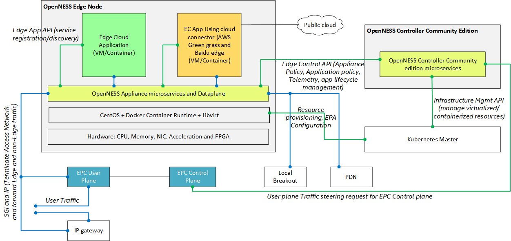
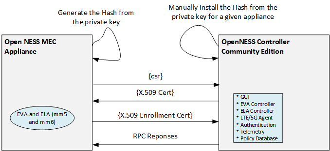
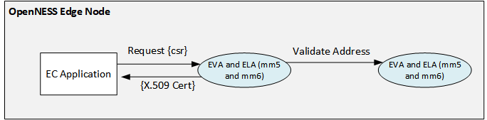
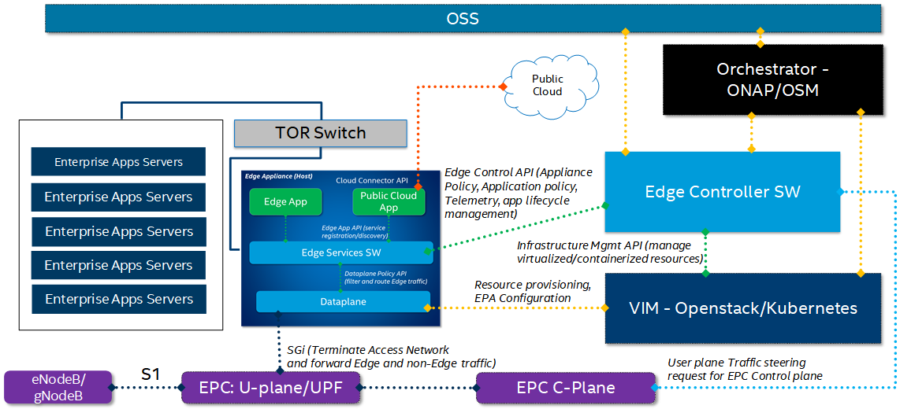
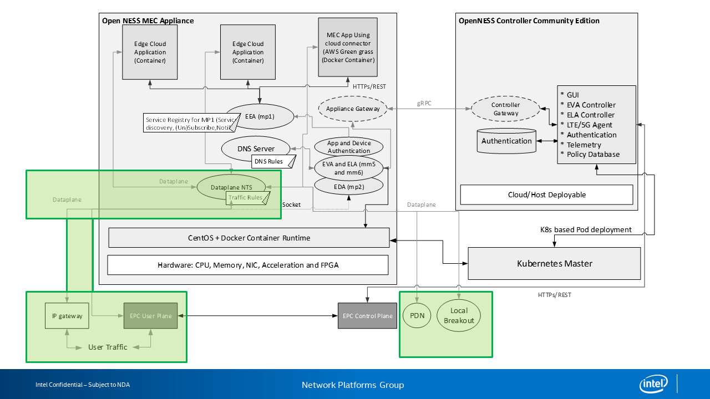
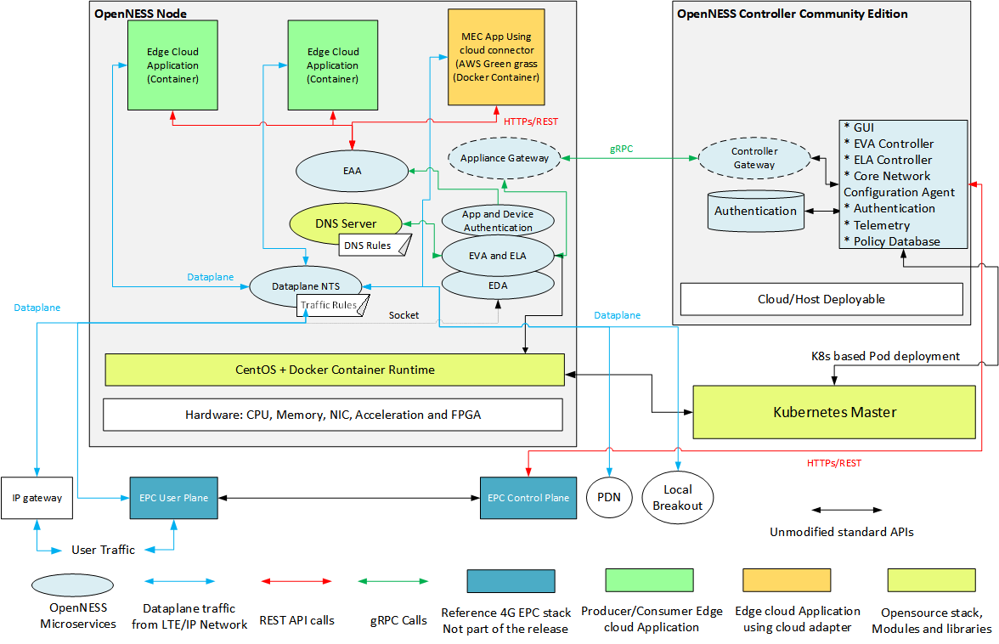
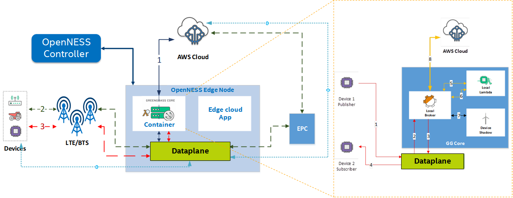
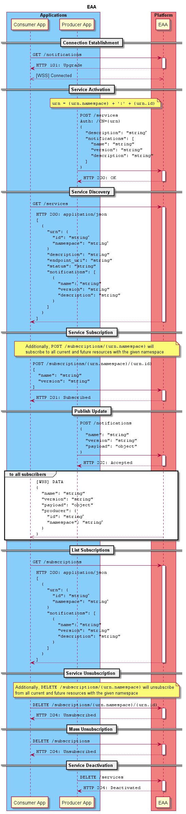
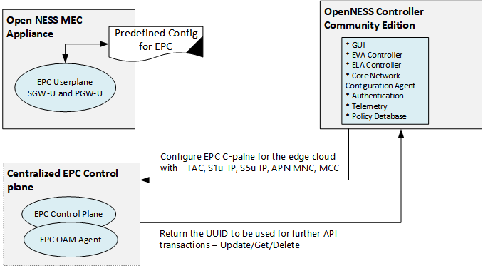

SPDX-License-Identifier: Apache-2.0    
Copyright © 2019 Intel Corporation and Smart-Edge.com, Inc.    

# OpenNESS Architecture and Solution overview
* [Introduction](#introduction)
* [Overview](#overview)
  * [OpenNESS Controller Community Edition](#openness-controller-community-edition)
  * [OpenNESS Edge Node](#openness-edge-node)
    * [Edge Application API support](#edge-application-api-support)
    * [Edge Compute Applications: Native](#edge-compute-applications-native)
    * [Edge Compute Applications: Local Breakout](#edge-compute-applications-local-breakout)
  * [Multi Access Support](#multi-access-support)
* [Deployment Scenarios](#deployment-scenarios)
    * [On-Premise Edge Deployment Scenario](#on-premise-edge-deployment-scenario)
    * [Network Edge Deployment Scenario](#network-edge-deployment-scenario)
* [OpenNESS Edge Node Applications](#openness-edge-node-applications)
    * [Edge Native Applications](#edge-native-applications)
        * [example of Producer and Consumer Applications](#example-of-producer-consumer-app)
    * [Local Breakout (LBO) Application](#local-breakout-application)
    * [Cloud Adapter Edge Application](#cloud-adapter-edge-application)
* [OpenNESS Microservices and APIs](#openness-microservices-and-apis)
    * [Edge Application APIs](#edge-application-apis)
    * [Edge Application Authentication APIs](#edge-application-authentication-apis)
    * [Edge Lifecycle Management APIs](#edge-lifecycle-management-apis)
    * [Edge Virtualization Infrastructure APIs](#edge-virtualization-infrastructure-apis)
    * [Core Network Configuration Agent APIs](#core-network-configuration-agent-apis)
    * [OPENNESS Controller APIs](#openness-controller-apis)
* [OpenNESS OS Environment](#openness-os-environment)

* [OpenNESS steps to get started](#openness-steps-to-get-started)
* [OpenNESS Repository Structure](#openness-repository-structure)
* [Key OpenNESS solution documentation](#key-openness-solution-documentation)  

##Introduction
OpenNESS is an open source software toolkit to enable easy orchestration and management of edge services across diverse network platform and access technologies in multi-cloud environments. It is inspired by the edge computing architecture defined by the ETSI Multi-access Edge Computing standards (e.g., [ETSI_MEC 003]), as well as the 5G network architecture ([3GPP_23501]).
 
It leverages major industry edge orchestration frameworks such as Kubernetes and OpenStack to implement a cloud-native architecture that is multi-platform, multi-access, and multi-cloud. It goes beyond these frameworks, however, by providing the ability for applications to publish their presence and capabilities on the platform, and for other applications to subscribe to those services. Services may be very diverse, from providing location and radio network information, to operating a computer vision system that finds objects of interest, such as pedestrians and cars, and serves the metadata from those objects to other applications that perform hazard notifications and other higher-level operations.
 
OpenNESS is access network agnostic, as it provides an architecture that interoperates with LTE, 5G, WiFi, and wired networks. In edge computing, dataplane flows must be routed to edge nodes with regard to physical location (e.g., proximity to the endpoint, system load on the edge node, special hardware requirements). OpenNESS provides APIs that allow network orchestrators and edge computing controllers to configure routing policies in a uniform manner.
 
Because it is an open source platform, OpenNESS enables operators, ISVs, and OSVs to innovate with new technologies and services. Field trials may be run with platforms implemented via OpenNESS, or functionality from the OpenNESS platform may be imported into existing third-party products.
  
## Overview
An OpenNESS subsystem consists of one or more OpenNESS Edge Nodes, and an OpenNESS Controller. 
The Edge Node hosts 
- Edge compute applications, 
- OpenNESS Edge Node Microservices that 
  - Manage applications across their lifecycles 
  - Steer dataplane traffic to Edge node applications 
  - Steering dataplane Traffic to local breakout (LBO) hosts that may be attached to the Edge Node. 
  
The Controller operates the Edge Nodes by invoking the Edge Node APIs, and in turn the Controller provides APIs to allow network Orchestrators to operate the OpenNESS subsystem. 

OpenNESS is intended for customers like Operators to conduct lab/field trials of edge compute in Network edge and On-Premise Edge, ISVs or OSVs to develop edge compute infrastructure solutions that take advantage of the goodness of COTS Architecture and Application developers who intend to develop applications for the edge, port the applications from public cloud to edge to take advantage of being closer to user. OpenNESS components could also be used as a middleware layer for enabling any NFVi platform hosting edge services.

OpenNESS based edge compute reference stack consists of one or more OpenNESS Edge node that hosts edge compute applications or serve as a local breakout servers and an edge compute OpenNESS controller (Community edition) that manages the OpenNESS edge compute nodes. 

Figure 1 - OpenNESS Architecture

The architecture of the OpenNESS Edge compute reference stack is described in greater detail in following subsections of this document.

OpenNESS reference edge stack combines the NFV infrastructure optimizations for Virtual machine and Container cloud on COTS Architecture (CPU,Memory,IO and Acceleration) from various opensource projects with essential amount of Edge compute specific APIs and network abstraction on to provide a unique and one-stop-shop development solution for edge compute. 

### OpenNESS Controller Community Edition
Throughput the rest of this document, “OpenNESS Controller Community Edition” will be referred to simply as “Controller” or “OpenNESS Controller”.
 
The OpenNESS Controller consists of a set of microservices that implement the following
functionality:
 
- Web UI front end: HTML5 based web front end for Administrator management of edge nodes.
- User account management: Create administrator and user accounts for edge node management. 
- Edge compute application image repository: Provide capability of uploading application images (in VM or container format) to the Controller. 
- Core Network Configuration: Configure the access network (e.g., LTE/CUPS, 5G) control plane. 
- Edge Node Lifecycle Management: support the Edge Node through its deployment lifecycle: 
  - Authentication and enrollment of Edge Nodes 
  - Configuration of interfaces and microservices on Edge Nodes 
  - Configuration of traffic policy for the interfaces including Local Breakout (LBO) interface 
- Edge Application Lifecycle Management: Support applications through their lifecycle: 
  - Deploy edge compute applications from the image repository 
  - Configure the Edge compute application specific Traffic policy 
  - Configure the Edge compute application specific DNS policy 
- Edge virtualization infrastructure management: Use underlying virtualization infrastructure, whether directly via libvirt or Docker, or indirectly via Kubernetes, to manage the Edge Node platform and applications. 
- Telemetry: Get basic edge compute microservices telemetry from connected Edge Nodes.
 
The Controller microservices make extensive use of the Go programming language and its runtime libraries.

The OpenNESS Controller addresses the essential functionalities of a multi-access edge orchestrator and MEC Platform manger as defined in the ETSI MEC Multi-access Edge Computing (MEC): Framework and Reference Architecture. 

### OpenNESS Edge Node
OpenNESS Edge Node consists of set of microservices that implements the following functionality to enable execution of edge compute applications natively on the edge node or forward the user traffic to applications running on platforms connected to the Edge Node on a Local Breakout. 

- Edge Application Enrolling: During the initial boot, connect to the designated OpenNESS Controller and request to enroll. This functionality is implemented in the ELA (Edge Lifecycle Agent) microservice. As part of enrolling, the Edge node is provided a TLS based certificate, which is used for further API communication. Figure 2 depicts this behavior. ELA is implemented using Go lang.
 
 
 
 Figure 2 - Edge Node Authentication and enrollment 

- Edge node interface configuration: During initial bootup, the Edge Node sends a map of the existing Network interfaces to the Controller to be configured as Upstream, Downstream or local breakout. This functionality is implemented in the ELA microservice. 
- DNS service: Support DNS resolution and forwarding services for the application deployed on the edge compute. DNS server is implemented based on Go DNS library. 
- Edge Node Virtualization infrastructure: Receive commands from the controller/NFV infrastructure mangers to start and stop Applications. This functionality is implemented in the EVA (Edge virtualization Agent) microservice and is implemented in Go lang. 
- Edge application traffic policy: Interface to set traffic policy for application deployed on the edge node. This functionality is implemented in the EDA (Edge Dataplane Agent) microservice and is implemented in Go lang. 
- Dataplane Service: Steers traffic towards applications running on the Edge Node or the Local Break-out Port, utilizing the Data Plane NTS (Network Transport Service), which runs on every Edge Node. It is implemented in C lang using DPDK for high performance IO.
  - Provide Reference ACL based Application specific packet tuple filtering 
  - Provide reference GTPU base packet learning for S1 deployment 
  - Provide reference Simultaneous IP and S1 deployment 
  - Provide Reference API for REST/grpc to C API 
  - Future enhancement of UE based traffic steering for authentication (not there now)
  - Reference implementation which does not depend on EPC implementation 
  - Reference Packet forwarding decision independent of IO
  - Implement KNI based interface to Edge applications running as Containers/POD 
  - Implement DPDK vHost user based interface to Edge applications running as Virtual Machine 
  - Implement Scatter and Gather in upstream and downstream 
- Application Authentication: Ability to authenticate Edge compute application deployed from Controller so that application can avail/call Edge Application APIs. Only application that intends to call the Edge Application APIs need to be authenticated. TLS certificate based Authentication is implemented. 

Figure 3 - OpenNESS Edge Compute Application Authentication 

Edge Services are deployed as Applications on the Edge Node can be classified into:  
- Producer Application: OpenNESS Producer application are edge compute application that provide services to other applications running on the edge compute platform. E.g. Location Services, Mapping Services, Transcoding Services, etc. 
- Consumer Application: OpenNESS Consumer application are edge compute application that serve end users traffic directly. E.g. CDN App, Augmented Reality App, VR Application, Infotainment Application, etc. 

#### Edge Application API support
Provide API endpoint for edge applications to avail edge services. This functionality is implemented in the EAA (Edge Application Agent) microservice and is implemented in Go lang. APIs are classified into:

| Edge Application API                     | Description                                                                                                                                                                                                                                                 | Example                                                                                                         |
|------------------------------------------|-------------------------------------------------------------------------------------------------------------------------------------------------------------------------------------------------------------------------------------------------------------|-----------------------------------------------------------------------------------------------------------------|
| Edge Service Activation/Deactivation     | This API endpoint enables a Producer App on the Edge node to register and activate on the Edge Node\. After this API execution the Producer App will be discoverable to Consumer Apps on the Edge Node\.                                                    | Location Service Producer app will call this API first after being deployed from the controller\.               |
| Edge Service Discovery                   | This API Endpoint enables Consumer application to discover all the active Producer Applications on the Edge Node\.                                                                                                                                          | A CDN App will be able to discover Location Service Application on the Edge Node\.                              |
| Edge Service Subscription/Unsubscription | This API Endpoint enables Consumer application to subscribe to Producer application service and notification updates\.                                                                                                                                      | A CDN application can subscribe to the Location Service application and Notification update from the service\.  |
| Edge Service Notification update         | This is a Web socket connection that needs to be created by a Consumer Application which intends to subscribe to services from Producer Applications\. This WebSocket will be used for push\-notification when there is update from Producer Application\.  | Location update is sent as Push Notification update to CDN Application\.                                        |
| Edge Service data update                 | This API endpoint enables Producer Application to publish the data to the Edge Node when it has a update to its service\.                                                                                                                                   |  Location Service Producer App publishes Location update of a user to the Edge Node\.                           |
| Edge Service list subscription           | This API endpoint allows Consumer Application to get the list of Producer Application services it has availed\.                                                                                                                                             | CDN Application can call this API to check if it has subscribed to Location and Transcoding services\.          |

- Edge Node telemetry: Utilizing the rsyslog all the OpenNESS microservices send the telemetry update which includes the logging and packet forwarding statistics data from dataplane. This is also the mechanism that is encouraged for OpenNESS users for Debugging and Troubleshooting. 

OpenNESS Edge Node Resource usage: 
- All non-critical/non-realtime microservices OpenNESS Edge node execute OS core typically Core 0.
- Dataplane NTS and DPDK PMD thread would need dedicated core/thread for high performance. 
  - DPDK library is used for the dataplane implementation 1G/2M hugepages support is required on the host. 

#### Edge Compute Applications: Native
OpenNESS supports execution of application on the Edge node as a VM/Container instance. This is typically the case when customers are looking for high density edge compute platforms with expectation of resource pooling across Edge Applications (in some cases Edge Applications co-existing with VNFs). OpenNESS supports both native edge compute apps and IOT Gateways to run as edge compute applications co-existing on the same platform with VNFs and share platform resources. 

#### Edge Compute Applications: Local Breakout
OpenNESS supports steering traffic to the applications that are already running on the customer IT infrastructure. Such applications are referred to as Applications on LBP (Local Breakout Port). In the diagram below the Edge node data plane is connected to a Local Breakout which is terminated on a Switch. There are Enterprise Application server that are running enterprise apps connected to the TOR. Users can use OpenNESS Controller to configure certain users application traffic to be steered to the Enterprise Application servers. This deployment removes restriction of creating Edge Compute Apps from scratch and reuse the existing Enterprise Application software and Hardware infrastructure. 

Figure 4 shows a possible deployment of LBP servers, in this case a rack of Enterprise App Servers routed through a Top-of-Rack (TOR) switch. 

Figure 4 - OpenNESS Native and LBP Applications
### Multi Access Support
OpenNESS supports traffic steering to applications already running on a customer IT infrastructure. The infrastructure is attached to the edge node via a Local Breakout Port (LBP), and traffic steering rules are defined to direct traffic to the LBP, rather than to an edge application running on the edge node.
 
OpenNESS may be deployed on LTE or IP (wireless or wireline) networks. The networking abstraction provided by the Edge Node Dataplane (See Figure 1 or Figure 4) abstracts the protocol differences of these technologies such that edge applications see only decapsulated IPv4 traffic. Microservices in the edge node provide the means of configuring the network and the edge platform dataplane to provide for traffic steering and any required encapsulation.
 
OpenNESS supports multiple deployment options on an LTE cellular network, as shown in Figure 5. Following [3GPP_23401], the edge node may be attached to the S1 interface from an eNB. In this mode, traffic is intercepted by the edge node dataplane, which either redirects the traffic to edge applications or passes it through an upstream EPC. In this option, arriving traffic is encapsulated in a GTP tunnel; the dataplane handles decapsulation/encapsulation as required.
 
Alternatively, the edge node may be attached to the SGi interface of an EPC. Traffic from the EPC arrives as IP traffic, and is steered as appropriate to edge applications. EPCs may combine the control or user plane, or they may follow the Control-User Plane Separation (CUPS) architecture of [3GPP_23214], which provides for greater flexibility in routing data plane traffic through the LTE network. 

Figure 5 - Edge Node Deployment with Access Networks

## Deployment Scenarios
The edge computing industry has devoted much effort to defining a taxonomy of edge computing deployment scenarios, based on physical location (e.g., street fixtures, central offices, data centers), logical location (e.g., on premises, far edge, near edge), and physical properties (e.g., end-to-end transmission latency). OpenNESS, as an open source platform, has taken the strategy of categorizing major characteristics of these deployment scenarios in terms of their impact on the design of a particular solution. Two primary deployment scenarios, On-Premise” and “Network Edge”, have been identified, and are described in the following sub-sections.

These scenarios are not hard-and-fast; an enterprise customer may have a special case in which a network edge deployment is appropriate, and a carrier may have a special case in which an on-premises deployment is appropriate.

### On-Premise Edge Deployment Scenario
The on-premise edge deployment scenario is depicted in Figure 6. In this scenario, edge nodes are located in a customer premise, which may be an office, factory, stadium, or other single-tenant facility.
 
An on-premise deployment is likely to have a single tenant, and is likely to be subordinate to an enterprise-wide IT infrastructure (e.g., a virtualization infrastructure manager, based on OpenStack, Kubernetes, or other technology, through which subsystems are deployed, but which was not architected specifically for edge computing).  It is likely to have strict latency requirements or environmental requirements that require an edge node to be located very close to the endpoints that it serves.
 
In this environment, it may not be necessary to add another level of infrastructure management; the OpenNESS Controller will have the capacity to directly manage its edge nodes directly, via libvirt or Docker.
 
The OpenNESS Controller may be hosted locally, or be hosted in an enterprise or public cloud to manage edge nodes in multiple physical locations.

Figure 6 - On-Premise Edge Deployment Scenario

### Network Edge Deployment Scenario
The network edge deployment scenario is depicted in Figure 7. In this scenario, edge nodes are located  in facilities owned by a network operator (e.g., a central office), and to be part of a data network including access network, core network, and edge computing infrastructure owned by a network operator. For economy of scale, this network is likely to be multi-tenant, and to be of very large scale (a national network operator may have thousands, or tens of thousands, of edge nodes). This network is likely to employ managed virtualization (e.g., OpenStack, Kubernetes) and be integrated with an operations and support system through which not only the edge computing infrastructure, but the network infrastructure, is managed.
 
In this environment, OpenNESS integrates with the virtualization infrastructure in use in the operator network; the OpenNESS Controller manages the edge nodes in its domain via the virtualization infrastructure.

Figure 7 - Network Edge Deployment Scenario

## OpenNESS Edge Node Applications
OpenNESS Applications can onboarded and provisioned on the edge node only through OpenNESS Controller. The first step in Onboarding involves uploading the application image to the controller through the web interface. Both VM and Container images are supported. 

OpenNESS application can be categorised in different ways depending on the scenarios. 

- Depending on the OpenNESS APIs support 
  - Applications calling EAA APIs for providing or consuming service on the edge compute along with servicing end-users traffic 
  - Applications not availing any services on the edge compute just servicing end-user traffic 

- Depending on the Application Execution platform 
  - Application running natively on Edge node in a VM/Container provisioned by the OpenNESS controller 
  - Application running on Local breakout not provisioned by the OpenNESS controller 

- Depending on the servicing the end-user traffic
  - Producer Application
  - Consumer Application 

### Producer Application
OpenNESS Producer application are edge compute application that provide services to other applications running on the edge compute platform. Producer applications do not serve end users traffic directly. They are sometime also referred to as Edge services. Here are some of the characteristics of a producer app.
- It is mandatory for all producer apps to authenticate and acquire TLS 
- All producer apps need to activate if the service provided by them needs to be discoverable by other edge applications 
- A producer application can have one or more fields for which it will provide notification update 

### Consumer Application 
OpenNESS Consumer application are edge compute application that serve end users traffic directly. Consumer applications might or might not subscribe to the services from other producer applications on the edge node. Here are some of the characteristics of a consumer app.
- It is not mandatory for consumer apps to authenticate if they don't wish to call EAA APIs.  
- A consumer application can subscribe to any number of services from producer apps. Future extension can implement entitlements to consumer apps to create access control lists. 
- Producer to Consumer update will use web socket for notification. If there is further data to be shared between producer and consumer other NFVi components like OVS/VPP/NIC-VF can be used for data transfer. 

The OpenNESS release includes reference producer and consumer applications.

Figure 8 - Example of Producer and Consumer Applications

The consumer application is based on OpenVINO [OpenVINO] (https://software.intel.com/en-us/openvino-toolkit)

- OpenVINO consumer app executes inference on input video stream
- OpenVINO producer app generates notifications to the consumer app for changing the inference model
- Video input stream is captured from a webcam installed on an Embedded Linux client device
- The annotated video is streamed out of the OpenNESS edge node back to the client device for further data analysis

### Cloud Adapter Edge compute Application
All the major Cloud Service providers are implementing frameworks to deploy edge applications that link back to their cloud via connectors. For example, Amazon Greengrass enables lambda functions to be deployed on the edge and connecting to the AWS cloud using the GreenGrass service. While it was originally intended to host this type of edge software on IoT gateways, the same framework can be utilized by Service Providers and Enterprises, to implement a multi-cloud strategy for their Edge Nodes.  

OpenNESS enables this approach by running the Greengrass Core (with the Edge software) as Edge applications on the Edge Node. They can run unchanged, or modified to utilize the EAA APIs to serve as Producer or Consumer apps on the edge Node. By running multiple cloud connector instances from different cloud service providers on the same edge node, a multi-cloud experience can be easily implemented. 

OpenNESS supports this by ability to deploy public cloud IOT gateways from cloud vendors like Amazon AWS IoT Greengrass and Baidu OpenEdge on edge compute platform. The existing IOT gateways can be migrated to OpenNESS as is or enhanced to call EAA APIs using extensions like Lambda functions. 

Figure 9 - Example of Cloud Adapter Edge Application in OpenNESS Platform

More details about running Baidu OpenEdge as OpenNESS application can be found here [Baidu OpenEdge  Edge Application](https://www.openness.org/resources). 

More details about running Amazon AWS IoT Greengrass as OpenNESS application can be found here  [Amazon AWS IoT Greengrass Edge Application](https://www.openness.org/resources). 

## OpenNESS Microservices and APIs

The OpenNESS Edge Node and Controller are each composed of a set of microservices that interact with each other, with applications, and with other network functions (e.g., infrastructure managers, orchestrators) to accomplish their functions. The microservices expose APIs over reference points, as shown in Figure 7.
 
Interaction between the OpenNESS Controller and the Edge Node is mediated by two gateway services, via Google Remote Procedure Calls (gRPC), a technology that provides reliable, high-performance RPC communication between microservices. APIs between Controller and Edge Node, and internal APIs among Edge Node microservices, are implemented via gRPC. For messages to and from applications, as well as to and from the Controller and the access network, are exposed as OpenAPI (i.e., REST-ful) APIs.
OpenNESS solution supports following APIs:
- Edge Application APIs
- Edge Application Authentication APIs
- Edge Lifecycle Management APIs
- Edge Virtualization Infrastructure APIs
- Core Network Configuration APIs for edge compute
- OpenNESS Controller APIs 

### Edge Application APIs
Edge Application APIs is implemented by the EAA. Edge Application APIs are important APIs for Edge application developers. EAA APIs are implemented as HTTPS REST. There are two types of use cases here. 
1. Porting of existing Public/Private Cloud application to the edge compute based on OpenNESS: This is the scenario when customers just want to run the existing apps in public cloud on OpenNESS edge without calling any APIs or changing code. In this case the only requirement is Application image (VM/Container) should be uploaded to the controller and provisioned on the Edge node using OpenNESS Controller. In this case the Application can not call any EAA APIs and consume services on the edge compute. It just services the end-user traffic. 
2. Native Edge compute Application calling EAA APIs: This is the scenario where customer want to develop Edge compute applications that take advantages of the Edge compute services resulting in more tactile application that responds to the changing user, network or resource scenarios. 

OpenNESS supports deployment both types of applications mentioned above. The Edge Application Agent is a service that runs on the edge node and operates as a discovery service and basic message bus between applications via pubsub. The connectivity and discoverability of applications by one another is governed by an entitlement system and is controlled by policies set with the OpenNESS Controller. The entitlement system is still in its infancy, however, and currently allows all applications on the executing edge node to discover one another as well as publish and subscribe to all notifications. The Figure 10 provides the sequence diagram of the supported APIs for the application 

More details about the APIs can be found here [Edge Application APIs](https://www.openness.org/resources) 

Figure 10 - Edge Application API Sequence Diagram

### Edge Application Authentication APIs
OpenNESS supports authentication of Edge compute apps that intend to call EAA APIs. Applications are authenticated by Edge node microservice issuing the requesting application a valid TLS certificate after validating the identity of the application. It is to be noted that in OpenNESS solution Application can only be provisioned by the OpenNESS controller. There are two categories of Applications as discussed above and here is the implication for the authentication. 
1. Existing pubic cloud application ported to OpenNESS: This is the scenario when customers just want to run the existing apps in public cloud on OpenNESS edge without calling any APIs or changing code. In this case the Application can not call any EAA APIs and consume services on the edge compute. It just services the end-user traffic. So the Application will not call authentication API to acquire a TLS certificate. 
2. Native Edge compute Application calling EAA APIs: This is the scenario where customer want to develop Edge compute applications that take advantages of the Edge compute services resulting in more tactile application that responds to the changing user, network or resource scenarios. Suck Application should first call authentication APIs and acquire TLS certificate. Authentication of Applications that provide services to other Applications on the edge compute (Producer Apps) is  mandatory.

For applications executing on the Local breakout the Authentication is not applicable since its not provisioned by the OpenNESS controller. 

Authentication APIs are implemented as HTTP REST APIs. 

More details about the APIs can be found here [Application Authentication APIs](https://www.openness.org/resources) 

### Edge Lifecycle Management APIs
ELA APIs are implemented by the ELA microservice on the edge node. The ELA runs on the Edge node and operates as a deployment and lifecycle service for Edge applications and VNFs (Virtual Network Functions) that are needed for Edge compute deployment like e.g. 4G EPC CUPS User plane and DNS server. It also provides network interface, network zone, and application/interface policy services.

ELA APIs are implemented over gRPC. For the purpose of visualization they are converted to json and can be found here [Edge Lifecycle Management APIs](https://www.openness.org/resources) 

### Edge Virtualization Infrastructure APIs
EVA APIs are implemented by the EVA microservice on the edge node. The EVA operates as a mediator between the infrastructure that the apps run on and the other edge components.

The EVA abstracts how applications were deployed, whether with native calls to the edge node or through an external orchestrator, such as Kubernetes for containerized apps. In order to achieve this, there is also a complementary EVA service running on the Controller that the edge node EVA service can call when the edge node was configured as a node/slave of an external orchestrator.

As an example, an RPC to list the running containers on the node can take two paths:

1. If the edge node is unorchestrated, then it can call the Docker daemon to get its response data.
2. If the edge node is orchestrated, then it can call the Controller EVA service which in turn will query the orchestrator for a list of containers on the requesting edge node.

EVA APIs are implemented over gRPC. For the purpose of visualization they are converted to json and can be found here [Edge Virtualization Infrastructure APIs](https://www.openness.org/resources) 

### Core Network Configuration APIs for edge compute 
As part of the OpenNESS reference edge stack the OpenNESS controller community edition is used for configuring the traffic policy for CUPS EPC to steer traffic towards the edge compute, This API is based on HTTP REST. Since 3GPP or ETSI MEC does not provide reference for these APIs various implementation of this Edge Controller to CUPS EPC might exist. OpenNESS has tried to take the approach of minimal changes to 3GPP CUPS EPC to achieve the edge compute deployment. OpenNESS and HTTP REST APIs to the EPC CUPS is a reference implementation so customers using OpenNESS can integrate their own HTTP REST APIs to the EPC CUPS into the OpenNESS Controller. Special care has been taken to make these components Modular microservices. The diagram below show the LTE environment that was used for testing OpenNESS edge compute end-to-end. 

Figure 11 - OpenNESS LTE end-to-end test setup for CUPS deplyment

OpenNESS Reference solution provides framework for managing multiple Edge nodes through centralized OpenNESS controller. In case of co-located EPC userplane and edge node deployment models, LTE user plane elements can be controlled through NFV infrastructure provided by OpenNESS reference solution. OpenNESS suggests HTTP based REST APIs to configure and manage the LTE userplane components through the centralized Edge controller. LTE network Operator’s Operation and Maintenance (OAM) elements can consume these APIs to open an interface for the Edge controllers to communicate for the management of userplane nodes launched at the Edge nodes. It is being implicitly understood that OAM agent communication with EPC core components is always an implementation dependent from vendor to vendor in different operator’s environments. 

Figure 12 - LTE EPC Configuration

More details about the APIs can be found here [Edge Application APIs](https://www.openness.org/resources). 

Whitepaper describing the details of the CUPS support in EPC can be found here [Edge Application APIs](https://www.openness.org/resources).

### OpenNESS Controller APIs
OpenNESS Controller APIs are important APIs for those managing one or many OpenNESS edge nodes. OpenNESS Controller APIs are called by the UI frontend and can be called by external orchestrators. These APIs allow centralized management of OpenNESS Edge nodes. The API enables a developer to maintain a list of OpenNESS Edge nodes, configure apps, manage policies and DNS, and more. The OpenNESS Controller API represents an abstraction layer for an operations administrator. While individual OpenNESS edge nodes may be managed singularly, the OpenNESS Controller API allows for management in a scalable way. Furthermore, it allows for secure communication to the many edge nodes.

The OpenNESS Controller API is implemented using HTTP REST.

## OpenNESS OS environment
OpenNESS Controller and Edge Node are developed and tested on CentOS 7.6. OpenNESS also depends on following opensource components:
Docker      
Libvirt    
Boost    
openssl     
qemu    
DPDK    
Ansible    
Oracle MySQL Server    
Amazon Web Services   
Go libraries          

Installation and configuration scripts will be provided to get the relevant version of the components to be installed on edge node and controller. 

## OpenNESS steps to get started
1. Review the OpenNESS Architecture and Solution overview of the OpenNESS solution (this document)
2. Acquire the supported hardware components for OpenNESS solution stack (Refer to the OpenNESS Edge node and Controller User Guide)
3. Clone the Controller, Edge Node, Application and Common github repos
4. Follow the README to build and set up Edge node (Refer to the OpenNESS Edge node User guide)
5. Follow the README to build and set up Controller (Refer to the OpenNESS Controller CE User guide)
6. Follow the README to build the reference Application (Refer to the OpenNESS Reference Application User guide)
7. Connect required Upstream, Downstream and Local breakout devices
8. Start the Controller and create Administrator user 
9. Start the Edge node and complete enrolment and Interface configuration 
10. Upload the Reference application image to the controller 
11. Provision the reference applications (Producer and Consumer) from the controller to the Edge node
12. Configure the traffic and DNS policy for the reference application
13. Check for traffic being served on the edge compute - monitor the telemetry for configured policy and packets in/out of the dataplane and application

## OpenNESS Repository Structure
- OpenNESS github root [OpenNESS Github link TBD](https://www.openness.org/resources)
  - edgenode [edgenode link TBD](https://www.openness.org/resources): Repository containing OpenNESS Edge Node microservices, dataplane, build, installation scripts and test. 
  - edgecontroller [edgecontroller link TBD](https://www.openness.org/resources): Repository containing OpenNESS Controller Community Edition microservices, webui, build, installation scripts and test. 
  - edgeapps [edgeapps link TBD](https://www.openness.org/resources): Repository containing Reference Edge compute applications built and tested using OpenNESS Solution APIs. This repo includes scripts for building and running IOT gateways based on Amazon AWS IoT Greengrass and Baidu OpenEdge as Edge compute Apps on OpenNESS. 
  - specs [specs link TBD](https://www.openness.org/resources): Repository containing architecture, usage and implementation documentation of key components in the OpenNESS Edge compute solution. 
  - test [test link TBD](https://www.openness.org/resources): Repository containing integration tests of key components in the OpenNESS Edge compute solution. 
  - common [common link TBD](https://www.openness.org/resources): Repository containing some of the common libraries, packages that are common to OpenNESS Edge Node and OpenNESS Controller Community Edition. 
  - epcforedge [epcforedge link TBD](https://www.openness.org/resources): Repository containing reference implementations and reference APIs of some of the EPC components that enable Edge compute Solution. 

## Key OpenNESS solution documentation 
- OpenNESS Architecture and Solution overview [OpenNESS Architecture and Solution overview link TBD](https://www.openness.org/resources): Current Document. 
- OpenNESS Edge Node User guide [OpenNESS Edge Node User guide link TBD](https://www.openness.org/resources): User guide for OpenNESS Edge Node with installation and getting started  instructions. 
- OpenNESS Controller Community Edition User guide [OpenNESS Controller Community Edition User Guide link TBD](https://www.openness.org/resources): User guide for OpenNESS Controller Community Edition with installation and getting started instructions. 
- OpenNESS Reference Application User guide [OpenNESS Reference Application User guide link TBD](https://www.openness.org/resources): User guide for running Reference OpenNESS application based on OpenVINO as OpenNESS Edge compute application. 
- OpenNESS Amazon AWS IoT Greengrass application note [OpenNESS Amazon AWS IoT Greengrass application note link TBD](https://www.openness.org/resources): User guide for running Amazon AWS IoT Greengrass as Edge compute Apps on OpenNESS. 
- OpenNESS Baidu Cloud application note [OpenNESS Baidu Cloud application note link TBD](https://www.openness.org/resources): User guide for running Baidu OpenEdge as Edge compute Apps on OpenNESS. 

##Other References
- [3GPP_23401]	3rd Generation Partnership Project; Technical Specification Group Services and System Aspects; General Packet Radio Service (GPRS) enhancements for Evolved Universal Terrestrial Radio Access Network  (E-UTRAN) access.     
- [3GPP_23214]	3rd Generation Partnership Project; Technical Specification Group Services and System Aspects; Architecture enhancements for control and user plane separation of EPC nodes; Stage 2.
- [ETSI_MEC 003]  ETSI GS MEC 003 V2.1.1 Multi-access Edge Computing (MEC): Framework and Reference Architecture     
- [ETSI_23501] 5G; System Architecture for the 5G System (3GPP TS 23.501 version 15.2.0 Release 15), ETSI TS 123 501     

