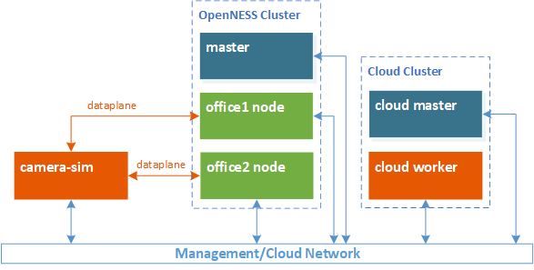

```text
SPDX-License-Identifier: Apache-2.0
Copyright (c) 2019-2020 Intel Corporation
```
<!-- omit in toc -->
# Network Edge Applications Onboarding
- [Introduction](#introduction)
- [Installing OpenNESS](#installing-openness)
- [Building applications](#building-applications)
  - [Building sample application images](#building-sample-application-images)
  - [Building the OpenVINO application images](#building-the-openvino-application-images)
- [Onboarding sample application](#onboarding-sample-application)
  - [Prerequisites](#prerequisites)
  - [Verifying image availability](#verifying-image-availability)
  - [Applying Kubernetes network policies](#applying-kubernetes-network-policies)
  - [Deploying consumer and producer sample application](#deploying-consumer-and-producer-sample-application)
- [Onboarding OpenVINO application](#onboarding-openvino-application)
  - [Prerequisites](#prerequisites-1)
  - [Setting up networking interfaces](#setting-up-networking-interfaces)
  - [Deploying the Application](#deploying-the-application)
  - [Applying Kubernetes network policies](#applying-kubernetes-network-policies-1)
  - [Setting up Edge DNS](#setting-up-edge-dns)
  - [Starting traffic from Client Simulator](#starting-traffic-from-client-simulator)
- [Onboarding Smart City sample application](#onboarding-smart-city-sample-application)
  - [Setting up networking interfaces](#setting-up-networking-interfaces-1)
  - [Building Smart City ingredients](#building-smart-city-ingredients)
  - [Running Smart City](#running-smart-city)
  - [Inter application communication](#inter-application-communication)
- [Enhanced Platform Awareness](#enhanced-platform-awareness)
- [VM support for Network Edge](#vm-support-for-network-edge)
- [Troubleshooting](#troubleshooting)
  - [Useful Commands:](#useful-commands)

# Introduction
This document aims to familiarize users with the Open Network Edge Services Software (OpenNESS) application on-boarding process for the Network Edge. This document provides instructions on how to deploy an application from the Edge Controller to Edge Nodes in the cluster; it also provides sample deployment scenarios and traffic configuration for the application. The applications will be deployed from the Edge Controller via the Kubernetes `kubectl` command-line utility. Sample specification files for application onboarding are also provided.

# Installing OpenNESS
The following application onboarding steps assume that OpenNESS was installed through [OpenNESS playbooks](../getting-started/openness-cluster-setup.md).

# Building applications
Users must provide the application to be deployed on the OpenNESS platform for Network Edge. The application must be provided in a Docker\* image format that is available either from an external Docker repository (Docker Hub) or a locally built Docker image. The image must be available on the Edge Node, which the application will be deployed on.

> **Note**: The Harbor registry setup is out of scope for this document. If users already have a docker container image file and would like to copy it to the node manually, they can use the `docker load` command to add the image. The success of using a pre-built Docker image depends on the application dependencies that users must know.

The OpenNESS [edgeapps](https://github.com/open-ness/edgeapps) repository provides images for OpenNESS supported applications. Pull the repository to your Edge Node to build the images.

This document explains the build and deployment of two applications:
1. Sample application: a simple “Hello, World!” reference application for OpenNESS
2. OpenVINO™ application: A close to real-world inference application

## Building sample application images
The sample application is available in [the edgeapps repository](https://github.com/open-ness/edgeapps/tree/master/applications/sample-app); further information about the application is contained within the `Readme.md` file.

The following steps are required to build the sample application Docker images for testing the OpenNESS Edge Application Agent (EAA) with consumer and producer applications:

1. To build the application binaries and Docker images run make:
   ```
   make
   make build-docker
   ```
2. Check that the images are built successfully and available in the local Docker image registry:
   ```
   docker images | grep producer
   docker images | grep consumer
   ```
## Building the OpenVINO application images
The OpenVINO application is available in [the EdgeApps repository](https://github.com/open-ness/edgeapps/tree/master/applications/openvino); further information about the application is contained within `Readme.md` file.

The following steps are required to build the sample application Docker images for testing OpenVINO consumer and producer applications:

1. To build the producer application image from the application directory, navigate to the `./producer` directory and run:
   ```
   ./build-image.sh
   ```
>**Note**: Only CPU inference support is currently available for OpenVINO application on OpenNESS Network Edge. The environmental variable `OPENVINO_ACCL` must be set to `CPU` within the Dockerfile available in the directory.

2. To build the consumer application image from the application directory, navigate to the `./consumer` directory and run:
   ```
   ./build-image.sh
   ```
3. Check that the image builds are successful and available in the local Docker image registry:
   ```
   docker images | grep openvino-prod-app
   docker images | grep openvino-cons-app
   ```

Additionally, an application to generate sample traffic is provided. The application should be built on a separate host, which generates the traffic.

1. To build the client simulator application image from the application directory, navigate to the `./clientsim` directory and run:
   ```
   ./build-image.sh
   ```
2. Check that the image build is successful and available in the local Docker image registry:
   ```
   docker images | grep client-sim
   ```

# Onboarding sample application
This section guides users through the complete process of onboarding a sample application and testing the EAA functionality of OpenNESS for the Network Edge. This process outlines how to start the application, setup network policies, and verify functionality.

## Prerequisites

* OpenNESS for Network Edge is fully installed and set up.
* Docker images for the sample application consumer and producer are available on Edge Node.

## Verifying image availability

To verify that the images for sample application consumer and producer are [built](#building-sample-application-images) and available on the Edge Node run:
   ```
   docker image list | grep producer
   docker image list | grep consumer
   ```

## Applying Kubernetes network policies
Kubernetes NetworkPolicy is a mechanism that enables control over how pods are allowed to communicate with each other and other network endpoints. By default, in the Network Edge environment, all *ingress* traffic is blocked (services running inside of deployed applications are not reachable) and all *egress* traffic is enabled (pods can reach the internet).

1. To apply a network policy for the sample application allowing ingress traffic, create a `sample_policy.yml` file that specifies the network policy (in the example network policy `cidr` field contains Calico CNI cidr; for other CNI use specific CNI cidr, e.g. for Kube-ovn CNI use `10.16.0.0/16`):
   ```yml
   apiVersion: networking.k8s.io/v1
   kind: NetworkPolicy
   metadata:
     name: eaa-prod-cons-policy
     namespace: default
   spec:
     podSelector: {}
     policyTypes:
     - Ingress
     ingress:
     - from:
       - ipBlock:
           cidr: 10.245.0.0/16
       ports:
       - protocol: TCP
         port: 80
       - protocol: TCP
         port: 443
   ```
2. Apply the network policy:
   ```
   kubectl apply -f sample_policy.yml
   ```

## Deploying consumer and producer sample application

>**NOTE**: The producer application must be deployed before the consumer application. Also, the applications must be deployed within a short time of each other as they have a limited lifespan.
<!-- what is the “short time”? Approximately how many seconds? Minutes? -->
1. To deploy a sample producer application, create the following `sample_producer.yml` pod specification file.
   ```yml
   ---
   apiVersion: v1
   kind: ServiceAccount
   metadata:
     name: producer

   ---
   kind: ClusterRoleBinding
   apiVersion: rbac.authorization.k8s.io/v1
   metadata:
     name: producer-csr-requester
   roleRef:
     apiGroup: rbac.authorization.k8s.io
     kind: ClusterRole
     name: csr-requester
   subjects:
     - kind: ServiceAccount
       name: producer
       namespace: default

   ---
   apiVersion: v1
   kind: ConfigMap
   metadata:
     name: producer-csr-config
   data:
     certrequest.json: |
       {
           "CSR": {
               "Name": "producer",
               "Subject": {
                   "CommonName": "ExampleNamespace:ExampleProducerAppID"
               },
               "DNSSANs": [],
               "IPSANs": [],
               "KeyUsages": [
                   "digital signature", "key encipherment", "client auth"
               ]
           },
           "Signer": "openness.org/certsigner",
           "WaitTimeout": "5m"
       }

   ---
   apiVersion: apps/v1
   kind: Deployment
   metadata:
     name: producer
     labels:
       app: producer
   spec:
     replicas: 1
     selector:
       matchLabels:
         app: producer
     template:
       metadata:
         labels:
           app: producer
       spec:
         securityContext:
           runAsUser: 1000
           runAsGroup: 3000
         serviceAccountName: producer
         initContainers:
           - name: alpine
             image: alpine:latest
             command: ["/bin/sh"]
             args: ["-c", "cp /root/ca-certrequester/cert.pem /root/certs/root.pem"]
             imagePullPolicy: IfNotPresent
             securityContext:
               runAsUser: 0
               runAsGroup: 0
             resources:
               requests:
                 cpu: "0.1"
               limits:
                 cpu: "0.1"
                 memory: "128Mi"
             volumeMounts:
               - name: ca-certrequester
                 mountPath: /root/ca-certrequester
               - name: certs
                 mountPath: /root/certs
           - name: certrequester
             image: certrequester:1.0
             args: ["--cfg", "/home/certrequester/config/certrequest.json"]
             imagePullPolicy: Never
             resources:
               requests:
                 cpu: "0.1"
               limits:
                 cpu: "0.1"
                 memory: "128Mi"
             volumeMounts:
               - name: config
                 mountPath: /home/certrequester/config/
               - name: certs
                 mountPath: /home/certrequester/certs/
         containers:
           - name: producer
             image: producer:1.0
             imagePullPolicy: Never
             volumeMounts:
               - name: certs
                 mountPath: /home/sample/certs/
             ports:
               - containerPort: 443
         volumes:
           - name: config
             configMap:
               name: producer-csr-config
           - name: ca-certrequester
             secret:
               secretName: ca-certrequester
           - name: certs
             emptyDir: {}
   ```
2. Deploy the pod:
   ```
   kubectl create -f sample_producer.yml
   ```
3. Accept the producer's CSR:
   ```
   kubectl certificate approve producer
   ```
4. Check that the pod is running:
   ```
   kubectl get pods | grep producer
   ```
5. Verify logs of the sample application producer:
   ```
   kubectl logs <producer_pod_name> -f

   Expected output:
   The Example Producer eaa.openness  [{ExampleNotification 1.0.0 Description for Event #1 by Example Producer}]}]}
   Sending notification
   ```
6. Verify logs of EAA
   ```
   kubectl logs <eaa_pod_name> -f -n openness

   Expected output:
   RequestCredentials  request from CN: ExampleNamespace:ExampleProducerAppID, from IP: <IP_ADDRESS> properly handled
   ```
7. To deploy a sample consumer application, create the following `sample_consumer.yml` pod specification file.
   ```yml
   ---
   apiVersion: v1
   kind: ServiceAccount
   metadata:
     name: consumer

   ---
   kind: ClusterRoleBinding
   apiVersion: rbac.authorization.k8s.io/v1
   metadata:
     name: consumer-csr-requester
   roleRef:
     apiGroup: rbac.authorization.k8s.io
     kind: ClusterRole
     name: csr-requester
   subjects:
     - kind: ServiceAccount
       name: consumer
       namespace: default

   ---
   apiVersion: v1
   kind: ConfigMap
   metadata:
     name: consumer-csr-config
   data:
     certrequest.json: |
       {
           "CSR": {
               "Name": "consumer",
               "Subject": {
                   "CommonName": "ExampleNamespace:ExampleConsumerAppID"
               },
               "DNSSANs": [],
               "IPSANs": [],
               "KeyUsages": [
                   "digital signature", "key encipherment", "client auth"
               ]
           },
           "Signer": "openness.org/certsigner",
           "WaitTimeout": "5m"
       }

   ---
   apiVersion: apps/v1
   kind: Deployment
   metadata:
     name: consumer
     labels:
       app: consumer
   spec:
     replicas: 1
     selector:
       matchLabels:
         app: consumer
     template:
       metadata:
         labels:
           app: consumer
       spec:
         securityContext:
           runAsUser: 1000
           runAsGroup: 3000
         serviceAccountName: consumer
         initContainers:
           - name: alpine
             image: alpine:latest
             command: ["/bin/sh"]
             args: ["-c", "cp /root/ca-certrequester/cert.pem /root/certs/root.pem"]
             imagePullPolicy: IfNotPresent
             securityContext:
               runAsUser: 0
               runAsGroup: 0
             resources:
               requests:
                 cpu: "0.1"
               limits:
                 cpu: "0.1"
                 memory: "128Mi"
             volumeMounts:
               - name: ca-certrequester
                 mountPath: /root/ca-certrequester
               - name: certs
                 mountPath: /root/certs
           - name: certrequester
             image: certrequester:1.0
             args: ["--cfg", "/home/certrequester/config/certrequest.json"]
             imagePullPolicy: Never
             resources:
               requests:
                 cpu: "0.1"
               limits:
                 cpu: "0.1"
                 memory: "128Mi"
             volumeMounts:
               - name: config
                 mountPath: /home/certrequester/config/
               - name: certs
                 mountPath: /home/certrequester/certs/
         containers:
           - name: consumer
             image: consumer:1.0
             imagePullPolicy: Never
             volumeMounts:
               - name: certs
                 mountPath: /home/sample/certs/
             ports:
               - containerPort: 443
         volumes:
           - name: config
             configMap:
               name: consumer-csr-config
           - name: ca-certrequester
             secret:
               secretName: ca-certrequester
           - name: certs
             emptyDir: {}
   ```
8. Deploy the pod:
   ```
   kubectl create -f sample_consumer.yml
   ```
9. Accept the consumer's CSR:
   ```
   kubectl certificate approve consumer
   ```
10. Check that the pod is running:
   ```
   kubectl get pods | grep consumer
   ```
11. Verify logs of the sample application consumer:
   ```
   kubectl logs <consumer_pod_name> -f

   Expected output:
   Received notification
   ```
12. Verify logs of EAA
    ```
    kubectl logs <eaa_pod_name> -f

    Expected output:
    RequestCredentials  request from CN: ExampleNamespace:ExampleConsumerAppID, from IP: <IP_ADDRESS> properly handled
    ```
# Onboarding OpenVINO application
This section guides users through the complete process of onboarding the OpenVINO producer and consumer applications. This process will also guide the user on setting up a network connection between Client Simulator (Traffic Generator), setting up network policies, and testing the application. The following sub-sections should be executed step by step.

## Prerequisites

* OpenNESS for Network Edge is fully installed and set up (kubeovn as cni to support Interfaceservice which is openness developed kubectl plugin.).
* The Docker images for OpenVINO are available on the Edge Node.
* A separate host used for generating traffic via Client Simulator is set up.
* The Edge Node host and traffic generating host are connected point to point via unused physical network interfaces.
* The Docker image for the Client Simulator application is available on the traffic generating host.

## Setting up networking interfaces

1. On the traffic generating host setup to run Client Simulator, configure the network interface connected to Edge Node host. External client traffic in the OpenNESS Network Edge configuration is routed via 192.168.1.1, the IP address of traffic generating host must be one from the same subnet. Configure the routing accordingly:
   ```
   ip a a 192.168.1.10/24 dev <client_interface_name>
   route add -net 10.16.0.0/24 gw 192.168.1.1 dev <client_interface_name>
   ```

   >**NOTE**: The subnet `192.168.1.0/24` is allocated by the Ansible\* playbook to the physical interface that is attached to the first edge node. The second edge node joined to the cluster is allocated to the next subnet `192.168.2.0/24` and so on.

   > **NOTE:** To identify which subnet is allocated to which node, use the following command:
   >  ```shell
   >  $ kubectl get subnets
   >  NAME             PROTOCOL   CIDR             PRIVATE   NAT     DEFAULT   GATEWAYTYPE   USED   AVAILABLE
   >  jfsdm001-local   IPv4       192.168.1.0/24   false     false   false     distributed   0      255
   >  jfsdm002-local   IPv4       192.168.2.0/24   false     false   false     distributed   0      255
   >  ...
   >  ```
   >
   > The list presents which subnet (CIDR) is bridged to which edge node. For example, node `jfsdm001` is bridged to subnet `192.168.1.0/24` and node `jfsdm002` is bridged to subnet `192.168.2.0/24`

   > **NOTE:** Ingress traffic originating from `192.168.1.0/24` can *only* reach the pods deployed on `jfsdm001`, and similarly, for `192.168.2.0/24` can reach the pods deployed on `jfsdm002`.

2. From the Edge Controller, set up the interface service to connect the Edge Node's physical interface used for the communication between Edge Node and the traffic generating host to OVS. This allows the Client Simulator to communicate with the OpenVINO application K8s Pod located on the Edge Node (sample output separated by `"..."`, where the PCI Bus Function ID of the interface used my vary).
   ```
   kubectl interfaceservice get <edge_node_host_name>
   ...
   0000:86:00.0  |  3c:fd:fe:b2:42:d0  |  detached
   ...

   kubectl interfaceservice attach <edge_node_host_name> 0000:86:00.0
   ...
   Interface: 0000:86:00.0 successfully attached
   ...

   kubectl interfaceservice get <edge_node_host_name>
   ...
   0000:86:00.0  |  3c:fd:fe:b2:42:d0  |  attached
   ...
   ```

## Deploying the Application

1. An application `yaml` specification file for the OpenVINO producer that is used to deploy the K8s pod can be found in the Edge Apps repository at [./applications/openvino/producer/openvino-prod-app.yaml](https://github.com/open-ness/edgeapps/blob/master/applications/openvino/producer/openvino-prod-app.yaml). The pod will use the Docker image, which must be [built](#building-openvino-application-images) and available on the platform. Deploy the producer application by running:
   ```
   kubectl apply -f openvino-prod-app.yaml
   kubectl certificate approve openvino-prod-app
   ```
2. An application `yaml` specification file for the OpenVINO consumer that is used to deploy K8s pod can be found in the Edge Apps repository at [./applications/openvino/consumer/openvino-cons-app.yaml](https://github.com/open-ness/edgeapps/blob/master/applications/openvino/consumer/openvino-cons-app.yaml). The pod will use the Docker image, which must be [built](#building-openvino-application-images) and available on the platform. Deploy the consumer application by running:
   ```
   kubectl apply -f openvino-cons-app.yaml
   kubectl certificate approve openvino-cons-app
   ```
3. Verify that no errors show up in the logs of the OpenVINO consumer application:
   ```
   kubectl logs openvino-cons-app
   kubectl get po -o custom-columns=NAME:.metadata.name,IP:.status.podIP | grep cons-app | awk '{print $2}'
   <ip>
   ```

## Applying Kubernetes network policies
The Kubernetes NetworkPolicy is a mechanism that enables control over how pods are allowed to communicate with each other and other network endpoints.

By default, in a Network Edge environment, all *ingress* traffic is blocked (services running inside of deployed applications are not reachable) and all *egress* traffic is enabled (pods can reach the Internet). The following NetworkPolicy definition is used:
   ```yaml
   apiVersion: networking.k8s.io/v1
   metadata:
     name: block-all-ingress
     namespace: default        # selects default namespace
   spec:
     podSelector: {}           # matches all the pods in the default namespace
     policyTypes:
     - Ingress
     ingress: []               # no rules allowing ingress traffic = ingress blocked
   ```

>**NOTE**: When adding the first egress rule, all egress is blocked except for that rule.

1. To deploy a Network Policy allowing ingress traffic on port 5000 (tcp and udp) from 192.168.1.0/24 network to the OpenVINO consumer application pod, create the following specification file for this Network Policy:
   ```yaml
   apiVersion: networking.k8s.io/v1
   kind: NetworkPolicy
   metadata:
     name: openvino-policy
     namespace: default
   spec:
     podSelector:
       matchLabels:
         app: openvino-cons-app
     policyTypes:
     - Ingress
     ingress:
     - from:
       - ipBlock:
           cidr: 192.168.1.0/24
       ports:
       - protocol: TCP
         port: 5000
       - protocol: UDP
         port: 5000
   ```
2. Create the network policy:
   ```
   kubectl apply -f network_policy.yml
   ```

## Setting up Edge DNS
Edge DNS enables the user to resolve addresses of Edge Applications using domain names.
The following is an example of how to set up DNS resolution for OpenVINO consumer application.

1. Find Edge DNS pod:
   ```
   kubectl get pods -n openness | grep edgedns
   ```
2. Get the IP address of the Edge DNS pod and take note of it (this will be used to [allow remote host](#Starting-traffic-from-Client-Simulator) to access Edge DNS):
   ```
   kubectl exec -it <edgedns-pod-name> -n openness ip a
   ```
3. Create a file `openvino-dns.json` specifying the Edge DNS entry for the OpenVINO consumer application (where `10.16.0.10` is the IP address of the OpenVINO consumer application – change accordingly):
   ```yaml
   {
     "record_type":"A",
     "fqdn":"openvino.openness",
     "addresses":["10.16.0.10"]
   }
   ```
4. Apply the Edge DNS entry for the application:
   ```
   kubectl edgedns set <edge_node_host_name> openvino-dns.json
   ```

## Starting traffic from Client Simulator

1. Configure nameserver to allow a connection to Edge DNS (confirm that `openvino.openness` is not defined in `/etc/hosts`). Modify `/etc/resolv.conf` and add IP address of [Edge DNS server](#Setting-up-Edge-DNS).
   ```
   vim /etc/resolv.conf

   Add to the file:
   nameserver <edge_dns_ip_address>
   ```
2. Verify that `openvino.openness` is correctly resolved (“ANSWER” section should contain IP of Consumer pod IP).
   ```
   dig openvino.openness
   ```
3. On the traffic generating host build the image for the [Client Simulator](#building-openvino-application-images)
4. Run the following from [edgeapps/applications/openvino/clientsim](https://github.com/open-ness/edgeapps/blob/master/applications/openvino/clientsim/run-docker.sh) to start the video traffic via the containerized Client Simulator. A graphical user environment is required to view the results of the returning augmented videos stream.
   ```
   ./run_docker.sh
   ```

> **NOTE**: If a problem is encountered when running the `client-sim ` docker as `Could not initialize SDL - No available video device`. Disable SELinux through this command:
>  ```shell
>  $ setenforce 0
>  ```

> **NOTE:**  If the video window is not popping up and/or an error like `Could not find codec parameters for stream 0` appears, do the following: 1) check whether receive traffic on port `5001` via tcpdump 2) add a rule in the firewall to permit ingress traffic on port `5001` if observe `host administratively prohibited`:
<!-- if you observe the message `host administratively…`?-->
>  ```shell
>  firewall-cmd --permanent --direct --add-rule ipv4 filter INPUT 0 -p udp --dport 5001 -j ACCEPT
>  firewall-cmd --reload
>  ```
> or directly shutdown firewall as
>  ```shell
>  systemctl stop firewalld.service
>  ```


# Onboarding Smart City sample application

The Smart City sample application is built on the OpenVINO and Open Visual Cloud (OVC) software stacks for media processing and analytics. It simulates regional offices that aggregate multiple (simulated) IP cameras and associated analytics. Each simulated office is deployed on an edge node. The sample app demonstrates the ability to reduce latency by running the media processing and analytics workloads on edge nodes.

The full pipeline of the Smart City sample application on OpenNESS is distributed across three regions:

 1. Client-side Cameras Simulator(s)
 2. OpenNESS Cluster
 3. Smart City Cloud Cluster

The Smart City setup with OpenNESS should typically be deployed as shown in this Figure. The drawing depicts two offices but there is no limitation to the number of offices.



_Figure - Smart City Setup with OpenNESS_


## Setting up networking interfaces

> **NOTE**: At the time of writing this guide, there was no [Network Policy for Kubernetes](https://kubernetes.io/docs/concepts/services-networking/network-policies/) defined yet for the Smart City application. Therefore, users are advised to remove the default OpenNESS network policies with the following command:
> ```shell
> kubectl delete netpol block-all-ingress cdi-upload-proxy-policy
> ```

From the OpenNESS Controller, attach the physical ethernet interface to be used for dataplane traffic using the `interfaceservice` kubectl plugin by providing the office hostname and the PCI Function ID corresponding to the ethernet interface (the PCI ID below is just a sample and may vary on other setups):
```shell
kubectl interfaceservice get <officeX_host_name>
...
0000:86:00.0  |  3c:fd:fe:b2:42:d0  |  detached
...

kubectl interfaceservice attach <officeX_host_name> 0000:86:00.0
...
Interface: 0000:86:00.0 successfully attached
...

kubectl interfaceservice get <officeX_host_name>
...
0000:86:00.0  |  3c:fd:fe:b2:42:d0  |  attached
...
```

> **NOTE:** When adding office 2 and so on, attach their corresponding physical interfaces accordingly.

## Building Smart City ingredients

   1. Clone the Smart City Reference Pipeline source code from [GitHub](https://github.com/OpenVisualCloud/Smart-City-Sample.git) to the following: 1) Camera simulator machines, 2) OpenNESS Controller machine, and 3) Smart City cloud control plane machine.

   2. Build the Smart City application on all of the machines as explained in [Smart City deployment on OpenNESS](https://github.com/OpenVisualCloud/Smart-City-Sample/tree/openness-k8s/deployment/openness). At least 2 offices (edge nodes) must be installed on OpenNESS.

## Running Smart City

   1. On the Camera simulator machines, assign an IP address to the ethernet interface which the dataplane traffic will be transmitted through to the edge office1 and office2 nodes:

      On camera-sim1:
      ```shell
      ip a a 192.168.1.10/24 dev <office1_interface_name>
      route add -net 10.16.0.0/24 gw 192.168.1.1 dev <office1_interface_name>
      ```

      > **NOTE**: When adding office 2 and so on, change the CIDR (i.e: `192.168.1.0/24`) to the corresponding subnet. Allocated subnets to individual offices can be retrieved by entering the following command in the OpenNESS controller shell:
      > ```shell
      > kubectl get subnets
      > ```
      >
      > The subnet name represents the node which is allocated to it and appended with `-local`.


      On camera-sim2:
      ```shell
      ip a a 192.168.2.10/24 dev <office2_interface_name>
      route add -net 10.16.0.0/24 gw 192.168.2.1 dev <office2_interface_name>
      ```

   2. On the Camera simulator machines, run the camera simulator containers:
      ```shell
      make start_openness_camera
      ```

   3. On the Smart City cloud control-plane machine, run the Smart City cloud containers:
       ```shell
       make start_openness_cloud
       ```

       > **NOTE**: At the time of writing this guide, there were no firewall rules defined for the camera simulators and Smart City cloud containers. If none are defined, the firewall must be stopped or disabled before continuing. All communication back to the office nodes will be blocked. Run the following command on both machines.
       > ```shell
       > systemctl stop firewalld
       > ```

       > **NOTE**: Do not stop the firewall on OpenNESS nodes.

   4. On the OpenNESS Controller machine, build and run the Smart City cloud containers:
       ```shell
       export CAMERA_HOSTS=192.168.1.10,192.168.2.10
       export CLOUD_HOST=<cloud-control-plane-ip>

       make
       make update
       make start_openness_office
      ```

       > **NOTE**: `<cloud-control-plane-ip>` is where the Smart City cloud control plane machine can be reached on the management/cloud network.

   5. From the web browser, launch the Smart City web UI at the URL `https://<cloud-control-plane-ip>/`

## Inter application communication
The IAC is available via the default overlay network used by Kubernetes - Kube-OVN.

For more information on Kube-OVN, refer to the Kube-OVN support in OpenNESS [documentation](../building-blocks/dataplane/openness-interapp.md#interapp-communication-support-in-openness-network-edge)

# Enhanced Platform Awareness
Enhanced platform awareness (EPA) is supported in OpenNESS via the use of the Kubernetes NFD plugin. This plugin is enabled in OpenNESS for Network Edge by default. Refer to the [NFD whitepaper](../building-blocks/enhanced-platform-awareness/openness-node-feature-discovery.md) for information on how to make your application pods aware of the supported platform capabilities.

Refer to Building Blocks / Enhanced Platform Awareness section for the list of supported EPA features on OpenNESS network edge.

# VM support for Network Edge
Support for VM deployment on OpenNESS for Network Edge is available and enabled by default, where certain configuration and prerequisites may need to be fulfilled to use all capabilities. For information on application deployment in VM, see [VM support in OpenNESS for Network Edge](../applications-onboard/openness-network-edge-vm-support.md) section.

# Troubleshooting
This section covers steps for debugging edge applications in Network Edge.

## Useful Commands:

To display pods deployed in a default namespace:
```
kubectl get pods
```

To display pods running in all namespaces:

```
kubectl get pods --all-namespaces
```

To display the status and latest events of deployed pods:
```
kubectl describe pod <pod_name> --namespace=<namespace_name>
```

To get logs of running pods:
```
kubectl logs <pod_name> -f --namespace=<namespace_name>
```

To display the allocatable resources:
```
kubectl get node <node_name> -o json | jq '.status.allocatable'
```

To display node information:
```
kubectl describe node <node_name>
```

To display available images on the local machine (from host):
```
docker images
```
