SPDX-License-Identifier: Apache-2.0     
Copyright © 2019 Intel Corporation  

- [4G/LTE Core Configuration using CNCA](#4glte-core-configuration-using-cnca)
  - [Configuring in Network Edge mode](#configuring-in-network-edge-mode)
    - [Sample YAML LTE CUPS userplane configuration](#sample-yaml-lte-cups-userplane-configuration)
  - [Configuring in On-Premises mode](#configuring-in-on-premises-mode)
    - [CUPS UI Prerequisites](#cups-ui-prerequisites)
    - [First time access to CUPS UI](#first-time-access-to-cups-ui)
      - [Prerequisites](#prerequisites)
      - [Steps to access UI](#steps-to-access-ui)
    - [Get User Plane specific information and Update](#get-user-plane-specific-information-and-update)
    - [Add a new user plane information to Core](#add-a-new-user-plane-information-to-core)
    - [Delete a user plane information from Core](#delete-a-user-plane-information-from-core)
- [5G NGC components bringup and Configuration using CNCA](#5g-ngc-components-bringup-and-configuration-using-cnca)
  - [Network Edge mode](#network-edge-mode)
    - [Bring-up of NGC components in Network Edge mode](#bring-up-of-ngc-components-in-network-edge-mode)
    - [Configuring in Network Edge mode](#configuring-in-network-edge-mode-1)
      - [Edge Node services operations with 5G Core (through OAM interface)](#edge-node-services-operations-with-5g-core-through-oam-interface)
        - [Registration of UPF services associated with Edge-node with 5G Core](#registration-of-upf-services-associated-with-edge-node-with-5g-core)
      - [Traffic influence operations with 5G Core (through AF interface)](#traffic-influence-operations-with-5g-core-through-af-interface)
        - [Sample YAML NGC AF subscription configuration](#sample-yaml-ngc-af-subscription-configuration)
  - [On-Premises mode](#on-premises-mode)
    - [Bringing up NGC components in On-Premises mode](#bringing-up-ngc-components-in-on-premises-mode)
    - [Configuring in On-Premises mode](#configuring-in-on-premises-mode-1)
      - [Edge Node services operations with 5G Core (through OAM interface)](#edge-node-services-operations-with-5g-core-through-oam-interface-1)
        - [Registration of UPF services associated with Edge-node with 5G Core](#registration-of-upf-services-associated-with-edge-node-with-5g-core-1)
      - [Traffic influence operations with 5G Core (through AF interface)](#traffic-influence-operations-with-5g-core-through-af-interface-1)
  - [Traffic Influence Subscription description](#traffic-influence-subscription-description)
    - [Identification (Mandatory)](#identification-mandatory)
    - [Traffic Description Group (Mandatory)](#traffic-description-group-mandatory)
    - [Target UE Identifier (Mandatory)](#target-ue-identifier-mandatory)
    - [Application Relocation (Optional)](#application-relocation-optional)
    - [Traffic Routing (Optional)](#traffic-routing-optional)
    - [Spatial Validity (Optional)](#spatial-validity-optional)
    - [Temporal Validity (Optional)](#temporal-validity-optional)
    - [UPF Event Notifications (Optional)](#upf-event-notifications-optional)
    - [AF to NEF specific (Optional)](#af-to-nef-specific-optional)

# 4G/LTE Core Configuration using CNCA

## Configuring in Network Edge mode

In case of Network Edge mode, CNCA provides a kubectl plugin to configure the 4G/LTE Core network. Kubernetes adopts plugins concepts to extend its functionality. The `kube-cnca` plugin executes CNCA related functions within Kubernetes eco-system. The plugin performs remote callouts against LTE CUPS OAM agent.

Available management with `kube-cnca` against LTE CUPS OAM agent are:
1. Creation of LTE CUPS userplanes
2. Deletion of LTE CUPS userplanes
3. Updating (patching) LTE CUPS userplanes

The `kube-cnca` plugin is installed automatically on the master node during the installation phase of the [OpenNESS Experience Kit](https://github.com/open-ness/specs/blob/master/doc/getting-started/openness-experience-kits.md).
In the following sections, a detailed explanation with examples is provided about the CNCA management.


Creation the LTE CUPS userplane is performed based on the configuration provided by the given YAML file. The YAML configuration should follow the provided sample YAML in [Sample YAML LTE CUPS userplane configuration](#sample-yaml-lte-cups-userplane-configuration) section. Use the `apply` command as below to post a userplane creation request onto AF:
```shell
kubectl cnca apply -f <config.yml>
```

When the userplane is created successfully, the `apply` command will return the userplane identifier `<userplane-id>`, which should be used in further correspondence with LTE CUPS OAM agent concerning this particular userplane. It is the responsibility of the user to retain the `<userplane-id>` as `kube-cnca` is a stateless function.

> NOTE: All active userplanes can be retrieved from AF through command `kubectl cnca get userplanes`.

To retrieve an existing userplane with a known userplane ID, use the below command:
```shell
kubectl cnca get userplane <userplane-id>
```

To retrieve all active userplanes at LTE CUPS OAM agent, execute this command:
```shell
kubectl cnca get userplanes
```

To modify an active userplane, use the `patch` command providing a YAML file with the subset of the configuration to be modified:
```shell
kubectl cnca patch <userplane-id> -f <config.yml>
```

To delete an active userplane, use the `delete` command as below:
```shell
kubectl cnca delete userplane <userplane-id>
```

### Sample YAML LTE CUPS userplane configuration

Similarly, the `kube-cnca` expects the YAML configuration as in the format below for the LTE CUPS-specific information. The file must contain the topmost configurations; `apiVersion`, `kind` and `policy`.

```yaml
apiVersion: v1
kind: lte
policy:
  id: '5'
  uuid: beauty
  function: SAEGWU
  config:
    s5u_pgw:
      up_ip_address: 192.168.120.122
    s1u:
      up_ip_address: 192.190.120.122
    s5u_sgw:
      up_ip_address: 192.168.120.122
  selectors:
  - id: select001
    network:
      mcc: '466'
      mnc: '92'
    uli:
      tai:
        tac: 51
    pdn:
      apns:
      - APN001
```


## Configuring in On-Premises mode

In case of On-Premises deployment mode, Core network can be configured through the CNCA CUPS UI interface.

### CUPS UI Prerequisites

- Controller installation, configuration and run as root. Before building, setup the controller env file for CUPS as below:
  
```
  REACT_APP_CONTROLLER_API=http://<controller_ip_address>>:8080
  REACT_APP_CUPS_API=http://<<oamagent_ip_address>>:8080
```

- Build the full controller stack including CUPS:

    `make build`

  - Start the full controller stack and CUPS UI:

    `make all-up`

    > NOTE: To bring up just the CUPS UI run `make cups-ui-up`
  - Check whether controller CUPS UI already bring up by: 

```
    Docker ps 
    CONTAINER ID   IMAGE        COMMAND                  CREATED     STATUS      PORTS
    0eaaafc01013   cups:latest  "docker-entrypoint.s…"   8 days ago  Up 8 days   0.0.0.0:3010->80/tcp
    d732e5b93326   ui:latest    "docker-entrypoint.s…"   9 days ago  Up 9 days   0.0.0.0:3000->80/tcp
    8f055896c767   cce:latest   "/cce -adminPass cha…"   9 days ago  Up 9 days   0.0.0.0:6514->6514/tcp, 0.0.0.0:8080-8081->8080-8081/tcp, 0.0.0.0:8125->8125/tcp
    d02b5179990c   mysql:8.0    "docker-entrypoint.s…"   13 days ago Up 9 days   33060/tcp, 0.0.0.0:8083->3306/tcp  
```

- OAMAgent(called EPC-OAM) and EPC Control plane installation, configuration and run as `root`.
  - OAMAgent acts as epc agent between the OpenNESS controller and EPC. It will process CUPS API messages (HTTP based) from the controller, parse JSON payload in the HTTP request, and then convert it to message format that can be used by EPC. And the same in reverse. Refer to the architecture specification and to README in epc-oam repo for further details.
  - For OAMAgent Installation and configuration details, refer to README in epc-oam repo.
  - EPC installation and configuration.

### First time access to CUPS UI

#### Prerequisites

- REACT_APP_CUPS_API=http://<<oamagent_ip_address>>:8080 added to Controller's "~/controller/.env" file.
- Controller full stack including CUPS UI are running.
- Oamagent and EPC are running.
- Confirm connection between controller and oamagent (EPC). 

#### Steps to access UI

- Open any internet browser 
- Type in "http://<Controller_ip_address>:3010/userplanes" in address bar.
- This will display all the existing EPC user planes list as shown below:
  &nbsp;
  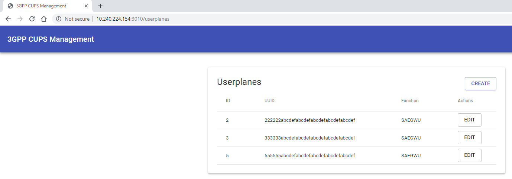

### Get User Plane specific information and Update

- Identify the specific userplane using the UUID to get additional information
- Click on **EDIT** as shown below
  &nbsp;  
  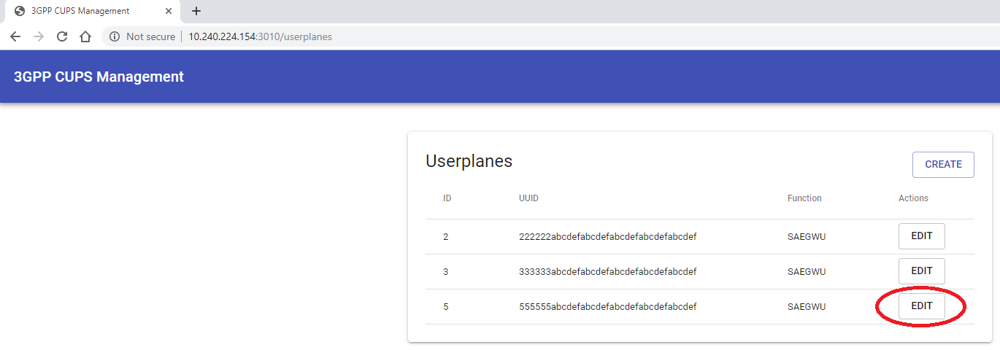
  &nbsp;

- User plane information is displayed as shown below
  &nbsp; 
  
  &nbsp;

- Update parameters: any of the parameters _{S1-U , S5-U(SGW), S5-U(PGW), MNC,MCC, TAC, APN}_ as needed and then click on **Save**. 
  **NOTE** A pop up window will appear with “successfully updated userplane”
  &nbsp;
  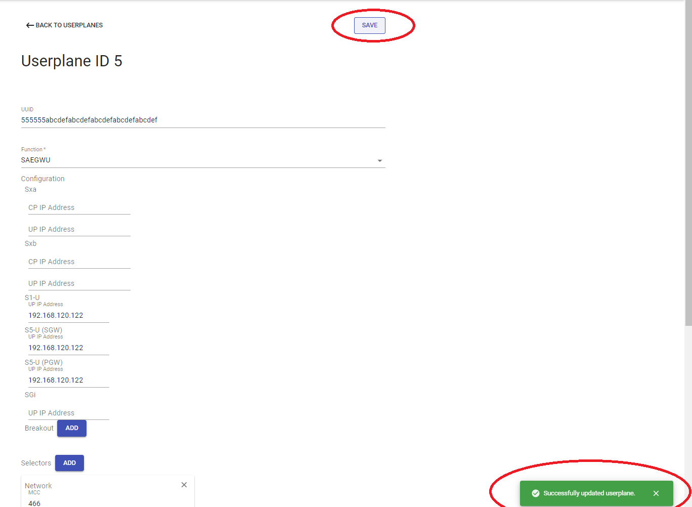
  &nbsp;

- After that, web page will automatically return back to the updated user plane list as shown below
  &nbsp;
  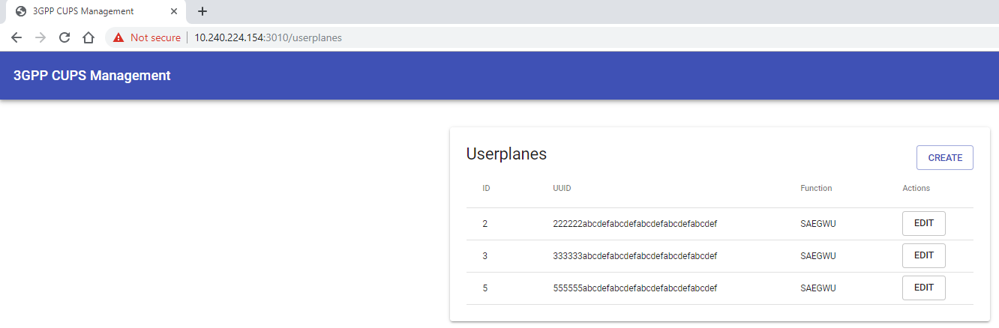
  &nbsp;

### Add a new user plane information to Core

- Click on **CREATE** button.

- Filling uuid with 36 char string, select Function as “SAEGWU” and set values for parameters: S1-U , S5-U(SGW), S5-U(PGW), MNC,MCC, TAC and APN. And click on “Save” and pop up with “successfully created userplane” as below:
  &nbsp;
  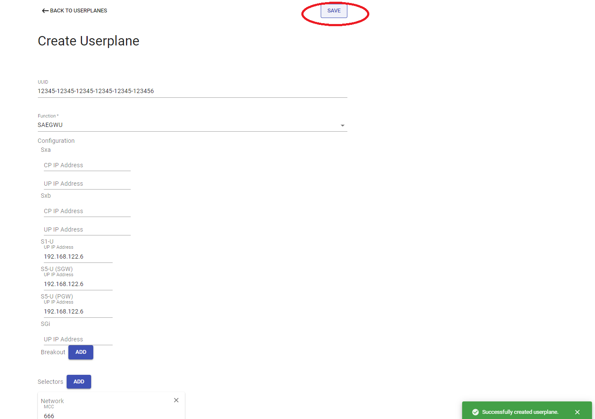
  &nbsp;

- After that, web page will automatically return back to the updated user plane list as shown below
  &nbsp; 
  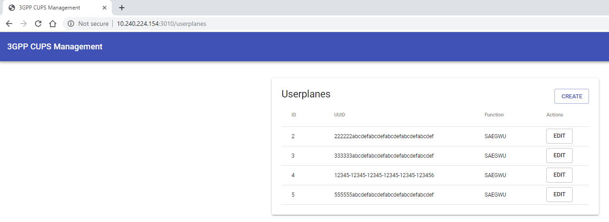
  &nbsp;

### Delete a user plane information from Core

- Find the user plane to delete using UUID and click **EDIT**

- Then web page will list the user plane information, and then click on **DELETE USERPLANE** with popup message with **successfully deleted userplane** as shown below
  &nbsp;  
  
  &nbsp;

- After that, web page will automatically return back to the updated user plane list as shown below
  &nbsp;
  
  &nbsp;

# 5G NGC components bringup and Configuration using CNCA

OpenNESS provides ansible scripts for setting up NGC components for two scenarios. Each of the scenarios is supported by a separate role in the OpenNESS Experience Kit:

1. Role "ngc_test"
  This role brings up the 5g OpenNESS setup in the loopback mode for testing and demonstrating its usability. This scenario is currently the default 5G OpenNESS scenario. The ansible scripts that are part of "ngc_test" role build, configure and start AF, NEF and OAM in the Network Edge or On-Premises mode. Within this role, AF, NEF and OAM are set up on the controller node.  Description of the configuration and setup of the NGC components provided in the next sections of this document refers to ngc_test role. The NGC componetns set up within ngc_test role can be fully integrated and tested with provided Kubectl plugin or CNCA UI.

2. Role "ngc"
  This role brings up 5g OpenNESS components - AF and NEF - to present the real deployment scenario, where the components can be further integrated with the real 5G core network. The ansible scripts that are part of this role build, configure and start AF and NEF components on separate nodes either in Network Edge or On-Premises mode. The ansible scripts place AF again on the controller node, whereas NEF is placed on a worker node. Similar functionality will be added for OAM component in the future release. Currently, integration with CNCA UI and Kubectl is not complete due to missing OAM component - the services can not be created and accessed. In CNCA UI the "services" web page does not show any content. The user should proceed to "subscriptions" web page to view and modify subscriptions.

## Network Edge mode

### Bring-up of NGC components in Network Edge mode 

1. If the Edge controller is not yet deployed through openness-experience-kit then: 
  Enable the role for ngc by un-commenting the line `role: ngc_test/master` in the file `openness-experience-kits/ne_controller.yml` before starting `deploy_ne_controller.sh` or `deploy_ne.sh` as described in [OpenNESS Network Edge: Controller and Edge node setup](../getting-started/network-edge/controller-edge-node-setup.md) document,  **otherwise skip this step.**

2. If Edge-controller is already deployed (but without enabling ngc role) and at a later stage you want to enable NGC components on edge-controller then,
  Enable the role for ngc by un-commenting the line `role: ngc_test/master` in the file `openness-experience-kits/ne_controller.yml` and then re-run `deploy_ne_controller.sh` as described in [OpenNESS Network Edge: Controller and Edge node setup](../getting-started/network-edge/controller-edge-node-setup.md) document.

    **NOTE:** 
    In addition to the OpenNESS controller bringup, by enabling the ngc rule the playbook scripts performs:  Clone epcforedge repo from github, builds AF, NEF and OAM micro services, generates certificate files, creates docker images and starts PODs. 

3. On successful start of AF, NEF and OAM PODs, status of PODS and Services can verified using the below commands: 
   - `kubectl get pods --all-namespaces`
  expected out as below:
  

   - `kubectl get services--all-namespaces`
    expected out as below:
    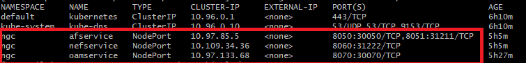
  
    *NOTE: In general, below steps #4 and #5 are not needed. If user wants to change the hostname/ip-address parameters for AF/NEF/OAM then #4 and #5 will provide the guidance.*

4. After all the PODs are successfully up and running, few AF and OAM configuration parameters need to be updated (as per your deployment configuration) and then re-start the AF.

   * Open the file `/etc/openness/configs/ngc/af.json` and modify the below parameters. 
   * `"UIEndpoint": "http://localhost:3020"` : Replace the `localhost` with `IP Address` of edge-controller, and no change to port number.
   * `"NEFHostname": "localhost"` : Replace the `localhost` with `nefservice` ie., service name NEF POD.
   * Save and exit.
   * Now restart AF POD using the below command:
  `kubectl exec -it af --namespace=ngc -- /bin/bash -c "pkill af"`
  Successful restart of AF with the updated config can be observed through AF container logs. Run the below command to get AF container logs:
  `kubectl logs af --namespace=ngc af-container`
  Sample output of the AF container logs with updated config may appear as:
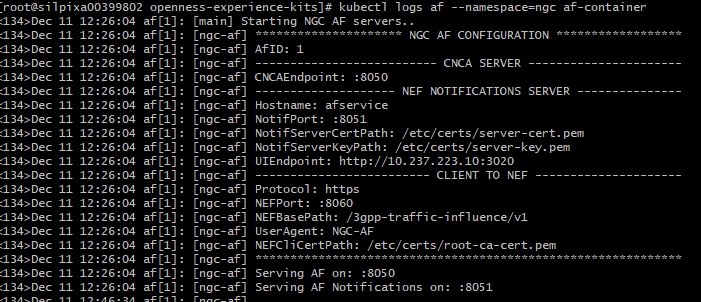

5. To update OAM configuration and restart OAM micro service:
   * Open the file `/etc/openness/configs/ngc/oam.json` and modify the below parameters. 
   * `"UIEndpoint": "http://localhost:3020"` : Replace the `localhost` with `IP Address` of edge-controller, and no change to port number.
   * Save and exit.
   * Now restart OAM POD using the below command:
  `kubectl exec -it oam --namespace=ngc -- /bin/bash -c "pkill oam"`
  Successful restart of OAM with the updated config can be observed through OAM container logs. Run the below command to get logs:
  `kubectl logs oam --namespace=ngc oam-container`

*NOTE: In case of ngc-test rule/configuration, NEF and OAM PODs will run in OpenNESS-Controller/Kubernetes-Master node for testing purpose. In a real implementation, if NEF and OAM are being used, these two services will run on the 5G Core network servers either in a POD or a standalone application on the host depending on 5G Core server environment*

### Configuring in Network Edge mode

In case of Network Edge mode, CNCA provides kubectl plugin to configure 5G Core network. Kubernetes adopt plugins concepts to extend its functionality. The `kube-cnca` plugin executes CNCA related functions within the Kubernetes eco-system. The plugin performs remote callouts against NGC OAM and AF micro service on the controller itself.

The `kube-cnca` plugin is installed automatically on the master node during the installation phase of the [OpenNESS Experience Kit](https://github.com/open-ness/specs/blob/master/doc/getting-started/network-edge/controller-edge-node-setup.md)

#### Edge Node services operations with 5G Core (through OAM interface)

  ***NOTE:**
  Registration of OpenNESS Controller's AF instance with the 5G core need to be performed manually or through any other interface exposed by the 5G Core.  OAM capabilities will be enhanced in future releases to support this. Current version of OAM supports only one instance of OpenNESS Controller to communicate.*

##### Registration of UPF services associated with Edge-node with 5G Core

Supported operations through `kube-cnca` plugin:

  * Registration of edge service info for an UPF with 5G Core through OAM interface (co-located with Edge-Node)
  * Un-registration of edge service info

To register the AF service through the NGC OAM function, execute:
```shell
kubectl cnca register --dnai=<DNAI> --dnn=<DNN> --tac=<TAC> --priDns=<pri-DNS> --secDns=<sec-DNS> --upfIp=<UPF-IP> --snssai=<SNSSAI>
```

The following parameters MUST be provided to the command in order to succeed:
1. Data Network Access Identifier (DNAI)
2. Data Network Name (DNN)
3. Primary DNS (priDns)
4. Secondary DNS (secDns)
5. UPF IP Address (upfIp)
6. Network Slice Identifier (SNSSAI)

Upon successful registration, subscriptions can be instantiated over the NGC AF. The `af-service-id` is returned by the `register` command to be used in further correspondence with NGC OAM & AF functions.

Un-registration of the AF service can be performed as in the command below:
```shell
kubectl cnca unregister <af-service-id>
```

#### Traffic influence operations with 5G Core (through AF interface)

Supported operations through `kube-cnca` plugin:

  * Creation of traffic influence subscriptions through the AF micro service to steer application traffic towards edge-node
  * Deletion of subscriptions
  * Updating (patching) subscriptions
  * get or get-all subscriptions

Creation of the AF subscription is performed based on the configuration provided by the given YAML file. The YAML configuration should follow the provided sample YAML in the [Sample YAML NGC AF subscription configuration](#sample-yaml-ngc-af-subscription-configuration) section. Use the `apply` command as below to post a subscription creation request onto AF:
```shell
kubectl cnca apply -f <config.yml>
```

When the subscription is successfully created, the `apply` command will return the subscription URL that includes subscription identifier at the end of the string. Only this subscription identifier `<subscription-id>` should be used in further correspondence with AF concerning this particular subscription. For example, https://localhost:8060/3gpp-traffic-influence/v1/1/subscriptions/11111  and subscription-id is 11111. **It is the responsibility of the user to retain the `<subscription-id>` as `kube-cnca` is a stateless function.**

To retrieve an existing subscription with a known subscription ID, use the below command:
```shell
kubectl cnca get subscription <subscription-id>
```

To retrieve all active subscriptions at AF, execute this command:
```shell
kubectl cnca get subscriptions
```

To modify an active subscription, use the `patch` command providing a YAML file with the subset of the configuration to be modified:
```shell
kubectl cnca patch <subscription-id> -f <config.yml>
```

To delete an active subscription, use the `delete` command as below:
```shell
kubectl cnca delete subscription <subscription-id>
```

##### Sample YAML NGC AF subscription configuration

The `kube-cnca` expects the YAML configuration as in the format below. The file must contain the topmost configurations; `apiVersion`, `kind` and `policy`. The configuration `policy` retains the NGC AF-specific subscription information.

```yaml
apiVersion: v1
kind: ngc
policy:
  afServiceId: 'afService001'
  afAppId: app001
  afTransId: ''
  appReloInd: false
  dnn: edgeLocation001
  snssai:
    sst: 0
    sd: default
  anyUeInd: false
  gpsi: ''
  ipv4Addr: 127.0.0.1
  ipv6Addr: ''
  macAddr: ''
  requestTestNotification: true
  websockNotifConfig:
    websocketUri: ''
    requestWebsocketUri: true
  trafficRoutes:
  - dnai: edgeLocation001
    routeInfo:
      ipv4Addr: ''
      ipv6Addr: ''
    routeProfId: default
```


## On-Premises mode


### Bringing up NGC components in On-Premises mode

  To bring-up the NGC components in on-premises mode, enable the rule `ngc_test/onprem/master` in the file: `openness-experience-kits/onprem_controller.yml`. and then run the script `deploy_onprem_controller.sh`  as described in [OpenNESS On-Premise: Controller and Edge node setup document](../getting-started/on-premises/controller-edge-node-setup.md).

### Configuring in On-Premises mode

  OpenNESS On-Premises management homepage:
      sample url: http://<controller_ip>:3000/landing
      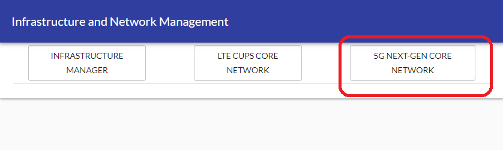

#### Edge Node services operations with 5G Core (through OAM interface)

  ***NOTE:**
  Registration of the OpenNESS Controller's AF instance with the 5G core needs to be performed manually or through any other interface exposed by the 5G Core.  OAM capabilities will be enhanced in future releases to support this. The current version of OAM supports only one instance of OpenNESS Controller to communicate.*

##### Registration of UPF services associated with Edge-node with 5G Core

   * Edge services registration home page:
      sample url: http://<cnca_ui_ip>:3020/services
      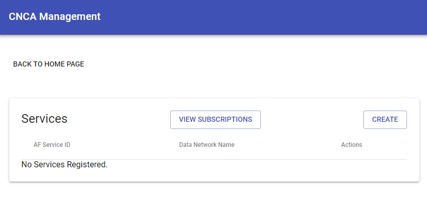

   * Registration of a new edge service offered by UPF (associated with edge-node)
      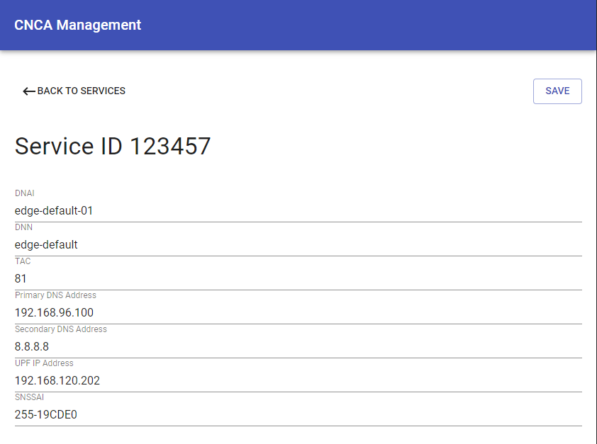

   * Display of registered edge servers with 5G Core
      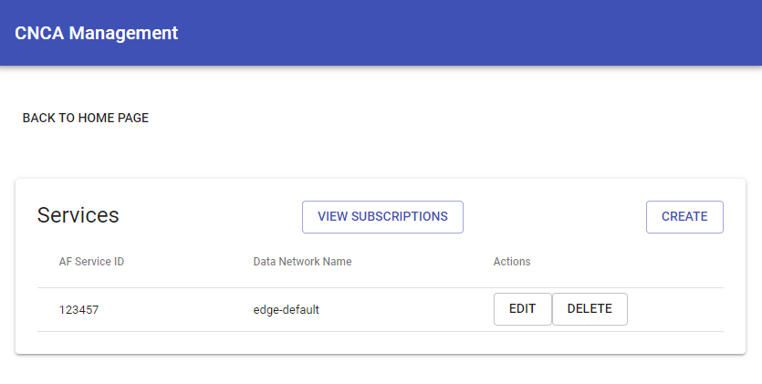

   * To edit a registered services 
      

   * To delete a registered service
      

#### Traffic influence operations with 5G Core (through AF interface)

   * Edge traffic subscription submission homepage
      sample url: http://<cnca_ui_ip>:3020/subscriptions
      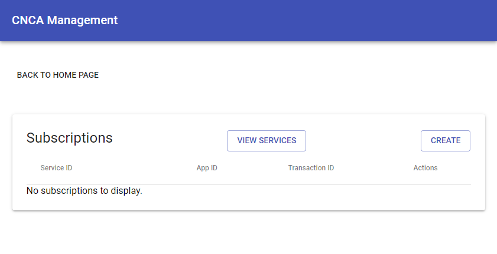

   * Edge traffic subscription submissions with 5G-Core (NEF)
      click on the "Create" button on the above homepage
      NOTE: "AF Service Id" field should be the same as the value returned through the AF services create request. In the below sample screen capture shows a different value.  
      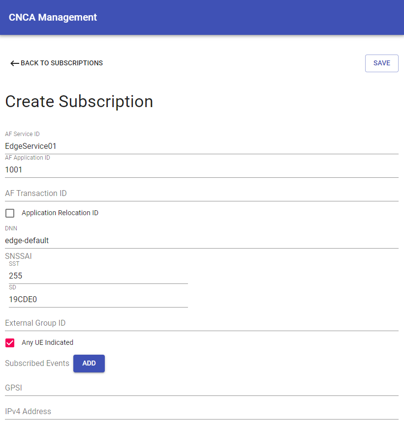
      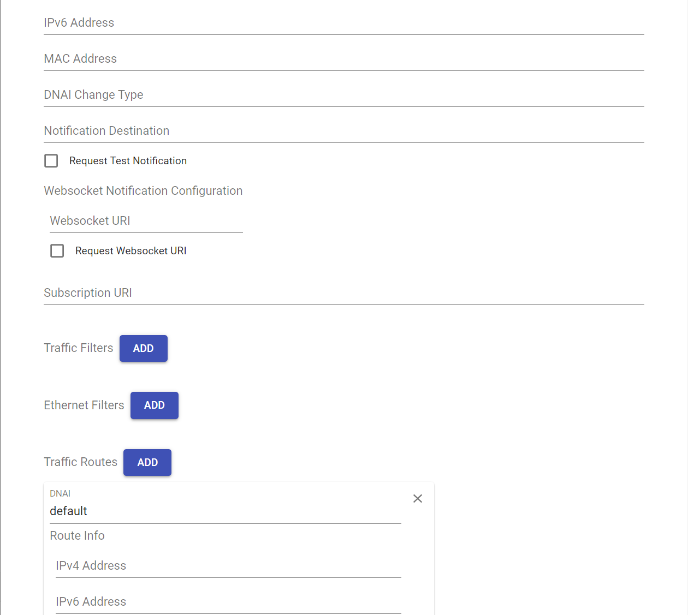
      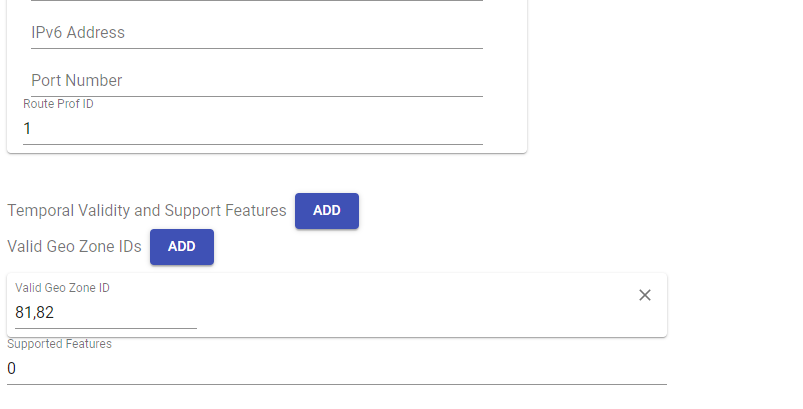

   * Display of submitted Edge traffic subscriptions
      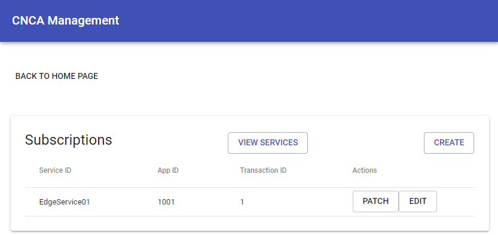

   * To edit a submitted edge traffic subscription
      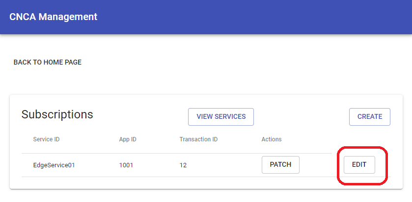

   * To patch a submitted edge traffic subscription
      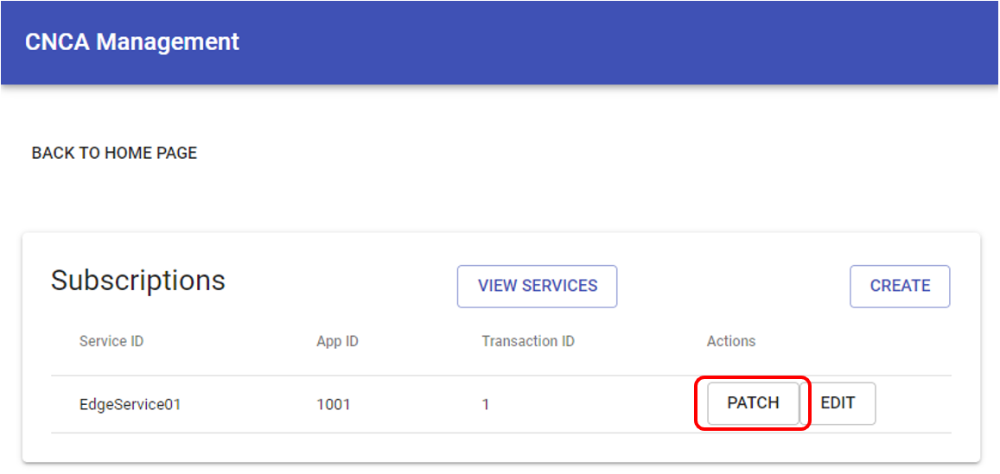

   * To delete a submitted edge traffic subscription
      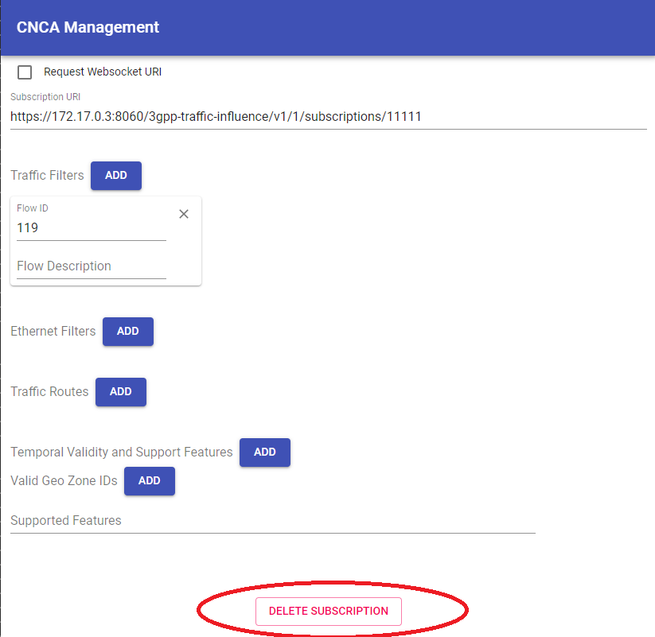
## Traffic Influence Subscription description

This sections describes the paramters that are used in the Traffic Influce subscription POST request. Groups mentioned as Mandatory needs te provided, in the absence of the Mandatory parameters a 400 response would be returned.

### Identification (Mandatory)
|Attribute name|Description|
|--------------|-----------|
|afTransId | Identifies an NEF Northbound interface transaction, generated by the AF |
|self| Link to this resource. This parameter shall be supplied by the NEF in HTTP POST responses, which is used by AF for further operations |

### Traffic Description Group (Mandatory)

|Attribute name|Description|
|--------------|-----------|
|afServiceId|Identifies a service on behalf of which the AF is issuing the request|
|dnn|Identifies a DNN|
|snssai|Identifies an S-NSSAI|

Note: One of afServiceId or dnn shall be included 

|Attribute name|Description|
|--------------|-----------|
|afAppId|Identifies an application|
|trafficFilters|Identifies IP packet filters|
|ethTrafficFilters|Identifies Ethernet packet filters|

Note: One of "afAppId", "trafficFilters" or "ethTrafficFilters" shall be included 

### Target UE Identifier (Mandatory)
|Attribute name|Description|
|--------------|-----------|
|externalGroupId|Identifies a group of users|
|anyUeInd|Identifies whether the AF request applies to any UE. This attribute shall set to "true" if applicable for any UE, otherwise, set to "false"|
|gpsi|Identifies a user|
|ipv4Addr|Identifies the IPv4 address| 
|ipv6Addr|Identifies the IPv6 address|
|macAddr|Identifies the MAC address|

Note: One of individual UE identifier (i.e. "gpsi", "ipv4Addr", "ipv6Addr" or macAddr), External Group Identifier (i.e. "externalGroupId") or any UE indication "anyUeInd" shall be included

### Application Relocation (Optional)
|Attribute name|Description|
|--------------|-----------|
|appReloInd |Identifies whether an application can be relocated once a location of the application has been selected. Set to "true" if it can be relocated; otherwise set to "false". Default value is "false" if omitted |

### Traffic Routing (Optional) 
|Attribute name|Description|
|--------------|-----------|
|trafficRoutes|Identifies the N6 traffic routing requirement|

### Spatial Validity (Optional)
|Attribute name|Description|
|--------------|-----------|
|validGeoZoneIds|Identifies a geographic zone that the AF request applies only to the traffic of UE(s) located in this specific zone |

### Temporal Validity (Optional)
|Attribute name|Description|
|--------------|-----------|
|tempValidities|Indicates the time interval(s) during which the AF request is to be applied|

### UPF Event Notifications (Optional)
|Attribute name|Description|
|--------------|-----------|
|subscribedEvents|Identifies the requirement to be notified of the event(s)|
|dnaiChgType|Identifies a type of notification regarding UP path management event|
|notificationDestination|Contains the Callback URL to receive the notification from the NEF. It shall be present if the "subscribedEvents" is present|

### AF to NEF specific (Optional)
|Attribute name|Description|
|--------------|-----------|
|suppFeat|Indicates the list of Supported features used as described in subclause 5.4.4. This attribute shall be provided in the POST request and in the response of successful resource creation. Values 1 - Notification_websocket 2 -  Notification_test_event |
|requestTestNotification|Set to true by the AF to request the NEF to send a test notification as defined in subclause 5.2.5.3 of 3GPP TS 29.122 [4]. Set to false or omitted otherwise|
|websockNotifConfig|Configuration parameters to set up notification delivery over Websocket protocol|

