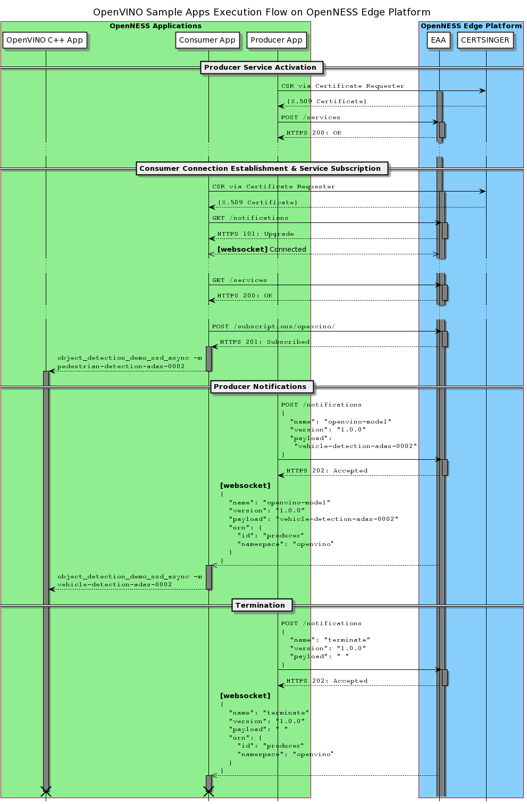

```text
SPDX-License-Identifier: Apache-2.0
Copyright (c) 2019 Intel Corporation
```
<!-- omit in toc -->
# OpenNESS Application Development and Porting Guide
- [Introduction](#introduction)
- [OpenNESS Edge Node Applications](#openness-edge-node-applications)
  - [Producer Application](#producer-application)
  - [Consumer Application](#consumer-application)
  - [Example of Producer and Consumer Applications](#example-of-producer-and-consumer-applications)
    - [OpenVINO Producer Application](#openvino-producer-application)
    - [OpenVINO Consumer Application](#openvino-consumer-application)
    - [Execution Flow Between EAA, Producer, and Consumer](#execution-flow-between-eaa-producer-and-consumer)
  - [Cloud Adapter Edge compute Application](#cloud-adapter-edge-compute-application)
- [Application On-boarding](#application-on-boarding)
  - [Authentication](#authentication)
  - [OpenNESS-aware Applications](#openness-aware-applications)
    - [Service Activation](#service-activation)
    - [Service Discovery and Subscription](#service-discovery-and-subscription)
    - [Service Notifications](#service-notifications)
  - [OpenNESS-agnostic Applications](#openness-agnostic-applications)
  - [Make Legacy Applications OpenNESS-aware](#make-legacy-applications-openness-aware)

## Introduction
OpenNESS is an open-source software toolkit to enable easy orchestration of edge services across diverse network platforms and access technologies in multi-cloud environments. It is inspired by the edge computing architecture defined by the [ETSI Multi-access Edge Computing (MEC) Framework and Reference Architecture](https://www.etsi.org/deliver/etsi_gs/MEC/001_099/003/02.01.01_60/gs_MEC003v020101p.pdf) and the [3GPP System architecture for the 5G System TS 23.501](https://www.3gpp.org/DynaReport/23501.htm).
 
It leverages major industry edge orchestration frameworks, such as Kubernetes\* and OpenStack\*, to implement a cloud-native architecture that is multi-platform, multi-access, and multi-cloud. It goes beyond these frameworks, however, by providing the ability for applications to publish their presence and capabilities on the platform, and for other applications to subscribe to those services. Services may be very diverse:
- Providing location and radio network information
- Operating a computer vision system that recognizes pedestrians/cars and forwards metadata from those objects to downstream traffic safety applications
 
OpenNESS is access network agnostic, as it provides an architecture that interoperates with LTE, 5G, WiFi\*, and wired networks. In edge computing, dataplane flows must be routed to edge nodes concerning physical location (e.g., proximity to the endpoint, system load on the edge node, special hardware requirements). OpenNESS provides APIs that allow network orchestrators and edge computing controllers to configure routing policies uniformly.
 
This guide is targeted at the <b><i>Cloud Application developers who want to</b></i>: 
- Develop applications for Edge computing that take advantage of all the capabilities exposed through Edge Compute APIs in OpenNESS. 
- Port the existing applications and services in the public/private cloud to the edge unmodified. 

The document will describe how to develop applications from scratch using the template/example applications/services provided in the OpenNESS software release. All the OpenNESS Applications and services can be found in the [edgeapps repo](https://github.com/open-ness/edgeapps).

## OpenNESS Edge Node Applications
OpenNESS Applications can onboard and provision on the edge nodes only through the OpenNESS Controller. The first step in Onboarding involves uploading the application image to the controller through the web interface. Both VM and Container images are supported. 

OpenNESS application can be categorized in different ways depending on the scenarios. 

- Depending on the OpenNESS APIs support 
  - Applications calling EAA APIs for providing or consuming service on the edge compute along with servicing end-users traffic 
  - Applications not availing any services on the edge compute and just servicing end-user traffic 

- Depending on the Application Execution platform 
  - An application running natively on Edge node in a VM/Container provisioned by the OpenNESS controller 
  - An application running on Local breakout not provisioned by the OpenNESS controller 

- Depending on the servicing the end-user traffic
  - Producer Application
  - Consumer Application 

### Producer Application
OpenNESS Producer applications are edge compute applications that provide services to other applications running on the edge compute platform. Producer applications do not serve end users traffic directly. They are sometimes referred to as Edge services. The following are some characteristics of a producer app:
- All producer apps must be TLS-capable and communicate through HTTPS. 
- All producer apps need to activate if the service provided by them needs to be discoverable by other edge applications.
- A producer apps can have one or more fields for which it will provide notification updates. 

### Consumer Application
OpenNESS Consumer applications are edge compute applications that serve end users traffic directly. Consumer applications may or may not subscribe to the services from other producer applications on the edge node. The following are some characteristics of a consumer app:
- It is not mandatory for consumer apps to be TLS-capable if they don't wish to call EAA APIs.  
- A consumer application can subscribe to any number of services from producer apps. Future extensions can implement entitlements to consumer apps to create access control lists. 
- Producer to Consumer update will use a web socket for notification. If there is further data to be shared between producer and consumer, other NFVi components such as OVS/VPP/NIC-VF can be used for data transfer. 

### Example of Producer and Consumer Applications
The OpenNESS release includes reference producer and consumer applications.


_Figure - Example of Producer and Consumer Applications_

The consumer application is based on OpenVINO™ [OpenVINO] (https://software.intel.com/en-us/openvino-toolkit)

- The  OpenVINO™ consumer app executes inference on the input video stream.
- The OpenVINO™ producer app generates notifications to the consumer app for changing the inference model.
- The video input stream is captured from a webcam installed on an Embedded Linux\* client device.
- The annotated video is streamed out of the OpenNESS edge node back to the client device for further data analysis

#### OpenVINO Producer Application

The OpenVINO producer application is responsible for activating a service in OpenNESS Edge Node. This service is simply a publication of the inference model name that can be used by the OpenVINO consumer application(s). This service involves sending periodic `openvino-model` notifications (its interval is defined by `NotificationInterval`), which in turn is absorbed by the consumer application(s).

The producer application commences publishing notifications after registration with the Edge Application Agent (EAA) over HTTPS REST API.

This sample OpenVINO producer application represents a real-world application where city traffic behavior can is monitored by detecting humans and automobiles at different times of the day.

#### OpenVINO Consumer Application

The OpenVINO consumer application executes object detection on the received video stream (from the client simulator) using an OpenVINO pre-trained model. The model of use is designated by the model name received in the `openvino-model` notification. The corresponding model file is provided to the integrated OpenVINO C++ application.

When the consumer application commences execution, it communicates with EAA and perform operations involving:
- Websocket connection establishment
- Service discovery
- Service subscription

Websocket connection retains a channel for EAA to forward notifications to the consumer application whenever a notification is received from the producer application over HTTPS REST API. Only subscribed-to notifications are forwarded on to the websocket.

This sample OpenVINO consumer application represents a real-world application and depending on the input object model, it can detect objects in the input video stream and annotate (count if needed). 

#### Execution Flow Between EAA, Producer, and Consumer

The simplified execution flow of the consumer and producer applications with EAA is depicted in the sequence diagram below. Details on the various procedures of service activation/subscription and notifications are given in subsequent sections.



_Figure - OpenVINO Application Execution Flow_

### Cloud Adapter Edge compute Application
All the major Cloud Service providers are implementing frameworks to deploy edge applications that link back to their cloud via connectors. For example, Amazon Greengrass\* enables lambda functions to be deployed on the edge and connecting to the AWS\* cloud using the Greengrass service. While it was originally intended to host this type of edge software on IoT gateways, the same framework can be utilized by Service Providers and Enterprises to implement a multi-cloud strategy for their Edge Nodes.  

OpenNESS enables this approach by running the Greengrass Core (with the Edge software) as Edge applications on the Edge Node. They can run unchanged or modified to utilize the EAA APIs to serve as Producer or Consumer apps on the Edge Node. By running multiple cloud connector instances from different cloud service providers on the same edge node, a multi-cloud experience can be easily implemented. 

OpenNESS supports this by the ability to deploy public cloud IoT gateways from cloud vendors like Amazon AWS IoT Greengrass and Baidu\* OpenEdge\* on edge compute platform. The existing IoT gateways can be migrated to OpenNESS as is or enhanced to call EAA APIs using extensions like Lambda functions. 


_Figure - Example of Cloud Adapter Edge Application in OpenNESS Platform_

More details about running Baidu OpenEdge as an OpenNESS application can be found here [Baidu OpenEdge Edge Application](../cloud-adapters/openness_baiducloud.md).

More details about running Amazon AWS IoT Greengrass as an OpenNESS application can be found here  [Amazon AWS IoT Greengrass Edge Application](../cloud-adapters/openness_awsgreengrass.md).

## Application On-boarding

The OpenNESS toolkit allows application developers and content providers to onboard their own applications on the network edge, closer to the source of action. The edge computing development model imposes the business logic to be split and distributed across 3 sides: (a) _client side_, (b) _edge side_, and (c) _cloud side_. OpenNESS enables landing applications on the _edge side_.

Applications to be onboarded on the OpenNESS framework must be self-contained in a container or a virtual machine (VM). The applications have the option to be landed with or without awareness of the hosting edge environment. The following sections will explore the two options and how they can be useful.

> **NOTE:** Code snippets given in this guide are written in Go language; this is purely for the ease of demonstration. All other programming languages should suffice for the same purposes.

### Authentication

All communications over EAA REST APIs are secured with HTTPS and TLS (Transport Layer Security). Therefore, all applications that are onboarded on OpenNESS must obtain X.509 certificates from a Certificate Authority (CA). This is performed by [signing a certificate through the Kubernetes* API](https://kubernetes.io/docs/reference/access-authn-authz/certificate-signing-requests/). Each application that requires a certificate should generate it using the Certificate Signer by sending a CSR via Certificate Requester as detailed in [Certificate Signer guide](../applications-onboard/openness-certsigner.md). In brief, the application YAML specs must be extended to:

1. Include RBAC Service Account and Cluster Role Binding
2. Include 2 Init Containers
3. Create a ConfigMap with a JSON CSR config

The above changes will enabled the application to exercise CSR with Kubernetes* API through the OpenNESS CertSigner service.

The cluster admin should manually approve the certificate in order to complete the application onboarding:

```shell
kubectl certificate approve <app-name>
```

> **NOTE:** The authentication steps is required when onboarding OpenNESS-aware and OpenNESS-agnostic applications.

The below Golang sample represent the logic that the application can use to load the signed certificate and use it for subsequent HTTPS communications. The function `CreateEncryptedClient` loads the certificates from the container local file system and instantiates the Golang's [TLS client](https://golang.org/pkg/net/http/#Client) instance that is subsequently used in further HTTP messaging.

```golang
func CreateEncryptedClient() (*http.Client, error) {

	cert, err := tls.LoadX509KeyPair(Cfg.CertPath, Cfg.KeyPath)
	if err != nil {
		return nil, errors.Wrap(err, "Failed to load client certificate")
	}

	certPool := x509.NewCertPool()
	caCert, err := ioutil.ReadFile(Cfg.RootCAPath)
	if err != nil {
		return nil, errors.Wrap(err, "Failed to load CA Cert")
	}
	certPool.AppendCertsFromPEM(caCert)

	client := &http.Client{
		Transport: &http.Transport{
			TLSClientConfig: &tls.Config{RootCAs: certPool,
				Certificates: []tls.Certificate{cert},
				ServerName:   Cfg.EaaCommonName,
			},
		}}

	log.Printf("%#v", client)

	tlsResp, err := client.Get("https://" + "https://eaa.openness:443")
	if err != nil {
		return nil, errors.Wrap(err, "Encrypted connection failure")
	}
	defer func() {
		if e := tlsResp.Body.Close(); e != nil {
			log.Println("Failed to close response body " + e.Error())
		}
	}()
	return client, nil
}

func main() {
    ...

    client, err := CreateEncryptedClient()
    if err != nil {
        log.Fatal(err)
        return
    }

    req, err := http.NewRequest("POST", "https://eaa.openness:443/services",
        bytes.NewReader(payload))
    if err != nil {
        log.Fatal(err)
        return
    }

    resp, err := client.Do(req)
    if err != nil {
        log.Fatal(err)
        return
    }

    ...
}
```

### OpenNESS-aware Applications
Edge applications must introduce themselves to the OpenNESS framework and identify if they would like to activate new edge services or consume an existing service. The Edge Application Agent (EAA) component is the handler of all the edge applications hosted by the OpenNESS edge node and acts as their point of contact. All interactions with EAA are through REST APIs, which are defined in [Edge Application API](https://www.openness.org/api-documentation/?api=eaa).

OpenNESS-awareness involves (a) service activation/deactivation, (b) service discovery, (c) service subscription, and (c) Websocket connection establishment. The Websocket connection retains a channel for EAA for notification forwarding to pre-subscribed consumer applications. Notifications are generated by "producer" edge applications and absorbed by "consumer" edge applications.

The sequence of operations for the producer application are:
1. Activate new service and include the list of notifications involved
2. Send notifications to the OpenNESS edge node, according to business logic

The sequence of operations for the consumer application:
1. Discover the available services on OpenNESS edge platform
2. Subscribe to services of interest and listen for notifications

#### Service Activation

The producer application activates a new service by calling `POST `[`/services`](https://www.openness.org/api-documentation/?api=eaa#/Eaa/RegisterApplication) providing information about this service and the list of notifications to be provided as part of this service.

An example service activation procedure is shown below:

```golang
URN := URN{
	ID:        "app-id",
	Namespace: "namespace",
}

serv := Service{
    URN:         &URN,
    Description: "Service description",
    EndpointURI: "namespace/app-id",
}

notif1 := NotificationDescriptor{
    Name:        "notification1",
    Version:     "1.0.0",
    Description: "Notification1 description",
}

notif2 := NotificationDescriptor{
    Name:        "notification1",
    Version:     "1.0.0",
    Description: "Notification2 description",
}

serv.Notifications = make([]NotificationDescriptor, 2)
serv.Notifications[0] = notif1
serv.Notifications[1] = notif2

servBytes, _ := json.Marshal(serv)

req, _ := http.NewRequest("POST",
    "https://eaa.openness:443/services",
    bytes.NewReader(servBytes))

resp, _ := client.Do(req)

resp.Body.Close()
```

#### Service Discovery and Subscription

The consumer application must establish a Websocket before subscribing to services. The example code below shows how a Websocket connection can be established with the OpenNESS edge node:

```golang
var socket = websocket.Dialer{
    ReadBufferSize:  512,
    WriteBufferSize: 512,
    TLSClientConfig: &tls.Config{
        RootCAs:      certPool,
        Certificates: []tls.Certificate{cert},
        ServerName:   "eaa.openness",
    },
}

var header = http.Header{}
header["Host"] = []string{myURN.Namespace + ":" + myURN.ID}

// Consumer establishes websocket with EAA
conn, resp, _ := socket.Dial(
    "wss://eaa.openness:443/notifications", header)

log.Println("WebSocket establishment successful")

resp.Body.Close()
```

Discovering the available services is performed by calling `GET `[`/services`](https://www.openness.org/api-documentation/?api=eaa#/Eaa/GetServices), which returns the list of available services in the edge node.

An example of service discovery is shown in the code snippet below:

```golang
req, _ := http.NewRequest("GET",
    "https://eaa.openness:443/services", nil)

resp, _ := client.Do(req)

var servList = ServiceList{}
json.NewDecoder(resp.Body).Decode(&servList)
resp.Body.Close()
```

When the consumer application decides on a particular service that it would like to subscribe to, it should call `POST `[`/subscriptions/{urn.namespace}`](https://www.openness.org/api-documentation/?api=eaa#/Eaa/SubscribeNotifications) to subscribe to all services available in a namespace or call `POST `[`/subscriptions/{urn.namespace}/{urn.id}`](https://www.openness.org/api-documentation/?api=eaa#/Eaa/SubscribeNotifications2) to subscribe to notifications related to the exact producer.

An example for subscribing to all services in a namespace is given below:

```golang
req, _ := http.NewRequest("POST",
    "https://eaa.openness:443/subscriptions/"+
    service.URN.Namespace, bytes.NewReader(notifBytes))

resp, _ := client.Do(req)
resp.Body.Close()
```

#### Service Notifications

The producer application sends notifications through `POST `[`/notifications`](https://www.openness.org/api-documentation/?api=eaa#/Eaa/PushNotificationToSubscribers), which is picked up by EAA. EAA looks up all the service subscribers in its local database and pushes this notification forward over the Websocket connection to them along with some extra information about the notification producer.

The Websocket connection should have been previously established by the consumer using `GET `[`/notifications`](https://www.openness.org/api-documentation/?api=eaa#/Eaa/GetNotifications) before subscribing to any edge service.

The consumer should create a thread that keeps listening on the Websocket for incoming notifications.

Example:

```golang
import "github.com/gorilla/websocket"
var conn *websocket.Conn

for keepListen {
    _, message, err := conn.ReadMessage()
    if err != nil {
        log.Println("Failed to read message from WebSocket:", err)
        return
    }

    var notif = NotificationToConsumer{}
    err = json.Unmarshal(message, &notif)
    if err != nil {
        log.Println("Failed to unmarshal notification msg:", err)
        return
    }

    switch notif.Name {
    case "notification1":
        // execute action for notification1

    case "notification2":
        // execute action for notification2

    case "terminate":
        keepListen = false
    }
}
```

### OpenNESS-agnostic Applications

In a situation where the developer has a legacy, pre-compiled or binary applications (which are not easy to edit or modify and are not looking for consuming edge services) can be onboarded without the awareness of the underlying hosting framework. In such a case, the OpenNESS edge framework will also be unaware of the existence of these applications. Therefore, the life-cycle management of these applications becomes the responsibility of the user to configure, upload, deploy, un-deploy, start, and stop. When an application requires ingress and/or egress traffic, the corresponding traffic policies must be configured manually to allow the concerning traffic to be steered in and out to the application.

### Make Legacy Applications OpenNESS-aware

Legacy, pre-compiled, or binary applications can be made OpenNESS-aware by following few steps without editing their code. This can be done by wrapping these applications with a separate program that is written purposefully to (a) communicate with OpenNESS Edge Node and (b) execute the legacy application.

The wrapper program interacts with EAA for (a) Websocket connection establishment, (b) service discovery, and (c) service subscription. And call the legacy application with the proper arguments based on the received notifications. Or, if the legacy application is intended to work as a producer application, then the wrapper programmer should activate the edge service with EAA and send the notifications based on the outcomes of the legacy application.

The code below gives an example of an executable application being called at the operating system level when a notification is received from EAA. The executable application is separately compiled and exists on the file system. A similar approach has been followed with the OpenVINO sample application, which was originally written in C++ but is called from a wrapper Go-lang program.

```golang
cmd = exec.Command("program-executable",  // legacy executable call goes here
    "param1", "param2")  // parameter passing

stdout, _ := cmd.StdoutPipe()
stderr, _ := cmd.StderrPipe()

go func() {
    if _, err = io.Copy(os.Stdout, stdout); err != nil {
        log.Println(err)
    }
}()

go func() {
    if _, err = io.Copy(os.Stderr, stderr); err != nil {
        log.Println(err)
    }
}()

err = cmd.Start()
if err != nil {
    log.Fatal("Failed to execute program:", err)
}
```
