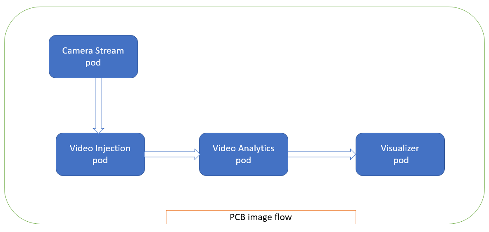
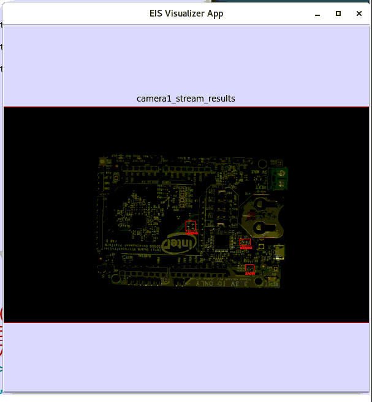
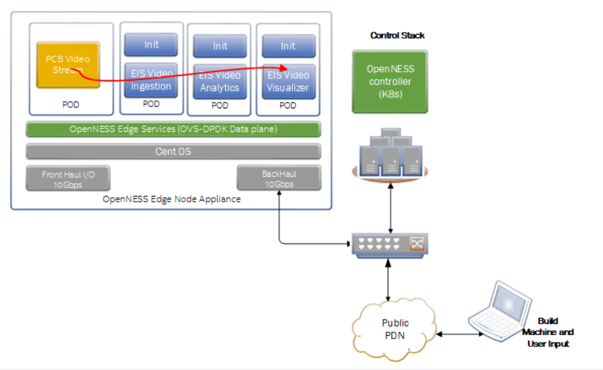
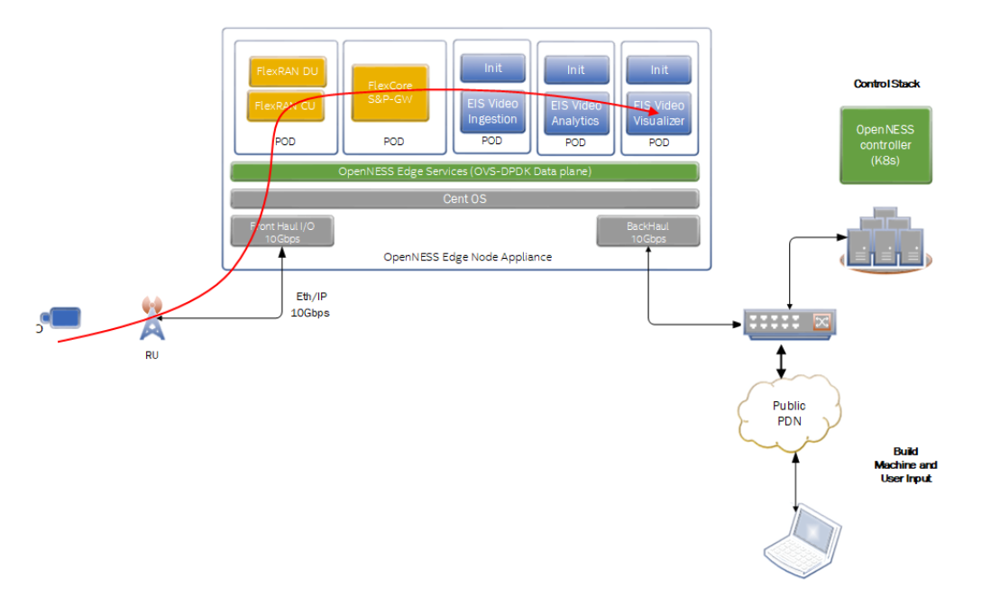

```text
SPDX-License-Identifier: Apache-2.0
Copyright (c) 2020 Intel Corporation
```
<!-- omit in toc -->
# Industrial Edge Insights Application on OpenNESS — Solution Overview
- [Edge Insights Software Introduction](#edge-insights-software-introduction)
- [EIS PCB Defects Detection](#eis-pcb-defects-detection)
    - [Etcd](#etcd)
    - [Camera Stream](#camera-stream)
    - [Video Ingestion](#video-ingestion)
    - [Video Analytics](#video-analytics)
    - [Visualizer](#visualizer)
- [PCB image processing flow through the system](#pcb-image-processing-flow-through-the-system)
- [PCB defects detection results](#pcb-defects-detection-results)
- [EIS Applications Integrated With OpenNESS](#eis-applications-integrated-with-openness)
- [Cloud Native Approach](#cloud-native-approach)
- [Conclusion](#conclusion)
- [Reference](#reference)

## Edge Insights Software Introduction

Intel’s Edge Insights Software(EIS) for Industrial use case brings ease of AI deployment in industrial environment through a set of integrated key capabilities, such as video data ingestion, processing and transmission, which optimize edge analytics that lead to improved industrial product quality, operational performance, prediction of downtime and automated operational flows.

## EIS PCB Defects Detection

The Printed Circuit Board(PCB) defects detection is a sample demo application enabled for detection of defects in the components assembly in a factory environment.
The IP Camera will record the video of the assembled boards moving over a conveyor belt. These IP cameras will stream the video to EIS video processing applications namely Video Ingestion, Video Analytics, Time Series analysis etc. using the RTSP streaming protocol. The captured video is analyzed and filters out selected images for further defect analysis. The [OpenNESS](https://www.openness.org/) platform infrastructure is used to deploy the application pods of EIS performing image processing functionality. The purpose of this demo is to show case the EIS application on OpenNESS platform. There are two types of defects detection supported in this demo i.e. missing component detection and short circuit due to solder bridge formed during the assembly process. The video file used in this demo application is `pcb_d2000.avi` which is sent from the camera stream pod as RTSP stream.
This EIS PCB defects detection will have five types of application pods in the OpenNESS edge nodes.

- Etcd
- Camera Stream
- Video Ingestion
- Video Analytics
- Visualizer

### Etcd

Etcd pod stores the key, value of Video-Ingestion, Video-Analytics, and Visualizer pod access information. It manages the configuration data, state data, and metadata for Kubernetes.

### Camera Stream

Camera Stream pod simulates IP cameras in the real environment, it is used to send recorded video “pcb_d2000.avi” file as RTSP stream like an IP camera. On LTE/5G Network real-time deployment replace Camera Stream pod by real IP camera.

### Video Ingestion

The Video Ingestion pod is mainly responsible converting the video received from camera stream into frames, it filters the frames and ingests these video frames into the EIS stack for further processing and defect analysis. 

### Video Analytics

The Video Analytics pod is mainly responsible for receiving frames from the Video Ingestion pod and performs classifier converting to Universal Disk Format (UDF) and does the required inferencing on the chosen/support Intel(R) Hardware
 (CPU, GPU, VPU, HDDL) using OpenVINO. In this PCB demo, udfs filter configured as `pcb.pcb_filter` which will detect a defect on the board has any solder short or missing part. The Video Analytics identifies the defects and marks the defect on the images.

### Visualizer

The Visualizer pod is mainly displays the frames on GUI display received from Video Analytics pod.

## PCB image processing flow through the system 

The block diagram provided here shows the video/image flow through the application.
<p align="center">
  

## PCB defects detection results

Following are the reference input and output Videos of PCB defect detection demo.
- **`Input PCB rtsp stream:`**
   This video file pcb_d2000.avi shows three PCBs rotating through the screen are sent from the camera stream pod, two of these boards are defective out of three.

<p align="center">
  

- **`Output defect detection on PCB:`**
  The Visualizer pod showing the output of defect detection on PCB image i.e with red square box defect detection marked as PCB board missing component and solder bridge causing a short circuit.

<p align="center">
  

## EIS Applications Integrated With OpenNESS

An eis-experience-kit is developed to integrate and deploy EIS applications on OpenNESS architecture.

Following are the major activities involved in integrating the EIS with OpenNESS to show case this demo:

- Automation of EIS codebase build and deploy process using eis-experience-kit.
- Develop new Camera Stream pod for sending RTSP PCB demo camera stream
- Create pod specification for Etcd, Video-Ingestion, Video-Analytics and Visualizer to deploy in OpenNESS framework.
- Generate Certificate from OpenSSL for secure connection between pod.
- Enable Kubernetes secrets for certificate secret store.
- Enable Kubernetes service for accessing EIS pod port.
- Configure EIS message exchange trough TCP mode to support pods on multiple nodes.
- Created helm chart for easy deploying of EIS pod in OpenNESS environment.
- Integrate EIS image pull process from local docker-registry.

<p align="center">
  

The EIS application can be deployed through the OpenNESS architecture which requires the application micro-services to be adapted in order to match the distributed nature of the telco network. The application micro-services are deployed across the following sub-networks:

- **Cloud**: The UI and database master run in the cloud, where UI displays a summarized view of the defect on the board which is received from different IP cameras.

- **EdgeNode**: Image processing will occur on the edge node, receive the image from multiple cameras, filter unwanted images, analyze the image, and send for display.

- **Camera**: A set of cameras connected through the wireless network.

- Steps involves in the deployment of the EIS application using OpenNESS.

  1. The Controller node enrolls the edge nodes.
  1. The Edge node send request for interface configuration.
  1. The Controller node configures the interface policy for node upstream and downstream.
  1. The Controller node deploy the EIS application on Edge node.
  1. The Controller configures the DNS and traffic policy for the applications on node.
  1. Deploy EIS application on the Edge node and launches the EIS PCB demo application.

The **Cloud** and **Camera** parts of the PCB demo Application are not part of the deployment and are assumed already running. 

EIS installation and deployment on the OpenNESS Network Edge environment is available at [eis-experience-kit](https://github.com/otcshare/edgeapps/blob/master/applications/eis-experience-kit/README.md)

*NOTE: `In the above diagram, the PCB video stream pod is used for sending the RTSP stream. But in LTE/5G Network real-time deployment, the camera stream will come from real IP camera as per below diagram`*

<p align="center">
  

### Cloud Native Approach 

With a Cloud Native approach, the EIS application can be deployed on multiple nodes, EIS pods can be scaled as per the multi-stream requirement. Using Kubernetes service name pod communication will happen.


<p align="center">
  

## Conclusion

The PCB demo sample application when deployed on OpenNESS creates an impactful edge computing use case that utilizes the capability of OpenNESS and EIS.

## Reference
- [OpenNESS Architecture]( https://github.com/open-ness/specs/blob/master/doc/architecture.md)
- [Intel’s Edge Insights for Industrial](https://www.intel.com/content/www/us/en/internet-of-things/industrial-iot/edge-insights-industrial.html)

