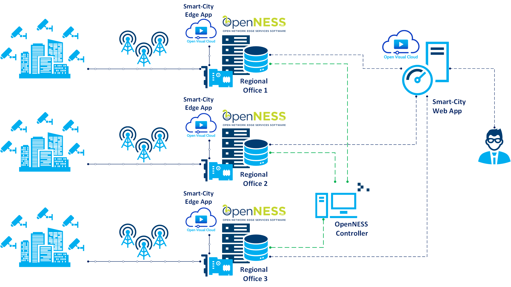

```text
SPDX-License-Identifier: Apache-2.0
Copyright (c) 2019 Intel Corporation
```

# Open Visual Cloud Smart City Application on OpenNESS - Solution Overview
- [Open Visual Cloud Smart City Application on OpenNESS - Solution Overview](#open-visual-cloud-smart-city-application-on-openness---solution-overview)
  - [OpenNESS Introduction](#openness-introduction)
  - [Open Visual Cloud Introduction](#open-visual-cloud-introduction)
  - [Smart City Edge Application Introduction](#smart-city-edge-application-introduction)
  - [The Smart City Building Blocks](#the-smart-city-building-blocks)
  - [Smart City App Deployment with OpenNESS](#smart-city-app-deployment-with-openness)
  - [Open Visual Cloud and OpenNESS Integration](#open-visual-cloud-and-openness-integration)
    - [The Infrastructure Challenges](#the-infrastructure-challenges)
    - [The Smart City Application Challenges](#the-smart-city-application-challenges)
  - [Conclusion](#conclusion)

## OpenNESS Introduction
OpenNESS is an open source software toolkit to enable easy orchestration of edge services across diverse network platform and access technologies in multi-cloud environments. It is inspired by the edge computing architecture defined by the ETSI Multi-access Edge Computing standards (e.g., [ETSI_MEC 003]), as well as the 5G network architecture ([3GPP_23501]).

It leverages major industry edge orchestration frameworks, such as Kubernetes and OpenStack, to implement a cloud-native architecture that is multi-platform, multi-access, and multi-cloud. It goes beyond these frameworks, however, by providing the ability for applications to publish their presence and capabilities on the platform, and for other applications to subscribe to those services. Services may be very diverse, from providing location and radio network information, to operating a computer vision system that recognize pedestrians and cars, and forwards metadata from those objects to to downstream traffic safety applications.

OpenNESS is access network agnostic, as it provides an architecture that interoperates with LTE, 5G, WiFi, and wired networks. In edge computing, dataplane flows must be routed to edge nodes with regard to physical location (e.g., proximity to the endpoint, system load on the edge node, special hardware requirements). OpenNESS provides APIs that allow network orchestrators and edge computing controllers to configure routing policies in a uniform manner.

## Open Visual Cloud Introduction
The Open Visual Cloud is an open source project that offers a set of pre-defined reference pipelines for various target visual cloud use cases. These reference pipelines are based on optimized open source ingredients across four core building blocks (encode, decode, inference, and render), which are used to deliver visual cloud services.

The Open Visual Cloud provides access to open source interoperable building blocks that allows developers to create and deliver an enhanced visual experience for end users. At its heart, the Open Visual Cloud is a set of reference pipelines built with optimized open source ingredients that demonstrates to developers how to construct visual cloud services. By starting with these reference pipelines, developers are able to achieve rapid development and innovation in creating and delivering the enhanced visual experience of today's demanding consumer. The reference pipelines are provided as Dockerfiles to simplify container image construction and deployment in cloud environments. The goal of the Open Visual Cloud is to unleash innovation, simplify development, and accelerate time to market for visual cloud services by providing open source, interoperable, high-performance building blocks and containerized reference pipelines.

## Smart City Edge Application Introduction
The Smart City reference pipeline shows how the integration of the various media building blocks, including SVT, with analytics powered by the OpenVINO<sup>TM</sup> Toolkit. The Smart City use cases include traffic control/city planning as the starting point. This Smart City sample (not a finished product) can be referenced by developers to ease application development challenges. It enables real time analytics of live video feeds from IP cameras.

The Smart City sample when deployed on the Edge nodes based on OpenNESS creates an impactful edge computing use case that utilizes the capability of OpenNESS, Open Visual Cloud and OpenVINO.

OpenNESS provides the underpinning network edge infrastructure which comprises of three edge nodes (hosting three Smart City regional offices). The media processing and analytics utilizing Open Visual Cloud software stack are executed on the network edge nodes to reduce latency. The analytics data are aggregated to the cloud for additional post-processing (such as calculating statistics) and display/visualization.



The Open Visual Cloud website is located at [Open Visual Cloud project](https://01.org/openvisualcloud). The Smart City sample source code & documentation are available on [GitHub](https://github.com/OpenVisualCloud/Smart-City-Sample) and its integration with OpenNESS is available at this [branch](https://github.com/OpenVisualCloud/Smart-City-Sample/tree/openness).

## The Smart City Building Blocks
The Smart City sample consists of the following major building blocks:


- **Camera Provisioning**: Tag and calibrate cameras for installation locations, calibration parameters and other usage pattern information. *Not fully implemented*.
- **Camera Discovery**: Discover and register IP cameras on specified IP blocks. Registered cameras automatically participate into the analytics activities. See Sensor README for additional details.
- **Recording**: Record and manage segmented camera footage for preview or review (at a later time) purpose.
- **Analytics**: Perform analytics on the live/recorded camera streams. Latency-sensitive analytics are performed on Edge while others are on cloud.
- **Triggers and Alerts**: Manage triggers on analytics data. Respond with actions on triggered alerts.
- **Smart Upload and Archive**: Transcode and upload only critical data to cloud for archival or further offline analysis. *Not fully implemented*.
- **Stats**: Calculate statistics for planning/monitoring purpose on analytical data.
- **UI**: Present above data to users/administrators/city planners.

Each building block is implemented as one or a set of container services that query from and/or store processing data to the database as follows:


For example, the analytics service when launched queries the database for available camera and its service URI. Then the service connects to the camera and analyzes the camera feeds. The resulted analytics data is stored back to the database for any subsequent processing such as triggering alerts and actions.

## Smart City App Deployment with OpenNESS 

For simplicity, the Smart City sample provides a deployment script that deploys all sample building blocks to a docker swarm cluster. Working with OpenNESS, we need to adapt the sample to deploy the building blocks to different networks:
- **Cloud**: The UI and the database master run in the cloud, where the UI displays a summarization view of the active offices and the database master coordinates the database requests.
- **Office**: Most processing logics (multiple containers) and a local database reside in a regional office. The services include camera discovery, object detection, and other maintenance tasks such as clean up and health check. There can be multiple offices.
- **Camera**: A set of cameras, possibly connected through the wireless network, are hosted on a different camera network.

The deployment solution is described as follows:


The three edge nodes (representing three regional offices) are connected to the OpenNESS controller. All the three nodes also have connectivity to the public/private cloud. The following are the typical steps involved in the deployment of the application using OpenNESS.
  1. The OpenNESS controller enrolls the three Edge nodes.
  2. Each Edge node sends the request for interface configuration.
  3. The OpenNESS controller configures the interface policy for upstream and downstream for each node.
  4. The OpenNESS controller deploys the Smart City VM to each edge node.
  5. The OpenNESS controller configures the DNS and traffic policy for the applications on each node.
  6. The Smart City VM starts on the edge node and launches the Smart City office services.

When a Smart City office is launched, the office performs the following launch steps:
- Register the office to the cloud database. Any subsequent web request to display any office specific data (such as system workload, or thumbnail of any recordings) will be then redirected back to the office.
- Discover available cameras on the camera network with the ONVIF protocol. The camera service URIs will be stored into the database.
- The analytics services query the database for available cameras and attach to the cameras for streaming input. The processed analytics data will be sent back to the database.
- Other services run on the database records such as health check and recording storage cleanup.

The **Cloud** and **Camera** parts of the Smart City Application are not part of the deployment and are assumed already running. Upon a complete deployment, the Smart City UI shows a glance of the three offices and the their activities as follows:


## Open Visual Cloud and OpenNESS Integration

The integration of the Smart City application with the OpenNESS infrastructure presents unique challenges on both the application and the infrastructure.

### The Infrastructure Challenges

Deploying containers with volumes, customizable environment variables, and runtime status check to Edge nodes remain challenging. Lack of scripting capability in the Edge Controller makes it difficult to deploy more than a few containers to the Edge nodes. In the Smart City application, we have about 8 containers per office (24 containers for 3 offices.) The integration uses a VM that internally launches mulitple containers as a workaround.   

Most Edge applications require local storage, to store data or to communicate among different containers. In the Smart City application, camera data are stored locally while the analytics service processes them. As we run containers within VM, the storage volume is created on the VM disk, whose size is limited. The local storage must be purged more often than that in a typical deployment.

### The Smart City Application Challenges

The Smart City application initially assumed that each IP camera was standalone on the network thus was associated with an unique IP address. It soon came to realization that if the camera streams must be delivered through the LTE network, there had to be some sort of camera aggregation. As a result, the sensor simulation code is rewritten to simulate multiple cameras hosted on the same machine (streaming through different ports.)

OpenNESS limits service requests initiated from the cloud to the Edge nodes. The Smart City application however sometimes needs to communicate to the offices (for example, to retrieve Edge workloads.) As a workaround, the application creates and maintains a secure tunnel to the cloud at the office launch time to facilitate the requests coming from the cloud.

The deployment script is also rewritten to separate the launch of the services into three networks: cloud, edge and camera. Using VM as a launch vehicle, we also have to develop automation scripts to bring up the containers within VM and to establish secure connections to the cloud for registration and service redirection.

## Conclusion

The Smart City sample when deployed on the Edge nodes based on OpenNESS creates an impactful edge computing use case that utilizes the capability of OpenNESS, Open Visual Cloud and OpenVINO. The integration shows that the three can run together to show scalable Edge deployment and low-latency analytics processing on Edge nodes.
