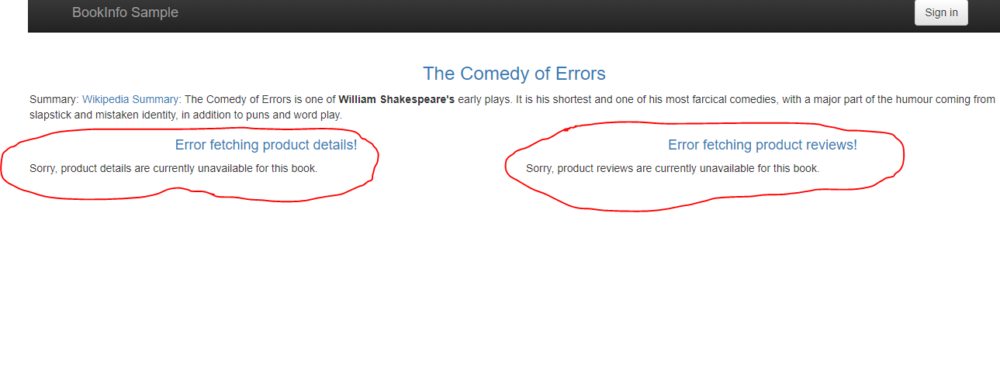
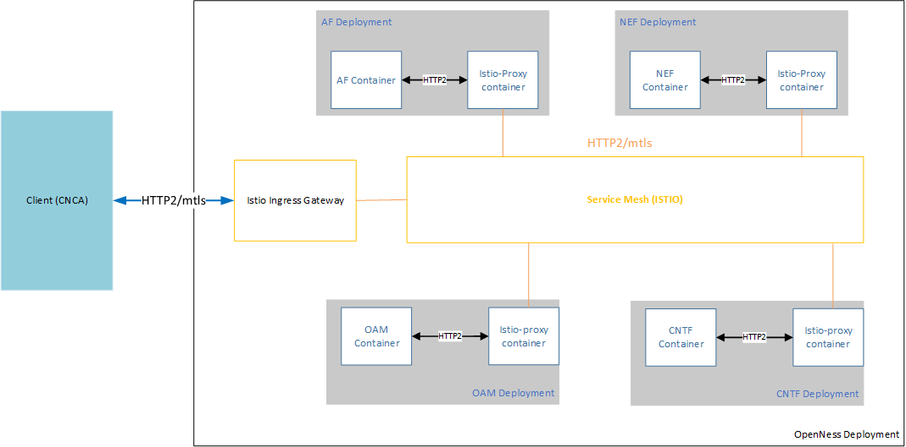

```text
SPDX-License-Identifier: Apache-2.0
Copyright (c) 2020 Intel Corporation
```
<!-- omit in toc -->
# Service Mesh support in OpenNESS
- [Overview](#overview)
- [OpenNESS Service Mesh Enablement through Istio](#openness-service-mesh-enablement-through-istio)
- [Video Analytics Service Mesh](#video-analytics-service-mesh)
- [Video Analytics Service Mesh Deployment](#video-analytics-service-mesh-deployment)
- [Authentication, Authorization & Mutual TLS enforcement](#authentication-authorization--mutual-tls-enforcement)
- [Traffic Management](#traffic-management)
  - [External Access](#external-access)
  - [Access blocking](#access-blocking)
  - [Load Balancing](#load-balancing)
  - [Canary Deployment](#canary-deployment)
- [Fault Injection](#fault-injection)
  - [Delays](#delays)
  - [Aborts](#aborts)
  - [Circuit Breaker](#circuit-breaker)
- [NGC Service Mesh Enablement](#ngc-service-mesh-enablement)
- [Prometheus, Grafana & Kiali integration](#prometheus-grafana--kiali-integration)
- [Getting Started](#getting-started)
  - [Enabling Service Mesh through the Service Mesh Flavor](#enabling-service-mesh-through-the-service-mesh-flavor)
  - [Enabling Service Mesh with the Media Analytics Flavor](#enabling-service-mesh-with-the-media-analytics-flavor)
  - [Enabling 5GC Service Mesh with the Core Control Plane Flavor](#enabling-5gc-service-mesh-with-the-core-control-plane-flavor)
- [References](#references)

## Overview

Service mesh acts as a middleware between the edge applications/services and the OpenNESS platform providing abstractions for traffic management, observability and security for the edge micro-services.

In the native Kubernetes deployment, the services are orchestrated by the Kubernetes controller and the consumer applications must decide on which service endpoint they need to reach out according to the services information broadcasted on the EAA bus.

With the Service Mesh approach, the applications do not have to worry on deciding which service endpoint it should reach, but instead it requests a service name that is translated and load-balanced by the service mesh. The service mesh manages the traffic routing and the service scale-up & down behind the scenes and adds more capabilities to the mix such as tracing, monitoring & logging.


## OpenNESS Service Mesh Enablement through Istio

[Istio](https://istio.io/) is a feature-rich cloud-native service mesh platform that provides a collection of key capabilities such as: [Traffic Management](https://istio.io/latest/docs/concepts/traffic-management/), [Security](https://istio.io/latest/docs/concepts/security/) and [Observability](https://istio.io/latest/docs/concepts/observability/) uniformly across a network of services. OpenNESS integrates natively with the Istio service mesh to help reduce the complexity of large scale edge applications, services and network functions. The Istio service mesh is deployed automatically through the OpenNESS Experience Kits (OEK) with an option to onboard the media analytics services on the service mesh.

Istio mandates injecting [Envoy sidecars](https://istio.io/latest/docs/ops/deployment/architecture/#envoy) into the applications and services pods to become part of the service mesh. The Envoy sidecars intercepts all inter-pod traffic, therefore, it becomes easy to manage, secure and observe. Sidecar injection is automatically enabled to the `default` namespace in the OpenNESS cluster. This is done by applying the label `istio-injection=enabled` to the `default` namespace.


## Video Analytics Service Mesh

The OpenNESS Video Analytics services enables third party consumer applications running on OpenNESS to perform video analytics/inferencing workloads by consuming the Video Analytics Serving APIs as described in the [OpenNESS Video Analytics Services](./openness_va_services.md).

The proposed architecture with the video analytics use case is depicted in the graphic below:


_Figure - Video Analytics Service Mesh Architecture_

Multiple instances of the video analytics services could be provisioned in the cluster. These services are deployed in multiple flavors based on the supported multimedia frameworks (FFmpeg & Gstreamer) and the available acceleration (CPU, HDDL & VCAC-A).

In each deployment, three containers are actually created:

- Video analytics serving gateway (VAS gateway): This is the actual video analytics serving container that is exposing the consumable APIs for video analytics/inference.
- Video analytics serving sidecar (VAS sidecar): This is the sidecar that creates and registers the service with EAA internal service registry.
- Envoy sidecar (istio-proxy): This is the Istio sidecar proxy that is used for the service mesh plumbing. See Istio Sidecars.

The service mesh framework takes care of provisioning, monitoring and routing the traffic to various services endpoints.


## Video Analytics Service Mesh Deployment

The media analytics services can be automatically deployed on the Istio service mesh using the OEK. To do so, the entry `ne_istio_enable` in the file `flavors/media-analytics/all.yml` needs to be set to `true`. After running the `deploy.sh` script, the output should include the following pods in the `default` and `istio-system` namespaces on the cluster:

```shell
$ kubectl get pods -A
NAMESPACE      NAME                                                         READY   STATUS      RESTARTS   AGE
default        analytics-ffmpeg-684588bb9f-4c9n4                            3/3     Running     1          5m44s
default        analytics-gstreamer-5789c96cbd-qwksw                         3/3     Running     1          5m44s
...
istio-system   istio-ingressgateway-5bfc5c665-hshbn                         1/1     Running     0          17m
istio-system   istiod-8656df74b4-kp584                                      1/1     Running     0          18m
istio-system   kiali-d45468dc4-65btj                                        1/1     Running     0          17m
istio-system   smi-adapter-istio-54b7c99755-sxfgd                           1/1     Running     0          15m
...
```

With Istio enabled in the media analytics services flavor, Istio creates two new [Destination Rules](https://istio.io/latest/docs/concepts/traffic-management/#destination-rules) in the service mesh. These Destination Rules enable Mutual TLS for each individual service, which enforces the need for any client attempting to connect to the services via the service mesh to also use the Mutual TLS mode. This prevents any client not using Mutual TLS from connecting with any of the media analytics services pods on the service mesh.

```yaml
apiVersion: networking.istio.io/v1beta1
kind: DestinationRule
metadata:
  name: destination-rule-analytics-ffmpeg
  namespace: default
spec:
  host: analytics-ffmpeg
  trafficPolicy:
    tls:
      mode: ISTIO_MUTUAL
```


## Authentication, Authorization & Mutual TLS enforcement

Mutual TLS is enforced by default in OpenNESS in order to enable authentication of all applications and services onboarded on the mesh.

To prevent non-mutual TLS for the whole mesh, the below `PeerAuthentication` policy is automatically applied to the `default` namespace in the OpenNESS cluster. This policy instructs Istio to *strictly* set the mutual TLS between all mesh applications & services running in the `default` namespace.

```yaml
apiVersion: security.istio.io/v1beta1
kind: PeerAuthentication
metadata:
  name: default
  namespace: default
spec:
  mtls:
    mode: STRICT
```

With mutual TLS enabled, Istio is capable of applying authorization policies as designed by the cluster administrator. The below authentication policy is applied automatically by the video analytics service mesh. This policy instructs Istio to authorize *all the authenticated* applications to consume the `analytics-ffmpeg` service and use its "GET", "POST" and "DELETE" methods.

```yaml
apiVersion: security.istio.io/v1beta1
kind: AuthorizationPolicy
metadata:
  name: allow-analytics-ffmpeg
  namespace: default
spec:
  selector:
    matchLabels:
      app: analytics-ffmpeg
  action: ALLOW
  rules:
  - from:
    - source:
        principals: ["*"]
        namespaces: ["default"]
    to:
    - operation:
        methods: ["GET", "POST", "DELETE"]
```

In this `AuthorizationPolicy`, the Istio service mesh will allow "GET", "POST" and "DELETE" requests from any authenticated applications from the `default` namespace only to be passed to the service. For example, if using the [Video Analytics sample application](https://github.com/otcshare/edgeapps/tree/master/applications/vas-sample-app), the policy will allow requests from the sample application to be received by the service as it is deployed in the `default` namespace. However, if the application is deployed in a different namespace, for example the `openness` namespace mentioned above in the output from the Kubernetes cluster, then the policy will deny access to the service as the request is coming from an application on a different namespace.

> **NOTE:** The above `AuthorizationPolicy` can be tailored so that the OpenNESS service mesh *selectively* authorizes particular applications to consume premium video analytics services such as being accelerated using HDDL or VCAC-A cards.

## Traffic Management

Istio provides means to manage the traffic to particular services. This can be either done directly over Istio API, or through the [Service Mesh Interface (SMI)](https://smi-spec.io/) that is standardized across various service mesh implementations. The SMI adapter must be compatible with the service mesh implementation in order to work properly.

The following demonstrated examples are based on the [BookInfo sample application](https://istio.io/latest/docs/examples/bookinfo/) that is shipped by default with the Istio software package. Deploying the BookInfo sample application creates a couple of interconnected services as shown in the following figure:


_Figure - Book Info Sample Application_

> **NOTE:** By default Istio deployment namespace in OpenNESS is set to `default` Kubernetes namespace. During deployment default OpenNESS network policy applies to pods in `default` namespace and blocks all ingress traffic. Kubernetes NetworkPolicy is not supporting port range used in Book info sample application. Therefore as workaround user must remove NetworkPolicy for the `default` namespace.

### External Access

In order to access a service mesh application from outside the cluster, the [Ingress Gateway](https://istio.io/latest/docs/tasks/traffic-management/ingress/ingress-control/) needs to be deployed. The following `Gateway` specs are extracted from the sample [BookInfo Gateway](https://github.com/istio/istio/blob/master/samples/bookinfo/networking/bookinfo-gateway.yaml):

```yaml
apiVersion: networking.istio.io/v1alpha3
kind: Gateway
metadata:
  name: bookinfo-gateway
spec:
  selector:
    istio: ingressgateway
  servers:
  - port:
      number: 80
      name: http
      protocol: HTTP
    hosts:
    - "*"
---
apiVersion: networking.istio.io/v1alpha3
kind: VirtualService
metadata:
  name: bookinfo
spec:
  hosts:
  - "*"
  gateways:
  - bookinfo-gateway
  http:
  - match:
    - uri:
        exact: /productpage
    - uri:
        prefix: /static
    - uri:
        exact: /login
    - uri:
        exact: /logout
    - uri:
        prefix: /api/v1/products
    route:
    - destination:
        host: productpage
        port:
          number: 9080
```

The port is assigned dynamically and can be retrieved using the command:

```shell
$ kubectl -n istio-system get service istio-ingressgateway -o jsonpath='{.spec.ports[?(@.name=="http2")].nodePort}'
```

Now, the `BookInfo` web dashboard is accessible by any web browser at the address `http://<CONTROLLER_IP>:<GATEWAY_PORT>/productpage`


_Figure - BookInfo Application Main Page_


### Access blocking

Istio provides `AuthorizationPolicy` resource for controling traffic to specific services. Following example gives user access to the main page of Book Info saple application, but without `details` or `reviews` parts:

```yaml
apiVersion: security.istio.io/v1beta1
kind: AuthorizationPolicy
metadata:
  name: productpage-viewer
  namespace: default
spec:
  selector:
    matchLabels:
      app: productpage
      version: v1
  rules:
  - from:
    - source:
        principals: ["*"]
    to:
    - operation:
        methods: ["GET"]
---
apiVersion: security.istio.io/v1beta1
kind: AuthorizationPolicy
metadata:
  name: deny-all
  namespace: default
spec:
  {}
```



_Figure - BookInfo Application Main Page with no reviews and details_

To gain access to `details` and `reviews`, but only specific version: v1, the following rules are needed:

```yaml
apiVersion: security.istio.io/v1beta1
kind: AuthorizationPolicy
metadata:
  name: reviews-viewer-v1
  namespace: default
spec:
  selector:
    matchLabels:
      app: reviews
      version: v1
  rules:
  - from:
    - source:
        principals: ["*"]
    to:
    - operation:
        methods: ["GET"]
---
apiVersion: security.istio.io/v1beta1
kind: AuthorizationPolicy
metadata:
  name: details-viewer-v1
  namespace: default
spec:
  selector:
    matchLabels:
      app: details
      version: v1
  rules:
  - from:
    - source:
        principals: ["*"]
    to:
    - operation:
        methods: ["GET"]
```

As mentioned this provides access only to `reviews-v1`. When `productpage` service will try to access other version, it will result with an error.


_Figure - BookInfo Application Main Page with no reviews_


### Load Balancing

Istio provides load balancing functionality. This can be used to spread the access to services (different versions or replicas of the same version). There are two types of load balancers:
* `simple`, which consists of such variants as `RANDOM`, `ROUND_ROBIN`, `LEAST_CONN`
* `consistentHash`.

While the `simple` constantly changes the accessed service according to chosen algorithm, the `consistentHash` allows to keep accessing the same service basing on user IP address, or some magic keyword in the request header.

Running a few examples showed that (at least in version 1.6.8) the algorithms were providing rather "-ish" results.

```yaml
apiVersion: networking.istio.io/v1alpha3
kind: DestinationRule
metadata:
  name: bookinfo-load-balancer
spec:
  host: reviews
  trafficPolicy:
    loadBalancer:
      simple: ROUND_ROBIN
```

Displayed `reviews` part mostly in a expected sequence (v1->v2->v3->v1->...). But every few times some version got repeated. This is not however the same result as when using `RANDOM`:

```yaml
apiVersion: networking.istio.io/v1alpha3
kind: DestinationRule
metadata:
  name: bookinfo-load-balancer
spec:
  host: reviews
  trafficPolicy:
    loadBalancer:
      simple: RANDOM
```

The `RANDOM` version displayed `reviews` part in any order, including repetitions.

As mentioned user can be connected to one specific version (i.e. depending on IP address) with:

```yaml
apiVersion: networking.istio.io/v1alpha3
kind: DestinationRule
metadata:
  name: bookinfo-load-balancer
spec:
  host: reviews
  trafficPolicy:
    loadBalancer:
      consistentHash:
        useSourceIp: true
```

This kept showing the same version of `reviews`, but it was the same on version on all of the few machines that were used during testing. Note that after removing the sample app and deploying it again, the version changed (but was still the same on each computer).

### Canary Deployment

By default if there are more than one services connected, such as "reviews" Istio provides random, but rather equal availability of each service.

One can configure Istio to display certain apps more often than the other. This can be used to balance the load in a specific way, or simply for the canary release approach.

This can be done with `TrafficSplit` structure. Such example will provide access ratio 5:1 between reviews-v1, and reviews-v2:

```yaml
apiVersion: split.smi-spec.io/v1alpha2
kind: TrafficSplit
metadata:
  name: reviews-rollout
spec:
  service: reviews
  backends:
  - service: reviews-v1
    weight: 5
  - service: reviews-v2
    weight: 1
```


_Figure - Canary Deployment with TrafficSplit_

The `TrafficSplit` works only if the app versions have unique service assigned.


## Fault Injection

Fault injection, in the context of Istio, is a mechanism by which failures can be purposefully injected into the service mesh in order to mimic how an application would behave in case failures or degradations are encountered. Application developers and cluster administrators can programatically inject faults at the application layer instead of killing pods, delaying packets, or corrupting packets at the TCP layer. Istio provisions various APIs to perform fault injections such as: delays, aborts & circuit breakers to the application micro-services deployed in OpenNESS cluster and verify their resiliency.

### Delays

Delays are timing failures such as a network latency or overloaded upstreams. A sample rule for traffic delaying coming from the test user `<username>` can be injected by applying the following specification:

```yaml
apiVersion: networking.istio.io/v1beta1
kind: <service-name>
...
spec:
  hosts:
  - ratings
  http:
  - fault:
      delay:
        fixedDelay: 7s
        percentage:
          value: 100
    match:
    - headers:
        end-user:
          exact: jason
    route:
    - destination:
        host: ratings
        subset: v1
```

### Aborts

Aborts are crash failures such as HTTP error codes or TCP connection failures. Creating a fault injection rule for an HTTP abort is done by applying the following specification:

```yaml
apiVersion: networking.istio.io/v1beta1
kind: <service-name>
...
spec:
  hosts:
  - ratings
  http:
  - fault:
      abort:
        httpStatus: 500
        percentage:
          value: 100
    match:
    - headers:
        end-user:
          exact: jason
    route:
    - destination:
        host: ratings
        subset: v1
  - route:
    - destination:
        host: ratings
        subset: v1
```

### Circuit Breaker

A simple circuit breaker can be set based on a criteria on a number of failed connections or request limits. Creating a circuit breaker rule to limit the number of connections to a service is done by applying the following specification:

```yaml
destination: reviews.default.svc.cluster.local
tags:
  version: v1
circuitBreaker:
  simpleCb:
    maxConnections: 100
```

## NGC Service Mesh Enablement

The proposed architecture for service mesh with 5G CNF is depicted in the graphic below.



_Figure - Service Mesh for NGC_

Istio-proxy container is attached to each CNF pod as a sidecar. All the traffic for the CNF container go through the istio-proxy container only. The traffic flow between different entities is described in the following sections.

**Traffic flow: Client → Istio Gateway**

To access NGC CNF API’s (AF & OAM), the client request to the server using the hostname (`afservice`, `oamservice`) along with the port number exposed by the ingress gateway. Based on the Host header, traffic is forwarded to either AF or OAM container. Mutual TLS between gateway and client is enabled by default. The certificates for enabling mutual TLS is managed using `kubectl secret`. Below command add the `server-cert.pem`, `server-key.pem`, `root-ca-cert.pem` to the kubectl secret which are used while creating istio ingress gateway.

```shell
$ kubectl create secret generic ngc-credential -n istio-system \
      --from-file=tls.key=/etc/openness/certs/ngc/server-key.pem \
      --from-file=tls.crt=/etc/openness/certs/ngc/server-cert.pem \
      --from-file=ca.crt=/etc/openness/certs/ngc/root-ca-cert.pem
```

The `root-ca-cert.pem` is used to validate client certificates while the `server-cert.pem` and `server-key.pem` are used for providing server authentication and encryption. This below policy creates istio gateway with mutual tls while using the ngc-credential secret created above.

```yaml
apiVersion: networking.istio.io/v1alpha3
kind: Gateway
metadata:
  name: ngc-ingress-gateway
spec:
  selector:
    istio: ingressgateway
  servers:
  - port:
      number: 443
      name: https
      protocol: HTTPS
    tls:
      mode: MUTUAL
      credentialName: ngc-credential
    hosts:
    - afservice
  - port:
      number: 443
      name: https
      protocol: HTTPS
    tls:
      mode: MUTUAL
      credentialName: ngc-credential
    hosts:
    - oamservice
```

The above gateway can be configured to either use HTTP2 without TLS, HTTP2 with simple TLS or HTTP2 with mutual TLS by changing value of port.protocol (HTTPS/HTTP/HTTP2) and tls.mode (SIMPLE, MUTUAL). Istio upgrades the traffic to HTTP2 by default if supported by the client. An istio virtual service `ngc-vs` is also created which defines the routes from istio-ingress-gateway.

**Traffic flow: Istio Ingress gateway → Istio-proxy (AF/OAM pods)**

Istio ingress gateway after performing TLS handshake forwards the client request to `afservice/oamservice` which is intercepted by the istio-proxy attached to the corresponding service.

**Traffic flow: Between Istio-proxy and Micro services (AF/OAM/NEF/CNTF)**

Micro service handles incoming and outgoing request. A request made by the service is intercepted by istio-proxy which performs encryption (mutual TLS) and forward the request to server. An incoming request to the micro service is intercepted by the istio-proxy which decrypts the traffic and forward to the actual service container. Any decryption/encryption and client/server validation is performed by the istio-proxy only.

**Traffic Flow: Between different istio-proxy containers**

The traffic between the istio-proxy containers is fully encrypted by using mutual TLS. The below policy enforce mutual TLS for the traffic between different istio-proxy.

```yaml
apiVersion: security.istio.io/v1beta1
kind: PeerAuthentication
metadata:
  name: ngc-mtls
  namespace: ngc
spec:
  mtls:
    mode: STRICT
```

For every workload in `ngc` namespace which has the istio-proxy side car attached is enforced to use mutual TLS. Any entity can't access 5G APIs without authenticating via istio-proxy.


## Prometheus, Grafana & Kiali integration

Prometheus and Grafana are deployed in OpenNESS platform as part of the [Telemetry support in OpenNESS](../enhanced-platform-awareness/openness-telemetry.md) and are integrated with the Istio service mesh. When enabled in OpenNESS, Istio's scraping endpoints are added to Prometheus configuration file according to [Prometheus configuration guide](https://istio.io/latest/docs/ops/integrations/prometheus/).

Collected metrics can be observed on Grafana dashboard - more details in the [Grafana](../enhanced-platform-awareness/openness-telemetry.md#grafana) section.

Kiali is deployed alongside Istio - more details on accessing Kiali dashboard are covered in the [Getting Started](#getting-started) section.

When properly configured Istio can provide Prometheus and Grafana with telemetry data. Examples showing how many times `BookInfo` micro-services were accessed.

Prometheus - all elements:


_Figure - Istio Telemetry with Prometheus_

Grafana - only stats only for specific services: `details`, `reviews-v1` and `reviews-v3`


_Figure - Istio Telemetry with Grafana_

## Getting Started

### Enabling Service Mesh through the Service Mesh Flavor

Istio service mesh can be deployed with OpenNESS using the OEK through the pre-defined *service-mesh* flavor as described in [Service Mesh Flavor](../flavors.md#service-mesh-flavor) section. Istio is installed with `default` profile by default (for Istio installation profiles refer to: https://istio.io/latest/docs/setup/additional-setup/config-profiles/). The Istio management console, [Kiali](https://kiali.io/), is deployed alongside Istio with the default credentials: (a) Username: `admin`, (b) Password: `admin` and (c) Nodeport set to `30001`. Prometheus and Grafana are deployed in OpenNESS platform as part of the telemetry role and are integrated with Istio service mesh.

To verify if Istio resources are deployed and running use the following command:

```shell
$kubectl get deployments,pods,serviceaccounts -n istio-system
NAME                                   READY   UP-TO-DATE   AVAILABLE   AGE
deployment.apps/istio-ingressgateway   1/1     1            1           2d21h
deployment.apps/istiod                 1/1     1            1           2d21h
deployment.apps/kiali                  1/1     1            1           2d21h
deployment.apps/smi-adapter-istio      1/1     1            1           2d21h
NAME                                       READY   STATUS    RESTARTS   AGE
pod/istio-ingressgateway-5bfc5c665-xl6tb   1/1     Running   0          2d21h
pod/istiod-8656df74b4-lfngv                1/1     Running   0          2d21h
pod/kiali-d45468dc4-448cg                  1/1     Running   0          2d21h
pod/smi-adapter-istio-54b7c99755-mllvx     1/1     Running   0          2d21h
NAME                                                  SECRETS   AGE
serviceaccount/default                                1         2d21h
serviceaccount/istio-ingressgateway-service-account   1         2d21h
serviceaccount/istio-reader-service-account           1         2d21h
serviceaccount/istiod-service-account                 1         2d21h
serviceaccount/kiali-service-account                  1         2d21h
serviceaccount/smi-adapter-istio                      1         2d21h
```

During Istio deployment the `default` namespace is labeled with `istio-injection=enabled`

```shell
$kubectl describe ns default
Name:         default
Labels:       istio-injection=enabled
Annotations:  ovn.kubernetes.io/cidr: 10.16.0.0/16
              ovn.kubernetes.io/exclude_ips: 10.16.0.1
              ovn.kubernetes.io/logical_switch: ovn-default
Status:       Active
```

User may change the namespace labeled with istio label using parameter `istio_deployment_namespace`
* in `flavors/service-mesh/all.yml` for dployment with service-mesh flavor
* in `flavors/media-analytics/all.yml` for deployment with media-analytics flavor

> **NOTE:** Default OpenNESS network policy applies to pods in `default` namespace and blocks all ingress traffic. User must remove default policy and apply custom network policy when deploying applications in the `default` namespace. Refer to [Kubernetes NetworkPolicies](https://github.com/otcshare/specs/blob/master/doc/applications-onboard/network-edge-applications-onboarding.md#applying-kubernetes-network-policies) for example policy allowing ingress traffic from `192.168.1.0/24` subnet on specific port.

Kiali console is accessible from browser using `http://<CONTROLLER_IP>:30001` and credentials defined in OpenNESS Experience Kits:


_Figure - Kiali Dashboard Login_

### Enabling Service Mesh with the Media Analytics Flavor

The Istio service mesh is not enabled by default in OpenNESS. It can be installed alongside the video analytics services - by setting the flag `ne_istio_enable` to `true` in the *media-nalaytics* flavor. The media analytics services are installed with the OpenNESS service mesh through the OEK playbook as described in the [Media Analytics](../flavors.md#media-analytics-flavor) section.

### Enabling 5GC Service Mesh with the Core Control Plane Flavor

The Istio service mesh is integrated with the NGC core control plane and can be deployed through the pre-defined *core-cplane* deployment flavor in OEK playbook as described in the [Core Control Plane Flavor](../flavors.md#core-control-plane-flavor) section. Istio service mesh flag `ne_istio_enable` is enabled by default. The below command deploys the NGC Cloud-Native Functions (CNFs) with Istio service mesh


## References

- [Istio Service Mesh](https://istio.io/)
- [Service Mesh Interface](https://smi-spec.io/)
- [OpenNESS Video Analytics Services](./openness_va_services.md)
