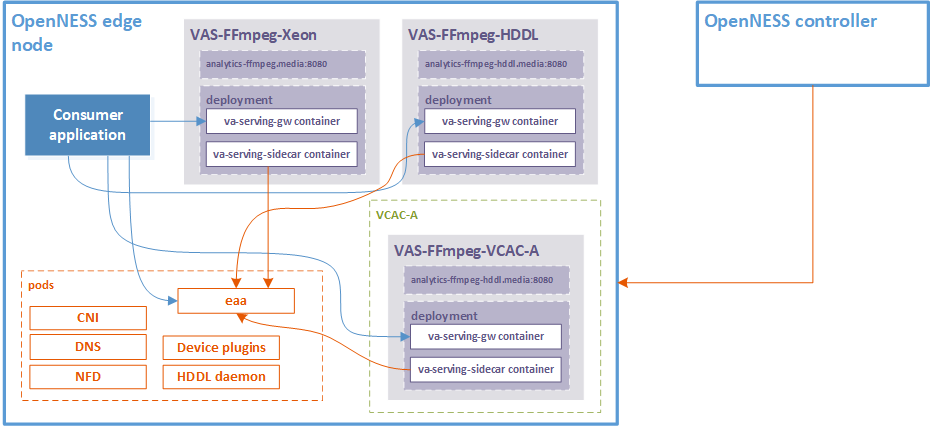
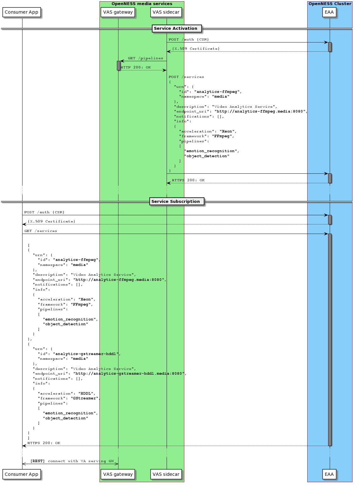

```text
SPDX-License-Identifier: Apache-2.0
Copyright (c) 2020 Intel Corporation
```
<!-- omit in toc -->
# Smart Edge Open Video Analytics Services
- [Overview](#overview)
- [Getting Started with Video Analytics Services](#getting-started-with-video-analytics-services)
- [Video Analytics Services Deployment](#video-analytics-services-deployment)
- [Consuming Video Analytics Services](#consuming-video-analytics-services)
- [References](#references)

## Overview
Smart Edge Open furnishes the Video Analytics Services to enable third-party edge applications to deploy and use hardware optimized video analytics pipelines. The Smart Edge Open Video Analytics Services are based on [Video Analytics Serving](https://github.com/intel/video-analytics-serving) that expose REStful APIs to start, stop, enumerate, and customize pre-defined pipelines using either [GStreamer\*](https://github.com/OpenVisualCloud/Dockerfiles/blob/master/doc/ffmpeg.md) or [FFmpeg\*](https://github.com/OpenVisualCloud/Dockerfiles/blob/master/doc/ffmpeg.md). Application vendors can create pipeline templates using their framework of choice, and Video Analytics Services will manage to launch pipeline instances based on the incoming requests.

## Getting Started with Video Analytics Services

To get started with deploying Video Analytics Services through Converged Edge Experience Kits (CEEK), refer to [Media Analytics Flavor](../flavors.md#media-analytics-flavor).

> **NOTE**: If creating a customized flavor, the *Video Analytics Services* role can be included in the Ansible\* playbook by setting the flag `video_analytics_services_enable: true` in the flavor file.

## Video Analytics Services Deployment
Video Analytics Services are installed by the CEEK when `media-services`. These flavors include the *Video Analytics Services* role in the Ansible playbook by turning on the flag `video_analytics_services_enable: true` under the hood. When the role is included, multiple Video Analytics Services are deployed. One instance of the Video Analytics Services consists of two containers:
1. Video analytics serving gateway (VAS gateway)
2. Video analytics serving sidecar (VAS sidecar)

The *VAS gateway* is the artifact created when [building the VAS](https://github.com/intel/video-analytics-serving#building) and is exposed as a Kubernetes\* service endpoint, e.g., `http://analytics-ffmpeg.media:8080`.

The *VAS sidecar* interfaces with the Edge Application Agent (EAA) to register a Video Analytics Service whereby it becomes discoverable by third-party (consumer) applications. The service registration phase provides information about the service such as:
1. Service endpoint URI, e.g., `http://analytics-ffmpeg.media:8080`
2. Acceleration used: `Xeon`, `HDDL`\*, or `VCAC-A`\*
3. Underpinning multimedia framework: `GStreamer` or `FFmpeg`
4. Available pipelines: `emotion_recoginition`, `object_detection`, and other custom pipelines



_Figure - Video Analytics Services Deployment\*_

> **\*NOTE**: Video Analytics Services acceleration through HDDL & VCAC-A are directional and are not currently supported in Smart Edge Open.

Multiple instances of the Video Analytics Service can co-exist in an Smart Edge Open cluster depending on the available hardware resources, as depicted in the figure above. Standalone service endpoints are created for every multimedia framework and acceleration type.

Examples of Video Analytics Services are:
- Video Analytics Service based on FFmpeg framework on CPU: `http://analytics-ffmpeg.media:8080`
- Video Analytics Service based on GStreamer framework on CPU: `http://analytics-gstreamer.media:8080`
- Video Analytics Service based on FFmpeg framework accelerated using HDDL: `http://analytics-ffmpeg-hddl.media:8080`
- Video Analytics Service based on GStreamer framework accelerated using HDDL: `http://analytics-gstreamer-hddl.media:8080`
- Video Analytics Service based on FFmpeg framework executing on VCAC-A: `http://analytics-ffmpeg-vca-a.media:8080`
- Video Analytics Service based on GStreamer framework executing on VCAC-A: `http://analytics-gstreamer-vca-a.media:8080`

## Consuming Video Analytics Services
When consumer applications land on the Smart Edge Open cluster, they must authenticate through the [Edge Application Authentication API](https://www.openness.org/api-documentation/?api=auth) to continue subsequent interactions with EAA that are taking place over TLS. Applications receive a JSON-formatted list when querying the [service discovery API](https://www.openness.org/api-documentation/?api=eaa#/Eaa/GetServices) that give information on the available services including the Video Analytics Services. This information includes elements such as the service endpoint URI, acceleration type, underpinning multimedia framework, and the available pipelines. The Video Analytics Services-specific information is contained in the `"info"` element.

A sample service discovery JSON return is given below:
```json
[
  {
    "urn": {
      "id": "analytics-ffmpeg",
      "namespace": "default"
    },
    "description": "Video Analytics Service",
    "endpoint_uri": "http://analytics-ffmpeg:8080",
    "notifications": [],
    "info":
    {
      "acceleration": "Xeon",
      "framework": "FFmpeg",
      "pipelines":
      [
        "emotion_recognition",
        "object_detection"
      ]
    }
  }
]
```

The consumer application learns the VAS endpoint URIs from the returned list and decides on which service instance is a best-fit for its needs. It then reaches out to the VAS endpoint and communicates directly to avail the VAS through [their serving gateway APIs](https://github.com/intel/video-analytics-serving#interfaces).

The figure below demonstrates the sequence of interactions of the VAS, EAA, and consumer application:



_Figure - VAS Activation and Discovery through EAA_

1. The VAS sidecar authenticates with the EAA
2. The VAS sidecar retrieves the pipelines that are available in the VAS gateway
3. The VAS sidecar registers the service with EAA
4. The consumer application authenticates with EAA
5. The consumer application queries the available services
6. The returned list contains information about the VAS
7. The consumer application learns the VAS endpoint URI and reaches out directly

## References
* [Video Analytics Serving](https://github.com/intel/video-analytics-serving)
* [Edge Application API](https://www.openness.org/api-documentation/?api=eaa)
* [Smart Edge Open Application Development and Porting Guide](./smartedge-open_appguide.md)
