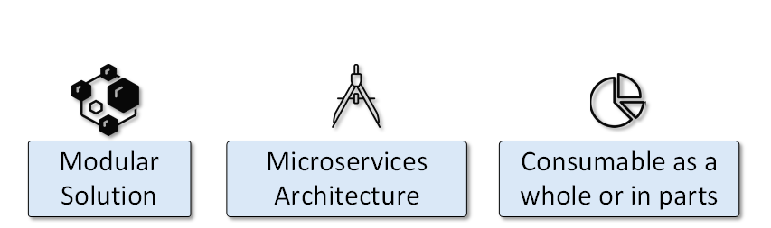
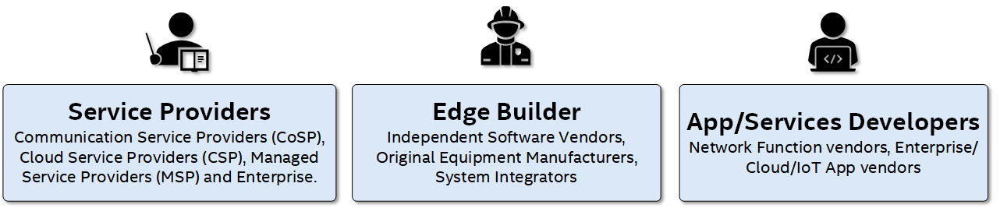
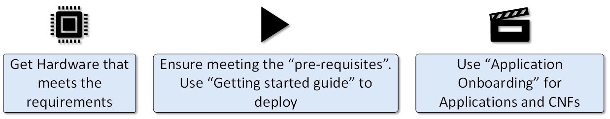
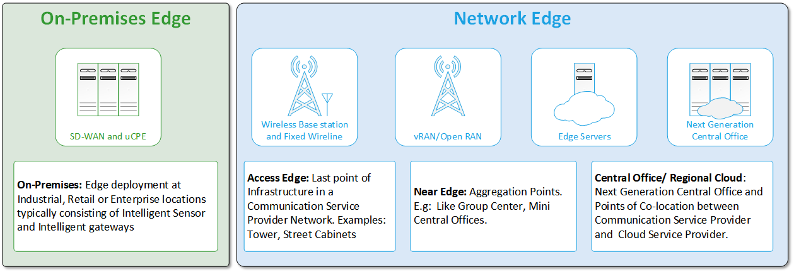
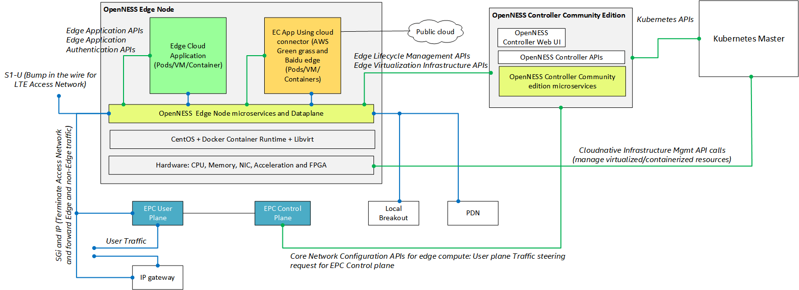
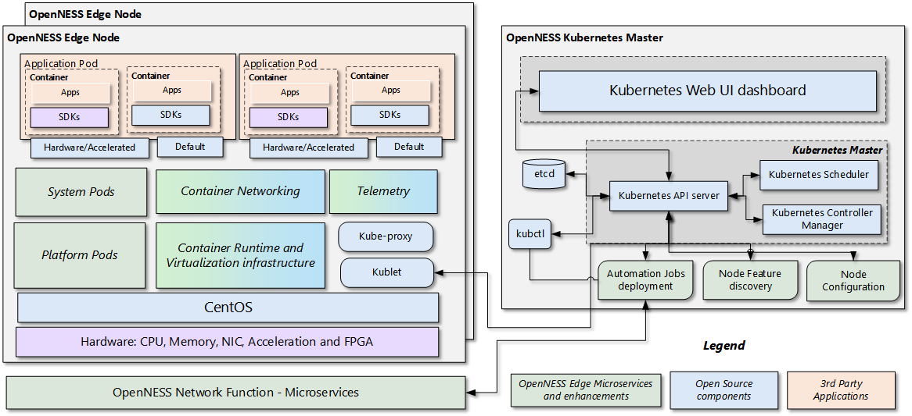
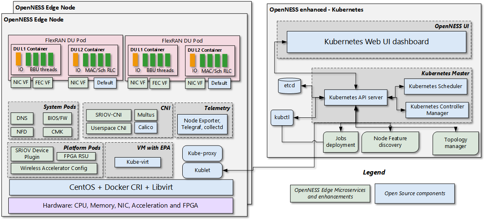
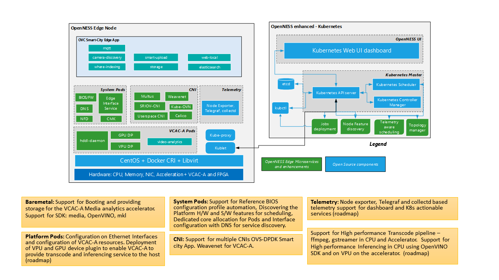

```text
SPDX-License-Identifier: Apache-2.0
Copyright (c) 2019-2020 Intel Corporation
```
<!-- omit in toc -->
# OpenNESS Architecture and Solution Overview
- [OpenNESS Overview](#openness-overview)
- [OpenNESS Distributions](#openness-distributions)
- [Deployment Based on Location](#deployment-based-on-location)
- [Architecture Overview](#architecture-overview)
  - [Logical](#logical)
  - [Architecture](#architecture)
    - [OpenNESS Kubernetes Control Plane Node](#openness-kubernetes-control-plane-node)
    - [OpenNESS Edge Node](#openness-edge-node)
- [Microservices, Kubernetes Extensions, and Enhancements](#microservices-kubernetes-extensions-and-enhancements)
  - [Platform Pods - Enhanced Platform Awareness](#platform-pods---enhanced-platform-awareness)
  - [System Pods](#system-pods)
  - [Container Networking](#container-networking)
  - [Telemetry](#telemetry)
  - [Software Development Kits](#software-development-kits)
- [Edge Services and Network Functions](#edge-services-and-network-functions)
- [OpenNESS Experience Kit](#openness-experience-kit)
  - [Minimal flavor](#minimal-flavor)
  - [RAN node flavor](#ran-node-flavor)
  - [Application node flavor](#application-node-flavor)
  - [Microsoft Azure OpenNESS](#microsoft-azure-openness)
  - [Converged Edge Reference Architecture (CERA) Flavor](#converged-edge-reference-architecture-cera-flavor)
- [Other References](#other-references)
- [List of Abbreviations](#list-of-abbreviations)

## OpenNESS Overview 


Open Network Edge Services Software (OpenNESS) is a software toolkit that enables highly optimized and performant edge platforms to onboard and manage applications and network functions with cloud-like agility. OpenNESS is a modular, microservice oriented architecture that can be consumed by a customer as a whole solution or in parts. 

OpenNESS is intended for the following types of users:


OpenNESS simplifies edge platform development and deployment:
- <b>Abstracts Network Complexity</b>: Users can choose from many data planes, container network interfaces, and access technologies.
- <b>Cloud Native Capabilities</b>: User support of cloud-native ingredients for resource orchestration, telemetry, and service mesh.
- <b>Hardware and Software Optimizations for Best Performance and ROI</b>: Dynamic discovery and optimal placement of apps and services. Users can expose underlying edge hardware and enable the control and management of hardware accelerators.

OpenNESS provides three easy steps to achieve deployment:
1. Acquire hardware that meets the requirements
2. Meet the prerequisites and use the [Getting Started Guide](https://github.com/open-ness/specs/blob/master/doc/getting-started/openness-experience-kits.md) for deployment
3. Use [Application Onboarding](https://github.com/open-ness/specs/blob/master/doc/applications-onboard/network-edge-applications-onboarding.md) for applications and Cloud-native Network Functions (CNFs)




## OpenNESS Distributions
OpenNESS is released as two distributions:
1. <b>OpenNESS </b>: A full open-source distribution of OpenNESS
2. <b>Intel® Distribution of OpenNESS </b>: A licensed distribution from Intel that includes all the features in OpenNESS along with additional microservices, Kubernetes\* extensions, enhancements, and optimizations for Intel® architecture. 

The Intel Distribution of OpenNESS requires a secure login to the OpenNESS GitHub\* repository. For access to the Intel Distribution of OpenNESS, contact your Intel support representative. 

## Deployment Based on Location
OpenNESS supports the deployment of edge nodes that host applications and network functions at the following locations:
- <b>On-Premises</b>: The Edge Computing resources are located in the customer premises (e.g., industrial, retail, healthcare) and managed by either the Communication Service Provider (CoSP) or the Enterprise customer as a Private network (Private 4G/5G, uCPE/SDWAN). These deployments retain the sensitive data generated on-premises. 
- <b>Network Edge</b>: Edge compute resources are often spread across the CoSP network (e.g. Access Edge - Cell site, Near Edge - Aggregation Sites, and Central Office - Regional Data Center) and managed by the CoSP. Adoption of 5G has paved the way for cloud-native, commercial off-the-shelf  (COTS) deployments that host network functions and applications.  

Most of these deployments are fully virtualized and moving towards cloud-native platforms for agility and elasticity. 



## Architecture Overview 
Before reviewing the detailed architecture overview of OpenNESS, take a look at the logical overview of how OpenNESS microservices are laid out. 

### Logical 
The OpenNESS solution is built on top of Kubernetes, which is a production-grade container orchestration environment. A typical OpenNESS-based deployment consists of an **OpenNESS Kubernetes Control Plane Node** and an **OpenNESS Edge Node**.



**OpenNESS Kubernetes Control Plane Node**: This node consists of microservices and Kubernetes extensions, enhancements, and optimizations that provide the functionality to configure one or more OpenNESS Edge Nodes and the application services that run on those nodes (Application Pod Placement, Configuration of Core Network, etc). 

**OpenNESS Edge Node**: This node consists of microservices and Kubernetes extensions, enhancements, and optimizations that are needed for edge application and network function deployments. It also consists of APIs that are often used for the discovery of application services. 

Another key ingredient is the 4G/5G core network functions that enable a private or public edge. OpenNESS uses reference network functions to validate this end-to-end edge deployment. This is key to understanding and measuring edge Key Performance Indicators (KPIs).  

### Architecture 


#### OpenNESS Kubernetes Control Plane Node
The OpenNESS Kubernetes Control Plane Node consists of Vanilla Kubernetes Control Plane Node components along with OpenNESS microservices that interact with the Kubernetes Control Plane Node using Kubernetes defined APIs. 

The following are the high-level features of the OpenNESS Kubernetes Control Plane microservice:
- Configuration of the hardware platform that hosts applications and network functions 
- Configuration of network functions (4G, 5G, and WiFi\*)
- Detection of various hardware and software capabilities of the edge cluster and use for scheduling applications and network functions 
- Setup of network and DNS policies for applications and network functions 
- Enable collection of hardware infrastructure, software, and application monitoring 
- Expose edge cluster capabilities northbound to a controller

#### OpenNESS Edge Node
The OpenNESS Edge Node consists of Vanilla Kubernetes Node components along with OpenNESS microservices that interact with Kubernetes node using Kubernetes defined APIs.

The following are the high-level features of the OpenNESS Kubernetes node microservice:
- Container runtime (Docker\*) and virtualization infrastructure (libvirt\*, Open vSwitch (OVS)\*, etc.) support
- Platform pods consisting of services that enable the configuration of a node for a particular deployment, device plugins enabling hardware resource allocation to an application pod, and detection of interfaces and reporting to the Control Plane node.
- System pods consisting of services that enable reporting the hardware and software features of each node to the Control Plane, resource isolation service for pods, and providing a DNS service to the cluster 
- Telemetry consisting of services that enable hardware, operating system, infrastructure, and application-level telemetry for the edge node 
- Support for real-time kernel for low latency applications and network functions like 4G and 5G base station and non-real-time kernel 
 
The OpenNESS Network functions are the key 4G and 5G functions that enable edge cloud deployment. OpenNESS provides these key reference network functions and the configuration agent in the Intel Distribution of OpenNESS.  

The OpenNESS solution validates the functionality and performance of key software development kits used for applications and network functions at the edge. This spans across edge applications that use Intel® Media SDK, OpenVINO™, Intel® Math Kernel Library (Intel® MKL), etc. and network functions that use Data Plane Development Kit (DPDK), Intel® Performance Primitives, Intel® MKL, OpenMP\*, OpenCL\*, etc.

## Microservices, Kubernetes Extensions, and Enhancements  

OpenNESS microservices and enhancements can be understood under the following sub-classification: All OpenNESS microservices are provided as Helm charts. 

### Platform Pods - Enhanced Platform Awareness 
Enhanced Platform Awareness (EPA) represents a methodology and a related set of enhancements across multiple layers of the orchestration stack, targeting intelligent platform capabilities as well as configuration and capacity consumption. 

EPA features include: 
* HugePages support
* Non-uniform memory access (NUMA) topology awareness
* CPU pinning
* Integration of OVS with DPDK
* Support for I/O Pass-through via SR-IOV
* HDDL support
* FPGA resource allocation support, and many others

Why should users consider using EPA? To achieve optimal performance and efficiency characteristics. EPA extensions facilitate the automation of an advanced selection of capabilities and tuning parameters during the deployment of cloud-native solutions. EPA also enables service providers to offer differentiating and/or revenue-generating services that require leveraging specific hardware features.

OpenNESS provides a complete solution for users to integrate key EPA features needed for applications (CDN, AI inference, transcoding, gaming, etc.) and CNFs (RAN DU, CU, and Core) to work optimally for edge deployments.

OpenNESS supports the following EPA microservices, which typically span across the system and platform pods discussed earlier in this document. 
- <b>High-Density Deep Learning (HDDL)</b>: Software that enables OpenVINO™-based AI apps to run on Intel® Movidius™ Vision Processing Units (VPUs). It consists of the following components:
  - HDDL device plugin for K8s
  - HDDL service for scheduling jobs on VPUs
- <b>Visual Compute Acceleration - Analytics (VCAC-A)</b>: Software that enables OpenVINO™-based AI apps and media apps to run on Intel® Visual Compute Accelerator Cards (Intel® VCA Cards). It is composed of the following components: 
  - VPU device plugin for K8s
  - HDDL service for scheduling jobs on VPU
  - GPU device plugin for K8s
- <b>FPGA/eASIC/NIC</b>: Software that enables AI inferencing for applications, high-performance and low-latency packet pre-processing on network cards, and offloading for network functions such as eNB/gNB offloading Forward Error Correction (FEC). It consists of: 
  - FPGA device plugin for inferencing
  - SR-IOV device plugin for FPGA/eASIC
  - Dynamic Device Profile for Network Interface Cards (NIC)
- <b>Resource Management Daemon (RMD)</b>: RMD uses Intel® Resource Director Technology (Intel® RDT) to implement cache allocation and memory bandwidth allocation to the application pods. This is a key technology for achieving resource isolation and determinism on a cloud-native platform. 
- <b>Node Feature Discovery (NFD)</b>: Software that enables node feature discovery for Kubernetes. It detects hardware features available on each node in a Kubernetes cluster and advertises those features using node labels. 
- <b>Topology Manager</b>: This component allows users to align their CPU and peripheral device allocations by NUMA node.
- <b>Kubevirt</b>: Provides support for running legacy applications in VM mode and the allocation of SR-IOV ethernet interfaces to VMs. 

### System Pods 
- <b>Edge Interface Service</b>: This service is an application that runs in a Kubernetes pod on each node of the OpenNESS Kubernetes cluster. It allows attachment of additional network interfaces of the node host to provide an OVS bridge, enabling external traffic scenarios for applications deployed in Kubernetes pods. Services on each node can be controlled from the Control Plane node using a kubectl plugin. 
This interface service can attach both kernel and userspace (DPDK) network interfaces to OVS bridges of a suitable type.
- <b>BIOS/Firmware Configuration Service </b>: Uses Intel's System Configuration Utility (syscfg) tool to build a pod that is scheduled by K8s as a job that configures both BIOS and FW with the given specification.
- <b>DNS Service</b>: Supports DNS resolution and forwarding services for the application deployed on edge computing. The DNS server is implemented based on the DNS library in Go. DNS service supports resolving DNS requests from user equipment (UE) and applications on the edge cloud.
- <b>Video Transcode Service</b>: An application microservice that exposes a REST API for transcoding on CPU or GPU.    
- <b>Edge Application Agent (EAA)</b>: Edge application APIs are implemented by the EAA. Edge application APIs are important APIs for edge application developers. EAA APIs provide APIs for service discovery, subscription, and update notification. 

### Container Networking 
OpenNESS provides a flexible and high-performance set of container networking using Container Networking Interfaces (CNIs). Some of the high-performance, open-source CNIs are also supported. 

Container networking support in OpenNESS addresses the following: 
- Highly-coupled, container-to-container communications
- Pod-to-pod communications on the same node and across the nodes 

OpenNESS supports the following CNIs:
- <b>SRIOV CNI</b>: works with the SR-IOV device plugin for VF allocation for a container. 
- <b>User Space CNI</b>: designed to implement userspace networking (as opposed to kernel space networking). 
- <b>Bond CNI</b>: provides a method for aggregating multiple network interfaces into a single logical "bonded" interface.
- <b>Multus CNI</b>: enables attaching multiple network interfaces to pods in Kubernetes.
- <b>Weave CNI</b>: creates a virtual network that connects Docker containers across multiple hosts and enables their automatic discovery.  
- <b>Kube-OVN CNI</b>: integrates the OVN-based network virtualization with Kubernetes. It offers an advanced container network fabric for enterprises with the most functions and the easiest operation.
- <b>Calico CNI/eBPF</b>: supports applications with higher performance using eBPF and IPv4/IPv6 dual-stack
 
###  Telemetry 
Edge builders need a comprehensive telemetry framework that combines application telemetry, hardware telemetry, and events to create a heat-map across the edge cluster and enables the orchestrator to make scheduling decisions.

Industry-leading, cloud-native telemetry and monitoring frameworks are supported on OpenNESS:
- <b>Prometheus\* and Grafana\*</b>: This is a cloud-native, industry-standard framework that provides a monitoring system and time series database. 
- <b>Telegraf</b> This is a cloud-native, industry-standard agent for collecting, processing, aggregating, and writing metrics.
- <b>Open Telemetry </b>: Open Consensus, Open Tracing - CNCF project that provides the libraries, agents, and other components that you need to capture telemetry from your services so that you can better observe, manage, and debug them.

Hardware Telemetry support: 
- CPU: Supported metrics - cpu, cpufreq, load, HugePages, intel_pmu, intel_rdt, ipmi 
- Dataplane: Supported metrics - ovs_stats and ovs_pmd_stats
- Accelerator: Supported Metrics from - FPGA–PAC-N3000, VCAC-A, HDDL-R, eASIC, GPU, and NIC

OpenNESS also supports a reference application of using telemetry to take actions using Kubernetes APIs. This reference is provided to the Telemetry Aware Scheduler project. 

### Software Development Kits 
OpenNESS supports leading SDKs for edge services (applications) and network function development. As part of the development of OpenNESS, applications developed using these SDKs are optimized to provide optimal performance. This ensures that when customers develop applications using these SDKs, they can achieve optimal performance. 

- <b> OpenVINO™ SDK </b>: The OpenVINO™ toolkit is composed of a variety of tools from Intel that work together to provide a complete computer vision pipeline solution that is optimized on Intel® architecture. This article will focus on the Intel® Media SDK component of the toolkit. The Intel Media SDK is a high-level API for specific video processing operations: decode, process, and encode. It supports H.265, H.264, MPEG-2, and more codecs. Video processing can be used to resize, scale, de-interlace, color conversion, de-noise, sharpen, and more. The Intel Media SDK works in the background to leverage hardware acceleration on Intel® architecture with optimized software fallback for each hardware platform. Thus, developers do not need to change the code from platform to platform and can focus more on the application itself rather than on hardware optimization.
- <b> Intel Media SDK </b>: SDK used for developing video applications with state-of-the-art libraries, tools, and samples. They are all accessible via a single API that enables hardware acceleration for fast video transcoding, image processing, and media workflows. The two main paths for application developers to access GPU media processing capabilities are Intel® Media SDK and Intel® SDK for OpenCL™ applications.
- <b>DPDK</b>: Data Plane Development Kit (DPDK) consists of libraries to accelerate packet-processing workloads that run on a wide variety of CPU architectures.
- <b>Intel IPP</b>: Intel® Integrated Performance Primitives (Intel® IPP) is an extensive library of ready-to-use, domain-specific functions that are highly optimized for diverse Intel® architectures.
- <b>Intel® MKL</b>: Intel® Math Kernel Library (Intel® MKL) optimizes code with minimal effort for future generations of Intel® processors. It is compatible with your choice of compilers, languages, operating systems, and linking and threading models.

## Edge Services and Network Functions  
OpenNESS supports a rich set of reference and commercial real-world edge services (applications) and network functions. These applications and network functions are a vehicle for validating functionality and performance KPIs for Edge. 

The following is a subset of supported edge applications: 
- <b>Smart city App</b>: This end-to-end sample app implements aspects of smart city sensing, analytics, and management, utilizing CPU or VCA.
- <b>CDN Transcode and Content Delivery App</b>: The CDN Transcode sample app is an Open Visual Cloud software stack with all required open-source ingredients integrated to provide an out-of-the-box CDN media transcode service, including live streaming and video on demand. It provides a Docker-based software development environment for developers to easily build specific applications.
- <b>Edge Insights</b>: The Edge Insights application is designed to enable secure ingestion, processing, storage and management of data, and near real-time (~10ms), event-driven control, across a diverse set of industrial protocols. 

The following is a subset of supported reference network functions:  
- <b>gNodeB or eNodeB</b>: 5G or 4G base station implementation on Intel architecture based on Intel’s FlexRAN.

## OpenNESS Experience Kit 
The OpenNESS Experience Kit is an Ansible\* playbook that acts as a single interface for users to deploy OpenNESS. The kit organizes all of the above microservices, Kubernetes extensions, enhancements, and optimizations under easy to deploy node types called <b>flavors</b>, implemented as Ansible roles.

For example, a user deploying a network edge at a cell site can choose the Radio Access Network (RAN) flavor to deploy a node with all the microservices, Kubernetes extensions, enhancements, and optimizations required for a RAN node. 

### Minimal flavor  
This flavor supports the installation of the minimal set of components from OpenNESS and, it is typically used as a starting point for creating a custom node. 

### RAN node flavor 
RAN node typically refers to RAN Distributed Unit (DU) and Centralized Unit (CU) 4G/5G nodes deployed on the edge or far edge. In some cases, DU may be integrated into the radio. The example RAN deployment flavor uses FlexRAN as a reference DU. 



### Application node flavor 
Application nodes typically refer to nodes running edge applications and services. The applications can be Smart City, CDN, AR/VR, Cloud Gaming, etc. In the example flavor below, the Smart City application pipeline is used.  

Under the application node, the following flavors are supported: 
- Media Analytics Flavor
- Media Analytics Flavor with VCAC-C
- CDN Transcode 
- CDN Content Delivery 



### Microsoft Azure OpenNESS
This flavor supports the installation of an OpenNESS Kubernetes cluster on a Microsoft\* Azure\* VM. This is typically used by a customer who requires the same Kubernetes cluster service on multiple clouds.

### Converged Edge Reference Architecture (CERA) Flavor 
CERA from Intel provides foundational recipes that converge IT as well as OT and NT workloads on various on-premise and network edge platforms. 

In future OpenNESS releases, various CERA flavors will be available. Each of these recipes would include combinations of other OpenNESS flavors (e.g., RAN + UPF + Apps)

## Other References
- [3GPP_23401]	3rd Generation Partnership Project; Technical Specification Group Services and System Aspects; General Packet Radio Service (GPRS) enhancements for Evolved Universal Terrestrial Radio Access Network  (E-UTRAN) access.     
- [3GPP_23214]	3rd Generation Partnership Project; Technical Specification Group Services and System Aspects; Architecture enhancements for control and user plane separation of EPC nodes; Stage 2.
- [ETSI_MEC_003] ETSI GS MEC 003 V2.1.1 Multi-access Edge Computing (MEC): Framework and Reference Architecture     
- [ETSI_23501] 5G; System Architecture for the 5G System (3GPP TS 23.501 version 15.2.0 Release 15), ETSI TS 123 501.
- [OpenVINO toolkit](https://software.intel.com/en-us/openvino-toolkit)
- [Intel® Math Kernel Library](https://software.intel.com/content/www/us/en/develop/tools/math-kernel-library.html)
- [Intel® Media SDK](https://software.intel.com/content/www/us/en/develop/tools/media-sdk.html)
- [DPDK](https://www.dpdk.org/)
- [FlexRAN](https://github.com/intel/FlexRAN)
- [Enabling 5G Wireless Acceleration in FlexRAN: for the Intel® FPGA Programmable Acceleration Card N3000](https://www.intel.com/content/www/us/en/programmable/documentation/ocl1575542673666.html)

## List of Abbreviations

| Acronym  | Definition                                      |
|----------|-------------------------------------------------|
| 3GPP     | Third Generation Partnership Project            |
| AF       | Application Function                            |
| AMF      | Access and Mobility Mgmt Function               |
| API      | Application Programming Interface               |
| APN      | Access Point Name                               |
| AUSF     | Authentication Server Function                  |
| COTS     | Commercial Off-the-shelf                        |
| CU       | Centralized Unit of RAN                         |
| CUPS     | Control and User Plane Separation of EPC Nodes  |
| DN       | Data Network                                    |
| DU       | Distributed Unit of RAN                         |
| EPC      | Evolved Packet Core                             |
| ETSI     | European Telecommunications Standards Institute |
| FQDN     | Fully Qualified Domain Name                     |
| HTTP     | Hyper Text Transfer Protocol                    |
| IDO      | Intel Distribution of OpenNESS                  |
| IMSI     | International Mobile Subscriber Identity        |
| JSON     | JavaScript Object Notation                      |
| LTE      | Long-Term Evolution                             |
| MCC      | Mobile Country Code                             |
| MEC      | Multi-Access Edge Computing                     |
| MME      | Mobility Management Entity                      |
| MNC      | Mobile Network Code                             |
| NEF      | Network Exposure Function                       |
| NRF      | Network function Repository Function            |
| NUMA     | NonUniform Memory Access                        |
| OAM      | Operations, Administration and Maintenance      |
| OEK      | OpenNESS Experience Kit                         |
| OpenNESS | Open Network Edge Services Software             |
| PCF      | Policy Control Function                         |
| PDN      | Packet Data Network                             |
| PFCP     | Packet Forwarding Control Protocol              |
| PGW      | PDN Gateway                                     |
| PGWC     | PDN Gateway Control Plane Function              |
| PGWU     | PDN Gateway User Plane Function                 |
| REST     | REpresentational State Transfer                 |
| SBI      | Service Based Interfaces                        |
| SGW      | Serving Gateway                                 |
| SGWC     | Serving Gateway Control Plane Function          |
| SGWU     | Serving Gateway User Plane Function             |
| SMF      | Session Management Function                     |
| SRIOV    | Single Root I/O Virtualization                  |
| TAC      | Tracking Area Code                              |
| UDM      | Unified Data Management                         |
| UE       | User Equipment (in the context of LTE)          |
| UPF      | User Plane Function                             |
| UUID     | Universally Unique IDentifier                   |
| VIM      | Virtual Infrastructure Manager                  |
