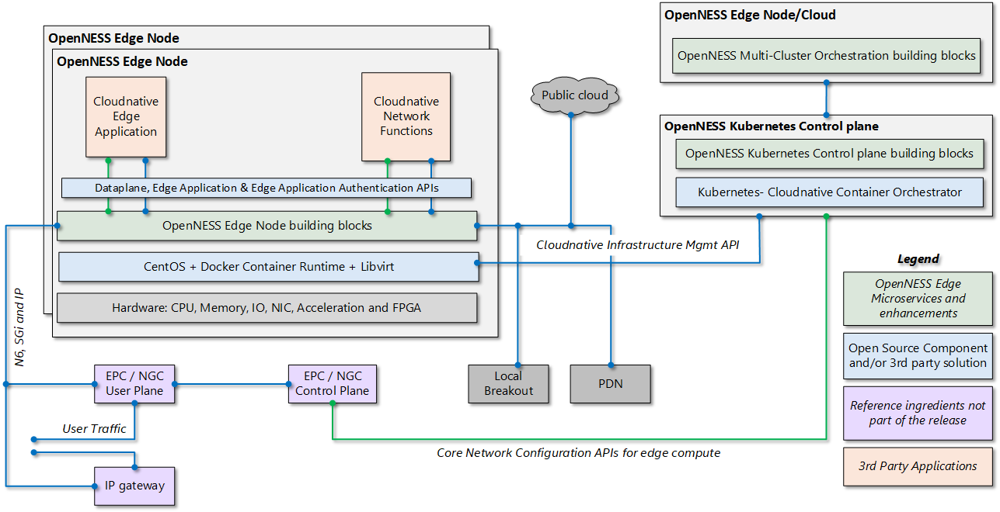
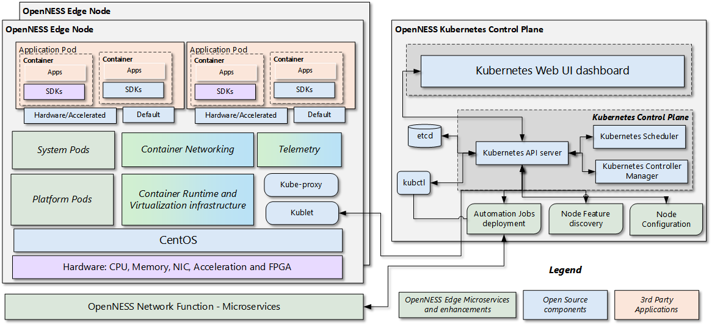
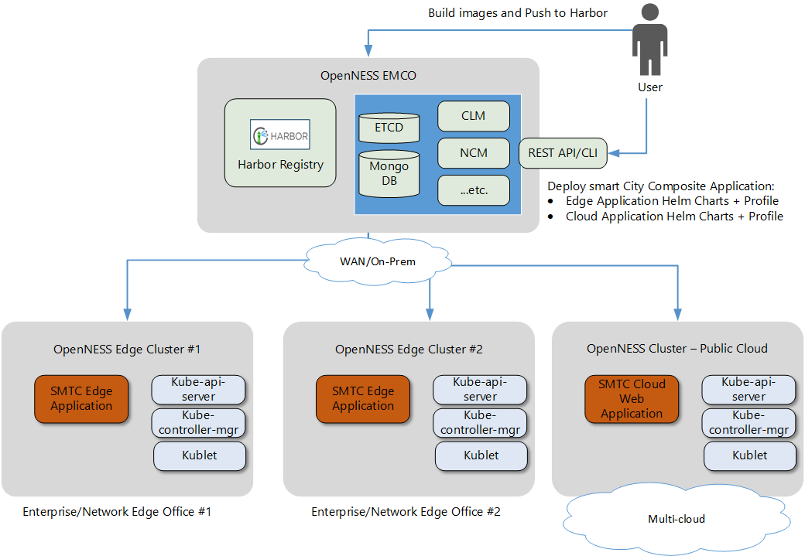
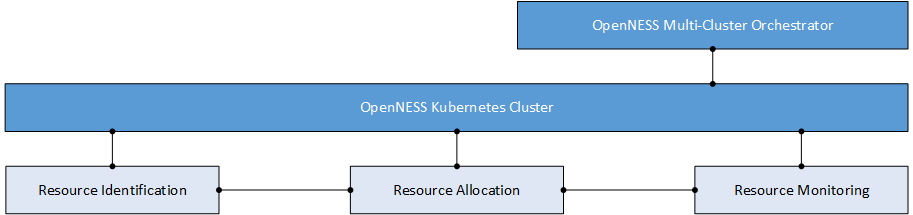

```text
SPDX-License-Identifier: Apache-2.0
Copyright (c) 2019-2020 Intel Corporation
```
<!-- omit in toc -->
# Smart Edge Open Architecture and Solution Overview

- [Architecture Overview](#architecture-overview)
  - [Logical](#logical)
  - [Architecture](#architecture)
    - [Smart Edge Open Kubernetes Control Plane](#smart-edge-open-kubernetes-control-plane)
    - [Smart Edge Open Edge Node](#smart-edge-open-edge-node)
- [Building Blocks, Kubernetes Extensions, and Enhancements](#building-blocks-kubernetes-extensions-and-enhancements)
  - [Multi-Access Networking](#multi-access-networking)
  - [Edge Multi-Cluster Orchestration](#edge-multi-cluster-orchestration)
  - [Resource Management](#resource-management)
    - [Resource Identification](#resource-identification)
    - [Resource Allocation](#resource-allocation)
    - [Resource Monitoring](#resource-monitoring)
  - [Accelerators](#accelerators)
  - [Dataplane/Container Network Interfaces](#dataplanecontainer-network-interfaces)
  - [Edge Aware Service Mesh](#edge-aware-service-mesh)
  - [Telemetry and Monitoring](#telemetry-and-monitoring)
  - [Edge Services](#edge-services)
  - [Software Development Kits](#software-development-kits)
- [Converged Edge Reference Architecture](#converged-edge-reference-architecture)
  - [Smart Edge Open Experience Kit Minimal Flavor](#smart-edge-open-experience-kit-minimal-flavor)
  - [Smart Edge Open Experience Kit Access Edge Flavor](#smart-edge-open-experience-kit-access-edge-flavor)
  - [Smart Edge Open Experience Kit Near Edge Flavor](#smart-edge-open-experience-kit-near-edge-flavor)
  - [Smart Edge Open Experience Kit SD-WAN Edge Flavor](#smart-edge-open-experience-kit-sd-wan-edge-flavor)
  - [Smart Edge Open Experience Kit SD-WAN Hub Flavor](#smart-edge-open-experience-kit-sd-wan-hub-flavor)
  - [Smart Edge Open Experience Kit Media Analytics Flavor with VCAC-A](#smart-edge-open-experience-kit-media-analytics-flavor-with-vcac-a)
  - [Smart Edge Open Experience Kit Media Analytics Flavor](#smart-edge-open-experience-kit-media-analytics-flavor)
  - [Smart Edge Open Experience Kit CDN Transcode Flavor](#smart-edge-open-experience-kit-cdn-transcode-flavor)
  - [Smart Edge Open Experience Kit CDN Caching Flavor](#smart-edge-open-experience-kit-cdn-caching-flavor)
  - [Smart Edge Open Experience Kit Core Control Plane Flavor](#smart-edge-open-experience-kit-core-control-plane-flavor)
  - [Smart Edge Open Experience Kit Core User Plane Flavor](#smart-edge-open-experience-kit-core-user-plane-flavor)
  - [Smart Edge Open Experience Kit for Untrusted Non-3GPP Access Flavor](#smart-edge-open-experience-kit-for-untrusted-non-3gpp-access-flavor)
- [Reference Edge Apps and Network Functions](#reference-edge-apps-and-network-functions)
- [Smart Edge Open Optimized Commercial Applications](#smart-edge-open-optimized-commercial-applications)
  - [Smart Edge Open DevKit for Microsoft Azure](#smart-edge-open-devkit-for-microsoft-azure)
- [Other References](#other-references)
- [List of Abbreviations](#list-of-abbreviations)

## Architecture Overview 

Before reviewing the detailed architecture overview of Smart Edge Open, take a look at the logical overview of how the Smart Edge Open Building Blocks are laid out. 

### Logical 

The Smart Edge Open solution is built on top of Kubernetes, which is a production-grade container orchestration environment. A typical Smart Edge Open-based deployment consists of an **Smart Edge Open Kubernetes Control Plane** and an **Smart Edge Open Edge Node**.



**Smart Edge Open Kubernetes Control Plane**: This node consists of microservices and Kubernetes extensions, enhancements, and optimizations that provide the functionality to configure one or more Smart Edge Open Edge Nodes and the application services that run on those nodes (Application Pod Placement, Configuration of Core Network, etc). 

**Smart Edge Open Edge Node**: This node consists of microservices and Kubernetes extensions, enhancements, and optimizations that are needed for edge application and network function deployments. It also consists of APIs that are often used for the discovery of application services. 

Another key ingredient is the 4G/5G core network functions that enable a private or public edge. Smart Edge Open uses reference network functions to validate this end-to-end edge deployment. This is key to understanding and measuring edge Key Performance Indicators (KPIs).  

### Architecture 



#### Smart Edge Open Kubernetes Control Plane

The Smart Edge Open Kubernetes Control Plane consists of Vanilla Kubernetes Control Plane components along with Smart Edge Open microservices that interact with the Kubernetes Control Plane using Kubernetes defined APIs. 

The following are the high-level features of the Smart Edge Open Kubernetes Control Plane building blocks:

- Configuration of the hardware platform that hosts applications and network functions 
- Configuration of network functions (4G, 5G, and WiFi\*)
- Detection of various hardware and software capabilities of the edge cluster and use for scheduling applications and network functions 
- Setup of network and DNS policies for applications and network functions 
- Enable collection of hardware infrastructure, software, and application monitoring 
- Expose edge cluster capabilities northbound to a controller

#### Smart Edge Open Edge Node 

The Smart Edge Open Edge Node consists of Vanilla Kubernetes Node components along with Smart Edge Open Building Blocks that interact with Kubernetes node using Kubernetes defined APIs.

The following are the high-level features of the Smart Edge Open Kubernetes node building blocks:

- Container runtime (Docker\*) and virtualization infrastructure (libvirt\*, Open vSwitch (OVS)\*, etc.) support
- Platform pods consisting of services that enable the configuration of a node for a particular deployment, device plugins enabling hardware resource allocation to an application pod, and detection of interfaces and reporting to the Control Plane.
- System pods consisting of services that enable reporting the hardware and software features of each node to the Control Plane, resource isolation service for pods, and providing a DNS service to the cluster 
- Telemetry consisting of services that enable hardware, operating system, infrastructure, and application-level telemetry for the edge node 
- Support for real-time kernel for low latency applications and network functions like 4G and 5G base station and non-real-time kernel 

The Smart Edge Open Network functions are the key 4G and 5G functions that enable edge cloud deployment. Smart Edge Open provides these key reference network functions and the configuration agent in the Intel Distribution of Smart Edge Open.  

The Smart Edge Open solution validates the functionality and performance of key software development kits used for applications and network functions at the edge. This spans across edge applications that use Intel® Media SDK, OpenVINO™, Intel® Math Kernel Library (Intel® MKL), etc. and network functions that use Data Plane Development Kit (DPDK), Intel® Performance Primitives, Intel® MKL, OpenMP\*, OpenCL\*, etc.

## Building Blocks, Kubernetes Extensions, and Enhancements

This section provides of an overview of the various Smart Edge Open Building Blocks, extensions to Kubernetes and enhancements to other open source frameworks required for the development of Edge platforms. These building blocks span across the system and platform pods discussed earlier. Many are provided as Helm charts.

### Multi-Access Networking

This building block represents a set of microservices that enables steering of traffic from various access networks to and from edge apps and services. 

- **Application Function (AF):** is a microservice in the Smart Edge Open Kubernetes Control Plane that supports Traffic Influencing Subscription, Packet Flow Description Management functionality, and Policy Authorization to help steer the Edge-specific traffic in UPF towards the applications deployed on the Smart Edge Open edge node. AF is developed as per the Rel.15 3gpp specifications. AF is only available in the Intel Distribution of Smart Edge Open.  
- **Network Exposure Function (NEF)**: is a microservice used for validation of AF functionality in Smart Edge Open before integrating with the 5G Core.  The functionality is limited and in line with the AF functional scope. It includes a reference implementation for Traffic influence and PFD management. NEF is developed as per the Rel.15 3gpp specifications. NEF is only available in the Intel Distribution of Smart Edge Open. 
- **Core Network Configuration Agent (CNCA)**: is a microservice that provides an interface for orchestrators that interact with Smart Edge Open Kubernetes Control Plane to interact with the 5G Core network solution. CNCA provides a CLI (kube-ctl plugin) interface to interact with the AF and OAM services. CNCA is only available in the Intel Distribution of Smart Edge Open.
- **Edge Application Agent (EAA)**: Edge application APIs are implemented by the EAA. Edge application APIs are important APIs for edge application developers. EAA APIs provide APIs for service discovery, subscription, and update notification. EAA APIs are based on ETSI MEC- MEC11 MP1 APIs specifications.
- **Edge Interface Service**: This service is an application that runs in a Kubernetes pod on each node of the Smart Edge Open Kubernetes cluster. It allows attachment of additional network interfaces of the node host to provide an OVS bridge, enabling external traffic scenarios for applications deployed in Kubernetes pods. Services on each node can be controlled from the Control Plane using a kubectl plugin. This interface service can attach both kernel and userspace (DPDK) network interfaces to OVS bridges of a suitable type.
- **DNS Service**: Supports DNS resolution and forwarding services for the application deployed on edge computing. The DNS server is implemented based on the DNS library in Go. DNS service supports resolving DNS requests from user equipment (UE) and applications on the edge cloud.  

### Edge Multi-Cluster Orchestration

Edge Multi-Cluster Orchestration(EMCO), is a Geo-distributed application orchestrator for Kubernetes*. The main objective of EMCO is automation of the deployment of applications and services across clusters. It acts as a central orchestrator that can manage edge services and network functions across geographically distributed edge clusters from different third parties. Finally, the resource orchestration within a cluster of nodes will leverage Kubernetes* and Helm charts.



Link: [EMCO](https://github.com/smart-edge-open/specs/blob/master/doc/building-blocks/emco/smartedge-open-emco.md)
### Resource Management

Resource Management represents a methodology which involves identification of the hardware and software resources on the edge cluster, Configuration and allocation of the resources and continuous monitoring of the resources for any changes.



Smart Edge Open provides set of enhancements across multiple layers of the orchestration stack, targeting identification of platform capabilities as well as configuration and capacity consumption. 

Why should users consider using Resource Management? To achieve optimal performance and efficiency characteristics. Resource Management extensions facilitate the automation of an advanced selection of capabilities and tuning parameters during the deployment of cloud-native solutions. Resource Management also enables service providers to offer differentiating and/or revenue-generating services that require leveraging specific hardware features.

Smart Edge Open provides a complete solution for users to integrate key resource management features needed for applications (CDN, AI inference, transcoding, gaming, etc.) and CNFs (RAN DU, CU, and Core) to work optimally for edge deployments.

#### Resource Identification

Resource identification involves detecting key hardware and software features on the platform that can be used for scheduling of the workload on the cluster. Smart Edge Open support Node Feature Discovery (NFD) microservices that detects hardware and software features and labels the nodes with relevant features. 

#### Resource Allocation

Resource Allocation involves configuration of the certain hardware resources like CPU, IO devices, GPU, Accelerator devices, Memory (Hugepages) etc.. to the applications and services. Smart Edge Open provides many Device Plugins, Kubernetes jobs, CRD Operators and Red Hat OpenShift Operator: Special Resource Operators for configuration and resource allocation of VPU, GPU, FPGA, CPU L3 cache, Memory bandwidth resources to applications and services. 

#### Resource Monitoring

Resource monitoring involves tracking the usage of allocated resources to the applications and services and also tracking the remaining allocatable resources. Smart Edge Open provides collectors, node exporters using collectd, telegraf and custom exporters as part of telemetry and monitoring of current resource usage. Resource monitoring support is provided for CPU, VPU, FPGA AND Memory.

Link: [Enhanced Platform Awareness: Documents covering Accelerators and Resource Management](https://github.com/smart-edge-open/specs/tree/master/doc/building-blocks/enhanced-platform-awareness)

### Accelerators

Smart Edge Open supports the following accelerator microservices.

- <b>High-Density Deep Learning (HDDL)</b>: Software that enables OpenVINO™-based AI apps to run on Intel® Movidius™ Vision Processing Units (VPUs). It consists of the following components:
  - HDDL device plugin for K8s
  - HDDL service for scheduling jobs on VPUs
- <b>Visual Compute Acceleration - Analytics (VCAC-A)</b>: Software that enables OpenVINO™-based AI apps and media apps to run on Intel® Visual Compute Accelerator Cards (Intel® VCA Cards). It is composed of the following components: 
  - VPU device plugin for K8s
  - HDDL service for scheduling jobs on VPU
  - GPU device plugin for K8s
- <b>FPGA/eASIC/NIC</b>: Software that enables AI inferencing for applications, high-performance and low-latency packet pre-processing on network cards, and offloading for network functions such as eNB/gNB offloading Forward Error Correction (FEC). It consists of: 
  - FPGA device plugin for inferencing
  - SR-IOV device plugin for FPGA/eASIC
  - Dynamic Device Profile for Network Interface Cards (NIC) 
- **Intel® QuickAssist Technology (Intel® QAT)**: Software that enables offloading of security and compression task on data in rest or in-motion for the cloud, networking, big data, and storage applications: 
  - Kubernetes CRD operator for discrete and on-board Intel® QAT devices
  - Intel QuickAssist Technology (QAT) device plugin for Kubernetes

### Dataplane/Container Network Interfaces

Smart Edge Open provides a flexible and high-performance set of container networking using Container Networking Interfaces (CNIs). Some of the high-performance, open-source CNIs are also supported. 

Container networking support in Smart Edge Open addresses the following: 

- Highly-coupled, container-to-container communications
- Pod-to-pod communications on the same node and across the nodes 

Smart Edge Open supports the following CNIs:

- <b>SRIOV CNI</b>: works with the SR-IOV device plugin for VF allocation for a container. 
- <b>User Space CNI</b>: designed to implement userspace networking (as opposed to kernel space networking). 
- <b>Bond CNI</b>: provides a method for aggregating multiple network interfaces into a single logical "bonded" interface.
- <b>Multus CNI</b>: enables attaching multiple network interfaces to pods in Kubernetes.
- <b>Weave CNI</b>: creates a virtual network that connects Docker containers across multiple hosts and enables their automatic discovery.  
- <b>Kube-OVN CNI</b>: integrates the OVN-based network virtualization with Kubernetes. It offers an advanced container network fabric for enterprises with the most functions and the easiest operation.
- <b>Calico CNI/eBPF</b>: supports applications with higher performance using eBPF and IPv4/IPv6 dual-stack

Link: [Dataplane and CNI](https://github.com/smart-edge-open/specs/tree/master/doc/building-blocks/dataplane)

### Edge Aware Service Mesh 

Istio is a feature-rich, cloud-native service mesh platform that provides a collection of key capabilities such as: Traffic Management, Security and Observability uniformly across a network of services. Smart Edge Open integrates natively with the Istio service mesh to help reduce the complexity of large scale edge applications, services, and network functions. 

Link: [Service Mesh](https://github.com/smart-edge-open/specs/blob/master/doc/applications/smartedge-open_service_mesh.md)

### Telemetry and Monitoring

Edge builders need a comprehensive telemetry framework that combines application telemetry, hardware telemetry, and events to create a heat-map across the edge cluster and enables the orchestrator to make scheduling decisions.

Industry-leading, cloud-native telemetry and monitoring frameworks are supported on Smart Edge Open:

- <b>Prometheus\* and Grafana\*</b>: This is a cloud-native, industry-standard framework that provides a monitoring system and time series database. 
- <b>Telegraf</b> This is a cloud-native, industry-standard agent for collecting, processing, aggregating, and writing metrics.
- <b>Open Telemetry </b>: Open Consensus, Open Tracing - CNCF project that provides the libraries, agents, and other components that you need to capture telemetry from your services so that you can better observe, manage, and debug them.

Hardware Telemetry support: 

- CPU: Supported metrics - cpu, cpufreq, load, HugePages, intel_pmu, intel_rdt, ipmi 
- Dataplane: Supported metrics - ovs_stats and ovs_pmd_stats
- Accelerator: Supported Metrics from - FPGA–PAC-N3000, VCAC-A, HDDL-R, eASIC, GPU, and NIC

Smart Edge Open also supports a reference application of using telemetry to take actions using Kubernetes APIs. This reference is provided to the Telemetry Aware Scheduler project. 

### Edge Services 

These building blocks are included as part of System pods.

- <b>Video Transcode Service</b>: An application microservice that exposes a REST API for transcoding on CPU or GPU.

### Software Development Kits 

Smart Edge Open supports leading SDKs for edge services (applications) and network function development. As part of the development of Smart Edge Open, applications developed using these SDKs are optimized to provide optimal performance. This ensures that when customers develop applications using these SDKs, they can achieve optimal performance. 

- <b> OpenVINO™ SDK </b>: The OpenVINO™ toolkit is composed of a variety of tools from Intel that work together to provide a complete computer vision pipeline solution that is optimized on Intel® architecture. This article will focus on the Intel® Media SDK component of the toolkit. The Intel Media SDK is a high-level API for specific video processing operations: decode, process, and encode. It supports H.265, H.264, MPEG-2, and more codecs. Video processing can be used to resize, scale, de-interlace, color conversion, de-noise, sharpen, and more. The Intel Media SDK works in the background to leverage hardware acceleration on Intel® architecture with optimized software fallback for each hardware platform. Thus, developers do not need to change the code from platform to platform and can focus more on the application itself rather than on hardware optimization.
- <b> Intel Media SDK </b>: SDK used for developing video applications with state-of-the-art libraries, tools, and samples. They are all accessible via a single API that enables hardware acceleration for fast video transcoding, image processing, and media workflows. The two main paths for application developers to access GPU media processing capabilities are Intel® Media SDK and Intel® SDK for OpenCL™ applications.
- <b>DPDK</b>: Data Plane Development Kit (DPDK) consists of libraries to accelerate packet-processing workloads that run on a wide variety of CPU architectures.
- <b>Intel IPP</b>: Intel® Integrated Performance Primitives (Intel® IPP) is an extensive library of ready-to-use, domain-specific functions that are highly optimized for diverse Intel® architectures.
- <b>Intel® MKL</b>: Intel® Math Kernel Library (Intel® MKL) optimizes code with minimal effort for future generations of Intel® processors. It is compatible with your choice of compilers, languages, operating systems, and linking and threading models.


## Converged Edge Reference Architecture 

Converged Edge Reference Architecture (Smart Edge Open Experience Kit) is a set of pre-integrated & readily deployable HW/SW Reference Architectures powered by Smart Edge Open to significantly accelerate Edge Platform development. 

Smart Edge Open includes an Ansible\* playbook that acts as a single interface for users to deploy various types of Smart Edge Open Experience Kits. The playbook organizes all of the above microservices, Kubernetes extensions, enhancements, and optimizations under easy to deploy node types called <b>flavors</b>, implemented as Ansible roles.

For example, a user deploying a network edge at a cell site can choose the Access Edge flavor to deploy a node with all the microservices, Kubernetes extensions, enhancements, and optimizations required for a RAN node. 

### Smart Edge Open Experience Kit Minimal Flavor  

This flavor supports the installation of the minimal set of components from Smart Edge Open and, it is typically used as a starting point for creating a custom node. 

### Smart Edge Open Experience Kit Access Edge Flavor 

This flavor typically refers to RAN Distributed Unit (DU) and Centralized Unit (CU) 4G/5G nodes deployed on the access edge. In some cases, DU may be integrated into the radio. The example RAN deployment flavor uses FlexRAN as a reference DU. 

Link: [Smart Edge Open Experience Kit Access Edge Overview](reference-architectures/ran/smartedge-open_ran.md)

### Smart Edge Open Experience Kit Near Edge Flavor

Available in Intel Distribution of Smart Edge Open

### Smart Edge Open Experience Kit SD-WAN Edge Flavor

Available in Intel Distribution of Smart Edge Open

### Smart Edge Open Experience Kit SD-WAN Hub Flavor

Available in Intel Distribution of Smart Edge Open

### Smart Edge Open Experience Kit Media Analytics Flavor with VCAC-A

Smart Edge Open Experience Kit Media Analytics Flavor provides Kubernetes enhancements for High performance compute, VPU and GPU offload device plugins for Intel VCAC-A card. This flavor can be tested using the Smart City reference app available in Smart Edge Open. 

### Smart Edge Open Experience Kit Media Analytics Flavor

Smart Edge Open Experience Kit Media Analytics Flavor is similar to the Smart Edge Open Experience Kit Media Analytics Flavor with VCAC-A except the Analytics pipeline runs on the Intel CPU rather than the Intel VCAC-A card. This flavor can be tested using the Smart City reference app available in Smart Edge Open. 

### Smart Edge Open Experience Kit CDN Transcode Flavor

Smart Edge Open Experience Kit for CDN transcode flavor provides key Smart Edge Open Kubernetes enhancements for high performance compute. The flavor can be tested using the CDN Transcode Sample which is an Open Visual Cloud software stack with all required open source ingredients well integrated to provide out-of-box CDN media transcode service, including live streaming and video on demand. It also provides Docker-based media delivery software development environment upon which developer can easily build their specific applications.

### Smart Edge Open Experience Kit CDN Caching Flavor

Smart Edge Open Experience Kit for CDN transcode flavor provides key Smart Edge Open Kubernetes enhancements for high performance Networking using SR-IOV, NVMe and SSD device support. The flavor can be tested using the CDN Caching sample application in Smart Edge Open. 

### Smart Edge Open Experience Kit Core Control Plane Flavor

Available in Intel Distribution of Smart Edge Open

### Smart Edge Open Experience Kit Core User Plane Flavor 

Available in Intel Distribution of Smart Edge Open

### Smart Edge Open Experience Kit for Untrusted Non-3GPP Access Flavor 

Available in Intel Distribution of Smart Edge Open

## Reference Edge Apps and Network Functions  

Smart Edge Open supports a rich set of reference and commercial real-world edge services (applications) and network functions. These applications and network functions are a vehicle for validating functionality and performance KPIs for Edge. 

The following is a subset of supported edge applications: 

- <b>Smart city App</b>: This end-to-end sample app implements aspects of smart city sensing, analytics, and management, utilizing CPU or VCA.
- <b>CDN Transcode and Content Delivery App</b>: The CDN Transcode sample app is an Open Visual Cloud software stack with all required open-source ingredients integrated to provide an out-of-the-box CDN media transcode service, including live streaming and video on demand. It provides a Docker-based software development environment for developers to easily build specific applications.
- <b>Edge Insights</b>: The Edge Insights application is designed to enable secure ingestion, processing, storage and management of data, and near real-time (~10ms), event-driven control, across a diverse set of industrial protocols. 

The following is a subset of supported reference network functions:  

- <b>gNodeB or eNodeB</b>: 5G or 4G base station implementation on Intel architecture based on Intel’s FlexRAN.

Link: [Documents covering Smart Edge Open supported Reference Architectures](https://github.com/smart-edge-open/specs/tree/master/doc/reference-architectures)
## Smart Edge Open Optimized Commercial Applications 

Smart Edge Open Optimized Commercial applications are available at [Intel® Network Builders](https://networkbuilders.intel.com/commercial-applications)

### Smart Edge Open DevKit for Microsoft Azure 

This devkit supports the installation of an Smart Edge Open Kubernetes cluster on a Microsoft* Azure* VM. This is typically used by a customer who want to develop applications and services for the edge using Smart Edge Open building blocks.

## Other References

- [3GPP_23401]	3rd Generation Partnership Project; Technical Specification Group Services and System Aspects; General Packet Radio Service (GPRS) enhancements for Evolved Universal Terrestrial Radio Access Network  (E-UTRAN) access.     
- [3GPP_23214]	3rd Generation Partnership Project; Technical Specification Group Services and System Aspects; Architecture enhancements for control and user plane separation of EPC nodes; Stage 2.
- [ETSI_MEC_003] ETSI GS MEC 003 V2.1.1 Multi-access Edge Computing (MEC): Framework and Reference Architecture     
- [ETSI_23501] 5G; System Architecture for the 5G System (3GPP TS 23.501 version 15.2.0 Release 15), ETSI TS 123 501.
- [OpenVINO toolkit](https://software.intel.com/en-us/openvino-toolkit)
- [Intel® Math Kernel Library](https://software.intel.com/content/www/us/en/develop/tools/math-kernel-library.html)
- [Intel® Media SDK](https://software.intel.com/content/www/us/en/develop/tools/media-sdk.html)
- [DPDK](https://www.dpdk.org/)
- [FlexRAN](https://github.com/intel/FlexRAN)
- [Enabling 5G Wireless Acceleration in FlexRAN: for the Intel® FPGA Programmable Acceleration Card N3000](https://www.intel.com/content/www/us/en/programmable/documentation/ocl1575542673666.html)

## List of Abbreviations

| Acronym  | Definition                                      |
| -------- | ----------------------------------------------- |
| 3GPP     | Third Generation Partnership Project            |
| AF       | Application Function                            |
| AMF      | Access and Mobility Mgmt Function               |
| API      | Application Programming Interface               |
| APN      | Access Point Name                               |
| AUSF     | Authentication Server Function                  |
| COTS     | Commercial Off-the-shelf                        |
| CU       | Centralized Unit of RAN                         |
| CUPS     | Control and User Plane Separation of EPC Nodes  |
| DN       | Data Network                                    |
| DU       | Distributed Unit of RAN                         |
| EPC      | Evolved Packet Core                             |
| ETSI     | European Telecommunications Standards Institute |
| FQDN     | Fully Qualified Domain Name                     |
| HTTP     | Hyper Text Transfer Protocol                    |
| IDO      | Intel Distribution of OpenNESS                  |
| IMSI     | International Mobile Subscriber Identity        |
| JSON     | JavaScript Object Notation                      |
| LTE      | Long-Term Evolution                             |
| MCC      | Mobile Country Code                             |
| MEC      | Multi-Access Edge Computing                     |
| MME      | Mobility Management Entity                      |
| MNC      | Mobile Network Code                             |
| NEF      | Network Exposure Function                       |
| NRF      | Network function Repository Function            |
| NUMA     | NonUniform Memory Access                        |
| OAM      | Operations, Administration and Maintenance      |
| CEEK      | Converged Edge Experience Kits                         |
| OpenNESS | Open Network Edge Services Software             |
| PCF      | Policy Control Function                         |
| PDN      | Packet Data Network                             |
| PFCP     | Packet Forwarding Control Protocol              |
| PGW      | PDN Gateway                                     |
| PGWC     | PDN Gateway Control Plane Function              |
| PGWU     | PDN Gateway User Plane Function                 |
| REST     | REpresentational State Transfer                 |
| SBI      | Service Based Interfaces                        |
| SGW      | Serving Gateway                                 |
| SGWC     | Serving Gateway Control Plane Function          |
| SGWU     | Serving Gateway User Plane Function             |
| SMF      | Session Management Function                     |
| SRIOV    | Single Root I/O Virtualization                  |
| TAC      | Tracking Area Code                              |
| UDM      | Unified Data Management                         |
| UE       | User Equipment (in the context of LTE)          |
| UPF      | User Plane Function                             |
| UUID     | Universally Unique IDentifier                   |
| VIM      | Virtual Infrastructure Manager                  |