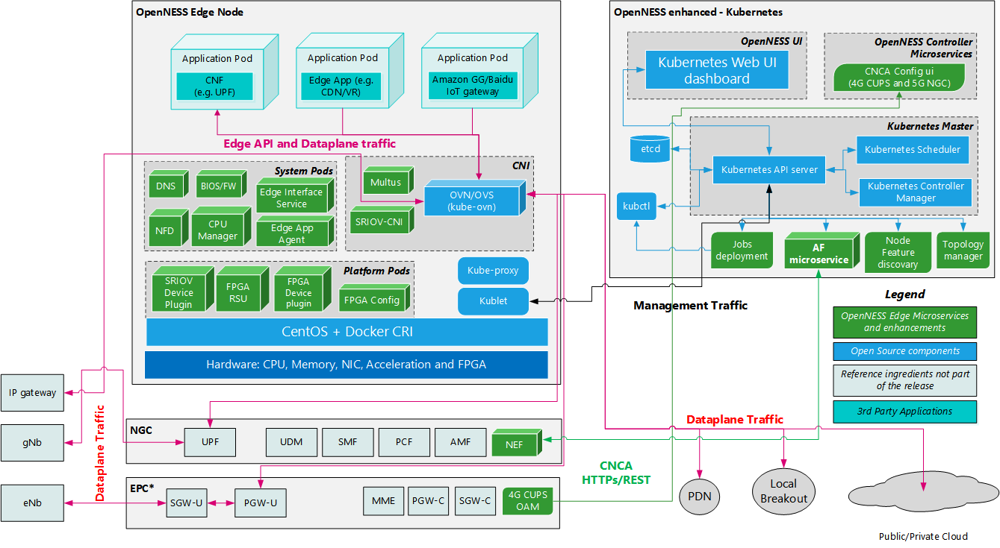

```text
SPDX-License-Identifier: Apache-2.0
Copyright (c) 2019-2020 Intel Corporation
```
<!-- omit in toc -->
# Smart Edge Open Support for OVS as dataplane with OVN
- [OVN Introduction](#ovn-introduction)
- [OVN/OVS support in Smart Edge Open Network Edge](#ovnovs-support-in-smart-edge-open-network-edge)
- [Summary](#summary)

## OVN Introduction
Open Virtual Network (OVN) is an open-source solution based on the Open vSwitch-based (OVS) software-defined networking (SDN) solution for providing network services to instances. OVN adds to the capabilities of OVS to provide native support for virtual network abstractions, such as virtual L2 and L3 overlays and security groups. Further information about the OVN architecture can be found [here](http://www.openvswitch.org/support/dist-docs-2.5/ovn-architecture.7.html)

## OVN/OVS support in Smart Edge Open Network Edge
The primary objective of supporting OVN/OVS in Smart Edge Open is to demonstrate the capability of using a standard dataplane such as OVS for an Edge Compute platform. Using OVN/OVS further provides standard SDN-based flow configuration for the edge Dataplane.

The diagram below shows OVS as a dataplane and OVN overlay. This mode of deployment is recommended when the Edge node terminates IP traffic (Wireline, Wireless, LTE CUPS, SGi)



[Kube-OVN](https://github.com/alauda/kube-ovn) can be chosen as the CNI implementation for OVN/OVS in Smart Edge Open. Additionally, in the following configuration, Smart Edge Open applications on Edge Nodes are deployed as DaemonSet Pods (in separate "openness" namespace) and exposed to client applications by k8s services.

OVN/OVS is used as the default networking infrastructure for:
- Dataplane Interface: UE's to edge applications
- InterApp Interface: Communication infrastructure for applications to communicate
- Default Interface: Interface for managing the Application POD (e.g., SSH to application POD)
- Cloud/Internet Interface: Interface for Edge applications to communicate with the Cloud/Internet

The platform supports OVS-DPDK as a dataplane. OVS-DPDK can be used for high-performance data transmission scenarios in the userspace. More about OVS-DPDK can be found [here](http://docs.openvswitch.org/en/latest/howto/dpdk/).

## Summary
Smart Edge Open is built with a microservices architecture. Depending on the deployment, there may be a requirement to service pure IP traffic and configure the dataplane using standard SDN-based tools. Smart Edge Open demonstrates such a requirement by providing OVS as a dataplane in the place of NTS without changing the APIs from an end-user perspective.
