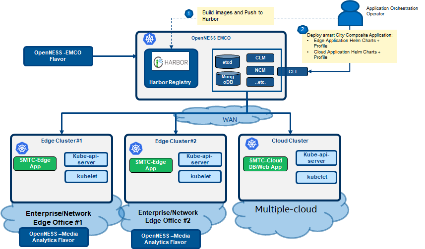
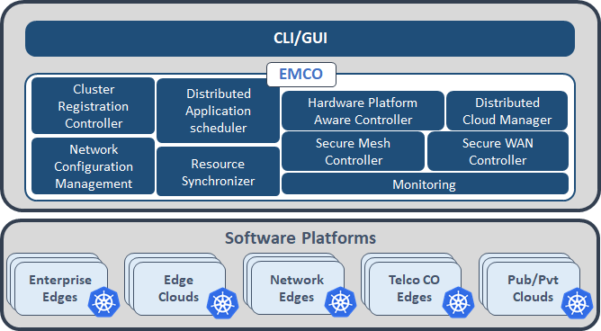
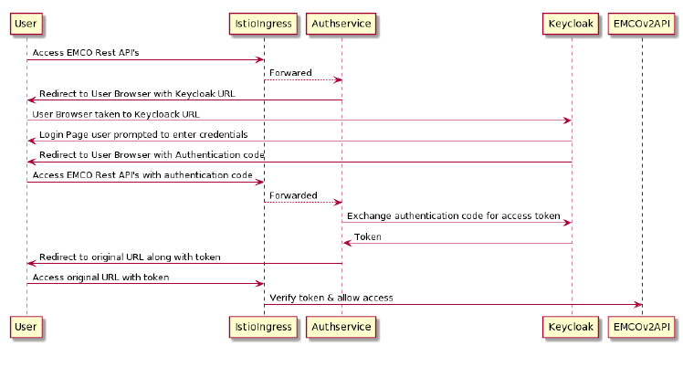
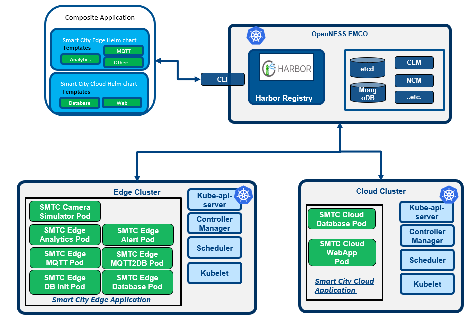

```text
SPDX-License-Identifier: Apache-2.0       
Copyright (c) 2020 Intel Corporation
```
# Edge Multi-Cluster Orchestrator (EMCO)

- [Edge Multi-Cluster Orchestrator (EMCO)](#edge-multi-cluster-orchestrator-emco)
  - [Background](#background)
  - [EMCO Introduction](#emco-introduction)
    - [EMCO Architecture](#emco-architecture)
    - [EMCO Terminology](#emco-terminology)
    - [EMCO API](#emco-api)
    - [EMCO Authentication and Authorization](#emco-authentication-and-authorization)
    - [EMCO Installation With OpenNESS Flavor](#emco-installation-with-openness-flavor)
  - [Practice with EMCO: SmartCity Deployment](#practice-with-emco-smartcity-deployment)

## Background
Edge Multi-Cluster Orchestration(EMCO), an OpenNESS Building Block, is a Geo-distributed application orchestrator for Kubernetes\*. The main objective of EMCO is automation of the deployment of applications and services across clusters. It acts as a central orchestrator that can manage edge services and network functions across geographically distributed edge clusters from different third parties. Finally, the resource orchestration within a cluster of nodes will leverage Kubernetes* and Helm charts.

EMCO addresses the need for deploying 'composite applications' in multiple geographical locations.
> **NOTE**: A 'composite application' is a combination of multiple applications. Based on the deployment intent, various applications of the composite application get deployed at various locations, and get replicated in multiple locations.

Compared with other multipe-clusters orchestration, EMCO focuses on the following functionalities:
- Enrolling multiple geographically distributed OpenNESS clusters and third party cloud clusters.
- Orchestrating composite applications (composed of multiple individual applications) across the clusters.
- Deploying edge services and network functions on to different nodes spread across the different clusters.
- Monitoring the health of the deployed edge services/network functions across the clusters.
- Orchestrating edge services and network functions with deployment intents based on compute, acceleration, and storage requirements.
- Supporting onboarding of multiple tenants from different enterprises while ensuring confidentiality and full isolation across the tenants.


The following figure shows the topology overview for the OpenNESS EMCO orchestration with edge and multiple clusters. It also shows an example of deploying SmartCity with EMCO. 
> **NOTE**: Smart City sample source code and documentation are available on [GitHub](https://github.com/OpenVisualCloud/Smart-City-Sample) 


_Figure 1 - Topology Overview with OpenNESS EMCO_

All the managed edge clusters and cloud clusters are connected with the EMCO cluster through the WAN network. 
- The central orchestration (EMCO) cluster installation can use the [OpenNESS Central Orchestrator Flavor](https://github.com/otcshare/specs/blob/master/doc/flavors.md). 
- The edge clusters in the diagram can be installed and provisioned by using the [OpenNESS Media Analytics Flavor](https://github.com/otcshare/specs/blob/master/doc/flavors.md). 
- The cloud cluster in the diagram can be any type of cloud cluster, for example: Azure Cloud.
- The composite application - SmartCity is composed of two parts: edge applications and cloud (web) applications. 
  - The edge application executes media processing and analytics on multiple edge clusters to reduce latency.
  - The cloud application is like a web application for additional post-processing, such as calculating statistics and display/visualization on the cloud cluster side.
  - The EMCO user can deploy the  SmartCity applications across the clusters. Besides that, EMCO allows the operator to override configurations and profiles to satisfy deployment needs.
  - For more details, refer to [Practice with EMCO: SmartCity Deployment](#practice-with-emco-smartcity-deployment).

This document aims to familiarize the user with [OpenNESS deployment flavor](https://github.com/otcshare/specs/blob/master/doc/flavors.md) for EMCO installation and provision, and provide instructions accordingly.
## EMCO Introduction
### EMCO Architecture
The following diagram depicts a high level overview of the EMCO architecture.


_Figure 2 - EMCO Architecture_
  - Cluster Registration Controller registers clusters by cluster owners.
  - Distributed Application Scheduler provides a simplified and extensible placement.
  - Network Configuration Management handles creation/management of virtual and provider networks.
  - Hardware Platform Aware Controller enables scheduling with auto-discovery of platform features/ capabilities.
  - Distributed Cloud Manager presents a single logical cloud from multiple edges.
  - Secure Mesh Controller auto-configures both service mesh (ISTIO) and security policy (NAT, firewall).
  - Secure WAN Controller automates secure overlays across edge groups.
  - Resource Syncronizer manages instantiation of resources to clusters.
  - Monitoring covers distributed application.

#### Cluster Registration
A microservice exposes RESTful API. User can register cluster providers and clusters of those providers via these APIs. After preparing edge clusters and cloud clusters, which can be any Kubernetes* cluster, user can onboard those clusters to EMCO by creating a cluster provider and then adding clusters to the cluster provider. After cluster providers are created, the KubeConfig files of edge and cloud clusters should be provided to EMCO as part of the multi-part POST call to the Cluster API. 

Additionally, after a cluster is created, labels and key value pairs can be added to the cluster via the EMCO API. Clusters can be specified by label when preparing placement intents.
> **NOTE**: The cluster provider is someone who owns clusters and registers them to EMCO. If an Enterprise has clusters, for example from AWS, then the cluster provider for those clusters from AWS is still considered as from that Enterprise. AWS is not the provider. Here, the provider is someone who owns clusters and registers them here. Since, AWS does not register their clusters here, AWS is not considered as cluster provider in this context.

#### Distributed Application Scheduler
The distributed application scheduler microservice provides the following functionalities:
- Project Management provides multi-tenancy in the application from a user perspective.
- Composite App Management manages composite apps that are collections of Helm Charts, one per application.
- Composite Profile Management manages composite profiles that are collections of profile, one per application.
- Deployment Intent Group Management manages Intents for composite applications.
- Controller Registration manages placement and action controller registration, priorities etc.
- Status Notifier framework allows user to get on-demand status updates or notifications on status updates.
- Scheduler: 
  - Placement Controllers: Generic Placement Controller. 
  - Action Controllers.

##### Lifecycle Operations
The Distributed Application Scheduler supports operations on a deployment intent group resource to instantiate the associated composite application with any placement, and action intents performed by the registered placement and action controllers. The basic flow of lifecycle operations on a deployment intent group after all the supporting resources have been created via the APIs are:
- approve: marks that the deployment intent group has been approved and is ready for instantiation.
- instantiate: the Distributed Application Scheduler prepares the application resourcs for deployment, and applies placement and action intents before invoking the Resource Synchronizer to deploy them to the intended remote clusters.
- status: (may be invoked at any step) provides information on the status of the deployment intent group.
- terminate: terminates the application resources of an instantiated application from all of the clusters to which it was deployed. In some cases, if a remote cluster is intermittently unreachable, the instantiate operation may still retry the instantiate operation for that cluster. The terminate operation will cause the instantiate operation to complete (i.e. fail), before the termination operation is performed.
- stop: In some cases, if the remote cluster is intermittently unreachable, the Resource Synchronizer will continue retrying an instantiate or terminate operation. The stop operation can be used to force the retry operation to stop, and the instantiate or terminate  operation will complete (with a failed status). In the case of terminate, this allows the deployment intent group resource to be deleted via the API, since deletion is prevented until a deployment intent group resource has reached a completed terminate operation status.

#### Network Configuration Management
The network configuration management (NCM) microservice provides the following functionalities:
- Provider Network Management to create provider networks. 
- Virtual Network Management to create dynamic virtual networks. 
- Controller Registration manages network plugin controllers, priorities etc.
- Status Notifier framework allows user to get on-demand status updates or notifications on status updates.
- Scheduler with Built in Controller - OVN-for-K8s-NFV Plugin Controller.

##### Lifecycle Operations
The Network Configuration Management microservice supports operations on the network intents of a cluster resource to instantiate the associated provider and virtual networks that have been defined via the API for the cluster. The basic flow of lifecycle operations on a cluster, after all the supporting network resources have been created via the APIs are:
- apply: the Network Configuration Management microservice prepares the network resources and invokes the Resource Synchronizer to deploy them to the designated cluster.
- status: (may be invoked at any step) provides information on the status of the cluster networks.
- terminate: terminates the network resources from the cluster to which they were deployed. In some cases, if a remote cluster is intermittently unreachable, the Resource Synchronizer may still retry the instantiate operation for that cluster. The terminate operation will cause the instantiate operation to complete (i.e. fail), before the termination operation is performed.
- stop: In some cases, if the remote cluster is intermittently unreachable, the Resource Synchronizer will continue retrying an instantiate or terminate operation. The stop operation can be used to force the retry operation to stop, and the instantate or terminate  operation will be completed (with a failed status). In the case of terminate, this allows the deployment intent group resource to be deleted via the API, since deletion is prevented until a deployment intent group resource has reached a completed terminate operation status.

#### Distributed Cloud Manager
The Distributed Cloud Manager (DCM) provides the Logical Cloud abstraction and effectively completes the concept of "multi-cloud". One Logical Cloud is a grouping of one or many clusters, each with their own control plane, specific configurations and geo-location, which get partitioned for a particular EMCO project. This partitioning is made via the creation of distinct, isolated namespaces in each of the (Kubernetes*) clusters that thus make up the Logical Cloud.

A Logical Cloud is the overall target of a Deployment Intent Group and is a mandatory parameter (the specific applications under it further refine what gets run and in which location). A Logical Cloud must be explicitly created and instantiated before a Deployment Intent Group can be instantiated.

Due to the close relationship with Clusters, which are provided by Cluster Registration (clm) above, it is important to understand the mapping between the two. A Logical Cloud groups many Clusters together but a Cluster may also be grouped by multiple Logical Clouds, effectively turning the cluster multi-tenant. The partitioning/multi-tenancy of a particular Cluster, via the different Logical Clouds, is done today at the namespace level (different Logical Clouds access different namespace names, and the name is consistent across the multiple clusters of the Logical Cloud).


_Figure 3 - Mapping between Logical Clouds and Clusters_

##### Lifecycle Operations
Prerequisites to using Logical Clouds:
* with the project-less Cluster Registration API, create the cluster providers, clusters and optionally cluster labels.
* with the Distributed Application Scheduler API, create a project which acts as a tenant in EMCO.

The basic flow of lifecycle operations to get a Logical Cloud up and running via the Distributed Cloud Manager API is:
* Create a Logical Cloud specifying the following attributes:
  - Level: either 1 or 0, depending on whether an admin or a custom/user cloud is sought - more on the differences below.
  - (*for Level-1 only*) Namespace name - the namespace to use in all of the Clusters of the Logical Cloud.
  - (*for Level-1 only*) User name - the name of the user that will be authenticating to the Kubernetes* APIs to access the namespaces created.
  - (*for Level-1 only*) User permissions - permissions that the user specified will have in the namespace specified, in all of the clusters.
* (*for Level-1 only*) Create resource quotas and assign them to the Logical Cloud created: this specifies what quotas/limits the user will face in the Logical Cloud, for each of the Clusters.
* Assign the Clusters previously created with the project-less Cluster Registration API to the newly-created Logical Cloud.
* Instantiate the Logical Cloud. All of the clusters assigned to the Logical Cloud are automatically set up to join the Logical Cloud. Once this operation is complete, the Distributed Application Scheduler's lifecycle operations can be followed to deploy applications on top of the Logical Cloud.

Apart from the creation/instantiation of Logical Clouds, the following operations are also available:
* Terminate a Logical Cloud - this removes all of the Logical Cloud -related resources from all of the respective Clusters.
* Delete a Logical Cloud - this eliminates all traces of the Logical Cloud in EMCO.

##### Level-1 Logical Clouds
Logical Clouds were introduced to group and partition clusters in a multi-tenant way and across boundaries, improving flexibility and scalability. A Level-1 Logical Cloud is the default type of Logical Cloud providing just that much. When projects request a Logical Cloud to be created, they provide what permissions are available, resource quotas and clusters that compose it. The Distributed Cloud Manager, alongside the Resource Synchronizer, sets up all the clusters accordingly, with the necessary credentials, namespace/resources, and finally generating the kubeconfig files used to authenticate/reach each of those clusters in the context of the Logical Cloud.

##### Level-0 Logical Clouds
In some use cases, and in the administrative domains where it makes sense, a project may want to access raw, unmodified, administrator-level clusters. For such cases, no namespaces need to be created and no new users need to be created or authenticated in the API. To solve this, the Distributed Cloud Manager introduces Level-0 Logical Clouds, which offer the same consistent interface as Level-1 Logical Clouds to the Distributed Application Scheduler. Being of type Level-0 means "the lowest-level", or the administrator level. As such, no changes will be made to the clusters themselves. Instead, the only operation that takes place is the reuse of credentials already provided via the Cluster Registration API for the clusters assigned to the Logical Cloud (instead of generating new credentials, namespace/resources and kubeconfig files).

#### OVN Action Controller
The OVN Action Controller (ovnaction) microservice is an action controller which may be registered and added to a deployment intent group to apply specific network intents to resources in the composite application. It provides the following functionalities:
- Network intent APIs which allow specification of network connection intents for resources within applications.
- On instantiation of a deployment intent group configured to utilize the ovnaction controller, network interface annotations will be added to the pod template of the identified application resources.
- ovnaction supports specifying interfaces which attach to networks created by the Network Configuration Management microservice.

#### Traffic Controller
The traffic controller microservice provides a way to create network policy resources across edge clusters. It provides inbound RESTful APIs to create intents to open the traffic from clients, and provides change and delete APIs for update and deletion of traffic intents. Using the information provided through intents, it also creates a network policy resource for each of the application servers on the corresponding edge cluster.
> **NOTE**:For network policy to work, edge cluster must have network policy support using CNI such as calico.

#### Resource Synchronizer
This microservice is the one which deploys the resources in edge/cloud clusters. 'Resource contexts' created by various microservices are used by this microservice. It takes care of retrying, in case the remote clusters are not reachable temporarily. 

#### Generic Action Controller
The generic action controller microservice is an action controller which may be registered with the central orchestrator. It can achieve the following usecases:

- <b>Create a new Kubernetes* object</b> and deploy that along with a specific application which is part of the composite Application. There are two variations here: 
  
  - Default : Apply the new object to every instance of the app in every cluster where the app is deployed.
  - Cluster-Specific : Apply the new object only where the app is deployed to a specific cluster, denoted by a cluster-name or a list of clusters denoted by a cluster-label.

- <b>Modify an existing Kubernetes* object</b> which may have been deployed using the Helm chart for an app, or may have been newly created by the above mentioned usecase. Modification may correspond to specific fields in the YAML definition of the object.

To achieve both the usecases, the controller exposes RESTful APIs to create, update and delete the following:

- Resource - Specifies the newly defined object or an existing object.
- Customization - Specifies the modifications (using JSON Patching) to be applied on the objects.

### EMCO Terminology
|                        |                                                                                                                                  |
|------------------------|----------------------------------------------------------------------------------------------------------------------------------|
| Cluster Provider       | The provider is someone who owns clusters and registers them.                                                                    |
| Projects               | The project resource provides means for a collection of applications to be grouped.                                              |
|                        | Several applications can exist under a specific project.                                                                         |
|                        | Projects allows for grouping of applications under a common tenant to be defined.                                                |
|------------------------|----------------------------------------------------------------------------------------------------------------------------------|
| Composite application  | Composite application is combination of multiple applications.                                                                   |
|                        | Based on the deployment intent, various applications of the composite application get deployed at various locations.             |
|                        | Also, some applications of the composite application get replicated in multiple locations.                                       |
|------------------------|----------------------------------------------------------------------------------------------------------------------------------|
| Deployment Intent      | EMCO does not expect the editing of Helm charts provided by application/Network-function vendors by DevOps admins.               |
|                        | Any customization and additional K8s resources that need to be present with the application are specified as deployment intents. |
|------------------------|----------------------------------------------------------------------------------------------------------------------------------|
| Placement Intent       | EMCO supports to create generic placement intents for a given composite application.                                             |
|                        | Normally, EMCO scheduler calls placement controllers first to figure out the edge/cloud locations for a given application.       |
|                        | Finally works with 'resource synchronizer & status collector' to deploy K8s resources on various Edge/Cloud clusters.            |
|------------------------|----------------------------------------------------------------------------------------------------------------------------------|

### EMCO API
For user interaction, EMCO provides [RESTful API](https://github.com/otcshare/EMCO/blob/main/docs/emco_apis.yaml). Apart from that, EMCO also provides CLI. For the detailed usage, refer to [EMCO CLI](https://github.com/otcshare/EMCO/tree/main/src/tools/emcoctl)
> **NOTE**: The EMCO RESTful API is the foundation for the other interaction facilities like the EMCO CLI and even EMCO GUI (third party developed right now)

### EMCO Authentication and Authorization
EMCO uses Istio and other open source solutions to provide Multi-tenancy solution leveraging Istio Authorization and Authentication frameworks. This is achieved without adding any logic in EMCO microservices.
- Authentication and Authorization for the EMCO users is done at the Istio Ingress Gateway, where all the traffic enters the cluster.

- Istio along with autherservice (istio ecosystem project) enables request-level authentication with JSON Web Token (JWT) validation. Authservice is an entity that works along side with Envoy proxy. It is used to work with external IAM systems (OAUTH2). Many Enterprises have their own OAUTH2 server for authenticating users and provide roles.

- Authservice and ISTIO can be configured to talk to multiple OAUTH2 servers. Using this capability EMCO can support multiple tenants, for example one tenant belonging to one project.

- Using Istio AuthorizationPolicy access to different EMCO resources can be controlled based on roles defined for the users.

The following figure shows various Emco services running in a cluster with Istio.


_Figure 4 - EMCO setup with Istio and Authservice_

The following figure shows the authentication flow with EMCO, Istio and Authservice



_Figure 5 - EMCO Authenication with external OATH2 Server_

Detailed steps for configuring EMCO with Istio can be found in [Emco Integrity and Access Management](https://github.com/otcshare/EMCO/tree/main/docs/user/Emco_Integrity_Access_Management.md) document.

Steps for EMCO Authentication and Authorization Setup:
- Install and Configure Keycloak Server to be used in the setup. This server runs outside EMCO cluster
  - Create a new realm, add users and roles to Keycloak
- Install Istio in the Kubernetes* cluster where EMCO is running
- Enable Sidecar Injection in EMCO namesapce
- Install EMCO in EMCO namespace (with Istio sidecars)
- Configure Istio Ingress gateway resources for Emco Services
- Configure Istio Ingess gateway to enable running along with Authservice
- Apply EnvoyFilter for Authservice
- Apply Authentication and Authorization Policies

### EMCO Installation With OpenNESS Flavor
EMCO supports [multiple deployment options](https://github.com/otcshare/EMCO/tree/main/deployments). [OpenNESS Experience Kit](https://github.com/otcshare/specs/blob/master/doc/getting-started/openness-experience-kits.md) offers the `central_orchestrator` flavor to automate EMCO build and deployment as mentioned below.
- The first step is to prepare one server environment which needs to fulfill the [Preconditions](https://github.com/otcshare/specs/blob/master/doc/getting-started/network-edge/controller-edge-node-setup.md#preconditions).
- Then place the EMCO server hostname in `[controller_group]` group in `inventory.ini` file of openness-experience-kit. 
> **NOTE**: `[edgenode_group]` and `[edgenode_vca_group]` are not required for configuration, since EMCO micro services just need to be deployed on the Kubernetes* control plane node.
- Run script `./deploy_ne.sh -f central_orchestrator`. Deployment should complete successfully. In the flavor, harbor registry is deployed to provide images services as well.

```shell
# kubectl get pods -A
NAMESPACE     NAME                                               READY   STATUS    RESTARTS   AGE
emco          clm-6979f6c886-tjfrv                               1/1     Running   0          104m
emco          dcm-549974b6fc-42fbm                               1/1     Running   0          104m
emco          etcd-5f646586cb-p7ctj                              1/1     Running   0          104m
emco          mongo-5f7d44fbc5-n74lm                             1/1     Running   0          104m
emco          ncm-58b85b4688-tshmc                               1/1     Running   0          104m
emco          orchestrator-78b76cb547-xrvz5                      1/1     Running   0          104m
emco          ovnaction-5d8d4447f9-nn7l6                         1/1     Running   0          104m
emco          rsync-58b75849dd-99z6t                             1/1     Running   0          104m
harbor        harbor-app-harbor-chartmuseum-78c8d5567c-zfm68     1/1     Running   0          125m
harbor        harbor-app-harbor-clair-779df4555b-bc4xv           2/2     Running   1          125m
harbor        harbor-app-harbor-core-86745c7fdd-rqfl8            1/1     Running   0          125m
harbor        harbor-app-harbor-database-0                       1/1     Running   0          125m
harbor        harbor-app-harbor-jobservice-b44ffbcdd-kxxbm       1/1     Running   0          125m
harbor        harbor-app-harbor-nginx-8f4b9595-mthng             1/1     Running   0          125m
harbor        harbor-app-harbor-notary-server-64c6df8547-w6zxt   1/1     Running   0          125m
harbor        harbor-app-harbor-notary-signer-68cf88854b-h97mk   1/1     Running   0          125m
harbor        harbor-app-harbor-portal-fd5ff4bc9-qn9hq           1/1     Running   0          125m
harbor        harbor-app-harbor-redis-0                          1/1     Running   0          125m
harbor        harbor-app-harbor-registry-68699595cb-cdddd        2/2     Running   0          125m
harbor        harbor-app-harbor-trivy-0                          1/1     Running   0          125m
kube-system   coredns-f9fd979d6-j4j2m                            1/1     Running   0          125m
kube-system   coredns-f9fd979d6-x546t                            1/1     Running   0          125m
kube-system   etcd-211node                                       1/1     Running   0          128m
kube-system   kube-apiserver-211node                             1/1     Running   0          128m
kube-system   kube-controller-manager-211node                    1/1     Running   0          128m
kube-system   kube-ovn-cni-pvbfl                                 1/1     Running   0          125m
kube-system   kube-ovn-controller-54d8c5d5ff-jjgk6               1/1     Running   0          125m
kube-system   kube-ovn-pinger-tst92                              1/1     Running   0          125m
kube-system   kube-proxy-llqzr                                   1/1     Running   0          128m
kube-system   kube-scheduler-211node                             1/1     Running   0          128m
kube-system   ovn-central-54f768b868-vtmjl                       1/1     Running   0          127m
kube-system   ovs-ovn-jq6dn                                      1/1     Running   0          127m

```

## Practice with EMCO: SmartCity Deployment
- The SmartCity application is a sample application that is built on top of the OpenVINO™ and Open Visual Cloud software stacks for media processing and analytics. 
  - The composite application is composed of two parts: 
    - EdgeApp (multiple OpenNESS edge clusters) 
    - WebApp (cloud application for additional post-processing such as calculating statistics and display/visualization) 
- One OpenNESS edge cluster (representing regional office) and One legacy K8s Cluster (representing cloud) are connected to the OpenNESS EMCO cluster. 
- The whole deployment architecture diagram is as shown below:


_Figure 6 - SmartCity Deployment Architecture Overview_

The typical steps involved in the cluster registration and deployment of the application using OpenNESS EMCO are as follows:
- Prerequisites
  - Make one OpenNESS edge cluster ready.
  - Make one legacy K8s cluster ready (Simulate cloud cluster).
  - Prepare One server with a vanilla CentOS\* 7.8.2003 for EMCO (Only one server is required for EMCO cluster).
- EMCO Installation
- Cluster Setup
- Project Setup
- Logical Cloud Setup
- Deploy SmartCity Application

### Cluster Setup
In the step, cluster provider will be created. And both the edge cluster and the cloud cluster will be registered in the EMCO.

1. After [EMCO Installation With OpenNESS Flavor](#emco-installation), logon to the EMCO server and maker sure that Harbor and EMCO microservices are in running status.

2. On the edge and cloud cluster, run the following command to make Docker logon the Harbor deployed on the EMCO server:
```shell
HARBORRHOST=<harbor_registry_host>

cd /etc/docker/certs.d/
mkdir ${HARBORRHOST}
cd ${HARBORRHOST}
echo -n | openssl s_client -showcerts -connect ${HARBORRHOST} 2>/dev/null | sed -ne '/-BEGIN CERTIFICATE-/,/-END CERTIFICATE-/p' > harbor.crt

HARBORRPW=Harbor12345
docker login ${HARBORRHOST} -u admin -p ${HARBORRPW}
```
> **NOTE**: <harbor_registry_host> should be `<EMCO Server IP Address>:30003`.

3. On the EMCO server, download the [scripts,profiles and configmap JSON files](https://github.com/otcshare/edgeapps/tree/master/applications/smart-city-app/emco).

4. Run the command for the environment setup with success return as below:
```shell
# cd cli-scripts/
# ./env_setup.sh
```

5. Run the command for the clusters setup with expected result as below:
```shell
# cd cli-scripts/
# ./01_apply.sh

....
URL: cluster-providers/smartcity-cluster-provider/clusters/edge01/labels Response Code: 201 Response: {"label-name":"LabelSmartCityEdge"}
URL: cluster-providers/smartcity-cluster-provider/clusters/cloud01/labels Response Code: 201 Response: {"label-name":"LabelSmartCityCloud"}
```

### Project Setup

Run the command for the project setup with expected result as below:
```shell
# cd cli-scripts/
# ./02_apply.sh

Using config file: emco_cfg.yaml
http://localhost:31298/v2
URL: projects Response Code: 201 Response: {"metadata":{"name":"project_smtc","description":"","UserData1":"","UserData2":""}}
```

### Logical Cloud Setup

Run the command for the logical cloud setup with expected result as below.
```shell
# cd cli-scripts/
# ./03_apply.sh

Using config file: emco_cfg.yaml
http://localhost:31877/v2
URL: projects/project_smtc/logical-clouds Response Code: 201 Response: {"metadata":{"name":"default","description":"","userData1":"","userData2":""},"spec":{"namespace":"","level":"0","user":{"user-name":"","type":"","user-permissions":null}}}
http://localhost:31877/v2
URL: projects/project_smtc/logical-clouds/default/cluster-references Response Code: 201 Response: {"metadata":{"name":"lc-edge01","description":"","userData1":"","userData2":""},"spec":{"cluster-provider":"smartcity-cluster-provider","cluster-name":"edge01","loadbalancer-ip":"0.0.0.0","certificate":""}}
http://localhost:31877/v2
URL: projects/project_smtc/logical-clouds/default/instantiate Response Code: 200 Response:
```

### Deploy SmartCity Application

1. Run the command for the SmartCity application deployment with expected result as below:
```shell
# cd cli-scripts/
# ./04_apply.sh

http://localhost:31298/v2
URL: projects/project_smtc/composite-apps/composite_smtc/v1/deployment-intent-groups/smtc-deployment-intent-group/approve Response Code: 202 Response:
http://localhost:31298/v2
URL: projects/project_smtc/composite-apps/composite_smtc/v1/deployment-intent-groups/smtc-deployment-intent-group/instantiate Response Code: 202 Response:
```

2. On both the edge cluster and the cloud cluster, manually create `tunnel_secret` as below:
```shell
#!/usr/bin/env bash
PRIKEY=/root/tunnel_secret/id_rsa
PUBKEY=/root/tunnel_secret/id_rsa.pub
KNOWHOSTS=/root/tunnel_secret/known_hosts
kubectl create secret generic tunnel-secret --from-file=${PRIKEY} --from-file=${PUBKEY} --from-file=${KNOWHOSTS}
```

3. On the cloud cluster, manually create `self-signed-certificate` as below:
```shell
#!/usr/bin/env bash
CRT=/root/tunnel_secret/self.crt
SELFKEY=/root//tunnel_secret/self.key
kubectl create secret generic self-signed-certificate --from-file=${CRT}  --from-file=${SELFKEY}
```

4. Verify SmartCity Application Deployment Information.
The pods on the edge cluster are in the running status as shown as below:

```shell
# kubectl get pods
NAME                                                READY   STATUS    RESTARTS   AGE
traffic-office1-alert-5b56f5464c-ldwrf              1/1     Running   0          20h
traffic-office1-analytics-traffic-6b995d4d6-nhf2p   1/1     Running   0          20h
traffic-office1-camera-discovery-78bccbdb44-k2ffx   1/1     Running   0          20h
traffic-office1-cameras-6cb67ccc84-8zkjg            1/1     Running   0          20h
traffic-office1-db-84bcfd54cd-ht52s                 1/1     Running   1          20h
traffic-office1-db-init-64fb9db988-jwjv9            1/1     Running   0          20h
traffic-office1-mqtt-f9449d49c-dwv6l                1/1     Running   0          20h
traffic-office1-mqtt2db-5649c4778f-vpxhq            1/1     Running   0          20h
traffic-office1-smart-upload-588d95f78d-8x6dt       1/1     Running   1          19h
traffic-office1-storage-7889c67c57-kbkjd            1/1     Running   1          19h
```

The pods on the cloud cluster are in the running status as shown as below:
```shell
# kubectl get pods
NAME                             READY   STATUS    RESTARTS   AGE
cloud-db-5d6b57f947-qhjz6        1/1     Running   0          20h
cloud-storage-5658847d79-66bxz   1/1     Running   0          96m
cloud-web-64fb95884f-m9fns       1/1     Running   0          20h
```

5. Verify Smart City GUI 
From a web browser, launch the Smart City web UI at URL `https://<cloudcluster-controller-node-ip>`. The GUI shows like:      


_Figure 7 - SmartCity UI_

### SmartCity Termination

Run the command for the SmartCity application termination with expected result as below:
```shell
# cd cli-scripts/
# ./88_terminate.sh

Using config file: emco_cfg.yaml
http://localhost:31298/v2
URL: projects/project_smtc/composite-apps/composite_smtc/v1/deployment-intent-groups/smtc-deployment-intent-group/terminate Response Code: 202 Response:
```

After termination, the SmartCity application will be deleted from the clusters.

