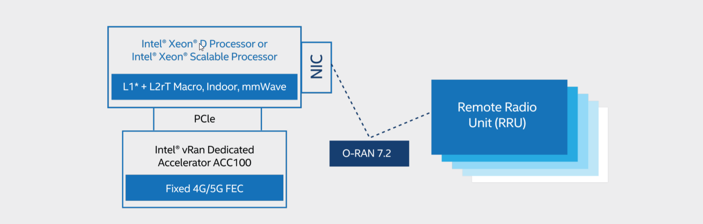
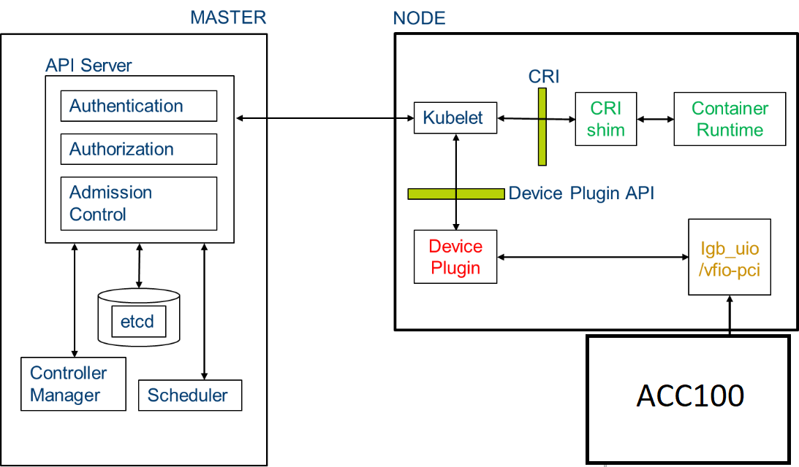

```text
SPDX-License-Identifier: Apache-2.0
Copyright (c) 2020 Intel Corporation
```
<!-- omit in toc -->
# Using ACC100 eASIC in OpenNESS: Resource Allocation, and Configuration
- [Overview](#overview)
- [Intel vRAN Dedicated Accelerator ACC100 FlexRAN Host Interface Overview](#intel-vran-dedicated-accelerator-acc100-flexran-host-interface-overview)
- [Intel vRAN Dedicated Accelerator ACC100 Orchestration and Deployment with Kubernetes\* for FlexRAN](#intel-vran-dedicated-accelerator-acc100-orchestration-and-deployment-with-kubernetes-for-flexran)
- [Using the Intel vRAN Dedicated Accelerator ACC100 on OpenNESS](#using-the-intel-vran-dedicated-accelerator-acc100-on-openness)
  - [ACC100 (FEC) Ansible Installation for OpenNESS Network Edge](#acc100-fec-ansible-installation-for-openness-network-edge)
    - [Converged Edge Experience Kits](#converged-edge-experience-kits)
  - [FEC VF configuration for OpenNESS Network Edge](#fec-vf-configuration-for-openness-network-edge)
  - [Requesting Resources and Running Pods for OpenNESS Network Edge](#requesting-resources-and-running-pods-for-openness-network-edge)
  - [Verifying Application POD Access and Usage of FPGA on OpenNESS Network Edge](#verifying-application-pod-access-and-usage-of-fpga-on-openness-network-edge)
- [Reference](#reference)

## Overview

Intel® vRAN Dedicated Accelerator ACC100 plays a key role in accelerating 4G and 5G Virtualized Radio Access Networks (vRAN) workloads, which in turn increases the overall compute capacity of a commercial, off-the-shelf platform. 

Intel® vRAN Dedicated Accelerator ACC100 provides the following features:

- LDPC FEC processing for 3GPP 5G:
  - LDPC encoder/decoder
  - Code block CRC generation/checking
  - Rate matching/de-matching
  - HARQ buffer management
- Turbo FEC processing for 3GPP 4G:
  - Turbo encoder/decoder
  - Code block CRC generation/checking
  - Rate matching/de-matching
- Scalable to required system configuration
- Hardware DMA support
- Performance monitoring
- Load balancing supported by the hardware queue manager (QMGR)
- Interface through the DPDK BBDev library and APIs

Intel® vRAN Dedicated Accelerator ACC100 benefits include:
- Reduced platform power, E2E latency and Intel® CPU core count requirements as well as increase in cell capacity than existing programmable accelerator
- Accelerates both 4G and 5G data concurrently
- Lowers development cost using commercial off the shelf (COTS) servers
- Accommodates space-constrained implementations via a low-profile PCIe* card form factor.
- Enables a variety of flexible FlexRAN deployments from small cell to macro to Massive
MIMO networks
- Supports extended temperature for the most challenging of RAN deployment scenarios

For more information, see product brief in [Intel® vRAN Dedicated Accelerator ACC100](https://builders.intel.com/docs/networkbuilders/intel-vran-dedicated-accelerator-acc100-product-brief.pdf).

This document explains how the ACC100 resource can be used on the Open Network Edge Services Software (OpenNESS) platform for accelerating network functions and edge application workloads. We use the Intel® vRAN Dedicated Accelerator ACC100 to accelerate the LTE/5G Forward Error Correction (FEC) in the 5G or 4G L1 base station network function such as FlexRAN.

FlexRAN is a reference layer 1 pipeline of 4G eNb and 5G gNb on Intel® architecture. The FlexRAN reference pipeline consists of an L1 pipeline, optimized L1 processing modules, BBU pooling framework, cloud and cloud-native deployment support, and accelerator support for hardware offload. Intel® vRAN Dedicated Accelerator ACC100 card is used by FlexRAN to offload FEC (Forward Error Correction) for 4G and 5G.

## Intel vRAN Dedicated Accelerator ACC100 FlexRAN Host Interface Overview
Intel® vRAN Dedicated Accelerator ACC100 card used in the FlexRAN solution exposes the following physical functions to the CPU host:
- One FEC interface that can be used of 4G or 5G FEC acceleration
  - The LTE FEC IP components have turbo encoder/turbo decoder and rate matching/de-matching
  - The 5GNR FEC IP components have low-density parity-check (LDPC) Encoder / LDPC Decoder, rate matching/de-matching, and UL HARQ combining



## Intel vRAN Dedicated Accelerator ACC100 Orchestration and Deployment with Kubernetes\* for FlexRAN
FlexRAN is a low-latency network function that implements the FEC. FlexRAN uses the FEC resources from the ACC100 using POD resource allocation and the Kubernetes\* device plugin framework. Kubernetes* provides a device plugin framework that is used to advertise system hardware resources to the Kubelet. Instead of customizing the code for Kubernetes* (K8s) itself, vendors can implement a device plugin that can be deployed either manually or as a DaemonSet. The targeted devices include GPUs, high-performance NICs, FPGAs, InfiniBand\* adapters, and other similar computing resources that may require vendor-specific initialization and setup.



_Figure - Intel® vRAN Dedicated Accelerator ACC100 Orchestration and deployment with OpenNESS Network Edge for FlexRAN_

## Using the Intel vRAN Dedicated Accelerator ACC100 on OpenNESS
Further sections provide instructions on how to use the ACC100 eASIC features: configuration and accessing from an application on the OpenNESS Network Edge.

When the Intel® vRAN Dedicated Accelerator ACC100 is available on the Edge Node platform it exposes the Single Root I/O Virtualization (SRIOV) Virtual Function (VF) devices which can be used to accelerate the FEC in the vRAN workload. To take advantage of this functionality for a cloud-native deployment, the PF (Physical Function) of the device must be bound to the DPDK IGB_UIO userspace driver to create several VFs (Virtual Functions). Once the VFs are created, they must also be bound to a DPDK userspace driver to allocate them to specific K8s pods running the vRAN workload.

The full pipeline of preparing the device for workload deployment and deploying the workload can be divided into the following stages:

- Enabling SRIOV, binding devices to appropriate drivers, and the creation of VFs: delivered as part of the Edge Nodes Ansible automation.
- Queue configuration of FPGAs PF/VFs with an aid of [pf-bb-config](https://github.com/intel/pf-bb-config) utility: Docker\* image creation delivered as part of the Edge Nodes Ansible automation. The images being pushed to a local Harbor registry, sample pod (job) deployment via Helm charts.
- Enabling orchestration and allocation of the devices (VFs) to non-root pods requesting the devices: leveraging the support of "accelerator" SRIOV VFs from K8s SRIOV Device Plugin. K8s plugin deployment is delivered as part of the Edge Controller's Ansible automation.
- Simple sample BBDEV application to validate the pipeline (i.e., SRIOV creation - Queue configuration - Device orchestration - Pod deployment): Script delivery and instructions to build Docker image for sample application delivered as part of Edge Apps package.

### ACC100 (FEC) Ansible Installation for OpenNESS Network Edge
To run the OpenNESS package with ACC100 (FEC) functionality, the feature needs to be enabled on both Edge Controller and Edge Node.

#### Converged Edge Experience Kits
To enable ACC100 support from CEEK, SRIOV must be enabled in OpenNESS:
```yaml
# flavors/flexran/all.yml
kubernetes_cnis:
- <main CNI>
- sriov
```

Also, enable the following options in `flavors/flexran/all.yml`:
The following device config is the default config for the Intel® vRAN Dedicated Accelerator ACC100.
```yaml
#  flavors/flexran/all.yml

acc100_sriov_userspace_enable: true

acc100_userspace_vf:
  enabled: true
  vendor_id: "8086"
  vf_device_id: "0d5d"
  pf_device_id: "0d5c"
  vf_number: "2"
  vf_driver: "vfio-pci"
```

Run setup script `deploy.py` with `flexran` flavor defined in `inventory.yml` for specific cluster.

> **NOTE**: for more details about deployment and defining inventory please refer to [CEEK](../../getting-started/converged-edge-experience-kits.md#converged-edge-experience-kit-explained) getting started page.

After a successful deployment, the following pods will be available in the cluster:
```shell
kubectl get pods -A

NAMESPACE     NAME                                      READY   STATUS    RESTARTS   AGE
kube-system   calico-kube-controllers-646546699f-wl6rn  1/1     Running   0          3d19h
kube-system   calico-node-hrtn4                         1/1     Running   0          3d19h
kube-system   coredns-6955765f44-mrc82                  1/1     Running   0          3d19h
kube-system   coredns-6955765f44-wlvhc                  1/1     Running   0          3d19h
kube-system   etcd-silpixa00394960                      1/1     Running   0          3d19h
kube-system   kube-apiserver-silpixa00394960            1/1     Running   0          3d19h
kube-system   kube-controller-manager-silpixa00394960   1/1     Running   0          3d19h
kube-system   kube-multus-ds-amd64-2zdqt                1/1     Running   0          3d18h
kube-system   kube-multus-ds-amd64-db8fd                1/1     Running   0          3d19h
kube-system   kube-proxy-dd259                          1/1     Running   0          3d19h
kube-system   kube-proxy-sgn9g                          1/1     Running   0          3d18h
kube-system   kube-scheduler-silpixa00394960            1/1     Running   0          3d19h
kube-system   kube-sriov-cni-ds-amd64-k9wnd             1/1     Running   0          3d18h
kube-system   kube-sriov-cni-ds-amd64-pclct             1/1     Running   0          3d19h
kube-system   kube-sriov-device-plugin-amd64-fhbv8      1/1     Running   0          3d18h
kube-system   kube-sriov-device-plugin-amd64-lmx9k      1/1     Running   0          3d19h
openness      eaa-78b89b4757-xzh84                      1/1     Running   0          3d18h
openness      edgedns-dll9x                             1/1     Running   0          3d18h
openness      interfaceservice-grjlb                    1/1     Running   0          3d18h
openness      nfd-master-dd4ch                          1/1     Running   0          3d19h
openness      nfd-worker-c24wn                          1/1     Running   0          3d18h
openness      syslog-master-9x8hc                       1/1     Running   0          3d19h
openness      syslog-ng-br92z                           1/1     Running   0          3d18h
```

### FEC VF configuration for OpenNESS Network Edge
To configure the VFs with the necessary number of queues for the vRAN workload, the BBDEV configuration utility is going to run as a job within a privileged container. The configuration utility is available to run as a Helm chart available from `/opt/openness/helm-charts/bb_config`.

Sample configMap, which can be configured by changing values, if other than typical config is required, with a profile for the queue configuration is provided as part of Helm chart template `/opt/openness/helm-charts/bb_config/templates/acc100-config.yaml` populated with values from `/opt/openness/helm-charts/bb_config/values.yaml`. Helm chart installation requires a provision of hostname for the target node during job deployment. Additionally, the default values in Helm chart will deploy FPGA config, a flag needs to be provided to invoke ACC100 config.

Install the Helm chart by providing configmap and BBDEV config utility job with the following command from `/opt/openness/helm-charts/` on Edge Controller (this job needs to be re-run on each node reboot):

```shell
helm install --set nodeName=<node_name> --set device=ACC100 intel-acc100-cfg bb_config
```

Verify if the job has completed and that the state of the pod created for this job is “Completed”. Check the logs of the pod to see a complete successful configuration.
```
kubectl get pods
kubectl logs intel-acc100-cfg-<node_name>-xxxxx
```
Expected: `ACC100 PF [0000:af:00.0] configuration complete!`

To redeploy the job on another node, use the following command:

```
helm upgrade --set nodeName=<another_node_name> intel-acc100-cfg bb_config
```

To uninstall the job, run:
```
helm uninstall intel-acc100-cfg
```

### Requesting Resources and Running Pods for OpenNESS Network Edge
As part of the OpenNESS Ansible automation, a K8s SRIOV device plugin to orchestrate the ACC100 VFs (bound to the userspace driver) is running. This enables the scheduling of pods requesting this device. To check the number of devices available on the Edge Node from Edge Controller, run:

```shell
kubectl get node <node_name> -o json | jq '.status.allocatable'

"intel.com/intel_fec_acc100": "2"
```

To request the device as a resource in the pod, add the request for the resource into the pod specification file by specifying its name and the amount of resources required. If the resource is not available or the amount of resources requested is greater than the number of resources available, the pod status will be “Pending” until the resource is available.
**NOTE**: The name of the resource must match the name specified in the configMap for the K8s devices plugin [configMap.yml](https://github.com/open-ness/converged-edge-experience-kits/blob/master/roles/kubernetes/cni/sriov/controlplane/templates/configMap.yml.j2).

A sample pod requesting the ACC100 (FEC) VF may look like this:

```
apiVersion: v1
kind: Pod
metadata:
  name: test
  labels:
    env: test
spec:
  containers:
  - name: test
    image: centos:latest
    command: [ "/bin/bash", "-c", "--" ]
    args: [ "while true; do sleep 300000; done;" ]
    resources:
      requests:
        intel.com/intel_fec_acc100: '1'
      limits:
        intel.com/intel_fec_acc100: '1'
```

To test the resource allocation to the pod, save the above code snippet to the `sample.yaml` file and create the pod.
```
kubectl create -f sample.yaml
```
Once the pod is in the 'Running' state, check that the device was allocated to the pod (a uioX device and an environmental variable with a device PCI address should be available):
```
kubectl exec -it test -- ls /dev
kubectl exec -it test -- printenv | grep FEC
```
To check the number of devices currently allocated to pods, run (and search for 'Allocated Resources'):

```
kubectl describe node <node_host_name>
```

### Verifying Application POD Access and Usage of FPGA on OpenNESS Network Edge
To verify the functionality of all the features are working together (SRIOV binding - K8s device plugin - BBDEV config) and functionality of the ACC100 (FEC) VF inside a non-root pod, build a Docker image and run a simple validation application for the device.

The automation of the Docker image build is available from the Edge Apps package. The image must be built on the same node that it is meant to be deployed or a server with the same configuration as the node that will run the workload. This is due to the Kernel dependencies of DPDK during the application build.

Navigate to:

```
edgeapps/fpga-sample-app
```

Build the image:

`./build-image.sh`

From the Edge Controller, deploy the application pod. The pod specification is located at `/fpga`:

```
kubectl create -f fpga-sample-app.yaml
```

Execute into the application pod and run the sample app:
```shell
# enter the pod
kubectl exec -it pod-bbdev-sample-app -- /bin/bash

# run test application
./test-bbdev.py --testapp-path ./testbbdev -e="-w ${PCIDEVICE_INTEL_COM_INTEL_FEC_ACC100}" -i -n 1 -b 1 -l 1 -c validation -v ./test_vectors/ldpc_dec_v7813.data

# sample output
Executing: ./dpdk-test-bbdev -w0000:b0:00.0 -- -n 1 -l 1 -c validation -i -v ldpc_dec_v7813.data -b 1
EAL: Detected 96 lcore(s)
EAL: Detected 2 NUMA nodes
Option -w, --pci-whitelist is deprecated, use -a, --allow option instead
EAL: Multi-process socket /var/run/dpdk/rte/mp_socket
EAL: Selected IOVA mode 'VA'
EAL: No available hugepages reported in hugepages-1048576kB
EAL: Probing VFIO support...
EAL: VFIO support initialized
EAL:   using IOMMU type 1 (Type 1)
EAL: Probe PCI driver: intel_acc100_vf (8086:d5d) device: 0000:b0:00.0 (socket 1)
EAL: No legacy callbacks, legacy socket not created

===========================================================
Starting Test Suite : BBdev Validation Tests
Test vector file = ldpc_dec_v7813.data
Device 0 queue 16 setup failed
Allocated all queues (id=16) at prio0 on dev0
Device 0 queue 32 setup failed
Allocated all queues (id=32) at prio1 on dev0
Device 0 queue 48 setup failed
Allocated all queues (id=48) at prio2 on dev0
Device 0 queue 64 setup failed
Allocated all queues (id=64) at prio3 on dev0
Device 0 queue 64 setup failed
All queues on dev 0 allocated: 64
+ ------------------------------------------------------- +
== test: validation
dev:0000:b0:00.0, burst size: 1, num ops: 1, op type: RTE_BBDEV_OP_LDPC_DEC
Operation latency:
        avg: 31202 cycles, 13.5661 us
        min: 31202 cycles, 13.5661 us
        max: 31202 cycles, 13.5661 us
TestCase [ 0] : validation_tc passed
 + ~~~~~~~~~~~~~~~~~~~~~~~~~~~~~~~~~~~~~~~~~~~~~~~~~~~~~~ +
 + Test Suite Summary : BBdev Validation Tests
 + Tests Total :        1
 + Tests Skipped :      0
 + Tests Passed :       1
 + Tests Failed :       0
 + Tests Lasted :       413.594 ms
 + ~~~~~~~~~~~~~~~~~~~~~~~~~~~~~~~~~~~~~~~~~~~~~~~~~~~~~~ +
```
The output of the application should indicate a total of ‘1’ tests and ‘1’ test passing; this concludes the validation of the FEC VF working correctly inside a K8s pod.

## Reference
- [Intel® vRAN Dedicated Accelerator ACC100](https://networkbuilders.intel.com/solutionslibrary/intel-vran-dedicated-accelerator-acc100-product-brief)
