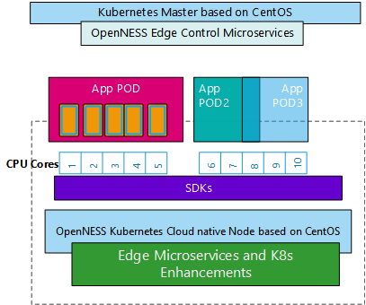

```text
SPDX-License-Identifier: Apache-2.0
Copyright (c) 2019-2020 Intel Corporation
```
<!-- omit in toc -->
# Dedicated CPU core for workload support in OpenNESS
**CMK support was deprecated in Openess release 21.03 and replaced with Kubernetes native CPU Manager***

- [Overview](#overview)
- [Details - CPU Manager support in OpenNESS](#details---cpu-manager-support-in-openness)
  - [Setup](#setup)
  - [Usage](#usage)
- [Reference](#reference)

## Overview
Multi-core, commercial, off-the-shelf platforms are typical in any cloud or cloud-native deployment. Running processes in parallel on multiple cores helps achieve a better density of processes per platform. On a multi-core platform, one challenge for applications and network functions that are latency and throughput dependent is deterministic compute. It is important to achieve deterministic compute that can allocate dedicated resources. Dedicated resource allocation avoids interference with other applications (noisy neighbor). When deploying on a cloud-native platform, applications are deployed as PODs. And providing required information to the container orchestrator on dedicated CPU cores is key. CPU manager allows provisioning of a POD to dedicated cores.


_Figure - CPU Manager - CMK_

The following are typical usages of this feature.

- Consider an edge application that uses an AI library such as OpenVINO™ for inference. This library uses a special instruction set on the CPU to get a higher performance for the AI algorithm. To achieve a deterministic inference rate, the application thread executing the algorithm needs a dedicated CPU core so that there is no interference from other threads or other application pods (noisy neighbor).



_Figure - CPU Manager support on OpenNESS_

>**NOTE**: With Linux CPU isolation and CPU Manager for Kubernetes\* (CMK), a certain amount of isolation can be achieved but not all the kernel threads can be moved away.

What is CMK?
The following section outlines some considerations for using CMK:

- If the workload already uses a threading library (e.g., pthread) and uses set affinity like APIs, CMK may not be needed. For such workloads, to provide cores to use for deployment, Kubernetes ConfigMaps are the recommended methodology. ConfigMaps can be used to pass the CPU core mask to the application for use.
- The workload is a medium to long-lived process with interarrival times on the order of ones to tens of seconds or greater.
- After a workload has started executing, there is no need to dynamically update its CPU assignments.
- Machines running workloads explicitly isolated by CMK must be guarded against other workloads that do not consult the CMK toolchain. The recommended way to do this is for the operator to taint the node. The provided cluster-init sub-command automatically adds such a taint.
- CMK does not need to perform additional tuning to IRQ affinity, CFS settings, or process scheduling classes.
- The preferred mode of deploying additional infrastructure components is to run them in containers on top of Kubernetes.

CMK accomplishes core isolation by controlling what logical CPUs each container may use for execution by wrapping target application commands with the CMK command-line program. The CMK wrapper program maintains state in a directory hierarchy on disk that describes pools from which user containers can acquire available CPU lists. These pools can be exclusive (only one container per CPU list) or non-exclusive (multiple containers can share a CPU list.) Each CPU list directory contains a task file that tracks process IDs of the container subcommand(s) that acquired the CPU list. When the child process exits, the CMK wrapper program clears its PID from the tasks file. If the wrapper program is killed before it can perform this cleanup step, a separate periodic reconciliation program detects this condition and cleans the tasks file accordingly. A file system lock guards against conflicting concurrent modifications.

## Details - CPU Manager support in OpenNESS

[CPU Manager for Kubernetes (CMK)](https://github.com/intel/CPU-Manager-for-Kubernetes) is a Kubernetes plugin that provides core affinity for applications deployed as Kubernetes pods. It is advised to use “isolcpus” for core isolation when using CMK (otherwise full isolation cannot be guaranteed).

CMK is a command-line program that wraps target application to provide core isolation (an example pod with an application wrapped by CMK is given in [Usage](#usage-3) section).

CMK documentation available on GitHub\* includes:

- [operator manual](https://github.com/intel/CPU-Manager-for-Kubernetes/blob/master/docs/operator.md)
- [user manual](https://github.com/intel/CPU-Manager-for-Kubernetes/blob/master/docs/user.md)

CMK can be deployed using a [Helm chart](https://helm.sh/). The CMK Helm chart used in OpenNESS deployment is available on the following GitHub repository: [container-experience-kits](https://github.com/intel/container-experience-kits/tree/master/roles/cmk_install).

### Setup

**Edge Controller / Kubernetes control plane**

1. In `inventory/default/group_vars/all/10-default.yml`, change `ne_cmk_enable` to `true` and adjust the settings if needed.
   CMK default settings are:
   ```yaml
   # CMK - Number of cores in exclusive pool
   cmk_num_exclusive_cores: "4"
   # CMK - Number of cores in shared pool
   cmk_num_shared_cores: "1"
   # CMK - Comma separated list of nodes' hostnames
   cmk_host_list: "node01,node02"
   ```
2. Deploy the controller with `deploy_ne.sh -f <flavor> controller`.

**Edge Node / Kubernetes node**

1. In `inventory/default/group_vars/all/10-open.yml`, change `ne_cmk_enable` to “true”.
2. To change core isolation set isolated cores in `inventory/default/group_vars/edgenode_group/10-default.yml` as `additional_grub_params` for your node e.g. in `inventory/default/group_vars/edgenode_group/10-default.yml`, set `additional_grub_params: "isolcpus=1-10,49-58"`.
3. Deploy the node with `deploy_ne.sh -f <flavor> node`.

The environment setup can be validated using steps from the [CMK operator manual](https://github.com/intel/CPU-Manager-for-Kubernetes/blob/master/docs/operator.md#validating-the-environment).

**Note:**
Up to version 20.12 choosing flavor was optional. Since version 21.03 and moving forward this parameter is no longer optional. To learn more about [flavors go to this page](https://github.com/open-ness/specs/blob/master/doc/flavors.md).

### Usage

The following example creates a `Pod` that can be used to deploy an application pinned to a core:

1. `DEPLOYED-APP` in `args` should be changed to deployed application name (the same for labels and names)
2. `image` value `DEPLOYED-APP-IMG:latest` should be changed to valid application image available in Docker\* (if the image is to be downloaded, change `ImagePullPolicy` to `Always`):

```bash
cat <<EOF | kubectl create -f -
apiVersion: v1
kind: Pod
metadata:
  labels:
    app: cmk-isolate-DEPLOYED-APP-pod
  name: cmk-isolate-DEPLOYED-APP-pod
spec:
  nodeName: <NODENAME>
  containers:
  - args:
    - "/opt/bin/cmk isolate --conf-dir=/etc/cmk --pool=exclusive DEPLOYED-APP"
    command:
    - "/bin/bash"
    - "-c"
    env:
    - name: CMK_PROC_FS
      value: "/host/proc"
    image: DEPLOYED-APP-IMG:latest
    imagePullPolicy: "Never"
    name: cmk-DEPLOYED-APP
    resources:
      limits:
        cmk.intel.com/exclusive-cores: 1
      requests:
        cmk.intel.com/exclusive-cores: 1
  restartPolicy: Never
EOF
```

>**NOTE**: CMK requires modification of deployed pod manifest for all deployed pods:
> - nodeName: <node-name> must be added under pod spec section before deploying application (to point node on which pod is to be deployed)
>
> alternatively,
> - toleration must be added to deployed pod under spec:
>
>   ```yaml
>   ...
>   tolerations:
>
>   - ...
>
>   - effect: NoSchedule
>     key: cmk
>     operator: Exists
>   ```

## Reference
- [CPU Manager Repo](https://github.com/intel/CPU-Manager-for-Kubernetes)
- More examples of Kubernetes manifests are available in the [CMK repository](https://github.com/intel/CPU-Manager-for-Kubernetes/tree/master/resources/pods) and [documentation](https://github.com/intel/CPU-Manager-for-Kubernetes/blob/master/docs/user.md).
