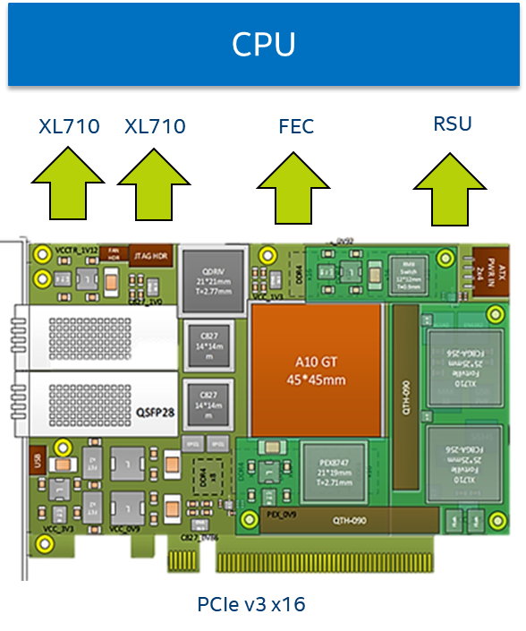
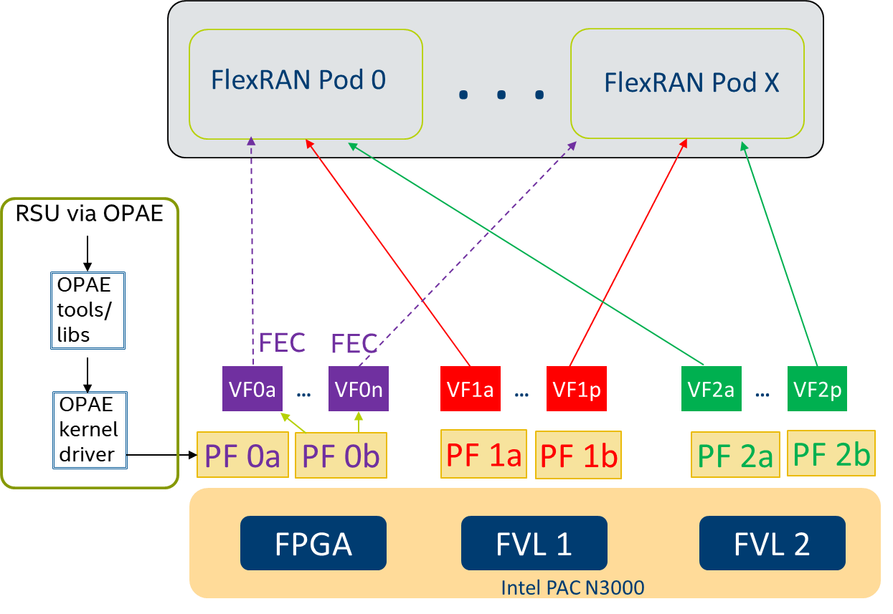
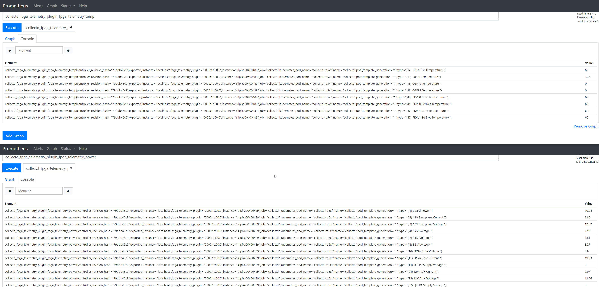

```text
SPDX-License-Identifier: Apache-2.0
Copyright (c) 2019-2020 Intel Corporation
```
<!-- omit in toc -->
# Using FPGA in OpenNESS: Programming, Resource Allocation, and Configuration
- [Overview](#overview)
- [Intel(R) FPGA PAC N3000 FlexRAN host interface overview](#intelr-fpga-pac-n3000-flexran-host-interface-overview)
- [Intel(R) FPGA PAC N3000 orchestration and deployment with Kubernetes\* for FlexRAN](#intelr-fpga-pac-n3000-orchestration-and-deployment-with-kubernetes-for-flexran)
- [Intel(R) FPGA PAC N3000 remote system update flow in OpenNESS Network edge Kubernetes](#intelr-fpga-pac-n3000-remote-system-update-flow-in-openness-network-edge-kubernetes)
- [Using an FPGA on OpenNESS](#using-an-fpga-on-openness)
  - [FPGA (FEC) Ansible installation for OpenNESS Network Edge](#fpga-fec-ansible-installation-for-openness-network-edge)
    - [Converged Edge Experience Kits](#converged-edge-experience-kits)
  - [FPGA programming and telemetry on OpenNESS Network Edge](#fpga-programming-and-telemetry-on-openness-network-edge)
    - [Telemetry monitoring](#telemetry-monitoring)
  - [FEC VF configuration for OpenNESS Network Edge](#fec-vf-configuration-for-openness-network-edge)
  - [Requesting resources and running pods for OpenNESS Network Edge](#requesting-resources-and-running-pods-for-openness-network-edge)
  - [Verifying Application POD access and usage of FPGA on OpenNESS Network Edge](#verifying-application-pod-access-and-usage-of-fpga-on-openness-network-edge)
- [Reference](#reference)

## Overview

The Intel® FPGA Programmable Acceleration Card (Intel® FPGA PAC) plays a key role in accelerating certain types of workloads, which in turn increases the overall compute capacity of a commercial, off-the-shelf platform. FPGA benefits include:
- Flexibility - FPGA functionality can change upon every power up of the device.
- Acceleration - Get products to market faster and increase your system performance.
- Integration - Modern FPGAs include on-die processors, transceiver I/Os at 28 Gbps (or faster), RAM blocks, DSP engines, and more.
- Total Cost of Ownership (TCO) - While ASICs may cost less per unit than an equivalent FPGA, building them requires a non-recurring expense (NRE), expensive software tools, specialized design teams, and long manufacturing cycles.

The deployment of AI and machine learning (ML) applications at the edge is increasing the adoption of FPGA acceleration. This trend of devices performing machine learning at the edge locally versus relying solely on the cloud is driven by the need to lower latency, persistent availability, lower costs, and address privacy concerns.

This document explains how the FPGA resource can be used on the Open Network Edge Services Software (OpenNESS) platform for accelerating network functions and edge application workloads. We use the Intel® FPGA PAC N3000 as a reference FPGA and use LTE/5G Forward Error Correction (FEC) as an example workload that accelerates the 5G or 4G L1 base station network function. The same concept and mechanism is applicable for application acceleration workloads like AI and ML on FPGA for Inference applications.

The Intel® FPGA PAC N3000 is a full-duplex, 100 Gbps in-system, re-programmable acceleration card for multi-workload networking application acceleration. It has an optimal memory mixture designed for network functions, with an integrated network interface card (NIC) in a small form factor that enables high throughput, low latency, and low power per bit for a custom networking pipeline.

FlexRAN is a reference layer 1 pipeline of 4G eNb and 5G gNb on Intel® architecture. The FlexRAN reference pipeline consists of an L1 pipeline, optimized L1 processing modules, BBU pooling framework, cloud and cloud-native deployment support, and accelerator support for hardware offload. Intel® FPGA PAC N3000 card is used by FlexRAN to offload FEC (Forward Error Correction) for 4G and 5G as well as IO for fronthaul and midhaul.

## Intel(R) FPGA PAC N3000 FlexRAN host interface overview
The Intel® FPGA PAC N3000 card used in the FlexRAN solution exposes the following physical functions to the CPU host:
- 2x25G Ethernet\* interface that can be used for Fronthaul or Midhaul
- One FEC interface that can be used of 4G or 5G FEC acceleration
  - The LTE FEC IP components have turbo encoder/turbo decoder and rate matching/de-matching
  - The 5GNR FEC IP components have low-density parity-check (LDPC) Encoder / LDPC Decoder, rate matching/de-matching, and UL HARQ combining
- Interface for managing and updating the FPGA Image – Remote System Update (RSU).



_Figure - PAC N3000 Host interface_
## Intel(R) FPGA PAC N3000 orchestration and deployment with Kubernetes\* for FlexRAN
FlexRAN is a low-latency network function that implements the FEC. FlexRAN uses both FEC and Ethernet resources from the FPGA using POD resource allocation and the Kubernetes\* device plugin framework. Kubernetes provides a device plugin framework that is used to advertise system hardware resources to the Kubelet. Instead of customizing the code for Kubernetes (K8s) itself, vendors can implement a device plugin that can be deployed either manually or as a DaemonSet. The targeted devices include GPUs, high-performance NICs, FPGAs, InfiniBand\* adapters, and other similar computing resources that may require vendor-specific initialization and setup.


_Figure - Intel PAC N3000 Orchestration and deployment with OpenNESS Network Edge for FlexRAN_

## Intel(R) FPGA PAC N3000 remote system update flow in OpenNESS Network edge Kubernetes
A Remote System Update (RSU) of the FPGA is enabled through the Open Programmable Acceleration Engine (OPAE). The OPAE package consists of a kernel driver and a userspace FPGA utils package that enables programming of the FPGA. OpenNESS automates the process of deploying the OPAE stack as a Kubernetes POD, which detects the FPGA and programs it. There is a separate FPGA Configuration POD deployed as a Kubernetes job that configures FPGA resources such as virtual functions and queues.



_Figure - OpenNESS Network Edge Intel® FPGA PAC N3000 RSU and resource allocation_

## Using an FPGA on OpenNESS
Further sections provide instructions on how to use all three FPGA features: programming, configuration, and accessing from an application on the OpenNESS Network Edge.

When the Intel® FPGA PAC N3000 is programmed with a vRAN 5G image, it exposes the Single Root I/O Virtualization (SRIOV) Virtual Function (VF) devices which can be used to accelerate the FEC in the vRAN workload. To take advantage of this functionality for a cloud-native deployment, the PF (Physical Function) of the device must be bound to the DPDK IGB_UIO userspace driver to create several VFs (Virtual Functions). Once the VFs are created, they must also be bound to a DPDK userspace driver to allocate them to specific K8s pods running the vRAN workload.

The full pipeline of preparing the device for workload deployment and deploying the workload can be divided into the following stages (subfeatures):

- Programming the FPGA with RTL user images: feature installation via Ansible\* automation and a K8s kubectl plugin are provided to use the feature.
- Enabling SRIOV, binding devices to appropriate drivers, and the creation of VFs: delivered as part of the Edge Nodes Ansible automation.
- Queue configuration of FPGAs PF/VFs with an aid of DPDK Baseband Device (BBDEV) config utility: Docker\* image creation delivered as part of the Edge Nodes Ansible automation. The images being pushed to a local Harbor registry, sample pod (job) deployment via Helm charts.
- Enabling orchestration and allocation of the devices (VFs) to non-root pods requesting the devices: leveraging the support of FPGA SRIOV VFs from K8s SRIOV Device Plugin. K8s plugin deployment is delivered as part of the Edge Controller's Ansible automation.
- Simple sample DPDK BBDEV application to validate the pipeline (i.e., SRIOV creation - Queue configuration - Device orchestration - Pod deployment): Script delivery and instructions to build Docker image for sample application delivered as part of Edge Apps package.

It is assumed that the FPGA is always used with the OpenNESS Network Edge, paired with the Multus\* plugin to enable the workload pod with a default K8s network interface. The Multus CNI is a container network interface (CNI) plugin for Kubernetes that enables attaching multiple network interfaces to pods.

It is also assumed that the Intel® FPGA PAC N3000 MAX10 build version of the card used for OpenNESS setup is at least version 2.0.x and has RoT capability, ie:
```shell
Board Management Controller, MAX10 NIOS FW version D.2.0.19
Board Management Controller, MAX10 Build version D.2.0.6
```
For information on how to update and flash the MAX10 to supported version see [Intel® FPGA PAC N3000 documentation](https://www.intel.com/content/www/us/en/programmable/documentation/xgz1560360700260.html#wzl1570122399760).

### FPGA (FEC) Ansible installation for OpenNESS Network Edge
To run the OpenNESS package with FPGA (FEC) functionality, the feature needs to be enabled on both Edge Controller and Edge Node.

#### Converged Edge Experience Kits
To enable FPGA support from CEEK, change the variable `ne_opae_fpga_enable` in `inventory/default/group_vars/all/10-default.yml` (or flavor alternative file) to `true`:
```yaml
# inventory/default/group_vars/all/10-default.yml
ne_opae_fpga_enable: true
```

Additionally, SRIOV must be enabled in OpenNESS:
```yaml
# inventory/default/group_vars/all/10-default.yml
kubernetes_cnis:
- <main CNI>
- sriov
```

Also, enable the following options in `inventory/default/group_vars/all/10-default.yml`:
The following device config is the default config for the Intel® FPGA PAC N3000 with a 5GNR vRAN user image tested (this configuration is common to both the EdgeNode and EdgeController setup).
```yaml
# group_var/all/10-default.yml

fpga_sriov_userspace_enable: true

fpga_userspace_vf:
  enabled: true
  vendor_id: "8086"
  vf_device_id: "0d90"
  pf_device_id: "0d8f"
  vf_number: "2"
  vf_driver: "vfio-pci"
```

The following packages need to be placed into specific directories for the feature to work:

1. The OPAE package `OPAE_SDK_1.3.7-5_el7.zip` needs to be placed inside the `converged-edge-experience-kits/opae_fpga` directory. The package can be obtained as part of Intel® FPGA PAC N3000 OPAE beta release. To obtain the package, contact your Intel representative.

Run setup script `deploy.py` with defined `inventory.yml` file.

> **NOTE**: for more details about deployment and defining inventory please refer to [CEEK](../../getting-started/converged-edge-experience-kits.md#converged-edge-experience-kit-explained) getting started page.

After a successful deployment, the following pods will be available in the cluster (CNI pods may vary depending on deployment):
```shell
kubectl get pods -A

NAMESPACE     NAME                                      READY   STATUS    RESTARTS   AGE
kube-system   calico-kube-controllers-646546699f-wl6rn  1/1     Running   0          3d19h
kube-system   calico-node-hrtn4                         1/1     Running   0          3d19h
kube-system   coredns-6955765f44-mrc82                  1/1     Running   0          3d19h
kube-system   coredns-6955765f44-wlvhc                  1/1     Running   0          3d19h
kube-system   etcd-silpixa00394960                      1/1     Running   0          3d19h
kube-system   kube-apiserver-silpixa00394960            1/1     Running   0          3d19h
kube-system   kube-controller-manager-silpixa00394960   1/1     Running   0          3d19h
kube-system   kube-multus-ds-amd64-2zdqt                1/1     Running   0          3d18h
kube-system   kube-multus-ds-amd64-db8fd                1/1     Running   0          3d19h
kube-system   kube-proxy-dd259                          1/1     Running   0          3d19h
kube-system   kube-proxy-sgn9g                          1/1     Running   0          3d18h
kube-system   kube-scheduler-silpixa00394960            1/1     Running   0          3d19h
kube-system   kube-sriov-cni-ds-amd64-k9wnd             1/1     Running   0          3d18h
kube-system   kube-sriov-cni-ds-amd64-pclct             1/1     Running   0          3d19h
kube-system   kube-sriov-device-plugin-amd64-fhbv8      1/1     Running   0          3d18h
kube-system   kube-sriov-device-plugin-amd64-lmx9k      1/1     Running   0          3d19h
openness      eaa-78b89b4757-xzh84                      1/1     Running   0          3d18h
openness      edgedns-dll9x                             1/1     Running   0          3d18h
openness      interfaceservice-grjlb                    1/1     Running   0          3d18h
openness      nfd-master-dd4ch                          1/1     Running   0          3d19h
openness      nfd-worker-c24wn                          1/1     Running   0          3d18h
openness      syslog-master-9x8hc                       1/1     Running   0          3d19h
openness      syslog-ng-br92z                           1/1     Running   0          3d18h
```

### FPGA programming and telemetry on OpenNESS Network Edge
It is expected the the factory image of the Intel® FPGA PAC N3000 is of version 2.0.x. To program the user image (5GN FEC vRAN) of the Intel® FPGA PAC N3000 via OPAE a `kubectl` plugin for K8s is provided - it is expected that the provided user image is signed or un-signed (development purposes) by the user, see the [documentation](https://www.intel.com/content/www/us/en/programmable/documentation/pei1570494724826.html) for more information on how to sign/un-sign the image file. The plugin also allows for obtaining basic FPGA telemetry. This plugin will deploy K8s jobs that run to completion on the desired host and display the logs/output of the command.

The following are the operations supported by the `kubectl rsu` K8s plugin. They are run from the Edge Controller (the user who runs the commands needs to be a privileged user):

1. To check the version of the MAX10 image and FW run:
```
kubectl rsu get fme  -n <hostname>

Board Management Controller, MAX10 NIOS FW version D.2.0.19
Board Management Controller, MAX10 Build version D.2.0.6
//****** FME ******//
Object Id                     : 0xEF00000
PCIe s:b:d.f                  : 0000:1b:00.0
Device Id                     : 0x0b30
Numa Node                     : 0
Ports Num                     : 01
Bitstream Id                  : 0x2315842A010601
Bitstream Version             : 0.2.3
Pr Interface Id               : a5d72a3c-c8b0-4939-912c-f715e5dc10ca
Boot Page                     : user
```
2. To display currently supported capabilities and information on how to use them, run:
```
kubectl rsu -h
```
2. To display information about RSU supported devices that can be used to program the FPGA, and to list FPGA user images available on the host, run:
```
kubectl rsu discover -n <hostname>
```
3. To copy and the user image to the desired platform, run the following command.
To obtain a user FPGA image for 5GNR vRAN such as `2x2x25G-5GLDPC-v1.6.1-3.0.0`, contact your Intel Representative.
```
kubectl rsu load -f </path/to/image.bin> -n <hostname>
```
4. To program the FPGA with user image (vRAN for 5GNR), run:
```
kubectl rsu program -f <signed_RTL_image> -n <hostname> -d <RSU_PCI_bus_function_id>
```
5. To obtain basic telemetry (temperature, power usage, and FPGA image information, etc.), run:
```
kubectl rsu get temp  -n <hostname>
kubectl rsu get power  -n <hostname>
kubectl rsu get fme  -n <hostname>

# Sample output for correctly programmed card with `get fme` command
//****** FME ******//
Object Id : 0xED00000
PCIe s\:b\:d.f : 0000:1b:00.0
Device Id : 0x0b30
Numa Node : 0
Ports Num : 01
Bitstream Id : 0x2145042A010304
Bitstream Version : 0.2.1
Pr Interface Id : a5d72a3c-c8b0-4939-912c-f715e5dc10ca
Boot Page : user
```
7. For more information on the usage of each `kubectl rsu` plugin capability, run each command with the `-h` argument.
8. To monitor progress of deployed jobs run:
```
kubectl logs <job-name> -f
```

To run vRAN workloads on the Intel® FPGA PAC N3000, the FPGA must be programmed with the appropriate factory and user images per the instructions.

#### Telemetry monitoring

  Support for monitoring temperature and power telemetry of the Intel® FPGA PAC N3000 is also provided from OpenNESS with a CollectD collector that is configured for the `flexran` flavor. Intel® FPGA PAC N3000 telemetry monitoring is provided to CollectD as a plugin. It collects the temperature and power metrics from the card and exposes them to Prometheus\* from which the user can easily access the metrics. For more information on how to enable telemetry for FPGA in OpenNESS, see the [telemetry whitepaper](../../building-blocks/enhanced-platform-awareness/openness-telemetry.md#collectd).

  

### FEC VF configuration for OpenNESS Network Edge
To configure the VFs with the necessary number of queues for the vRAN workload the BBDEV configuration utility is run as a job within a privileged container. The configuration utility is available to run as a Helm chart available from `/opt/openness/helm-charts/bb_config`.

Sample configMap, which can be configured by changing values if other than typical configuration is required, with a profile for the queue configuration, is provided as part of Helm chart template `/opt/openness/helm-charts/bb_config/templates/fpga-config.yaml` populated with values from `/opt/openness/helm-charts/bb_config/values.yaml`. Helm chart installation requires a provision of hostname for the target node during job deployment.

Install the Helm chart by providing configmap and BBDEV config utility job with the following command from `/opt/openness/helm-charts/` on Edge Controller (this job needs to be re-run on each node reboot):

```shell
helm install --set nodeName=<node_name> intel-fpga-cfg bb_config
```

Check if the job has completed and that the state of the pod created for this job is “Completed”. Check the logs of the pod to see a complete successful configuration.
```
kubectl get pods
kubectl logs intel-fpga-cfg-<node_name>-xxxxx
```
Expected: `Mode of operation = VF-mode FPGA_LTE PF [0000:xx:00.0] configuration complete!`

To redeploy the job on another node, use the following command:

```
helm upgrade --set nodeName=<another_node_name> intel-fpga-cfg bb_config
```

To uninstall the job, run:
```
helm uninstall intel-fpga-cfg
```

### Requesting resources and running pods for OpenNESS Network Edge
As part of the OpenNESS Ansible automation, a K8s SRIOV device plugin to orchestrate the FPGA VFs (bound to the userspace driver) is running. This enables the scheduling of pods requesting this device. To check the number of devices available on the Edge Node from Edge Controller, run:

```shell
kubectl get node <node_name> -o json | jq '.status.allocatable'

"intel.com/intel_fec_5g": "2"
```

To request the device as a resource in the pod, add the request for the resource into the pod specification file by specifying its name and amount of resources required. If the resource is not available or the amount of resources requested is greater than the number of resources available, the pod status will be “Pending” until the resource is available.
**NOTE**: The name of the resource must match the name specified in the configMap for the K8s devices plugin [configMap.yml](https://github.com/open-ness/converged-edge-experience-kits/blob/master/roles/kubernetes/cni/sriov/controlplane/templates/configMap.yml.j2).

A sample pod requesting the FPGA (FEC) VF may look like this:

```
apiVersion: v1
kind: Pod
metadata:
  name: test
  labels:
    env: test
spec:
  containers:
  - name: test
    image: centos:latest
    command: [ "/bin/bash", "-c", "--" ]
    args: [ "while true; do sleep 300000; done;" ]
    resources:
      requests:
        intel.com/intel_fec_5g: '1'
      limits:
        intel.com/intel_fec_5g: '1'
```

To test the resource allocation to the pod, save the above code snippet to the `sample.yaml` file and create the pod.
```
kubectl create -f sample.yaml
```
Once the pod is in the 'Running' state, check that the device was allocated to the pod (a uioX device and an environmental variable with a device PCI address should be available):
```
kubectl exec -it test -- ls /dev
kubectl exec -it test -- printenv | grep FEC
```
To check the number of devices currently allocated to pods, run (and search for 'Allocated Resources'):

```
kubectl describe node <node_host_name>
```

### Verifying Application POD access and usage of FPGA on OpenNESS Network Edge
To verify the functionality of all the sub-features are working together (SRIOV binding - K8s device plugin - BBDEV config) and functionality of the FPGA (FEC) VF inside a non-root pod, build a Docker image and run a simple validation application for the device.

The automation of the Docker image build is available from the Edge Apps package. The image must be built on the same node that it is meant to be deployed or a server with the same configuration as the node that will run the workload. This is due to the Kernel dependencies of DPDK during the application build.

Navigate to:

```
edgeapps/fpga-sample-app
```

Build the image:

`./build-image.sh`

From the Edge Controlplane, deploy the application pod. The pod specification is located at `/opt/openness/edgeservices/edgecontroller/fpga/fpga-sample-app.yaml`:

```
kubectl create -f fpga-sample-app.yaml
```

Execute into the application pod and run the sample app:
```shell
# enter the pod
kubectl exec -it pod-bbdev-sample-app -- /bin/bash

# run test application
./test-bbdev.py --testapp-path ./dpdk-test-bbdev -e="-w ${PCIDEVICE_INTEL_COM_INTEL_FEC_5G}" -i -n 1 -b 1 -l 1 -c validation -v ldpc_dec_v7813.data

# sample output
EAL: Detected 48 lcore(s)
EAL: Detected 2 NUMA nodes
EAL: Multi-process socket /var/run/dpdk/rte/mp_socket
EAL: Selected IOVA mode 'VA'
EAL: No available hugepages reported in hugepages-1048576kB
EAL: Probing VFIO support...
EAL: VFIO support initialized
EAL: PCI device 0000:20:00.1 on NUMA socket 0
EAL:   probe driver: 8086:d90 intel_fpga_5gnr_fec_vf
EAL:   using IOMMU type 1 (Type 1)

===========================================================
Starting Test Suite : BBdev Validation Tests
Test vector file = ./test_vectors/ldpc_dec_v7813.data
mcp fpga_setup_queuesDevice 0 queue 16 setup failed
Allocated all queues (id=16) at prio0 on dev0
Device 0 queue 16 setup failed
All queues on dev 0 allocated: 16
+ ------------------------------------------------------- +
== test: validation/latency
dev: 0000:20:00.1, burst size: 1, num ops: 1, op type: RTE_BBDEV_OP_LDPC_DEC
Operation latency:
        avg: 17744 cycles, 12.6743 us
        min: 17744 cycles, 12.6743 us
        max: 17744 cycles, 12.6743 us
TestCase [ 0] : latency_tc passed
 + ~~~~~~~~~~~~~~~~~~~~~~~~~~~~~~~~~~~~~~~~~~~~~~~~~~~~~~ +
 + Test Suite Summary : BBdev Validation Tests
 + Tests Total :        1
 + Tests Skipped :      0
 + Tests Passed :       1
 + Tests Failed :       0
 + Tests Lasted :       95.2308 ms
 + ~~~~~~~~~~~~~~~~~~~~~~~~~~~~~~~~~~~~~~~~~~~~~~~~~~~~~~ +
```
The output of the application should indicate a total of ‘1’ tests and ‘1’ test passing; this concludes the validation of the FPGA VF working correctly inside a K8s pod.

## Reference
- [Intel® FPGA PAC N3000](https://www.intel.com/content/www/us/en/programmable/products/boards_and_kits/dev-kits/altera/intel-fpga-pac-n3000/overview.html)
-  [FlexRAN 19.10 release - Resource Design Center](https://cdrdv2.intel.com/v1/dl/getContent/615743)
- [Intel® FPGA PAC N3000 OPAE beta release - Resource Design Center](https://cdrdv2.intel.com/v1/dl/getContent/616082)
- [Intel® FPGA PAC N3000 OPAE beta release (2) - Resource Design Center](https://cdrdv2.intel.com/v1/dl/getContent/616080)
