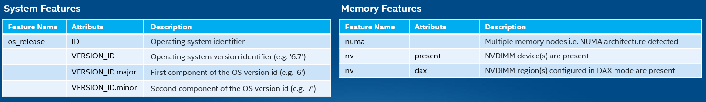
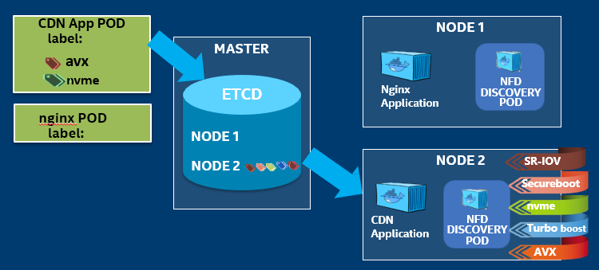

```text
SPDX-License-Identifier: Apache-2.0
Copyright (c) 2019 Intel Corporation
```
<!-- omit in toc -->
# Node Feature Discovery support in OpenNESS
- [Overview of NFD and Edge usecase](#overview-of-nfd-and-edge-usecase)
- [Details](#details)
  - [Node Feature Discovery support in OpenNESS Network Edge](#node-feature-discovery-support-in-openness-network-edge)
    - [Usage](#usage)
- [Reference](#reference)

## Overview of NFD and Edge usecase

Commercial, off-the-shelf (COTS) platforms used for edge deployment come with many features that enable workloads to take advantage of, to provide better performance, and to meet the SLA. When such COTS platforms are deployed in a cluster as part of a cloud-native deployment, it becomes important to detect the hardware and software features on all nodes that are part of that cluster. It should also be noted that some of the nodes might have special accelerator hardware (FPGA, GPU, Non-Volatile Memory Express (NVMe)\*, etc.).

Consider an edge application such as CDN that needs to be deployed in the cloud-native edge cloud. It is favorable for a container orchestrator like Kubernetes\* to detect the nodes that have CDN-friendly hardware and software features (NVMe, media extensions, etc.).

Next, consider a Container Network Function (CNF) such as 5G gNb that implements L1 5G NR base station. It is favorable for the container orchestrator like Kubernetes to detect nodes that have hardware and software features—FPGA acceleration for Forward Error Correction (FEC), advanced vector instructions to implement math functions, real-time kernel, etc.

OpenNESS supports the discovery of such features using Node Feature Discovery (NFD). NFD is a Kubernetes add-on that detects and advertises hardware and software capabilities of a platform that can, in turn, be used to facilitate intelligent scheduling of a workload. NFD is one of the technologies from Intel that supports targeting of intelligent configuration and capacity consumption of platform capabilities. NFD runs as a separate container on each node of the cluster, discovers the capabilities of the node, and finally, publishes these as node labels using the Kubernetes API. NFD only handles non-allocatable features.

Some of the Node features that NFD can detect include:



_Figure - Sample NFD Features_

At its core, NFD detects hardware features available on each node in a Kubernetes cluster and advertises those features using node labels.

NFD consists of two software components:
1) nfd-master is responsible for labeling Kubernetes node objects
2) nfd-worker detects features and communicates them to the nfd-master. One instance of nfd-worker should be run on each node of the cluster

The figure below illustrates how the CDN application will be deployed on the correct platform when NFD is utilized, where the required key hardware like NVMe and the AVX instruction set support is available.



_Figure - CDN app deployment with NFD Features_

> Non-Volatile Memory Express (NVMe)* is a scalable, non-volatile memory host interface that can help increase efficiency and reduce latency, while providing high-speed access to storage media connected over PCIe. NVMe overcomes SAS/SATA SSD performance limitations by optimizing hardware and software to take full advantage of NVM SSD technology.

> AVX CPUID Features: Intel® Advanced Vector Extensions 512 (Intel® AVX-512)

> UEFI Secure Boot: Boot Firmware verification and authorization of OS Loader/Kernel components

## Details

### Node Feature Discovery support in OpenNESS Network Edge

Node Feature Discovery is enabled by default. It does not require any configuration or user input. It can be disabled by changing the `ne_nfd_enable` variable to `false` in the `inventory/default/group_vars/all/10-default.yml` before the OpenNESS installation.

The connection between `nfd-nodes` and `nfd-control-plane` is secured by certificates generated before running NFD pods.

Node Feature Discovery is deployed in OpenNESS using a Helm chart downloaded from [container-experience-kits](https://github.com/intel/container-experience-kits/tree/master/roles/nfd_install/charts/node-feature-discovery) repository.

#### Usage

NFD is working automatically and does not require any user action to collect the features from nodes. Features found by NFD and labeled in Kubernetes can be shown by the following command: 
```
kubectl get no -o json | jq '.items[].metadata.labels'
```

Example output :
```json
{
  "beta.kubernetes.io/arch": "amd64",
  "beta.kubernetes.io/os": "linux",
  "feature.node.kubernetes.io/cpu-cpuid.ADX": "true",
  "feature.node.kubernetes.io/cpu-cpuid.AESNI": "true",
  "feature.node.kubernetes.io/cpu-cpuid.AVX": "true",
  "feature.node.kubernetes.io/cpu-cpuid.AVX2": "true",
  "feature.node.kubernetes.io/cpu-cpuid.FMA3": "true",
  "feature.node.kubernetes.io/cpu-cpuid.HLE": "true",
  "feature.node.kubernetes.io/cpu-cpuid.RTM": "true",
  "feature.node.kubernetes.io/cpu-rdt.RDTCMT": "true",
  "feature.node.kubernetes.io/cpu-rdt.RDTL3CA": "true",
  "feature.node.kubernetes.io/cpu-rdt.RDTMBM": "true",
  "feature.node.kubernetes.io/cpu-rdt.RDTMON": "true",
  "feature.node.kubernetes.io/iommu-enabled": "true",
  "feature.node.kubernetes.io/kernel-config.NO_HZ": "true",
  "feature.node.kubernetes.io/kernel-config.NO_HZ_FULL": "true",
  "feature.node.kubernetes.io/kernel-config.PREEMPT": "true",
  "feature.node.kubernetes.io/kernel-version.full": "3.10.0-957.21.3.rt56.935.el7.x86_64",
  "feature.node.kubernetes.io/kernel-version.major": "3",
  "feature.node.kubernetes.io/kernel-version.minor": "10",
  "feature.node.kubernetes.io/kernel-version.revision": "0",
  "feature.node.kubernetes.io/memory-numa": "true",
  "feature.node.kubernetes.io/network-sriov.capable": "true",
  "feature.node.kubernetes.io/pci-0300_102b.present": "true",
  "feature.node.kubernetes.io/system-os_release.ID": "centos",
  "feature.node.kubernetes.io/system-os_release.VERSION_ID": "7",
  "feature.node.kubernetes.io/system-os_release.VERSION_ID.major": "7",
  "feature.node.kubernetes.io/system-os_release.VERSION_ID.minor": "",
  "kubernetes.io/arch": "amd64",
  "kubernetes.io/hostname": "edgenode-kubeovn",
  "kubernetes.io/os": "linux",
  "node-role.kubernetes.io/worker": "worker"
}
```

To specify which features should be available by the node at deploying pod time, the `nodeSelector` field should be defined in the pod `.yaml` file. Example pod `yaml` file:

```yaml
apiVersion: v1
kind: Pod
metadata:
  labels:
    env: test
  name: golang-test
spec:
  containers:
    - image: golang
      name: go1
  nodeSelector:
    feature.node.kubernetes.io/cpu-pstate.turbo: 'true'
```

## Reference
More details about NFD can be found here: https://github.com/Intel-Corp/node-feature-discovery
