```text
SPDX-License-Identifier: Apache-2.0
Copyright (c) 2020 Intel Corporation
```
<!-- omit in toc -->
# Telemetry Support in OpenNESS
- [Overview](#overview)
- [Architecture](#architecture)
- [Flavors and configuration](#flavors-and-configuration)
- [Telemetry features](#telemetry-features)
  - [Prometheus](#prometheus)
    - [Usage](#usage)
  - [Grafana](#grafana)
    - [Usage](#usage-1)
  - [Node Exporter](#node-exporter)
    - [Usage](#usage-2)
    - [VCAC-A](#vcac-a)
  - [cAdvisor](#cadvisor)
    - [Usage](#usage-3)
  - [CollectD](#collectd)
    - [Plugins](#plugins)
    - [Usage](#usage-4)
  - [OpenTelemetry](#opentelemetry)
    - [Usage](#usage-5)
  - [PCM](#pcm)
    - [Usage](#usage-6)
  - [TAS](#tas)
    - [Usage](#usage-7)
- [Summary](#summary)

## Overview
OpenNESS supports platform and application telemetry with the aid of multiple telemetry projects. This support allows users to retrieve information about the platform, the underlying hardware, cluster, and applications deployed. The data gathered by telemetry can be used to visualize metrics and resource consumption, set up alerts for certain events, and aid in making scheduling decisions based on the received telemetry. With the telemetry data at a user's disposal, a mechanism is also provided to schedule workloads based on the data available.

Currently, the support for telemetry is focused on metrics; support for application tracing telemetry is planned in the future.

## Architecture

The telemetry components used in OpenNESS are deployed from the Edge Controller as Kubernetes\* (K8s) pods. Components for telemetry support include: 
- collectors
- metric aggregators
- schedulers
- monitoring and visualization tools

Depending on the role of the component, it is deployed as either a `Deployment` or `Deamonset`. Generally, global components receiving inputs from local collectors are deployed as a `Deployment` type with a single replica set, whereas local collectors running on each host are deployed as `Daemonsets`. Monitoring and visualization components such as Prometheus\* and Grafana\* along with TAS (Telemetry Aware Scheduler) are deployed on the Edge Controller while other components are generally deployed on Edge Nodes. Local collectors running on Edge Nodes that collect platform metrics are deployed as privileged containers. Communication between telemetry components is secured with TLS either using native TLS support for a given feature or using a reverse proxy running in a pod as a container. All the components are deployed as Helm charts.

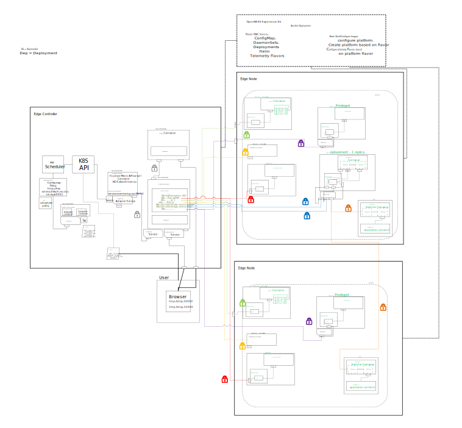

## Flavors and configuration

The deployment of telemetry components in OpenNESS is easily configurable from the Converged Edge Experience Kits (CEEK). The deployment of the Grafana dashboard and PCM (Performance Counter Monitoring) collector is optional (`telemetry_grafana_enable` enabled by default, `telemetry_pcm_enable` disabled by default). There are four distinctive flavors for the deployment of the CollectD collector, enabling the respective set of plugins (`telemetry_flavor`):

- common (default)
- flexran
- smartcity
- corenetwork

Further information on what plugins each flavor enables can be found in the [CollectD section](#collectd). All flags can be changed in `./inventory/default/group_vars/all/10-default.yml` for the default configuration or in `./flavors` in a configuration for a specific platform flavor.

## Telemetry features

This section provides an overview of each of the components supported within OpenNESS and a description of how to use these features.

### Prometheus

Prometheus is an open-source, community-driven toolkit for systems monitoring and alerting. The main features include:
- PromQL query language
- multi-dimensional, time-series data model
- support for dashboards and graphs

The main idea behind Prometheus is that it defines a unified metrics data format that can be hosted as part of any application that incorporates a simple web server. The data can be then scraped (downloaded) and processed by Prometheus using a simple HTTP/HTTPS connection.

In OpenNESS, Prometheus is deployed as a K8s Deployment with a single pod/replica on the Edge Controller node. It is configured out of the box to scrape all other telemetry endpoints/collectors enabled in OpenNESS and gather data from them. Prometheus is enabled in the CEEK by default with the `telemetry/prometheus` role.

#### Usage

1. To connect to a Prometheus dashboard, start a browser on the same network as the OpenNESS cluster and enter the address of the dashboard (where the IP address is the address of the Edge Controller)

    ```shell
    From browser:
    http://<controller-ip>:30000
    ```

2. To list the targets/endpoints currently scraped by Prometheus, navigate to the `status` tab and select `targets` from the drop-down menu.
    
3. To query a specific metric from one of the collectors, navigate to the `graph` tab, select a metric from the `insert-metric-at-cursor` list or type the value into the field above and press `execute`.
    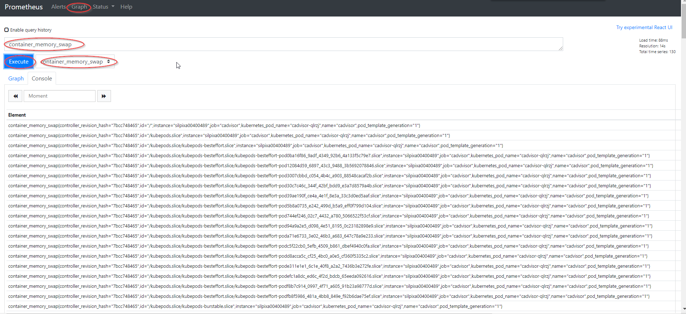
4. To graph the selected metrics, press the `graph` tab.
    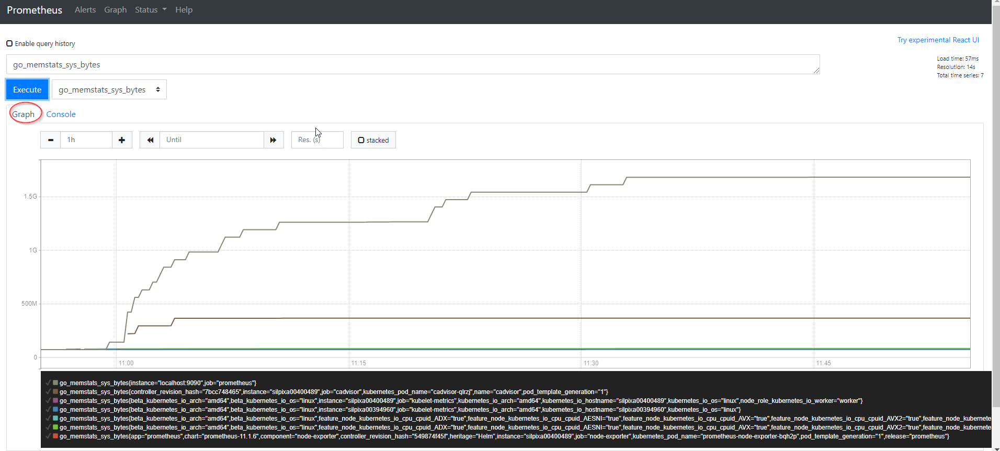

### Grafana

Grafana is an open-source visualization and analytics software. It takes the data provided from external sources and displays relevant data to the user via dashboards. It enables the user to create customized dashboards based on the information the user wants to monitor and allows for the provision of additional data sources. In OpenNESS, the Grafana pod is deployed on a control plane as a K8s `Deployment` type and is by default provisioned with data from Prometheus. It is enabled by default in CEEK and can be enabled/disabled by changing the `telemetry_grafana_enable` flag.

#### Usage

1. To connect to the Grafana dashboard, start a browser on the same network as the OpenNESS cluster and enter the address of the dashboard (where the IP address is the address of the Edge Controller)

    ```shell
    From browser:
    http://<controller-ip>:32000
    ```

2. Access the dashboard
    1. Extract grafana password by running the following command on Kubernetes controller:  
        ```kubectl get secrets/grafana -n telemetry -o json | jq -r '.data."admin-password"' | base64 -d```
    2. Log in to the dashboard using the password from the previous step and `admin` login
        
3. To create a new dashboard, navigate to `http://<controller-ip>:32000/dashboards`.
    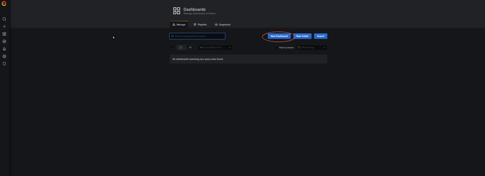
4. Navigate to dashboard settings.
    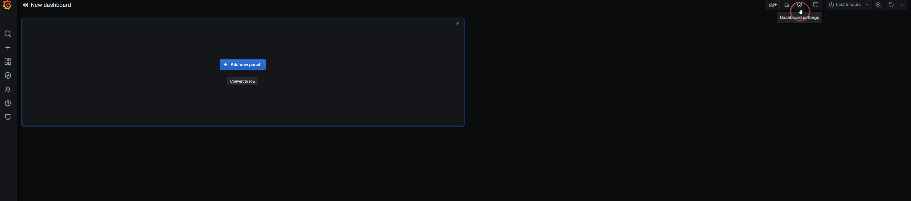
5. Change the name of dashboard in the `General tab` and add new variables per the following table from the `Variables tab`:
    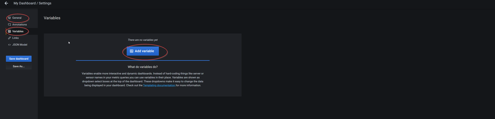
    | Field            | variable 1                                     | variable 2        | variable 3         |
    |------------------|:----------------------------------:|:----------------------------------------------------:|:-------------------------------------------------------------:|
    | Name             | job                                | hostname                                             | node                                                          |
    | Label            | JOB                                | Host                                                 | IP                                                            |
    | Data source      | Prometheus TLS                     | Prometheus TLS                                       | Prometheus TLS                                                |
    | Query            | label_values(node_uname_info, job) | label_values(node_uname_info{job=~"$job"}, nodename) | label_values(node_uname_info{nodename=~"$hostname"},instance) |
    | Sort             | Alphabetical(asc)                  | Disabled                                             | Alphabetical(asc)                                             |
    | Multi-value      |                                    | Enable                                               |                                                               |
    | Include All opt. |                                    | Enable                                               | Enable                                                        |

6. Save the dashboard.
   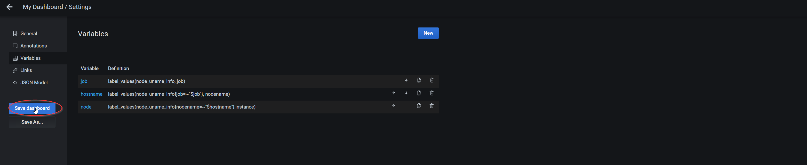
7. Go to the newly created dashboard and add a panel.
   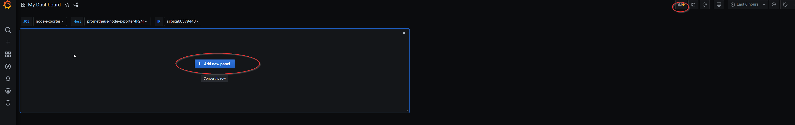
8. Configure the panel per the configuration below and press apply.
   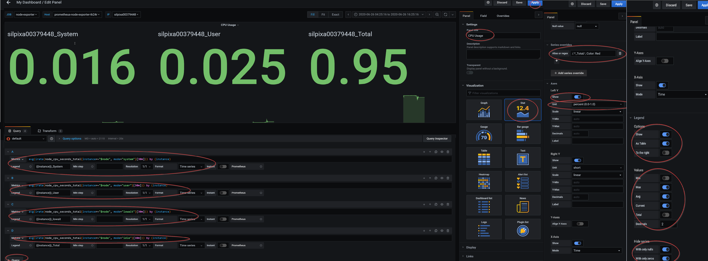

9. To query a specific metric in the panel, select a data source (Prometheus-TLS) and pick a metric needed to be monitored. From the visualization tab, pick the desired style to display the metric. Give the panel a name and press apply in the upper right corner.
    > Prometheus's metrics can be queried using [PromQL language](https://prometheus.io/docs/prometheus/latest/querying/basics/). Queried metrics can be then processed using [PromQL's functions](https://prometheus.io/docs/prometheus/latest/querying/functions) or [Grafana's transformations](https://grafana.com/docs/grafana/latest/panels/transformations).

   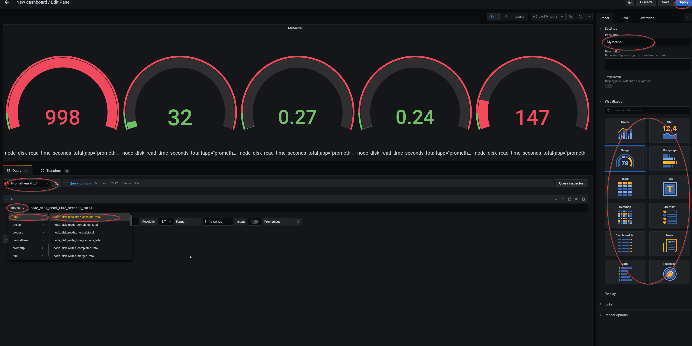
10. To save the dashboard, click save in the upper right corner.
   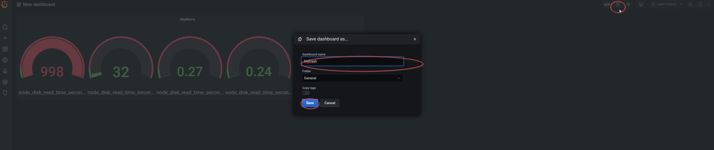

> OpenNESS will deploy Grafana with a  simple `Example dashboard`. You can use this dashboard to learn how to use Grafana and create your own dashboards.

### Node Exporter

Node Exporter is a Prometheus exporter that exposes hardware and OS metrics of *NIX kernels. The metrics are gathered within the kernel and exposed on a web server so they can be scraped by Prometheus. In OpenNESS, the Node Exporter pod is deployed as a K8s `Daemonset`; it is a privileged pod that runs on every Edge Node in the cluster. It is enabled by default by CEEK.

#### Usage

1. To access metrics available from the Node Exporter, connect to the Prometheus [dashboard](#prometheus).
2. Look up an example Node Exporter metric by specifying the metric name (i.e., `node_memory_Active_anon_bytes`) and pressing `execute` under the `graph` tab.
   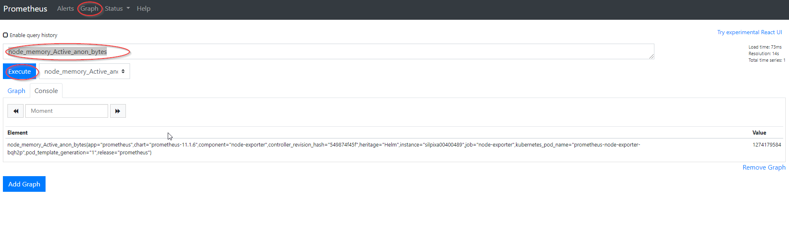

#### VCAC-A

Node Exporter also enables exposure of telemetry from Intel's VCAC-A card to Prometheus. The telemetry from the VCAC-A card is saved into a text file; this text file is used as an input to the Node Exporter. More information on VCAC-A usage in OpenNESS is available [here](https://github.com/open-ness/specs/blob/master/doc/building-blocks/enhanced-platform-awareness/openness-vcac-a.md).

### cAdvisor

The cAdvisor is a running daemon that provides information about containers running in the cluster.
It collects and aggregates data about running containers such as resource usage, isolation parameters, and network statistics. Once the data is processed, it is exported. The data can be easily obtained by metrics monitoring tools such as Prometheus. In OpenNESS, cAdvisor is deployed as a K8s `daemonset` on every Edge Node and scraped by Prometheus.

#### Usage

1. To access metrics available from cAdvisor, connect to the Prometheus [dashboard](#prometheus).
2. Look up an example cAdvisor metric by specifying the metric name (i.e., `container_spec_cpu_quota`) and pressing `execute` under the `graph` tab.
   

### CollectD

CollectD is a daemon/collector enabling the collection of hardware metrics from computers and network equipment. It provides support for CollectD plugins, which extends its functionality for specific metrics collection such as Intel® RDT, Intel PMU, and ovs-dpdk. The metrics collected are easily exposed to the Prometheus monitoring tool via the usage of the `write_prometheus` plugin. In OpenNESS, CollectD is supported with the help of the [OPNFV Barometer project](https://wiki.opnfv.org/display/fastpath/Barometer+Home) - using its Docker image and available plugins. As part of the OpenNESS release, a CollectD plugin for Intel® FPGA Programmable Acceleration Card (Intel® FPGA PAC) N3000 telemetry is now available from OpenNESS (power and temperature telemetry). In OpenNESS, the CollectD pod is deployed as a K8s `Daemonset` on every available Edge Node, and it is deployed as a privileged container.

#### Plugins

There are four distinct sets of plugins (flavors) enabled for CollectD deployment that can be used depending on the use-case/workload being deployed on OpenNESS. `Common` is the default flavor in OpenNESS. The flavors available are: `common`, `corenetwork`, `flexran`, and `smartcity`. Below is a table specifying which CollectD plugins are enabled for each flavor.
The various CEEK flavors are enabled for CollectD deployment as follows:


| Common           | Core Network      | FlexRAN           | SmartCity          |
|------------------|:-----------------:|------------------:|-------------------:|
| cpu              | cpu               | cpu               | cpu                |
| cpufreq          | cpufreq           | cpufreq           | cpufreq            |
| load             | load              | load              | load               |
| hugepages        | hugepages         | hugepages         | hugepages          |
| intel_pmu        | intel_pmu         | intel_pmu         | intel_pmu          |
| intel_rdt        | intel_rdt         | intel_rdt         | intel_rdt          |
| ipmi             | ipmi              | ipmi              | ipmi               |
| write_prometheus | write_prometheus  | write_prometheus  | write_prometheus   |
|                  | ovs_pmd_stats     | ovs_stats         | ovs_pmd_stat       |
|                  | ovs_stats         | fpga_telemetry    |                    |

#### Usage

1. Select the flavor for the deployment of CollectD from the CEEK during OpenNESS deployment; the flavor is to be selected with `telemetry_flavor: <flavor name>`.

   In the event of using the `flexran` profile, `OPAE_SDK_1.3.7-5_el7.zip` needs to be available in `./converged-edge-experience-kits/opae_fpga` directory; for details about the packages, see [FPGA support in OpenNESS](https://github.com/open-ness/specs/blob/master/doc/building-blocks/enhanced-platform-awareness/openness-fpga.md#edge-controller)
2. To access metrics available from CollectD, connect to the Prometheus [dashboard](#prometheus).
3. Look up an example the CollectD metric by specifying the metric name (ie. `collectd_cpufreq`) and pressing `execute` under the `graph` tab.
   

### OpenTelemetry

OpenTelemetry is a project providing APIs and libraries that enable the collection of telemetry from edge services and network functions. This project provides a mechanism to capture application metrics and traces within applications with support for multiple programming languages. The captured metrics are exposed to OpenTelemetry agents and collectors responsible for the handling of data and forwarding it to the desired back-end application(s) for processing and analysis. Among the supported back-ends are popular projects such as Prometheus (metrics), Jaeger, and Zipkin (traces). A concept of receiver and exporter exists within the Open Telemetry agent and collector. The receiver provides a mechanism to receive the data into the agent or collector. Multiple receivers are supported and at least one or more must be configured. On the opposite end, an exporter provides a mechanism to export data to the receiver, similarly multiple exporters are supported and one or more must be set up.

As part of the OpenNESS release, only the support for collecting metrics and exposing them to Prometheus is enabled. The deployment model chosen for Open Telemetry is to deploy a global collector pod receiving data from multiple agents, the agents are to be deployed as side-car containers for each instance of the application pod.

-	The application exports data to the agent locally.
-	The agent receives the data and exports it to the collector by specifying the collector’s K8s service name and port via TLS secured connection.
-	The collector exposes all the available data received from multiple agents on an endpoint which is being scraped by Prometheus.

OpenCensus exporter/receiver is used in the default OpenNESS configuration for agent and collector to collect metrics from an application. A sample application pod generating random numbers, aggregating those numbers and exposing the metrics, and containing a reference side-car OpenTelemetry agent is available in the Edge Apps repository.

#### Usage

1. Pull the Edge Apps repository.
2. Build the sample telemetry application Docker image and push to the local Harbor registry from the Edge Apps repo.

    ```shell
    cd edgeapps/applications/telemetry-sample-app/image/
    ./build.sh push <harbor_registry_ip> <port>
    ```

3. Create a secret using a root-ca created as part of CEEK telemetry deployment (this will authorize against the Collector certificates).

   ```shell
   cd edgeapps/applications/telemetry-sample-app/
   ./create-secret.sh
   ```

4. Configure and deploy the sample telemetry application with the side-car OpenTelemetry agent from the Edge Apps repo using Helm. Edit `edgeapps/applications/telemetry-sample-app/opentelemetry-agent/values.yaml`, and change `app:image:repository: 10.0.0.1:30003/intel/metricapp` to the IP address of the Harbor registry.
  
    ```shell
    cd edgeapps/applications/telemetry-sample-app/
    helm install otel-agent opentelemetry-agent
    ```

5. Check that the app/agent pod is deployed:

    ```shell
    kubectl get pods otel-agent-sidecar

    NAME                 READY   STATUS    RESTARTS   AGE
    otel-agent-sidecar   2/2     Running   0          2m26s
    ```

6. Open your browser and go to `http://<controller_IP>:30000/graph`.
7. Input `opentelemetry_example_random_number_bucket` into the query field and click execute.
8. Click the `Graph` button and check if the graph is plotted (the quantity of numbers in buckets should increase).

### PCM

Processor Counter Monitor (PCM) is an application programming interface (API) and a set of tools based on the API to monitor performance and energy metrics of Intel® Core™, Xeon®, Atom™ and Xeon Phi™ processors. In OpenNESS, the PCM pod is deployed as a K8s `Daemonset` on every available node. PCM metrics are exposed to Prometheus via the Host's NodePort on each EdgeNode. 
>**NOTE**: The PCM feature is intended to run on physical hardware (i.e., no support for VM virtualized Edge Nodes in OpenNESS). Therefore, this feature is disabled by default. The feature can be enabled by setting the `telemetry_pcm_enable` flag in CEEK. Additionally, a preset dashboard is created for PCM in Grafana visualizing the most crucial metrics.
>**NOTE**: There is currently a limitation in OpenNESS where a conflict between deployment of CollectD and PCM prevents PCM server from starting successfully, it is advised to run PCM with CollectD disabled at this time.

#### Usage

1. To access metrics available from PCM, connect to Prometheus [dashboard](#Prometheus).
2. Look up an example PCM metric by specifying the metric name (ie. `L2_Cache_Hits`) and pressing `execute` under the `graph` tab.
   
3. Log into [Grafana](#grafana).
4. Select the dashboard to visualize metrics from the desired node and click on it.
   
5. Metrics are visualized.
   

### TAS

[Telemetry Aware Scheduler](https://github.com/intel/telemetry-aware-scheduling) enables the user to make K8s scheduling decisions based on the metrics available from telemetry. This is crucial for a variety of Edge use-cases and workloads where it is critical that the workloads are balanced and deployed on the best suitable node based on hardware ability and performance. The user can create a set of policies defining the rules to which pod placement must adhere. Functionality to de-schedule pods from given nodes if a rule is violated is also provided. TAS consists of a TAS Extender which is an extension to the K8s scheduler. It correlates the scheduling policies with deployment strategies and returns decisions to the K8s Scheduler. It also consists of a TAS Controller that consumes TAS policies and makes them locally available to TAS components. A metrics pipeline that exposes metrics to a K8s API must be established for TAS to be able to read in the metrics. In OpenNESS, the metrics pipeline consists of:

- Prometheus: responsible for collecting and providing metrics.
- Prometheus Adapter: exposes the metrics from Prometheus to a K8s API and is configured to provide metrics from Node Exporter and CollectD collectors.
TAS is enabled by default in CEEK, a sample scheduling policy for TAS is provided for [VCAC-A node deployment](https://github.com/open-ness/specs/blob/master/doc/building-blocks/enhanced-platform-awareness/openness-vcac-a.md#telemetry-support).

#### Usage

1. To check the status of the TAS Extender and Controller, check the logs of the respective containers.
   ```shell
   $ kubectl get pods | grep telemetry-aware-scheduling #Finds name of TAS pod

    telemetry-aware-scheduling-75596fd6b4-4qjvm   2/2     Running   2          5d3h
   
   $ kubectl logs <TAS POD name> -c tascont #Logs for Controller

    2020/05/23 15:11:47 Watching Telemetry Policies

   $ kubectl logs <TAS POD name> -c tasext # Logs for Extender

    2020/05/23 15:11:47 Extender Now Listening on HTTPS  9001
   ```
2. To check metrics available from the K8s API (a non-empty output expected), run:
   ```shell
   kubectl get --raw /apis/custom.metrics.k8s.io/v1beta1 | jq .
   ```
3. To define a scheduling policy, create a `TASPolicy` definition file and deploy it by running `kubectl apply -f <Policy file name>`. The following is an example for a VCAC-A node:
   ```yaml
   apiVersion: telemetry.intel.com/v1alpha1
    kind: TASPolicy
    metadata:
      name: vca-vpu-policy
      namespace: default
    spec:
      strategies:
        deschedule:
          rules:
          - metricname: vpu_device_thermal
            operator: GreaterThan
            target: 60
        dontschedule:
          rules:
          - metricname: vpu_device_memory
            operator: GreaterThan
            target: 50
          - metricname: vpu_device_utilization
            operator: GreaterThan
            target: 50
        scheduleonmetric:
          rules:
          - metricname: vpu_device_utilization
            operator: LessThan
   ```
4. To link a created policy to a workload, add the required label (`telemetry-policy`), resources (`telemetry/scheduling: 1`), and node affinity (`affinity`) to the workload's specification file and deploy the workload.
   ```yaml
   apiVersion: batch/v1
   kind: Job
   metadata:
     name: intelvpu-demo-tas
     labels:
       app: intelvpu-demo-tas
   spec:
     template:
       metadata:
         labels:
           jobgroup: intelvpu-demo-tas
           telemetry-policy: vpu-policy
       spec:
         restartPolicy: Never
         containers:
         -
             name: intelvpu-demo-job-2
             image: ubuntu-demo-openvino
             imagePullPolicy: IfNotPresent
             command: [ "/do_classification.sh" ]
             resources:
               limits:
                 vpu.intel.com/hddl: 1
                 telemetry/scheduling: 1
         affinity:
           nodeAffinity:
             requiredDuringSchedulingIgnoredDuringExecution:
               nodeSelectorTerms:
                 - matchExpressions:
                     - key: vpu-policy
                       operator: NotIn
                       values:
                         - violating
   ```

## Summary

The OpenNESS platform provides a comprehensive set of features and components that enable users to collect, monitor, and visualize a variety of platform metrics with a strong focus on telemetry from Intel® architecture (hardware such as CPU, VCAC-A, and FPGA).
It also provides the means to make intelligent scheduling decisions for performance-sensitive Edge workloads based on the performance and abilities of the hardware.
The support for collecting and visualizing metrics from within applications is also provided.

The telemetry component deployment is modular (each component running in its own pod) and easily configurable, meaning that support for other telemetry collectors is possible in the future. Currently, only support for metrics telemetry is provided but support for logging and tracing telemetry/tools for applications is planned for future releases.
