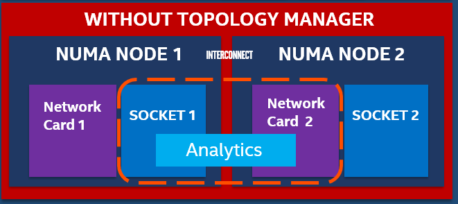

```text
SPDX-License-Identifier: Apache-2.0
Copyright (c) 2019 Intel Corporation
```
<!-- omit in toc -->
# Resource Locality Awareness Support Through Topology Manager in OpenNESS
- [Overview](#overview)
  - [Edge use case](#edge-use-case)
- [Details - Topology manager support in OpenNESS](#details---topology-manager-support-in-openness)
  - [Usage](#usage)
- [OpenNESS NUMA and DPDK Cheat Sheet](#OpenNESS-NUMA-and-DPDK-Cheat-Sheet)
  - [DPDK in OpenNESS](#DPDK-in-OpenNESS)
  - [What is NUMA and Why You Care](#What-is-NUMA-and-Why-You-Care)
  - [Determine NIC NUMA placement](#Determine-NIC-NUMA-placement)
  - [CPU Mask Calculations](#CPU-Mask-Calculations)
  - [Hugepages and NUMA](#Hugepages-and-NUMA)
  - [DPDK CPU Mask Script](#DPDK-CPU-Mask-Script)
  - [TuneD and DPDK CPU Bindings](#TuneD-and-DPDK-CPU-Bindings)
- [Reference](#reference)

## Overview

Multi-core and Multi-Socket commercial, off-the-shelf (COTS) systems are widely used for the deployment of application and network functions. COTS systems provide a variety of IO and memory features. In order to achieve determinism and high performance, mechanisms like CPU isolation, IO device locality, and socket memory allocation are critical. Cloud-native stacks such as Kubernetes\* are beginning to leverage resources such as CPU, hugepages, and I/O, but are agnostic to the Non-Uniform Memory Access (NUMA) alignment of these. Non-optimal, topology-aware NUMA resource allocation can severely impact the performance of latency-sensitive workloads.

To address this requirement, OpenNESS uses the Topology manager. The topology manager is now supported by Kubernetes. Topology Manager is a solution that permits k8s components (e.g., CPU Manager and Device Manager) to coordinate the resources allocated to a workload.

### Edge use case

Let us look at an Analytics application that is consuming multiple, high-definition video streams and executing an analytics algorithm. This analytics application pod is compute-, memory-, and network performance-sensitive. To improve performance of the analytics application on a typical dual-socket or multi-NUMA node system, an Orchestrator like Kubernetes needs to place the analytics pod on the same NUMA node where the Network Card is located and the memory is allocated. Without the topology manager, the deployment may be like that shown in the diagram below, where the analytics application is on NUMA 1 and the Device is on NUMA 2. This leads to poor and unreliable performance.


_Figure - Pod deployment issue without Topology Manager_

With Topology manager, this issue is addressed and the analytics pod placement will be such that the resource locality is maintained.


_Figure - Pod deployment with Topology Manager_

Topology Manager is a Kubelet component that aims to co-ordinate the set of components that are responsible for these optimizations.

## Details - Topology manager support in OpenNESS

Topology Manager is enabled by default with a `best-effort` policy. You can change the settings before OpenNESS installation by editing the `inventory/default/group_vars/all/10-default.yml` file:

```yaml
### Kubernetes Topology Manager configuration (for a node)
# CPU settings
cpu:
  # CPU policy - possible values: none (disabled), static (default)
  policy: "static"
  # Reserved CPUs
  reserved_cpus: "0,1"

# Kubernetes Topology Manager policy - possible values: none (disabled), best-effort (default), restricted, single-numa-node
topology_manager:
  policy: <selected_policy>
```

Where `<selected_policy>` can be `none`, `best-effort`, `restricted` or `single-numa-node`. Refer to the [Kubernetes Documentation](https://kubernetes.io/docs/tasks/administer-cluster/topology-manager/) for details of these policies.

You can also set `reserved_cpus` to a number that suits you best. This parameter specifies the logical CPUs that will be reserved for a Kubernetes system Pods and OS daemons.

### Usage

To use Topology Manager create a Pod with a `guaranteed` QoS class (requests equal to limits). For example:

```yaml
kind: Pod
apiVersion: v1
metadata:
  name: examplePod
spec:
  containers:
    - name: example
      image: alpine
      command: ["/bin/sh", "-ec", "while :; do echo '.'; sleep 5 ; done"]
      resources:
        limits:
          cpu: "8"
          memory: "500Mi"
        requests:
          cpu: "8"
          memory: "500Mi"
```

Then apply it with `kubectl apply`. You can check in the kubelet's logs on you node (`journalctl -xeu kubelet`), that Topology Manager obtained all the info about preferred affinity and deployed the Pod accordingly. The logs should be similar to the one below.

```
Nov 05 09:22:52 tmanager kubelet[64340]: I1105 09:22:52.548692   64340 topology_manager.go:308] [topologymanager] Topology Admit Handler
Nov 05 09:22:52 tmanager kubelet[64340]: I1105 09:22:52.550016   64340 topology_manager.go:317] [topologymanager] Pod QoS Level: Guaranteed
Nov 05 09:22:52 tmanager kubelet[64340]: I1105 09:22:52.550171   64340 topology_hints.go:60] [cpumanager] TopologyHints generated for pod 'examplePod', container 'example': [{0000000000000000000000000000000000000000000000000000000000000001 true} {0000000000000000000000000000000000000000000000000000000000000010 true} {0000000000000000000000000000000000000000000000000000000000000011 false}]
Nov 05 09:22:52 tmanager kubelet[64340]: I1105 09:22:52.550204   64340 topology_manager.go:285] [topologymanager] ContainerTopologyHint: {0000000000000000000000000000000000000000000000000000000000000010 true}
Nov 05 09:22:52 tmanager kubelet[64340]: I1105 09:22:52.550216   64340 topology_manager.go:329] [topologymanager] Topology Affinity for Pod: 4ad6fb37-509d-4ea6-845c-875ce41049f9 are map[example:{0000000000000000000000000000000000000000000000000000000000000010 true}]

```

# OpenNESS NUMA and DPDK Cheat Sheet

_Disclaimer: this document is not intended to serve as a comprehensive guide to DPDK, optimizing DPDK deployments, or as a replacement for the extensive DPDK documentation.  This guide is intended as a supplement to the OpenNESS/CERA experience kits in order to adapt them to a platform that is different than those used in the OpenNESS development and validation labs._

_The examples in this document are taken from a DELL R740 server, which happens to enumerate CPUs very differently than the Intel WolfPass S2600WFQ reference platform commonly utilized within Intel labs._

[TOC]


# DPDK in OpenNESS

When the OpenNESS is deployed with the KubeOVN CNI we include the DPDK optimizations, this is managed through the _flavor_ group_vars via the flag:

```bash
kubeovn_dpdk: true
```

When the flag is set to true, then the OVS is deployed with DPDK bindings.  In the case that the deployment succeeds, this can be verified with the following:

```bash
ovs-vsctl get Open_vSwitch . dpdk_initialized
```

Example:

```bash
[root@edgenode ~]# ovs-vsctl get Open_vSwitch . dpdk_initialized
true
```

## What is NUMA and Why You Care

The [Wikipedia entry for NUMA](https://en.wikipedia.org/wiki/Non-uniform_memory_access#:~:text=Non-uniform%20memory%20access%20%28%20NUMA%29%20is%20a%20computer,to%20another%20processor%20or%20memory%20shared%20between%20processors%29.) states:

> **Non-Uniform Memory Access** (**NUMA**) is a [computer memory](https://en.wikipedia.org/wiki/Computer_storage) design used in [multiprocessing](https://en.wikipedia.org/wiki/Multiprocessing), where the memory access time depends on the memory location relative to the processor. Under NUMA, a processor can access its own [local memory](https://en.wikipedia.org/wiki/Local_memory) faster than non-local memory (memory local to another processor or memory shared between processors). The benefits of NUMA are limited to particular workloads, notably on servers where the data is often associated strongly with certain tasks or users.

So in summary, each physical CPU core has memory that is _more_ local than other memory.  The latency to access the more local has lower latency, when we look at maximizing throughput, bandwith, and latency the memory access latency has increasing impact on the observed performance.  This applies to the queues for networking (and NVMe storage) devices as well, in order to maximize performance you want the execution threads to have affinity to the same memory space in order to benefit from this reduced localized access.  It is recommended to place the latency sensitive applications to be localized within the same NUMA node as the network interface (and storage devices) it will utilize in order to see the full capability of the hardware.  

Intel publishes various resources for [optimizing applications for NUMA](https://software.intel.com/content/www/us/en/develop/articles/optimizing-applications-for-numa.html) including a guide on assessing the effect of NUMA using [Intel® VTune™ Amplifier](https://software.intel.com/content/www/us/en/develop/videos/how-numa-affects-your-workloads-intel-vtune-amplifier.html).

Within OpenNESS we implement [CPU management extensions](https://www.openness.org/docs/doc/building-blocks/enhanced-platform-awareness/openness-dedicated-core#details---cpu-manager-support-in-openness) to Kubernetes to allow scheduling workloads with NUMA awareness. In the context of DPDK, we bind the descriptors for dataplane to the NUMA node of the network interface(s).

## Determine NIC NUMA placement

While this currently focuses on the NIC, the same applies to decoding the NUMA affinity of any PCI resource, including accelerator cards.

Find NIC's PCI address (in this example we know we are using an Intel X710 NIC but XXV710 would also be found):

```bash
[root@edgenode ~]# lspci | grep 710
86:00.0 Ethernet controller: Intel Corporation Ethernet Controller X710 for 10GbE SFP+ (rev 02)
86:00.1 Ethernet controller: Intel Corporation Ethernet Controller X710 for 10GbE SFP+ (rev 02)
```

The NIC PCI location can also be found by using `ethtool` against the interface name as shown in `ip link show` or `ifconfig` by using `ethtool -m <interfacename>`:

```bash
[root@edgenode ~]# ethtool -i eth0 | grep bus-info
bus-info: 86:00.0
```

Find NUMA node of NICs:

```bash
[root@edgenode ~]# lspci -vmms 86:00.0
Slot: 86:00.0
Class:  Ethernet controller
Vendor: Intel Corporation
Device: Ethernet Controller X710 for 10GbE SFP+
SVendor:  Intel Corporation
SDevice:  Ethernet Converged Network Adapter X710-2
Rev:  02
NUMANode: 1
```

`lspci` command options selected here are:

```bash
Basic display modes:
-mm    Dump PCI device data in a machine readable form for easy parsing by scripts.  See below for details.

Display options:
-v    Be verbose and display detailed information about all devices. (-vv for very verbose)

Selection of devices:
-s [[[[<domain>]:]<bus>]:][][.[<func>]]         Show only devices in the specified domain (in case your machine has several host bridges, they can either share a common bus number space or each of them can address a PCI domain of its own; domains are numbered from 0 to ffff), bus (0 to ff), device (0 to 1f) and function (0 to 7).  Each component of the device address can be omitted or set to "*", both meaning "any value". All numbers are  hexadecimal.   E.g.,  "0:"  means  all  devices on bus 0, "0" means all functions of device 0 on any bus, "0.3" selects third function of device 0 on all buses and ".4" shows only the fourth function of each device.
```

Alternatively to using `lspci -vmss` (as it may not work on all platforms), this can also be found by reading the PCI device properties:

```bash
[root@edgenode ~]# cat /sys/bus/pci/devices/0000\:86\:00.0/numa_node
1
```

You can also read the local CPU list of the PCI device:

```bash
[root@edgenode ~]# cat /sys/bus/pci/devices/0000\:86\:00.0/local_cpulist
1,3,5,7,9,11,13,15,17,19,21,23,25,27,29,31,33,35,37,39,41,43,45,47
```

When we proceed to selecting CPUs for the `pmd_cpu_mask` the above CPU list is critical, as we must select a CPU that is within the _same_ NUMA node as the NIC(s).

## CPU Mask Calculations

CPU masks are defined within `group_vars/all/10-default.yml` as `kubeovn_dpdk_pmd_cpu_mask` and `kubeovn_dpdk_lcore_mask`.

CPU Mask is used to assign cores to DPDK.

`numactl -H` will provide a list of CPUs, however it doesn't show which threads are "peers".  On some platforms the CPU IDs are enumerated in sequential order within NUMA node 0 and then into NUMA node 1 (e.g. `0`,`1`,`2`,`3` etc would be sequentially in NUMA node 0):

```bash
[root@edgenode ~]# numactl -H
available: 2 nodes (0-1)
node 0 cpus: 0 1 2 3 4 5 6 7 8 9 10 11 12 13 14 15 16 17 18 19 20 21 22 23 48 49 50 51 52 53 54 55 56 57 58 59 60 61 62 63 64 65 66 67 68 69 70 71
node 0 size: 95128 MB
node 0 free: 71820 MB
node 1 cpus: 24 25 26 27 28 29 30 31 32 33 34 35 36 37 38 39 40 41 42 43 44 45 46 47 72 73 74 75 76 77 78 79 80 81 82 83 84 85 86 87 88 89 90 91 92 93 94 95
node 1 size: 96729 MB
node 1 free: 71601 MB
node distances:
node   0   1
  0:  10  21
  1:  21  10
```

Other platforms enumerate across the NUMA nodes, where _even_ CPU IDs are within pme NUMA node while _odd_ CPU IDs are on the opposing NUMA node as shown below:

```bash
[root@edgenode ~]# numactl -H
available: 2 nodes (0-1)
node 0 cpus: 0 2 4 6 8 10 12 14 16 18 20 22 24 26 28 30 32 34 36 38 40 42 44 46
node 0 size: 96749 MB
node 0 free: 86064 MB
node 1 cpus: 1 3 5 7 9 11 13 15 17 19 21 23 25 27 29 31 33 35 37 39 41 43 45 47
node 1 size: 98304 MB
node 1 free: 86713 MB
node distances:
node   0   1
  0:  10  21
  1:  21  10
```

Within the DPDK source code there is a tool to show CPU topology, the OEK places this in `/opt/dpdk-18.11.6/usertools`.  The advantage of this output is that it will show the peer threads (HyperThreading) for the same physical CPU.

Example, CPUs `0` and `24` execute on the same physical core.

```bash
[root@edgenode ~]# /opt/dpdk-18.11.6/usertools/cpu_layout.py
======================================================================
Core and Socket Information (as reported by '/sys/devices/system/cpu')
======================================================================

cores =  [0, 5, 1, 4, 2, 3, 8, 13, 9, 12, 10, 11]
sockets =  [0, 1]

        Socket 0        Socket 1
        --------        --------
Core 0  [0, 24]         [1, 25]
Core 5  [2, 26]         [3, 27]
Core 1  [4, 28]         [5, 29]
Core 4  [6, 30]         [7, 31]
Core 2  [8, 32]         [9, 33]
Core 3  [10, 34]        [11, 35]
Core 8  [12, 36]        [13, 37]
Core 13 [14, 38]        [15, 39]
Core 9  [16, 40]        [17, 41]
Core 12 [18, 42]        [19, 43]
Core 10 [20, 44]        [21, 45]
Core 11 [22, 46]        [23, 47]
```

CPU mask is calculated as a bitmask, where the bit location corresponds to the CPU in a numercial list.  If we list CPUs values in a row:

```bash
0 1 2 3 4 5 6 7 8 9 10 11 12... 24 25 26 27 28 29 30 31 32 33 34 35 36...
```

The bit placement is the position of the CPU ID, so CPU ID `2` has is the _third_ bit placement...or `0100` in binary and CPU ID 8 is the _ninth_ bit placement or `1 0000 0000` in binary.  We can then convert from `bin` to `hex`.  `0001` = `0x4` and `1 0000 0000` = `0x100`.

This can also be found via:

```bash
echo "ibase=10; obase=16; 2^($CPUID)" | bc
```

Example for CPU ID = `3` (as it is local to the NUMA node with the NIC above)

```bash
[root@edgenode ~]# echo "ibase=10; obase=16; 2^(3)" | bc
8
```

In this case we would set the CPU mask to `0x8`.

A web based tool to calculate CPU mask can be found [here](https://bitsum.com/tools/cpu-affinity-calculator/).

**Setting CPU bindings to CPU0 (`0x1`) will fail, CPU0 is reserved for system kernel.**

## Hugepages and NUMA

Hugepages are allocated per NUMA  node, when DPDK binds to a CPU there **must be hugepages within the relative NUMA** node to support DPDK.  The _first_ NUMA node cannot have `0` hugepages, so you must either be `<value>,0` or `<value>,<value>` (e.g. `1024,0` or `1024,1024`).

If there are no hugepages in the NUMA  node where DPDK is set to bind it will fail with an error similar to the following within `/var/log/openvswitch/ovs-vswitchd.log`. In the case of this example, the assigned `kubeovn_dpdk_pmd_cpu_mask` resides on NUMA socket1, however the hugepages were only allocated on socket0 (--socket-mem 1024,0):

Example error message from `ovs-vswitchd.log`:

```ovs-vswitchd.log
2020-09-29T21:07:46.401Z|00001|vlog|INFO|opened log file /var/log/openvswitch/ovs-vswitchd.log
2020-09-29T21:07:46.415Z|00002|ovs_numa|INFO|Discovered 24 CPU cores on NUMA node 0
2020-09-29T21:07:46.415Z|00003|ovs_numa|INFO|Discovered 24 CPU cores on NUMA node 1
2020-09-29T21:07:46.415Z|00004|ovs_numa|INFO|Discovered 2 NUMA nodes and 48 CPU cores
2020-09-29T21:07:46.415Z|00005|reconnect|INFO|unix:/var/run/openvswitch/db.sock: connecting...
2020-09-29T21:07:46.415Z|00006|reconnect|INFO|unix:/var/run/openvswitch/db.sock: connected
2020-09-29T21:07:46.418Z|00007|dpdk|INFO|Using DPDK 18.11.6
2020-09-29T21:07:46.418Z|00008|dpdk|INFO|DPDK Enabled - initializing...
2020-09-29T21:07:46.418Z|00009|dpdk|INFO|No vhost-sock-dir provided - defaulting to /var/run/openvswitch
2020-09-29T21:07:46.418Z|00010|dpdk|INFO|IOMMU support for vhost-user-client disabled.
2020-09-29T21:07:46.418Z|00011|dpdk|INFO|POSTCOPY support for vhost-user-client disabled.
2020-09-29T21:07:46.418Z|00012|dpdk|INFO|Per port memory for DPDK devices disabled.
2020-09-29T21:07:46.418Z|00013|dpdk|INFO|EAL ARGS: ovs-vswitchd -c 0x2 --huge-dir /hugepages --socket-mem 1024,0 --socket-limit 1024,0.
2020-09-29T21:07:46.426Z|00014|dpdk|INFO|EAL: Detected 48 lcore(s)
2020-09-29T21:07:46.426Z|00015|dpdk|INFO|EAL: Detected 2 NUMA nodes
2020-09-29T21:07:46.431Z|00016|dpdk|INFO|EAL: Multi-process socket /var/run/dpdk/rte/mp_socket
2020-09-29T21:07:46.497Z|00017|dpdk|WARN|EAL: No free hugepages reported in hugepages-1048576kB
2020-09-29T21:07:46.504Z|00018|dpdk|INFO|EAL: Probing VFIO support...
2020-09-29T21:07:46.504Z|00019|dpdk|ERR|EAL:   no supported IOMMU extensions found!
2020-09-29T21:07:46.504Z|00020|dpdk|INFO|EAL: VFIO support could not be initialized
2020-09-29T21:08:05.475Z|00002|daemon_unix|ERR|fork child died before signaling startup (killed (Bus error), core dumped)
2020-09-29T21:08:05.475Z|00003|daemon_unix|EMER|could not initiate process monitoring
```

This error was corrected with adding the following to a ~/node_var/ node specific yaml:

```yaml
kubeovn_dpdk_socket_mem: "1024,1024"
kubeovn_dpdk_pmd_cpu_mask: "0x8"
kubeovn_dpdk_lcore_mask: "0x20"
```

These bind `dpdk_pmd_cpu_mask` to CPU 3 (binary `1000`) and `dpdk_lcore_mask` to CPU 5 (binary `10 0000`).

## Script finding CPUs in NIC NUMA Node

This script can be executed to determine the CPUs that are local to a targeted network interface.

```bash
echo "What network interface is the target (e.g. as output in 'ip link show' or 'nmcli dev status')" &&
read interfacename &&
pcibus=`ethtool -i $interfacename | grep bus-info | cut -d " " -f 2 |  sed 's,:,\\\:,g'` &&
echo "*** The following CPUs are NUMA adjacent to network interface $interfacename ***" &&
eval cat /sys/bus/pci/devices/$pcibus/local_cpulist
```

# TuneD and DPDK CPU Bindings

[TBA]

## Reference

- [Topology Manager](https://kubernetes.io/docs/tasks/administer-cluster/topology-manager/)

- [DPDK Programmers Guide](https://doc.dpdk.org/guides/prog_guide/index.html)

- [DPDK Getting Started Guide for Linux](https://doc.dpdk.org/guides/linux_gsg/index.html)

- [How to get best performance with NICs on Intel platforms](https://doc.dpdk.org/guides/linux_gsg/nic_perf_intel_platform.html#configurations-before-running-dpdk)
