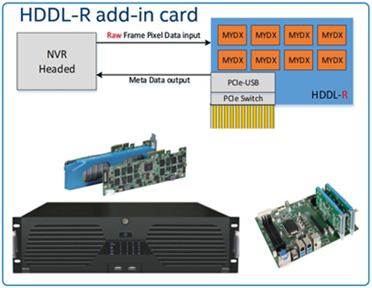

```text
SPDX-License-Identifier: Apache-2.0
Copyright (c) 2019 Intel Corporation
```
<!-- omit in toc -->
# Using Intel® Movidius™ Myriad™ X High Density Deep Learning (HDDL) solution in Smart Edge Open
- [Overview](#overview)
- [HDDL Introduction](#hddl-introduction)
- [HDDL Smart Edge Open Integration](#hddl-smart-edge-open-integration)
- [Summary](#summary)
- [Reference](#reference)

## Overview
The deployment of AI-based, machine-learning (ML) applications on the edge have become more prevalent. Supporting hardware resources that accelerate AI/ML applications on the edge is key to improve the capacity of edge cloud deployment. It is also important to use the CPU instruction set to execute AI/ML tasks when a workload is less. This document explains these topics in the context of inference as an edge workload.

## HDDL Introduction
Intel® Movidius™ Myriad™ X High Density Deep Learning (HDDL) solution integrates multiple Intel® Movidius™ Myriad™ X brand SoCs in a PCIe add-in card form factor or a module form factor to build a scalable, high-capacity, deep-learning solution. It provides hardware and software reference for customers. The following figure shows the HDDL-R concept.



- <b>HDDL-R</b>: Raw video data to the PCIe card (decode on the host).
- <b>Scalability</b>: Options available to put between 4 to 8 Intel® Movidius™ Myriad™ X brand SoC chips in one add-in-card.
- <b>Easy to adopt (plug and use)</b>: Powered by the PCIe\* x4 interface with a 25W ceiling from existing NVR and server designs.

The HDDL SW stack adopts OpenVINO™ brand IE APIs. These universal deep-learning inference APIs have different implementations for the Intel’s CPU, GPU, FPGA, and VPU (Intel® Movidius™ Myriad™ series) technology.
Each implementation for each hardware is an inference engine plugin.
The plugin for the Intel® Movidius™ Myriad™ X HDDL solution, or IE HDDL plugin for short, supports the Intel® Movidius™ Myriad™ X HDDL Solution hardware PCIe card. It communicates with the Intel® Movidius™ Myriad™ X HDDL HAL API to manage multiple Intel® Movidius™ Myriad™ X devices in the card, and it schedules deep-learning neural networks and inference tasks to these devices.

## HDDL Smart Edge Open Integration
Smart Edge Open provides support for the deployment of OpenVINO™ applications and workloads accelerated through Intel® Vision Accelerator Design with the Intel® Movidius™ VPU HDDL-R add-in card. As a prerequisite for enabling the support, it is required for the HDDL add-in card to be inserted into the PCI slot of the Edge Node platform. The support is then enabled by setting the appropriate flag - 'ne_hddl_enable' in the 'inventory/default/group_vars/all/10-default.yml' before running CEEK playbooks.
> **NOTE** No pre-defined flavor is provided for HDDL. If user wants to enable HDDL with flavor, can set flag - 'ne_hddl_enable' in the 'flavors/<flavor-name>/all.yml'. The node with HDDL card inserted will be labelled as 'hddl-zone=true'.

The CEEK automation script for HDDL will involve the following steps:
- Download the HDDL DaemonSet yaml file from [Open Visual Cloud dockerfiles software](https://github.com/OpenVisualCloud/Dockerfiles) and templates it with specific configuration to satifiy Smart Edge Open need such as OpenVINO version...etc.
- Download the OpenVINO™, install kernel-devel and then install HDDL dependencies.
- Build the HDDLDdaemon image.
- Label the node with 'hddl-zone=true'.
- HDDL Daemon automatically brings up on the node with label 'hddl-zone=true'.

The HDDL Daemon provides the backend service to manage VPUs and dispatch inference tasks to VPUs. OpenVINO™-based applications that utilizes HDDL hardware need to access the device node '/dev/ion' and domain socket under '/var/tmp' to communicate with the kernel and HDDL service.
> **NOTE** With the default kernel used by Smart Edge Open CEEK, the ion driver will not enabled by OpenVINO™ toolkits, and the shared memory - '/dev/shm' will be used as fallback.  More details refer to [installing_openvino_docker_linux](https://docs.openvinotoolkit.org/2020.2/_docs_install_guides_installing_openvino_docker_linux.html) 


## Summary
The Intel® Movidius™ Myriad™ X HDDL solution integrates multiple Intel® Movidius™ Myriad™ X brand SoCs in a PCIe add-in card form factor or a module form factor to build a scalable, high-capacity, deep-learning solution. Smart Edge Open provides a toolkit for customers to put together deep-learning solutions at the edge. To take it further for efficient resource usage, Smart Edge Open provides a mechanism to use CPU or VPU depending on the load or any other criteria.

## Reference
- [HDDL-R: Mouser Mustang-V100](https://www.mouser.ie/datasheet/2/763/Mustang-V100_brochure-1526472.pdf)
