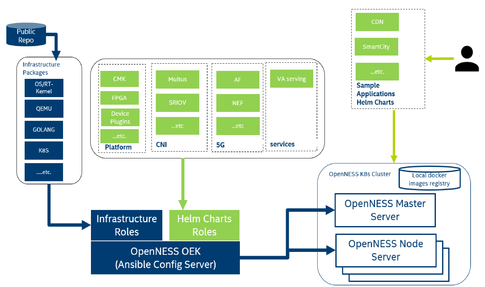

```text
SPDX-License-Identifier: Apache-2.0       
Copyright (c) 2020 Intel Corporation
```

- [Introduction](#introduction)
- [Architecture](#architecture)
- [Helm Installation](#helm-installation)
- [Helm Charts](#helm-charts)
- [References](#references)

# Introduction
Helm is a package manager for Kubernetes. It allows developers and operators to easily package, configure, and deploy applications and services onto the Kubernetes clusters (More details refer to [Helm Website](https://helm.sh)). OpenNESS Helm extends the [OpenNESS Experience Kits](https://github.com/otcshare/openness-experience-kits) Ansible playbooks to the deployment of kuberenets packages, and provides a path for customer to upgrade without re-install.  The aim of this document is to familiarize the user with the OpenNESS Helm for the Network Edge. This guide will provide instructions on how to use Helm with OpenNESS. 

# Architecture
The below figure shows the architecture for the OpenNESS Helm in this document.


_Figure - Helm Architecture in OpenNESS_


# Helm Installation
Helm 3 is used for OpenNESS, since it is more simple to use and secure than helm 2, thus provides more production-level for users. Helm installation is automatically conducted by OpenNESS OEK playbooks as below:
   ```yaml
   - role: kubernetes/helm
   ```
To check whether helm is installed successfully, on the OpenNESS controller run:
   ```bash
   $ helm version
   version.BuildInfo{Version:"v3.1.2", GitCommit:"d878d4d45863e42fd5cff6743294a11d28a9abce", GitTreeState:"clean", GoVersion:"go1.13.8"}
   ```
# Helm Charts   
OpenNESS provides helm charts: 
- EPA, Telemetry and k8s plugins: 
  - CMK, NFD, FPGA Config, SRIOV, VPU and GPU Device Plugins
  - Prometheus, NodeExporter, Cadvisor, Collectd, Opentelemetry, PCM and Grafana.
  - CNI plugins including Multus and SRIOV CNI.
  - video analytics service. 
  - 5G control plane pods. (For 5G helm chart list, more details in OpenNESS Enhanced Repo) 
> **Note:**  NFD, CMK, Prometheus, NodeExporter and Grafana leverage existing third-party helm charts: [Container Experience Kits](https://github.com/intel/container-experience-kits) and [Helm Github Repo](https://github.com/helm/charts)

For the platform related helm charts, [OpenNESS Experience Kits](https://github.com/otcshare/openness-experience-kits) ansible playbooks perform automatic charts generation and deploy the platform pods via the charts. All the helm chart files will be saved in the specific directly on OpenNESS controller. To modify the directory, change variable `ne_helm_charts_default_dir` in `group_vars/all/10-default.yml` file:
   ```yaml
   ne_helm_charts_default_dir: /opt/openness-helm-charts/
   ```

After completion of OpenNESS OEK, check the directory:
   ```bash
   $ ls /opt/openness-helm-charts/
   vpu-plugin gpu-plugin node-feature-discovery prometheus
   ```

To check helm releases, run:
   ```bash
   $ helm list -A
   NAME                    NAMESPACE       REVISION        UPDATED                                 STATUS          CHART                                APP VERSION
   nfd-release             openness        1               2020-05-08 05:13:54.900713372 +0800 CST deployed        node-feature-discovery-0.5.0         0.5.0
   prometheus              telemetry       1               2020-05-08 05:12:09.346590474 +0800 CST deployed        prometheus-11.1.6                    2.16.0
   intel-gpu-plugin        default         1               2020-05-08 03:10:05.464149345 +0800 CST deployed        intel-gpu-plugin-0.1.0               0.17.0
   intel-vpu-plugin        default         1               2020-05-08 03:23:44.595413394 +0800 CST deployed        intel-vpu-plugin-0.1.0               0.17.0
   ```
> **Note:**  Different OpenNESS flavors contain different platform features. So above is just an example for the helm charts.

To see the values that took effect for a specific release (For example: nfd-release), run:
   ```bash
   $ helm get values nfd-release -n openness
   USER-SUPPLIED VALUES:
   image:
      repository: 10.240.224.84:5000/node-feature-discovery
      tag: v0.5.0
   serviceAccount:
      name: nfd-master
   weavenet_cidr: 10.32.0.0/12
   weavenet_cidr_enabled: false
   ```

To customize values and upgrade, user can modify values.yaml file of the helm charts and use `helm upgrade`. (More details refer to [Helm Commands Guidance](https://helm.sh/docs/helm/))


- Sample applications, network functions and services that can be deployed and verified on the OpenNESS platform:
  - Applications
    - [CDN Caching Application Helm Charts](https://github.com/otcshare/edgeapps/tree/master/applications/cdn-caching)
    - CDN-Transcode Application Helm Charts.(Leverage OpenVisualCloud [CDN-Transcode-Sample Helm Charts](https://github.com/OpenVisualCloud/CDN-Transcode-Sample/tree/master/deployment/kubernetes/helm))
    - Smart-City Application Helm Charts. (Leverage OpenVisualCloud [SmartCity Helm Charts](https://github.com/OpenVisualCloud/Smart-City-Sample/tree/master/deployment/kubernetes/helm))
    - [Telemetry Sample Application Helm Charts](https://github.com/otcshare/edgeapps/tree/master/applications/telemetry-sample-app)
    - [EIS Sample Application Helm Charts](https://github.com/otcshare/edgeapps/tree/master/applications/eis-experience-kit)
  - Network Functions
    - [FlexRAN Helm Charts](https://github.com/otcshare/edgeapps/tree/master/network-functions/ran/charts/flexran)
    - [xRAN Helm Charts](https://github.com/otcshare/edgeapps/tree/master/network-functions/xran/helmcharts/xranchart)
    - [UPF Helm Charts](https://github.com/otcshare/edgeapps/tree/master/network-functions/core-network/charts/upf)

# References
- [Helm Website](https://helm.sh)
- [Container Experience Kits](https://github.com/intel/container-experience-kits)
- [Helm Github Repo](https://github.com/helm/charts)
