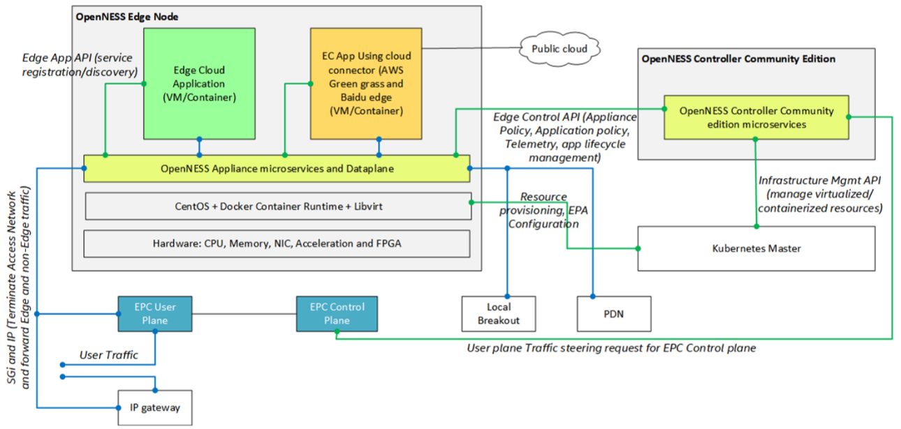
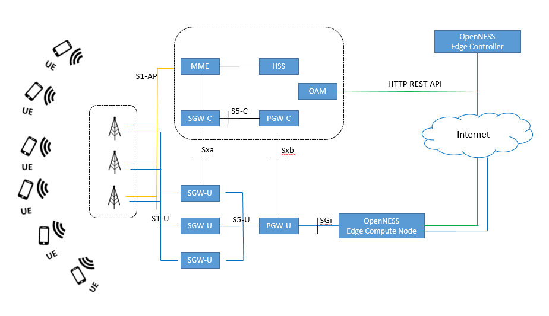
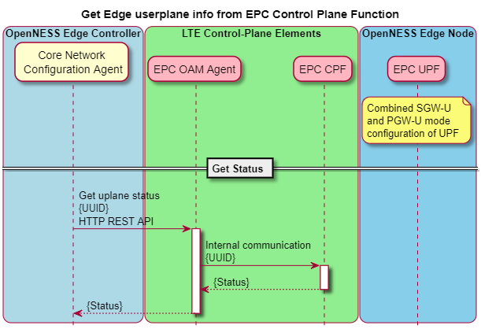

```text
SPDX-License-Identifier: Apache-2.0
Copyright (c) 2019 Intel Corporation
```

# Edge Cloud Deployment with 3GPP 4G LTE CUPS of EPC  

- [Edge Cloud Deployment with 3GPP 4G LTE CUPS of EPC](#edge-cloud-deployment-with-3gpp-4g-lte-cups-of-epc)
  - [Abstract](#abstract)
  - [Introduction](#introduction)
  - [4G LTE CUPS architectural aspects](#4g-lte-cups-architectural-aspects)
  - [Integration with Edge Platform](#integration-with-edge-platform)
    - [Open Network Edge Services Software (OpenNESS)](#open-network-edge-services-software-openness)
    - [EPC Deployment Models and Integration with Edge Platforms](#epc-deployment-models-and-integration-with-edge-platforms)
    - [OpenNESS implementation](#openness-implementation)
    - [API schema for the Core Network Configuration Agent (CNCA) Endpoint](#api-schema-for-the-core-network-configuration-agent-cnca-endpoint)
    - [Additional Recommended Semantics for Core Network Configuration Agent (CNCA) API](#additional-recommended-semantics-for-core-network-configuration-agent-cnca-api)
  - [UE to Application](#ue-to-application)
    - [UE to Application to Internet](#ue-to-application-to-internet)
    - [UE traffic forward to internet due to lack of Authentication](#ue-traffic-forward-to-internet-due-to-lack-of-authentication)
    - [Non Edge Application Traffic](#non-edge-application-traffic)
  - [Summary](#summary)
  - [References](#references)
  - [List of Abbreviations](#list-of-abbreviations)

## Abstract
An important requirement for edge computing architectures is to minimize the distance between an edge platform and an end-user, while maintaining deployment flexibility for the edge platform. A recent architectural enhancement to the LTE architecture, the CUPS (Control and User Plane Separation) approach, in which the control and user plane aspects of Serving and PDN Gateways are separated into separate components, provides an effective means of achieving this goal. This was tested via the integration of a commercial CUPS-based EPC with an edge compute platform based on the Open Network Edge Services Software (OpenNESS) platform. The interfaces required to create the integration are described, and future implementation strategies for user plane selection and traffic steering to target edge applications are described.


## Introduction
Edge compute platforms were not considered during the initial release of the LTE network architecture by 3GPP. The development of edge computing platforms, where computing resources were located in an access network close to an end user, were therefore "add-on" solutions. The leading standard addressing edge computing, the ETSI Multi-access Edge Computing (MEC) standard [ETSI_2016], does not specify the networking aspects of edge computing, although they have published white papers (e.g., [ETSI_2018], [ETSI_2018a]) that suggest various approaches. Deployment of edge computing in the LTE environment remains network operator-dependent.

The standards for 5G networks (e.g., [3GPP_23501]) provide a new set of functional enablers for the integration of edge compute platforms into the network. However, since LTE will be deployed for years to come, providing edge computing in LTE remains important. This is the focus of the present white paper.

As described in [ETSI_2018], solutions consist either of attaching an edge platform to an ENB (referred to as "bump in the wire"), or to an EPC or PGW (referred to as "distributed EPC" or "distributed PGW"). 

In the bump-in-the-wire case, either part or all of the traffic from base stations must pass through the edge platform, via the S1-U reference point. This ties an edge platform to an ENB, which makes compute functions such as load balancing among edge platforms difficult or impossible, and which also makes network functions such as charging and lawful intercept difficult or impossible. Nonetheless, it is conceivable that some applications that must reduce the number of hops from the base station to the edge application may require this option.

The distributed EPC case has more flexibility; an edge platform is attached to an EPC or PGW, via the SGi reference point. This case is called "distributed" both because the EPC may be distributed into an SGW and PGW in implementation, and because the SGW, PGW, and edge platform may be co-located into physical hardware (e.g., server hosts) in various combinations, depending on the capacity of the host platforms and the number of network hops to be reduced. This is described in detail in [ETSI_2018].
  

## 4G LTE CUPS architectural aspects
In 3GPP Release 14 (2016-2017), a study item, "Control and User Plane Separation of EPC Nodes (CUPS)" was introduced. As explained in [3GPP_CUPS], the motivation for this work was to keep up with the growth rate in user data traffic, which has been growing at 100%/year in recent years, due to the proliferation of smart devices and the usage of video traffic. Reducing user plane latency and increasing throughput was a high priority. The study item responded with a specification in which the control and user planes of the EPC could be scaled in a flexible manner.

CUPS is being adopted widely by network operators, making the integration of the CUPS architecture with edge computing a necessity. The most recent release of CUPS in Release 15, [3GPP_23214], and a summary of its architecture may be found in [3GPP_CUPS].

The remainder of this white paper will focus on the CUPS architecture and its integration with edge computing platforms.

In CUPS, additional reference points Sxa,  Sxb, and Sxc between the corresponding control plane,  user plane, and traffic detection functions of the EPC, are defined. The Packet Forwarding Control Protocol (PFCP) runs on these reference points, allowing sessions to be set up between control plane and user plane elements. With some restrictions at initialization time, multiple sessions between control plane functions and user plane functions may be established. The Sx sessions establish the detection, forwarding,  QoS, and DNS rules to be followed by the user plane functions; these rules determine the initial selection of an SGW-U when a UE is first attached, the destinations to where user plane packets are routed by the user plane functions, and how user plane data streams may be buffered or throttled during the process.

Thus, the strategy for integrating an edge platform with a CUPS network is to coordinate the configuration rules established in the EPC user plane functions with the deployment of edge platform applications, so that the user plane functions are co-located with the corresponding edge platform.

The 3GPP standard describes multiple ways to select SGW-U and PGW-U during the UE initial attach or PDN connection establishment phases. The implementer has flexibility to choose from multiple methods that best serves their Edge requirements. This implementation in OpenNESS presents a subset of those methods for selection of user plane and for steering subscriber traffic to an appropriate user plane node (usually the closest), where the application data processing can be co-located with the gateway. The APN (or APN FQDN, per 3GPP TS 23.003) can be used in selection process of PGW-U, following which the selection of SGW-U can be based on the TAC, which is based on the network topology and the current location of the subscriber.

## Integration with Edge Platform

In the previous section of this white paper, the networking environment in which an edge platform must be integrated was described. In this section, an actual integration with the OpenNESS edge computing platform is described.

### Open Network Edge Services Software (OpenNESS)

OpenNESS is an open source edge computing platform that enables Service Providers and Enterprises to deploy applications and services on a network edge. It is inspired by the edge computing architecture defined by the ETSI Multi-access Edge Computing standards (e.g., [ETSI_MEC 003]), as well as the 5G network architecture ([3GPP_23501]).

OpenNESS is access network agnostic, as it provides an architecture that interoperates with LTE, 5G, WiFi, and wired networks. OpenNESS provides APIs that allow network orchestrators and edge computing controllers to configure routing policies in a uniform manner.
 
Because it is an open source platform, OpenNESS enables operators, ISVs, and OSVs to innovate with new technologies and services. Field trials may be run with platforms implemented via OpenNESS, or functionality from the OpenNESS platform may be imported into existing third-party products. It is thus an attractive platform for investigating approaches to integration with a CUPS-based network. The reader is directed to [OpenNESS_2019] for additional information on the OpenNESS platform.

Figure 1 represents the architecture of the OpenNESS platform. It consists of:

- a Controller, through which external orchestrators act on the system, and which is used to manage edge platforms;
- one or more Edge Nodes, which host edge applications.

In general, many edge nodes are associated with a Controller. To accomplish performance objectives, such as latency minimization, the edge node should be "close" in the network to a PGW-U. In the OpenNESS platform, the Controller establishes the appropriate configuration rules in the EPC functions.

The functional elements of the OpenNESS platform interact with each other via service interfaces. Certain of these interfaces, e.g., those that interact with the access network or with edge applications, are exposed as OpenAPI (i.e., REST-ful) APIs.

The reader is directed to [OpenNESS_2019] for a more detailed description of the architecture and the service interfaces.



Figure 1 - Open Network Edge Services Software (OpenNESS) Architecture


### EPC Deployment Models and Integration with Edge Platforms

The 3GPP standards define many deployment scenarios for EPCs, which differ by the level of co-location within a platform. For CUPS, the choices of co-location of the user plane gateways are of interest, because co-location provides opportunities for reducing the latency of a network.

To explore these alternatives, we will consider three different deployment models. In these models, it is assumed that the access network control plane is not impacted, but that the user plane is distributed in different configurations.

Figure 2 depicts the first, most decoupled, model, in which multiple SGW-Us are associated with a single PGW-U. The edge compute node is associated with the PGW-U, and the configurations of the multiple SGW-Us, the PGW-U, and the edge compute node must be coordinated so that the PGW-U is selected as a destination for traffic from a particular UE. In this model, a network orchestration function configures the EPC elements, and selects the edge node for deployment of an edge application. In this model, the edge Controller function does not have visibility to the network.


Figure 2 - Deployment Model 1: Separate S-GW, Co-located P-GW and Edge Platform

In the second deployment model, depicted in Figure 3, the PGW-U is integrated into an edge infrastructure. This model implies that the PGW-U function runs as a bare metal, virtual machine, or container implementation, in the same host or rack as an edge node. The number of hops through the network for user plane traffic is reduced, as is the OAM cost, as it is now possible for the PGW-U function to be orchestrated by the same virtualization manager as the edge platform. However, in order to realize this economy, the control plane should expose an API by which the edge platform can configure it (e.g., by setting the forwarding, QoS, and DNS rules required by the SGW-U).


Figure 3 - Deployment Model 2: Combined S-GW, P-GW, Separate Edge Platform

In the third deployment model, shown in Figure 4, the SGW-U and PGW-U functions are integrated into the same platform as the edge node. This model looks like a single user plane gateway that also executes edge applications, which reduces latency and operational costs. The user plane functions may run in bare metal, VM, or containers, managed by the edge platform virtualization manager. The control plane functions should expose an API by which the edge platform can configure it, as in the case of the second model.


Figure 4 - Combined S-GW, P-GW, Co-located with Edge Platform


### OpenNESS implementation 
An implementation of the third deployment model was created to demonstrate the approach of integrating userplane gateways with an edge platform. Its high level architecture is depicted in Figure 5.

The interacting functions in this architecture are the EPC Control Plane and the OpenNESS Controller.

The EPC Control Plane is a reference implementation of a 3GPP control plane, and exposes an API, the Core Network Configuration API (CNCA), through which network configuration operations can be performed. Invocations of the API result in setting appropriate configuration rules in the LTE access network. 

The OpenNESS Controller is a reference implementation that maintains a representation of requested UE traffic steering configuration, and issues configuration commands via the new API developed as a part of this integration (the CNCA API).

The combined user plane functions must still be subject to control by the operators's OAM interfaces. Because there is no standard interface defined for this reference point currently, it is assumed that the OAM will be customizable to use the APIs exposed by the OpenNESS Controller.


Figure 5 - High-Level CUPS/EPC Configuration Flow


###	OpenNESS API flows for CUPS integration

Below is the detailed sequence diagrams showing the API communication between the Edge Controller, the LTE Control Plane functions, and the Edge Node. These sequence diagrams follow the reference implementation carried out with OpenNESS, and assume the combined user plane configuration (Deployment model 3). However, corresponding flows can be visualized for the other deployment models.


Figure 6 - Adding a User Plane Configuration from Controller




Figure 7 - Getting  a User Plane Configuration from Controller


Figure 8 - Deleting a User Plane Configuration from Controller

In future work, the API endpoint specification will be further validated with one or more commercial EPC providers.
   

### API schema for the Core Network Configuration Agent (CNCA) Endpoint

 
The API is exposed via an HTTP REST API endpoint, "/userplanes". In Figure 6, it is exposed at the EPC Control Plane, but could also be exposed at the EPC User Plane (or SGW-U/PGW-U/Edge Node function).

The endpoint currently defines:

     post: /userplanes
     get: /userplanes
     get: /userplanes/{id}
     patch: /userplanes/{id}
     delete: /userplanes/{id}


Figure 9 - Parameters of Core Network Configuration Agent (CNCA) API


The "id", "UUID", and "function" parameters are mandatory, and other parameters are optional and are used according to the semantics of the HTTP verbs that define the rest of the API invocation.
 
The above API parameters are grouped into three categories:

- Config:  Configure Sxx related IP address of user plane. Since the EPC control plane can also learn these parameters through other means, whether these parameters are required is vendor-dependent. 
- Selectors: Bind the user plane to APN, TAC, etc. in the control plane, so that UEs can be assigned to a particular user plane (PGW-U and/or SGW-U) at the time of connection establishment. 
- Entitlements:  Allow further level of control in the gateway selection for UEs at EPC Control plane through IMSIs.  It is recommended to use some level of indirect reference of IMSIs (proprietary to the operator network) to identify UEs, rather than to use IMSI itself. 

###  Additional Recommended Semantics for Core Network Configuration Agent (CNCA) API

The previous section describes the parameters of the API. For additional control over traffic routing, additional policies are recommended:

- In addition to the APN (for PDN GW selection) and TAC (for S-GW selection), UE-level entitlements can be specified to refine the edge resources selected for a given flow. This is done from the Controller, by specifying access control on edge compute resources.
- Though the OpenNESS API refers to IMSI to identify UE uniquely, UE tagging is left as an implementation decision, because it may not be desirable to expose IMSI information outside of the operator’s environment scope (e.g., for security).

Application data filtering functionality for processing at the edge can be further implemented in the PDN Gateway data pipeline itself to reduce overhead of data processing in Edge compute node data plane. Indeed, many EPC solutions already support application level packet filtering and steering based on 5-tuples through proprietary implementations, which can be leveraged and extended for edge solutions.

##	Validation and Data path models

The reference implementation described in this white paper has been tested in a lab environment. The following sections provide brief descriptions of these tests.


## UE to Application

Figure 10 depicts this test. This flow is a basic session between an application front-end on a UE, and an application back-end on an edge node.

- The UE indicates its desired APN which reflects in the right PGW-U being selected; based on current TAC the network assigns the correct SGW-U.
- The Subscriber’s application data is processed at the edge application launched at the OpenNESS Edge compute node. 


Figure 10 - User Plane Routing between UE and Edge Application


### UE to Application to Internet
Figure 11 depicts this test. An example of this flow is a media stream from a web camera to a computer vision application on an edge node, which computes metadata from the media stream and forwards the metadata to the cloud.

- The UE indicates its desired APN which reflects in the right PGW-U being selected; based on current TAC the network assigns the correct SGW-U. 
- The Subscriber’s application data is processed at edge application launched at OpenNESS Edge compute node.
- The application output is sent back to PDN/internet for further processing. 


Figure 11 - User Plane Routing UE - Edge Application - Internet


### UE traffic forward to internet due to lack of Authentication

Figure 12 depicts this test. An example of this flow is a UE that attempts to use an edge application, but is not authorized for it (e.g., the user may be authorized to use "best available service" QoS and run the application in the cloud, but not to run a higher-performance version running on the edge node).

- The UE indicates its desired APN which reflects in the right PGW-U being selected; based on current TAC the network assigns the correct SGW-U.
- The Subscriber’s application data is not configured for Edge location processing, and is therefore forwarded to the PDN/internet. 


Figure 12 - User Plane Routing of Unauthenticated Traffic - UE to Internet


### Non Edge Application Traffic
Figure 13 depicts this test. This is another default case, where the UE matches no rules for an edge application, and is treated as a "vanilla" session that happens to be routed through the edge node EPC.

- The UE connects to a different User plane function, as its location and/or APN configurations are different and are not in Edge service location. 
- The Subscriber’s application data therefore uses a different UPF to reach the PDN. 


Figure 13 - User Plane Routing of non-Application Traffic - UE to Internet
## Summary
This white paper describes an investigation of how an edge platform can be integrated with an LTE access network that supports CUPS. Such an integration is important for achieving performance goals for an edge platform. In a reference implementation illustrating this integration, an EPC was modified by exposing an additional Core Network Configuration Agent API, through which an edge node Controller can configure the EPC. By doing this, a central control point, the Edge Controller, is able to coordinate the deployment of an edge application and the traffic rules steering traffic from a UE to that application.

Further validation of this architecture will be carried out with commercial EPC partners.


## References

-	[ETSI_MEC003]	ETSI GS MEC 003 V1.1.1, “Mobile Edge Computing (MEC); Framework and Reference Architecture” (2016-03)
-	[ETSI_2018]	ETSI White Paper #24, "MEC Deployments in 4G and Evolution Towards 5G", First Edition, February 2018, https://www.etsi.org/images/files/ETSIWhitePapers/etsi_wp24_MEC_deployment_in_4G_5G_FINAL.pdf.
-	[ETSI_2018a] ETSI White Paper #28, "MEC in 5G Networks", June 2018, https://www.etsi.org/images/files/ETSIWhitePapers/etsi_wp28_mec_in_5G_FINAL.pdf.
-	[3GPP_23214]	TS 23.214 3rd Generation Partnership Project; Technical Specification Group Services and System Aspects; Architecture enhancements for control and user plane separation of EPC nodes; Stage 2.
-	[3GPP_29244]	TS 29.244 Interface between the Control Plane and the User Plane of EPC Nodes.
-	[3GPP_29303]	TS 29.303 DNS procedures for UP function selection  
-	Control and User Plane Separation of EPC nodes (CUPS) (https://www.3gpp.org/cups)
-	[3GPP_23501]	3GPP TS 23.501 V15.1.0, “3rd Generation Partnership Project; Technical Specification Group Services and System Aspects; System Architecture for the 5G System; Stage 2 (Release 15)” (2018-03)
-	[3GPP_CUPS]	"Control and User Plane Separation of EPC Nodes (CUPS)", https://www.3gpp.org/cups 
-	[OpenNESS_2019]	"OpenNESS Architecture and Solution", white paper, 2019.

## List of Abbreviations
- 3GPP: Third Generation Partnership Project
- CUPS: Control and User Plane Separation of EPC Nodes
- AF: Application Function
- API: Application Programming Interface
- APN: Access Point Name
- EPC: Evolved Packet Core
- ETSI: European Telecommunications Standards Institute
- FQDN: Fully Qualified Domain Name
- HTTP: Hyper Text Transfer Protocol
- IMSI: International Mobile Subscriber Identity
- JSON:	JavaScript Object Notation
- MEC: Multi-Access Edge Computing
- OpenNESS: Open Network Edge Services Software
- LTE: Long-Term Evolution
- MCC: Mobile Country Code
- MME: Mobility Management Entity
- MNC: Mobile Network Code
- NEF: Network Exposure Function
- OAM: Operations, Administration and Maintenance
- PDN: Packet Data Network
- PFCP: Packet Forwarding Control Protocol- SGW: Serving Gateway- PGW: PDN Gateway
- PGW-C: PDN Gateway - Control Plane Function
- PGW-U: PDN Gatgeway - User Plane Function
- REST: REpresentational State Transfer
- SGW-C: Serving Gateway - Control Plane Function
- SGW-U: Serving Gateway - User Plane Function
- TAC: Tracking Area Code
- UE: User Equipment (in the context of LTE)
- VIM: Virtual Infrastructure Manager 
- UUID: Universally Unique IDentifier 
