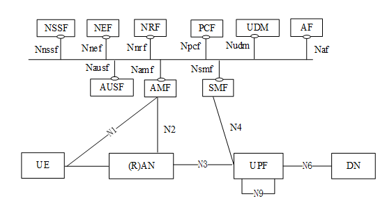
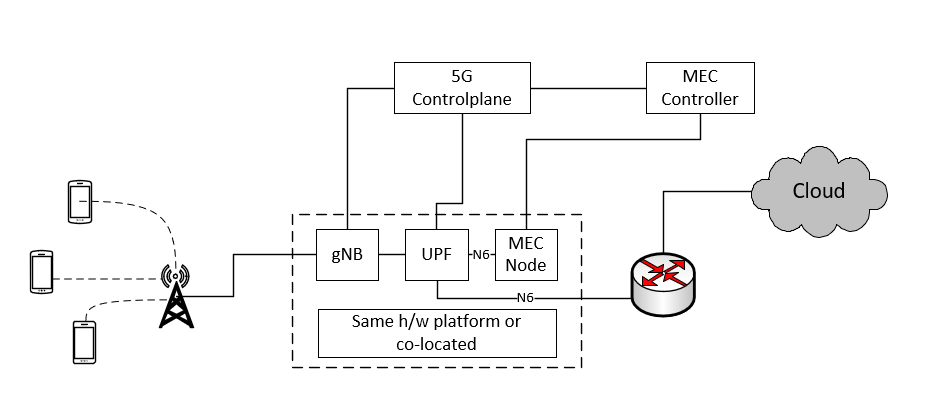
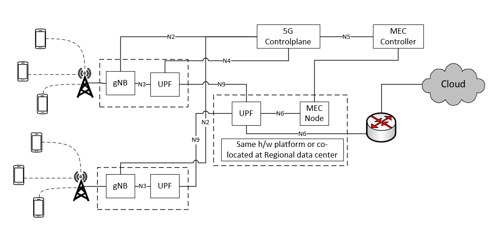
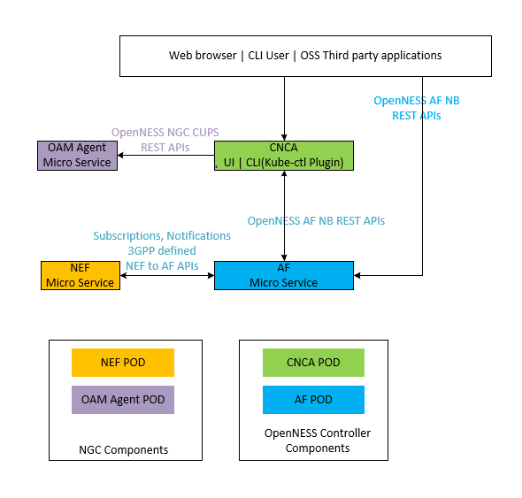
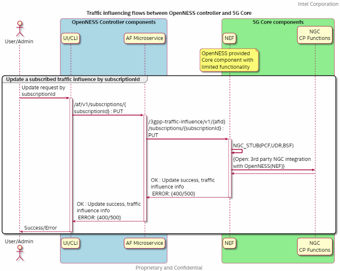
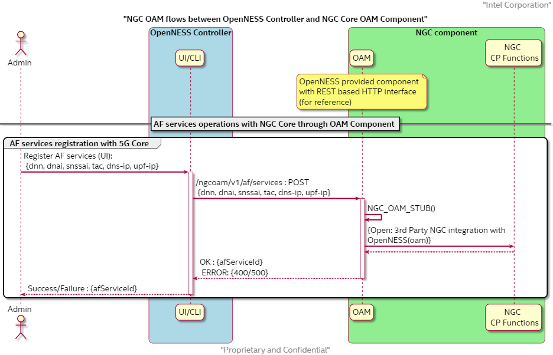
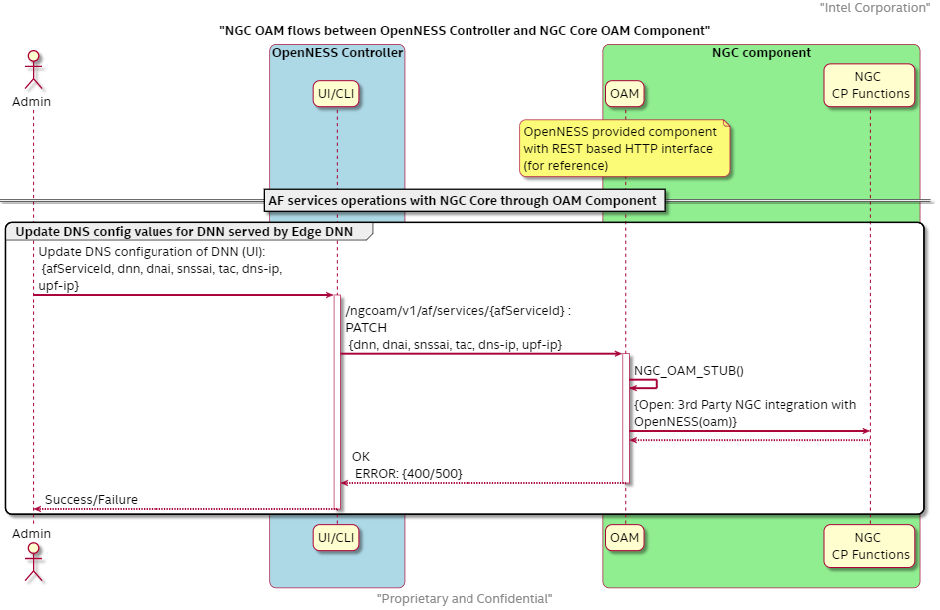
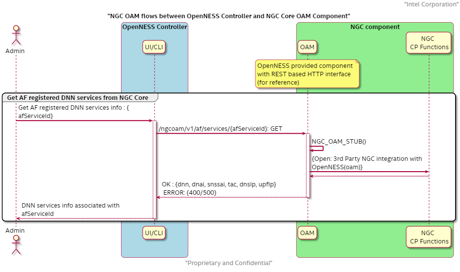
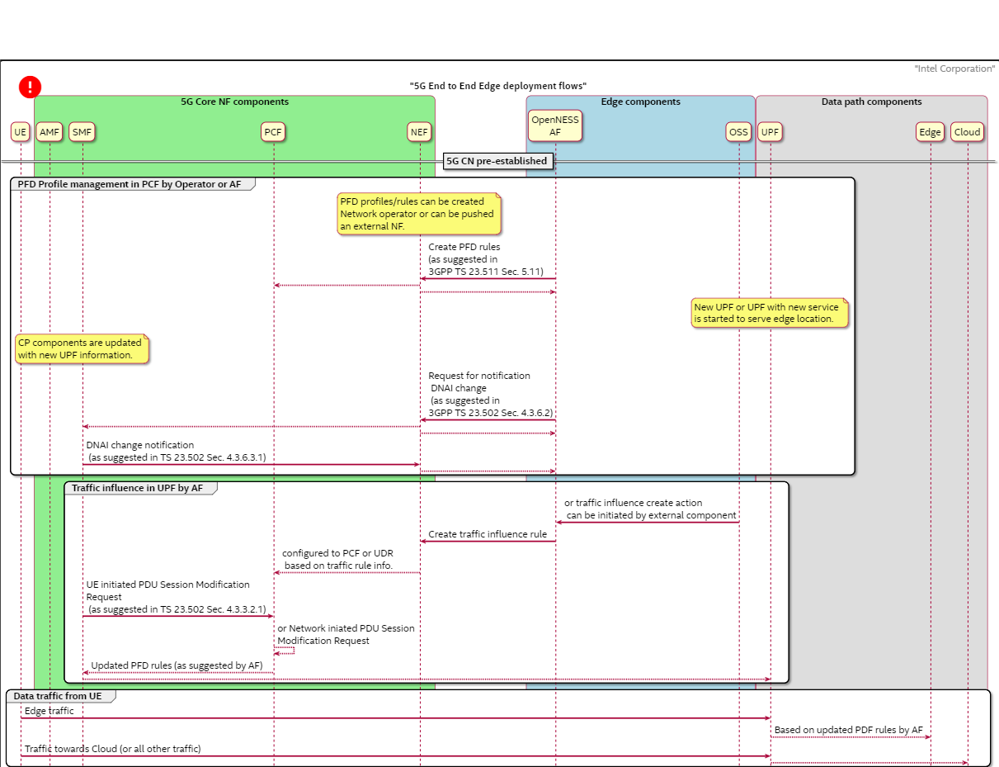
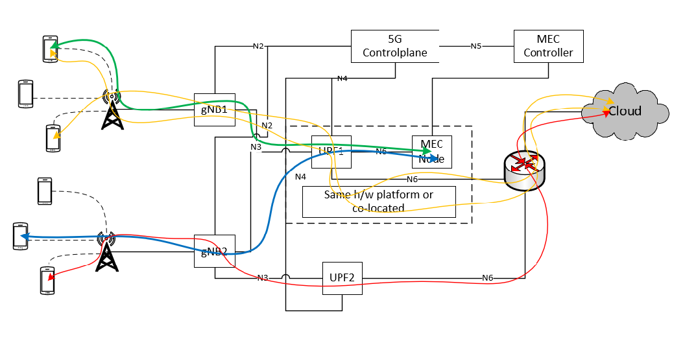

SPDX-License-Identifier: Apache-2.0     
Copyright © 2019 Intel Corporation

- [Introduction](#introduction)
- [5G Systems Architecture](#5g-systems-architecture)
  - [Edge 5G Architecture view](#edge-5g-architecture-view)
    - [Edge deployment scenarios in 5G](#edge-deployment-scenarios-in-5g)
    - [Application Traffic steering in 5G towards Edge](#application-traffic-steering-in-5g-towards-edge)
- [OpenNESS integration with 5G systems](#openness-integration-with-5g-systems)
  - [OpenNESS scope](#openness-scope)
  - [OpenNESS implementation](#openness-implementation)
  - [OpenNESS functional elements](#openness-functional-elements)
    - [Application Function](#application-function)
      - [Traffic steering NB APIs](#traffic-steering-nb-apis)
      - [AF supported Traffic steering API (South bound)](#af-supported-traffic-steering-api-south-bound)
      - [NGC notifications](#ngc-notifications)
    - [Network Exposure Function](#network-exposure-function)
    - [OAM Interface](#oam-interface)
      - [Edge service registration](#edge-service-registration)
    - [Core Network Configuration Agent](#core-network-configuration-agent)
  - [REST based API flows](#rest-based-api-flows)
    - [AF-NEF interface for traffic influence](#af-nef-interface-for-traffic-influence)
    - [OAM interface for edge service registration](#oam-interface-for-edge-service-registration)
      - [OAM API flows](#oam-api-flows)
  - [5G End to End flows for Edge by OpenNESS](#5g-end-to-end-flows-for-edge-by-openness)
  - [5G Edge Data paths supported by OpenNESS](#5g-edge-data-paths-supported-by-openness)
- [5G Core Network functionality for OpenNESS integration](#5g-core-network-functionality-for-openness-integration)
- [Summary](#summary)
  - [References](#references)
  - [List of abbreviations](#list-of-abbreviations)

# Introduction

The introduction of the Release 15 specification from 3GPP officially introduced Edge Computing. Edge Compute is highlighted as a key deployment mechanism for delivering services to end users by placing applications closer to the user. Network and Enterprise operators are trying to take advantage of this advancement to provide low latency, user centric and secure edge services. 

This white paper will focus on some of the key challenges for 5G Standalone (SA) mode edge deployments and will outline how OpenNESS helps to address them. The next version of this white paper will address 5G Non Standalone (NSA) mode.

Two of the key challenges in edge deployments are:

1. UPF selection for UEs
    - The 3GPP standards has multiple references for the UPF selection  procedure, which provides flexibility for implementation. Therefore, choosing the right implementation is a key factor in edge-deployments. 
  
2. UE Traffic identification and steering within the UPF towards edge nodes interfaces
    - The standard clearly outlines the REST based APIs for this purpose in 5G. 

OpenNESS provides reference REST based APIs along with 3GPP standard traffic influencing APIs (using the Application Function) to address some of these major challenges in 5G edge deployments.

# 5G Systems Architecture

The 5G system architecture specified by the 3GPP standard [3GPP_23501] has been designed to address various use cases ranging from serving simple IoT devices to critical services where there is a need for high bit-rate and reliability.  Although the 5G systems architecture includes enhancements to every component in end-to-end connectivity, this document will focus on reviewing some of the main features in Core networking components; for additional details please refer to the latest 3GPP standards.

The picture below depicts the 3GPP 5G Core networking components connected to each other in Service Based Interface (SBI) architecture.

3GPP TS 23.501 Rel15.3 Sec 4.2.3 : 5G System Architecture

## Edge 5G Architecture view

As discussed in the ETSI White paper "MEC in 5G Networks" [ETSI_2018a], a new set of functional enablers introduced in 5G are essential for Edge deployments, below are a few to highlight in the context of this document :

* Multiple Local Data Networks connected to the UPF and traffic steering of selected data traffic for a PDU session towards a local data network interface in UPF are key enablers of 5g edge deployments.

* Influencing the traffic steering rules in the UPF through external components like OpenNESS/MEC Controllers using Application Function (AF) provides another level of flexibility for on-demand application deployments on edge nodes as described in 3GPP TS 23.501-f30 Sec. 5.6.7.

* Session and Service Connectivity (SSC) and Local Area Data Networks (LADN) play an important role in edge deployments.

### Edge deployment scenarios in 5G

The following section outlines the various deployment scenarios in 5G:

1. The edge node hosts the edge-applications and is co-located with Base Station and UPF:

2. The edge node hosts the edge-applications and is co-located with local UPF:

3. The edge node hosts the edge-applications and is co-located at Regional-Office:

There may be other edge deployment scenarios in addition to those highlighted above, however, they are not the focus of this document. 

In all of the above scenarios, the UPF will have a dedicated N6 interface associated with each edge node hosting multiple applications.  In some cases, the UPF may have multiple logical N6 interfaces (one for each application) associated with the edge node.

### Application Traffic steering in 5G towards Edge

Traffic steering in the context of edge refers to routing the UE (or end user) application's traffic towards applications deployed at the Edge location. The UPF provides the data plane functionality in 5G networks, **_assignment of proper UPF to UE_** and within the UPF **_identification of particular application traffic and route towards proper N6 interface to reach to application deployed locally_**  are the two critical steps to be taken care for a successful edge deployments.

The 3GPP standard provides multiple references for implementing selection of UPF for UE, providing flexibility in the implementation. Edge deployments will be more meaningful when the UPF and Edge node platforms (physical compute resources) are co-located and are deployed per location. 

The standard also defines a set of procedures in the Application Function(AF) to influence the traffic routing in the UPF as well as the selection of UPF in order to reach UE traffic on the local data network [3GPP TS 23.501-f30 Sec. 5.6.7].

# OpenNESS integration with 5G systems

OpenNESS as a reference software solution kit, will address some of the key challenges in the 5G edge deployment scenarios referred to above through the Application Function (AF) micro service and REST based APIs. This document will focus on explaining these components in OpenNESS, how they interact with each other, the supported REST based API endpoints to interact with the 5G NGC solution, the APIs for the end-users to integrate with orchestration and/or solutions.

## OpenNESS scope

In the context of 5G edge deployments, OpenNESS interacts with the 5G NGC through the AF Network Function micro service as defined in 3GPP standard SBI interface. In addition to that, OpenNESS also suggests a reference REST based API end point (OAM interface) to configure the 5G Control Plane elements with the information about UPF deployed at the edge nodes. In most cases, 5G NGC solutions may have this configuration path implemented. In the scope of OpenNESS integration with the 5G Core, the OAM interface is a point of discussion based on 5G core existing interface.  

## OpenNESS implementation

The key challenges for Edge deployments in 5G networks have been outlined in the previous sections, OpenNESS tries to addresses them in compliance with the standards by:

1. UPF selection:
    - For the deployment scenarios #1 and #2 where the serving UPF and edge node are co-located with the RAN, proper UPF selection for UE is critical. If the 5G Core considers UE location and requesting DNN (i.e. TAC, DNN, DNAI, SNSSAI, SSC) as well in UPF selection would make the Edge deployment more efficient.  To enable this capability, OpenNESS suggest an OAM REST based API interface to inform the 5G core about the UPF info (upf-ip, tac, dnn, dnai, snssai, dns-ip) co-located with edge node.
  
    - In the case of an edge node deployed at regional centers (#3), selection of the serving UPF is taken care by 5G Core (SMF), however, UE application traffic needs to be steered from the serving UPF to the UPF co-located at the edge node through N9 interface.  In order to achieve this, traffic influencing rules need to be pushed in both UPFs to identify proper N9 and N6 interfaces for the data traffic to reach applications deployed on edge node.

2. Traffic steering:

    The 5G standard exposes multiple REST based APIs to define through Network Exposure Function [3GPP TS 23.502-f30 Sec. 5.2.6] for AF to configure: the traffic flow rules to identify the application traffic, ie. Packet Flow Descriptor (PFD) operations create/modify/delete and traffic influencing subscription APIs for steering application traffic towards edge node N6 interface and more.  OpenNESS supported AF functionality will support these APIs to influence the 5G core in multiple phases, starting with traffic influencing subscription in OpenNESS Rel 19.12.

3. DNS service:

    For UE traffic to reach to applications deployed at the edge, the DNS plays a major role.  Resolving the DNS entry for applications running on Edge is always a topic for discussion with multiple options available and choice is always influenced by required deployment scenario. 

    Two immediate options are (1) Using the DNS server maintained by Network operator (2) Using the DNS services provided by OpenNESS edge node :
    1. DNS server provided by the network operator:
        - Pros: Central DNS server for multiple edge nodes hosting applications, one-stop-shop.
        - Cons: Challenging to keep the DNS records database up to date with the dynamic nature of application deployment at edge nodes.

    2. DNS server provided by the OpenNESS edge node:
        - Pros: Maintains DNS records up to date for applications deployed dynamically, supports DNS forwarding functionality for unresolved DNS queries. Ideal solution for single edge node deployment scenarios.
        - Cons: if a single UPF connects to multiple edge nodes, then some sort of daisy chaining of the DNS server configuration within edge nodes is needed. Assigning an Edge Node DNS server IP to UEs is also a challenge in some implementations.  Through the OAM reference APIs, OpenNESS suggests a path to configure the edge DNS server (associated with UPF) to the 5G core but may not be able to address all scenarios.

4. UE mobility:

   How to support UE mobility in Edge scenarios is always a curious question lingering in implementers minds since 4G/LTE timelines.  Having said that, the 3GPP 5G standard has addressed it during the functional requirements stage and continuous enhancements have been made in defining the spec with enhanced Notification procedures and defining Session and Service Continuity modes (SSC mode) etc. to leave enough opportunity for solution developers to achieve mobility.  However, mobility in edge applications requires support in the end to end path, i.e.:
    - The 5G core has to notify the UE mobility events towards MEC platforms.
    - The MEC platforms should have the capability to register for notifications and act accordingly to re-configure the traffic influence subscription rules towards new UPF, if applicable.
    - Application servers running on the Edge node should also be capable of application context transfer from one edge node to another running similar application instances.
    - UE applications should also be aware and honor the application context switch when they are assigned to a new UPF during mobility.
  
  Leaving technical challenges aside, as Edge services are more tied to location based and visualization of mobility might not be applicable in all edge deployment scenarios.

## OpenNESS functional elements

Below are list of functional elements provided through the OpenNESS solution to address the key 5G integration challenges.  

Below pictures shows the Micro service architectural view of OpenNESS solution with 5G integration components:

### Application Function

An Application Function (AF) is a micro service in the OpenNESS edge controller solution, developed in golang.  In the scope of the current release (OpenNESS 19.12), AF supports the Traffic influencing subscription functionality to help in steering the Edge specific traffic in UPF towards the applications deployed on the OpenNESS edge node.

Other AF functionalities as discussed in 3GPP 5G standard [3GPP_29122], PFD Management Section 4.4.10, Changing chargeable party Section 4.4.4, configuration QoS for AF sessions Section 4.4.13, Monitoring Section 4.4.2, Device triggering Section 4.4.6 and resource management of Background Data Transfer (BDT) Section 4.4.3 are in under consideration for implementation in future OpenNESS releases.

The OpenNESS AF micro service provides a northbound (NB) REST based API interface for other micro services which provide a user interface (i.e. CNCA/UI or CLI) and also these NB API can be invoked from external services which provides infrastructure for automation and/or orchestration.

#### Traffic steering NB APIs

* API End point: _/af/v1/subscriptions_
* Supported methods: POST,PUT,PATCH,GET,DELETE
* Request/Response body: _5G AF North Bound APIs schema at openness.org_

#### AF supported Traffic steering API (South bound)

* API End point: _/3gpp-traffic-influence/v1/{afId}/subscriptions_
* Supported methods:  POST,PUT,PATCH,GET,DELETE
* Request/Response body: _5G NEF North Bound APIs schema at openness.org_

#### NGC notifications

As part of the traffic subscription API exchange, SMF generated notifications related to DNAI change can be forwarded to AF through NEF. NEF Reference implementation has place holders to integrate with 5G Core control plane.

### Network Exposure Function

According to 3GPP 5G System Architecture [3GPP TS 23.501-f30], NEF is a functional component in 5G Core network.  However, the reason for including NEF as micro service in OpenNESS solution is two fold.

* For validation of AF functionality in OpenNESS before start integration with the 5G Core.  This could enable the OpenNESS partners to validate their interfaces well before integrating with their 5G Core partner.  Hence, NEF micro service scope in OpenNESS is limited and inline with the AF functional scope.

* Trivial, but still may be helpful for 5G Core partners who are looking for NEF service to add to their solution for OpenNESS integration.

In the OpenNESS provided NEF reference implementation for Traffic influence is as per 3GPP TS 23.502 Section 5.2.6. Supported API endpoints, Nnef_TrafficInfluence {CREATE,UPDATE,DELETE}, are terminated and looped back at NEF itself, which allows partner the flexibility to integrate and validate without a Core solution.

### OAM Interface

OAM agent functionality is another component which should be part of 5G Core solution to add/update certain configuration information which is outside the scope of standards. For example, Configuration of UPF parameters like, UPF IP address, DNS configuration, DNNs supported.  In the case of edge deployments, when the UPF is deployed as an NFV service on the edge node platform, MEC controllers may need to update the 5G Core control-plane components about the edge associated user-planes.  5G solutions may have some sort of interface to address this requirement, however, to provide an unified interface for integrated solutions, OpenNESS suggests a REST based OAM interface APIs to configure certain UPF related parameters.  Use of the OAM agent is optional and can be replaced with an OAM interface of the 5G Core solution if any exists.  

#### Edge service registration

* OpenNESS suggested OAM API endpoint: _/ngcoam/v1/af/services_
* Supported methods: POST, GET, PUT, DELETE

**NOTE1:**  As the OAM agent is a component in 5G Core, and may need to interact with multiple AF instances (i.e. the OpenNESS edge controllers), in that case the above API endpoint may need enhancements to incorporate afId to distinguish between AFs.  Updated API endpoint could be _/ngcoam/v2/af/{afId}/services_, which is an interest for OpenNESS in future enhancements as need basis.

**NOTE2:** Registration of AF instance (OpenNESS controller) with 5G Core network could also be a topic for discussion during implementation.   One could choose the 3GPP suggested method using NRF functionality, or the existing OAM functionality can be extended with an additional API (for example _/ngcoam/v2/af/register_)  to register and obtain afId from 5G Core.  

### Core Network Configuration Agent

Core Network Configuration Agent (CNCA) is a micro service that provides an interface for end users of OpenNESS controller to interact with 5G Core network solution.  CNCA provides a web based UI and CLI (kube-ctl plugin) interface to interact with the AF and OAM services.

## REST based API flows

The flow diagrams below depict the scenarios for the traffic influence subscription operations from an end user of OpenNESS controller towards 5G core.

### AF-NEF interface for traffic influence

* Addition of traffic influencing rules subscription through AF

* Update of traffic influencing rules subscription through AF

* Get traffic influencing rules subscription through AF

* Deletion of traffic influencing rules subscription through AF

### OAM interface for edge service registration

#### OAM API flows

As discussed above, the need for configuring the 5G Control plane components with the information about UPF DNN information related to the edge.  The flow diagrams below depict the API flow between various components to passdown the information towards 5G control plane. 
Detailed information about the OAM reference API endpoints can be found at 5G OAM API Schema in the documentation page at OpenNESS.org.

* Addition of UPF services info about Edge to 5G Control Plane:

* Update of UPF services info about Edge to 5G Control Plane:

* Get/Read UPF services info about Edge from 5G Control Plane:

* Delete UPF services info about Edge from 5G Control Plane:

## 5G End to End flows for Edge by OpenNESS

The flow diagram below depicts a possible end to end edge deployment scenario including the PFD management, traffic influencing and traffic routing in UPF towards Local DN.

* AF registration and PFD management
  * AF authenticates and registers with the 5G Core
  * AF registers for DNAI change notifications through the TrafficInfluence request API
  * When a new UPF is deployed in the 5G network or a new DN service is started on an existing UPF, SMF may generate a trigger to AF about the DNAI change notification.
  * PFD profiles can be created based on the trigger in PCF by AF or the 5G Network operator can create PFD profiles.

* Traffic influence in UPF by AF
  * Traffic influence requests can be sent by AF towards the PCF (via NEF) for PFD profiles created in PCF. The action of a traffic influence request created in AF can be triggered by an external applications like OSS or a DNAI change notification events from the NEF or Device triggering events from NEF.
  * Traffic influence requests will be consumed by PCF or UDR based on the requested information.
  * UE may initiate the PDU Session Modification procedure towards SMF, because of the location change event. Or the PCF may initiate a Network initiated PDU Session Modification request procedure towards SMF because of a traffic influence request generated by AF. 
  * SMF may push this updated PFD profiles to UPF
  
* Data path from UE
  * Edge traffic sent by the UE reaches the UPF, the UPF routes the edge-traffic towards the local DN where the OpenNESS Edge Node is configured. 
  * All other traffic sent by the UE that reaches the UPF will be sent to another UPF or to a remote gateway.

## 5G Edge Data paths supported by OpenNESS

The below picture shows multiple data paths that are supported in OpenNESS integrated edge deployment scenarios.

Each data path/scenario is represented by a colored line, which is described below.

All the UEs attached from Base Station gNB1 are assigned to UPF1 based on location (TAC) configuration. UEs that are attached from gNB2 are assigned to UPF1 or UPF2 based on TAC, DNN configuration while assigning UPF.

**Green Colored data-path :**  UE application traffic that reaches UPF1 is routed to OpenNESS edge node through N6 interface.  Traffic is served by applications deployed at the Edge node.

**Orange colored data-path :** UE application traffic that reaches UPF1, but non-edge traffic will be routed towards cloud through another N6 interface.

**Blue colored data-path :** UE attached to a Base Station (gNB2), but assigned to UPF1. UE application traffic that reaches UPF1 is routed towards edge node through N6 interface.

**Red colored data-path :** UE attached to a gNB2, but assigned to UPF2. UE application traffic reaches UPF2 is routed towards cloud through it's N6 interface.

**NOTE** All the above mentioned data paths also applicable to other two deployment scenarios described in the section [Edge deployment scenarios in 5G](#edge-deployment-scenarios-in-5g).

# 5G Core Network functionality for OpenNESS integration

The following is the minimum functionality required to support the integration of the OpenNESS integrated MEC solution with a 5G Core network based on the required deployment scenarios:

* Control and Configuration in UPF selection functionality,  required in case of location based edge node deployments with associated 5G user-plane.

* Interface for dynamic configuration of user-plane deployed or deleted from edge nodes. Referred to as the OAM interface in this document. 

* Network Exposure Function (NEF), with minimal functionality to support Traffic influence subscription operations through Application Function (AF)

# Summary

This white paper highlights the Edge computing enhancements made in the 3GPP 5G standards along with the key implementation challenges. The document provides a description of the OpenNESS view of integration for Edge controllers with the 5G Core Network as well as the API end points and end to end flows required in edge deployments. The OpenNESS reference implementation was validated with a modified 5G Core in SA mode to support the APIs for edge deployments (per 3GPP 5G Standard) and the 5G UPF with multiple N6 interfaces with the edge node connected towards local DNN interface.

Along with discussing the supported features in OpenNESS for 5G integration also outlined are the areas of interest for future enhancements. 

## References

-	[ETSI_MEC003]ETSI GS MEC 003 V1.1.1, “Mobile Edge Computing (MEC); Framework and Reference Architecture” (2016-03)
-	[ETSI_2018]ETSI White Paper #24, "MEC Deployments in 4G and Evolution Towards 5G", First Edition, February 2018, https://www.etsi.org/images/files/ETSIWhitePapers/etsi_wp24_MEC_deployment_in_4G_5G_FINAL.pdf.
-	[ETSI_2018a] ETSI White Paper #28, "MEC in 5G Networks", June 2018, https://www.etsi.org/images/files/ETSIWhitePapers/etsi_wp28_mec_in_5G_FINAL.pdf.
-	[3GPP_29244]TS 29.244 Interface between the Control Plane and the User Plane of EPC Nodes.
-	[3GPP_23501]3GPP TS 23.501 V15.3.0, “3rd Generation Partnership Project; Technical Specification Group Services and System Aspects; System Architecture for the 5G System; Stage 2 (Release 15)”
- [3GPP_23502]3GPP TS 23.502 v15.3.0, "Procedures for 5G Systems; Stage2 (Release 15)"
- [3GPP_29122]: 3GPP TS 29.122 V15.3.0, "T8 reference point of Northbound APIs (Release 15)"
- [3GPP_29512]3GPP TS 29.512 V15.3.0, "5G System; Session Management Policy Control Service; Stage3; (Release 15)"
- [3GPP_29522]3GPP TS 29.522 V15.3.0, "5G System; Network Exposure Function Northbound APIs; Stage 3; (Release 15)"
-	[3GPP_CUPS]"Control and User Plane Separation of EPC Nodes (CUPS)", https://www.3gpp.org/cups 
- [OpenNESS_2019]"OpenNESS Architecture and Solution", white paper, 2019.

## List of abbreviations

- 3GPP: Third Generation Partnership Project
- 5GC: 5G Core Network
- CUPS: Control and User Plane Separation of EPC Nodes
- NEF: Network Exposure Function
- AF: Application Function
- AMF: Access and Mobility Management Function
- CP: Control Plane
- DN: Data Network
- DNN: Data Network Name
- DNAI: DN Access Identifier
- LADN: Local Area Data Network
- APN: Access Point Name
- TAC: Tracking Area Code
- SUPI: Subscriber Permanent Identifier
- RAN: Radio Access Network
- S-NSSAI: Single Network Slice Selection Assistance Information
- SSC: Session and Service Continuity
- UL CL: Uplink Classifier
- UPF: User Plane Function
- UDM : Unified Data Management
- NRF: Network Repository Function
- PFD: Packet Flow Description
- UE: User Equipment (in the context of LTE)
- MCC: Mobile Country Code
- MME: Mobility Management Entity
- MNC: Mobile Network Code
- API: Application Programming Interface
- ETSI: European Telecommunications Standards Institute
- FQDN: Fully Qualified Domain Name
- HTTP: Hyper Text Transfer Protocol
- JSON:	JavaScript Object Notation
- MEC: Multi-Access Edge Computing
- OpenNESS: Open Network Edge Services Software
- LTE: Long-Term Evolution
- OAM: Operations, Administration and Maintenance
- PDN: Packet Data Network
- DNS: Domain Name Service 
- REST: Representational State Transfer
- CNCA: Core Network Configuration Agent
- UI: User Interface
- CLI: Command Line Interface