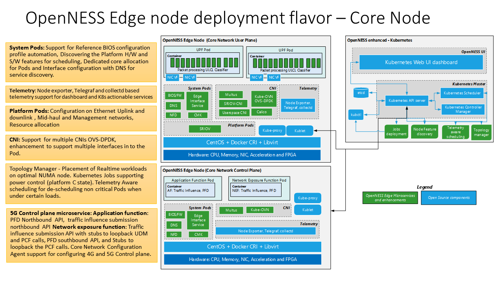

```text
SPDX-License-Identifier: Apache-2.0
Copyright (c) 2020 Intel Corporation
```
<!-- omit in toc -->
# User Plane Function (UPF)
- [Introduction](#introduction)
- [How to build](#how-to-build)
- [UPF configure](#upf-configure)
  - [Platform specific information](#platform-specific-information)
  - [UPF application specific information](#upf-application-specific-information)
- [How to start](#how-to-start)
  - [Deploy UPF POD from OpenNESS controller](#deploy-upf-pod-from-openness-controller)
  - [To start UPF](#to-start-upf)
  - [Uninstall UPF POD from OpenNESS controller](#uninstall-upf-pod-from-openness-controller)

# Introduction

The User Plane Function (UPF) is the evolution of the Control and User Plane Separation (CUPS) which part of the Rel.14 in Evolved Packet core (EPC). CUPS enabled PGW to be split in to PGW-C and PGW-U. By doing this PGW-U can be distributed and could be used for Edge Cloud deployment. 

Defined in 3GPP technical specification 23.501, the UPF provides:

-	Anchor point for Intra-/Inter-RAT mobility (when applicable).
-	External PDU Session point of interconnect to Data Network.
-	Packet routing & forwarding (e.g. support of Uplink classifier to route traffic flows to an instance of a data network, support of Branching point to support multi-homed PDU Session).
-	Packet inspection (e.g. Application detection based on service data flow template and the optional PFDs received from the SMF in addition).
-	User Plane part of policy rule enforcement, e.g. Gating, Redirection, Traffic steering).
-	Lawful intercept (UP collection).
-	Traffic usage reporting.
-	QoS handling for user plane, e.g. UL/DL rate enforcement, Reflective QoS marking in DL.
-	Uplink Traffic verification (SDF to QoS Flow mapping).
-	Transport level packet marking in the uplink and downlink.
-	Downlink packet buffering and downlink data notification triggering.
-	Sending and forwarding of one or more "end marker" to the source NG-RAN node.
-	Functionality to respond to Address Resolution Protocol (ARP) requests and / or IPv6 Neighbor Solicitation requests based on local cache information for the Ethernet PDUs. The UPF responds to the ARP and / or the IPv6 Neighbor Solicitation Request by providing the MAC address corresponding to the IP address sent in the request.

As part of the end-to-end integration of the Edge cloud deployment using OpenNESS a reference 5G Core network is used along with reference RAN (FlexRAN). The diagram below shows UPF and NGC Control plane deployed on the OpenNESS platform with the necessary microservice and Kubernetes enhancements required for high throughput user plane workload deployment.



> Note: UPF source or binary is not released as part of the OpenNESS.

This document aims to provide the steps involved in deploying UPF on the OpenNESS platform. 4G/LTE or 5G User Plane Functions (UPF) can run as network functions on Edge node in a virtualized environment.  The reference [Dockerfile](https://github.com/otcshare/edgeapps/blob/master/network-functions/core-network/5G/UPF/Dockerfile) and [5g-upf.yaml](https://github.com/otcshare/edgeapps/blob/master/network-functions/core-network/5G/UPF/5g-upf.yaml) provide refrence on how to deploy UPF as a Container Networking function (CNF) in a K8s pod on OpenNESS edge node using OpenNESS Enhanced Platform Awareness (EPA) features.

These scripts are validated through a reference UPF solution (implementation based Vector Packet Processing (VPP)), is not part of OpenNESS release.

> Note: AF and NEF dockerfile and pod specification can be found here
> - AF - [dockerfile](https://github.com/otcshare/epcforedge/blob/master/ngc/build/networkedge/af/Dockerfile). [Pod Specification](https://github.com/otcshare/epcforedge/blob/master/ngc/scripts/networkedge/ngctest/podAF.yaml)
> - NEF - [dockerfile](https://github.com/otcshare/epcforedge/blob/master/ngc/build/networkedge/nef/Dockerfile). [Pod Specification](https://github.com/otcshare/epcforedge/blob/master/ngc/scripts/networkedge/ngctest/podNEF.yaml)
> - OAM - [dockerfile](https://github.com/otcshare/epcforedge/blob/master/ngc/build/networkedge/oam/Dockerfile). [Pod Specification](https://github.com/otcshare/epcforedge/blob/master/ngc/scripts/networkedge/ngctest/podOAM.yaml)

# How to build

1. To keep the build and deploy process simple for reference, docker build and image are stored on the Edge node itself.

```bash
ne-node# cd <5g-upf-binary-package>
```

2. Copy the docker files to the node and build the docker image. Reference docker files and helm-chart for deploying the upf is available at [edgeapps_upf_docker](https://github.com/otcshare/edgeapps/tree/master/network-functions/core-network/5G/UPF) and [edgeapps_upf_helmchart](https://github.com/otcshare/edgeapps/tree/master/network-functions/core-network/charts/upf) respectively

```bash
ne-node# ./build_image.sh

ne-node# docker image ls | grep upf
upf-cnf     1.0                 e0ce467c13d0        15 hours ago        490MB
```

# UPF configure

To keep the bring-up setup simple and to the point, UPF configuration can be provided through the helm-charts.A reference helm-chart is available at  [edgeapps_upf_helmchart](https://github.com/otcshare/edgeapps/tree/master/network-functions/core-network/charts/upf)

Below are the list of minimal configuration parameters that one can think of for a VPP based applications like UPF.

## Platform specific information

- SR-IOV PCIe interface(s) bus address
- CPU core dedicated for UPF workloads
- Amount of Huge pages

## UPF application specific information
- N3, N4, N6 and N9 Interface IP addresses

# How to start

1.Ensure all the EPA microservice and Enhancements (part of OpenNESS play book) are deployed `kubectl get po --all-namespaces`.
Make sure that **multus**, **sriov-cni** and **sriov-device-plugin** pods are alive on controller and the node. Additionally on the node the **interface service** pod should be alive.

```bash
  ne-controller# kubectl get po --all-namespaces

  NAMESPACE     NAME                                      READY   STATUS    RESTARTS   AGE
  kube-ovn      kube-ovn-cni-8x5hc                        1/1     Running   17         7d19h
  kube-ovn      kube-ovn-cni-p6v6s                        1/1     Running   1          7d19h
  kube-ovn      kube-ovn-controller-578786b499-28lvh      1/1     Running   1          7d19h
  kube-ovn      kube-ovn-controller-578786b499-d8d2t      1/1     Running   3          5d19h
  kube-ovn      ovn-central-5f456db89f-l2gps              1/1     Running   0          7d19h
  kube-ovn      ovs-ovn-56c4c                             1/1     Running   17         7d19h
  kube-ovn      ovs-ovn-fm279                             1/1     Running   5          7d19h
  kube-system   coredns-6955765f44-2lqm7                  1/1     Running   0          7d19h
  kube-system   coredns-6955765f44-bpk8q                  1/1     Running   0          7d19h
  kube-system   etcd-silpixa00394960                      1/1     Running   0          7d19h
  kube-system   kube-apiserver-silpixa00394960            1/1     Running   0          7d19h
  kube-system   kube-controller-manager-silpixa00394960   1/1     Running   0          7d19h
  kube-system   kube-multus-ds-amd64-bpq6s                1/1     Running   17         7d18h
  kube-system   kube-multus-ds-amd64-jf8ft                1/1     Running   0          7d19h
  kube-system   kube-proxy-2rh9c                          1/1     Running   0          7d19h
  kube-system   kube-proxy-7jvqg                          1/1     Running   17         7d19h
  kube-system   kube-scheduler-silpixa00394960            1/1     Running   0          7d19h
  kube-system   kube-sriov-cni-ds-amd64-crn2h             1/1     Running   17         7d19h
  kube-system   kube-sriov-cni-ds-amd64-j4jnt             1/1     Running   0          7d19h
  kube-system   kube-sriov-device-plugin-amd64-vtghv      1/1     Running   0          7d19h
  kube-system   kube-sriov-device-plugin-amd64-w4px7      1/1     Running   0          4d21h
  openness      eaa-78b89b4757-7phb8                      1/1     Running   3          5d19h
  openness      edgedns-mdvds                             1/1     Running   16         7d18h
  openness      interfaceservice-tkn6s                    1/1     Running   16         7d18h
  openness      nfd-master-82dhc                          1/1     Running   0          7d19h
  openness      nfd-worker-h4jlt                          1/1     Running   37         7d19h
  openness      syslog-master-894hs                       1/1     Running   0          7d19h
  openness      syslog-ng-n7zfm                           1/1     Running   16         7d19h
  ```

2.Make sure that the VF to the mentioned interface on node host is created. You should see a new interface type “Ethernet Virtual Function“. In the below example for the configuration where 2 VF's(Virtual Functions Interfaces) have been requested for 1 PF (Physical functional interface), the output shows for the PF "af:00.0" the corresponding two VF's are "af:0a.0" and "af:0a.1"

```bash
ne-node# lspci | grep Eth
af:00.0 Ethernet controller: Intel Corporation Ethernet Controller X710 for 10GbE SFP+ (rev 02)
af:00.1 Ethernet controller: Intel Corporation Ethernet Controller X710 for 10GbE SFP+ (rev 02)
af:0a.0 Ethernet controller: Intel Corporation Ethernet Virtual Function 700 Series (rev 02)
af:0a.1 Ethernet controller: Intel Corporation Ethernet Virtual Function 700 Series (rev 02)
```

3.Enable the vfio-pci/igb-uio driver on the node. The below example shows enabling of the igb_uio driver

```bash
ne-node# /opt/dpdk-18.11.6/usertools/dpdk-devbind.py -b igb_uio 0000:af:0a.0

ne-node# /opt/dpdk-18.11.6/usertools/dpdk-devbind.py --status
Network devices using DPDK-compatible driver
============================================
0000:af:0a.0 'Ethernet Virtual Function 700 Series 154c' drv=igb_uio unused=i40evf,vfio-pci

Network devices using kernel driver
===================================
0000:af:00.0 'Ethernet Controller X710 for 10GbE SFP+ 1572' if=enp175s0f0 drv=i40e unused=igb_uio,vfio-pci
0000:af:0a.1 'Ethernet Virtual Function 700 Series 154c' if=enp175s10f1 drv=i40evf unused=igb_uio,vfio-pci
```

4.Check the configmaps has the resource name as intel_sriov_dpdk along with the devices and drivers. In example below the devices **154c** and the driver **igb_uio** are part of the configmaps. If the device and driver are not present in the configmap they need to be added.

```bash
ne-controller# kubectl get configmaps -n kube-system | grep sriov
sriov-release-sriovdp-config         1      55m

ne-controller# kubectl describe configmap sriov-release-sriovdp-config -n kube-system
Name:         sriov-release-sriovdp-config
Namespace:    kube-system
Labels:       <none>
Annotations:  <none>

Data
====
config.json:
----
{
    "resourceList": [{
            "resourceName": "intel_sriov_netdevice",
            "selectors": {
                "vendors": ["8086"],
                "devices": ["154c", "10ed"],
                "drivers": ["iavf", "i40evf", "ixgbevf"]
            }
        },
        {
            "resourceName": "intel_sriov_dpdk",
            "selectors": {
                "vendors": ["8086"],
                "devices": ["154c", "10ed"],
                "drivers": ["igb_uio"]
            }
        }
    ]
}

Events:  <none>
```

5.Check and change the network attachment from sriov_netdevice to sriov_dpdk

```bash
ne-controller# kubectl get network-attachment-definitions
  NAME             AGE
  sriov-openness   59m

ne-controller# kubectl describe network-attachment-definitions sriov-openness
  Name:         sriov-openness
  Namespace:    default
  Labels:       <none>
  Annotations:  k8s.v1.cni.cncf.io/resourceName: intel.com/intel_sriov_netdevice
  API Version:  k8s.cni.cncf.io/v1
  Kind:         NetworkAttachmentDefinition
  Metadata:
    Creation Timestamp:  2020-06-10T02:45:03Z
    Generation:          1
    Resource Version:    2182
    Self Link:           /apis/k8s.cni.cncf.io/v1/namespaces/default/network-attachment-definitions/sriov-openness
    UID:                 6c019ef1-b8d3-43ea-b5f9-3355a6198e53
  Spec:
    Config:  { "type": "sriov", "cniVersion": "0.3.1", "name": "sriov-openness-network", "ipam": { "type": "host-local", "subnet": "192.168.2.0/24", "routes": [{ "dst": "0.0.0.0/0" }], "gateway": "192.168.2.1" } }
  Events:    <none>

ne-controller# kubectl get node ne-node -o json | jq '.status.allocatable' | grep sriov
  "intel.com/intel_sriov_netdevice": "2",

ne-controller# kubectl delete network-attachment-definitions sriov-openness

ne-controller# cat <<EOF | kubectl create -f -
  apiVersion: "k8s.cni.cncf.io/v1"
  kind: NetworkAttachmentDefinition
  metadata:
    name: sriov-openness
    annotations:
      k8s.v1.cni.cncf.io/resourceName: intel.com/intel_sriov_dpdk
  spec:
    config: '{
    "type": "sriov",
    "cniVersion": "0.3.1",
    "name": "sriov-openness-network",
    "ipam": {
      "type": "host-local",
      "subnet": "192.168.2.0/24",
      "routes": [{
        "dst": "0.0.0.0/0"
      }],
      "gateway": "192.168.2.1"
    }
  }'
  EOF

ne-controller# kubectl describe network-attachment-definitions sriov-openness
  Name:         sriov-openness
  Namespace:    default
  Labels:       <none>
  Annotations:  k8s.v1.cni.cncf.io/resourceName: intel.com/intel_sriov_dpdk
  API Version:  k8s.cni.cncf.io/v1
  Kind:         NetworkAttachmentDefinition
  Metadata:
    Creation Timestamp:  2020-06-10T03:52:58Z
    Generation:          1
    Resource Version:    21790
    Self Link:           /apis/k8s.cni.cncf.io/v1/namespaces/default/network-attachment-definitions/sriov-openness
    UID:                 959c3630-74c5-45b0-ab39-cd8dd7c87c5f
  Spec:
    Config:  { "type": "sriov", "cniVersion": "0.3.1", "name": "sriov-openness-network", "ipam": { "type": "host-local", "subnet": "192.168.2.0/24", "routes": [{ "dst": "0.0.0.0/0" }], "gateway": "192.168.2.1" } }
  Events:    <none>
```

6.Restart the pod sriov-device-plugin for modifications in configMap and network attachments to take effect. Delete the existing device-plugin pod of **ne-node** and it will restart automatically in about 20 seconds

```bash
ne-controller# kubectl delete pod -n kube-system <sriov-release-kube-sriov-device-plugin-xxx>
```

7.Check for the network attachment, you should see intel_sriov_dpdk with 1 allocated VF

```bash
ne-controller# kubectl get node ne-node -o json | jq '.status.allocatable' | grep sriov
  "intel.com/intel_sriov_dpdk": "1",
  "intel.com/intel_sriov_netdevice": "1",
```

## Deploy UPF POD from OpenNESS controller

In this reference validation, UPF will be deployed using helm charts. Reference helm chart for upf is available at [edgeapps_upf_helmchart](https://github.com/otcshare/edgeapps/tree/master/network-functions/core-network/charts/upf)

helm install \<pod-name\> \<path to the upf helm chart\> \<list of configuration values\>

Here's an example which configures the following information
- image.repository=upf-cnf  # image repository to upf-cnf i.e. local image on the node
- node.name=ne-node         # node on which the upf to be deployed
- node.path=/root/upf       # location on the node where the upf binary is available
- upf.vf_if_name=VirtualFunctionEthernetaf/a/0 # VF interface name
- hugePageSize=hugepages-1Gi # hugepage size
- hugePageAmount=4Gi        # Amount of hugepages to be reserved for the pod
- upf.pci_bus_addr=0000:af:0a.1  # full format of the PCI bus addr of the VF interface the UPF needs to be attached
- upf.uio_driver=igb_uio   # UIO driver used vfio-pci or igb_uio
- upf.main_core=2           # main core
- upf.worker_cores="3\,4"   # worker cores
- upf.pfcp_thread.cores=5   # core for the pfcp thread
- upf.pfcp_thread.count=2   # number of pfcp threads
- upf.n3_addr=192.179.120.170/24  # the N3 I/f ip address along with subnet info
- upf.n4_addr=192.179.120.180     # the N4 I/f ip address
- upf.n6_addr=192.168.1.180/24    # the N6 I/f ip address along with subnet info
- upf.n6_gw_addr=192.168.1.180    # the N6 gateway IP address

```bash
ne-controller# helm install upf-cnf ./upf/ --set image.repository=upf-cnf --set node.name=ne-node --set node.path=/root/upf --set upf.vf_if_name=VirtualFunctionEthernetaf/a/0 --set upf.pci_bus_addr=0000:af:0a.1 --set upf.uio_driver=igb_uio --set upf.huge_memory=6G --set upf.main_core=2 --set upf.worker_cores="3\,4" --set upf.pfcp_thread.cores=5 --set upf.pfcp_thread.count=2 --set upf.n3_addr=192.179.120.180/24  --set upf.n4_addr=192.179.120.180 --set upf.n6_addr=192.179.120.180/24 --set upf.n6_gw_addr=192.168.1.180 --set hugePageSize=hugepages-1Gi --set hugePageAmount=4Gi
```

## To start UPF
In this reference validation, UPF application will be started manually after UPF POD deployed successfully.

- Verify UPF pod is up and running `kubectl get po`
```bash
ne-controller# kubectl get po
NAME             READY   STATUS    RESTARTS   AGE
upf-cnf          1/1     Running   0          6d19h
```

- Exec into  UPF pod and start the UPF. 

Note: The command **groupadd vpp** needs to be given only for the first execution.
  
```bash
ne-controller# kubectl exec -it upf-cnf -- /bin/bash
upf-cnf# groupadd vpp
upf-cnf# ./run_upf.sh
```
## Uninstall UPF POD from OpenNESS controller

In this reference validation, UPF can be deleted/uninstalled using the upf helm chart

- Get the helm chart release name for the upf
  
```bash
ne-controller# helm list | grep upf
upf-cnf         default         1               2020-06-16 12:37:53.40562176 +0530 IST  deployed        upf-0.1.0               0.1.0
```

- Uninstall the upf-cnf helm chart
```bash
ne-controller# helm uninstall upf-cnf
release "upf-cnf" uninstalled
```

- List of pods should not show the upf pod now.
```bash
ne-controller# kubectl get po | grep upf
No resources found in default namespace.
```
