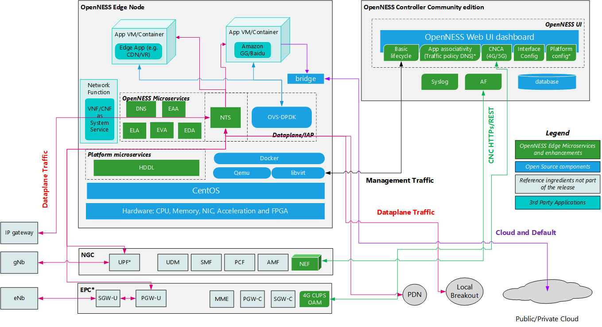

```text
SPDX-License-Identifier: Apache-2.0
Copyright (c) 2019 Intel Corporation
```

# InterApp Communication support in OpenNESS 

- [InterApp Communication support in OpenNESS](#interapp-communication-support-in-openness)
  - [Overview](#overview)
  - [InterApp Communication support in OpenNESS On-Premises Edge](#interapp-communication-support-in-openness-on-premises-edge)
    - [Setup](#setup)
  - [InterApp Communication support in OpenNESS Network Edge](#interapp-communication-support-in-openness-network-edge)

## Overview

Multi-core edge cloud platforms typically host multiple containers or virtual machines as PODs. These applications sometimes need to communicate with each other as part of a service or consuming services from another application instance. This means that an edge cloud platform should provide not just the Dataplane interface but also the infrastructure to enable applications communicate with each other whether they are on the same platform or spanning across multiple platform. OpenNESS provides the infrastructure for both the On-Premises and Network edge modes. 

> Note: InterApps Communication mentioned here are not just for applications but also applicable for Network functions like Core Network User plane, Base station and so on. 

## InterApp Communication support in OpenNESS On-Premises Edge 
InterApp communication on the OpenNESS On-Premises version is supported using OVS-DPDK as the infrastructure. 


 
 _Figure - OpenNESS On-Premises InterApp Interface_

The current version of OpenNESS On-Premises is mainly targeted at private LTE deployments. The Network Transport Services (NTS) Dataplane is used which supports Edge Cloud deployment on S1-U and IP (WiFi/Wireline/SGi). Because the Dataplane is separate to the InterApp interface there are at least three interfaces into the Application. 


 
 _Figure - OpenNESS On-Premises Application Interfaces_

Each container and VM running an Application will have an additional OVS-DPDK managed interface added. Additionally, the OVS-DPDK interface would be automatically added for every deployed app. OVS-DPDK will run as a host service.
In total three interfaces would be allocated:
- Default interface connected to a kernel bridge. This interface is used for management of the App and also communication to the cloud if the throughput requirement is low. 
- NTS interface for Dataplane traffic - Support S1-U and IP (WiFi/Wireline/SGi) upstream and downstream traffic 
- OVS-DPDK interface for inter-app communication. OVS will be used with DPDK and physical ports may be assigned to it(PMD drivers)

Ports assigned to OVS will be ignored by ELA, so it is not possible for them to be used by NTS. It should be possible to optionally install and configure OVS-DPDK using ansible automation scripts.

### Setup

To enable OVS-DPDK for inter app communication follow the steps below.

1. Enable `ovs` role in `openness-experience-kits/onprem_node.yml`
2. Set the `ovs_ports` variable in `host_vars/node-name-in-inventory.yml`. Example:

    ```
    ovs_ports: ["0000:02:00.1","0000:02:00.0"]
    ```
3. Setup the cluster using automation scripts

## InterApp Communication support in OpenNESS Network Edge 
InterApp communication on the OpenNESS Network edge version is supported using OVN/OVS as the infrastructure. OVN/OVS in the network edge is supported through the Kubernetes kube-OVN Container Network Interface (CNI).

OVN/OVS is used as default networking infrastructure for:
- Dataplane Interface: UE's to edge applications 
- InterApp Interface : Communication infrastructure for applications to communicate 
- Default Interface: Interface for managing the Application POD (e.g. ssh to application POD)
- Cloud/Internet Interface: Interface for Edge applications to communicate with the cloud/Internet  


 
 _Figure - OpenNESS Network Edge Interfaces_
