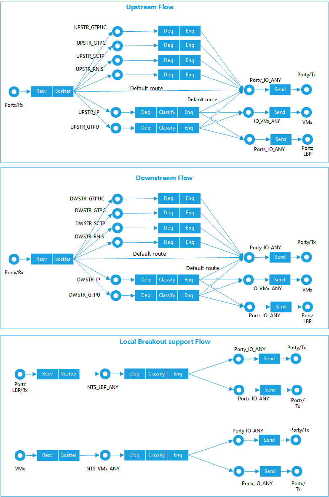

```text
SPDX-License-Identifier: Apache-2.0
Copyright (c) 2019 Intel Corporation
```

# Dataplane support for Edge Cloud between ENB and EPC (S1-U) Deployment

- [Dataplane support for Edge Cloud between ENB and EPC (S1-U) Deployment](#dataplane-support-for-edge-cloud-between-enb-and-epc-s1-u-deployment)
  - [Overview](#overview)
  - [Network Traffic Services](#network-traffic-services)

## Overview 

The ETSI MEC specification outlines the Edge Cloud can be deployed between the 4G base station (eNb) and Evolved Packet Core (EPC). Such deployments are sometimes used in private LTE deployments. This deployment was created specifically to address the needs of Private LTE and some low latency use cases. OpenNESS supports this deployment in the On-Premises version. Typically data between eNb and EPC is called S1. S1-U is user plane which is GTP-U traffic and is usually encrypted. Since private LTE controls the network, Private LTE operators have the ability to turn off encryption. 

## Network Traffic Services  

OpenNESS assumes that S1-U traffic is unencrypted. The control plane S1 traffic is S1-MME and is over the SCTP protocol. OpenNESS does not process or handle Control Plane S1-MME Traffic in this deployment. From an EPC perspective, the Edge Cloud platform looks like man-in-the middle. The following diagram shows the support of such deployment 


_Figure - OpenNESS Architecture_

The Network Transport Service (NTS) is a Dataplane component that provides a network traffic control service and a data forwarding service to mobile edge applications, specifically for S1-U deployments. NTS is helped by an IO thread. Both IO and NTS are poll mode threads implemented using DPDK. The following criteria should be considered by a user before using NTS as a Dataplane:
1. NTS as a Dataplane is only intended for a S1-U Deployment which is typically used in Private LTE based edge cloud deployments 
2. NTS supports processing IP only traffic but is limited and does not implement ARP or gateway functionality 
3. NTS supports basic fragmentation and reassembly to help deployment of legacy IP cameras.  
4. It is assumed that the private LTE operator has complete control of the UE, eNb and EPC. This is because NTS uses a learning mechanism to understand the upstream and downstream traffic. 

NTS Dataplane has following features and behavior: 
- Runs on every Edge Node. It is implemented in the C language using DPDK for high performance IO. 
- This is the recommended Dataplane when incoming and outgoing flows is a mix of pure IP + S1-U (GTPu). 
- Provides a reference ACL based Application specific packet tuple filtering 
- Provides a reference GTPu base packet learning for S1 deployments 
- Provides a reference Simultaneous IP and S1 deployment 
- Provides a reference API for REST/grpc to C API 
- Future enhancement of UE based traffic steering for authentication
- Reference implementation which does not depend on EPC implementation 
- Reference Packet forwarding decision independent of IO
- Implements KNI based interface to Edge applications running as Containers/POD 
- Implements DPDK vHost user based interface to Edge applications running as a Virtual Machine 
- Implements Scatter and Gather in upstream and downstream 
- Dedicated interface created for Dataplane based on vhost-user for VM, dpdk-kni for Containers
- A Container or VM default Interface can be used for Inter-App, management and Internet access from an application 
- Dedicated OVS-DPDK interface for inter-apps communication can be created in case of On-Premises deployment. 
- When the NTS receives traffic from the UE and there is no application on the Edge cloud then that traffic is sent to the EPC (hence man-in-the-middle deployment). 

The NTS thread continuously polls its ingress rings and for every ring it calls the dequeue() method to dequeue any enqueued packet descriptors; edit() method, defined for every ring individually, which internally classifies packet (using ACL range lookups as well as hash table lookups) and uses classification results to forward packet to appropriate ring. The edit() method requires four very different implementations – one for each combination of traffic type (IP, GTPu) and traffic direction (upstream, downstream) for ingress physical ports, and another one for Local Breakout Port (LBP) and VM/App ingress ports. The differences are due to the packet contents (encapsulated vs. non-encapsulated), not interface implementation (physical vs. virtual).
It is the IO → NTS → IO sequence that implements Dataplane traffic routing. 

> Note: LBP port is a physical port, which carries similar data to VM/App ports.




_Figure - NTS Dataplane flow processing_

NTS also supports identification of a DNS request packet type from the UE and it forwards it to the DNS agent running on the edge node.

