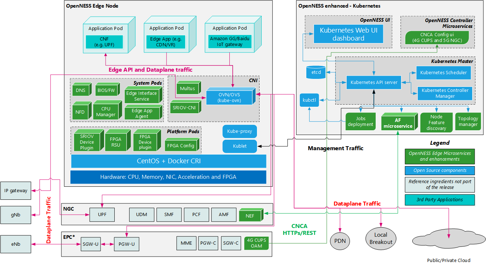

```text
SPDX-License-Identifier: Apache-2.0
Copyright (c) 2019-2020 Intel Corporation
```

# OpenNESS Support for OVS as dataplane with OVN

- [OpenNESS Support for OVS as dataplane with OVN](#openness-support-for-ovs-as-dataplane-with-ovn)
  - [OVN Introduction](#ovn-introduction)
  - [OVN/OVS support in OpenNESS Network Edge](#ovnovs-support-in-openness-network-edge)
  - [OVS/OVN support in OpenNESS On Premises (OVN CNI)](#ovsovn-support-in-openness-on-premises-ovn-cni)
    - [Enable OVNCNI](#enable-ovncni)
    - [CNI Implementation](#cni-implementation)
    - [The Network](#the-network)
    - [Cluster architecture](#cluster-architecture)
    - [Traffic rules](#traffic-rules)
      - [Example: Block pod's ingress IP traffic but allow ICMP](#example-block-pods-ingress-ip-traffic-but-allow-icmp)
  - [Summary](#summary)

## OVN Introduction
Open Virtual Network (OVN) is an open source solution based on the Open vSwitch-based (OVS) software-defined networking (SDN) solution for providing network services to instances. OVN adds to the capabilities of OVS to provide native support for virtual network abstractions, such as virtual L2 and L3 overlays and security groups. Further information about the OVN architecture can be found [here](https://www.openvswitch.org/support/dist-docs/ovn-architecture.7.html)

## OVN/OVS support in OpenNESS Network Edge
The primary objective of supporting OVN/OVS in OpenNESS is to demonstrate the capability of using a standard dataplane like OVS for an Edge Compute platform. Using OVN/OVS further provides standard SDN based flow configuration for the edge Dataplane.

The diagram below shows OVS as a dataplane and OVN overlay. This mode of deployment is recommended when the Edge node terminates IP traffic (Wireline, Wireless, LTE CUPS, SGi)



[Kube-OVN](https://github.com/alauda/kube-ovn) has been chosen as the CNI implementation for OpenNESS. Additionally, in the following configuration, OpenNESS applications on Edge Nodes are deployed as DaemonSet Pods (in separate "openness" namespace) and exposed to client applications by k8s services.

OVN/OVS is used as the default networking infrastructure for:
- Dataplane Interface: UE's to edge applications
- InterApp Interface: Communication infrastructure for applications to communicate
- Default Interface: Interface for managing the Application POD (e.g. ssh to application POD)
- Cloud/Internet Interface: Interface for Edge applications to communicate with the Cloud/Internet

The platform supports OVS-DPDK as a dataplane. OVS-DPDK can be used to high-performance data transmission scenarios in userspace. More about OVS-DPDK can be found [here](http://docs.openvswitch.org/en/latest/howto/dpdk/).

## OVS/OVN support in OpenNESS On Premises (OVN CNI)
For On Premises mode OVS/OVN can be used in place of the default On Premises dataplane which is NTS.
To distinguish it from OVS InterApp this dataplane is often referred to as OVN CNI.
OVN CNI supports both virtual machines and docker containers.

For information on deploying On Premises mode with OVS/OVN instead of NTS refer to [On Premises setup guide](../getting-started/on-premises/controller-edge-node-setup.md#dataplanes).

OVNCNI plugin has been implemented as the CNI for OpenNESS in On-Premises mode. The plugin has been developed based on the specifications provided as part of the [CNCF](https://www.cncf.io/) project. OVNCNI provides network connectivity for Edge applications on the OpenNESS Edge nodes. The applications can be deployed as Docker containers or VMs and are exposed to client applications by Docker services.

The OpenNESS platform supports OVN/OVS-DPDK as a dataplane. However, it is a work in progress. OVN dataplane implementation is not complete, thus, it is not the default networking infrastructure and [NTS](openness-nts.md) still works as such.

OVN/OVS can be used as:
- InterApp Interface: Communication infrastructure for applications to communicate
- Default Interface: Interface for managing the application container and VM  (e.g. ssh to application container or VM)
- Cloud/Internet Interface: Interface for Edge applications to communicate with the Cloud/Internet

### Enable OVNCNI
To enable OVNCNI instead of NTS, "onprem_dataplane" variable needs to be set to "ovncni", before executing deploy_onprem.yml file to start OpenNESS installation.

```yaml
# group_vars/all.yml
onprem_dataplane: "ovncni"
```
OVS role used for _Inter App Communication_ with _nts_ dataplane has to be disabled(Disabled by default):
```yaml
# on_premises.yml
# - role: ovs
```
> NOTE: When deploying virtual machine with OVNCNI dataplane, `/etc/resolv.conf` must be edited to use `192.168.122.1` nameserver.

The ansible scripts configure the OVN infrastructure to be used by OpenNNESS. OVN-OVS container is created on each controller and Edge node where OVS is installed and configured to use DPDK. Network connectivity is set for the controller and all the nodes in the OpenNESS cluster. On each Edge node the CNI plugin is built which can be later used to add and delete OVN ports to connect/dicsonnect Edge applications to/from the cluster.

CNI configuration is retrieved from roles/openness/onprem/dataplane/ovncni/master/files/cni.conf file. Additional arguments used by CNI are stored in roles/openness/onprem/dataplane/ovncni/master/files/cni_args.json file. The user is not expected to modify the files.

### CNI Implementation
OpenNESS EdgeNode has two built-in packages that are used for handling OVN:

"cni" package is implemented based on a CNI skeleton available as a GO package [here](https://godoc.org/github.com/containernetworking/cni/pkg/skel). OpenNESS adds its own implementations of functions the skeleton calls to ADD, DELETE and CHECK OVN ports to existing OVS bridges for connecting applications.

"ovncni" package provides OVN client implementation used to add, delete and get OVN ports. This client is part of the CNI context used for ADD, DELETE and GET commands issued towards OVN. Additionally, the package provides helper functions used by EVA to deploy application VMs and containers.

### The Network
The Controller node acts as the OVN-Central node. The OVN-OVS container deployed on the Controller contains ovn-northd server with north and south databases that store the information on logical ports, switches and routes as well as the physical network components spread across all the connected nodes. The OVN-OVS container deployed on each node runs ovn-controller that connects the node to the south DB on the Controller, and ovs-vswitch daemon that manages the switches on the node.

OVNCNI plugin is installed on each node to provide networking connectivity for its application containers and VMs, keeping their deployment differences transparent to the user and providing homogenous networks in terms of IP addressing.

### Cluster architecture
Following diagram contains overview on cluster architecture for OVN CNI dataplane.


* Machines in OpenNESS deployment are connected via `node-switch` switch. Each machine contains `br-int` OVS bridge which is accessible by `ovn-local` interface.
* Deployed applications are attached to `cluster-switch` OVN switch which has `10.100.0.0/16` network.
* Attaching other physical interfaces to OVN cluster is possible using `br-local` OVS bridge.

### Traffic rules
For On Premises deployment with OVN CNI dataplane traffic rules are handled by OVN's ACL (Access-Control List).
> NOTE: Currently, managing the rules is only possible using `ovn-nbctl` utility.

As per [`ovn-nbctl`](http://www.openvswitch.org/support/dist-docs/ovn-nbctl.8.html) manual, adding new ACL using `ovn-nbctl`:
```
ovn-nbctl
    [--type={switch | port-group}]
    [--log] [--meter=meter] [--severity=severity] [--name=name]
    [--may-exist]
  acl-add entity direction priority match verdict
```

Deleting ACL:
```
ovn-nbctl
    [--type={switch | port-group}]
  acl-del entity [direction [priority match]]
```

Listing ACLs:
```
ovn-nbctl
    [--type={switch | port-group}]
  acl-list entity
```

Where:
* `--type={switch | port-group}` allows to specify type of the _entity_ if there's a switch and a port-group with same name
* `--log` enables packet logging for the ACL
  * `--meter=meter` can be used to limit packet logging, _meter_ is created using `ovn-nbctl meter-add`
  * `--severity=severity` is a log level: `alert, debug, info, notice, warning`
  * `--name=name` specifies a log name
* `--may-exist` don't return an error when creating duplicated rule
* `entity` entity (switch or port-group) to which ACL will be applied, can be UUID or name, in case of OVN CNI it's most likely to be a `cluster-switch`
* `direction` either `from-lport` or `to-lport`:
  * `from-lport` for filters on traffic arriving from a logical port (logical switch's ingress)
  * `to-lport` for filters on traffic forwarded to a logical port (logical switch's egress)
* `priority` integer in range from 0 to 32767, greater the number, more important is the rule
* `match` rule for matching the packets
* `verdict` action, one of the `allow`, `allow-related`, `drop`, `reject`

> NOTE: By default all traffic is allowed. When restricting traffic, remember to allow flows like ARP or other essential networking protocols.

For more information refer to [`ovn-nbctl`](http://www.openvswitch.org/support/dist-docs/ovn-nbctl.8.html) and [`ovn-nb`](http://www.openvswitch.org/support/dist-docs/ovn-nb.5.html) manuals.

#### Example: Block pod's ingress IP traffic but allow ICMP

Following examples use nginx container which is a HTTP server for OVN cluster. In the examples, it has IP address `10.100.0.4` and application ID = `f5bd3404-df38-47e7-8907-4adbc4d24a7f`.
Second container acts as a supposed client of the server.

First, make sure that there is a connectivity between two containers:
```shell
$ ping 10.100.0.4 -w 3

PING 10.100.0.4 (10.100.0.4) 56(84) bytes of data.
64 bytes from 10.100.0.4: icmp_seq=1 ttl=64 time=0.640 ms
64 bytes from 10.100.0.4: icmp_seq=2 ttl=64 time=0.580 ms
64 bytes from 10.100.0.4: icmp_seq=3 ttl=64 time=0.221 ms

--- 10.100.0.4 ping statistics ---
3 packets transmitted, 3 received, 0% packet loss, time 54ms
rtt min/avg/max/mdev = 0.221/0.480/0.640/0.185 ms

$ curl 10.100.0.4

<!DOCTYPE html>
<html>
<head>
<title>Welcome to nginx!</title>
<style>
    body {
        width: 35em;
        margin: 0 auto;
        font-family: Tahoma, Verdana, Arial, sans-serif;
    }
</style>
</head>
<body>
<h1>Welcome to nginx!</h1>
<p>If you see this page, the nginx web server is successfully installed and
working. Further configuration is required.</p>

<p>For online documentation and support please refer to
<a href="http://nginx.org/">nginx.org</a>.<br/>
Commercial support is available at
<a href="http://nginx.com/">nginx.com</a>.</p>

<p><em>Thank you for using nginx.</em></p>
</body>
</html>
```

To block pod's IP, but allow ICMP run following command either on the Edge Node or the Edge Controller:

```shell
$ docker exec ovs-ovn ovn-nbctl acl-add cluster-switch to-lport 100 'outport == "f5bd3404-df38-47e7-8907-4adbc4d24a7f" && ip && icmp' allow-related
$ docker exec ovs-ovn ovn-nbctl acl-add cluster-switch to-lport 99 'outport == "f5bd3404-df38-47e7-8907-4adbc4d24a7f" && ip' drop
```

Explanation:
* `docker exec ovs-ovn` allows us to enter the ovs-ovn container which has access to OVN's north bridge
* `ovn-nbctl acl-add` adds an ACL rule
* `cluster-switch` is switch to which all application containers are connected
* `to-lport` means that we're adding rule affecting traffic going from switch to the logical port (application)
* `100` or `99` is a priority, rule with ICMP has greater priority to be considered before DROP on all IP traffic
* `'outport == "<APP ID>" && ip && icmp'` is a match string for rule, rule will executed for traffic going out via switch's port named "<APP ID>" (which is connected to container's internal port) and protocols are IP and ICMP
* `allow-related` means that both incoming request and outgoing response will not be dropped or rejected
* `drop` drops all the traffic

Result of the ping and curl after applying these two rules:
```shell
$ ping 10.100.0.4 -w 3

PING 10.100.0.4 (10.100.0.4) 56(84) bytes of data.
64 bytes from 10.100.0.4: icmp_seq=1 ttl=64 time=2.48 ms
64 bytes from 10.100.0.4: icmp_seq=2 ttl=64 time=0.852 ms
^C
--- 10.100.0.4 ping statistics ---
2 packets transmitted, 2 received, 0% packet loss, time 3ms
rtt min/avg/max/mdev = 0.852/1.664/2.477/0.813 ms

$ curl --connect-timeout 10 10.100.0.4
curl: (28) Connection timed out after 10001 milliseconds
```

If we run command `ovn-nbctl acl-list cluster-switch` we'll receive list of ACLs:
```shell
$ docker exec ovs-ovn ovn-nbctl acl-list cluster-switch

  to-lport  1000 (ip4.src==10.20.0.0/16) allow-related
  to-lport   100 (outport == "f5bd3404-df38-47e7-8907-4adbc4d24a7f" && ip && icmp) allow-related
  to-lport    99 (outport == "f5bd3404-df38-47e7-8907-4adbc4d24a7f" && ip) drop
```

Now, let's remove rule for ICMP:
```shell
$ docker exec ovs-ovn ovn-nbctl acl-del cluster-switch to-lport 101 'outport == "f5bd3404-df38-47e7-8907-4adbc4d24a7f" && ip && icmp'

$ docker exec ovs-ovn ovn-nbctl acl-list cluster-switch

  to-lport  1000 (ip4.src==10.20.0.0/16) allow-related
  to-lport    99 (outport == "f5bd3404-df38-47e7-8907-4adbc4d24a7f" && ip) drop
```
and make a ping once again to see if it's dropped:
```shell
$ ping 10.100.0.4 -w 3

PING 10.100.0.4 (10.100.0.4) 56(84) bytes of data.

--- 10.100.0.4 ping statistics ---
3 packets transmitted, 0 received, 100% packet loss, time 36ms
```

OVNCNI plugin has been implemented as the CNI for OpenNESS in On-Premises mode. The plugin has been developed based on the specifications provided as part of the [CNCF](https://www.cncf.io/) project. OVNCNI provides network connectivity for Edge applications on the OpenNESS Edge nodes. The applications can be deployed as Docker containers or VMs and are exposed to client applications by Docker services.

The OpenNESS platform supports OVN/OVS-DPDK as a dataplane. However, it is a work in progress. OVN dataplane implementation is not complete, thus, it is not the default networking infrastructure and [NTS](openness-nts.md) still works as such.

OVN/OVS can be used as:
- InterApp Interface: Communication infrastructure for applications to communicate
- Default Interface: Interface for managing the application container and VM  (e.g. ssh to application container or VM)
- Cloud/Internet Interface: Interface for Edge applications to communicate with the Cloud/Internet


## Summary
OpenNESS is built with a microservices architecture. Depending on the deployment, there may be a requirement to service pure IP traffic and configure the dataplane using standard SDN based tools. OpenNESS demonstrates such a requirement this by providing OVS as a dataplane in the place of NTS without changing the APIs from an end user perspective.
