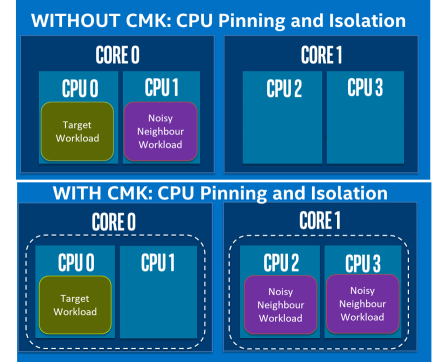

```text
SPDX-License-Identifier: Apache-2.0
Copyright (c) 2019 Intel Corporation
```

# Dedicated CPU core for workload support in OpenNESS

- [Dedicated CPU core for workload support in OpenNESS](#dedicated-cpu-core-for-workload-support-in-openness)
  - [Overview](#overview)
  - [Details - CPU Manager support in OpenNESS](#details---cpu-manager-support-in-openness)
    - [Setup](#setup)
    - [Usage](#usage)
  - [Reference](#reference)

## Overview 

Multi-core COTS platforms are typical in any cloud or Cloudnative deployment. Parallel processing on multiple cores helps achieve better density. On a Multi-core platform, one challenge for applications and network functions that are latency and throughput density is deterministic compute. To achieve deterministic compute allocating dedicated resources is important. Dedicated resource allocation avoids interference with other applications (Noisy Neighbor). When deploying on a cloud native platform, applications are deployed as PODs, therefore, providing required information to the container orchestrator on dedicated CPU cores is key. CPU manager allows provisioning of a POD to dedicated cores.



_Figure - CPU Manager - CMK_

Below are the typical usage of this feature.

- Let's consider an edge application that is using an AI library like OpenVINO for inference. This library will use a special instruction set on the CPU to get higher performance of the AI algorithm. To achieve a deterministic inference rate, the application thread executing the algorithm needs a dedicated CPU core so that there is no interference from other threads or other application pods (Noisy Neighbor).


_Figure - CPU Manager support on OpenNESS_

> Note with Linux CPU isolation and CMK, a certain amount of isolation can be achieved but not all the kernel threads can be moved away.

The following section outlines some considerations for using CPU Manager(CMK):

- If the workload already uses a threading library (e.g. pthread) and uses set affinity like APIs then CMK might not be needed. For such workloads, in order to provide cores to use for deployment, Kubernetes ConfigMaps is the recommended methodology. ConfigMaps can be used to pass the CPU core mask to the application to use. 
- The workload is a medium to long-lived process with inter-arrival times of the order of ones to tens of seconds or greater.
- After a workload has started executing, there is no need to dynamically update its CPU assignments.
- Machines running workloads explicitly isolated by cmk must be guarded against other workloads that do not consult the cmk tool chain. The recommended way to do this is for the operator to taint the node. The provided cluster-init subcommand automatically adds such a taint.
- CMK does not need to perform additional tuning with respect to IRQ affinity, CFS settings or process scheduling classes.
- The preferred mode of deploying additional infrastructure components is to run them in containers on top of Kubernetes.

CMK accomplishes core isolation by controlling what logical CPUs each container may use for execution by wrapping target application commands with the CMK command-line program. The cmk wrapper program maintains state in a directory hierarchy on disk that describes pools from which user containers can acquire available CPU lists. These pools can be exclusive (only one container per CPU list) or non-exclusive (multiple containers can share a CPU list.) Each CPU list directory contains a tasks file that tracks process IDs of the container subcommand(s) that acquired the CPU list. When the child process exits, the cmk wrapper program clears its PID from the tasks file. If the wrapper program is killed before it can perform this cleanup step, a separate periodic reconciliation program detects this condition and cleans the tasks file accordingly. A file system lock guards against conflicting concurrent modifications.

## Details - CPU Manager support in OpenNESS

[CPU Manager for Kubernetes (CMK)](https://github.com/intel/CPU-Manager-for-Kubernetes) is a Kubernetes plugin that provides core affinity for applications deployed as Kubernetes pods. It is advised to use isolcpus for core isolation when using CMK (otherwise full isolation cannot be guaranteed).

CMK is a command-line program that wraps target application to provide core isolation (example pod with application wrapped by CMK is given in [Usage](#usage-3) section).

CMK documentation available on github includes:

- [operator manual](https://github.com/intel/CPU-Manager-for-Kubernetes/blob/master/docs/operator.md)
- [user manual](https://github.com/intel/CPU-Manager-for-Kubernetes/blob/master/docs/user.md).

### Setup

**Edge Controller / Kubernetes master**

1. Configure Edge Controller in Network Edge mode using `ne_controller.yml`, following roles must be enabled kubernetes/master, kubeovn/master and cmk/master.
2. CMK is enabled with following default values of parameters in `roles/cmk/master/defaults/main.yml` (adjust the values if needed):

- `cmk_num_exclusive_cores` set to `4`
- `cmk_num_shared_cores` set to `1`
- `cmk_host_list` set to `node01,node02` (it should contain comma separated list of nodes' hostnames).

3. Deploy the controller with deploy_ne_controller.sh.

**Edge Node / Kubernetes worker**

1. Configure Edge Node in Network Edge mode using ne_node.yml, following roles must be enabled kubernetes/worker, kubeovn/worker and cmk/worker.
2. To change core isolation and tuned realtime profile settings edit `os_kernel_rt_tuned_vars` in `roles/os_kernelrt/defaults/main.yml`.
The changes will affect all edge nodes in the inventory, to set the parameter only for a specific node add the variable `os_kernel_rt_tuned_vars` to host_vars/node-name-in-inventory.yml.
3. Deploy the node with deploy_ne_node.sh.

Environment setup can be validated using steps from [CMK operator manual](https://github.com/intel/CPU-Manager-for-Kubernetes/blob/master/docs/operator.md#validating-the-environment).

### Usage

The following example creates a `Pod` that can be used to deploy application pinned to a core:

1. `DEPLOYED-APP` in `args` should be changed to deployed application name (the same for labels and names)
2. `image` value `DEPLOYED-APP-IMG:latest` should be changed to valid application image available in Docker (if image is to be downloaded change `ImagePullPolicy` to `Always`):

```bash
cat <<EOF | kubectl create -f -
apiVersion: v1
kind: Pod
metadata:
  labels:
    app: cmk-isolate-DEPLOYED-APP-pod
  name: cmk-isolate-DEPLOYED-APP-pod
spec:
  nodeName: <NODENAME>
  containers:
  - args:
    - "/opt/bin/cmk isolate --conf-dir=/etc/cmk --pool=exclusive DEPLOYED-APP"
    command:
    - "/bin/bash"
    - "-c"
    env:
    - name: CMK_PROC_FS
      value: "/host/proc"
    image: DEPLOYED-APP-IMG:latest
    imagePullPolicy: "Never"
    name: cmk-DEPLOYED-APP
    resources:
      limits:
        cmk.intel.com/exclusive-cores: 1
      requests:
        cmk.intel.com/exclusive-cores: 1
    volumeMounts:
    - mountPath: "/host/proc"
      name: host-proc
      readOnly: true
    - mountPath: "/opt/bin"
      name: cmk-install-dir
    - mountPath: "/etc/cmk"
      name: cmk-conf-dir
  restartPolicy: Never
  volumes:
  - hostPath:
      path: "/opt/bin"
    name: cmk-install-dir
  - hostPath:
      path: "/proc"
    name: host-proc
  - hostPath:
      path: "/etc/cmk"
    name: cmk-conf-dir
EOF
```
## Reference 
- [CPU Manager Repo](https://github.com/intel/CPU-Manager-for-Kubernetes)
- More examples of Kubernetes manifests available in [CMK repository](https://github.com/intel/CPU-Manager-for-Kubernetes/tree/master/resources/pods) and [documentation](https://github.com/intel/CPU-Manager-for-Kubernetes/blob/master/docs/user.md).
