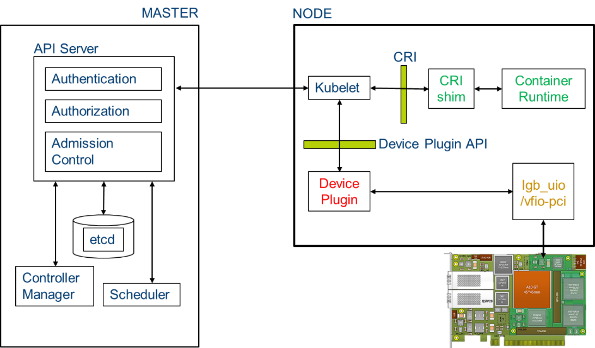

```text
SPDX-License-Identifier: Apache-2.0
Copyright (c) 2019 Intel Corporation
```

# Using FPGA in OpenNESS: Programming, Resource Allocation and Configuration

- [Using FPGA in OpenNESS: Programming, Resource Allocation and Configuration](#using-fpga-in-openness-programming-resource-allocation-and-configuration)
  - [Overview](#overview)
  - [Intel® PAC N3000 FlexRAN host interface overview](#intel%c2%ae-pac-n3000-flexran-host-interface-overview)
  - [Intel PAC N3000 Orchestration and deployment with Kubernetes for FlexRAN](#intel-pac-n3000-orchestration-and-deployment-with-kubernetes-for-flexran)
  - [Intel PAC N3000 remote system update flow in OpenNESS Network edge Kubernetes](#intel-pac-n3000-remote-system-update-flow-in-openness-network-edge-kubernetes)
  - [Using FPGA on OpenNESS - Details](#using-fpga-on-openness---details)
    - [FPGA (FEC) Ansible installation for OpenNESS Network Edge](#fpga-fec-ansible-installation-for-openness-network-edge)
      - [Edge Controller](#edge-controller)
      - [Edge Node](#edge-node)
    - [FPGA Programming and telemetry on OpenNESS Network Edge](#fpga-programming-and-telemetry-on-openness-network-edge)
    - [FEC VF configuration for OpenNESS Network Edge](#fec-vf-configuration-for-openness-network-edge)
    - [Requesting resources and running pods for OpenNESS Network Edge](#requesting-resources-and-running-pods-for-openness-network-edge)
    - [Verifying Application POD access and usage of FPGA on OpenNESS Network Edge](#verifying-application-pod-access-and-usage-of-fpga-on-openness-network-edge)
  - [Reference](#reference)

## Overview

The FPGA Programmable Acceleration Card plays a key role in accelerating certain types of workloads which in-turn increases the overall compute capacity of a COTS platform. FPGA benefits include:
- Flexibility - FPGA functionality can change upon every power-up of the device.
- Acceleration - Get products to market quicker and/or increases your system performance.
- Integration - Today’s FPGAs include on-die processors, transceiver I/O’s at 28 Gbps (or faster), RAM blocks, DSP engines, and more.
- Total Cost of Ownership (TCO) - While ASICs may cost less per unit than an equivalent FPGA, building them requires a non-recurring expense (NRE), expensive software tools, specialized design teams, and long manufacturing cycles.

Deployment of AI/ML applications at the edge is increasing the adoption of FPGA acceleration. This trend of devices performing machine learning at the edge locally versus relying solely on the cloud is driven by the need to lower latency, persistent availability, lower costs and address privacy concerns. 

This paper explains how the FPGA resource can be used on the OpenNESS platform for accelerating Network Functions and Edge application workloads. We use the Intel® FPGA Programmable Acceleration Card (Intel FPGA PAC) N3000 as a reference FPGA and use LTE/5G Forward Error Correction (FEC) as an example workload that accelerates the 5G or 4G L1 Base station Network function. The same concept and mechanism is applicable for application acceleration workloads like AI/ML on FPGA for Inference applications. 

The Intel® FPGA Programmable Acceleration Card (Intel FPGA PAC) N3000 is a full-duplex 100 Gbps in-system re-programmable acceleration card for multi-workload networking application acceleration. It has the right memory mixture designed for network functions, with integrated network interface card (NIC) in a small form factor that enables high throughput, low latency, low-power/bit for custom networking pipeline. 

FlexRAN is a reference Layer 1 pipeline of 4G eNb and 5G gNb on Intel architecture. The FlexRAN reference pipeline consists of L1 pipeline, optimized L1 processing modules, BBU pooling framework, Cloud and Cloud native deployment support and accelerator support for hardware offload. Intel® PAC N3000 card is used by FlexRAN to offload FEC (Forward Error Correction) for 4G and 5G and IO for Fronthaul/Midhaul. 

## Intel® PAC N3000 FlexRAN host interface overview
The PAC N3000 card used in the FlexRAN solution exposes the following physical functions to the CPU host. 
- 2x25G Ethernet interface that can be used for Fronthaul or Midhaul 
- One FEC Interface that can be used of 4G or 5G FEC acceleration 
  - The LTE FEC IP components have Turbo Encoder / Turbo decoder and rate matching / de-matching
  - The 5GNR FEC IP components have Low-density parity-check (LDPC) Encoder / LDPC Decoder, rate matching / de-matching, UL HARQ combining
- Interface for managing and updating the FPGA Image – Remote system Update (RSU).


_Figure - PAC N3000 Host interface_

## Intel PAC N3000 Orchestration and deployment with Kubernetes for FlexRAN
FlexRAN is the network function that implements the FEC and is a low latency network function. FlexRAN uses both the FEC and Ethernet resources from the FPGA using POD resource allocation and the Kubernetes device plugin framework. Kubernetes provides a device plugin framework that is used to advertise system hardware resources to the Kubelet. Instead of customizing the code for Kubernetes itself, vendors can implement a device plugin that can be deployed either manually or as a DaemonSet. The targeted devices include GPUs, high-performance NICs, FPGAs, InfiniBand adapters, and other similar computing resources that may require vendor specific initialization and setup.



_Figure - Intel PAC N3000 Orchestration and deployment with OpenNESS Network Edge for FlexRAN_

## Intel PAC N3000 remote system update flow in OpenNESS Network edge Kubernetes 
Remote System Update (RSU) of the FPGA is enabled through Open Programmable Acceleration Engine (OPAE). The OPAE package consists of a kernel driver and user space FPGA utils package that enables programming of the FPGA. OpenNESS automates the process of deploying the OPAE stack as a Kubernetes POD that detects the FPGA and programs it. There is a separate FPGA Configuration POD which is deployed as a Kubernetes job which configures the FPGA resources such as Virtual Functions and queues.  


_Figure - OpenNESS Network Edge Intel PAC N3000 RSU and resource allocation_

## Using FPGA on OpenNESS - Details 

Further sections provide instructions on how to use all three FPGA features - Programming, Configuration and accessing from application on OpenNESS Network and OnPremises Edge. 

When the PAC N3000 FPGA is programmed with a vRAN 5G FPGA image it exposes the Single Root I/O Virtualization (SRIOV) Virtual Function (VF) devices which can be used to accelerate the FEC in the vRAN workload. In order to take advantage of this functionality for a Cloud Native deployment the PF (Physical Function) of the device must be bound to DPDK IGB_UIO user-space driver in order to create a number of VFs (Virtual Functions). Once the VFs are created they must also be bound to a DPDK user-space driver in order to allocate them to specific K8s pods running the vRAN workload.

The full pipeline of preparing the device for a workload deployment and deploying the workload can be divided into following stages/sub-features:

- Programming the FPGA with RTL factory and user images - Feature installation via Ansible automation and  K8s kubectl plugin provided to use the feature.
- Enabling SRIOV, binding devices to appropriate drivers and creation of VFs - Delivered as part of the Edge Node's Ansible automation.
- Queue configuration of FPGAs PF/VFs with an aid of DPDK Baseband Device (BBDEV) config utility - Docker image creation delivered as part of the Edge Nodes's Ansible automation (Dependency on the config utility from FlexRAN package), Sample pod/job deployment specification and instructions delivered as part of Edge Controller’s package.
- Enabling orchestration/allocation of the devices (VFs) to non-root pods requesting the devices - Patch to existing SRIOV K8s device plugin extending the functionality, and Ansible automation of image build delivered as part of Edge Node’s package. K8s Plugin deployment delivered as part of Edge Controller's Ansible automation.
- Simple sample BBDEV application to validate the pipeline (ie. SRIOV creation - Queue configuration - Device orchestration - Pod deployment) - Script delivery and instructions to build Docker image for sample application delivered as part of Edge Apps package.

It is assumed that the FPGA is always used with OpenNESS Network Edge, paired with Multus plugin (Multus CNI is a container network interface (CNI) plugin for Kubernetes that enables attaching multiple network interfaces to pods.) to enable the workload pod with a default K8s network interface.

### FPGA (FEC) Ansible installation for OpenNESS Network Edge
To run the OpenNESS package with FPGA (FEC) functionality the feature needs to be enabled on both Edge Controller and Edge Node.

#### Edge Controller 

To enable on Edge Controller set/uncomment following in `ne_controller.yml` in OpenNESS-Experience-Kits top level directory:
```
- role: opae_fpga/master
- role: multus
- role: sriov/master
```
Also enable/configure following options in `roles/sriov/common/defaults/main.yml`.
The following device config is the default config for the PAC N3000 with 5GNR vRAN user image tested (this configuration is common both to EdgeNode and EdgeController setup).
```
fpga_sriov_userspace:
  enabled: true
fpga_userspace_vf:
  enabled: true
  vendor_id: "8086"
  vf_device_id: "0d90"
  pf_device_id: "0d8f"
  vf_number: "2"
```

Run setup script `deploy_ne_controller.sh`.

#### Edge Node 

To enable on the Edge Node set following in `ne_node.yml` (Please note that the `sriov/worker` role needs to be executed before `kubernetes/worker` role):

```
- role: opae_fpga/worker
- role: sriov/worker
```

The following packages need to be placed into specific directories in order for the feature to work:

1. Clean copy of `bbdev_config_service` needs to be placed in the `openness-experience-kits/fpga_config` directory. The package can be obtained as part of 19.10 release of FlexRAN (Please contact your Intel representative or visit [Resource Design Centre](https://cdrdv2.intel.com/v1/dl/getContent/615743 ) to obtain the package)

2. OPAE package `n3000-1-3-5-beta-rte-setup.zip` needs to be placed inside `openness-experience-kits/opae_fpga` directory. The package can be obtained as part of PAC N3000 OPAE beta release (Please contact your Intel representative or visit [Resource Design Centre](https://cdrdv2.intel.com/v1/dl/getContent/616082 ) to obtain the package)

3. Factory image configuration package `n3000-1-3-5-beta-cfg-2x2x25g-setup.zip` needs to be placed inside `openness-experience-kits/opae_fpga` directory. The package can be obtained as part of PAC N3000 OPAE beta release (Please contact your Intel representative or visit [Resource Design Centre](https://cdrdv2.intel.com/v1/dl/getContent/616080 ) to obtain the package)

Run setup script `deploy_ne_node.sh`.

### FPGA Programming and telemetry on OpenNESS Network Edge
In order to program the FPGA factory image (One Time Secure Upgrade) or the user image (5GN FEC vRAN) of the PAC N3000 via OPAE a `kubectl` plugin for K8s is provided. The plugin also allows for obtaining basic FPGA telemetry. This plugin will deploy K8s jobs which will run to completion on desired host and display the logs/output of the command.

The following are the operations supported by the `kubectl rsu` K8s plugin, to be run from the Edge Controller:

1. To display currently supported capabilities and information on how to use them:

```
kubectl rsu -h
```
2. To run One Time Secure Upgrade of the factory image run:
```
kubectl rsu flash -n <hostname>
```
3. To display information about RSU supported devices that can be used to program the FPGA, and list FPGA user images available on the host run:
```
kubectl rsu discover -n <hostname>
```
4. To copy and sign a user image to desired platform, run the following (to obtain a user FPGA image for 5GNR vRAN (i.e ldpc5g_2x2x25g) please contact your Intel Representative) to copy an already signed image add `--no-sign` to the command:
```
kubectl rsu load -f </path/to/image.bin> -n <hostname>
```
5. To program the FPGA with user image (vRAN for 5GNR) run:
```
kubectl rsu program -f <signed_RTL_image> -n <hostname> -d <RSU_PCI_bus_function_id>
```
6. To obtain basic telemetry, such as temperature, power usage and FPGA image information run:
```
kubectl rsu get temp  -n <hostname>
kubectl rsu get power  -n <hostname>
kubectl rsu get fme  -n <hostname>
```
7. For more information on usage of each `kubectl rsu` plugin capability run each command with `-h` argument.

In order to run vRAN workloads on the PAC N3000 the FPGA must be programmed with appropriate factory and user images as per instructions provided.

Additionally in a scenario where user would prefer to be able to deploy a K8s job for OPAE manually without the use of the `kubectl rsu` plugin the following sample .yml specification for the job can be used as a template, the `args` provided need to be changed accordingly, this job can be run with `kubectl create -f sample.yml`:

```yaml
apiVersion: batch/v1
kind: Job
metadata:
  name: fpga-opae-job
spec:
  template:
    spec:
      containers:
      - securityContext:
          privileged: true
        name: fpga-opea
        image: fpga-opae-pacn3000:1.0
        imagePullPolicy: Never
        command: [ "/bin/bash", "-c", "--" ]
        args: [ "./check_if_modules_loaded.sh && fpgasupdate /root/images/<img_name> <RSU_PCI_bus_function_id> && rsu bmcimg (RSU_PCI_bus_function_id)" ]
        volumeMounts:
        - name: class
          mountPath: /sys/devices
          readOnly: false
        - name: image-dir
          mountPath: /root/images
          readOnly: false
      volumes:
      - hostPath:
          path: "/sys/devices"
        name: class
      - hostPath:
          path: "/temp/vran_images"
        name: image-dir
      restartPolicy: Never
      nodeSelector:
        kubernetes.io/hostname: samplenodename

  backoffLimit: 0
```

### FEC VF configuration for OpenNESS Network Edge
To configure the VFs with the necessary number of queues for the vRAN workload the BBDEV configuration utility is to be run as a job within a privileged container.

Sample configMap (can be configured if other than typical config is required) with profile for the queue configuration is provided at (from EdgeController package):
`fpga/fpga-sample-configmap.yaml`

Deploy the configMap for queue profile:

`kubectl create -f fpga-sample-configmap.yaml`

Sample K8s job specification using the BBDEV config app is provided at:

`fpga/fpga-config-job.yaml`

In the above edit the `nodeSelector: kubernetes.io/hostname: <host_name>` with the name of the host that has the FPGA and is meant to run the workloads.

Deploy the BBDEV config utility job:

`kubectl create -f fpga-config-job.yaml`

Check if the job has successfully completed and the pod created for this job is in “Completed” state. Check the logs of the pod to see complete successful configuration.
```
kubectl get pods
kubectl logs fpga-config-job-xxxxx
```
Expected: `Mode of operation = VF-mode FPGA_LTE PF [0000:xx:00.0] configuration complete!`

### Requesting resources and running pods for OpenNESS Network Edge
As part of OpenNESS Ansible automation a K8s device plugin to orchestrate the FPGA VFs bound to user-space driver is running. This will enable scheduling of pods requesting this device/devices. Number of devices available on the Edge Node can be checked from Edge Controller by running:

`kubectl get node <node_name> -o json | jq '.status.allocatable'`

To request the device as a resource in the pod add the request for the resource into the pod specification file, by specifying its name and amount of resources required. If the resource is not available or the amount of resources requested is greater than the amount of resources available, the pod status will be 'Pending' until the resource is available. 
Note that the name of the resource must match the name specified in the configMap for the K8s devices plugin (`./fpga/configMap.yml`). 

A sample pod requesting the FPGA (FEC) VF may look like this:

```
apiVersion: v1
kind: Pod
metadata:
  name: test
  labels:
    env: test
spec:
  containers:
  - name: test
    image: centos:latest
    command: [ "/bin/bash", "-c", "--" ]
    args: [ "while true; do sleep 300000; done;" ]
    resources:
      requests:
        intel.com/intel_fec_5g: '1'
      limits:
        intel.com/intel_fec_5g: '1' 
``` 

In order to test the resource allocation to the pod, save the above snippet to the sample.yaml file and create the pod.

`kubectl create -f sample.yaml`

Once the pod is in 'Running' state check that the device was allocated to the pod (an uioX device and an environmental variable with device PCI address should be available):
```
kubectl exec -it test -- ls /dev
kubectl exec -it test -- printenv | grep FEC
```
To check the amount of devices currently allocated to pods run (and search for 'Allocated Resources'):

`kubectl describe node <worker_node_host_name>`

### Verifying Application POD access and usage of FPGA on OpenNESS Network Edge
To verify the functionality of all the sub-features are working together (SRIOV binding - K8s device plugin - BBDEV config) and functionality of the FPGA (FEC) VF inside a non-root pod, build a Docker image and run a simple validation application for the device.

The automation of the Docker image build is available from the Edge Apps package. The image must be built on same node where it is meant to be deployed (or a server with same configuration as the node that will run the workload - this is due to Kernel dependencies of DPDK during the application build).

Navigate to:

`edgeapps/fpga-sample-app`

Copy the necessary `flexran-dpdk-bbdev-v19-10.patch` file into the directory. This patch is available as part of FlexRAN 19.10 release package. To obtain this FlexRAN patch allowing 5G functionality for BBDEV in DPDK please contact your Intel representative or visit [Resource Design Centre](https://cdrdv2.intel.com/v1/dl/getContent/615743 )

Build image:

`./build-image.sh`

From the Edge Controller deploy the application pod, pod specification located at `/fpga`:

`kubectl create -f fpga-sample-app.yaml`

Execute into the application pod and run the sample app:
```
kubectl exec -it pod-bbdev-sample-app -- /bin/bash

./test-bbdev.py --testapp-path ./testbbdev -e="-w ${PCIDEVICE_INTEL_COM_INTEL_FEC_5G}" -i -n 1 -b 1 -l 1 -c validation -v ./test_vectors/ldpc_dec_v7813.data
```
The output of the application should indicate total of ‘1’ tests and ‘1’ test passing, this concludes the validation of the FPGA VF working correctly inside K8s pod.

## Reference 
- [Intel® FPGA Programmable Acceleration Card N3000](https://www.intel.com/content/www/us/en/programmable/products/boards_and_kits/dev-kits/altera/intel-fpga-pac-n3000/overview.html)
-  [FlexRAN 19.10 release - Resource Design Centre](https://cdrdv2.intel.com/v1/dl/getContent/615743)
- [PAC N3000 OPAE beta release - Resource Design Centre](https://cdrdv2.intel.com/v1/dl/getContent/616082)
- [PAC N3000 OPAE beta release (2) - Resource Design Centre](https://cdrdv2.intel.com/v1/dl/getContent/616080) 

