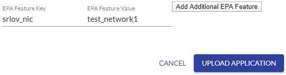
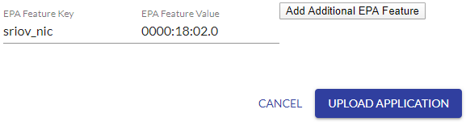

```text
SPDX-License-Identifier: Apache-2.0
Copyright (c) 2019-2020 Intel Corporation
```

# Multiple Interface and PCIe SRIOV support in OpenNESS

- [Multiple Interface and PCIe SRIOV support in OpenNESS](#multiple-interface-and-pcie-sriov-support-in-openness)
  - [Overview](#overview)
    - [Overview of Multus](#overview-of-multus)
    - [Overview of SR-IOV CNI](#overview-of-sr-iov-cni)
    - [Overview of SR-IOV Device Plugin](#overview-of-sr-iov-device-plugin)
  - [Details - Multiple Interface and PCIe SRIOV support in OpenNESS](#details---multiple-interface-and-pcie-sriov-support-in-openness)
    - [Multus usage](#multus-usage)
    - [SRIOV for Network-Edge](#sriov-for-network-edge)
      - [Edge Node SRIOV interfaces configuration](#edge-node-sriov-interfaces-configuration)
      - [Usage](#usage)
    - [SRIOV for On-Premises](#sriov-for-on-premises)
      - [Edgenode Setup](#edgenode-setup)
      - [Docker Container Deployment Usage](#docker-container-deployment-usage)
      - [Virtual Machine Deployment Usage](#virtual-machine-deployment-usage)
  - [Reference](#reference)

## Overview

Edge deployments consist of both Network Functions and Applications. Cloud Native solutions like Kubernetes typically expose only one interface to the Application or Network function PODs. These interfaces are typically bridged interfaces. This means that Network Functions like Base station or Core network User plane functions and Applications like CDN etc. are limited by the default interface.

To address this we need to enable two key networking features:
1) Enable a Kubernetes like orchestration environment to provision more than one interface to the application and Network function PODs
2) Enable the allocation of dedicated hardware interfaces to application and Network Function PODs

### Overview of Multus

To enable multiple interface support in PODs, OpenNESS Network Edge uses the Multus container network interface. Multus CNI is a container network interface (CNI) plugin for Kubernetes that enables the attachment of multiple network interfaces to pods. Typically, in Kubernetes each pod only has one network interface (apart from a loopback) – with Multus you can create a multi-homed pod that has multiple interfaces. This is accomplished by Multus acting as a “meta-plugin”, a CNI plugin that can call multiple other CNI plugins. Multus CNI follows the Kubernetes Network Custom Resource Definition De-facto Standard to provide a standardized method by which to specify the configurations for additional network interfaces. This standard is put forward by the Kubernetes Network Plumbing Working Group.

Below is an illustration of the network interfaces attached to a pod, as provisioned by the Multus CNI. The diagram shows the pod with three interfaces: eth0, net0 and net1. eth0 connects to the Kubernetes cluster network to connect with the Kubernetes server/services (e.g. kubernetes api-server, kubelet and so on). net0 and net1 are additional network attachments and connect to other networks by using other CNI plugins (e.g. vlan/vxlan/ptp).


_Figure - Multus Overview_

### Overview of SR-IOV CNI

The Single Root I/O Virtualization (SR-IOV) feature provides the ability to partition a single physical PCI resource into virtual PCI functions that can be allocated to application and network function PODs. To enable SR-IOV device resource allocation and CNI, OpenNESS Network Edge uses the SR-IOV CNI and SR-IOV Device Plugin. The SR-IOV CNI plugin enables the Kubernetes pod to be attached directly to an SR-IOV virtual function (VF) using the standard SR-IOV VF driver in the container host’s kernel.


_Figure - SR-IOV CNI_

### Overview of SR-IOV Device Plugin

The Intel SR-IOV Network device plugin discovers and exposes SR-IOV network resources as consumable extended resources in Kubernetes. This works with SR-IOV VFs in both Kernel drivers and DPDK drivers. When a VF is attached with a kernel driver, then the SR-IOV CNI plugin can be used to configure this VF in the Pod. When using the DPDK driver, a VNF application configures this VF as required.


_Figure - SR-IOV Device plugin_

## Details - Multiple Interface and PCIe SRIOV support in OpenNESS

In Network Edge mode Multus CNI, which provides possibility for attaching multiple interfaces to the pod, is deployed automatically when `kubernetes_cnis` variable list (in the `group_vars/all.yml` file) contains at least two elements, e.g.:
```yaml
kubernetes_cnis:
- kubeovn
- sriov
```

### Multus usage

[Custom resource definition](https://kubernetes.io/docs/concepts/extend-kubernetes/api-extension/custom-resources/#custom-resources) (CRD) is used to define additional network that can be used by Multus.

1. The following example creates a `NetworkAttachmentDefinition` that can be used to provide an additional macvlan interface to a POD:
```bash
cat <<EOF | kubectl create -f -
apiVersion: "k8s.cni.cncf.io/v1"
kind: NetworkAttachmentDefinition
metadata:
  name: macvlan
spec:
  config: '{
    "name": "mynet",
    "type": "macvlan",
    "master": "virbr0",
    "ipam": {
      "type": "host-local",
      "subnet": "192.168.1.0/24",
      "rangeStart": "192.168.1.200",
      "rangeEnd": "192.168.1.216"
    }
  }'
EOF
```
2. To list defined configurations use:
```bash
  kubectl get network-attachment-definitions
```
3. To create a pod that uses the previously created interface add an annotation to pod definition:
```yaml
  apiVersion: v1
  kind: Pod
  metadata:
    name: samplepod
    annotations:
      k8s.v1.cni.cncf.io/networks: macvlan
  spec:
    containers:
    - name: multitoolcont
      image: praqma/network-multitool
```

> NOTE: More networks can be added after a coma in the same annotation
4. To verify that the additional interface was configured run `ip a` in the deployed pod. The output should look similar to the following:
```bash
  1: lo: <LOOPBACK,UP,LOWER_UP> mtu 65536 qdisc noqueue state UNKNOWN qlen 1000
    link/loopback 00:00:00:00:00:00 brd 00:00:00:00:00:00
    inet 127.0.0.1/8 scope host lo
       valid_lft forever preferred_lft forever
  2: net1@if178: <NO-CARRIER,BROADCAST,MULTICAST,UP> mtu 1500 qdisc noqueue state LOWERLAYERDOWN
    link/ether 06:3d:10:e3:34:a4 brd ff:ff:ff:ff:ff:ff link-netnsid 0
    inet 192.168.1.200/24 scope global net1
       valid_lft forever preferred_lft forever
  308: eth0@if309: <BROADCAST,MULTICAST,UP,LOWER_UP> mtu 1400 qdisc noqueue state UP
    link/ether 0a:00:00:10:00:12 brd ff:ff:ff:ff:ff:ff link-netnsid 0
    inet 10.16.0.17/16 brd 10.16.255.255 scope global eth0
       valid_lft forever preferred_lft forever
```

### SRIOV for Network-Edge

To deploy the OpenNESS' Network Edge with SR-IOV `sriov` must be added to the `kubernetes_cnis` list in `group_vars/all.yml`:
```yaml
kubernetes_cnis:
- kubeovn
- sriov
```

#### Edge Node SRIOV interfaces configuration

For the installer to turn on the specified number of SR-IOV VFs for selected network interface of node, please provide that information in format `{interface_name: VF_NUM, ...}` in `sriov.network_interfaces` variable inside config files in `host_vars` ansible directory.
Due to the technical reasons, each node has to be configured separately. Copy the example file `host_vars/node1.yml` and then create a similar one for each node being deployed.

Please also remember, that each node must be added to Ansible inventory file `inventory.ini`.

For example providing `host_vars/node1.yml` with:

```yaml
sriov:
  network_interfaces: {ens787f0: 4, ens787f1: 8}
```

will enable 4 VFs for network interface (PF) `ens787f0` and 8 VFs for network interface `ens787f1` of `node1`.

#### Usage
SRIOV plugins use [Multus](#multus-plugin), the usage is very similar to the one described above. By default OpenNESS will create network `sriov-openness` which can be used to attach VFs. You can find the `sriov-openness` network's CRD below:

```yaml
apiVersion: "k8s.cni.cncf.io/v1"
kind: NetworkAttachmentDefinition
metadata:
  name: sriov-openness
  annotations:
    k8s.v1.cni.cncf.io/resourceName: intel.com/intel_sriov_netdevice
spec:
  config: '{
  "type": "sriov",
  "cniVersion": "0.3.1",
  "name": "sriov-openness-network",
  "ipam": {
    "type": "host-local",
    "subnet": "192.168.2.0/24",
    "routes": [{
      "dst": "0.0.0.0/0"
    }],
    "gateway": "192.168.2.1"
  }
}'
```

> Note: Users can create network with different CRD if they need to.

1. To create a POD with an attached SR-IOV device, add the network annotation to the POD definition and `request` access to the SR-IOV capable device (`intel.com/intel_sriov_netdevice`):
   ```yaml
   apiVersion: v1
   kind: Pod
   metadata:
     name: samplepod
     annotations:
       k8s.v1.cni.cncf.io/networks: sriov-openness
   spec:
     containers:
     - name: samplecnt
       image: centos/tools
       resources:
         requests:
           intel.com/intel_sriov_netdevice: "1"
   ```

2. To verify that the additional interface was configured run `ip a` in the deployed pod. The output should look similar to the following:
   ```bash
   1: lo: <LOOPBACK,UP,LOWER_UP> mtu 65536 qdisc noqueue state UNKNOWN group default qlen 1000
     link/loopback 00:00:00:00:00:00 brd 00:00:00:00:00:00
     inet 127.0.0.1/8 scope host lo
        valid_lft forever preferred_lft forever
   41: net1: <BROADCAST,MULTICAST,UP,LOWER_UP> mtu 1500 qdisc mq state UP group default qlen 1000
       link/ether aa:37:23:b5:63:bc brd ff:ff:ff:ff:ff:ff
       inet 192.168.2.2/24 brd 192.168.2.255 scope global net1
         valid_lft forever preferred_lft forever
   169: eth0@if170: <BROADCAST,MULTICAST,UP,LOWER_UP> mtu 1400 qdisc noqueue state UP group default
       link/ether 0a:00:00:10:00:0b brd ff:ff:ff:ff:ff:ff link-netnsid 0
       inet 10.16.0.10/16 brd 10.16.255.255 scope global eth0
         valid_lft forever preferred_lft forever
   ```

### SRIOV for On-Premises
Support for providing SR-IOV interfaces to containers and virtual machines is also available for OpenNESS On-Premises deployments.

#### Edgenode Setup
To install the OpenNESS node with SR-IOV support, the option `role: sriov_device_init/onprem` must be uncommented in the `edgenode_group` in `on_premises.yml` of the ansible scripts.

```yaml
- role: sriov_device_init/onprem
```

In order to configure the number of SR-IOV VFs on the node, the `network_interfaces` variable located under `sriov` in `host_vars/node01.yml` needs to be updated with the physical network interfaces on the node where the VFs should be created, along with the number of VFs to be created for each interface. The format this information should be provided in is `{interface_name: number_of_vfs, ...}`.

> Note: Remember that each node must be added to the ansible inventory file `inventory.ini` if they are to be deployed by the ansible scripts.

To inform the installer of the number of VFs to configure for use with virtual machine deployments, the variable `vm_vf_ports` must be set, e.g. `vm_vf_ports: 4` tells the installer to configure four VFs for use with virtual machines. The installer will use this setting to assign that number of VFs to the kernel pci-stub driver so that they can be passed to virtual machines at deployment.

When deploying containers in On-Premises mode, additional settings in the `host_vars/node01.yml` file are required so the installer can configure the VFs correctly. Each VF will be assigned to a Docker network configuration which will be created by the installer. To do this, the following variables must be configured:
- `interface_subnets`: This contains the subnet information for the Docker network that the VF will be assigned to. Must be provided in the format `[subnet_ip/subnet_mask,...]`.
- `interface_ips`: This contains the gateway IP address for the Docker network which will be assigned to the VF in the container. The address must be located within the subnet provided above. Must be provided in the format `[ip_address,...]`.
- `network_name`: This contains the name of the Docker network to be created by the installer. Must be in the format `[name_of_network,...]`.

An example `host_vars/node01.yml` which enables 4 VFs across two interfaces with two VFs configured for virtual machines and two VFs configured for containers is shown below:
```yaml
sriov:
  network_interfaces: {enp24s0f0: 2, enp24s0f1: 2}
  interface_subnets: [192.168.1.0/24, 192.168.2.0/24]
  interface_ips: [192.168.1.1, 192.168.2.1]
  network_name: [test_network1, test_network2]
  vm_vf_ports: 2
```

> Note: When setting VFs for On-Premises mode the total number of VFs assigned to virtual machines and containers *must* match the total number of VFs requested, i.e. if requesting 8 VFs in total, the amount assigned to virtual machines and containers *must* also total to 8.

#### Docker Container Deployment Usage

To assign a VF to a Docker container at deployment, the following steps are required once the Edge Node has been set up by the ansible scripts with VFs created.

1. On the Edge Node, run `docker network ls` to get the list of Docker networks available. These should include the Docker networks assigned to VFs by the installer.
```bash
# docker network ls
NETWORK ID          NAME                DRIVER              SCOPE
74d9cb38603e        bridge              bridge              local
57411c1ca4c6        host                host                local
b8910de9ad89        none                null                local
c227f1b184bc        test_network1       macvlan             local
3742881cf9ff        test_network2       macvlan             local
```
> Note: if you want to check the network settings for a specific network, simply run `docker network inspect <network_name>` on the Edge Node.
2. Log into the controller UI and go to the Applications tab to create a new container application with the *EPA Feature Key* set to `sriov_nic` and the *EPA Feature Value* set to `network_name`.

3. To verify that the additional interface was configured run `docker exec -it <container_name> ip a s` on the deployed container. The output should be similar to the following, with the new interface labelled as eth0.
```bash
1: lo: <LOOPBACK,UP,LOWER_UP> mtu 65536 qdisc noqueue state UNKNOWN group default qlen 1000
    link/loopback 00:00:00:00:00:00 brd 00:00:00:00:00:00
    inet 127.0.0.1/8 scope host lo
       valid_lft forever preferred_lft forever
111: eth0@if50: <NO-CARRIER,BROADCAST,MULTICAST,UP> mtu 1500 qdisc noqueue state LOWERLAYERDOWN group default
    link/ether 02:42:c0:a8:01:02 brd ff:ff:ff:ff:ff:ff link-netnsid 0
    inet 192.168.1.2/24 brd 192.168.1.255 scope global eth0
       valid_lft forever preferred_lft forever
112: vEth1: <BROADCAST,MULTICAST> mtu 1500 qdisc noop state DOWN group default qlen 1000
    link/ether 9a:09:f3:84:f9:7b brd ff:ff:ff:ff:ff:ff
```

#### Virtual Machine Deployment Usage

To assign a VF to a virtual machine at deployment, the following steps are required on the Edge Node that has been set up by the ansible scripts with VFs created.

1. On the Edge Node, get the list of PCI address bound to the pci-stub kernel driver by running `ls /sys/bus/pci/drivers/pci-stub`. The output should look similar to the following:
```bash
# ls /sys/bus/pci/drivers/pci-stub
0000:18:02.0  0000:18:02.1  bind  new_id  remove_id  uevent  unbind
```
2. Log into the controller UI and go to the Applications tab to create a new virtual machine application with the *EPA Feature Key* set to `sriov_nic` and the *EPA Feature Value* set to `pci_address`.

3. To verify that the additional interface was configured run `virsh domiflist <vm_name>` on the Edge Node. The output should be similar to the following, with the hostdev device for the VF interface shown.
```bash
Interface  Type       Source     Model       MAC
-------------------------------------------------------
-          network    default    virtio      52:54:00:39:3d:80
-          vhostuser  -          virtio      52:54:00:90:44:ee
-          hostdev    -          -           52:54:00:eb:f0:10
```

## Reference
For further details
- SR-IOV CNI: https://github.com/intel/sriov-cni
- Multus: https://github.com/Intel-Corp/multus-cni
- SR-IOV network device plugin: https://github.com/intel/intel-device-plugins-for-kubernetes
