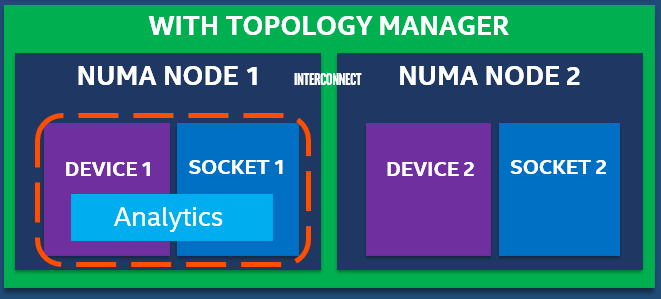

```text
SPDX-License-Identifier: Apache-2.0
Copyright (c) 2019 Intel Corporation
```
<!-- omit in toc -->
# Resource Locality Awareness Support Through Topology Manager in OpenNESS
- [Overview](#overview)
  - [Edge use case](#edge-use-case)
- [Details - Topology manager support in OpenNESS](#details---topology-manager-support-in-openness)
  - [Usage](#usage)
- [Reference](#reference)

## Overview

Multi-core and Multi-Socket commercial, off-the-shelf (COTS) systems are widely used for the deployment of application and network functions. COTS systems provide a variety of IO and memory features. In order to achieve determinism and high performance, mechanisms like CPU isolation, IO device locality, and socket memory allocation are critical. Cloud-native stacks such as Kubernetes\* are beginning to leverage resources such as CPU, hugepages, and I/O, but are agnostic to the Non-Uniform Memory Access (NUMA) alignment of these. Non-optimal, topology-aware NUMA resource allocation can severely impact the performance of latency-sensitive workloads.

To address this requirement, OpenNESS uses the Topology manager. The topology manager is now supported by Kubernetes. Topology Manager is a solution that permits k8s components (e.g., CPU Manager and Device Manager) to coordinate the resources allocated to a workload. 

### Edge use case

Let us look at an Analytics application that is consuming multiple, high-definition video streams and executing an analytics algorithm. This analytics application pod is compute-, memory-, and network performance-sensitive. To improve performance of the analytics application on a typical dual-socket or multi-NUMA node system, an Orchestrator like Kubernetes needs to place the analytics pod on the same NUMA node where the Network Card is located and the memory is allocated. Without the topology manager, the deployment may be like that shown in the diagram below, where the analytics application is on NUMA 1 and the Device is on NUMA 2. This leads to poor and unreliable performance.


_Figure - Pod deployment issue without Topology Manager_

With Topology manager, this issue is addressed and the analytics pod placement will be such that the resource locality is maintained.


_Figure - Pod deployment with Topology Manager_

Topology Manager is a Kubelet component that aims to co-ordinate the set of components that are responsible for these optimizations.

## Details - Topology manager support in OpenNESS

Topology Manager is enabled by default with a `best-effort` policy. You can change the settings before OpenNESS installation by editing the `group_vars/all/10-default.yml` file:

```yaml
### Kubernetes Topology Manager configuration (for worker)
# CPU settings
cpu:
  # CPU policy - possible values: none (disabled), static (default)
  policy: "static"
  # Reserved CPUs
  reserved_cpus: 1

# Kubernetes Topology Manager policy - possible values: none (disabled), best-effort (default), restricted, single-numa-node
topology_manager:
  policy: <selected_policy>
```

Where `<selected_policy>` can be `none`, `best-effort`, `restricted` or `single-numa-node`. Refer to the [Kubernetes Documentation](https://kubernetes.io/docs/tasks/administer-cluster/topology-manager/) for details of these policies.

You can also set `kubernetes_reserved_cpus` to a number that suits you best. This parameter specifies the number of logical CPUs that will be reserved for a Kubernetes system Pods.

### Usage
To use Topology Manager create a Pod with a `guaranteed` QoS class (requests equal to limits). For example:

```yaml
kind: Pod
apiVersion: v1
metadata:
  name: examplePod
spec:
  containers:
    - name: example
      image: alpine
      command: ["/bin/sh", "-ec", "while :; do echo '.'; sleep 5 ; done"]
      resources:
        limits:
          cpu: "8"
          memory: "500Mi"
        requests:
          cpu: "8"
          memory: "500Mi"
```

Then apply it with `kubectl apply`. You can check in the kubelet's logs on you node (`journalctl -xeu kubelet`), that Topology Manager obtained all the info about preferred affinity and deployed the Pod accordingly. The logs should be similar to the one below.

```
Nov 05 09:22:52 tmanager kubelet[64340]: I1105 09:22:52.548692   64340 topology_manager.go:308] [topologymanager] Topology Admit Handler
Nov 05 09:22:52 tmanager kubelet[64340]: I1105 09:22:52.550016   64340 topology_manager.go:317] [topologymanager] Pod QoS Level: Guaranteed
Nov 05 09:22:52 tmanager kubelet[64340]: I1105 09:22:52.550171   64340 topology_hints.go:60] [cpumanager] TopologyHints generated for pod 'examplePod', container 'example': [{0000000000000000000000000000000000000000000000000000000000000001 true} {0000000000000000000000000000000000000000000000000000000000000010 true} {0000000000000000000000000000000000000000000000000000000000000011 false}]
Nov 05 09:22:52 tmanager kubelet[64340]: I1105 09:22:52.550204   64340 topology_manager.go:285] [topologymanager] ContainerTopologyHint: {0000000000000000000000000000000000000000000000000000000000000010 true}
Nov 05 09:22:52 tmanager kubelet[64340]: I1105 09:22:52.550216   64340 topology_manager.go:329] [topologymanager] Topology Affinity for Pod: 4ad6fb37-509d-4ea6-845c-875ce41049f9 are map[example:{0000000000000000000000000000000000000000000000000000000000000010 true}]
```
## Reference
- [Topology Manager](https://kubernetes.io/docs/tasks/administer-cluster/topology-manager/)
