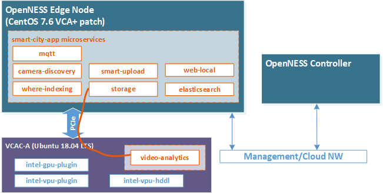
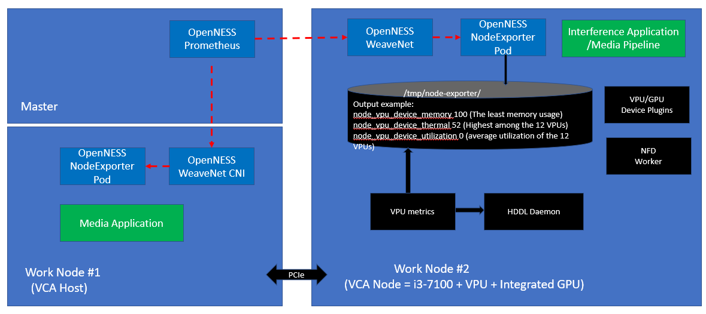

```text
SPDX-License-Identifier: Apache-2.0
Copyright (c) 2020 Intel Corporation
```
<!-- omit in toc -->
# Visual Compute Accelerator Card - Analytics (VCAC-A)

- [Overview](#overview)
- [Architecture](#architecture)
  - [VCA Zone](#vca-zone)
  - [VCA Pools](#vca-pools)
- [Node Feature Discovery (NFD)](#node-feature-discovery-nfd)
- [VPU, GPU Device Plugins & HDDL Daemonset](#vpu-gpu-device-plugins--hddl-daemonset)
- [Telemetry Support](#telemetry-support)
- [Media-Analytics-VCA Flavor](#media-analytics-vca-flavor)
- [References](#references)

## Overview
The Visual Cloud Accelerator Card - Analytics (VCAC-A) equips 2nd Generation Intel® Xeon® Scalable Processor based platforms with Iris® Pro Graphics and Intel Movidius™ VPU to enhance the video codec, computer vision, and inference capabilities. Comprised of one Intel i3-7100U CPU and 12 Movidius VPU, this PCIe add-in card delivers competent stream inference capability and outstanding total cost of ownership. Provisioning the network edge with VCAC-A acceleration through the OpenNESS Experience Kits (OEK) enables dense and performant media analytics and transcoding pipelines.

## Architecture
Being equipped with its own CPU, the VCAC-A card is installed with a standalone operating system apart from the host server. Thereby, the VCAC-A card can be topologically regarded as a standalone "worker node" with VPU/GPU capabilities. The VCAC-A card is connected to the host Intel Xeon server over PCI-Express non-transparent bridge (NTB) – over a virtual ethernet network `172.32.x.1/24`. The host kernel must be patched in order to enable, inter alia, the virtual ethernet over PCIe.

> **Terminology** 
> * *Edge worker node* and *VCA host* terms will be used interchangeably throughout this document to represent the physical node where the VCAC-A cards are connected to.
> * *VCA node* term represents the worker node in the OpenNESS cluster – the VCAC-A card is the incarnation of the VCA node.
> * The full acronym *VCAC-A* is loosely used when talking about the PCIe card.

The VCAC-A installation involves [two-stage build](https://github.com/OpenVisualCloud/VCAC-SW-Analytics/):
1. VCA host kernel build and configuration: this stages patches the CentOS 7.6 kernel and builds the necessary modules and dependencies.
2. VCAC-A system image (VCAD) generation: this stage builds an Ubuntu based (VCAD) image that is loaded on the VCAC-A card.

The OEK automates the overall build and installation process of the VCAC-A card by joining it as a standalone logical worker node to the OpenNESS cluster. When successful, the OpenNESS controller is capable of selectively scheduling workloads on the "VCA node" for close proximity to the hardware acceleration.

When onboarding applications such as [Open Visual Cloud Smart City Sample](https://github.com/otcshare/edgeapps/tree/master/applications/smart-city-app) with the existence of VCAC-A, the OpenNESS controller schedules all the application pods onto the edge worker node except the *video analytics* processing that is scheduled on the VCA node as shown in the figure below.



_Figure - VCAC-A accelerating Smart City Application with OpenNESS_

### VCA Zone
During the VCAC-A installation, the VCA nodes are labelled with `vcac-zone=yes`. Therefore, in order to direct the OpenNESS controller to schedule particular workloads on the VCA node, the `nodeAffinity` field should be used in its Pod specs as shown below:

```yaml
...
affinity:
  nodeAffinity:
    requiredDuringSchedulingIgnoredDuringExecution:
      nodeSelectorTerms:
        - matchExpressions:
          - key: "vcac-zone"
            operator: In
            values:
              - "yes"
```

### VCA Pools
Another construct used when deploying OpenNESS is the `VCA pool` which is a similar concept to the *Node pools* that is supported by [Azure Kubernetes Service](https://docs.microsoft.com/en-us/azure/aks/use-multiple-node-pools) and [Google Kubernetes Engine](https://cloud.google.com/kubernetes-engine/docs/concepts/node-pools). VCA pool boils down to a unique label assigned to the group of VCA nodes that are plugged in to one edge worker node. This enables the scheduler to execute related workloads within the same VCA pool, i.e: within the same edge node physical space. The VCA pool is assigned the label `vcac-pool=<vca-host-name>` that reflects the hostname of the VCA host that all the VCAC-A cards are connected to.

On a related note, the VCA nodes follow a special naming convention such that they are assigned the name of their host nodes appended with *vca* keyword and a number, i.e: `<vca-host-name>-vcaX`. The number is an incremental index to differentiate between multiple VCAC-A cards installed.

In the example below, this is a cluster composed of 1 master `silpixa00399671`, 1 VCA host `silpixa00400194` and 3 VCAC-A cards: `silpixa00400194-vca1`, `silpixa00400194-vca2` and `silpixa00400194-vca3`. The 3 VCAC-A cards are connected to node `silpixa00400194`.
```shell
$ kubectl get nodes
NAME                   STATUS   ROLES    AGE   VERSION
silpixa00399671        Ready    master   31h   v1.18.2
silpixa00400194        Ready    worker   31h   v1.18.2
silpixa00400194-vca1   Ready    worker   31h   v1.18.2
silpixa00400194-vca2   Ready    worker   31h   v1.18.2
silpixa00400194-vca3   Ready    worker   31h   v1.18.2
```

For the example above, the 3 VCA nodes are grouped into VCA pool labelled as `vcac-pool=silpixa00400194`.

## Node Feature Discovery (NFD)
Kubernetes NFD files are pre-packaged within the VCAD image of the VCAC-A card and is located at `/opt/intel/openvino/k8s-nfd/nfd-vca-features` file. This file is mounted to `/etc/kubernetes/node-feature-discovery/features.d/` during the VCAC-A install sequence and accordingly the VCA node is labeled by *nfd-master* with these features.

VCAC-A features that are discovered by NFD and labeled in Kubernetes can be shown when running the command:
```shell
$ kubectl get no -o json | jq '.items[].metadata.labels'
{
  ...
  "feature.node.kubernetes.io/vca-vcaa_gpu_freq_in_MHz": "1150",
  "feature.node.kubernetes.io/vca-vcaa_gpu_memory_in_MB": "256",
  "feature.node.kubernetes.io/vca-vcaa_hw_h264_codec": "true",
  "feature.node.kubernetes.io/vca-vcaa_hw_h265_codec": "true",
  "feature.node.kubernetes.io/vca-vcaa_hw_jpeg_codec": "true",
  "feature.node.kubernetes.io/vca-vcaa_myriadx_nums": "12",
  "feature.node.kubernetes.io/vca-vcaa_nn_TOPs": "8.4",
  "feature.node.kubernetes.io/vca-vcaa_system_memory_in_GB": "8",
  "feature.node.kubernetes.io/vca-vcaa_vpu_memory_in_MB": "512",
  ...
}
```

## VPU, GPU Device Plugins & HDDL Daemonset
Kubernetes provides the [Device Plugins framework](https://kubernetes.io/docs/concepts/extend-kubernetes/compute-storage-net/device-plugins/) that is used to advertise system hardware resources. The device plugins of interest for VCAC-A are: [VPU](https://github.com/intel/intel-device-plugins-for-kubernetes/blob/master/cmd/vpu_plugin/README.md) and [GPU](https://github.com/intel/intel-device-plugins-for-kubernetes/blob/master/cmd/gpu_plugin/README.md) that are installed as part of the VCAC-A install sequence that is performed by the OEK.

Another ingredient involved in the inference execution through VCAC-A VPUs is the *HDDL-daemon* that is deployed as a [Kubernetes Daemonset](https://github.com/OpenVisualCloud/Dockerfiles/blob/master/VCAC-A/script/setup_hddl_daemonset.yaml) – it acts as an arbiter for the various applications/Pods trying to gain access to VPU resources. Therefore, the OpenNESS cluster is ready for onboarding applications and availing of VCAC-A acceleration without worrying about other dependencies.

```shell
$ kubectl get daemonsets -A
NAMESPACE     NAME               DESIRED   CURRENT   READY   UP-TO-DATE   AVAILABLE   NODE SELECTOR   AGE
default       intel-gpu-plugin   1         1         1       1            1           vcac-zone=yes   31h
default       intel-vpu-plugin   1         1         1       1            1           vcac-zone=yes   31h
kube-system   intel-vpu-hddl     1         1         1       1            1           vcac-zone=yes   31h
...
```
> VPU, GPU device plugins and HDDL Daemonset are deployed in the OpenNESS cluster as part of the VCAC-A installation sequence that is performed by the OEK.

## Telemetry Support
VCAC-A telemetry is an integral part of the OpenNESS telemetry suite that enables the Kubernetes scheduler to perform telemetry-aware scheduling decisions. Metrics that are exported:
1. VPU device memory – the least memory usage among all the VPUs
2. VPU device thermal – the highest among all the VPUs
3. VPU device utilization – the average utilization of all the VPUs

The VCAC-A VPU metrics are exported by the *NodeExporter* that integrates with Prometheus for real-time metrics collection, event monitoring and alerting. VPU metrics exporting is started by running:
```
$ /opt/intel/vcaa/vpu_metric/run.sh start
```
> The VPU metrics exporter script is executed as part of the VCAC-A install sequence that is performed by the OEK.



_Figure - VCAC-A Telemetry with OpenNESS_

Telemetry-Aware Scheduling (TAS) is the mechanism of defining policies that the controller aims to fulfil at run-time based on the collected real-time metrics. A sample VCAC-A VPU telemetry policy is given below that is applied by default as part of the install sequence performed by the OEK,

```yaml
apiVersion: telemetry.intel.com/v1alpha1
kind: TASPolicy
metadata:
  name: vca-vpu-policy
  namespace: default
spec:
  strategies:
    deschedule:
      rules:
      - metricname: vpu_device_thermal
        operator: GreaterThan
        target: 60
    dontschedule:
      rules:
      - metricname: vpu_device_memory
        operator: GreaterThan
        target: 50
      - metricname: vpu_device_utilization
        operator: GreaterThan
        target: 50
    scheduleonmetric:
      rules:
      - metricname: vpu_device_utilization
        operator: LessThan
```
> The above telemetry policy is applied by default as part of the VCAC-A install sequence that is performed by OEK.

## Media-Analytics-VCA Flavor
The pre-defined OpenNESS flavor *media-analytics-vca* is provided to provision an optimized system configuration for media analytics workloads leveraging VCAC-A acceleration. This flavor is applied through the OEK playbook as described in the [OpenNESS Flavors](../flavors.md) document. Applying this deployment flavors encompasses the VCAC-A installation.

The VCAC-A installation process involves:
1. Pulling the release package from [Open Visual Cloud VCAC-A card media analytics software](https://github.com/OpenVisualCloud/VCAC-SW-Analytics) and the required dependencies
2. Apply CentOS 7.6 kernel patches and build kernel RPM
3. Apply module patches and build driver RPM
4. Build daemon utilities RPM
5. Install docker-ce & kubernetes on the VCA host
6. Join the VCA host to the OpenNESS cluster
7. Pull Ubuntu docker image for building the VCAC-A system image
8. Download the required package from website for the VCAC-A system image
9. Apply Ubuntu 18.04 kernel patches and build kernel deb for the VCAC-A system image
10. Apply module patches and build driver deb for the VCAC-A system image
11. Generate VCAD base image for VCAC-A system image
12. Install the dependency and components (MSS, OpenCL, OpenVINO)
13. Boot up the VCAC-A system image
14. Configure the firewall to allow VCAC-A NATting
15. Install docker-ce & kubernetes on the VCA node
16. Join the VCA node to the OpenNESS cluster
17. Attach VCA NFD to kubernetes
18. Deploy VPU, GPU device plugins and HDDL Daemonset
19. Start VPU metrics exporter
20. Deploy VPU VCAC-A TAS policy

## References
- [Intel® Visual Cloud](https://www.intel.in/content/www/in/en/cloud-computing/visual-cloud.html)
- [Open Visual Cloud VCAC-A card media analytics software](https://github.com/OpenVisualCloud/VCAC-SW-Analytics)
- [Celestica's Intel-based accelerator card VCAC-A - datasheet](https://www.intel.com/content/dam/www/public/us/en/documents/datasheets/media-analytics-vcac-a-accelerator-card-by-celestica-datasheet.pdf)
