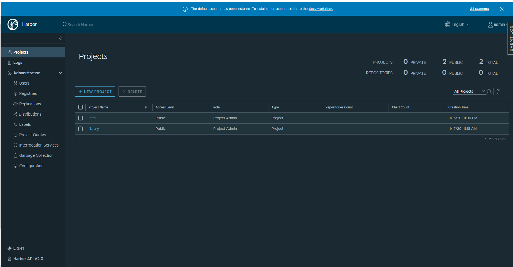

```text
SPDX-License-Identifier: Apache-2.0
Copyright (c) 2019-2021 Intel Corporation
```
<!-- omit in toc -->

# OpenNESS Network Edge: Controller and Edge node setup
- [OpenNESS Network Edge: Controller and Edge node setup](#openness-network-edge-controller-and-edge-node-setup)
- [Quickstart](#quickstart)
- [Preconditions](#preconditions)
- [Running playbooks](#running-playbooks)
  - [Deployment scripts](#deployment-scripts)
  - [Network Edge playbooks](#network-edge-playbooks)
    - [Cleanup playbooks](#cleanup-playbooks)
    - [Supported EPA features](#supported-epa-features)
    - [VM support for Network Edge](#vm-support-for-network-edge)
    - [Application on-boarding](#application-on-boarding)
    - [Single-node Network Edge cluster](#single-node-network-edge-cluster)
  - [Harbor registry](#harbor-registry)
    - [Deploy Harbor registry](#deploy-harbor-registry)
      - [System Prerequisite](#system-prerequisite)
      - [Ansible Playbooks](#ansible-playbooks)
      - [Projects](#projects)
    - [Harbor login](#harbor-login)
    - [Harbor registry image push](#harbor-registry-image-push)
    - [Harbor registry image pull](#harbor-registry-image-pull)
    - [Harbor UI](#harbor-ui)
    - [Harbor CLI](#harbor-cli)
      - [CLI - List Project](#cli---list-project)
      - [CLI - List Image Repositories](#cli---list-image-repositories)
      - [CLI - Delete Image](#cli---delete-image)
  - [Kubernetes cluster networking plugins (Network Edge)](#kubernetes-cluster-networking-plugins-network-edge)
    - [Selecting cluster networking plugins (CNI)](#selecting-cluster-networking-plugins-cni)
    - [Adding additional interfaces to pods](#adding-additional-interfaces-to-pods)
- [Q&A](#qa)
  - [Configuring time](#configuring-time)
  - [Setup static hostname](#setup-static-hostname)
  - [Configuring inventory](#configuring-inventory)
  - [Exchanging SSH keys between hosts](#exchanging-ssh-keys-between-hosts)
  - [Setting proxy](#setting-proxy)
  - [Obtaining installation files](#obtaining-installation-files)
  - [Setting Git](#setting-git)
    - [GitHub token](#github-token)
    - [Customize tag/branch/sha to checkout](#customize-tagbranchsha-to-checkout)
  - [Customization of kernel, grub parameters, and tuned profile](#customization-of-kernel-grub-parameters-and-tuned-profile)

# Quickstart
The following set of actions must be completed to set up the Open Network Edge Services Software (OpenNESS) cluster.

1. Fulfill the [Preconditions](#preconditions).
2. Become familiar with [supported features](#supported-epa-features) and enable them if desired.
3. Run the [deployment helper script](#running-playbooks) for the Ansible\* playbook:

   ```shell
   ./deploy_ne.sh -f <flavor>
   ```

**Note:**
Up to version 20.12 choosing flavor was optional. Since version 21.03 and moving forward this parameter is no longer optional. To learn more about [flavors go to this page](https://github.com/otcshare/specs/blob/master/doc/flavors.md).

# Preconditions

To use the playbooks, several preconditions must be fulfilled. These preconditions are described in the [Q&A](#qa) section below. The preconditions are:

- CentOS\* 7.9.2009 must be installed on hosts where the product is deployed. It is highly recommended to install the operating system using a minimal ISO image on nodes that will take part in deployment (obtained from inventory file). Also, do not make customizations after a fresh manual install because it might interfere with Ansible scripts and give unpredictable results during deployment.

- Hosts for the Edge Controller (Kubernetes control plane) and Edge Nodes (Kubernetes nodes) must have proper and unique hostnames (i.e., not `localhost`). This hostname must be specified in `/etc/hosts` (refer to [Setup static hostname](#setup-static-hostname)).

- SSH keys must be exchanged between hosts (refer to [Exchanging SSH keys between hosts](#exchanging-ssh-keys-between-hosts)).

- A proxy may need to be set (refer to [Setting proxy](#setting-proxy)).

- If a private repository is used, a Github\* token must be set up (refer to [GitHub token](#github-token)).

- Refer to the [Configuring time](#configuring-time) section for how to enable Network Time Protocol (NTP) clients.

- The Ansible inventory must be configured (refer to [Configuring inventory](#configuring-inventory)).

# Running playbooks

The Network Edge deployment and cleanup is carried out via Ansible playbooks. The playbooks are run from the Ansible host (it might be the same machine as the Edge Controller). Before running the playbooks, an inventory file `inventory/default/inventory.ini` must be configured.

The following subsections describe the playbooks in more detail.

## Deployment scripts

For convenience, playbooks can be executed by running helper deployment scripts from the Ansible host. These scripts require that the Edge Controller and Edge Nodes be configured on different hosts (for deployment on a single node, refer to [Single-node Network Edge cluster](#single-node-network-edge-cluster)). This is done by configuring the Ansible playbook inventory, as described later in this document.

The command syntax for the scripts is: `action_mode.sh -f <flavor> [group]`, i.e.,

  - `deploy_ne.sh -f <flavor> [ controller | nodes ]`
  - `cleanup_ne.sh -f <flavor> [ controller | nodes ] `

The parameter `controller` or `nodes` in each case deploys or cleans up the Edge Controller or the Edge Nodes, respectively.

**Note:**
Up to version 20.12 choosing flavor was optional. Since version 21.03 and moving forward this parameter is no longer optional. To learn more about [flavors go to this page](https://github.com/otcshare/specs/blob/master/doc/flavors.md).

For an initial installation, `deploy_ne.sh controller` must be run before `deploy_ne.sh nodes`. During the initial installation, the hosts may reboot. After reboot, the deployment script that was last run should be run again.

The `cleanup_ne.sh` script is used when a configuration error in the Edge Controller or Edge Nodes must be fixed. The script causes the appropriate installation to be reverted, so that the error can be fixed and `deploy_ne.sh` rerun. `cleanup_ne.sh` does not do a comprehensive cleanup (e.g., installation of DPDK or Golang will not be rolled back).

## Network Edge playbooks

The `network_edge.yml` and `network_edge_cleanup.yml` files contain playbooks for Network Edge mode.
Playbooks can be customized by enabling and configuring features in the `inventory/default/group_vars/all/10-default.yml` file.

### Cleanup playbooks

The role of the cleanup playbook is to revert changes made by deploy playbooks.
Changes are reverted by going step-by-step in reverse order and undoing the steps.

For example, when installing Docker\*, the RPM repository is added and Docker is installed. When cleaning up, Docker is uninstalled and the repository is removed.

>**NOTE**: There may be leftovers created by the installed software. For example, DPDK and Golang installations, found in `/opt`, are not rolled back.

### Supported EPA features

Several enhanced platform capabilities and features are available in OpenNESS for Network Edge. For the full list of supported features, see [Enhanced Platform Awareness Features](https://github.com/otcshare/specs/blob/master/doc/getting-started/network-edge/supported-epa.md). The documents referenced in this list provide a detailed description of the features, and step-by-step instructions for enabling them. Users should become familiar with available features before executing the deployment playbooks.

### VM support for Network Edge
Support for VM deployment on OpenNESS for Network Edge is available and enabled by default. Certain configurations and prerequisites may need to be satisfied to use all VM capabilities. The user is advised to become familiar with the VM support documentation before executing the deployment playbooks. See [openness-network-edge-vm-support](https://github.com/otcshare/specs/blob/master/doc/applications-onboard/openness-network-edge-vm-support.md) for more information.

### Application on-boarding

Refer to the [network-edge-applications-onboarding](https://github.com/otcshare/specs/blob/master/doc/aplications-onboard/network-edge-applications-onboarding.md) document for instructions on how to deploy edge applications for OpenNESS Network Edge.

### Single-node Network Edge cluster

Network Edge can be deployed on just a single machine working as a control plane & node.<br>
To deploy Network Edge in a single-node cluster scenario, follow the steps below:
1. Modify `inventory/default/inventory.ini`<br>
   > Rules for inventory:
   > - IP address (`ansible_host`) for both controller and node must be the same
   > - `edgenode_group` and `controller_group` groups must contain exactly one host

   Example of a valid inventory:
   ```ini
   [all]
   controller ansible_ssh_user=root ansible_host=192.168.0.11
   node01     ansible_ssh_user=root ansible_host=192.168.0.11

   [controller_group]
   controller

   [edgenode_group]
   node01

   [edgenode_vca_group]
   ```
2. Features can be enabled in the `inventory/default/group_vars/all/10-default.yml` file by tweaking the configuration variables.
3. Settings regarding the kernel, grub, HugePages\*, and tuned can be customized in `inventory/default/group_vars/edgenode_group/10-default.yml`.
   
   > Default settings in the single-node cluster mode are those of the Edge Node (i.e., kernel and tuned customization enabled).
4. Single-node cluster can be deployed by running command: `./deploy_ne.sh -f <flavor> single`

**Note:**
Up to version 20.12 choosing flavor was optional. Since version 21.03 and moving forward this parameter is no longer optional. To learn more about [flavors go to this page](https://github.com/otcshare/specs/blob/master/doc/flavors.md).

## Harbor registry

Harbor registry is an open source cloud native registry which can support images and relevant artifacts with extended functionalities as described in [Harbor](https://goharbor.io/). On the OpenNESS environment, Harbor registry service is installed on Control plane Node by Harbor Helm Chart [github](https://github.com/goharbor/harbor-helm/releases/tag/v1.5.1). Harbor registry authentication enabled with self-signed certificates as well as all nodes and control plane will have access to the Harbor registry.

### Deploy Harbor registry

#### System Prerequisite
* The available system disk should be reserved at least 20G for Harbor PV/PVC usage. The defaut disk PV/PVC total size is 20G. The values can be configurable in the ```roles/harbor_registry/controlplane/defaults/main.yaml```.
* If huge pages enabled, need 1G(hugepage size 1G) or 300M(hugepage size 2M) to be reserved for Harbor usage.
 
#### Ansible Playbooks 
Ansible "harbor_registry" roles created on openness-experience-kits. For deploying a Harbor registry on Kubernetes, control plane roles are enabled on the openness-experience-kits "network_edge.yml" file.

 ```ini
  role: harbor_registry/controlplane
  role: harbor_registry/node
 ```

The following steps are processed by openness-experience-kits during the Harbor registry installation on the OpenNESS control plane node.

* Download Harbor Helm Charts on the Kubernetes Control plane Node.
* Check whether huge pages is enabled and templates values.yaml file accordingly.
* Create namespace and disk PV for Harbor Services (The defaut disk PV/PVC total size is 20G. The values can be configurable in the ```roles/harbor_registry/controlplane/defaults/main.yaml```).
* Install Harbor on the control plane node using the Helm Charts (The CA crt will be generated by Harbor itself). 
* Create the new project - ```intel``` for OpenNESS microservices, Kurbernetes enhanced add-on images storage.
* Docker login the Harbor Registry, thus enable pulling, pushing and tag images with the Harbor Registry


On the OpenNESS edge nodes, openness-experience-kits will conduct the following steps:
* Get harbor.crt from the OpenNESS control plane node and save into the host location
  /etc/docker/certs.d/<Kubernetes_Control_Plane_IP:port>
* Docker login the Harbor Registry, thus enable pulling, pushing and tag images with the Harbor Registry
* After above steps, the Node and Ansible host can access the private Harbor registry.
* The IP address of the Harbor registry will be: "Kubernetes_Control_Plane_IP"
* The port number of the Harbor registry will be: 30003


#### Projects 
Two Harbor projects will be created by OEK as below:
- ```library``` The registry project can be used by edge application developer as default images registries.
- ```intel```   The registry project contains the registries for the OpenNESS microservices and relevant kubernetes addon images. Can also be used for OpenNESS sample application images.

### Harbor login
For the nodes inside of the OpenNESS cluster, openness-experience-kits ansible playbooks automatically login and prepare harbor CA certifications to access Harbor services. 

For the external host outside of the OpenNESS cluster, can use following commands to access the Harbor Registry:

```shell
# create directory for harbor's CA crt
mkdir /etc/docker/certs.d/${Kubernetes_Control_Plane_IP}:${port}/

# get EMCO harbor CA.crt
set -o pipefail && echo -n | openssl s_client -showcerts -connect ${Kubernetes_Control_Plane_IP}:${port} 2>/dev/null | sed -ne '/-BEGIN CERTIFICATE-/,/-END CERTIFICATE-/p' > /etc/docker/certs.d/${Kubernetes_Control_Plane_IP}:${port}/harbor.crt

# docker login harobr registry
docker login ${Kubernetes_Control_Plane_IP}:${port} -uadmin -p${harborAdminPassword}
```
The default access configuration for the Harbor Registry is:
 ```ini
Kubernetes_Control_Plane_IP: 30003(default)
harborAdminPassword: Harbor12345(default)
 ```

### Harbor registry image push
Use the Docker tag to create an alias of the image with the fully qualified path to your Harbor registry after the tag successfully pushes the image to the Harbor registry.

 ```shell
  docker tag nginx:latest {Kubernetes_Control_Plane_IP}:30003/intel/nginx:latest
  docker push {Kubernetes_Control_Plane_IP}:30003/intel/nginx:latest
 ```
Now image the tag with the fully qualified path to your private registry. You can push the image to the registry using the Docker push command.

### Harbor registry image pull
Use the `docker pull` command to pull the image from Harbor registry:

 ```shell
  docker pull {Kubernetes_Control_Plane_IP}:30003/intel/nginx:latest
 ```

### Harbor UI
Open the https://{Kubernetes_Control_Plane_IP}:30003 with login username ```admin``` and password ```Harbor12345```:


You could see two projects: ```intel``` and ```library``` on the Web UI. For more details about Harbor usage, can refer to [Harbor docs](https://goharbor.io/docs/2.1.0/working-with-projects/).

### Harbor CLI
Apart for Harbor UI, you can also use ```curl``` to check Harbor projects and images. The examples will be shown as below.
```text
In the examples, 10.240.224.172 is IP address of {Kubernetes_Control_Plane_IP}
If there is proxy connection issue with ```curl``` command, can add ```--proxy``` into the command options.
```

#### CLI - List Project
Use following example commands to check projects list:
 ```shell
 # curl -X GET "https://10.240.224.172:30003/api/v2.0/projects" -H "accept: application/json" -k --cacert /etc/docker/certs.d/10.240.224.172:30003/harbor.crt -u "admin:Harbor12345 | jq"
 [
  {
    "creation_time": "2020-11-26T08:47:31.626Z",
    "current_user_role_id": 1,
    "current_user_role_ids": [
      1
    ],
    "cve_allowlist": {
      "creation_time": "2020-11-26T08:47:31.628Z",
      "id": 1,
      "items": [],
      "project_id": 2,
      "update_time": "2020-11-26T08:47:31.628Z"
    },
    "metadata": {
      "public": "true"
    },
    "name": "intel",
    "owner_id": 1,
    "owner_name": "admin",
    "project_id": 2,
    "repo_count": 3,
    "update_time": "2020-11-26T08:47:31.626Z"
  },
  {
    "creation_time": "2020-11-26T08:39:13.707Z",
    "current_user_role_id": 1,
    "current_user_role_ids": [
      1
    ],
    "cve_allowlist": {
      "creation_time": "0001-01-01T00:00:00.000Z",
      "items": [],
      "project_id": 1,
      "update_time": "0001-01-01T00:00:00.000Z"
    },
    "metadata": {
      "public": "true"
    },
    "name": "library",
    "owner_id": 1,
    "owner_name": "admin",
    "project_id": 1,
    "update_time": "2020-11-26T08:39:13.707Z"
  }
 ]

 ```

#### CLI - List Image Repositories 
Use following example commands to check images repository list of project - ```intel```:
 ```shell
 # curl -X GET "https://10.240.224.172:30003/api/v2.0/projects/intel/repositories" -H "accept: application/json" -k --cacert /etc/docker/certs.d/10.240.224.172:30003/harbor.crt -u "admin:Harbor12345" | jq
 [
  {
    "artifact_count": 1,
    "creation_time": "2020-11-26T08:57:43.690Z",
    "id": 3,
    "name": "intel/sriov-device-plugin",
    "project_id": 2,
    "pull_count": 1,
    "update_time": "2020-11-26T08:57:55.240Z"
  },
  {
    "artifact_count": 1,
    "creation_time": "2020-11-26T08:56:16.565Z",
    "id": 2,
    "name": "intel/sriov-cni",
    "project_id": 2,
    "update_time": "2020-11-26T08:56:16.565Z"
  },
  {
    "artifact_count": 1,
    "creation_time": "2020-11-26T08:49:25.453Z",
    "id": 1,
    "name": "intel/multus",
    "project_id": 2,
    "update_time": "2020-11-26T08:49:25.453Z"
  }
 ]

 ```

#### CLI - Delete Image 
Use following example commands to delete the image repository of project - ```intel```, for example:
 ```shell
  # curl -X DELETE "https://10.240.224.172:30003/api/v2.0/projects/intel/repositories/nginx" -H "accept: application/json" -k --cacert /etc/docker/certs.d/10.240.224.172:30003/harbor.crt -u "admin:Harbor12345"
 ```
 
Use following example commands to delete a specific image version:
 ```sh
 # curl -X DELETE "https://10.240.224.172:30003/api/v2.0/projects/intel/repositories/nginx/artifacts/1.14.2" -H "accept: application/json" -k --cacert /etc/docker/certs.d/10.240.224.172:30003/harbor.crt -u "admin:Harbor12345"
 ```

## Kubernetes cluster networking plugins (Network Edge)

Kubernetes uses 3rd party networking plugins to provide [cluster networking](https://kubernetes.io/docs/concepts/cluster-administration/networking/).
These plugins are based on the [CNI (Container Network Interface) specification](https://github.com/containernetworking/cni).

OpenNESS Experience Kits provide several ready-to-use Ansible roles deploying CNIs.
The following CNIs are currently supported:

* [kube-ovn](https://github.com/alauda/kube-ovn)
  * **Only as primary CNI**
  * CIDR: 10.16.0.0/16
* [flannel](https://github.com/coreos/flannel)
  * IPAM: host-local
  * CIDR: 10.244.0.0/16
  * Network attachment definition: openness-flannel
* [calico](https://github.com/projectcalico/cni-plugin)
  * IPAM: host-local
  * CIDR: 10.243.0.0/16
  * Network attachment definition: openness-calico
* [weavenet](https://github.com/weaveworks/weave)
  * CIDR: 10.32.0.0/12
* [SR-IOV](https://github.com/intel/sriov-cni) (cannot be used as a standalone or primary CNI - [sriov setup](https://github.com/otcshare/specs/blob/master/doc/enhanced-platform-awareness/openness-sriov-multiple-interfaces.md))
* [Userspace](https://github.com/intel/userspace-cni-network-plugin) (cannot be used as a standalone or primary CNI - [Userspace CNI setup](https://github.com/otcshare/specs/blob/master/doc/dataplane/openness-userspace-cni.md)

Multiple CNIs can be requested to be set up for the cluster. To provide such functionality [the Multus CNI](https://github.com/intel/multus-cni) is used.

>**NOTE**: For a guide on how to add new a CNI role to the OpenNESS Experience Kits, refer to [the OpenNESS Experience Kits guide](https://github.com/otcshare/specs/blob/master/doc/getting-started/openness-experience-kits.md#adding-new-cni-plugins-for-kubernetes-network-edge).

### Selecting cluster networking plugins (CNI)

The default CNI for OpenNESS is kube-ovn. Non-default CNIs may be configured with OpenNESS by editing the file `inventory/default/group_vars/all/10-default.yml`.
To add a non-default CNI, the following edits must be carried out:

- The CNI name is added to the `kubernetes_cnis` variable. The CNIs are applied in the order in which they appear in the file. By default, `kube-ovn` is defined. That is,

  ```yaml
  kubernetes_cnis:
  - kubeovn
  ```

- To add a CNI, such as SR-IOV, the `kubernetes_cnis` variable is edited as follows:

  ```yaml
  kubernetes_cnis:
  - kubeovn
  - sriov
  ```

- The Multus CNI is added by the Ansible playbook when two or more CNIs are defined in the `kubernetes_cnis` variable
- The CNI's networks (CIDR for pods, and other CIDRs used by the CNI) are added to the `proxy_noproxy` variable by Ansible playbooks.

### Adding additional interfaces to pods

To add an additional interface from secondary CNIs, annotation is required.
Below is an example pod yaml file for a scenario with `kube-ovn` as a primary CNI along with `calico` and `flannel` as additional CNIs.
Multus\* will create an interface named `calico` using the network attachment definition `openness-calico` and interface `flannel` using the network attachment definition `openness-flannel`.
>**NOTE**: Additional annotations such as `openness-calico@calico` are required only if the CNI is secondary. If the CNI is primary, the interface will be added automatically by Multus\*.

```yaml
apiVersion: v1
kind: Pod
metadata:
  name: cni-test-pod
  annotations:
    k8s.v1.cni.cncf.io/networks: openness-calico@calico, openness-flannel@flannel
spec:
  containers:
  - name: cni-test-pod
    image: docker.io/centos/tools:latest
    command:
    - /sbin/init
```

The following is an example output of the `ip a` command run in a pod and after CNIs have been applied. Some lines in the command output were omitted for readability.

The following interfaces are available: `calico@if142`, `flannel@if143`, and `eth0@if141` (`kubeovn`).

```shell
# kubectl exec -ti cni-test-pod ip a

1: lo:
    inet 127.0.0.1/8 scope host lo

2: tunl0@NONE:
    link/ipip 0.0.0.0 brd 0.0.0.0

4: calico@if142:
    inet 10.243.0.3/32 scope global calico

6: flannel@if143:
    inet 10.244.0.3/16 scope global flannel

140: eth0@if141:
    inet 10.16.0.5/16 brd 10.16.255.255 scope global eth0
```

# Q&A

## Configuring time

To allow for correct certificate verification, OpenNESS requires system time to be synchronized among all nodes and controllers in a system.

OpenNESS provides the possibility to synchronize a machine's time with the NTP server.
To enable NTP synchronization, change `ntp_enable` in `inventory/default/group_vars/all/10-default.yml`:
```yaml
ntp_enable: true
```

Servers to be used instead of default ones can be provided using the `ntp_servers` variable in `inventory/default/group_vars/all/10-default.yml`:
```yaml
ntp_servers: ["ntp.local.server"]
```

## Setup static hostname

The following command is used in CentOS\* to set a static hostname:

```shell
hostnamectl set-hostname <host_name>
```

As shown in the following example, the hostname must also be defined in `/etc/host`:

```shell
127.0.0.1   localhost localhost.localdomain localhost4 localhost4.localdomain4 <host_name>
::1         localhost localhost.localdomain localhost6 localhost6.localdomain6 <host_name>
```

In addition to being a unique hostname within the cluster, the hostname must also follow Kubernetes naming conventions. For example, only lower-case alphanumeric characters "-" or "." start and end with an alphanumeric character. Refer to
[K8s naming restrictions](https://kubernetes.io/docs/concepts/overview/working-with-objects/names/#names) for additional details on these conventions.

## Configuring inventory

To execute playbooks, `inventory/default/inventory.ini` must be configured to specify the hosts on which the playbooks are executed.

The OpenNESS inventory contains three groups: `all`, `controller_group`, and `edgenode_group`.

- `all` contains all the hosts (with configuration) used in any playbook.
- `controller_group` contains host to be set up as a Kubernetes control plane / OpenNESS Edge Controller \
>**NOTE**: Because only one controller is supported, the `controller_group` can contain only one host.**
- `edgenode_group` contains hosts to be set up as a Kubernetes nodes / OpenNESS Edge Nodes. \
>**NOTE**: All nodes will be joined to the control plane specified in `controller_group`.

In the `all` group, users can specify all of the hosts for usage in other groups.
For example, the `all` group looks like:

```ini
[all]
ctrl ansible_ssh_user=root ansible_host=<host_ip_address>
node1 ansible_ssh_user=root ansible_host=<host_ip_address>
node2 ansible_ssh_user=root ansible_host=<host_ip_address>
```

The user can then use the specified hosts in `edgenode_group` and `controller_group`. That is,

```ini
[edgenode_group]
node1
node2

[controller_group]
ctrl
```

## Exchanging SSH keys between hosts

Exchanging SSH keys between hosts permits a password-less SSH connection from the host running Ansible to the hosts being set up.

In the first step, the host running Ansible (usually the Edge Controller host) must have a generated SSH key. The SSH key can be generated by executing `ssh-keygen` and obtaining the key from the output of the command.

The following is an example of a key generation, in which the key is placed in the default directory (`/root/.ssh/id_rsa`), and an empty passphrase is used.

```shell
# ssh-keygen

Generating public/private rsa key pair.
Enter file in which to save the key (/root/.ssh/id_rsa):  <ENTER>
Enter passphrase (empty for no passphrase):  <ENTER>
Enter same passphrase again:  <ENTER>
Your identification has been saved in /root/.ssh/id_rsa.
Your public key has been saved in /root/.ssh/id_rsa.pub.
The key fingerprint is:
SHA256:vlcKVU8Tj8nxdDXTW6AHdAgqaM/35s2doon76uYpNA0 root@host
The key's randomart image is:
+---[RSA 2048]----+
|          .oo.==*|
|     .   .  o=oB*|
|    o . .  ..o=.=|
|   . oE.  .  ... |
|      ooS.       |
|      ooo.  .    |
|     . ...oo     |
|      . .*o+.. . |
|       =O==.o.o  |
+----[SHA256]-----+
```

In the second step, the generated key must be copied to **every host from the inventory**, including the host on which the key was generated, if it appears in the inventory (e.g., if the playbooks are executed from the Edge Controller host, the host must also have a copy of its key). It is done by running `ssh-copy-id`. For example:

```shell
# ssh-copy-id root@host

/usr/bin/ssh-copy-id: INFO: Source of key(s) to be installed: "/root/.ssh/id_rsa.pub"
The authenticity of host '<IP> (<IP>)' can't be established.
ECDSA key fingerprint is SHA256:c7EroVdl44CaLH/IOCBu0K0/MHl8ME5ROMV0AGzs8mY.
ECDSA key fingerprint is MD5:38:c8:03:d6:5a:8e:f7:7d:bd:37:a0:f1:08:15:28:bb.
Are you sure you want to continue connecting (yes/no)? yes
/usr/bin/ssh-copy-id: INFO: attempting to log in with the new key(s), to filter out any that are already installed
/usr/bin/ssh-copy-id: INFO: 1 key(s) remain to be installed -- if you are prompted now it is to install the new keys
root@host's password:

Number of key(s) added: 1

Now, try logging into the machine, with:   "ssh 'root@host'"
and check to make sure that only the key(s) you wanted were added.
```

To make sure the key is copied successfully, try to SSH into the host: `ssh 'root@host'`. It should not ask for the password.

>**NOTE**: Where non-root user is used for example `openness` the command should be replaced to `ssh openness@host`. For more information about non-root user please refer to: 
[The non-root user on the OpenNESS Platform](https://github.com/otcshare/specs/blob/master/doc/building-blocks/enhanced-platform-awareness/openness-nonroot.md)
## Setting proxy

If a proxy is required to connect to the Internet, it is configured via the following steps:

-  Edit the `proxy_` variables in the `inventory/default/group_vars/all/10-default.yml` file.
-  Set the `proxy_enable` variable in `inventory/default/group_vars/all/10-default.yml` file to `true`.
-  Append the network CIDR (e.g., `192.168.0.1/24`) to the `proxy_noproxy` variable in `inventory/default/group_vars/all/10-default.yml`.

Sample configuration of `inventory/default/group_vars/all/10-default.yml`:

```yaml
# Setup proxy on the machine - required if the Internet is accessible via proxy
proxy_enable: true
# Clear previous proxy settings
proxy_remove_old: true
# Proxy URLs to be used for HTTP, HTTPS and FTP
proxy_http: "http://proxy.example.org:3128"
proxy_https: "http://proxy.example.org:3129"
proxy_ftp: "http://proxy.example.org:3128"
# Proxy to be used by YUM (/etc/yum.conf)
proxy_yum: "{{ proxy_http }}"
# No proxy setting contains addresses and networks that should not be accessed using proxy (e.g., local network and Kubernetes CNI networks)
proxy_noproxy: ""
```

Sample definition of `no_proxy` environmental variable for Ansible host (to allow Ansible host to connect to other hosts):

```shell
export no_proxy="localhost,127.0.0.1,10.244.0.0/24,10.96.0.0/12,192.168.0.0/24"
```

## Obtaining installation files

There are no specific restrictions on the directory into which the OpenNESS directories are cloned. When OpenNESS is built, additional directories will be installed in `/opt`. It is recommended to clone the project into a directory such as `/home`.

## Setting Git

### GitHub token

>**NOTE**: Only required when cloning private repositories. Not needed when using github.com/open-ness repositories.

To clone private repositories, a GitHub token must be provided.

To generate a GitHub token, refer to [GitHub help - Creating a personal access token for the command line](https://help.github.com/en/github/authenticating-to-github/creating-a-personal-access-token-for-the-command-line).

To provide the token, edit the value of `git_repo_token` variable in `inventory/default/group_vars/all/10-default.yml`.

### Customize tag/branch/sha to checkout

A specific tag, branch, or commit SHA can be checked out by setting the `controller_repository_branch` and the `edgenode_repository_branch` variables in `inventory/default/group_vars/all/10-default.yml` for Edge Nodes and Kubernetes control plane / Edge Controller, respectively.

```yaml
controller_repository_branch: master
edgenode_repository_branch: master
# or
controller_repository_branch: openness-20.03
edgenode_repository_branch: openness-20.03
```

## Customization of kernel, grub parameters, and tuned profile

OpenNESS Experience Kits provide an easy way to customize the kernel version, grub parameters, and tuned profile. For more information, refer to [the OpenNESS Experience Kits guide](https://github.com/otcshare/specs/blob/master/doc/getting-started/openness-experience-kits.md).
