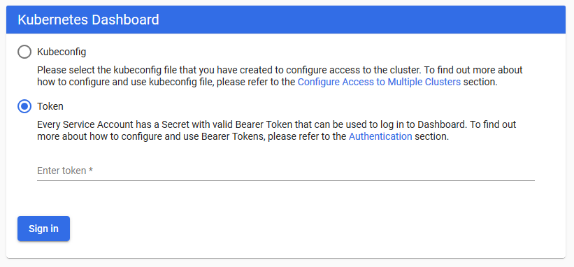

```text
SPDX-License-Identifier: Apache-2.0
Copyright (c) 2019 Intel Corporation
```

# OpenNESS Network Edge: Controller and Edge node setup
- [OpenNESS Network Edge: Controller and Edge node setup](#openness-network-edge-controller-and-edge-node-setup)
- [Preconditions](#preconditions)
- [Running playbooks](#running-playbooks)
  - [Network Edge Playbooks](#network-edge-playbooks)
    - [Cleanup playbooks](#cleanup-playbooks)
    - [Supported EPA features](#supported-epa-features)
    - [Quickstart](#quickstart)
    - [Application on-boarding](#application-on-boarding)
- [Q&amp;A](#qampa)
  - [Configuring time](#configuring-time)
  - [Setup static hostname](#setup-static-hostname)
  - [Configuring inventory](#configuring-inventory)
  - [Exchanging SSH keys with hosts](#exchanging-ssh-keys-with-hosts)
  - [Setting proxy](#setting-proxy)
  - [Setting Git](#setting-git)
    - [GitHub Token](#github-token)
    - [Customize tag/commit/sha to checkout](#customize-tagcommitsha-to-checkout)
  - [Installing Kubernetes Dashboard](#installing-kubernetes-dashboard)

# Preconditions

In order to use the playbooks several preconditions must be fulfilled:

- Time must be configured on all hosts (refer to [Configuring time](#configuring-time))

- Hosts for Edge Controller (Kubernetes master) and Edge Nodes (Kubernetes workers) must have proper and unique hostname (not `localhost`). This hostname must be specified in `/etc/hosts` (refer to [Setup static hostname](#Setup-static-hostname)).

- Ansible inventory must be configured (refer to [Configuring inventory](#configuring-inventory)).

- SSH keys must be exchanged with hosts (refer to [Exchanging SSH keys with hosts](#Exchanging-SSH-keys-with-hosts)).

- Proxy must be configured if needed (refer to [Setting proxy](#setting-proxy)).

- If a private repository is used Github token has to be set up (refer to [GitHub Token](#github-token)).

# Running playbooks

For convenience, playbooks can be executed by running helper deployment scripts.

> NOTE: All nodes provided in the inventory may reboot during the installation.

Convention for the scripts is: `action_mode[_group].sh`. Following scripts are available for Network Edge mode:
  - `deploy_ne.sh` - sets up cluster (first controller, then nodes)
  - `cleanup_ne.sh`
  - `deploy_ne_controller.sh`
  - `deploy_ne_node.sh`

> NOTE: Playbooks for Edge Controller/Kubernetes master must be executed before playbooks for Edge Nodes.

> NOTE: Edge Nodes and Edge Controller must be set up on different machines.

## Network Edge Playbooks

The `ne_controller.yml`, `ne_node.yml` and `ne_cleanup.yml` files contain playbooks for Network Edge mode.
Playbooks can be customized by (un)commenting roles that are optional and by customizing variables where needed.

### Cleanup playbooks

Role of cleanup playbook is to revert changes made by deploy playbooks.
Teardown is made by going step by step in reverse order and undoing the steps.

For example, when installing Docker - RPM repository is added and Docker installed, when cleaning up - Docker is uninstalled and then repository is removed.

Note that there might be some leftovers created by installed software.

### Supported EPA features
A number of enhanced platform capabilities/features are available in OpenNESS for Network Edge. For the full list of features supported see [supported-epa.md](https://github.com/open-ness/specs/blob/master/doc/getting-started/network-edge/supported-epa.md), the documents referenced in the list provide detailed description of the features and step by step instructions how to enable them. The user is advised to get familiarized with the features available before executing the deployment playbooks.

### Quickstart
The following is a complete set of actions that need to be completed to successfully set up OpenNESS cluster.

1. Fulfill the [prerequisites](#preconditions).
2. Get familiarized with [supported features](#supported-epa-features) and enable them if desired.
3. Run the [deployment helper script](#running-playbooks) for the Ansible playbook:
   ```
   ./deploy_ne.sh
   ```

### Application on-boarding

Please refer to [network-edge-applications-onboarding.md](https://github.com/open-ness/specs/blob/master/doc/applications-onboard/network-edge-applications-onboarding.md) document for instructions on how to deploy edge applications for OpenNESS Network Edge.

# Q&A

## Configuring time

By default CentOS ships with [chrony](https://chrony.tuxfamily.org/) NTP client. It uses default NTP servers listed below that might not be available in certain networks:
```
0.centos.pool.ntp.org
1.centos.pool.ntp.org
2.centos.pool.ntp.org
3.centos.pool.ntp.org
```
OpenNESS requires the time to be synchronized between all of the nodes and controllers to allow for correct certificate verification.

To change the default servers run the following commands:
```
# Remove previously set NTP servers
sed -i '/^server /d' /etc/chrony.conf

# Allow significant time difference
# More info: https://chrony.tuxfamily.org/doc/3.4/chrony.conf.html
echo 'maxdistance 999999' >> /etc/chrony.conf

# Add new NTP server(s)
echo 'server <ntp-server-address> iburst' >> /etc/chrony.conf

# Restart chrony service
systemctl restart chronyd
```

To verify that the time is synchronized correctly run the following command:
```
chronyc tracking
```

Sample output:
```
Reference ID    : 0A800239
Stratum         : 3
Ref time (UTC)  : Mon Dec 16 09:10:51 2019
System time     : 0.000015914 seconds fast of NTP time
Last offset     : -0.000002627 seconds
RMS offset      : 0.000229037 seconds
Frequency       : 4.792 ppm fast
Residual freq   : -0.001 ppm
Skew            : 0.744 ppm
Root delay      : 0.008066391 seconds
Root dispersion : 0.003803928 seconds
Update interval : 130.2 seconds
Leap status     : Normal
```

## Setup static hostname

In order to set some custom static hostname a command can be used:

```
hostnamectl set-hostname <host_name>
```

Make sure if static hostname provided is proper and unique (refer to [K8s naming restrictions](https://kubernetes.io/docs/concepts/overview/working-with-objects/names/#names)).
The hostname provided needs to be defined in /etc/hosts as well:

```
127.0.0.1   localhost localhost.localdomain localhost4 localhost4.localdomain4 <host_name>
::1         localhost localhost.localdomain localhost6 localhost6.localdomain6 <host_name>
```

## Configuring inventory

In order to execute playbooks, `inventory.ini` must be configure to include specific hosts to run the playbooks on.

OpenNESS' inventory contains three groups: `all`, `edgenode_group`, and `controller_group`:

- `all` contains all the hosts (with configuration) used in any playbook
- `controller_group` contains host to be set up as a Kubernetes master / OpenNESS Edge Controller \
**WARNING: Since only one Controller is supported, `controller_group` can contain only 1 host.**
- `edgenode_group` contains hosts to be set up as a Kubernetes workers / OpenNESS Edge Nodes. \
**NOTE: All nodes will be joined to the master specified in `controller_group`.**

In `all` group user can specify all of the hosts for usage in other groups.
Example `all` group looks like:

```
[all]
ctrl ansible_ssh_user=root ansible_host=<host_ip_address>
node1 ansible_ssh_user=root ansible_host=<host_ip_address>
node2 ansible_ssh_user=root ansible_host=<host_ip_address>
```

Then user can use specified hosts in `edgenode_group` and `controller_group`, i.e.:

```
[edgenode_group]
node1
node2

[controller_group]
ctrl
```

## Exchanging SSH keys with hosts

Exchanging SSH keys will allow for password-less SSH from host running Ansible to hosts being set up.

First, host running Ansible must have generated SSH key. SSH key can be generated by executing `ssh-keygen` and following program's output. Here's example - key is located in standard location (`/root/.ssh/id_rsa`) and empty passphrase is used.

```
# ssh-keygen

Generating public/private rsa key pair.
Enter file in which to save the key (/root/.ssh/id_rsa):  <ENTER>
Enter passphrase (empty for no passphrase):  <ENTER>
Enter same passphrase again:  <ENTER>
Your identification has been saved in /root/.ssh/id_rsa.
Your public key has been saved in /root/.ssh/id_rsa.pub.
The key fingerprint is:
SHA256:vlcKVU8Tj8nxdDXTW6AHdAgqaM/35s2doon76uYpNA0 root@host
The key's randomart image is:
+---[RSA 2048]----+
|          .oo.==*|
|     .   .  o=oB*|
|    o . .  ..o=.=|
|   . oE.  .  ... |
|      ooS.       |
|      ooo.  .    |
|     . ...oo     |
|      . .*o+.. . |
|       =O==.o.o  |
+----[SHA256]-----+
```

Then, generated key must be copied to **every host from the inventory**. It is done by running `ssh-copy-id`, e.g.:

```
# ssh-copy-id root@host

/usr/bin/ssh-copy-id: INFO: Source of key(s) to be installed: "/root/.ssh/id_rsa.pub"
The authenticity of host '<IP> (<IP>)' can't be established.
ECDSA key fingerprint is SHA256:c7EroVdl44CaLH/IOCBu0K0/MHl8ME5ROMV0AGzs8mY.
ECDSA key fingerprint is MD5:38:c8:03:d6:5a:8e:f7:7d:bd:37:a0:f1:08:15:28:bb.
Are you sure you want to continue connecting (yes/no)? yes
/usr/bin/ssh-copy-id: INFO: attempting to log in with the new key(s), to filter out any that are already installed
/usr/bin/ssh-copy-id: INFO: 1 key(s) remain to be installed -- if you are prompted now it is to install the new keys
root@host's password:

Number of key(s) added: 1

Now try logging into the machine, with:   "ssh 'root@host'"
and check to make sure that only the key(s) you wanted were added.
```

To make sure key is copied successfully, try to SSH to the host: `ssh 'root@host'`. It should not ask for the password.

## Setting proxy

If proxy is required in order to connect to the Internet it can be configured in `group_vars/all.yml` file.
To enable proxy provide values for `proxy_` variables and set `proxy_os_enable` to `true`.
Also append your network CIDR (e.g. `192.168.0.1/24`) to the `proxy_os_noproxy`.

Sample configuration:

```
proxy_yum_url: "http://proxy.example.com:3128/"

proxy_os_enable: true
proxy_os_remove_old: true
proxy_os_http: "http://proxy.example.com:3128"
proxy_os_https: "http://proxy.example.com:3128"
proxy_os_ftp: "http://proxy.example.com:3128"
proxy_os_noproxy: "localhost,127.0.0.1,10.244.0.0/24,10.96.0.0/12,192.168.0.1/24"
```
> NOTE: Ensure the no_proxy environment variable in your profile is set
>  
>     export no_proxy="localhost,127.0.0.1,10.244.0.0/24,10.96.0.0/12,192.168.0.1/24"
## Setting Git

### GitHub Token

> NOTE: Only required when cloning private repositories. Not needed when using github.com/open-ness repositories.

In order to clone private repositories GitHub token must be provided.

To generate GitHub token refer to [GitHub help - Creating a personal access token for the command line](https://help.github.com/en/github/authenticating-to-github/creating-a-personal-access-token-for-the-command-line).

To provide the token, edit value of `git_repo_token` variable in in `group_vars/all.yml`.

### Customize tag/commit/sha to checkout

Specific tag, commit or sha can be checked out by setting `git_repo_branch` variable in `group_vars/edgenode_group.yml` for Edge Nodes and `groups_vars/controller_group.yml` for Kubernetes master / Edge Controller

## Installing Kubernetes Dashboard

Kubernetes does not ship with a graphical interface by default, but a web-based tool called [Kubernetes Dashboard](https://github.com/kubernetes/dashboard) can be installed with few simple steps. Kubernetes Dashboard allows users to manage the cluster and the edge applications.

Kubernetes dashboard can only be installed with Network Edge deployments.

Follow the below steps to get the Kubernetes dashboard installed after OpenNESS is installed through [playbooks](#running-playbooks).

1. Deploy the dashboard using `kubectl`

    ```shell
    kubectl apply -f https://raw.githubusercontent.com/kubernetes/dashboard/v2.0.0-beta4/aio/deploy/recommended.yaml
    ```

2. Grep all the pods & namespaces

    ```shell
    kubectl get pods -o wide --all-namespaces
    ```

3. Create a new service account with the cluster admin

    ```shell
    cat > dashboard-admin-user.yaml << EOF
    apiVersion: v1
    kind: ServiceAccount
    metadata:
      name: admin-user
      namespace: kubernetes-dashboard
    ---
    apiVersion: rbac.authorization.k8s.io/v1
    kind: ClusterRoleBinding
    metadata:
      name: admin-user
    roleRef:
      apiGroup: rbac.authorization.k8s.io
      kind: ClusterRole
      name: cluster-admin
    subjects:
    - kind: ServiceAccount
      name: admin-user
      namespace: kubernetes-dashboard
    EOF
    ```

4. Apply admin user

    ```shell
    kubectl apply -f dashboard-admin-user.yaml
    ```

5. Edit kubernetes-dashboard service and change `type: ClusterIP` to `type: NodePort` and save the file

    ```shell
    kubectl -n kubernetes-dashboard edit service kubernetes-dashboard
    ```

6. Note the port on which the dashboard is exposed

    ```shell
    kubectl -n kubernetes-dashboard get service kubernetes-dashboard
    ```

7. Open the dashboard from the browser at `https://<controller-ip>:<port>/`, use the port that was noted in the previous steps

> **NOTE**: Firefox browser can be an alternative to Chrome and Internet Explorer in case the dashboard web page is blocked due to certification issue. 

8. Capture the bearer token using this command

    ```shell
    kubectl -n kubernetes-dashboard describe secret $(kubectl -n kubernetes-dashboard get secret | grep admin-user | awk '{print $1}')
    ```

Paste the Token in the browser to log in as shown in this diagram


_Figure - Kubernetes Dashboard Login_

9. Go to the OpenNESS Controller installation directory and edit the `.env` file with the dashboard link `INFRASTRUCTURE_UI_URL=https://<controller-ip>:<port>/#` in order to get it integrated with the OpenNESS controller UI (note the `#` symbole at the end of the URL)

    ```shell
    cd /opt/edgecontroller/
    vi .env
    ```

10. Build the OpenNESS Controller UI

    ```shell
    cd /opt/edgecontroller/
    make ui-up
    ```

11. The OpenNESS controller landing page is accessible at `http://<LANDING_UI_URL>/`.
    > **NOTE**: `LANDING_UI_URL` can be retrieved from `.env` file.
