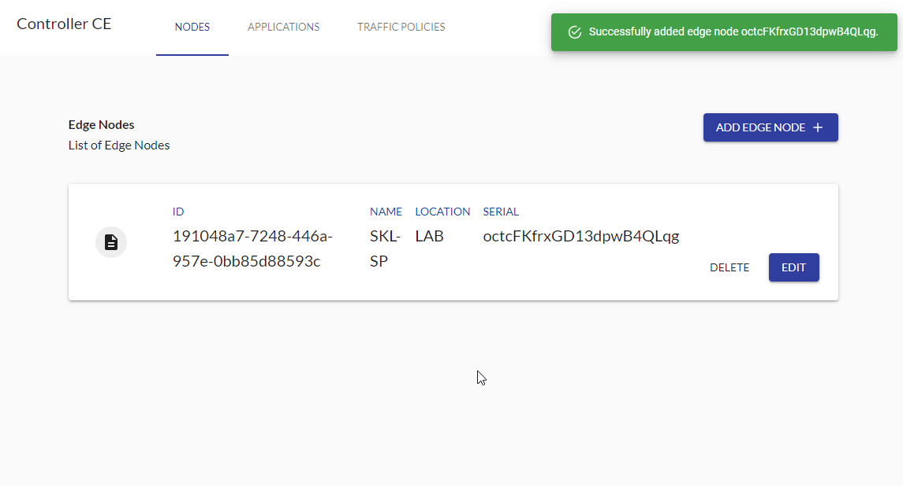
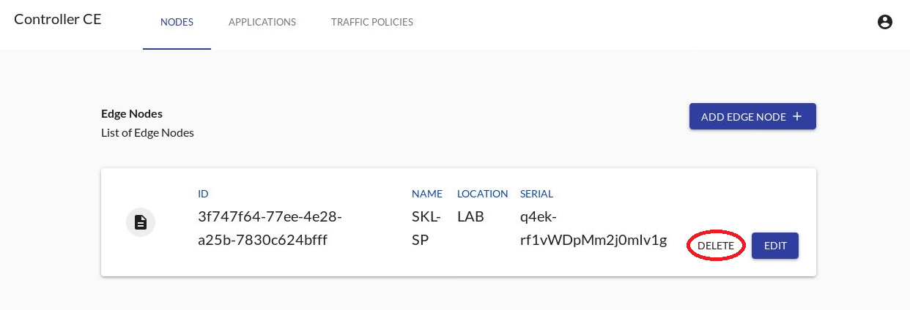
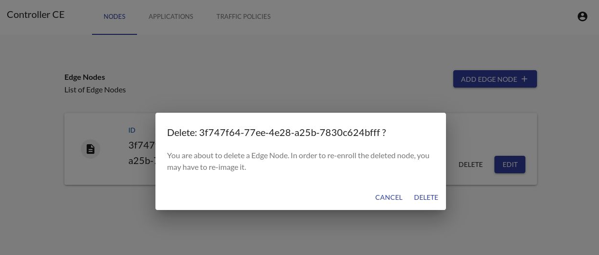
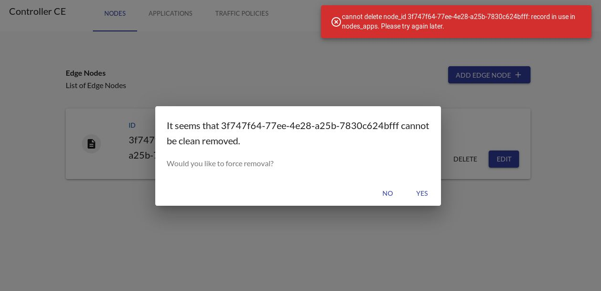
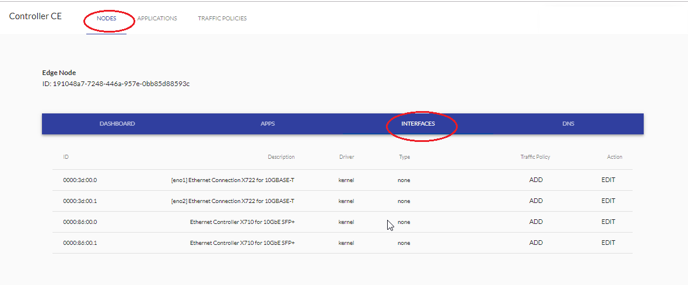
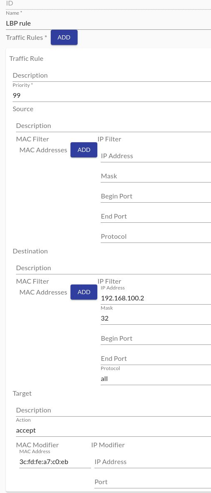

```text
SPDX-License-Identifier: Apache-2.0
Copyright (c) 2019-2020 Intel Corporation
```
<!-- omit in toc -->
# OpenNESS OnPremises: Controller and Edge node setup
- [Purpose](#purpose)
- [Preconditions](#preconditions)
- [Running playbooks](#running-playbooks)
  - [On Premise Playbooks](#on-premise-playbooks)
    - [Cleanup playbooks](#cleanup-playbooks)
    - [Dataplanes](#dataplanes)
  - [Manual steps](#manual-steps)
    - [Enrolling Nodes with Controller](#enrolling-nodes-with-controller)
      - [First Login](#first-login)
      - [Manual enrollment](#manual-enrollment)
      - [Deleting node](#deleting-node)
    - [NTS Configuration](#nts-configuration)
      - [Displaying Edge Node's Interfaces](#displaying-edge-nodes-interfaces)
      - [Configuring Interface](#configuring-interface)
      - [Starting NTS](#starting-nts)
      - [Preparing set-up for Local Breakout Point (LBP)](#preparing-set-up-for-local-breakout-point-lbp)
        - [Controller and Edge Node deployment](#controller-and-edge-node-deployment)
        - [Network configuration](#network-configuration)
        - [Configuration in Controller](#configuration-in-controller)
        - [Verification](#verification)
    - [Configuring DNS](#configuring-dns)
- [Q&A](#qa)
  - [Configuring time](#configuring-time)
  - [Setup static hostname](#setup-static-hostname)
  - [Configuring inventory](#configuring-inventory)
  - [Exchanging SSH keys with hosts](#exchanging-ssh-keys-with-hosts)
  - [Setting proxy](#setting-proxy)
  - [Setting Git](#setting-git)
    - [GitHub Token](#github-token)
    - [Customize tag/branch/sha to checkout](#customize-tagbranchsha-to-checkout)
  - [Obtaining Edge Node's serial with command](#obtaining-edge-nodes-serial-with-command)
  - [Customization of kernel, grub parameters and tuned profile](#customization-of-kernel-grub-parameters-and-tuned-profile)

# Purpose

OpenNESS Experience Kits repository contains set of Ansible playbooks for easy setup of OpenNESS in Network Edge and On-Premise modes.

# Preconditions

In order to use the playbooks several preconditions must be fulfilled:

- CentOS 7.6.1810 operating installed on hosts where product will be deployed. It is highly recommended to install operating system using a minimal ISO image on nodes that will take part in deployment (obtained from inventory file) and do not make own customizations after a fresh manuall install, since they might interfere with Ansible scripts and give unpredictable results during deployment.

- Time must be configured on all hosts (refer to [Configuring time](#configuring-time))

- Hosts for Edge Controller and Edge Nodes must have proper and unique hostname (not `localhost`). This hostname must be specified in `/etc/hosts` (refer to [Setup static hostname](#Setup-static-hostname)).

- Inventory must be configured (refer to [Configuring inventory](#configuring-inventory))

- SSH keys must be exchanged with hosts (refer to [Exchanging SSH keys with hosts](#Exchanging-SSH-keys-with-hosts))

- Proxy must be configured if needed (refer to [Setting proxy](#setting-proxy))

- If a private repository is used Github token has to be set up (refer to [GitHub Token](#github-token))

# Running playbooks

For convenience, playbooks can be played by running helper deploy scripts.
Convention for the scripts is: `action_mode.sh [group]`. Following scripts are available for On Premise mode:
  - `cleanup_onprem.sh [ controller | nodes ]`
  - `deploy_onprem.sh [ controller | nodes ]`

To run deploy of only Edge Nodes or Edge Controller use `deploy_ne.sh nodes` and `deploy_ne.sh controller` respectively.

> NOTE: All nodes provided in the inventory might get rebooted during the installation.

> NOTE: Playbooks for Controller must be played before playbooks for Edge Nodes.

> NOTE: Edge Nodes and Edge Controller must be set up on different machines.

## On Premise Playbooks

`on_premises.yml` and `on_premises_cleanup.yml` contain playbooks for On Premise mode.
Playbooks can be customized by enabling and configuring features in `group_var/all/10-default.yml` file.

### Cleanup playbooks

Role of cleanup playbook is to revert changes made by deploy playbooks.
Teardown is made by going step by step in reverse order and undo the steps.

For example, when installing Docker - RPM repository is added and Docker installed, when cleaning up - Docker is uninstalled and then repository is removed.

Note that there might be some leftovers created by installed software.

### Dataplanes
OpenNESS' On Premises delivers two dataplanes to be used:
* NTS (default)
* OVS/OVN

In order to use OVS/OVN instead of NTS, `onprem_dataplane` variable must be edited in `group_vars/all/10-default.yml` file before running the deployment scripts:
```yaml
onprem_dataplane: "ovncni"
```
> NOTE: When deploying virtual machine with OVNCNI dataplane, `/etc/resolv.conf` must be edited to use `192.168.122.1` nameserver.

## Manual steps

> *Ansible Controller* is a machine with [openness-experience-kits](https://github.com/open-ness/openness-experience-kits) repo and it's used to configure *Edge Controller* and *Edge Nodes*. Please be careful not to confuse them.

After the deployment scripts are run there are still some manual steps required to setup the environment.

### Enrolling Nodes with Controller

#### First Login

In order to access the UI the user needs to provide credentials during login.

Prerequisites (*Ansible Controller*):
 - An internet browser to access the login page.
 - If working behind firewall or proxy appropriate ports open and *Edge Controller* **Hostname and IP** added to browser's *no_proxy*.

The following steps need to be done for successful login:

1. Open internet browser on *Ansible Controller*.
2. Type in `http://<LANDING_UI_URL>/` in address bar. `LANDING_UI_URL` can be retrieved from `.env` file.
3. Enter you username and password (default username: admin) (the password to be used is the password provided during Controller bring-up with the **cce_admin_password** in *openness-experience-kits/group_vars/all/10-default.yml*).
4. Click on "SIGN IN" button.


#### Manual enrollment

> NOTE: Following steps are now part of Ansible automated platform setup. Manual steps are left for reference.

In order for the Controller and Edge Node to work together the Edge Node needs to enroll with the Controller. The Edge Node will continuously try to connect to the controller until its serial key is recognized by the Controller.

Prerequisites:

- User has logged in to UI.

In order to enroll and add new Edge Node to be managed by the Controller the following steps are to be taken:

1. Get the Nodes' serial numbers, which is saved by ansible script to following file: /opt/edgenode/verification_key.txt (for alternative way to obtain serial refer to [Obtaining Edge Node's serial with command](#obtaining-edge-nodes-serial-with-command)).
2. Navigate to 'NODES' tab.
3. Click on 'ADD EDGE NODE' button.


4. Enter previously obtained Edge Node Serial Key into 'Serial*' field (Step 1).
5. Enter the name and location of Edge Node.
6. Press 'ADD EDGE NODE'.


7. Check that your Edge Node is visible under 'List of Edge Nodes'.



#### Deleting node

> In order to delete node, all deployed apps and applied configuration should be deleted first.

To delete enrolled node please use the button 'DELETE' located on the node's panel.



This will be followed by confirmation dialog.



If you are sure you want to delete the node please select `DELETE` and wait for node's removal. However, please remember that all apps, traffic policies, and DNS configurations added to the node should be deleted previously. If an error will occur during the node's removal (e.g. node will be offline or some app will be still deployed) you will see an error's description on the screen together with question if you want to force the node's removal.



**Please always remember, that if you will force-remove node, it may be not possible to reuse it without reinstallation.**

If you are sure that you want to remove the node please click `YES` and wait till it disappear from the list of nodes.

### NTS Configuration
OpenNESS data-plane interface configuration.

#### Displaying Edge Node's Interfaces
Prerequisites:
- Enrollment phase completed successfully.
- User is logged in to UI.

To check the interfaces available on the Edge Node execute following steps:
1. From UI go to 'NODES' tab.
2. Find you Edge Node on the list.
3. Click 'EDIT'.


5. Navigate to 'INTERFACES' tab.
6. Available interfaces are listed.



#### Configuring Interface
Prerequisites:
- Enrollment phase completed successfully.
- User is logged in to UI.

In order to configure interface available on the Edge Node for the NTS the following steps are to be taken:
1. From UI navigate to 'INTERFACES' tab of the Edge Node.
2. Find the interface to be used in the interface list and click 'EDIT' button under 'Action' column for that interface.

| WARNING: do not modify a NIC which is used for Internet connection! |
| ------------------------------------------------------------------- |

> Note: For adding traffic policy to interface refere to following section in on-premises-applications-onboarding.md: [Instruction to create Traffic Policy and assign it to Interface](https://github.com/open-ness/specs/blob/master/doc/applications-onboard/on-premises-applications-onboarding.md#instruction-to-create-traffic-policy-and-assign-it-to-interface)


1. A window will pop-up titled "Edit Interface". The following fields need to be set:
  - Driver: userspace
  - Type: upstream
  - Fall-back Interface: PCI address of another available interface ie. '0000:86:00.1'
  - In case of two interfaces being configured, one for 'Upstream' another for 'Downstream', the fallback interface for 'Upstream' is the 'Downstream' interface and vice versa.
2. Click 'SAVE'.


3. The interface's 'Driver' and 'Type' columns will reflect changes made.


#### Starting NTS
Prerequisite:
- Enrollment phase completed successfully.
- User is logged in to UI.
- Interfaces to be used by NTS configured correctly.

> Note: In this example 2 interfaces are used by NTS. One interface of 'Type: upstream' and a second interface of 'Type: downstream'.

> Note: <br />  UPSTREAM = Data-plane communication from eNodeB/traffic generator -> OpenNESS EdgeNode and vice versa. <br />
DOWNSTREAM = Data-plane communication from OpenNESS EdgeNode -> EPC/PDN and vice versa.

Once the interfaces are configured accordingly the following steps need to be done:
1. From UI navigate to 'INTERFACES' tab of the Edge Node.
2. Click 'COMMIT CHANGES'


3. NTS will start


4. Make sure that the **nts** and **edgednssvr** containers are running on an *Edge Node* machine:


#### Preparing set-up for Local Breakout Point (LBP)

It is possible in a set up with NTS used as dataplane to prepare following LBP configuration
- LBP set-up requirements: five machines are used as following set-up elements
  - Controller
  - Edge Node
  - UE
  - LBP
  - EPC
- Edge Node is connected via 10GB cards to UE, LBP, EPC
- network configuration of all elements is given on the diagram:

  

- configuration of interfaces for each server is done in Controller
- ARP configuration is done on servers
- IP addresses 10.103.104.X are addresses of machines from local subnet used for building set-up
- IP addresses 192.168.100.X are addresses given for LBP test purpose

##### Controller and Edge Node deployment

Build and deploy Controller and Edge Node using ansible scripts and instructions in this document.

##### Network configuration

Find interface with following commands
-  `ifconfig`
or
- `ip a`

Command `ethtool -p <interface>` can be used to identify port (port on physical machine will start to blink and it will be possible to verify if it is valid port).

Use following commands to configure network on servers in set up
- UE
  - `ifconfig <interface> 192.168.100.1/24 up`
  - `arp -s 192.168.100.2 <mac address>` (e.g. `arp -s 192.168.100.2 3c:fd:fe:a7:c0:eb`)
- LBP
  - `ifconfig <interface> 192.168.100.2/24 up`
  - `arp -s 192.168.100.1 <mac address>` (e.g. `arp -s 192.168.100.1 90:e2:ba:ac:6a:d5`)
- EPC
  - `ifconfig <interface> 192.168.100.3/24 up`


Alternatively to using `ifconfig` configuration can be done with `ip` command:
`ip address add <address> dev <interface>` (e.g.`ip address add 192.168.100.1/24 dev enp23s0f0`)

##### Configuration in Controller

Add traffic policy with rule for LBP:

- Name: LBP rule
- Priority: 99
- Destination:
  - IP filter:
    - IP address: 192.168.100.2
    - Mask: 32
    - Protocol: all
- Target:
  - Action: accept
- MAC Modifier
  - MAC address: 3c:fd:fe:a7:c0:eb



Update interfaces:
- edit interfaces to UE, LBP, EPC as shown on diagram (Interface set-up)
- add Traffic policy (LBP rule) to LBP interface (0000:88.00.2)

After configuring NTS send PING (it is needed by NTS) from UE to EPC (`ping 192.168.100.3`).

##### Verification

1. NES client
  - SSH to UE machine and ping LBP (`ping 192.168.100.2`)
  - SSH to Edge Node server
    - Set following environment variable: `export NES_SERVER_CONF=/var/lib/appliance/nts/nts.cfg`
    - Run NES client: `<path_to_edgenode_repoistory>/internal/nts/client/build/nes_client`
      - connect to NTS using command `connect`
      - use command `route list` to verify traffic rule for LBP
      - use command `show all` to verify packet flow (received and sent packet should increase)
      - use command `quit` to exit (use `help` for information on available commands)

    ```shell
    # connect
    Connection is established.
    # route list
    +-------+------------+--------------------+--------------------+--------------------+--------------------+-------------+-------------+--------+----------------------+
    | ID    | PRIO       | ENB IP             | EPC IP             | UE IP              | SRV IP             | UE PORT     | SRV PORT    | ENCAP  | Destination          |
    +-------+------------+--------------------+--------------------+--------------------+--------------------+-------------+-------------+--------+----------------------+
    | 0     | 99         | n/a                | n/a                | 192.168.100.2/32   | *                  | *           | *           | IP     | 3c:fd:fe:a7:c0:eb    |
    | 1     | 99         | n/a                | n/a                | *                  | 192.168.100.2/32   | *           | *           | IP     | 3c:fd:fe:a7:c0:eb    |
    | 2     | 5          | n/a                | n/a                | *                  | 53.53.53.53/32     | *           | *           | IP     | 8a:68:41:df:fa:d5    |
    | 3     | 5          | n/a                | n/a                | 53.53.53.53/32     | *                  | *           | *           | IP     | 8a:68:41:df:fa:d5    |
    | 4     | 5          | *                  | *                  | *                  | 53.53.53.53/32     | *           | *           | GTPU   | 8a:68:41:df:fa:d5    |
    | 5     | 5          | *                  | *                  | 53.53.53.53/32     | *                  | *           | *           | GTPU   | 8a:68:41:df:fa:d5    |
    +-------+------------+--------------------+--------------------+--------------------+--------------------+-------------+-------------+--------+----------------------+
    # show all
    ID:          Name:                  Received:                       Sent:           Dropped(TX full):                Dropped(HW):                IP Fragmented(Forwarded):
    0  0000:88:00.1                          1303 pkts                    776 pkts                      0 pkts                      0 pkts                      0 pkts
        (3c:fd:fe:b2:44:b1)                127432 bytes                 75820 bytes                     0 bytes
    1  0000:88:00.2                          1261 pkts                   1261 pkts                      0 pkts                      0 pkts                      0 pkts
        (3c:fd:fe:b2:44:b2)                123578 bytes                123578 bytes                     0 bytes
    2  0000:88:00.3                            40 pkts                     42 pkts                      0 pkts                      0 pkts                      0 pkts
        (3c:fd:fe:b2:44:b3)                  3692 bytes                  3854 bytes                     0 bytes
    3           KNI                             0 pkts                      0 pkts                      0 pkts                      0 pkts                      0 pkts
          (not registered)                       0 bytes                     0 bytes                     0 bytes
    # show all
    ID:          Name:                  Received:                       Sent:           Dropped(TX full):                Dropped(HW):                IP Fragmented(Forwarded):
    0  0000:88:00.1                          1304 pkts                    777 pkts                      0 pkts                      0 pkts                      0 pkts
        (3c:fd:fe:b2:44:b1)                127530 bytes                 75918 bytes                     0 bytes
    1  0000:88:00.2                          1262 pkts                   1262 pkts                      0 pkts                      0 pkts                      0 pkts
        (3c:fd:fe:b2:44:b2)                123676 bytes                123676 bytes                     0 bytes
    2  0000:88:00.3                            40 pkts                     42 pkts                      0 pkts                      0 pkts                      0 pkts
        (3c:fd:fe:b2:44:b3)                  3692 bytes                  3854 bytes                     0 bytes
    3           KNI                             0 pkts                      0 pkts                      0 pkts                      0 pkts                      0 pkts
          (not registered)                       0 bytes                     0 bytes                     0 bytes
    ```

2. Tcpdump

- SSH to UE machine and ping LBP (`ping 192.168.100.2`)
- SSH to LBP server.
  - Run tcpdump with name of interface connected to Edge Node, verify data flow, use Ctrl+c to stop.

  ```shell
  # tcpdump -i enp23s0f3
  tcpdump: verbose output suppressed, use -v or -vv for full protocol decode
  listening on enp23s0f3, link-type EN10MB (Ethernet), capture size 262144 bytes
  10:29:14.678250 IP 192.168.100.1 > twesolox-mobl.ger.corp.intel.com: ICMP echo request, id 9249, seq 320, length 64
  10:29:14.678296 IP twesolox-mobl.ger.corp.intel.com > 192.168.100.1: ICMP echo reply, id 9249, seq 320, length 64
  10:29:15.678240 IP 192.168.100.1 > twesolox-mobl.ger.corp.intel.com: ICMP echo request, id 9249, seq 321, length 64
  10:29:15.678283 IP twesolox-mobl.ger.corp.intel.com > 192.168.100.1: ICMP echo reply, id 9249, seq 321, length 64
  10:29:16.678269 IP 192.168.100.1 > twesolox-mobl.ger.corp.intel.com: ICMP echo request, id 9249, seq 322, length 64
  10:29:16.678312 IP twesolox-mobl.ger.corp.intel.com > 192.168.100.1: ICMP echo reply, id 9249, seq 322, length 64
  10:29:17.678241 IP 192.168.100.1 > twesolox-mobl.ger.corp.intel.com: ICMP echo request, id 9249, seq 323, length 64
  10:29:17.678285 IP twesolox-mobl.ger.corp.intel.com > 192.168.100.1: ICMP echo reply, id 9249, seq 323, length 64
  10:29:18.678215 IP 192.168.100.1 > twesolox-mobl.ger.corp.intel.com: ICMP echo request, id 9249, seq 324, length 64
  10:29:18.678258 IP twesolox-mobl.ger.corp.intel.com > 192.168.100.1: ICMP echo reply, id 9249, seq 324, length 64
  ^C
  10 packets captured
  10 packets received by filter
  0 packets dropped by kernel
  ```

### Configuring DNS
* [Instructions for configuring DNS](https://github.com/open-ness/specs/blob/master/doc/applications-onboard/openness-edgedns.md)

# Q&A

## Configuring time

By default CentOS ships with [chrony](https://chrony.tuxfamily.org/) NTP client. It uses default NTP servers listed below that might not be available in certain networks:
```
0.centos.pool.ntp.org
1.centos.pool.ntp.org
2.centos.pool.ntp.org
3.centos.pool.ntp.org
```
OpenNESS requires the time to be synchronized between all of the nodes and controllers to allow for correct certificate verification.

OpenNESS provides possibility to synchronize machine's time with NTP server.
To enable NTP synchronization change `ntp_enable` in `group_var/all/10-default.yml`:
```yaml
ntp_enable: true
```

Servers to be used instead of default ones can be provided using `ntp_servers` variable in `group_var/all/10-default.yml`:
```yaml
ntp_servers: ["ntp.local.server"]
```

## Setup static hostname

In order to set some custom static hostname a command can be used:

```
hostnamectl set-hostname <host_name>
```

Make sure that static hostname provided is proper and unique.
The hostname provided needs to be defined in /etc/hosts as well:

```
127.0.0.1   localhost localhost.localdomain localhost4 localhost4.localdomain4 <host_name>
::1         localhost localhost.localdomain localhost6 localhost6.localdomain6 <host_name>
```

## Configuring inventory

In order to execute playbooks, `inventory.ini` must be configure to include specific hosts to run the playbooks on.

OpenNESS' inventory contains three groups: `all`, `edgenode_group`, and `controller_group`:

- `all` contains all the hosts (with configuration) used in any playbook
- `controller_group` contains host to be set up as a Kubernetes master / OpenNESS Edge Controller \
**WARNING: Since only one Controller is supported, `controller_group` can contain only 1 host.**
- `edgenode_group` contains hosts to be set up as a Kubernetes workers / OpenNESS Edge Nodes. \
**NOTE: All nodes will be joined to the master specified in `controller_group`.**

In `all` group you can specify all of your hosts for usage in other groups.
Example `all` group looks like:

```ini
[all]
ctrl ansible_ssh_user=root ansible_host=192.168.0.2
node1 ansible_ssh_user=root ansible_host=192.168.0.3
node2 ansible_ssh_user=root ansible_host=192.168.0.4
```

>NOTE: All nodes have to be specified using an IP address.

Then you can use those hosts in `edgenode_group` and `controller_group`, i.e.:

```ini
[edgenode_group]
node1
node2

[controller_group]
ctrl
```

## Exchanging SSH keys with hosts

Exchanging SSH keys will allow for password-less SSH from host running Ansible to hosts being set up.

First, host running Ansible must have generated SSH key. SSH key can be generated by executing `ssh-keygen` and following program's output. Here's example - key is located in standard location (`/root/.ssh/id_rsa`) and empty passphrase is used.

```
# ssh-keygen

Generating public/private rsa key pair.
Enter file in which to save the key (/root/.ssh/id_rsa):  <ENTER>
Enter passphrase (empty for no passphrase):  <ENTER>
Enter same passphrase again:  <ENTER>
Your identification has been saved in /root/.ssh/id_rsa.
Your public key has been saved in /root/.ssh/id_rsa.pub.
The key fingerprint is:
SHA256:vlcKVU8Tj8nxdDXTW6AHdAgqaM/35s2doon76uYpNA0 root@host
The key's randomart image is:
+---[RSA 2048]----+
|          .oo.==*|
|     .   .  o=oB*|
|    o . .  ..o=.=|
|   . oE.  .  ... |
|      ooS.       |
|      ooo.  .    |
|     . ...oo     |
|      . .*o+.. . |
|       =O==.o.o  |
+----[SHA256]-----+
```

Then, generated key must be copied to **every host from the inventory**. It is done by running `ssh-copy-id`, e.g.:

```
# ssh-copy-id root@host

/usr/bin/ssh-copy-id: INFO: Source of key(s) to be installed: "/root/.ssh/id_rsa.pub"
The authenticity of host '<IP> (<IP>)' can't be established.
ECDSA key fingerprint is SHA256:c7EroVdl44CaLH/IOCBu0K0/MHl8ME5ROMV0AGzs8mY.
ECDSA key fingerprint is MD5:38:c8:03:d6:5a:8e:f7:7d:bd:37:a0:f1:08:15:28:bb.
Are you sure you want to continue connecting (yes/no)? yes
/usr/bin/ssh-copy-id: INFO: attempting to log in with the new key(s), to filter out any that are already installed
/usr/bin/ssh-copy-id: INFO: 1 key(s) remain to be installed -- if you are prompted now it is to install the new keys
root@host's password:

Number of key(s) added: 1

Now try logging into the machine, with:   "ssh 'root@host'"
and check to make sure that only the key(s) you wanted were added.
```

To make sure key is copied successfully, try to SSH to the host: `ssh 'root@host'`. It should not ask for the password.

## Setting proxy

If proxy is required in order to connect to the Internet it can be configured in `group_vars/all/10-default.yml` file.
To enable proxy provide values for `proxy_` variables and set `proxy_enable` to `true`.
Also append your network CIDR (e.g. `192.168.0.1/24`) to the `proxy_noproxy`.

Sample configuration:

```yaml
# Setup proxy on the machine - required if the Internet is accessible via proxy
proxy_enable: true
# Clear previous proxy settings
proxy_remove_old: true
# Proxy URLs to be used for HTTP, HTTPS and FTP
proxy_http: "http://proxy.example.org:3128"
proxy_https: "http://proxy.example.org:3129"
proxy_ftp: "http://proxy.example.org:3128"
# Proxy to be used by YUM (/etc/yum.conf)
proxy_yum: "{{ proxy_http }}"
# No proxy setting contains addresses and networks that should not be accessed using proxy (e.g. local network, Kubernetes CNI networks)
# NOTE - VCA: 172.32.1.0/24 is used for VCA node.
proxy_noproxy: "localhost,virt-api,kubevirt.svc,virt-api.kubevirt.svc,cdi-api,cdi.svc,127.0.0.1,10.244.0.0/16,10.96.0.0/16,10.16.0.0/16,10.32.0.0/12,172.32.1.0/24,192.168.0.1/24"
```

## Setting Git

### GitHub Token

> NOTE: Only required when cloning private repositories. Not needed when using github.com/open-ness repositories.

In order to clone private repositories GitHub token must be provided.

To generate GitHub token refer to [GitHub help - Creating a personal access token for the command line](https://help.github.com/en/github/authenticating-to-github/creating-a-personal-access-token-for-the-command-line).

To provide the token, edit value of `git_repo_token` variable in in `group_vars/all/10-default.yml`.

### Customize tag/branch/sha to checkout

Specific tag, branch or commit SHA can be checked out by setting `controller_repository_branch` and `edgenode_repository_branch` variables in `group_vars/all/10-default.yml` for Edge Nodes and Kubernetes master / Edge Controller respectively.

```yaml
controller_repository_branch: master
edgenode_repository_branch: master
# or
controller_repository_branch: openness-20.03
edgenode_repository_branch: openness-20.03
```

## Obtaining Edge Node's serial with command

Alternatively to reading from /opt/edgenode/verification_key.txt Edge Node's serial can be obtained using following command run on Edgenode machine:

```bash
openssl pkey -pubout -in /var/lib/appliance/certs/key.pem -inform pem -outform der | md5sum | xxd -r -p | openssl enc -a | tr -d '=' | tr '/+' '_-'
```

## Customization of kernel, grub parameters and tuned profile

OpenNESS Experience Kits provides easy way to customize kernel version, grub parameters and tuned profile - for more information refer to [the OpenNESS Experience Kits guide](https://github.com/open-ness/specs/blob/master/doc/getting-started/openness-experience-kits.md).
