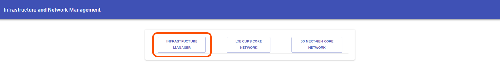
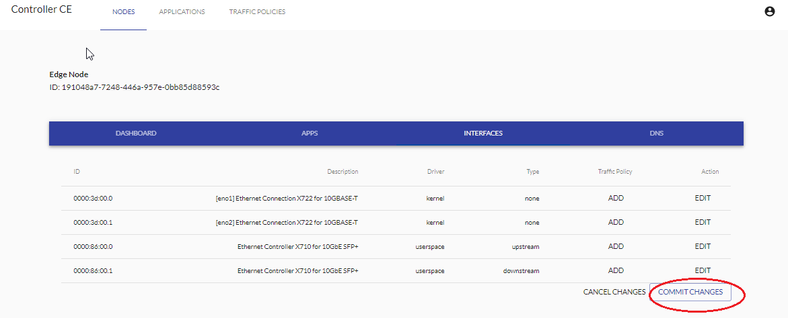
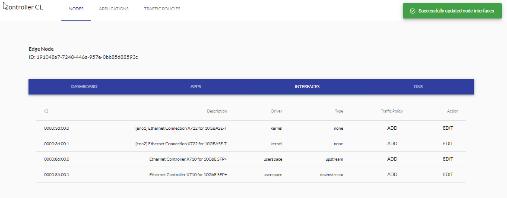
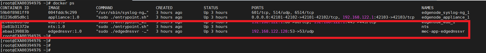

```text
SPDX-License-Identifier: Apache-2.0
Copyright (c) 2019 Intel Corporation
```

# OpenNESS OnPremises: Controller and Edge node setup

- [OpenNESS OnPremises: Controller and Edge node setup](#openness-onpremises-controller-and-edge-node-setup)
- [Purpose](#purpose)
- [Preconditions](#preconditions)
- [Running playbooks](#running-playbooks)
  - [On Premise Playbooks](#on-premise-playbooks)
    - [Cleanup playbooks](#cleanup-playbooks)
  - [Manual steps](#manual-steps)
    - [Enrolling Nodes with Controller](#enrolling-nodes-with-controller)
      - [First Login](#first-login)
      - [Enrollment](#enrollment)
    - [NTS Configuration](#nts-configuration)
      - [Displaying Edge Node's Interfaces](#displaying-edge-nodes-interfaces)
      - [Creating Traffic Policy](#creating-traffic-policy)
      - [Adding Traffic Policy to Interface](#adding-traffic-policy-to-interface)
      - [Configuring Interface](#configuring-interface)
      - [Starting NTS](#starting-nts)
- [Q&amp;A](#qampa)
  - [Configuring time](#configuring-time)
  - [Configuring inventory](#configuring-inventory)
  - [Exchanging SSH keys with hosts](#exchanging-ssh-keys-with-hosts)
  - [Setting proxy](#setting-proxy)
  - [Setting Git](#setting-git)
    - [GitHub Token](#github-token)
    - [Customize tag/commit/sha to checkout](#customize-tagcommitsha-to-checkout)
  - [Obtaining Edge Node's serial with command](#obtaining-edge-nodes-serial-with-command)

# Purpose

OpenNESS Experience Kits repository contains set of Ansible playbooks for easy setup of OpenNESS in Network Edge and On-Premise modes.

# Preconditions

In order to use the playbooks several preconditions must be fulfilled:

- Time must be configured on all hosts (refer to [Configuring time](#configuring-time))

- Inventory must be configured (refer to [Configuring inventory](#configuring-inventory))

- SSH keys must be exchanged with hosts (refer to [Exchanging SSH keys with hosts](#Exchanging-SSH-keys-with-hosts))

- Proxy must be configured if needed (refer to [Setting proxy](#setting-proxy))

- If a private repository is used Github token has to be set up (refer to [GitHub Token](#github-token))

# Running playbooks

For convenience, playbooks can be played by running helper deploy scripts.
Convention for the scripts is: `action_mode[_group].sh`. Following scripts are available for On Premise mode:
  - `cleanup_onprem.sh`
  - `deploy_onprem_controller.sh`
  - `deploy_onprem_node.sh`

> NOTE: All nodes provided in the inventory might get rebooted during the installation.

> NOTE: Playbooks for Controller must be played before playbooks for Edge Nodes.

> NOTE: Edge Nodes and Edge Controller must be set up on different machines.

## On Premise Playbooks

`onprem_controller.yml`, `onprem_node.yml` and `onprem_cleanup.yml` contain playbooks for On Premise mode. Playbooks can be customized by (un)commenting roles that are optional and by customizing variables where needed.

### Cleanup playbooks

Role of cleanup playbook is to revert changes made by deploy playbooks.
Teardown is made by going step by step in reverse order and undo the steps.

For example, when installing Docker - RPM repository is added and Docker installed, when cleaning up - Docker is uninstalled and then repository is removed.

Note that there might be some leftovers created by installed software.

## Manual steps

> *Ansible Controller* is a machine with [openness-experience-kits](https://github.com/open-ness/openness-experience-kits) repo and it's used to configure *Edge Controller* and *Edge Nodes*. Please be careful not to confuse them.

After the deployment scripts are run there are still some manual steps required to setup the environment.

### Enrolling Nodes with Controller

#### First Login

In order to access the UI the user needs to provide credentials during login.

Prerequisites (*Ansible Controller*):
 - An internet browser to access the login page.
 - If working behind firewall or proxy appropriate ports open and *Edge Controller* **Hostname and IP** added to browser's *no_proxy*.

The following steps need to be done for successful login:

1. Open internet browser on *Ansible Controller*.
2. Type in `http://<EDGE_CONTROLLER_HOSTNAME>:3000` in address bar.
3. Click on "INFRASTRUCTURE MANAGER" button.



4. Enter you username and password (default username: admin) (the password to be used is the password provided during Controller bring-up with the **cce_admin_password** in *openness-experience-kits/group_vars/all.yml*).
5. Click on "SIGN IN" button.


#### Enrollment

In order for the Controller and Edge Node to work together the Edge Node needs to enroll with the Controller. The Edge Node will continuously try to connect to the controller until its serial key is recognized by the Controller.

Prerequisites:

- User has logged in to UI.

In order to enroll and add new Edge Node to be managed by the Controller the following steps are to be taken:

1. Get the Nodes' serial numbers, which is saved by ansible script to following file: /opt/edgenode/verification_key.txt (for alternative way to obtain serial refer to [Obtaining Edge Node's serial with command](#obtaining-edge-nodes-serial-with-command)).
2. Navigate to 'NODES' tab.
3. Click on 'ADD EDGE NODE' button.


4. Enter previously obtained Edge Node Serial Key into 'Serial*' field (Step 1).
5. Enter the name and location of Edge Node.
6. Press 'ADD EDGE NODE'.


7. Check that your Edge Node is visible under 'List of Edge Nodes'.


### NTS Configuration
OpenNESS data-plane interface configuration.

#### Displaying Edge Node's Interfaces
Prerequisites:
- Enrollment phase completed successfully.
- User is logged in to UI.

To check the interfaces available on the Edge Node execute following steps:
1. From UI go to 'NODES' tab.
2. Find you Edge Node on the list.
3. Click 'EDIT'.


5. Navigate to 'INTERFACES' tab.
6. Available interfaces are listed.


#### Creating Traffic Policy
Prerequisites:
- Enrollment phase completed successfully.
- User is logged in to UI.

The steps to create a sample traffic policy are as follows:
1. From UI navigate to 'TRAFFIC POLICIES' tab.
2. Click 'ADD POLICY'.

> Note: This specific traffic policy is only an example.


3. Give policy a name.
4. Click 'ADD' next to 'Traffic Rules*' field.
5. Fill in following fields:
  - Description: "Sample Description"
  - Priority: 99
  - Source -> IP Filter -> IP Address: 1.1.1.1
  - Source -> IP Filter -> Mask: 24
  - Source -> IP Filter -> Begin Port: 10
  - Source -> IP Filter -> End Port: 20
  - Source -> IP Filter -> Protocol: all
  - Target -> Description: "Sample Description"
  - Target -> Action: accept
6. Click on "CREATE".


After creating Traffic Policy it will be visible under 'List of Traffic Policies' in 'TRAFFIC POLICIES' tab.


#### Adding Traffic Policy to Interface
Prerequisites:
- Enrollment phase completed successfully.
- User is logged in to UI.
- Traffic Policy Created.

To add a previously created traffic policy to an interface available on Edge Node the following steps need to be completed:
1. From UI navigate to "NODES" tab.
2. Find Edge Node on the 'List Of Edge Nodes'.
3. Click "EDIT".

> Note: This step is instructional only, users can decide if they need/want a traffic policy designated for their interface, or if they desire traffic policy designated per application instead.


4. Navigate to "INTERFACES" tab.
5. Find desired interface which will be used to add traffic policy.
6. Click 'ADD' under 'Traffic Policy' column for that interface.
7. A window titled 'Assign Traffic Policy to interface' will pop-up. Select a previously created traffic policy.
8. Click on 'ASSIGN'.


On success the user is able to see 'EDIT' and 'REMOVE POLICY' buttons under 'Traffic Policy' column for desired interface. These buttons can be respectively used for editing and removing traffic rule policy on that interface.


#### Configuring Interface
Prerequisites:
- Enrollment phase completed successfully.
- User is logged in to UI.

In order to configure interface available on the Edge Node for the NTS the following steps are to be taken:
1. From UI navigate to 'INTERFACES' tab of the Edge Node.
2. Find the interface to be used in the interface list and click 'EDIT' button under 'Action' column for that interface.

| WARNING: do not modify a NIC which is used for Internet connection! |
| --- |


1. A window will pop-up titled "Edit Interface". The following fields need to be set:
  - Driver: userspace
  - Type: upstream
  - Fall-back Interface: PCI address of another available interface ie. '0000:86:00.1'
  - In case of two interfaces being configured, one for 'Upstream' another for 'Downstream', the fallback interface for 'Upstream' is the 'Downstream' interface and vice versa.
2. Click 'SAVE'.


3. The interface's 'Driver' and 'Type' columns will reflect changes made.


#### Starting NTS
Prerequisite:
- Enrollment phase completed successfully.
- User is logged in to UI.
- Interfaces to be used by NTS configured correctly.

> Note: In this example 2 interfaces are used by NTS. One interface of 'Type: upstream' and a second interface of 'Type: downstream'.

> Note: <br />  UPSTREAM = Data-plane communication from eNodeB/traffic generator -> OpenNESS EdgeNode and vice versa. <br />
DOWNSTREAM = Data-plane communication from OpenNESS EdgeNode -> EPC/PDN and vice versa.

Once the interfaces are configured accordingly the following steps need to be done:
1. From UI navigate to 'INTERFACES' tab of the Edge Node.
2. Click 'COMMIT CHANGES'



3. NTS will start



4. Make sure that the **nts** and **edgednssvr** containers are running on an *Edge Node* machine:



# Q&A

## Configuring time

By default CentOS ships with [chrony](https://chrony.tuxfamily.org/) NTP client. It uses default NTP servers listed below that might not be available in certain networks:
```
0.centos.pool.ntp.org
1.centos.pool.ntp.org
2.centos.pool.ntp.org
3.centos.pool.ntp.org
```
OpenNESS requires the time to be synchronized between all of the nodes and controllers to allow for correct certificate verification.

To change the default servers run the following commands:
```
# Remove previously set NTP servers
sed -i '/^server /d' /etc/chrony.conf

# Allow significant time difference
# More info: https://chrony.tuxfamily.org/doc/3.4/chrony.conf.html
echo 'maxdistance 999999' >> /etc/chrony.conf

# Add new NTP server(s)
echo 'server <ntp-server-address> iburst' >> /etc/chrony.conf

# Restart chrony service
systemctl restart chronyd
```

To verify that the time is synchronized correctly run the following command:
```
chronyc tracking
```

Sample output:
```
Reference ID    : 0A800239
Stratum         : 3
Ref time (UTC)  : Mon Dec 16 09:10:51 2019
System time     : 0.000015914 seconds fast of NTP time
Last offset     : -0.000002627 seconds
RMS offset      : 0.000229037 seconds
Frequency       : 4.792 ppm fast
Residual freq   : -0.001 ppm
Skew            : 0.744 ppm
Root delay      : 0.008066391 seconds
Root dispersion : 0.003803928 seconds
Update interval : 130.2 seconds
Leap status     : Normal
```

## Configuring inventory

In order to execute playbooks, `inventory.ini` must be configure to include specific hosts to run the playbooks on.

OpenNESS' inventory contains three groups: `all`, `edgenode_group`, and `controller_group`:

- `all` contains all the hosts (with configuration) used in any playbook
- `controller_group` contains host to be set up as a Kubernetes master / OpenNESS Edge Controller \
**WARNING: Since only one Controller is supported, `controller_group` can contain only 1 host.**
- `edgenode_group` contains hosts to be set up as a Kubernetes workers / OpenNESS Edge Nodes. \
**NOTE: All nodes will be joined to the master specified in `controller_group`.**

In `all` group you can specify all of your hosts for usage in other groups.
Example `all` group looks like:

```
[all]
ctrl ansible_ssh_user=root ansible_host=192.168.0.2
node1 ansible_ssh_user=root ansible_host=192.168.0.3
node2 ansible_ssh_user=root ansible_host=192.168.0.4
```

>NOTE: All nodes have to be specified using an IP address.

Then you can use those hosts in `edgenode_group` and `controller_group`, i.e.:

```
[edgenode_group]
node1
node2

[controller_group]
ctrl
```

## Exchanging SSH keys with hosts

Exchanging SSH keys will allow for password-less SSH from host running Ansible to hosts being set up.

First, host running Ansible must have generated SSH key. SSH key can be generated by executing `ssh-keygen` and following program's output. Here's example - key is located in standard location (`/root/.ssh/id_rsa`) and empty passphrase is used.

```
# ssh-keygen

Generating public/private rsa key pair.
Enter file in which to save the key (/root/.ssh/id_rsa):  <ENTER>
Enter passphrase (empty for no passphrase):  <ENTER>
Enter same passphrase again:  <ENTER>
Your identification has been saved in /root/.ssh/id_rsa.
Your public key has been saved in /root/.ssh/id_rsa.pub.
The key fingerprint is:
SHA256:vlcKVU8Tj8nxdDXTW6AHdAgqaM/35s2doon76uYpNA0 root@host
The key's randomart image is:
+---[RSA 2048]----+
|          .oo.==*|
|     .   .  o=oB*|
|    o . .  ..o=.=|
|   . oE.  .  ... |
|      ooS.       |
|      ooo.  .    |
|     . ...oo     |
|      . .*o+.. . |
|       =O==.o.o  |
+----[SHA256]-----+
```

Then, generated key must be copied to **every host from the inventory**. It is done by running `ssh-copy-id`, e.g.:

```
# ssh-copy-id root@host

/usr/bin/ssh-copy-id: INFO: Source of key(s) to be installed: "/root/.ssh/id_rsa.pub"
The authenticity of host '<IP> (<IP>)' can't be established.
ECDSA key fingerprint is SHA256:c7EroVdl44CaLH/IOCBu0K0/MHl8ME5ROMV0AGzs8mY.
ECDSA key fingerprint is MD5:38:c8:03:d6:5a:8e:f7:7d:bd:37:a0:f1:08:15:28:bb.
Are you sure you want to continue connecting (yes/no)? yes
/usr/bin/ssh-copy-id: INFO: attempting to log in with the new key(s), to filter out any that are already installed
/usr/bin/ssh-copy-id: INFO: 1 key(s) remain to be installed -- if you are prompted now it is to install the new keys
root@host's password:

Number of key(s) added: 1

Now try logging into the machine, with:   "ssh 'root@host'"
and check to make sure that only the key(s) you wanted were added.
```

To make sure key is copied successfully, try to SSH to the host: `ssh 'root@host'`. It should not ask for the password.

## Setting proxy

If proxy is required in order to connect to the Internet it can be configured in `group_vars/all.yml` file.
Just provide values for `proxy_` variables and set `proxy_os_enable` to `true`.
Also append your network CIDR (e.g. `192.168.0.1/24`) to the `proxy_os_noproxy`.

Settings can look like this:

```
proxy_yum_url: "http://proxy.example.com:3128/"

proxy_os_enable: true
proxy_os_remove_old: true
proxy_os_http: "http://proxy.example.com:3128"
proxy_os_https: "http://proxy.example.com:3128"
proxy_os_ftp: "http://proxy.example.com:3128"
proxy_os_noproxy: "localhost,127.0.0.1,10.244.0.0/24,10.96.0.0/12,192.168.0.1/24"
```

## Setting Git

### GitHub Token

> NOTE: Only required when cloning private repositories. Not needed when using github.com/open-ness repositories.

In order to clone private repositories GitHub token must be provided.

To generate GitHub token refer to [GitHub help - Creating a personal access token for the command line](https://help.github.com/en/github/authenticating-to-github/creating-a-personal-access-token-for-the-command-line).

To provide the token, edit value of `git_repo_token` variable in in `group_vars/all.yml`.

### Customize tag/commit/sha to checkout

Specific tag, commit or sha can be checked out by setting `git_repo_branch` variable in `group_vars/edgenode_group.yml` for Edge Nodes and `groups_vars/controller_group.yml` for Kubernetes master / Edge Controller.

## Obtaining Edge Node's serial with command

Alternatively to reading from /opt/edgenode/verification_key.txt Edge Node's serial can be obtained using following command run on Edgenode machine:

```bash
openssl pkey -pubout -in /var/lib/appliance/certs/key.pem -inform pem -outform der | md5sum | xxd -r -p | openssl enc -a | tr -d '=' | tr '/+' '_-'
```
