SPDX-License-Identifier: Apache-2.0    
Copyright © 2019 Intel Corporation and Smart-Edge.com, Inc.    

# OpenNESS How to guide 

* [Introduction](#introduction)
* [Instructions](#Instructions)
  * [Prerequisites](#prerequisites)
    * [Creating HTTPS server for image download](#creating-https-server-for-image-download)
  * [First login](#first-login)
  * [Enrollment](#enrollment)
  * [NTS Configuration](#nts-configuration)
    * [Displaying Edge Node Interfaces](#displaying-Edge-Node-interfaces)
    * [Creating Traffic Policy](#creating-traffic-policy)
    * [Adding Traffic Policy to Interface](#adding-traffic-policy-to-interface)
    * [Configuring Interface](#configuring-interface)
    * [Starting NTS](#starting-nts)
  * [Creating Applications](#creating-applications)
  * [Deploying Applications](#deploying-applications)
  * [Managing Traffic Rules for Applications](#managing-traffic-rules-for-applications)
  * [Managing DNS Rules](#managing-dns-rules)
* [Deploying OpenVINO application](#deploying-openvino-application)
  * [1 OpenVINO Creating Applications](#1-openvino-creating-applications)
  * [2 OpenVINO Creating Traffic Rules](#2-openvino-creating-traffic-rules)
  * [3 OpenVINO NTS Configuration and start](#3-openvino-nts-configuration-and-start)
  * [4 OpenVINO Deploying Applications](#4-openvino-deploying-applications)
  * [5 OpenVINO Managing Traffic Rules for Applications](#5-openvino-managing-traffic-rules-for-applications)
  * [6 OpenVINO Managing DNS Rules](#6-openvino-managing-dns-rules)
  * [7 OpenVINO Manual Configuration steps](#7-openvino-manual-configuration-steps)
  * [8 OpenVINO Downstream setup](#8-openvino-downstream-setup)
  * [9 OpenVINO Client Simulator Setup](#9-openvino-client-simulator-setup)
* [Troubleshooting](#troubleshooting)

## Introduction
The aim of this guide is to familiarize the user with OpenNESS controller's User Interface. This "How to" guide will provide instructions on how to create a sample configuration via UI.

## Instructions

### Prerequisites
1. Controller and Edge node installation and configuration is assumed to be run as `root`. 
2. Controller Web UI only supports only one user and its `admin` user.   
3. As part of the Application deployment a HTTPs based Application Image download server is required. 
    - An example is provided in the "Creating HTTPS server for image download" section to deploy HTTPs image server on Controller.    
   
  

#### Creating HTTPS server for image download
##### Instructions to setup HTTP server 
Prerequisites:
- Controller should be up and running in order to access root CA. 

- Install apache and mod_ssl     
`yum install -y httpd mod_ssl`    
- Go into /etc/ssl/certs    
 `cd /etc/ssl/certs`    
- Acquire the controller root ca and key
```
docker cp edgecontroller_cce_1:/artifacts/certificates/ca/cert.pem . 
docker cp edgecontroller_cce_1:/artifacts/certificates/ca/key.pem .
``` 
- Generate the apache key and crt
```
openssl genrsa -out apache.key 2048
openssl req -new -sha256 -key apache.key -subj "/C=IE/ST=Clare/O=ESIE/CN=$(hostname -f)" -out apache.csr
openssl x509 -req -in apache.csr -CA cert.pem -CAkey key.pem -CAcreateserial -out apache.crt -days 500 -sha256
```
- Edit apache config and point it to the new certs
```
sed -i 's|^SSLCertificateFile.*$|SSLCertificateFile /etc/ssl/certs/apache.crt|g' /etc/httpd/conf.d/ssl.conf
sed -i 's|^SSLCertificateKeyFile.*$|SSLCertificateKeyFile /etc/ssl/certs/apache.key|g' /etc/httpd/conf.d/ssl.conf
```
- Set the firewall to accept the traffic
```
firewall-cmd --permanent --direct --add-rule ipv4 filter INPUT 0 -p tcp --dport 80 -j ACCEPT
firewall-cmd --permanent --direct --add-rule ipv4 filter INPUT 0 -p tcp --dport 443 -j ACCEPT
firewall-cmd --reload    
``` 
- Enable and restart apache after the changes
```
systemctl enable httpd
systemctl restart httpd
```

##### Instruction to upload and access images
> Note: Refer to "Docker Images Creation" in the "OpenVINO Sample Application in OpenNESS - README.md file" under <edge_node>/build/openvino. 

- Put the images into /var/www/html    
`cp test_image.tar.gz /var/www/html/`    
`chmod a+r /var/www/html/*tar.gz`    
- Construct the URL (Source in Controller UI) as:    
`https://<controller_hostname>/test_image.tar.gz`

>Note: Controller host name to be used for the URL can be acquired by running ```hostname -f``` in the controller node shell. 

### First login
In order to access the UI the user needs to provide credentials during login.

Prerequisites:
- An internet browser to access the login page.
- REACT_APP_CONTROLLER_API='http://<Controller_IP_address>:8080' added to Controller's "~/edgecontroller/ui/controller/.env" file.
- If working behind proxy or firewall appropriate ports open.
- Controller set up (including the UI application) and running.

The following steps need to be done for successful login:
- Open internet browser.
- Type in http://<Controller_ip_address>:3000/login in address bar.
- Enter you username and password (default username: admin) (the password to be used is the password provided during Controller bring-up with the CCE_ADMIN_PASSWORD in "~/edgecontroller/ui/controller/.env").
- Click on "SIGN IN" button.


### Enrollment

In order for the Controller and Edge Node to work together the Edge Node needs to enroll with the Controller. The Edge Node will continuously try to connect to the controller until its serial key is recognized by the Controller.

Prerequisites:
- Controller's IP address must be provided in Edge Node's "scripts/ansible/deploy_server/vars/defaults.yml" file. This IP needs to be added/edited in the file in following format: enrollment_endpoint: "<Controller_IP_address>:8081"
- Controller's ROOT CA  needs to be added to "/etc/pki/tls/certs/controller-root-ca.pem" on Edge Node. The certificate can be aquired by running `docker cp edgecontroller_cce_1:/artifacts/certificates/ca/cert.pem . `.
- The Edge Node's deployment script has been started ('./03_build_and_deploy.sh' script on Edge Node is printing out "Waiting for certificates").
- Upon Edge Node's deployment a Serial Key has been printed out to the terminal and retrieved to be used during enrollment.
- User has logged in to UI.

In order to enroll and add new Edge Node to be managed by the Controller the following steps are to be taken:
- Navigate to 'NODES' tab.
- Click on 'ADD EDGE NODE' button.


- Enter previously obtained Edge Node Serial Key into 'Serial*' field.
- Enter the name and location of Edge Node.
- Press 'ADD EDGE NODE'.


- Check that your Edge Node is visible under 'List of Edge Nodes' (Also at this stage the Ansible script for bringing up Edge Node should successfully finish executing).


### NTS Configuration
TBA

#### Displaying Edge Node's Interfaces
Prerequisites:
- Enrollment phase completed successfully.
- User is logged in to UI.

To check the interfaces available on the Edge Node execute following steps:
- From UI go to 'NODES' tab.
- Find you Edge Node on the list.
- Click 'EDIT'.

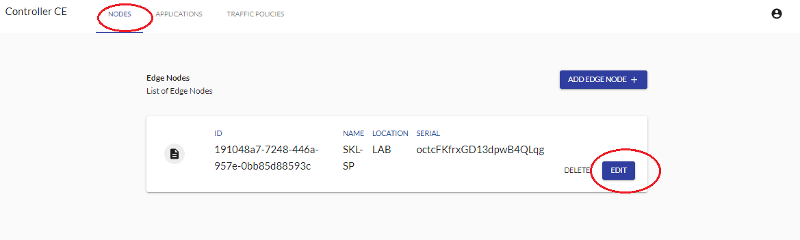

- Navigate to 'INTERFACES' tab.
- Available interfaces are listed.


#### Creating Traffic Policy
Prerequisites:
- Enrollment phase completed successfully.
- User is logged in to UI.

The steps to create a sample traffic policy are as follows:
- From UI navigate to 'TRAFFIC POLICIES' tab.
- Click 'ADD POLICY'.


- Give policy a name.
- Click 'ADD' next to 'Traffic Rules*' field.
- Fill in following fields:
  - Description: "Sample Description"
  - Priority: 99
  - Source -> IP Filter -> IP Address: 1.1.1.1
  - Source -> IP Filter -> Mask: 24
  - Source -> IP Filter -> Begin Port: 10
  - Source -> IP Filter -> End Port: 20
  - Source -> IP Filter -> Protocol: all
  - Target -> Description: "Sample Description"
  - Target -> Action: accept
- Click on "CREATE".

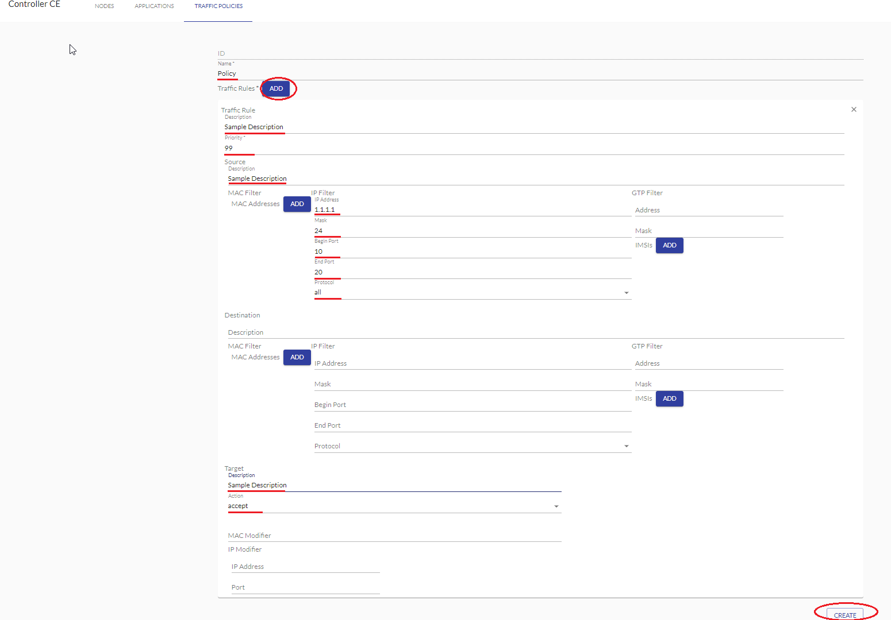

After creating Traffic Policy it will be visible under 'List of Traffic Policies' in 'TRAFFIC POLICIES' tab.


#### Adding Traffic Policy to Interface
Prerequisites:
- Enrollment phase completed successfully.
- User is logged in to UI.
- Traffic Policy Created.

To add a previously created traffic policy to an interface available on Edge Node the following steps need to be completed:
- From UI navigate to "NODES" tab.
- Find Edge Node on the 'List Of Edge Nodes'.
- Click "EDIT".

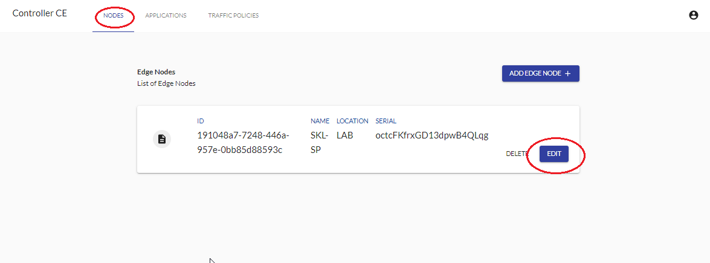

- Navigate to "INTERFACES" tab.
- Find desired interface which will be used to add traffic policy.
- Click 'ADD' under 'Traffic Policy' column for that interface.
- A window titled 'Assign Traffic Policy to interface' will pop-up. Select a previously created traffic policy.
- Click on 'ASSIGN'.


On success the user is able to see 'EDIT' and 'REMOVE POLICY' buttons under 'Traffic Policy' column for desired interface. These buttons can be respectively used for editing and removing traffic rule policy on that interface.

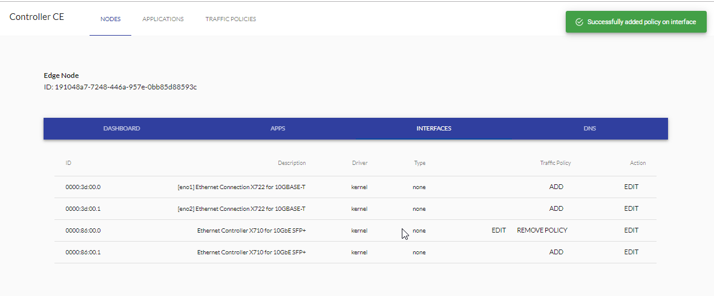

#### Configuring Interface
Prerequisites:
- Enrollment phase completed successfully.
- User is logged in to UI.

In order to configure interface available on the Edge Node for the NTS the following steps are to be taken:
- From UI navigate to 'INTERFACES' tab of the Edge Node.
- Find the interface to be used in the interface list and click 'EDIT' button under 'Action' column for that interface.


- A window will pop-up titled "Edit Interface". The following fields need to be set:
  - Driver: userspace
  - Type: upstream
  - Fall-back Interface: PCI address of another available interface ie. '0000:86:00.1'
- Click 'SAVE'.

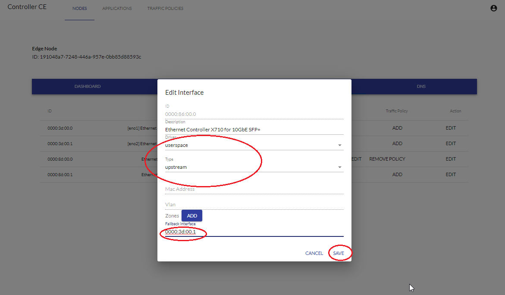

- The interface's 'Driver' and 'Type' columns will reflect changes made.


#### Starting NTS
Prerequisite:
- Enrollment phase completed successfully.
- User is logged in to UI.
- Interfaces to be used by NTS configured correctly.

> Note: In this example 2 interfaces are used by NTS. One interface of 'Type: upstream' and a second interface of 'Type: downstream'.

Once the interfaces are configured accordingly the following steps need to be done:
- From UI navigate to 'INTERFACES' tab of the Edge Node.
- Click 'COMMIT CHANGES'


- NTS will start


### Creating Applications
Prerequisite:
- Enrollment phase completed successfully.
- User is logged in to UI.
- User has access to a HTTPS server providing a downloadable copy of Docker container image or VM image.
- A saved copy of Docker image or VM image in a location accessible by above HTTPS server.

To add an application to list of applications managed by Controller following steps need to be taken:

- From UI navigate to 'APPLICATIONS' tab.
- Click on 'ADD APPLICATION' button.


- After 'Add an Application' window pops up add details as per following example:
  - Name: SampleApp
  - Type: Container
  - Version: 1
  - Vendor: vendor
  - Description: description
  - Cores: 2
  - Memory: 100
  - Source: https://controller_hostname/image_file_name 
- Controllers hostname (or hostname of any other machine serving as HTTPS server) can be found by running ```hostname -f``` from terminal of that machine.
- Then memory unit used is MB. A sample path to image could be https://controller_hostname/sample_docker_app.tar.gz
- The hostname of the controller or server serving HTTPS can be checked by running: ```hostname -f``` command from servers terminal.
- Click 'UPLOAD APPLICATION'


- The application will be displayed in Controller's 'List of Applications'.


### Deploying Applications

Prerequisite:
- Enrollment phase completed successfully.
- User is logged in to UI.
- NTS must be started 
- User has access to a HTTPS server providing a downloadable copy of Docker container image or VM image.
- A saved copy of Docker image or VM image in a location accessible by above HTTPS server.
- Application is added to the Controller application list 

The following steps need to be done: 
- From UI go to "NODE" tab and click on "EDIT" button for the desired node.
- Navigate to "APPS" tab.
- Click on "DEPLOY APP".

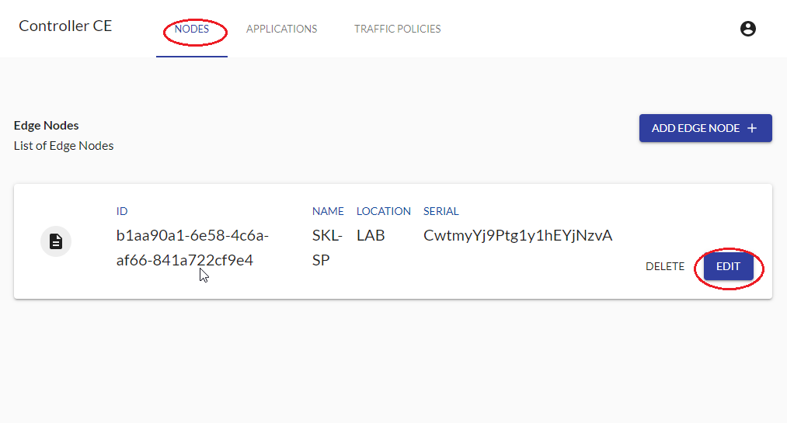

- Window titled "DEPLOY APPLICATION TO NODE" will appear.
- Select the Application you want to deploy from drop down menu.
- Click "DEPLOY".

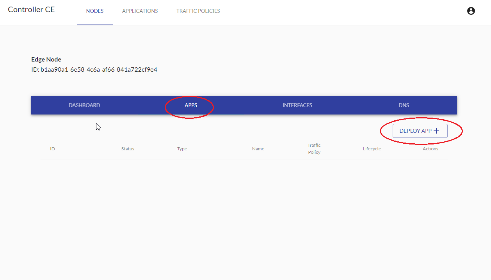

- Your applications will be listed under "APPS" tab - the status of this app will be "deployed".
- From here to start the Application click "START" 

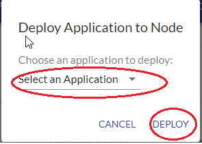

- Refresh the browser window to see the change in the status to "running".


- You can "DELETE/RESTART" an application from this tab. 
> Note the traffic policy if any must be removed before deleting the application.

### Managing Traffic Rules for Applications 

Prerequisite:
- Enrollment phase completed successfully.
- User is logged in to UI.
- NTS must be started 
- User has access to a HTTPS server providing a downloadable copy of Docker container image or VM image.
- A saved copy of Docker image or VM image in a location accessible by above HTTPS server.
- Application is added to the Controller application list.
- Application is deployed and started.
- Traffic rule is created.

Following steps needs to be done:
- From UI navigate to "NODES" tab click "EDIT" on the edge node and navigate to "APPS" tab
- To Add traffic policy to this application click "ADD" under "Traffic Policy" column.


- Pick the policy from the drop down menu and click "ASSIGN".


> Note: The application must be in a 'running' state in order to delete traffic policy.

### Managing DNS Rules

Prerequisite:
- Enrollment phase completed successfully.
- User is logged in to UI.
- NTS must be started\configured.

Following steps needs to be done:
- From UI navigate to "NODES" tab click "EDIT" on the edge node, then navigate to "DNS" tab.
- Add a Name for your DNS rule.
- Click "ADD" beside rerecords field, sub-window titled 'A Record' will pop-up.
- Add a Name to "A Record" field and provide description.
- Click on "ADD" near the values field. A field 'values' will pop-up.
- Provide IP address for DNS entry in the "values" field.
- Click "SAVE" in the bottom right corner.

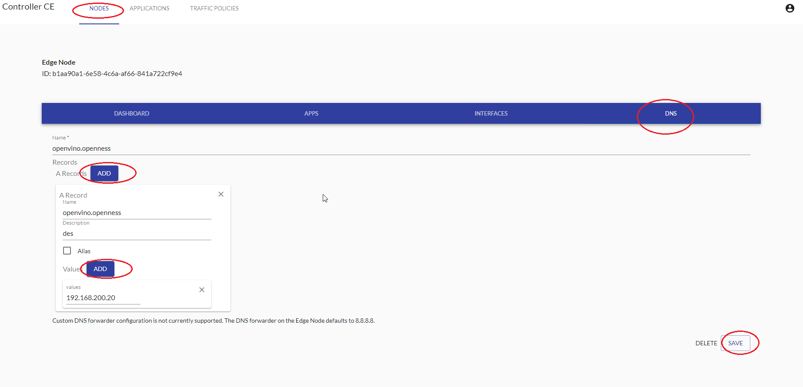

## Deploying OpenVINO application 
In this section the steps involved in deploying sample OpenVino consumer and producer applications on EdgeNode will be provided. For more information on OpenVino sample applications click here: [OpenNESS Application](https://github.com/open-ness/specs/blob/master/doc/architecture.md#openness-edge-node-applications). It is assumed that the user has already configured their Edge Node and Edge controller platforms and has completed the enrollment phase.

### 1 OpenVINO Creating Applications

Prerequisite:
- Enrollment phase completed successfully.
- User is logged in to UI.
- User has access to a HTTPS server providing a downloadable copy of Docker container image or VM image.
- A saved copy of Docker image for OpenVino 'consumer' and 'producer' application in a location accessible by above HTTPS server.

The following steps need to be done to deploy the OpenVinoConsumer application:
- From UI go to "APPLICATIONS" tab.
- Click on "ADD APPLICATION".

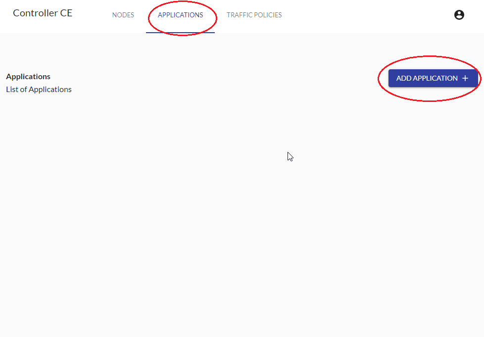

- Fill in the following fields:
 - Name: OpenVinoConsumer  
 - Type: Container
 - Version: 1
 - Vendor: SampleVemdor
 - Description: SampleVendor
 - Cores: 2 (OpenVINO consumer application needs atleast 2 cores)
 - Memory: 4096 (OpenVINO consumer application needs atleast 4GB memory)
 - Source (format https://controller_hostname/openvino-cons-app.tar.gz)
 - Port and Protocol (these fields are not used but need to filled)
- Click 'UPLOAD APPLICATION'


- OpenVinoConsumer application will show up on the "APPLICATION LIST" under the "APPLICATION" tab.

The following steps need to be done to deploy the OpenVinoProducer application:
- From UI go to "APPLICATIONS" tab. 
- Click on "ADD APPLICATION".

- Fill in the following fields:
 - Name: OpenVinoProducer  
 - Type: Container
 - Version: 1
 - Vendor: SampleVendor
 - Description: SampleVendor
 - Cores: 2
 - Memory: 2048
 - Source (format https://controller_hostname/openvino-prod-app.tar.gz)
 - Port and Protocol (these fields are not used but needs to filled).
- Click 'UPLOAD APPLICATION'.

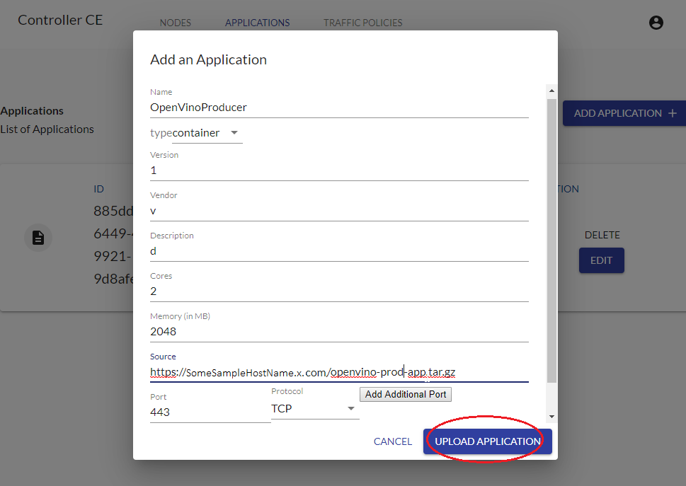

- OpenVinoProducer application will show up on the "APPLICATION LIST" under the "APPLICATION" tab. 

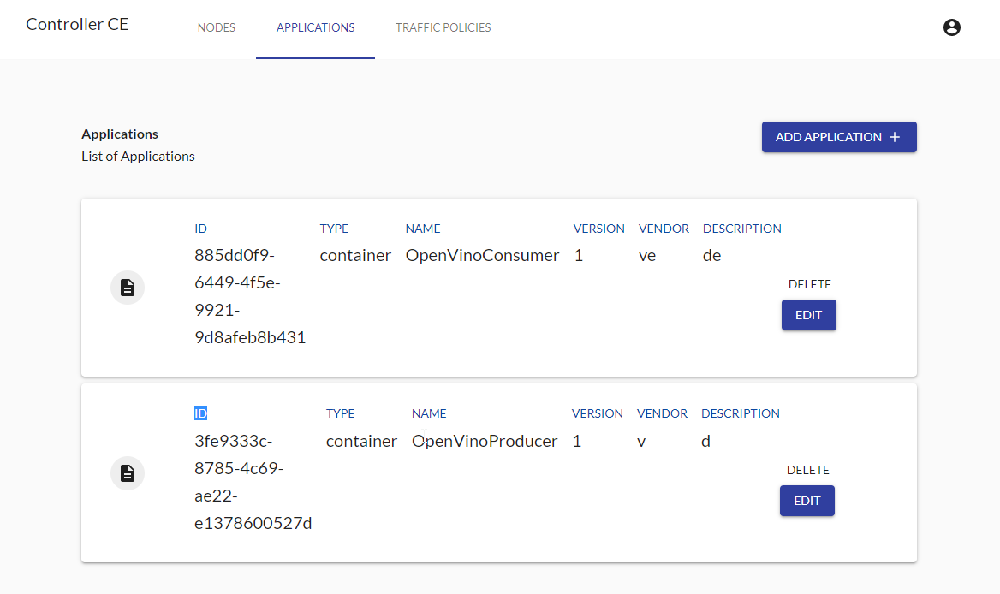

 ### 2 OpenVINO Creating Traffic Rules

Prerequisites:
- Enrollment phase completed successfully.
- User is logged in to UI.

The steps to create a sample traffic policy are as follows:
- From UI navigate to 'TRAFFIC POLICIES' tab.
- Click 'ADD POLICY'.


- Give policy a name.
- Click 'ADD' next to 'Traffic Rules*' field.
- Fill in following fields:
  - Description: "Sample Description"
  - Priority: 99
  - Source -> IP Filter -> IP Address: 192.168.200.20
  - Source -> IP Filter -> Mask: 32
  - Source -> IP Filter -> Protocol: all
  - Target -> Description: "Sample Description"
  - Target -> Action: accept
- Click on "CREATE".

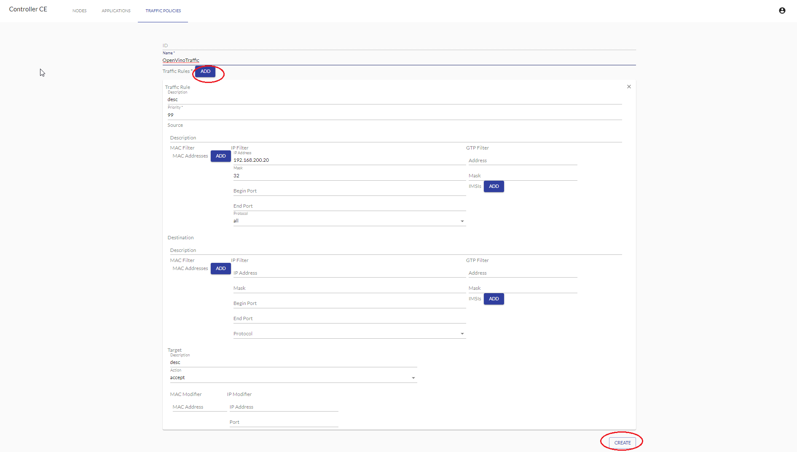

After creating Traffic Policy it will be visible under 'List of Traffic Policies' in 'TRAFFIC POLICIES' tab.

 ### 3 OpenVINO NTS Configuration and start
In this scenario two interfaces are to be configured for NTS "UPSTREAM" (to be connected to eNodeB\upstream IP source), "DOWNSTREAM" (to be connected to EPC\downstream IP source).
The eNodeB and EPC set up is outside scope of this document. Instructions for sample client server for video traffic simulation will be provided (in place of eNodeB), as well as instructions how to make a 'dummy' EPC connection.

Prerequisites:
- Enrollment phase completed successfully.
- User is logged in to UI.

In order to configure interface available on the Edge Node for the NTS the following steps are to be taken:
- From UI navigate to 'INTERFACES' tab of the Edge Node.
- Find the interface to be used in the interface list and click 'EDIT' button under 'Action' column for first interface.

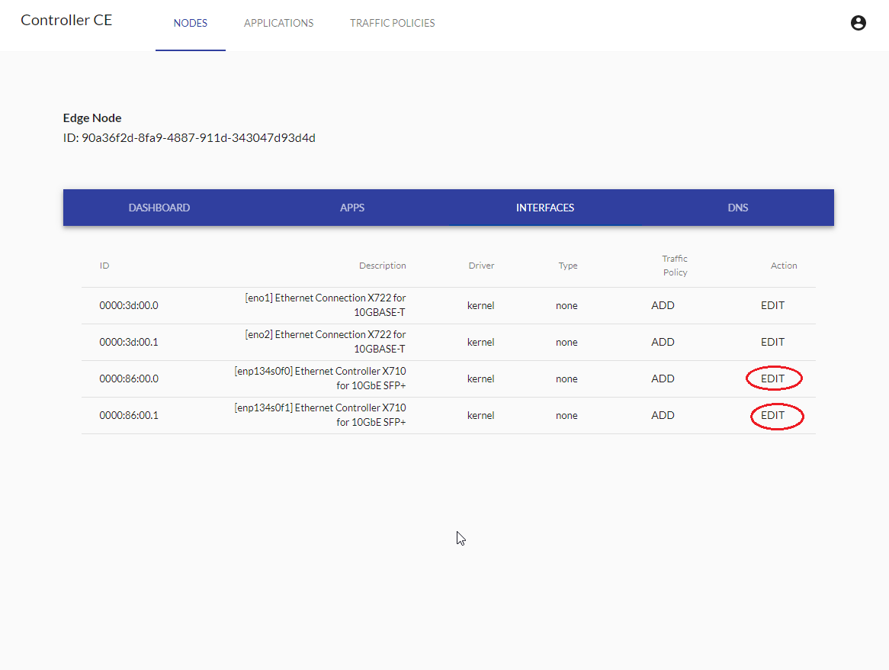

- A window will pop-up titled "Edit Interface". The following fields need to be set:
  - Driver: userspace
  - Type: upstream
  - Fall-back Interface: PCI address of interface to be used for downstream ie. '0000:86:00.1'
- Click 'SAVE'.


- Find the interface to be used in the interface list and click 'EDIT' button under 'Action' column for second interface.
- A window will pop-up titled "Edit Interface". The following fields need to be set:
  - Driver: userspace
  - Type: upstream
  - Fall-back Interface: PCI address of interface to be used for upstream ie. '0000:86:00.0'
- Click 'SAVE'.

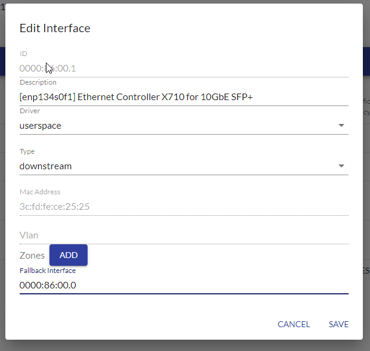

- The interface's 'Driver' and 'Type' columns will reflect changes made.
- Once the two interfaces are configured click "COMMIT CHANGES" to start NTS.


- NTS will start and "COMMIT CHANGES" button will disappear.

 ### 4 OpenVINO Deploying Applications

Prerequisite:
- Enrollment phase completed successfully.
- User is logged in to UI.
- NTS must be started 
- User has access to a HTTPS server providing a downloadable copy of Docker container image or VM image.
- A saved copy of Docker image for OpenVino consumer and producer applications in a location accessible by above HTTPS server.
- Application is added to the Controller application list.

The following steps need to be done: 
- From UI go to "NODE" tab and click on "EDIT" button for the desired node.
- Navigate to "APPS" tab.
- Click on "DEPLOY APP".


Deploy OpenVino Producer appliaction.
- Window titled "DEPLOY APPLICATION TO NODE" will appear.
- Select OpenVino Producer Application from drop down menu.
- Click "DEPLOY".

Deploy OpenVino Consumer appliaction.
- Once again click on "DEPLOY APP".
- Window titled "DEPLOY APPLICATION TO NODE" will appear.
- Select OpenVino Consumer Application from drop down menu.
- Click "DEPLOY".

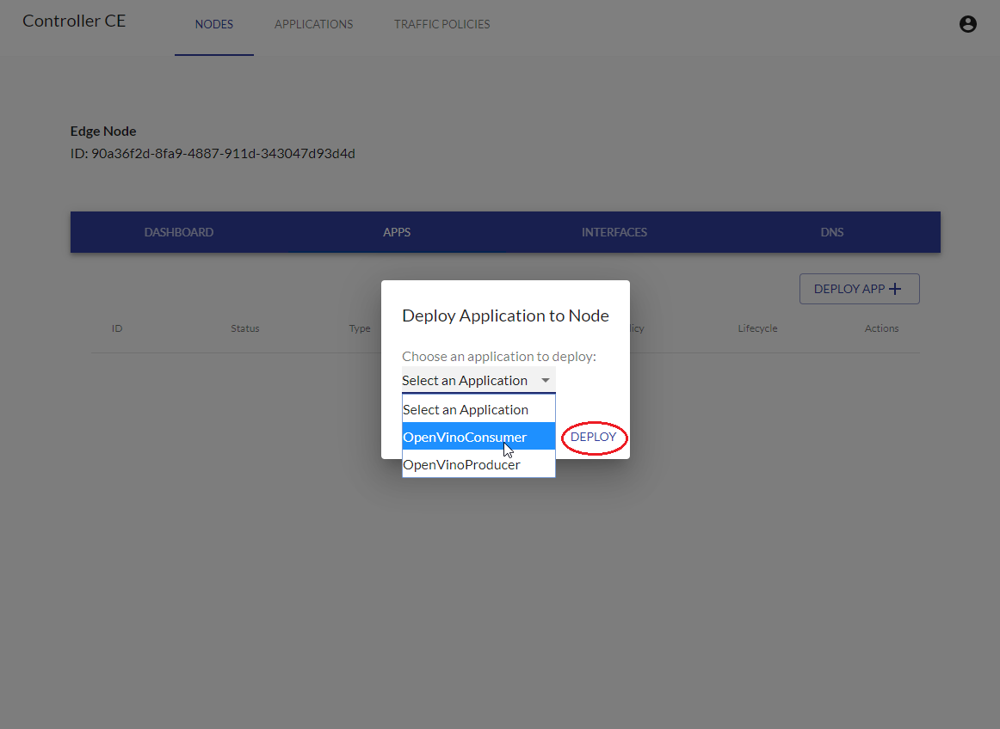

- Your applications will be listed under "APPS" tab - the status of this app will be "deployed".
- Start the OpenVino Producer Application first,  click "START" in the Producer Application listing.
- Start the OpenVino Consumer Application second,  click "START" in the Producer Application listing.


- Refresh the browser window to see the change in the status to "running".


- You can "DELETE/RESTART" an application from this tab. 
> Note: The traffic policy if any must be removed before deleting the application.


 ### 5 OpenVINO Managing Traffic Rules for Applications

Prerequisite:
- Enrollment phase completed successfully.
- User is logged in to UI.
- NTS must be started 
- User has access to a HTTPS server providing a downloadable copy of Docker container image or VM image.
- A saved copy of Docker image for OpenVino consumer and producer applications in a location accessible by above HTTPS server.
- Application is added to the Controller application list.
- Application is deployed and started.
- Traffic rule is created.

Following steps needs to be done:
- From UI navigate to "NODES" tab click "EDIT" on the edge node and navigate to "APPS" tab
- To Add traffic policy to OpenVino consumer application, click "ADD" under "Traffic Policy" column.


- Pick the policy from the drop down menu and click "ASSIGN".

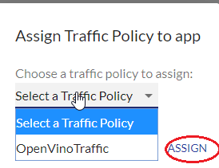

- You can "DELETE/RESTART" an application from this tab.
> Note: The application must be in a 'running' state in order to delete traffic policy.

 ### 6 OpenVINO Managing DNS Rules

 Prerequisite:
- Enrollment phase completed successfully.
- User is logged in to UI.
- NTS must be started\configured.

Following steps needs to be done:
- From UI navigate to "NODES" tab click "EDIT" on the edge node, then navigate to "DNS" tab.
- Add a Name for your DNS rule: openvino.openness.
- Click "ADD" beside rerecords field, sub-window titled 'A Record' will pop-up.
- Add a Name to "A Record" field and provide description: openvino.openness.
- Click on "ADD" near the values field. A field 'values' will pop-up.
- Provide IP address for DNS entry in the "values" field: 192.168.200.20 (It is important to set this IP for this example as later steps on configuring video traffic generator will use interface on same subnet)
- Click "SAVE" in the bottom right corner.


 ### 7 OpenVINO Manual Configuration steps

The following manual steps need to be done to fully configure the OpenVino pipeline on the EdgeNode. These steps need to be run from terminal on the EdgeNode.

Run 'docker ps' to find running containers on EdgeNode.
OpenVino consumer container can be distinguished by "./start.sh" text in its 'COMMAND' field under 'docker ps'.

Configure DNS container's KNI interface:
 
```
docker exec -it <Container_ID_of_mec-app-edgednssvr> ip link set dev vEth0 arp off
docker exec -it <Container_ID_of_mec-app-edgednssvr> ip a a 53.53.53.53/24 dev vEth0
docker exec -it <Container_ID_of_mec-app-edgednssvr> ip link set dev vEth0 up
docker exec -it <Container_ID_of_mec-app-edgednssvr> ip route add 192.168.200.0/24 dev vEth0
```

Make a request on the DNS interface subnet to register the KNI interface with NTS client (press CTRL + C buttons as soon as a request is made (no expectation for hostname to resolve)):

```
docker exec -it <Container_ID_of_mec-app-edgednssvr> wget 192.168.200.123 -Y off
```

Configure OpenVino Consumer container's KNI interface:
Find the name of KNI interface inside the container (interface name vEthX):
```
docker exec -it <Container_ID_of_openVino-consumer-app>  ip addr
```
Using the found interface name run following:

```
docker exec -it <Container_ID_of_openVino-consumer-app>  ip link set dev vEth2 arp off
docker exec -it <Container_ID_of_openVino-consumer-app>  ip a a 192.168.200.20/24 dev vEth2
docker exec -it <Container_ID_of_openVino-consumer-app>  ip link set dev vEth2 up
```

Make a request on the OpenVino Consumer interface subnet to register the KNI interface with NTS client (press CTRL + C buttons as soon as a request is made (no expectation for hostname to resolve)):
```
docker exec -it <Container_ID_of_openVino-consumer-app>  wget 192.168.200.123 -Y off
```

### 8 OpenVINO Downstream setup 

This is a sample setup for Downstream setup (EPC/IP Downstream). This is downstream node in this example will behave like Application connected to the PDN gateway or IP gateway. For the purpose of testing OpenVINO App in the IP domain. You need to connect a server and assign an IP to an interface connected to the Edge Node Downstream. The IP assigned IP address must be as follows - 192.168.200.2. 

> Note: Do not Ping/send traffic from downstream to the Application on the edge node. This is because ping/sending traffic will add a learning entry into the NTS dataplane. If this is done by mistake then NTS Dataplane has to be restarted and the Traffic policy needs to be re-configured. 

### 9 OpenVINO Client Simulator Setup

The following prerequisites must be installed on the platform where the client
simulator will be set up:

* Docker
* OS with graphical support
* VNC server or a physically attached monitor

1. Update `/etc/hosts` file with a record for `openvino.openness` hostname

    ```shell
    echo "192.168.200.20 openvino.openness" >> /etc/hosts
    ```

2. Set the IP address of the ethernet interface which is connected to the
OpenNESS Edge Node with an IP address in the same subnet as for
`openvino.openness` hostname

    ```shell
    ifconfig enp1s0f0 192.168.200.10 up
    ```

3. In order for the NTS Dataplane to have learnt both upstream and downstream traffic flow we need to send traffic (Ping/iperf) from Upstream IP to the downstream server.    
  
   ```shell
    ping 192.168.200.2
   ```

3. Update ARP tables for the configured interface

    ```shell
    arp -s openvino.openness deadbeef
    ```

4. Build the `client-sim` docker image that as described in
   **OpenVINO Sample Application in OpenNESS** section
   **Build & Deployment of OpenVINO Applications**.

5. From a VNC window or on the attached monitor, run the docker image using
   the provided script to get the traffic flowing and visualized:

    ```shell
    cd <appliance-ce-directory>/build/openvino/clientsim
    ./run-docker.sh
    ```
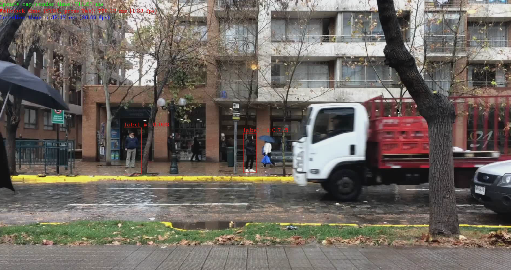

## Troubleshooting 
- Controller UI: if you encounter HTTP errors like `500`,`400` and `404` please run `docker-compose logs -f ` from the `<controller>` or `<edge node>` source root directory.  This command will generate the log which can be used for further analysis. 
