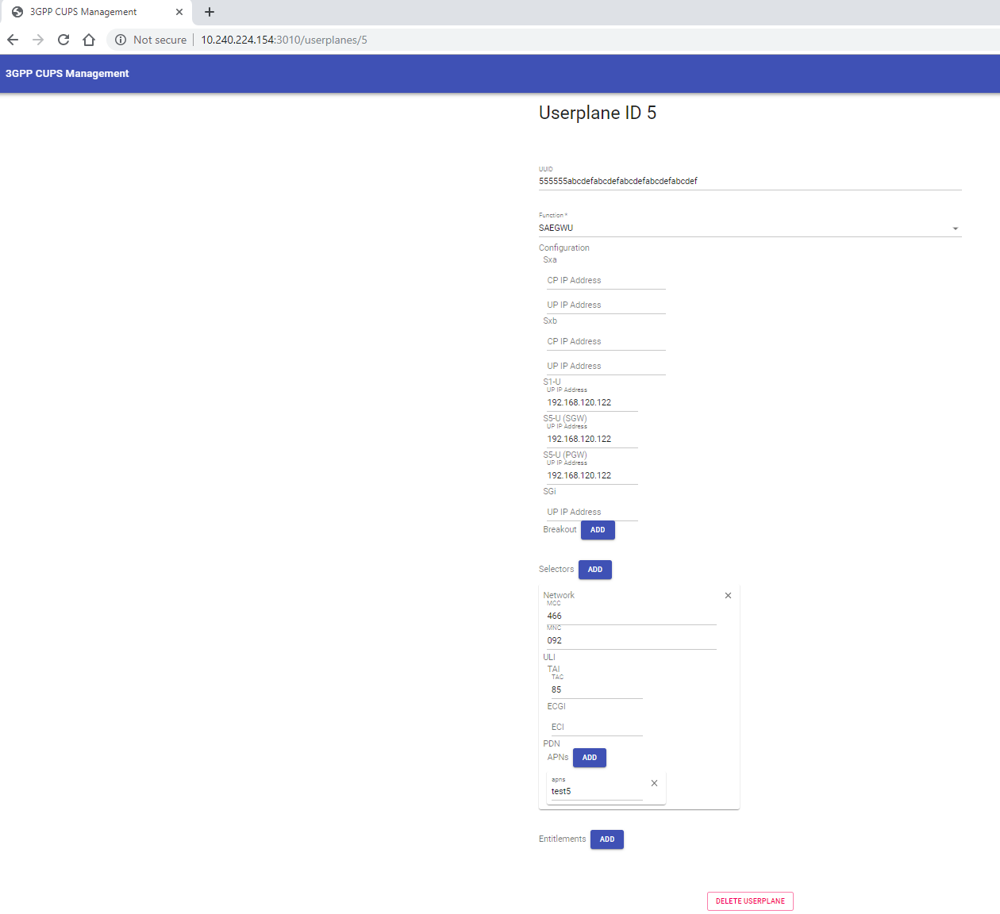
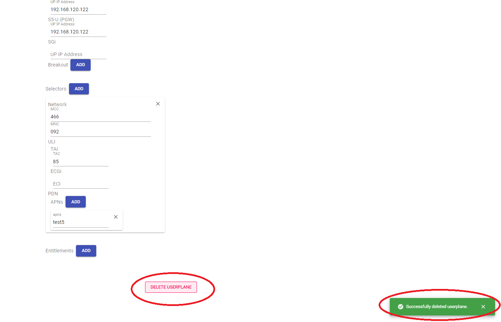
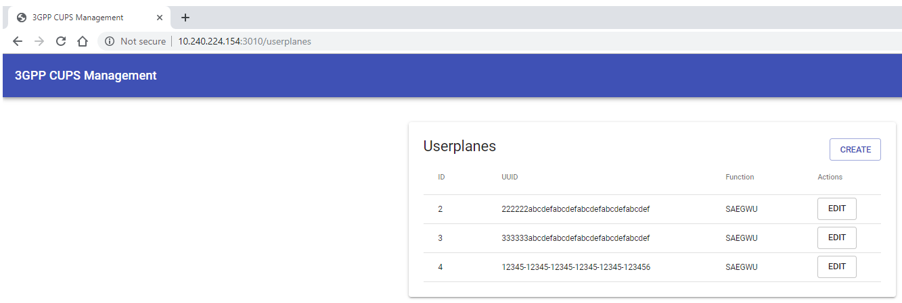
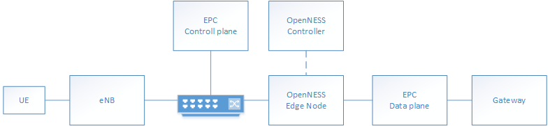
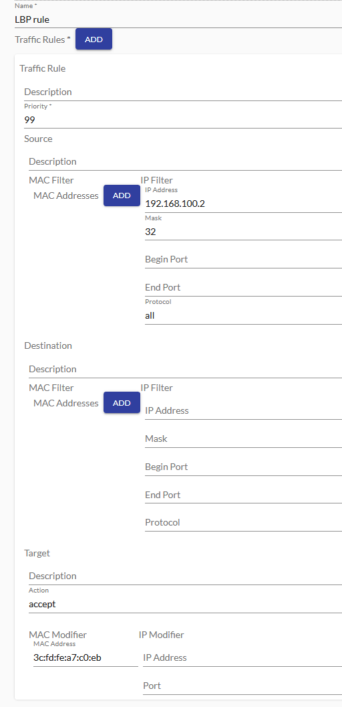
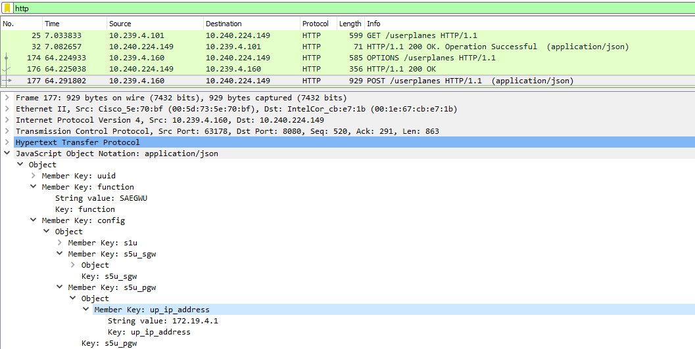

SPDX-License-Identifier: Apache-2.0    
Copyright © 2019 Intel Corporation and Smart-Edge.com, Inc.    

# OpenNESS How to guide 

- [OpenNESS How to guide](#openness-how-to-guide)
  - [Introduction](#introduction)
  - [Instructions](#instructions)
    - [Prerequisites](#prerequisites)
      - [Creating HTTPS server for image download](#creating-https-server-for-image-download)
        - [Instructions to setup HTTP server](#instructions-to-setup-http-server)
        - [Instruction to upload and access images](#instruction-to-upload-and-access-images)
    - [First login](#first-login)
    - [Enrollment](#enrollment)
    - [NTS Configuration](#nts-configuration)
      - [Displaying Edge Node's Interfaces](#displaying-edge-nodes-interfaces)
      - [Creating Traffic Policy](#creating-traffic-policy)
      - [Adding Traffic Policy to Interface](#adding-traffic-policy-to-interface)
      - [Configuring Interface](#configuring-interface)
      - [Starting NTS](#starting-nts)
    - [Creating Applications](#creating-applications)
    - [Deploying Applications](#deploying-applications)
    - [Managing Traffic Rules for Applications](#managing-traffic-rules-for-applications)
    - [Managing DNS Rules](#managing-dns-rules)
      - [EdgeDNS for applications deployed in On-Premise mode](#edgedns-for-applications-deployed-in-on-premise-mode)
  - [Deploying OpenVINO application](#deploying-openvino-application)
    - [1 OpenVINO Creating Applications](#1-openvino-creating-applications)
    - [2 OpenVINO Creating Traffic Rules](#2-openvino-creating-traffic-rules)
    - [3 OpenVINO NTS Configuration and start](#3-openvino-nts-configuration-and-start)
    - [4 OpenVINO Deploying Applications](#4-openvino-deploying-applications)
    - [5 OpenVINO Managing Traffic Rules for Applications](#5-openvino-managing-traffic-rules-for-applications)
    - [6 OpenVINO Managing DNS Rules](#6-openvino-managing-dns-rules)
    - [7 OpenVINO Manual Configuration steps](#7-openvino-manual-configuration-steps)
    - [8 OpenVINO Downstream setup](#8-openvino-downstream-setup)
    - [9 OpenVINO Client Simulator Setup](#9-openvino-client-simulator-setup)
  - [OVS inter-app communication in Native mode](#ovs-inter-app-communication-in-native-mode)
    - [Setting up IAC](#setting-up-iac)
  - [Kubernetes and Kube-OVN Install hints](#kubernetes-and-kube-ovn-install-hints)
    - [1. Disable SE Linux & swap](#1-disable-se-linux--swap)
    - [2. Install Kubernetes](#2-install-kubernetes)
    - [3. Firewall: iptables configuration for ipv6](#3-firewall-iptables-configuration-for-ipv6)
    - [4. Proxy, SELinux and swap setting](#4-proxy-selinux-and-swap-setting)
    - [5. Kubernetes master: Install docker & docker-compose](#5-kubernetes-master-install-docker--docker-compose)
    - [6. Run k8s' kubelet](#6-run-k8s-kubelet)
    - [7. Proxy setting for docker and k8s](#7-proxy-setting-for-docker-and-k8s)
    - [8. Restart services](#8-restart-services)
    - [9. Firewall configuration on Kubernetes master (the Controller platform)](#9-firewall-configuration-on-kubernetes-master-the-controller-platform)
      - [9.1. Flannel mode](#91-flannel-mode)
      - [9.2. Kube-OVN mode](#92-kube-ovn-mode)
    - [10. Firewall configuration on Kubernetes worker (the Edge Node platform)](#10-firewall-configuration-on-kubernetes-worker-the-edge-node-platform)
    - [11. Logout & Login to reload proxy](#11-logout--login-to-reload-proxy)
  - [Edge Controller K8s master Configuration hints](#edge-controller-k8s-master-configuration-hints)
    - [1. K8s master - Initialize master](#1-k8s-master---initialize-master)
      - [1.1. Flannel mode](#11-flannel-mode)
      - [1.2. Kube-OVN mode](#12-kube-ovn-mode)
    - [2. Obtaining K8s certificates](#2-obtaining-k8s-certificates)
    - [3. Controller set up](#3-controller-set-up)
      - [3.1. Flannel mode](#31-flannel-mode)
      - [3.2. Kube-OVN mode](#32-kube-ovn-mode)
  - [Edge Node Configuration hints](#edge-node-configuration-hints)
    - [1. Edge Node set up](#1-edge-node-set-up)
      - [1.1. Flannel mode setup](#11-flannel-mode-setup)
      - [1.2. Kube-OVN mode setup](#12-kube-ovn-mode-setup)
    - [2. Perform node's enrollment](#2-perform-nodes-enrollment)
    - [3. Set up k8s worker - use the instruction above (Kubernetes and Kube-OVN Install hints)](#3-set-up-k8s-worker---use-the-instruction-above-kubernetes-and-kube-ovn-install-hints)
    - [4. Set up dnsmasq - only in Flannel Mode](#4-set-up-dnsmasq---only-in-flannel-mode)
      - [Disable libvirt's DNS](#disable-libvirts-dns)
      - [Run commands in order to redefine network](#run-commands-in-order-to-redefine-network)
      - [Set up custom dnsmasq](#set-up-custom-dnsmasq)
    - [5. Reboot Edge Node - only in Flannel Mode](#5-reboot-edge-node---only-in-flannel-mode)
    - [6. (master) Label worker and check status](#6-master-label-worker-and-check-status)
      - [Label worker](#label-worker)
      - [Check status of nodes](#check-status-of-nodes)
  - [CUPS UI usage](#cups-ui-usage)
    - [CUPS UI Prerequisites](#cups-ui-prerequisites)
    - [First access for CUPS UI](#first-access-for-cups-ui)
    - [Display specific user planes information and update it](#display-specific-user-planes-information-and-update-it)
    - [Create a new user plane](#create-a-new-user-plane)
    - [Delete a user plane](#delete-a-user-plane)
  - [S1-U traffic handling](#s1-u-traffic-handling)
    - [Data plane configuration](#data-plane-configuration)
    - [Traffic rules for applications](#traffic-rules-for-applications)
    - [MTU](#mtu)
  - [Preparing set-up for Local Break Point (LBP)](#preparing-set-up-for-local-break-point-lbp)
    - [Controller and Edge Node deployment](#controller-and-edge-node-deployment)
    - [Network configuration](#network-configuration)
    - [Configuration in Controller](#configuration-in-controller)
    - [Verification](#verification)
      - [NES client](#nes-client)
      - [Tcpdump](#tcpdump)
  - [Platform upgrade](#platform-upgrade)
  - [Troubleshooting](#troubleshooting)
    - [Modify OVN gateway port](#modify-ovn-gateway-port)
    - [Additional port to VM](#additional-port-to-vm)
    - [How Apps can resolve EAA domain name](#how-apps-can-resolve-eaa-domain-name)
    - [Minimum Hugepages](#minimum-hugepages)
    - [Log files](#log-files)
    

## Introduction
The aim of this guide is to familiarize the user with OpenNESS controller's User Interface. This "How to" guide will provide instructions on how to create a sample configuration via UI.

## Instructions
Following are general purpose sample instructions allowing the user to get familiarized with the Edge Controller Web UI. Additional instruction for specific deployment with sample OpenVINO applications is provided under [Deploying OpenVINO application](##deploying-openvino-application).
### Prerequisites
1. Controller and Edge node installation and configuration is assumed to be run as `root`. 
2. Controller Web UI only supports only one user and its `admin` user.   
3. As part of the Application deployment a HTTPs based Application Image download server is required. 
    - An example is provided in the "Creating HTTPS server for image download" section to deploy HTTPs image server on Controller.    
   
  

#### Creating HTTPS server for image download
##### Instructions to setup HTTP server 
Prerequisites:
- Controller should be up and running in order to access root CA. 

- Install apache and mod_ssl     
`yum install -y httpd mod_ssl`    
- Go into /etc/ssl/certs    
 `cd /etc/ssl/certs`    
- Acquire the controller root ca and key
```
docker cp edgecontroller_cce_1:/artifacts/certificates/ca/cert.pem . 
docker cp edgecontroller_cce_1:/artifacts/certificates/ca/key.pem .
``` 
- Generate the apache key and crt
```
openssl genrsa -out apache.key 2048
openssl req -new -sha256 -key apache.key -subj "/C=IE/ST=Clare/O=ESIE/CN=$(hostname -f)" -out apache.csr
openssl x509 -req -in apache.csr -CA cert.pem -CAkey key.pem -CAcreateserial -out apache.crt -days 500 -sha256
```
- Edit apache config and point it to the new certs
```
sed -i 's|^SSLCertificateFile.*$|SSLCertificateFile /etc/ssl/certs/apache.crt|g' /etc/httpd/conf.d/ssl.conf
sed -i 's|^SSLCertificateKeyFile.*$|SSLCertificateKeyFile /etc/ssl/certs/apache.key|g' /etc/httpd/conf.d/ssl.conf
```
- Set the firewall to accept the traffic
```
firewall-cmd --permanent --direct --add-rule ipv4 filter INPUT 0 -p tcp --dport 80 -j ACCEPT
firewall-cmd --permanent --direct --add-rule ipv4 filter INPUT 0 -p tcp --dport 443 -j ACCEPT
firewall-cmd --reload    
``` 
- Enable and restart apache after the changes
```
systemctl enable httpd
systemctl restart httpd
```

##### Instruction to upload and access images
> Note: Refer to "Docker Images Creation" in the "OpenVINO Sample Application in OpenNESS - README.md file" under <edgeapps>/build/openvino. 

- Put the images into /var/www/html    
`cp test_image.tar.gz /var/www/html/`    
`chmod a+r /var/www/html/*tar.gz`    
- Construct the URL (Source in Controller UI) as:    
`https://<controller_hostname>/test_image.tar.gz`

>Note: Controller host name to be used for the URL can be acquired by running ```hostname -f``` in the controller node shell. 

### First login
In order to access the UI the user needs to provide credentials during login.

Prerequisites:
- An internet browser to access the login page.
- REACT_APP_CONTROLLER_API='http://<Controller_IP_address>:8080' added to Controller's "~/edgecontroller/.env" (manual Controller installation) or "/opt/controller/.env" (Ansible Controller installation) file.
- If working behind proxy or firewall appropriate ports open.
- Controller set up (including the UI application) and running.

The following steps need to be done for successful login:
- Open internet browser.
- Type in http://<Controller_ip_address>:3000/login in address bar.
- Enter you username and password (default username: admin) (the password to be used is the password provided during Controller bring-up with the CCE_ADMIN_PASSWORD in "~/edgecontroller/.env" (Manual installation) or "/opt/controller/.env" (Ansible installation)) .
- Click on "SIGN IN" button.


### Enrollment

In order for the Controller and Edge Node to work together the Edge Node needs to enroll with the Controller. The Edge Node will continuously try to connect to the controller until its serial key is recognized by the Controller.

Prerequisites:
- Controller's IP address must be provided in Edge Node's "scripts/ansible/common/vars/defaults.yml" file. This IP needs to be added/edited in the file in following format: enrollment_endpoint: "<Controller_IP_address>:8081"
- Controller's ROOT CA  needs to be added to "/etc/pki/tls/certs/controller-root-ca.pem" on Edge Node. The certificate can be acquired by running `docker cp edgecontroller_cce_1:/artifacts/certificates/ca/cert.pem . `.
- The Edge Node's deployment script has been started ('./03_build_and_deploy.sh' script on Edge Node is printing out "Waiting for certificates").
- Upon Edge Node's deployment a Serial Key has been printed out to the terminal and retrieved to be used during enrollment.
- User has logged in to UI.

In order to enroll and add new Edge Node to be managed by the Controller the following steps are to be taken:
- Navigate to 'NODES' tab.
- Click on 'ADD EDGE NODE' button.


- Enter previously obtained Edge Node Serial Key into 'Serial*' field.
- Enter the name and location of Edge Node.
- Press 'ADD EDGE NODE'.


- Check that your Edge Node is visible under 'List of Edge Nodes' (Also at this stage the Ansible script for bringing up Edge Node should successfully finish executing).


### NTS Configuration
OpenNESS data-plane interface configuration.

#### Displaying Edge Node's Interfaces
Prerequisites:
- Enrollment phase completed successfully.
- User is logged in to UI.

To check the interfaces available on the Edge Node execute following steps:
- From UI go to 'NODES' tab.
- Find you Edge Node on the list.
- Click 'EDIT'.


- Navigate to 'INTERFACES' tab.
- Available interfaces are listed.


#### Creating Traffic Policy
Prerequisites:
- Enrollment phase completed successfully.
- User is logged in to UI.

The steps to create a sample traffic policy are as follows:
- From UI navigate to 'TRAFFIC POLICIES' tab.
- Click 'ADD POLICY'.

> Note: This specific traffic policy is only an example.


- Give policy a name.
- Click 'ADD' next to 'Traffic Rules*' field.
- Fill in following fields:
  - Description: "Sample Description"
  - Priority: 99
  - Source -> IP Filter -> IP Address: 1.1.1.1
  - Source -> IP Filter -> Mask: 24
  - Source -> IP Filter -> Begin Port: 10
  - Source -> IP Filter -> End Port: 20
  - Source -> IP Filter -> Protocol: all
  - Target -> Description: "Sample Description"
  - Target -> Action: accept
- Click on "CREATE".


After creating Traffic Policy it will be visible under 'List of Traffic Policies' in 'TRAFFIC POLICIES' tab.


#### Adding Traffic Policy to Interface
Prerequisites:
- Enrollment phase completed successfully.
- User is logged in to UI.
- Traffic Policy Created.

To add a previously created traffic policy to an interface available on Edge Node the following steps need to be completed:
- From UI navigate to "NODES" tab.
- Find Edge Node on the 'List Of Edge Nodes'.
- Click "EDIT".

> Note: This step is instructional only, users can decide if they need/want a traffic policy designated for their interface, or if they desire traffic policy designated per application instead.


- Navigate to "INTERFACES" tab.
- Find desired interface which will be used to add traffic policy.
- Click 'ADD' under 'Traffic Policy' column for that interface.
- A window titled 'Assign Traffic Policy to interface' will pop-up. Select a previously created traffic policy.
- Click on 'ASSIGN'.


On success the user is able to see 'EDIT' and 'REMOVE POLICY' buttons under 'Traffic Policy' column for desired interface. These buttons can be respectively used for editing and removing traffic rule policy on that interface.


#### Configuring Interface
Prerequisites:
- Enrollment phase completed successfully.
- User is logged in to UI.

In order to configure interface available on the Edge Node for the NTS the following steps are to be taken:
- From UI navigate to 'INTERFACES' tab of the Edge Node.
- Find the interface to be used in the interface list and click 'EDIT' button under 'Action' column for that interface.


- A window will pop-up titled "Edit Interface". The following fields need to be set:
  - Driver: userspace
  - Type: upstream
  - Fall-back Interface: PCI address of another available interface ie. '0000:86:00.1'
  - In case of two interfaces being configured, one for 'Upstream' another for 'Downstream', the fallback interface for 'Upstream' is the 'Downstream' interface and vice versa.
- Click 'SAVE'.


- The interface's 'Driver' and 'Type' columns will reflect changes made.


#### Starting NTS
Prerequisite:
- Enrollment phase completed successfully.
- User is logged in to UI.
- Interfaces to be used by NTS configured correctly.

> Note: In this example 2 interfaces are used by NTS. One interface of 'Type: upstream' and a second interface of 'Type: downstream'.

> Note: <br />  UPSTREAM = Data-plane communication from eNodeB/traffic generator -> OpenNESS EdgeNode and vice versa. <br />
DOWNSTREAM = Data-plane communication from OpenNESS EdgeNode -> EPC/PDN and vice versa.

Once the interfaces are configured accordingly the following steps need to be done:
- From UI navigate to 'INTERFACES' tab of the Edge Node.
- Click 'COMMIT CHANGES'


- NTS will start


### Creating Applications
Prerequisite:
- Enrollment phase completed successfully.
- User is logged in to UI.
- User has access to a HTTPS server providing a downloadable copy of Docker container image or VM image.
- A saved copy of Docker image or VM image in a location accessible by above HTTPS server.

To add an application to list of applications managed by Controller following steps need to be taken:

- From UI navigate to 'APPLICATIONS' tab.
- Click on 'ADD APPLICATION' button.


- After 'Add an Application' window pops up add details as per following example:
  - Name: SampleApp
  - Type: Container
  - Version: 1
  - Vendor: vendor
  - Description: description
  - Cores: 2
  - Memory: 100
  - Source: https://controller_hostname/image_file_name 
- Controllers hostname (or hostname of any other machine serving as HTTPS server) can be found by running ```hostname -f``` from terminal of that machine.
- Then memory unit used is MB. A sample path to image could be https://controller_hostname/sample_docker_app.tar.gz
- The hostname of the controller or server serving HTTPS can be checked by running: ```hostname -f``` command from servers terminal.
- Click 'UPLOAD APPLICATION'


- The application will be displayed in Controller's 'List of Applications'.


### Deploying Applications

Prerequisite:
- Enrollment phase completed successfully.
- User is logged in to UI.
- NTS must be started 
- User has access to a HTTPS server providing a downloadable copy of Docker container image or VM image.
- A saved copy of Docker image or VM image in a location accessible by above HTTPS server.
- Application is added to the Controller application list 

The following steps need to be done: 
- From UI go to "NODE" tab and click on "EDIT" button for the desired node.
- Navigate to "APPS" tab.
- Click on "DEPLOY APP".


- Window titled "DEPLOY APPLICATION TO NODE" will appear.
- Select the Application you want to deploy from drop down menu.
- Click "DEPLOY".


- Your applications will be listed under "APPS" tab - the status of this app will be "deployed".
- From here to start the Application click "START" 


- Refresh the browser window to see the change in the status to "running".


- You can "DELETE/RESTART" an application from this tab. 
> Note the traffic policy if any must be removed before deleting the application.

### Managing Traffic Rules for Applications 

Prerequisite:
- Enrollment phase completed successfully.
- User is logged in to UI.
- NTS must be started 
- User has access to a HTTPS server providing a downloadable copy of Docker container image or VM image.
- A saved copy of Docker image or VM image in a location accessible by above HTTPS server.
- Application is added to the Controller application list.
- Application is deployed and started.
- Traffic rule is created.

Following steps needs to be done:
- From UI navigate to "NODES" tab click "EDIT" on the edge node and navigate to "APPS" tab
- To Add traffic policy to this application click "ADD" under "Traffic Policy" column.


- Pick the policy from the drop down menu and click "ASSIGN".


> Note: The application must be in a 'running' state in order to delete traffic policy.

### Managing DNS Rules

Prerequisite:
- Enrollment phase completed successfully.
- User is logged in to UI.
- NTS must be started\configured.

Following steps needs to be done:
- From UI navigate to "NODES" tab click "EDIT" on the edge node, then navigate to "DNS" tab.
- Add a Name for your DNS rule.
- Click "ADD" beside rerecords field, sub-window titled 'A Record' will pop-up.
- Add a Name to "A Record" field and provide description.
- Click on "ADD" near the values field. A field 'values' will pop-up.
- Provide IP address for DNS entry in the "values" field.
- Click "SAVE" in the bottom right corner.


#### EdgeDNS for applications deployed in On-Premise mode

All applications(VMs and containers) deployed in On-Premise mode can leverage DNS resolution of EdgeDNS service configured through the Controller.
Only entries that match the `mec` domain(e.g `service.local.mec`) can be resolved by deployed applications.
All entries that are provided to EdgeDNS service can be resolved by data plane clients.

## Deploying OpenVINO application 
In this section the steps involved in deploying sample OpenVino consumer and producer applications on EdgeNode will be provided. For more information on OpenVino sample applications click here: [OpenNESS Application](https://github.com/open-ness/specs/blob/master/doc/architecture.md#openness-edge-node-applications). It is assumed that the user has already configured their Edge Node and Edge controller platforms and has completed the enrollment phase.


### 1 OpenVINO Creating Applications

Prerequisite:
- Enrollment phase completed successfully.
- User is logged in to UI.
- User has access to a HTTPS server providing a downloadable copy of Docker container image or VM image.
- A saved copy of Docker image for OpenVino 'consumer' and 'producer' application in a location accessible by above HTTPS server.

> Note: Refer to "Docker Images Creation" in the "OpenVINO Sample Application in OpenNESS - README.md file" under <edgeapps>/build/openvino for instructions on how to build the image for the application and how to enable different modes of execution for Producer application (ie. CPU or HDDL support). For instructions on how to configure Edge Node for deployment of OpenVINO sample application with support for HDDL devices refer to section '7.3.6' of README.md file in <edgenode> repository.

The following steps need to be done to deploy the OpenVinoConsumer application:
- From UI go to "APPLICATIONS" tab.
- Click on "ADD APPLICATION".


- Fill in the following fields:
 - Name: OpenVinoConsumer  
 - Type: Container
 - Version: 1
 - Vendor: SampleVendor
 - Description: SampleVendor
 - Cores: 2 (OpenVINO consumer application needs at least 2 cores)
 - Memory: 4096 (OpenVINO consumer application needs at least 4GB memory)
 - Source (format https://controller_hostname/openvino-cons-app.tar.gz)
 - Port and Protocol (these fields are not used but need to filled)
- Click 'UPLOAD APPLICATION'


- OpenVinoConsumer application will show up on the "APPLICATION LIST" under the "APPLICATION" tab.

The following steps need to be done to deploy the OpenVinoProducer application:
- From UI go to "APPLICATIONS" tab. 
- Click on "ADD APPLICATION".

- Fill in the following fields:
 - Name: OpenVinoProducer  
 - Type: Container
 - Version: 1
 - Vendor: SampleVendor
 - Description: SampleVendor
 - Cores: 2
 - Memory: 2048
 - Source (format https://controller_hostname/openvino-prod-app.tar.gz)
 - Port and Protocol (these fields are not used but needs to filled).
- Click 'UPLOAD APPLICATION'.


- OpenVinoProducer application will show up on the "APPLICATION LIST" under the "APPLICATION" tab. 


### 2 OpenVINO Creating Traffic Rules

Prerequisites:
- Enrollment phase completed successfully.
- User is logged in to UI.

The steps to create a sample traffic policy are as follows:
- From UI navigate to 'TRAFFIC POLICIES' tab.
- Click 'ADD POLICY'.


- Give policy a name.
- Click 'ADD' next to 'Traffic Rules*' field.
- Fill in following fields:
  - Description: "Sample Description"
  - Priority: 99
  - Source -> IP Filter -> IP Address: 192.168.200.20
  - Source -> IP Filter -> Mask: 32
  - Source -> IP Filter -> Protocol: all
  - Target -> Description: "Sample Description"
  - Target -> Action: accept
- Click on "CREATE".


After creating Traffic Policy it will be visible under 'List of Traffic Policies' in 'TRAFFIC POLICIES' tab. 
NOTE: The traffic rule specify the desitination traffic selector configuration with only the IP filter (192.168.200.20 is the service IP of openvino consumer application).

### 3 OpenVINO NTS Configuration and start
In this scenario two interfaces are to be configured for NTS "UPSTREAM" (to be connected to eNodeB\upstream IP source), "DOWNSTREAM" (to be connected to EPC\downstream IP source).
The eNodeB and EPC set up is outside scope of this document. Instructions for sample client server for video traffic simulation will be provided (in place of eNodeB), as well as instructions how to make a 'dummy' EPC connection.

> Note: <br />  UPSTREAM = Data-plane communication from eNodeB/traffic generator -> OpenNESS EdgeNode  and vice versa. <br />
DOWNSTREAM = Data-plane communication from OpenNESS EdgeNode -> EPC/PDN and vice versa.

Prerequisites:
- Enrollment phase completed successfully.
- User is logged in to UI.

In order to configure interface available on the Edge Node for the NTS the following steps are to be taken:
- From UI navigate to 'INTERFACES' tab of the Edge Node.
- Find the interface to be used in the interface list and click 'EDIT' button under 'Action' column for first interface.


- A window will pop-up titled "Edit Interface". The following fields need to be set:
  - Driver: userspace
  - Type: upstream
  - Fall-back Interface: PCI address of interface to be used for downstream ie. '0000:86:00.1'
- Click 'SAVE'.


- Find the interface to be used in the interface list and click 'EDIT' button under 'Action' column for second interface.
- A window will pop-up titled "Edit Interface". The following fields need to be set:
  - Driver: userspace
  - Type: upstream
  - Fall-back Interface: PCI address of interface to be used for upstream ie. '0000:86:00.0'
- Click 'SAVE'.


- The interface's 'Driver' and 'Type' columns will reflect changes made.
- Once the two interfaces are configured click "COMMIT CHANGES" to start NTS.


- NTS will start and "COMMIT CHANGES" button will disappear.

### 4 OpenVINO Deploying Applications

Prerequisite:
- Enrollment phase completed successfully.
- User is logged in to UI.
- NTS must be started 
- User has access to a HTTPS server providing a downloadable copy of Docker container image or VM image.
- A saved copy of Docker image for OpenVino consumer and producer applications in a location accessible by above HTTPS server.
- Application is added to the Controller application list.

The following steps need to be done: 
- From UI go to "NODE" tab and click on "EDIT" button for the desired node.
- Navigate to "APPS" tab.
- Click on "DEPLOY APP".


Deploy OpenVino Producer application.
- Window titled "DEPLOY APPLICATION TO NODE" will appear.
- Select OpenVino Producer Application from drop down menu.
- Click "DEPLOY".

Deploy OpenVino Consumer application.
- Once again click on "DEPLOY APP".
- Window titled "DEPLOY APPLICATION TO NODE" will appear.
- Select OpenVino Consumer Application from drop down menu.
- Click "DEPLOY".


- Your applications will be listed under "APPS" tab - the status of this app will be "deployed".
- Start the OpenVino Producer Application first,  click "START" in the Producer Application listing.
- Start the OpenVino Consumer Application second,  click "START" in the Producer Application listing.


- Refresh the browser window to see the change in the status to "running".


- You can "DELETE/RESTART" an application from this tab. 
> Note: The traffic policy if any must be removed before deleting the application.


### 5 OpenVINO Managing Traffic Rules for Applications

Prerequisite:
- Enrollment phase completed successfully.
- User is logged in to UI.
- NTS must be started 
- User has access to a HTTPS server providing a downloadable copy of Docker container image or VM image.
- A saved copy of Docker image for OpenVino consumer and producer applications in a location accessible by above HTTPS server.
- Application is added to the Controller application list.
- Application is deployed and started.
- Traffic rule is created.

Following steps needs to be done:
- From UI navigate to "NODES" tab click "EDIT" on the edge node and navigate to "APPS" tab
- To Add traffic policy to OpenVino consumer application, click "ADD" under "Traffic Policy" column.


- Pick the policy from the drop down menu and click "ASSIGN".


- You can "DELETE/RESTART" an application from this tab.
> Note: The application must be in a 'running' state in order to delete traffic policy.

### 6 OpenVINO Managing DNS Rules

 Prerequisite:
- Enrollment phase completed successfully.
- User is logged in to UI.
- NTS must be started\configured.

Following steps needs to be done:
- From UI navigate to "NODES" tab click "EDIT" on the edge node, then navigate to "DNS" tab.
- Add a Name for your DNS rule: openvino.openness.
- Click "ADD" beside rerecords field, sub-window titled 'A Record' will pop-up.
- Add a Name to "A Record" field and provide description: openvino.openness.
- Click on "ADD" near the values field. A field 'values' will pop-up.
- Provide IP address for DNS entry in the "values" field: 192.168.200.20 (It is important to set this IP for this example as later steps on configuring video traffic generator will use interface on same subnet)
- Click "SAVE" in the bottom right corner.


### 7 OpenVINO Manual Configuration steps

The following manual steps need to be done to fully configure the OpenVino pipeline on the EdgeNode. These steps need to be run from terminal on the EdgeNode.

Run 'docker ps' to find running containers on EdgeNode.
OpenVino consumer container can be distinguished by "./start.sh" text in its 'COMMAND' field under 'docker ps'.

Configure DNS container's KNI interface:
 
```
docker exec -it <Container_ID_of_mec-app-edgednssvr> ip link set dev vEth0 arp off
docker exec -it <Container_ID_of_mec-app-edgednssvr> ip a a 53.53.53.53/24 dev vEth0
docker exec -it <Container_ID_of_mec-app-edgednssvr> ip link set dev vEth0 up
docker exec -it <Container_ID_of_mec-app-edgednssvr> ip route add 192.168.200.0/24 dev vEth0
```

Make a request on the DNS interface subnet to register the KNI interface with NTS client (press CTRL + C buttons as soon as a request is made (no expectation for hostname to resolve)):

```
docker exec -it <Container_ID_of_mec-app-edgednssvr> wget 192.168.200.123 -Y off
```

Configure OpenVino Consumer container's KNI interface:
Find the name of KNI interface inside the container (interface name vEthX):
```
docker exec -it <Container_ID_of_openVino-consumer-app>  ip addr
```
Using the found interface name run following:

```
docker exec -it <Container_ID_of_openVino-consumer-app>  ip link set dev vEth2 arp off
docker exec -it <Container_ID_of_openVino-consumer-app>  ip a a 192.168.200.20/24 dev vEth2
docker exec -it <Container_ID_of_openVino-consumer-app>  ip link set dev vEth2 up
```

Make a request on the OpenVino Consumer interface subnet to register the KNI interface with NTS client (press CTRL + C buttons as soon as a request is made (no expectation for hostname to resolve)):
```
docker exec -it <Container_ID_of_openVino-consumer-app>  wget 192.168.200.123 -Y off
```

### 8 OpenVINO Downstream setup 

This is a sample setup for Downstream setup (EPC/IP Downstream). This is downstream node in this example will behave like Application connected to the PDN gateway or IP gateway. For the purpose of testing OpenVINO App in the IP domain. You need to connect a server and assign an IP to an interface connected to the Edge Node Downstream. The IP assigned IP address must be as follows - 192.168.200.2. 

> Note: Do not Ping/send traffic from downstream to the Application on the edge node. This is because ping/sending traffic will add a learning entry into the NTS data plane. If this is done by mistake then NTS Data plane has to be restarted and the Traffic policy needs to be re-configured.

### 9 OpenVINO Client Simulator Setup

The following prerequisites must be installed on the platform where the client
simulator will be set up:

* Docker
* OS with graphical support
* VNC server or a physically attached monitor

1. Update `/etc/hosts` file with a record for `openvino.openness` hostname

    ```shell
    echo "192.168.200.20 openvino.openness" >> /etc/hosts
    ```

2. Set the IP address of the ethernet interface which is connected to the
OpenNESS Edge Node with an IP address in the same subnet as for
`openvino.openness` hostname

    ```shell
    ifconfig enp1s0f0 192.168.200.10 up
    ```

3. In order for the NTS Data plane to have learnt both upstream and downstream traffic flow we need to send traffic (Ping/iperf) from Upstream IP to the downstream server.
  
   ```shell
    ping 192.168.200.2
   ```

3. Update ARP tables for the configured interface

    ```shell
    arp -s openvino.openness deadbeef
    ```

4. Build the `client-sim` docker image that as described in
   **OpenVINO Sample Application in OpenNESS** section
   **Build & Deployment of OpenVINO Applications**.

5. From a VNC window or on the attached monitor, run the docker image using
   the provided script to get the traffic flowing and visualized:

    ```shell
    cd <edgenode-directory>/build/openvino/clientsim
    ./run-docker.sh
    ```


## OVS inter-app communication in Native mode

Native Mode Docker deployment of Edge Node for On-Premise edge supports fast-path communication between deployed edge applications. This inter-app communication (IAC) is based on OVS/DPDK, information on how to enable support for this mode can be found in section ['7.3.2. Native IAC mode'](##https://github.com/otcshare/edgenode/blob/master/README.md#732-native-iac-mode ) of README.md file inside EdgeNode repository.

### Setting up IAC

Prerequisite:
- Edge Node configured with 'Native IAC' mode.
- Enrollment phase completed successfully.
- Two edge applications with support for 'ping' utility are deployed.
  (Refer to section [Deploying Applications](##deploying-applications) for information on how to deploy application and the necessary prerequisites)

The following steps need to be done:
- To verify that you application container has additional virtual interface for IAC run following command for each of the two application containers from EdgeNode host's terminal.

```shell
    docker exec -it <container-ID> ip addr
```
- From the output of the command verify that an interface called ```ve2-<docker-name>``` is present i.e ``` ve2-fd6d483e-```.

- Additionally to view all the application interfaces on OVS bridge from same terminal run:

```shell
    ovs-vsctl list-ports br0
```
- For each application an interface called ```ve1-<docker-name>``` will be present, ie. ``` ve1-fd6d483e- ```.

- To communicate between the two interfaces. Assign IP addresses for interfaces of the two applications.

- For first application.

```shell
    docker exec -it <docker-ID> ip addr add 192.168.120.17/24 dev <iac-interface-name>
    docker exec -it <docker-ID> ip link set <iac-interface-name> up
```

- For second application.

```shell
    docker exec -it <docker-ID> ip addr add 192.168.120.18/24 dev <iac-interface-name>
    docker exec -it <docker-ID> ip link set <iac-interface-name> up
```

- With both applications/interfaces configured communicate from  container one to container two using 'ping'.

```shell
    docker exec -it <docker-ID-app1> ping 192.168.120.18
```
- Response ping message is expected.
- In an event when an image without ping utility has beed used, execute into pinging container ie.

```shell
    docker exec -it <container-ID> /bin/bash
```
- Install ping utility ``` iputils-ping ```

- Troubleshooting: In an event of no response from 'ping'. Check if the corresponding ``` ve1-<docker-name> ``` interfaces are up. If not bring them up from host's terminal.
```shell
     ip link set ve1-<docker-name> up
```

## Kubernetes and Kube-OVN Install hints

For the Kubernetes setup OpenNESS controller is assumed to be running on the same platform as Kubernetes master and Edge Node is assumed to be running on the same platform as Kubernetes worker.
Following Kubernetes set up and installation steps concerns Kubernetes master and worker platform.
For worker platform the installation is done by ansible scripts during Edge Node set up.

OpenNESS can use Flannel or Kube-OVN as Kubernetes Network Fabric. You can find detailed installation instructions further down this document.
In this instruction **it will be clearly stated whenever the instructions for Flannel and Kube-OVN mode differs**.

### 1. Disable SE Linux & swap

Depending on the deployment setup you might have to disable selinux and swap.

```
swapoff -a
setenforce 0
sed -i 's/^SELINUX=enforcing$/SELINUX=permissive/' /etc/selinux/config
```

### 2. Install Kubernetes

Typical commands and steps for installing Kubernetes packages

```
cat <<EOF > /etc/yum.repos.d/kubernetes.repo
[kubernetes]
name=Kubernetes
baseurl=https://packages.cloud.google.com/yum/repos/kubernetes-el7-x86_64
enabled=1
gpgcheck=1
repo_gpgcheck=1
gpgkey=https://packages.cloud.google.com/yum/doc/yum-key.gpg https://packages.cloud.google.com/yum/doc/rpm-package-key.gpg
exclude=kube*
EOF
 
yum install -y kubelet-1.15.3 kubeadm-1.15.3 kubectl-1.15.3 --disableexcludes=kubernetes
```

### 3. Firewall: iptables configuration for ipv6

Depending on the deployment setup below are some of the steps to consider for iptables configuration for ipv6.

```
cat <<EOF >  /etc/sysctl.d/k8s.conf
net.bridge.bridge-nf-call-ip6tables = 1
net.bridge.bridge-nf-call-iptables = 1
EOF
 
sysctl --system
```

### 4. Proxy, SELinux and swap setting

Depending on the deployment setup below are some of the steps to consider for proxy, SELinux and swap configuration in `/etc/profile.d/proxy.sh`. Update the IP addresses according your deployment

```
#!/bin/bash

swapoff -a
setenforce 0
 
printf -v lan '%s,' <lan_address>.{1..254}
 
export http_proxy=http://<proxy>:<port>
export https_proxy=http://<proxy>:<port>
export ftp_proxy=http://<proxy>:<port>
export no_proxy="localhost,127.0.0.1,10.244.0.0/16,10.96.0.0/12,${lan%,}"
 
export HTTP_PROXY=http://<proxy>:<port>
export HTTPS_PROXY=http://<proxy>:<port>
export FTP_PROXY=http://<proxy>:<port>
export NO_PROXY="localhost,127.0.0.1,10.244.0.0/16,10.96.0.0/12,${lan%,}"
```

Please remember to open new terminal after defining the `/etc/profile.d/proxy.sh` or to update the current terminal's enviromental variables with 

```
. /etc/profile.d/proxy.sh
```

### 5. Kubernetes master: Install docker & docker-compose

Steps applicable only for controller node. Docker on edge node is installed by ansible.
```
yum install -y yum-utils device-mapper-persistent-data lvm2 python-pip
yum-config-manager  --add-repo https://download.docker.com/linux/centos/docker-ce.repo
yum install -y docker-ce docker-ce-cli containerd.io
pip install docker-compose
systemctl enable docker --now
```

### 6. Run k8s' kubelet

```
systemctl enable kubelet --now
```

### 7. Proxy setting for docker and k8s

Customize HTTP(S)_PROXY and local-network/mask in `/etc/systemd/system/docker.service.d/http-proxy.conf`. Update the IP address according your deployment

```
[Service]
Environment="HTTP_PROXY=http://<proxy>:<port>/" "HTTPS_PROXY=http://<proxy>:<port>/" "NO_PROXY=localhost,127.0.0.1,10.244.0.0/16,10.96.0.0/24,local-network/mask"
```

Add Environment lines under `[Service]` in `/usr/lib/systemd/system/kubelet.service`. Update the IP address according your deployment.

```
[Service]
Environment="HTTP_PROXY=http://<proxy>:<port>"
Environment="HTTPS_PROXY=http://<proxy>:<port>"
Environment="NO_PROXY=localhost,10.244.0.0/16,10.96.0.0/24,local-network/mask"
```

and in `/usr/lib/systemd/system/kubelet.service.d/10-kubeadm.conf`

```
[Service]
Environment="KUBELET_EXTRA_ARGS=--runtime-cgroups=/systemd/system.slice --kubelet-cgroups=/systemd/system.slice --feature-gates=\"HugePages=true\""
```

and in  `~/.docker/config.json`

```
{
  "proxies":
  {
    "default":
    {
      "httpProxy": "http://<proxy>:<port>",
      "httpsProxy": "http://<proxy>:<port>",
      "noProxy": "localhost,<HOST_IP>"
    }
  }
}
```

### 8. Restart services

```
systemctl daemon-reload && systemctl restart docker && systemctl restart kubelet
```

### 9. Firewall configuration on Kubernetes master (the Controller platform)

#### 9.1. Flannel mode

```
firewall-cmd --permanent --add-port=6443/tcp
firewall-cmd --permanent --add-port=2379-2380/tcp
firewall-cmd --permanent --add-port=10250-10252/tcp
firewall-cmd  --reload
```

#### 9.2. Kube-OVN mode

```
firewall-cmd --permanent --add-port=6641/tcp
firewall-cmd --permanent --add-port=6642/tcp
firewall-cmd --permanent --add-port=6443/tcp
firewall-cmd --permanent --add-port=2379-2380/tcp
firewall-cmd --permanent --add-port=10250-10252/tcp
firewall-cmd --permanent --add-port=6081/udp
firewall-cmd  --reload
```

### 10. Firewall configuration on Kubernetes worker (the Edge Node platform)

```
firewall-cmd --permanent --add-port=10250/tcp
firewall-cmd --permanent --add-port=30000-32767/tcp
firewall-cmd --permanent --add-port=8285/udp
firewall-cmd --permanent --add-port=8472/udp
firewall-cmd  --reload
```

### 11. Logout & Login to reload proxy

## Edge Controller K8s master Configuration hints

### 1. K8s master - Initialize master

#### 1.1. Flannel mode

Update the IP address according your deployment

```
kubeadm init --pod-network-cidr=10.244.0.0/16
```

**Note the output - the "kubeadm join" command** - you will need this to pair worker with Kubernetes master.

Copy config

```
mkdir -p $HOME/.kube
cp -f /etc/kubernetes/admin.conf $HOME/.kube/config
chown $(id -u):$(id -g) $HOME/.kube/config
```

Enable flannel network plugin

```
kubectl apply -f https://raw.githubusercontent.com/coreos/flannel/62e44c867a2846fefb68bd5f178daf4da3095ccb/Documentation/kube-flannel.yml
```

Wait couple minutes & check if k8s master works - should be `STATUS=Ready`.

```
kubectl get nodes
```

Please remember that whenever you reset your setup with 'kubeadm reset' it is possible that you may encounter an error:

```
[pkg=main] Error configuring kubernetes client: forbidden: User "openness-controller" cannot get path "/"
```

In such case please execute

```
kubectl create clusterrolebinding openness-controller-admin --clusterrole=cluster-admin --user=openness-controller
```

which will grant the 'openness-controller' user 'cluster-admin' rights

#### 1.2. Kube-OVN mode

Initialize kubernetes network

```
kubeadm init
```

**Note the output - the "kubeadm join" command** - you will need this to pair worker with Kubernetes master.

Copy config

```
mkdir -p $HOME/.kube
cp -f /etc/kubernetes/admin.conf $HOME/.kube/config
chown $(id -u):$(id -g) $HOME/.kube/config
```

Add label to master Node (replace <HOST> with your hostname)
```
kubectl label node <HOST> kube-ovn/role=master
```

Install Kube-OVN related CRDs
```
kubectl apply -f https://raw.githubusercontent.com/alauda/kube-ovn/v0.7.0/yamls/crd.yaml
```

Install native OVS and OVN components
```
kubectl apply -f https://raw.githubusercontent.com/alauda/kube-ovn/v0.7.0/yamls/ovn.yaml
```

Install the Kube-OVN Controller and CNI plugins
```
kubectl apply -f https://raw.githubusercontent.com/alauda/kube-ovn/v0.7.0/yamls/kube-ovn.yaml
```

Install OpenNess daemons (please change file path according to your setup)
```
kubectl apply -f edgecontroller/kube-ovn/openness.yaml
```

Install default network policy (please change file path according to your setup)
```
kubectl apply -f edgecontroller/kube-ovn/default_network_policy.yaml
```

Install OVN tools
```
yum install -y unbound
yum install -y https://github.com/alauda/ovs/releases/download/v2.11.1-1/openvswitch-2.11.1-1.el7.x86_64.rpm
yum install -y https://github.com/alauda/ovs/releases/download/v2.11.1-1/ovn-2.11.1-1.el7.x86_64.rpm
yum install -y https://github.com/alauda/ovs/releases/download/v2.11.1-1/ovn-common-2.11.1-1.el7.x86_64.rpm
```

After this steps please checke if `/var/run/openvswitch/ovnnb_db.sock` is present. Wait till it's available.


Configure OVN

```
ovn-nbctl lrp-add ovn-cluster ovn-cluster-local 02:0a:0a:0a:0a:01 192.168.1.1/24
ovn-nbctl ls-add local
ovn-nbctl lsp-add local local-ovn-cluster
ovn-nbctl lsp-set-type local-ovn-cluster router
ovn-nbctl lsp-set-addresses local-ovn-cluster 02:0a:0a:0a:0a:01
ovn-nbctl lsp-set-options local-ovn-cluster router-port=ovn-cluster-local
ovn-nbctl lsp-add local local-ovs-phy
ovn-nbctl lsp-set-addresses local-ovs-phy unknown
ovn-nbctl lsp-set-type local-ovs-phy localnet
ovn-nbctl lsp-set-options local-ovs-phy network_name=local-network
```

Wait couple minutes & check if k8s master works - should be `STATUS=Ready`.

```
kubectl get nodes
```

Please remember that whenever you reset your setup with 'kubeadm reset' it is possible that you may encounter an error:

```
[pkg=main] Error configuring kubernetes client: forbidden: User "openness-controller" cannot get path "/"
```

In such case please execute

```
kubectl create clusterrolebinding openness-controller-admin --clusterrole=cluster-admin --user=openness-controller
```

which will grant the 'openness-controller' user 'cluster-admin' rights


### 2. Obtaining K8s certificates

To install Controller with Kubernetes support you will need to obtain and save the Kubernetes security certificates. You can get the certificates with:

```
kubeadm alpha kubeconfig user --client-name=openness-controller > certs.tmp
cat certs.tmp | grep 'certificate-authority-data: ' | sed 's/.*certificate-authority-data: //' | base64 -d > client-ca.pem
cat certs.tmp | grep 'client-certificate-data: ' | sed 's/.*client-certificate-data: //' | base64 -d > client-cert.pem
cat certs.tmp | grep 'client-key-data: ' | sed 's/.*client-key-data: //' | base64 -d > client-key.pem
rm -f certs.tmp
```

Then you can move the files to location that suits you best.

### 3. Controller set up

#### 3.1. Flannel mode

Set up according to OpenNESS controller README.

Edit controller-ce/.env file

```
REACT_APP_CONTROLLER_API=http://<HOST_IP>:8080
CCE_ORCHESTRATION_MODE=kubernetes
CCE_K8S_MASTER_HOST=<HOST_IP>:6443
CCE_K8S_MASTER_USER=root
CCE_K8S_API_PATH=/api/v1
CCE_K8S_CLIENT_CA_PATH=...
CCE_K8S_CLIENT_CERT_PATH=...
CCE_K8S_CLIENT_KEY_PATH=...
GITHUB_TOKEN=...
``` 

> Note: Github token is not needed if you are using offline installer.

Build controller using `make build` and run using `make all-up` or run cce directly:

```
go build -o dist/cce ./cmd/cce
 
http_proxy= https_proxy= HTTP_PROXY= HTTPS_PROXY= ./dist/cce \
    -dsn "root:changeme@tcp(:8083)/controller_ce" \
    -adminPass changeme \
    -httpPort 8080 -grpcPort 8081 \
    -elaPort 42101 -evaPort 42102 \
    -orchestration-mode kubernetes \
    -k8s-client-ca-path /PATH/TO/client-ca.pem \
    -k8s-client-cert-path /PATH/TO/client-cert.pem \
    -k8s-client-key-path /PATH/TO/client-key.pem \
    -k8s-master-host localhost:6443 \
    -k8s-api-path /api/v1 \
    -k8s-master-user root
```

#### 3.2. Kube-OVN mode

Set up according to OpenNESS controller README.

Edit controller-ce/.env file

```
REACT_APP_CONTROLLER_API=http://<HOST_IP>:8080
CCE_ORCHESTRATION_MODE=kubernetes-ovn
CCE_K8S_MASTER_HOST=<HOST_IP>:6443
CCE_K8S_MASTER_USER=root
CCE_K8S_API_PATH=/api/v1
CCE_K8S_CLIENT_CA_PATH=...
CCE_K8S_CLIENT_CERT_PATH=...
CCE_K8S_CLIENT_KEY_PATH=...
GITHUB_TOKEN=...
``` 

> Note: Github token is not needed if you are using offline installer.

Build controller using `make build` and run using `make all-up` or run cce directly:

```
go build -o dist/cce ./cmd/cce
 
http_proxy= https_proxy= HTTP_PROXY= HTTPS_PROXY= ./dist/cce \
    -dsn "root:changeme@tcp(:8083)/controller_ce" \
    -adminPass changeme \
    -httpPort 8080 -grpcPort 8081 \
    -elaPort 42101 -evaPort 42102 \
    -orchestration-mode kubernetes-ovn \
    -k8s-client-ca-path /PATH/TO/client-ca.pem \
    -k8s-client-cert-path /PATH/TO/client-cert.pem \
    -k8s-client-key-path /PATH/TO/client-key.pem \
    -k8s-master-host localhost:6443 \
    -k8s-api-path /api/v1 \
    -k8s-master-user root
```

## Edge Node Configuration hints

### 1. Edge Node set up

Steps 3. and 4. are now included in ansible Edge Node set up scripts. Step 5. (reboot) is required. 

#### 1.1. Flannel mode setup

Set up according to OpenNESS Edge node README.

Before ou run automation scripts please set the variables in `/root/edgenode/scripts/ansible/common/vars/defaults.yml`. Remember to paste join command obtained on Kubernetese master to "kubernetes_join.
Here is the example of variable set:
```
kubernetes:
  enabled: true
kubernetes_join: "kubeadm join 10.103.104.161:6443 --token beda4a.2dr613qxnbeom0r3 --discovery-token-ca-cert-hash sha256:1594c93c6a9c4b041ad078098b3e542fa60ed166e484166715e50bccfdace08e"
```

**Please remember that this is only an example and you have to change the value ov `kubernetes_join` variable.**

Now you can run script `01_setup_server.sh`, reboot the machine, then run `02_install_tools.sh` and wait till it finish successfully.

Before `./03_build_and_deploy.sh`:

- Edit `/etc/pki/tls/certs/controller-root-ca.pem` (check Edge Node README.md for instruction how to copy Controller's certificate to Edge Node)

- Edit `/root/edgenode/scripts/ansible/common/vars/defaults.yml`:

```
enrollment_endpoint: "<CONTROLLER_IP>:8081"
```

- Edit `/root/edgenode/configs/eva.json`

```
"KubernetesMode": true
"ControllerEndpoint": "<CONTROLLER_IP>:8081"
```

- Edit `/root/edgenode/configs/ela.json`

```
"ControllerEndpoint": "<CONTROLLER_IP>:8081"
```

**Change <CONTROLLER_IP> to your controller's IP address** e.g
```
"ControllerEndpoint": "11.12.13.14:8081"
```

Then run script `./03_build_and_deploy.sh`.

#### 1.2. Kube-OVN mode setup

Set up according to OpenNESS Edge node README.

Before ou run automation scripts please set the variables in `/root/edgenode/scripts/ansible/common/vars/defaults.yml`. Remember to paste join command obtained on Kubernetese master to "kubernetes_join.
Here is the example of variable set:
```
kubernetes:
  enabled: true
kubernetes_join: "kubeadm join 10.103.104.161:6443 --token beda4a.2dr613qxnbeom0r3 --discovery-token-ca-cert-hash sha256:1594c93c6a9c4b041ad078098b3e542fa60ed166e484166715e50bccfdace08e"
kube_ovn:
  enabled: true
```
**Please remember that this is only an example and you have to change the value ov `kubernetes_join` variable.**

Now you can run script `01_setup_server.sh`, reboot the machine, then run `02_install_tools.sh` and wait till it finish successfully.

Before `./03_build_and_deploy.sh`:

- Edit `/etc/pki/tls/certs/controller-root-ca.pem` (check Edge Node README.md for instruction how to copy Controller's certificate to Edge Node)

- Edit `/root/edgenode/scripts/ansible/common/vars/defaults.yml`:

```
enrollment_endpoint: "<CONTROLLER_IP>:8081"
```

- Edit `/root/edgenode/configs/eva.json`

```
"KubernetesMode": true
"ControllerEndpoint": "<CONTROLLER_IP>:8081"
```

- Edit `/root/edgenode/configs/ela.json`

```
"KubeOVNMode": true
"ControllerEndpoint": "<CONTROLLER_IP>:8081"
```

**Change <CONTROLLER_IP> to your controller's IP address** e.g
```
"ControllerEndpoint": "11.12.13.14:8081"
```

Then run script `./03_build_and_deploy.sh`.


### 2. Perform node's enrollment

Use Controller UI to initiate enrollment. As OpenNESS applications are started as k8s DaemonSet Pods,
serial required for enrollment has to be retreived from logs. Use (from master node):
```
#  kubectl get pods -n=openness
NAME                       READY   STATUS    RESTARTS   AGE
appliance-mjlz2            1/1     Running   1          45h
```
to get appliance Pod name and if it's already running:

```
# kubectl logs appliance-mjlz2 -n=openness
<133>Oct 17 10:25:41 appliance[1]: [auth] Creating new key
<134>Oct 17 10:25:53 appliance[1]: [auth] Requesting credentials from 192.168.1.5:8081
<131>Oct 17 10:25:53 appliance[1]: [main] Enrollment failed rpc error: code = Unauthenticated desc = node OIC06JQzB5wK7nV74HIR9Q not approved
<134>Oct 17 10:25:54 appliance[1]: [main] Retrying enrollment in 10s...
```
where 
```
OIC06JQzB5wK7nV74HIR9Q 
```
is serial.

### 3. Set up k8s worker - use the instruction above (Kubernetes and Kube-OVN Install hints)

Join the cluster using command from kubeadm init's output
example:

```
kubeadm join 10.103.104.156:6443 --token <token> \
    --discovery-token-ca-cert-hash sha256:<token>
```

### 4. Set up dnsmasq - only in Flannel Mode

**Please do the steps in point 4. only if you want to use Kubernetes with Flannel.**

#### Disable libvirt's DNS

In file `/usr/share/libvirt/networks/default.xml` replace:

```
<dns>
  <host ip="192.168.122.1">
    <hostname>eaa.community.appliance.mec</hostname>
  </host>
  <host ip="192.168.122.1">
    <hostname>syslog.community.appliance.mec</hostname>
  </host>
</dns>
```

with

```
<dns enable="no"/>
```

#### Run commands in order to redefine network

```
virsh net-destroy default
virsh net-undefine default
virsh net-define /usr/share/libvirt/networks/default.xml
virsh net-start default
virsh net-autostart default
```

#### Set up custom dnsmasq

Change dnsmasq config (`/etc/dnsmasq.conf`):

```
strict-order
except-interface=lo
address=/eaa.community.appliance.mec/syslog.community.appliance.mec/192.168.122.1
```

Start dnsmasq service:
`systemctl enable dnsmasq --now`

Provide kubelet with new DNS address
Edit `/var/lib/kubelet/config.yaml` and change IP under `clusterDNS` to `192.168.122.1`, i.e.:

```
clusterDNS:
- 192.168.122.1
```

Add rules to firewall

```
firewall-cmd --permanent --direct --add-rule ipv4 filter INPUT 0 -d 192.168.122.1 -p tcp --dport 53 -j ACCEPT
firewall-cmd --permanent --direct --add-rule ipv4 filter INPUT 0 -d 192.168.122.1 -p udp --dport 53 -j ACCEPT
firewall-cmd --permanent --direct --add-rule ipv4 nat POSTROUTING 0 -s 10.244.0.0/16 -d 192.168.122.0/24 -j ACCEPT
firewall-cmd --reload
```

### 5. Reboot Edge Node - only in Flannel Mode

**Please do the steps in point 5. only if you want to use Kubernetes with Flannel.**

After reboot add virbr0, Edge Node containers (edgenode_appliance_1, edgenode_syslog-ng_1) must be started manually:

```
brctl addbr virbr0
docker container ls -a | grep edgenode
docker container start <ID>
```

### 6. (master) Label worker and check status

#### Label worker

After joining worker to cluster, worker needs to be labeled.

- `k8s_worker_node` is a name of node 

- `edge_node_uuid` is a UUID of node generated by Controller during enrollment

```
kubectl label node <k8s_worker_node> node-role.kubernetes.io/worker=worker
kubectl label nodes <k8s_worker_node> node-id=<edge_node_uuid>
```

#### Check status of nodes

Getting worker node ready can take couple of minutes

```
kubectl get nodes
```

## CUPS UI usage
### CUPS UI Prerequisites
- Controller installation, configuration and run as root. Before build, need to setup controller env file for CUPS as below:
  
  ```
  REACT_APP_CONTROLLER_API=http://<controller_ip_address>>:8080
  REACT_APP_CUPS_API=http://<<oamagent_ip_address>>:8080
  ```
  - Build the full controller stack including CUPS:
    
    `make build`
  - Start the full controller stack and CUPS UI:
    
    `make all-up`
    
    `make cups-ui-up`
  - Check whether controller CUPS UI already bring up by: 
    
    ```
    Docker ps 
    CONTAINER ID   IMAGE        COMMAND                  CREATED     STATUS      PORTS                                                                              
    0eaaafc01013   cups:latest  "docker-entrypoint.s…"   8 days ago  Up 8 days   0.0.0.0:3010->80/tcp                                                               
    d732e5b93326   ui:latest    "docker-entrypoint.s…"   9 days ago  Up 9 days   0.0.0.0:3000->80/tcp                                                               
    8f055896c767   cce:latest   "/cce -adminPass cha…"   9 days ago  Up 9 days   0.0.0.0:6514->6514/tcp, 0.0.0.0:8080-8081->8080-8081/tcp, 0.0.0.0:8125->8125/tcp   
    d02b5179990c   mysql:8.0    "docker-entrypoint.s…"   13 days ago Up 9 days   33060/tcp, 0.0.0.0:8083->3306/tcp  
    ```
- OAMAgent(EPC-OAM as called) and EPC Control plane installation, configuration and run as `root`.
  - OAMAgent plays as epc agent between OpenNESS controller and EPC. It will process CUPS API message (HTTP based) from controller, parse JSON payload in the HTTP request, and then convert it to message format that can be used by EPC. The reverse as similar. The architecture and more details can refer to README in epc-oam repo.
  - OAMAgent Installation and configuration can refer to README in epc-oam repo.
  - EPC installation and configuration.

### First access for CUPS UI

Prerequisites:

- REACT_APP_CUPS_API=http://<<oamagent_ip_address>>:8080 added to Controller's "~/controller/.env" file.
- Controller full stack including CUPS UI are running.
- Oamagent and EPC are running.
- Confirm connection between controller and oamagent (EPC). 

Steps for the access:

- Open internet browser.
- Type in "http://<Controller_ip_address>:3010/userplanes" in address bar.
- Thus display all the existing EPC user planes list as below example:
  
  

### Display specific user planes information and update it

- After type in "http://<Controller_ip_address>:3010/userplanes", find the user plane from the list.

- Click on "EDIT" button as below:
  
  

- The user plane information is displayed as example below:
  
  

- Update parameters: S1-U , S5-U(SGW), S5-U(PGW), MNC,MCC, TAC and APN. And click on “Save” and pop up with “successfully update userplane” as below: 
  
  

- Then web page will automatically return back to the updated user plane list as below:
  
  

### Create a new user plane

- Click on “CREATE” button.

- Filling uuid with 36 char string , select Function as “SAEGWU” and set values for parmaters: S1-U , S5-U(SGW), S5-U(PGW), MNC,MCC, TAC and APN. And click on “Save” and pop up with “successfully created userplane” as below: 
  
  

- Then web page will automatically return back to the updated user plane list as below:
  
  

### Delete a user plane

- Find the user plane to delete and click on “EDIT” 

- Then web page will list the user plane information, and click on “DELETE USERPLANE” with popup message with “successfully delete userplane” as below:
  
  

- Then web page will automatically return back to the updated user plane list as below:
  
  

## S1-U traffic handling

NTS data plane running in Edge Node can be configured to support GTP-U encapsulated traffic. The following diagram shows an example deployment scenario with EPC divided into control and data plane servers:


> Note: There is no direct connection between Edge Node and Controller. They are connected to the same network.

### Data plane configuration

To leverage S1-U capabilities NTS has to be configured accordingly to [NTS Configuration](#nts-configuration).
Each S1-U capable interface has to have a traffic rule configured allowing it to send GTP-U encapsulated traffic.
The following traffic rule shows that the traffic destined to `192.168.10.10` is supposed to be send through a port that this rule is attached to:


### Traffic rules for applications

Traffic rules for applications have to be configured according to [Managing Traffic Rules for Applications](#managing-traffic-rules-for-applications).
> Note: It is required that at least one of GTP filter fields is set to enforce GTP-U type rule.

### MTU
It might be required to modify UEs MTU to a lower value to avoid IP fragmentation.

## Preparing set-up for Local Break Point (LBP)

LBP set-up requirements: five machines are used for set-up elements: Controller, Edge Node, UE, LBP, EPC.  Edge Node is connected via 10GB cards to UE, LBP, EPC.
Network configuration of all elements is given on the diagram:


Configuration of interfaces for each server is done in Controller. ARP configuration is done on servers.
IP addresses 10.103.104.X are addresses of machines from local subnet used for building set-up. IP addresses 192.168.100.X are addresses given for LBP test purpose.

### Controller and Edge Node deployment

Build and deploy Controller and Edge Node using ansible scripts and instructions in user guides (readme files).

### Network configuration

Find interface with `ifconfig` command or `ip a` alternative.

With command `ethtool -p interface` port will start to blink so it can be verified as correct one.

- UE
  - `ifconfig interface 192.168.100.1/24 up`
  - `apr -s 192.168.100.2 3c:fd:fe:a7:c0:eb`
- LBP
  - `ifconfig interface 192.168.100.2/24 up`
  - `apr -s 192.168.100.1 90:e2:ba:ac:6a:d5`
- EPC
  - `ifconfig interface 192.168.100.3/24 up`
- Appliance

Alternative setting with `ip` command:
`ip address add 192.168.100.1/24 dev interface`

### Configuration in Controller

Add traffic policy with rule for LBP:

- Name: LBP rule
- Priority: 99
- IP filter:
  - IP address: 192.168.100.2
  - Mask: 32
  - Protocol: all
- Target:
  - Action: accept
- MAC Modifier
  - MAC address: 3c:fd:fe:a7:c0:eb
  


Update interfaces: edit interfaces to UE, LBP, EPC as shown on diagram (Interface set-up), add Traffic policy (LBP rule) to LBP interface (0000:88.00.2).

After configuring NTS send PING (it is needed by NTS) on UE to EPC (`ping 192.168.100.3`).

### Verification

#### NES client

SSH to UE machine and ping LBP (`ping 192.168.100.2`).

SSH to Edge Node server.

- Set following environment variable: `export NES_SERVER_CONF=/var/lib/appliance/nts/nts.cfg`
- Run NES client: `<path_to_appliance>/internal/nts/client/build/nes_client` and connect to NTS using command `connect`
  - use command `route list` to verify traffic rule for LBP;
  - use command `show all` to verify packet flow (received and sent packet should increase);
  - use command `quit` to exit (use `help` for information on available commands).

```
 # connect
Connection is established.
 # route list
+-------+------------+--------------------+--------------------+--------------------+--------------------+-------------+-------------+--------+----------------------+
| ID    | PRIO       | ENB IP             | EPC IP             | UE IP              | SRV IP             | UE PORT     | SRV PORT    | ENCAP  | Destination          |
+-------+------------+--------------------+--------------------+--------------------+--------------------+-------------+-------------+--------+----------------------+
| 0     | 99         | n/a                | n/a                | 192.168.100.2/32   | *                  | *           | *           | IP     | 3c:fd:fe:a7:c0:eb    |
| 1     | 99         | n/a                | n/a                | *                  | 192.168.100.2/32   | *           | *           | IP     | 3c:fd:fe:a7:c0:eb    |
| 2     | 5          | n/a                | n/a                | *                  | 53.53.53.53/32     | *           | *           | IP     | 8a:68:41:df:fa:d5    |
| 3     | 5          | n/a                | n/a                | 53.53.53.53/32     | *                  | *           | *           | IP     | 8a:68:41:df:fa:d5    |
| 4     | 5          | *                  | *                  | *                  | 53.53.53.53/32     | *           | *           | GTPU   | 8a:68:41:df:fa:d5    |
| 5     | 5          | *                  | *                  | 53.53.53.53/32     | *                  | *           | *           | GTPU   | 8a:68:41:df:fa:d5    |
+-------+------------+--------------------+--------------------+--------------------+--------------------+-------------+-------------+--------+----------------------+
 # show all
ID:          Name:                  Received:                       Sent:           Dropped(TX full):                Dropped(HW):                IP Fragmented(Forwarded):
 0  0000:88:00.1                          1303 pkts                    776 pkts                      0 pkts                      0 pkts                      0 pkts
     (3c:fd:fe:b2:44:b1)                127432 bytes                 75820 bytes                     0 bytes
 1  0000:88:00.2                          1261 pkts                   1261 pkts                      0 pkts                      0 pkts                      0 pkts
     (3c:fd:fe:b2:44:b2)                123578 bytes                123578 bytes                     0 bytes
 2  0000:88:00.3                            40 pkts                     42 pkts                      0 pkts                      0 pkts                      0 pkts
     (3c:fd:fe:b2:44:b3)                  3692 bytes                  3854 bytes                     0 bytes
 3           KNI                             0 pkts                      0 pkts                      0 pkts                      0 pkts                      0 pkts
      (not registered)                       0 bytes                     0 bytes                     0 bytes
 # show all
ID:          Name:                  Received:                       Sent:           Dropped(TX full):                Dropped(HW):                IP Fragmented(Forwarded):
 0  0000:88:00.1                          1304 pkts                    777 pkts                      0 pkts                      0 pkts                      0 pkts
     (3c:fd:fe:b2:44:b1)                127530 bytes                 75918 bytes                     0 bytes
 1  0000:88:00.2                          1262 pkts                   1262 pkts                      0 pkts                      0 pkts                      0 pkts
     (3c:fd:fe:b2:44:b2)                123676 bytes                123676 bytes                     0 bytes
 2  0000:88:00.3                            40 pkts                     42 pkts                      0 pkts                      0 pkts                      0 pkts
     (3c:fd:fe:b2:44:b3)                  3692 bytes                  3854 bytes                     0 bytes
 3           KNI                             0 pkts                      0 pkts                      0 pkts                      0 pkts                      0 pkts
      (not registered)                       0 bytes                     0 bytes                     0 bytes
```

#### Tcpdump

SSH to UE machine and ping LBP (`ping 192.168.100.2`).
SSH to LBP server. Run tcpdump with name of interface connected to Appliance, verify data flow, use Ctrl+c to stop.

```
 # tcpdump -i enp23s0f3
tcpdump: verbose output suppressed, use -v or -vv for full protocol decode
listening on enp23s0f3, link-type EN10MB (Ethernet), capture size 262144 bytes
10:29:14.678250 IP 192.168.100.1 > twesolox-mobl.ger.corp.intel.com: ICMP echo request, id 9249, seq 320, length 64
10:29:14.678296 IP twesolox-mobl.ger.corp.intel.com > 192.168.100.1: ICMP echo reply, id 9249, seq 320, length 64
10:29:15.678240 IP 192.168.100.1 > twesolox-mobl.ger.corp.intel.com: ICMP echo request, id 9249, seq 321, length 64
10:29:15.678283 IP twesolox-mobl.ger.corp.intel.com > 192.168.100.1: ICMP echo reply, id 9249, seq 321, length 64
10:29:16.678269 IP 192.168.100.1 > twesolox-mobl.ger.corp.intel.com: ICMP echo request, id 9249, seq 322, length 64
10:29:16.678312 IP twesolox-mobl.ger.corp.intel.com > 192.168.100.1: ICMP echo reply, id 9249, seq 322, length 64
10:29:17.678241 IP 192.168.100.1 > twesolox-mobl.ger.corp.intel.com: ICMP echo request, id 9249, seq 323, length 64
10:29:17.678285 IP twesolox-mobl.ger.corp.intel.com > 192.168.100.1: ICMP echo reply, id 9249, seq 323, length 64
10:29:18.678215 IP 192.168.100.1 > twesolox-mobl.ger.corp.intel.com: ICMP echo request, id 9249, seq 324, length 64
10:29:18.678258 IP twesolox-mobl.ger.corp.intel.com > 192.168.100.1: ICMP echo reply, id 9249, seq 324, length 64
^C
10 packets captured
10 packets received by filter
0 packets dropped by kernel
```

## Platform upgrade

Currently platform upgrade is not supported. Due to the numerous changes in OpenNESS we strongly advise you to create new setup for each new release. We are sorry for the inconvenience.

## Troubleshooting
- Controller UI:
  - If you encounter HTTP errors like `500`,`400` and `404` please run `docker-compose logs -f ` from the `<controller>` or `<edge node>` source root directory.  This command will generate the log which can be used for further analysis.
  - Additionally, check log files listed below for more details
- Edge node:
  - Enrolment is unsuccesful: One of the things to check is if there are duplicate entries for the edge node. You can check by running `docker logs <cce_container_id>`, and see whether there is similar error print:
    ```
    cce[1]: [pkg=grpc] Failed to store Node credentials: error inserting record: Error 1062: Duplicate entry 'ef54af02-351d-4b3d-a758-559e395f1bc5' for key 'id'
    ```
    if it exists, delete the duplicate entry edge node on the controller and re-run edge node enrollment.
  - Hugepages not set correctly after run 01_setup_server.sh and reboot server: You can check by running `cat /proc/meminfo | grep Huge`, and see whether there is hugepages setting. If not hugepages setting, need to check whether server's boot mode is using UEFI or BIOS legacy. You should use legacy boot mode. Suggest your change the boot mode as legacy, reinstall centos and run edgenode ansible script.
- CUPS UI:
  - If you encounter GET userplanes list failure with Error: "Network Error",  please check oamagent nginx configuration whether enable CORS configuration. README in the epc-oam folder gives a reference nginx configuration.
    - Another possibility is SELinux. Use command `getenforce` on the server where oamagent is running. If not zero, can use command `setenforce=0`.
    - Additionally, check log files listed below for more details.
  - If EDIT userplane failure with Error: "Request failed with status code 404"
    - Need to check oamagent log that contains more details about the failure, for example:
      
      ```
      Func:execute(Line:347)UserplaneGetByID(3) Executing.
      Func:cpfCurlGet(Line:322)Starting HTTP GET for url: http://192.168.120.219:10000/api/v1/pgwprofile?action=list&entity-type=pgw-dpf&id=3
      Func:cpfCurlGet(Line:322)Starting HTTP GET for url: http://192.168.120.220:10000/api/v1/sgwprofile?action=list&entity-type=sgw-dpf&id=3
      Func:cpfCurlGetTotalCount(Line:168)Response: totalCount 1
      Func:cpfCurlGetTotalCount(Line:168)Response: totalCount 1
      Func:cpfCurlGetIdByItemIndex(Line:116)Userplanes id 5
      Func:cpfCurlGetIdByItemIndex(Line:116)Userplanes id 5
      Func:execute(Line:402)PGW id(5) or SGW Id (5) for GetID (3).
      Func:execute(Line:407)Not valid PGW id(5) or SGW Id (5) for GetID (3).
      Func:execute(Line:444)UserplanesGet For (3) Failed (404 Userplane not found).
      ```

### Modify OVN gateway port 
If the user wants to modify a locally connected OVN gateway port(MAC/IP) they can modify the Ansible script `ansible/roles/kubernetes/tasks/subtasks/enable_kubeovn.yml` "Configure OVN" section
 
### Additional port to VM

1. Deploy a VM from the Controller UI without starting it.
2. Log in to the EdgeNode and configure the additional kernel bridge on the host:
```
brctl addbr <br_name>
brctl addif <br_name> <interface_name>
brctl show
```
3. Edit the VM virsh edit <app_id> and add the following to <devices> block:
```
<interface type='bridge'>
<source bridge='<br_name>'/>
<model type='virtio'/>
</interface>
```
4. Start the VM from the controller UI
5. On the EdgeNode run the following to verify that the additional interface was added:
```
virsh domiflist <app_id>
```
### How Apps can resolve EAA domain name

EAA domain name is Configured at `edgenode/scripts/ansible/deploy_server/tasks/os/virsh_recreate_network_config.yml` file (line #38). 
You can modify `virsh_recreate_network_config.yml` before `run 03_build_and_deploy.sh`
If you want to modify it for already deployed system, you can do it with `virsh net-edit default` and `restart libvirtd`.

### Minimum Hugepages 

When using NTS as the Dataplane microservice it uses 2GB of hugepages from the first numa socket (on dual socket platform). Any addition hugepages that will be allocated can be used for Apps running as VMs(VM memory is HugePage based) or docker containers. Hugepages usage in the docker container depends on the application. 

### Log files 
Below are list of log files on Edge Node and controller. They can highlight any issues on the system. Log files can be accessed either looking info file on physical server (files stored in /var/log/ folder) or by running `docker-compose` or `docker logs` command in terminal with required parameters.
- Controller and Controller UI
  - `/var/log/messages` - general Operating system log file, but also contains logs from Controller UI component. 
  - `docker compose logs -f` - ran from `<controller>` source root directory. Use this file to check for errors related to UI (like HTTP errors `400`, `500` or `404`). Add `-t` parameter to follow the log output
- EdgeNode
  - `/var/log/messages` - general Operating system log file. Contains general information about server issues 
  - `docker-compose logs -f` - ran from `<edgenode>` source root directory. Contains information on virtual containers running.
  - `docker logs -f nts` - as above, but for nts component
  - `/var/log/appliance/messages` - appliance log file
  - folder `<edge_node_source>`/scripts/ansible/logs/ - contains logs from from build and deploy steps of EdgeNode
- EPC-OAM
  - `/var/log/messages` - Contains EPC-OAM(OAMAgent) debug information.
  - Tcpdump can capture HTTP message between Controller CUPS and OAMAgent. 
    - The exmaple is as below:
      
      ```
      tcpdump -i eth1 -w test.pcap
      (NOTE: eth1 assumed to be Ethernet Interface used by OAMAgent) 
      ```
    - Then can use wireshark to open it and check HTTP request/response and JSON body content as below:
      
      
