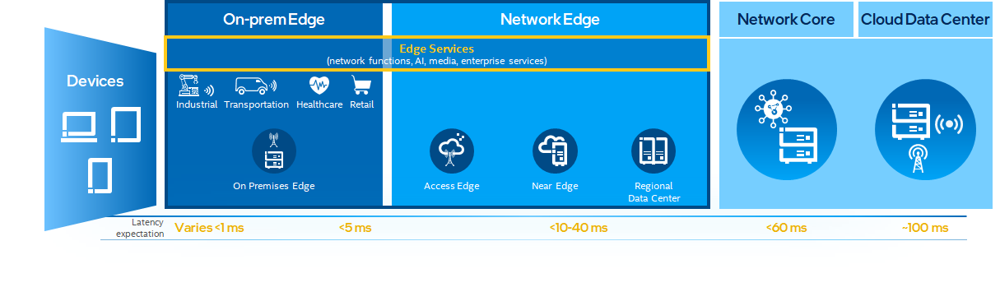

```text
SPDX-License-Identifier: Apache-2.0
Copyright (c) 2019-2020 Intel Corporation
```

<!-- omit in toc -->
# OpenNESS Overview

- [Introduction to OpenNESS](#introduction-to-openness)
- [Why consider OpenNESS](#why-consider-openness)
- [Building Blocks](#building-blocks)
- [Distributions](#distributions)
- [Consumption Models](#consumption-models)

## Introduction to OpenNESS 

OpenNESS is an edge computing software toolkit that enables highly optimized and performant edge platforms to on-board and manage applications and network functions with cloud-like agility across any type of network.

The toolkit includes a variety of Building Blocks that enable you to build different types of Converged Edge platforms that combine IT (Information Technology), OT (Operational Technology) and CT (Communications Technology).

OpenNESS can help speed up the development of Edges such as:

- Cloud Native RAN with Apps
- 5G distributed UPF with Apps
- uCPE/SD-WAN with Apps
- AI/vision inferencing apps with MEC 
- Media apps with MEC

OpenNESS is a Certified Kubernetes* offering. See the [CNCF Software Conformance program](https://www.cncf.io/certification/software-conformance/) for details.

## Why consider OpenNESS

In the era of 5G, as the cloud architectures start to disaggregate, various locations on the Telco edge start to become prime candidates for compute workloads that are capable of delivering a new set of KPIs for a new breed of apps and services. These locations include the On-prem edge (located typically in an enterprise), the Access Edge (located at or close to a 5G basestation), the Near Edge (the next aggregation point hosting a distributed UPF) and the Regional Data Center (hosting a Next Gen Central Office with wireless/wireline convergence).



As the industry seeks to settle on a consistent cloud native platform approach capable of extending across these edge locations, lowering the Total Cost of Ownership (TCO) becomes paramount.  However a number challenges need to be overcome to achieve this vision:

- Deliver platform consistency and scalability across diverse edge location requirements
- Optimize cloud native frameworks to meet stringent edge KPIs and simplify network complexity
- Leverage a broad ecosystem and evolving standards for edge computing

OpenNESS brings together the best of breed cloud native frameworks to build a horizontal edge computing platform to address these challenges.

**Benefits of OpenNESS**

Edge Performant & Optimized: 

- Data plane acceleration, throughput, real-time optimizations for low latency, accelerators for crypto, AI, & Media, telemetry & resource management, Edge native power, security, performance/footprint optimizations, Cloud Native containers & microservices based, seamless and frictionless connectivity

Multi-Access Edge Networking:

- 3GPP & ETSI MEC based 5G/4G/WiFi capabilities
- Complies with Industry Standards (3GPP, CNCF, ORAN, ETSI)

Ease of Use, Consumability & Time to Market (TTM)

- Multi-location, Multi-Access, Multi-Cloud
- Delivered via use case specific Reference Architectures for ease of consumption and to accelerate TTM
- Easy to consume Intel silicon features, integrated set of components (networking, AI, media, vertical use cases), significantly reduce development time, ability to fill gaps in partner/customer IP portfolio

## Building Blocks

OpenNESS is composed of a set of Building Blocks, each intended to offer a set of capabilities for edge solutions.

| Building Block                   | Summary                                                      |
| -------------------------------- | ------------------------------------------------------------ |
| Multi-Access Networking          | 3GPP Network function microservices enabling deployment of an edge cloud in a 5G network |
| Edge Multi-Cluster Orchestration | Manage CNFs and applications across massively distributed edge Kubernetes* clusters, placement algorithms based on platform awareness/SLA/cost, multi-cluster service mesh automation |
| Edge Aware Service Mesh          | Enhancements for high performance, reduced resource utilization, security and automation |
| Edge WAN Overlay                 | Highly optimized and secure WAN overlay implementation, providing abstraction of multiple edge & cloud provider networks as a uniform network, traffic sanitization, and edge aware SD-WAN |
| Confidential Computing           | Protecting Data In Use at the edge, IP protection in multi tenant hosted environments |
| Resource Management              | Kubernetes* extensions for Node Feature Discovery, NUMA awareness, Core Pinning, Resource Management Daemon, Topology Management |
| Data plane CNI                   | Optimized dataplanes and CNIs for various edge use cases: OVN, eBPF, SRIOV |
| Accelerators                     | Kubernetes* operators and device plugins for VPU, GPU, FPGA  |
| Telemetry and Monitoring         | Platform and application level telemetry leveraging industry standard frameworks |
| Green Edge                       | Modular microservices and Kubernetes* enhancements to manage different power profiles, events and scheduling, and detecting hotspots when deploying services |


## Distributions
OpenNESS is released as two distributions:
1. <b>OpenNESS </b>: A full open-source distribution of OpenNESS
2. <b>Intel® Distribution of OpenNESS </b>: A licensed distribution from Intel that includes all the features in OpenNESS along with additional microservices, Kubernetes\* extensions, enhancements, and optimizations for Intel® architecture. 

The Intel Distribution of OpenNESS requires a secure login to the OpenNESS GitHub repository. For access to the Intel Distribution of OpenNESS, contact your Intel support representative. 

## Consumption Models

OpenNESS can be consumed as a whole or as individual building blocks. Whether you are an infrastructure developer or an app developer, if you are moving your business to the Edge, you may benefit from utilizing OpenNESS in your next project. 

**Building Blocks**

You can explore the various building blocks packaged as Helm Charts and Kubernetes* Operators via the [OpenNESS github project](https://github.com/open-ness).

**Converged Edge Reference Architectures (CERA)**

CERA is a set of pre-integrated and readily deployable HW/SW Reference Architectures powered by OpenNESS to significantly accelerate Edge Platform Development, available via the [OpenNESS github project](https://github.com/open-ness).

**Cloud Devkits**

Software toolkits to easily deploy an OpenNESS cluster in a cloud environment such as Azure Cloud, available via the [OpenNESS github project](https://github.com/open-ness). 

**Converged Edge Insights**

Ready to deploy software packages available via the [Intel® Edge Software Hub](https://www.intel.com/content/www/us/en/edge-computing/edge-software-hub.html), comes with use case specific reference implementations to kick start your next pathfinding effort for the Edge.

Next explore the [OpenNESS Architecture](architecture.md). 
