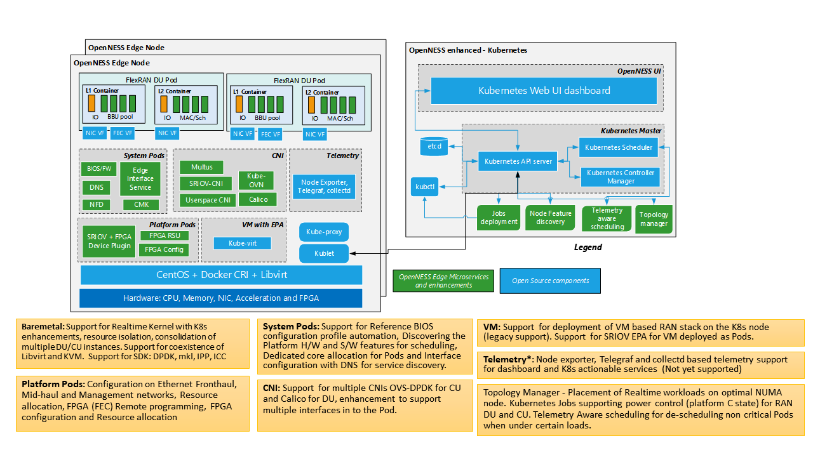

```text
SPDX-License-Identifier: Apache-2.0     
Copyright (c) 2020 Intel Corporation
```
<!-- omit in toc -->
# OpenNESS Radio Access Network (RAN)
- [Introduction](#introduction)
- [Building the FlexRAN image](#building-the-flexran-image)
- [FlexRAN hardware platform configuration](#flexran-hardware-platform-configuration)
  - [BIOS](#bios)
  - [Host kernel command line](#host-kernel-command-line)
- [Deploying and Running the FlexRAN pod](#deploying-and-running-the-flexran-pod)
- [Setting up 1588 - PTP based Time synchronization](#setting-up-1588---ptp-based-time-synchronization)
  - [Setting up PTP](#setting-up-ptp)
  - [Primary clock](#primary-clock)
  - [Secondary clock](#secondary-clock)
- [BIOS configuration](#bios-configuration)
- [References](#references)

# Introduction
Radio Access Network (RAN) is the edge of wireless network. 4G and 5G base stations form the key network function for the edge deployment. In OpenNESS, FlexRAN is used as a reference for 4G and 5G base stations as well as 4G and 5G end-to-end testing. 

FlexRAN offers high-density baseband pooling that could run on a distributed Telco\* cloud to provide a smart indoor coverage solution and next-generation fronthaul architecture. This 4G and 5G platform provides the open platform ‘smarts’ for both connectivity and new applications at the edge of the network, along with the developer tools to create these new services. FlexRAN running on the Telco Cloud provides low latency compute, storage, and network offload from the edge. Thus, saving network bandwidth. 

FlexRAN 5GNR Reference PHY is a baseband PHY Reference Design for a 4G and 5G base station, using Intel® Xeon® processor family with Intel® architecture. This 5GNR Reference PHY consists of a library of c-callable functions that are validated on several technologies from Intel (Intel® microarchitecture code name Broadwell, Intel® microarchitecture code name Skylake, Cascade Lake, and Ice Lake) and demonstrates the capabilities of the software running different 5GNR L1 features. The functionality of these library functions is defined by the relevant sections in [3GPP TS 38.211, 212, 213, 214, and 215]. Performance of the Intel 5GNR Reference PHY meets the requirements defined by the base station conformance tests in [3GPP TS 38.141]. This library of functions will be used by Intel partners and end customers as a foundation for their product development. Reference PHY is integrated with third-party L2 and L3 to complete the base station pipeline. 

The diagram below shows FlexRAN DU (Real-time L1 and L2) deployed on the OpenNESS platform with the necessary microservices and Kubernetes\* enhancements required for real-time workload deployment. 



This document aims to provide the steps involved in deploying FlexRAN 5G (gNb) on the OpenNESS platform. 

>**NOTE**: This document covers both FlexRAN 4G and 5G. All the steps mentioned in this document use 5G for reference. Refer to the [FlexRAN 4G Reference Solution L1 User Guide #570228](https://cdrdv2.intel.com/v1/dl/getContent/570228) for minor updates needed to build, deploy, and test FlexRAN 4G. 

# Building the FlexRAN image 

This section explains the steps involved in building the FlexRAN image. Only L1 and L2-stub will be part of these steps. Real-time L2 (MAC and RLC) and non-real-time L2 and L3 are out of scope as it is a part of the third-party component.  

1. Contact your Intel representative to obtain the package
2. Untar the FlexRAN package.
3. Set the required environmental variables:
   ```
   export RTE_SDK=$localPath/dpdk-19.11
   export RTE_TARGET=x86_64-native-linuxapp-icc                         
   export WIRELESS_SDK_TARGET_ISA=avx512                                
   export RPE_DIR=${flexranPath}/libs/ferrybridge
   export ROE_DIR=${flexranPath}/libs/roe
   export XRAN_DIR=${localPath}/flexran_xran
   export WIRELESS_SDK_TOOLCHAIN=icc 
   export DIR_WIRELESS_SDK_ROOT=${localPath}/wireless_sdk 
   export DIR_WIRELESS_FW=${localPath}/wireless_convergence_l1/framework
   export DIR_WIRELESS_TEST_4G=${localPath}/flexran_l1_4g_test 
   export DIR_WIRELESS_TEST_5G=${localPath}/flexran_l1_5g_test 
   export SDK_BUILD=build-${WIRELESS_SDK_TARGET_ISA}-icc 
   export DIR_WIRELESS_SDK=${DIR_WIRELESS_SDK_ROOT}/${SDK_BUILD} 
   export FLEXRAN_SDK=${DIR_WIRELESS_SDK}/install 
   export DIR_WIRELESS_TABLE_5G=${flexranPath}/bin/nr5g/gnb/l1/table    
   ```
   >**NOTE**: The environmental variables path must be updated according to your installation and file/directory names.  
4. Build L1, WLS interface between L1, L2, and L2-Stub (testmac):    
   `./flexran_build.sh -r 5gnr_sub6 -m testmac -m wls -m l1app -b -c`
5. Once the build has completed, copy the required binary files to the folder where the Docker\* image is built. The list of binary files that are used is documented in [dockerfile](https://github.com/open-ness/edgeapps/blob/master/network-functions/ran/5G/flexRAN-gnb/Dockerfile)
   - ICC, IPP mpi and mkl Runtime 
   - DPDK build target directory 
   - FlexRAN test vectors (optional) 
   - FlexRAN L1 and testmac (L2-stub) binary 
   - FlexRAN SDK modules 
   - FlexRAN WLS share library 
   - FlexRAN CPA libraries 
6. `cd` to the folder where the Docker image is built and start the docker build `docker build -t <name of image>:<tag> .` 
The following example reflects the Docker image [expected by Helm chart](https://github.com/open-ness/edgeapps/blob/master/network-functions/ran/charts/flexran/values.yaml):
   
   ```shell
   docker build -t flexran5g:3.10.0-1062.12.1.rt56 .
   ```
7. Tag the image and push to a local Docker registry (Docker registry deployed as part of OpenNESS Experience Kit)
   
   ```shell
   docker tag flexran5g <docker_registry_ip_address>:<port>/intel/flexran5g:3.10.0-1062.12.1.rt56

   docker push <docker_registry_ip_address>:<port>/intel/flexran5g:3.10.0-1062.12.1.rt56
   ```

By the end of step 7, the FlexRAN Docker image is created and available in the Docker registry. This image is copied to the edge node where FlexRAN will be deployed and that is installed with OpenNESS Network edge with all the required EPA features including Intel® FPGA Programmable Acceleration Card (Intel® FPGA PAC) N3000. Please refer to the document [Using FPGA in OpenNESS: Programming, Resource Allocation, and Configuration](https://github.com/open-ness/specs/blob/master/doc/enhanced-platform-awareness/openness-fpga.md) for details on setting up Intel® FPGA PAC N3000 with  vRAN FPGA image.

# FlexRAN hardware platform configuration 
## BIOS 
FlexRAN on Intel® microarchitecture code name Skylake and Cascade Lake technology from Intel requires a BIOS configuration that disables C-state and enables Config TDP level-2. Refer to the [BIOS configuration](#bios-configuration) section in this document. 

## Host kernel command line

```
usbcore.autosuspend=-1 selinux=0 enforcing=0 nmi_watchdog=0 softlockup_panic=0 audit=0 intel_pstate=disable cgroup_memory=1 cgroup_enable=memory mce=off idle=poll isolcpus=1-23,25-47 rcu_nocbs=1-23,25-47 kthread_cpus=0,24 irqaffinity=0,24 nohz_full=1-23,25-47 hugepagesz=1G hugepages=50 default_hugepagesz=1G intel_iommu=on iommu=pt pci=realloc pci=assign-busses
```

Host kernel version - 3.10.0-1062.12.1.rt56.1042.el7.x86_64 

Instructions on how to configure the kernel command line in OpenNESS can be found in [OpenNESS getting started documentation](https://github.com/open-ness/specs/blob/master/doc/getting-started/openness-experience-kits.md#customizing-kernel-grub-parameters-and-tuned-profile--variables-per-host)

# Deploying and Running the FlexRAN pod

1. Deploy the OpenNESS cluster with [SRIOV for FPGA enabled](https://github.com/open-ness/specs/blob/master/doc/enhanced-platform-awareness/openness-fpga.md#fpga-fec-ansible-installation-for-openness-network-edge).
2. Confirm that there are no FlexRAN pods and the FPGA configuration pods are not deployed using `kubectl get pods`.
3. Confirm that all the EPA microservice and enhancements (part of OpenNESS playbook) are deployed `kubectl get po --all-namespaces`.
  ```yaml
  NAMESPACE     NAME                                      READY   STATUS    RESTARTS   AGE
  kube-ovn      kube-ovn-cni-8x5hc                        1/1     Running   17         7d19h
  kube-ovn      kube-ovn-cni-p6v6s                        1/1     Running   1          7d19h
  kube-ovn      kube-ovn-controller-578786b499-28lvh      1/1     Running   1          7d19h
  kube-ovn      kube-ovn-controller-578786b499-d8d2t      1/1     Running   3          5d19h
  kube-ovn      ovn-central-5f456db89f-l2gps              1/1     Running   0          7d19h
  kube-ovn      ovs-ovn-56c4c                             1/1     Running   17         7d19h
  kube-ovn      ovs-ovn-fm279                             1/1     Running   5          7d19h
  kube-system   coredns-6955765f44-2lqm7                  1/1     Running   0          7d19h
  kube-system   coredns-6955765f44-bpk8q                  1/1     Running   0          7d19h
  kube-system   etcd-silpixa00394960                      1/1     Running   0          7d19h
  kube-system   kube-apiserver-silpixa00394960            1/1     Running   0          7d19h
  kube-system   kube-controller-manager-silpixa00394960   1/1     Running   0          7d19h
  kube-system   kube-multus-ds-amd64-bpq6s                1/1     Running   17         7d18h
  kube-system   kube-multus-ds-amd64-jf8ft                1/1     Running   0          7d19h
  kube-system   kube-proxy-2rh9c                          1/1     Running   0          7d19h
  kube-system   kube-proxy-7jvqg                          1/1     Running   17         7d19h
  kube-system   kube-scheduler-silpixa00394960            1/1     Running   0          7d19h
  kube-system   kube-sriov-cni-ds-amd64-crn2h             1/1     Running   17         7d19h
  kube-system   kube-sriov-cni-ds-amd64-j4jnt             1/1     Running   0          7d19h
  kube-system   kube-sriov-device-plugin-amd64-vtghv      1/1     Running   0          7d19h
  kube-system   kube-sriov-device-plugin-amd64-w4px7      1/1     Running   0          4d21h
  openness      eaa-78b89b4757-7phb8                      1/1     Running   3          5d19h
  openness      edgedns-mdvds                             1/1     Running   16         7d18h
  openness      interfaceservice-tkn6s                    1/1     Running   16         7d18h
  openness      nfd-master-82dhc                          1/1     Running   0          7d19h
  openness      nfd-worker-h4jlt                          1/1     Running   37         7d19h
  openness      syslog-master-894hs                       1/1     Running   0          7d19h
  openness      syslog-ng-n7zfm                           1/1     Running   16         7d19h
  ```
4. Deploy the Kubernetes job to program the [FPGA](https://github.com/open-ness/specs/blob/master/doc/enhanced-platform-awareness/openness-fpga.md#fpga-programming-and-telemetry-on-openness-network-edge)
5. Deploy the Kubernetes job to configure the [BIOS](https://github.com/open-ness/specs/blob/master/doc/enhanced-platform-awareness/openness-bios.md) (note: only works on select Intel development platforms)
6. Deploy the Kubernetes job to configure the [Intel PAC N3000 FPGA](https://github.com/open-ness/specs/blob/master/doc/enhanced-platform-awareness/openness-fpga.md#fec-vf-configuration-for-openness-network-edge)
7. Deploy the FlexRAN Kubernetes pod using a helm chart provided in Edge Apps repository at `edgeapps/network-functions/ran/charts`:

   ```shell
   helm install flexran-pod flexran
   ```

8. `exec` into FlexRAN pod `kubectl exec -it flexran -- /bin/bash`
9. Find the PCI Bus function device ID of the FPGA VF assigned to the pod:

   ```shell
   printenv | grep FEC
   ```

11. Edit `phycfg_timer.xml` used for configuration of L1 application with the PCI Bus function device ID from the previous step to offload FEC to this device:

    ```xml
    <!--  DPDK FEC BBDEV to use             [0 - SW, 1 - FPGA, 2 - Both] -->
    <dpdkBasebandFecMode>1</dpdkBasebandFecMode>
    <!--  DPDK BBDev name added to the whitelist. The argument format is <[domain:]bus:devid.func> -->
    <dpdkBasebandDevice>0000:1d:00.1</dpdkBasebandDevice>
    ```
12. Once in the FlexRAN pod L1 and test-L2 (testmac) can be started.

# Setting up 1588 - PTP based Time synchronization 
This section provides an overview of setting up PTP-based time synchronization in a cloud-native Kubernetes/docker environment. For FlexRAN specific xRAN fronthaul tests and configurations please refer to the xRAN specific document in the reference section.

>**NOTE**: The PTP-based time synchronization method described here is applicable only for containers. For VMs, methods based on Virtual PTP need to be applied and this is not covered in this document.  

## Setting up PTP
In the environment that needs to be synchronized, install the linuxptp package, which provides ptp4l and phc2sys applications. The PTP setup needs the primary clock and secondary clock setup. The secondary clock will be synchronized to the primary clock. At first, the primary clock will be configured. A supported NIC is required to use Hardware Time Stamps. To check if NIC is supporting Hardware Time Stamps, run the ethtool and a similar output should appear:
```shell 
# ethtool -T eno4
Time stamping parameters for eno4:
Capabilities:
        hardware-transmit     (SOF_TIMESTAMPING_TX_HARDWARE)
        software-transmit     (SOF_TIMESTAMPING_TX_SOFTWARE)
        hardware-receive      (SOF_TIMESTAMPING_RX_HARDWARE)
        software-receive      (SOF_TIMESTAMPING_RX_SOFTWARE)
        software-system-clock (SOF_TIMESTAMPING_SOFTWARE)
        hardware-raw-clock    (SOF_TIMESTAMPING_RAW_HARDWARE)
PTP Hardware Clock: 3
Hardware Transmit Timestamp Modes:
        off                   (HWTSTAMP_TX_OFF)
        on                    (HWTSTAMP_TX_ON)
Hardware Receive Filter Modes:
        none                  (HWTSTAMP_FILTER_NONE)
        ptpv1-l4-sync         (HWTSTAMP_FILTER_PTP_V1_L4_SYNC)
        ptpv1-l4-delay-req    (HWTSTAMP_FILTER_PTP_V1_L4_DELAY_REQ)
        ptpv2-event           (HWTSTAMP_FILTER_PTP_V2_EVENT)
```

The time in containers is the same as on the host machine, and so it is enough to synchronize the host to the primary clock.

PTP requires a few kernel configuration options to be enabled:
- CONFIG_PPS
- CONFIG_NETWORK_PHY_TIMESTAMPING
- CONFIG_PTP_1588_CLOCK

## Primary clock
This is an optional step if you already have a primary clock. The below steps explain how to set up a Linux system to behave like ptp GM. 

On the primary clock side, take a look at the `/etc/sysconfig/ptp4l` file. It is the `ptp4l` daemon configuration file where starting options will be provided. Its content should look like this:
```shell 
OPTIONS=”-f /etc/ptp4l.conf -i <if_name>”
```
`<if_name>` is the interface name used for time stamping and `/etc/ptp4l.conf` is a configuration file for the `ptp4l` instance.

To determine if a primary clock PTP protocol is using BMC algorithm, and it is not obvious which clock will be chosen as primary clock. However, users can set the timer that is preferable to be the primary clock. It can be changed in `/etc/ptp4l.conf`. Set `priority1 property` to `127`.

After that start ptp4l service.

```shell 
service ptp4l start
```

Output from the service can be checked at `/var/log/messages`, and for primary clock, it should be like this:

```shell 
Mar 16 17:08:57 localhost ptp4l: ptp4l[23627.304]: selected /dev/ptp2 as PTP clock
Mar 16 17:08:57 localhost ptp4l: [23627.304] selected /dev/ptp2 as PTP clock
Mar 16 17:08:57 localhost ptp4l: [23627.306] port 1: INITIALIZING to LISTENING on INITIALIZE
Mar 16 17:08:57 localhost ptp4l: ptp4l[23627.306]: port 1: INITIALIZING to LISTENING on INITIALIZE
Mar 16 17:08:57 localhost ptp4l: [23627.307] port 0: INITIALIZING to LISTENING on INITIALIZE
Mar 16 17:08:57 localhost ptp4l: ptp4l[23627.307]: port 0: INITIALIZING to LISTENING on INITIALIZE
Mar 16 17:08:57 localhost ptp4l: [23627.308] port 1: link up
Mar 16 17:08:57 localhost ptp4l: ptp4l[23627.308]: port 1: link up
Mar 16 17:09:03 localhost ptp4l: [23633.664] port 1: LISTENING to MASTER on ANNOUNCE_RECEIPT_TIMEOUT_EXPIRES
Mar 16 17:09:03 localhost ptp4l: ptp4l[23633.664]: port 1: LISTENING to MASTER on ANNOUNCE_RECEIPT_TIMEOUT_EXPIRES
Mar 16 17:09:03 localhost ptp4l: ptp4l[23633.664]: selected best master clock 001e67.fffe.d2f206
Mar 16 17:09:03 localhost ptp4l: ptp4l[23633.665]: assuming the grand master role
Mar 16 17:09:03 localhost ptp4l: [23633.664] selected best master clock 001e67.fffe.d2f206
Mar 16 17:09:03 localhost ptp4l: [23633.665] assuming the grand master role
```

The next step is to synchronize PHC timer to the system time. To do that `phc2sys` daemon will be used. Firstly edit configuration file at `/etc/sysconfig/phc2sys`.

```shell
OPTIONS="-c <if_name> -s CLOCK_REALTIME -w"
```

Replace `<if_name>` with the interface name. Start the phc2sys service.
```shell
service phc2sys start
```
Logs can be viewed at `/var/log/messages` and it looks like this:

```shell 
phc2sys[3656456.969]: Waiting for ptp4l...                                      
phc2sys[3656457.970]: sys offset -6875996252 s0 freq  -22725 delay   1555       
phc2sys[3656458.970]: sys offset -6875996391 s1 freq  -22864 delay   1542       
phc2sys[3656459.970]: sys offset       -52 s2 freq  -22916 delay   1536         
phc2sys[3656460.970]: sys offset       -29 s2 freq  -22909 delay   1548         
phc2sys[3656461.971]: sys offset       -25 s2 freq  -22913 delay   1549         
``` 

## Secondary clock
The secondary clock configuration will be the same as the primary clock except for `phc2sys` options and priority1 property for `ptp4l`. For secondary clock priority1 property in `/etc/ptp4l.conf` should stay with default value (128). Run `ptp4l` service. To keep the system time synchronized to PHC time, change `phc2sys` options in `/etc/sysconfig/phc2sys` using the following command:

```shell 
OPTIONS=”phc2sys -s <if_name> -w"
``` 
Replace `<if_name>` with the interface name. Logs will be available at `/var/log/messages`.

```shell
phc2sys[28917.406]: Waiting for ptp4l...
phc2sys[28918.406]: phc offset -42928591735 s0 freq  +24545 delay   1046
phc2sys[28919.407]: phc offset -42928611122 s1 freq   +5162 delay    955
phc2sys[28920.407]: phc offset       308 s2 freq   +5470 delay    947
phc2sys[28921.407]: phc offset       408 s2 freq   +5662 delay    947
phc2sys[28922.407]: phc offset       394 s2 freq   +5771 delay    947
```
Since this moment, both clocks should be synchronized. Any Docker container running in a pod is using the same clock as host so its clock will be synchronized as well.


# BIOS configuration 

Below is the subset of the BIOS configuration. It contains the list of BIOS features that are recommended to be configured for FlexRAN DU deployment. 

```shell
[BIOS::Advanced]

[BIOS::Advanced::Processor Configuration]
Intel(R) Hyper-Threading Tech=Enabled             
Active Processor Cores=All                         
Intel(R) Virtualization Technology=Enabled         
MLC Streamer=Enabled                               
MLC Spatial Prefetcher=Enabled                     
DCU Data Prefetcher=Enabled                        
DCU Instruction Prefetcher=Enabled                 
LLC Prefetch=Enabled 

[BIOS::Advanced::Power & Performance]
CPU Power and Performance Policy=Performance       
Workload Configuration=I/O Sensitive               

[BIOS::Advanced::Power & Performance::CPU C State Control]
Package C-State=C0/C1 state                        
C1E=Disabled           ; Can be enabled Power savings                             
Processor C6=Disabled          

[BIOS::Advanced::Power & Performance::Hardware P States]
Hardware P-States=Disabled                         

[BIOS::Advanced::Power & Performance::CPU P State Control]
Enhanced Intel SpeedStep(R) Tech=Enabled           
Intel Configurable TDP=Enabled                     
Configurable TDP Level=Level 2                     
Intel(R) Turbo Boost Technology=Enabled            
Energy Efficient Turbo=Disabled                    

[BIOS::Advanced::Power & Performance::Uncore Power Management]
Uncore Frequency Scaling=Enabled                   
Performance P-limit=Enabled        

[BIOS::Advanced::Memory Configuration::Memory RAS and Performance Configuration]
NUMA Optimized=Enabled                             
Sub_NUMA Cluster=Disabled                          

[BIOS::Advanced::PCI Configuration]
Memory Mapped I/O above 4 GB=Enabled               
SR-IOV Support=Enabled     
```

# References
- FlexRAN Reference Solution Software Release Notes - Document ID:575822
- FlexRAN Reference Solution LTE eNB L2-L1 API Specification - Document ID:571742
- FlexRAN 5G New Radio Reference Solution L2-L1 API Specification - Document ID:603575
- FlexRAN 4G Reference Solution L1 User Guide - Document ID:570228
- FlexRAN 5G NR Reference Solution L1 User Guide - Document ID:603576
- FlexRAN Reference Solution L1 XML Configuration User Guide - Document ID:571741
- FlexRAN 5G New Radio FPGA User Guide	- Document ID:603578
- FlexRAN Reference Solution xRAN FrontHaul SAS - Document ID:611268