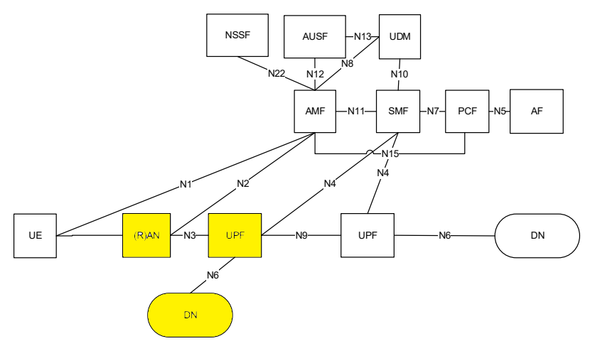
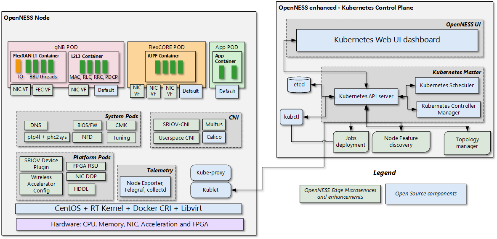
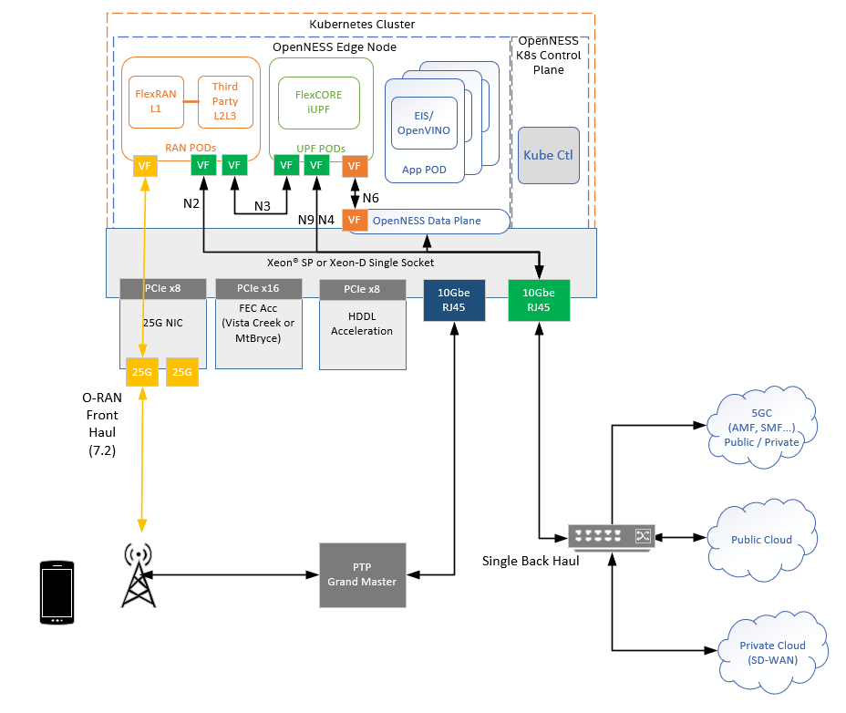

```text
SPDX-License-Identifier: Apache-2.0
Copyright (c) 2020-2021 Intel Corporation
```
<!-- omit in toc -->
# Converged Edge Reference Architecture 5G On Premises Edge
The Converged Edge Reference Architectures (CERA) are a set of pre-integrated HW/SW reference architectures based on OpenNESS to accelerate the development of edge platforms and architectures. This document describes the CERA 5G On Premises Edge, which combines wireless networking and high performance compute for IoT, AI, video and other services.

- [CERA 5G On Prem](#cera-5g-on-prem)
  - [CERA 5G On Prem Experience Kit](#cera-5g-on-prem-experience-kit)
    - [CERA 5G On Prem OpenNESS Configuration](#cera-5g-on-prem-openness-configuration)
    - [CERA 5G On Prem Deployment Architecture](#cera-5g-on-prem-deployment-architecture)
    - [CERA 5G On Prem Experience Kit Deployments](#cera-5g-on-prem-experience-kit-deployments)

## CERA 5G On Prem
CERA 5G On Prem deployment focuses on On Premises, Private Wireless and Ruggedized Outdoor deployments, presenting a scalable solution across the On Premises Edge. The assumed 3GPP deployment architecture is based on the figure below from 3GPP 23.501 Rel15 which shows the reference point representation for concurrent access to two (e.g. local and central) data networks (single PDU Session option). The highlighted yellow blocks - RAN, UPF and Data Network (edge apps) are deployed on the CERA 5G On Prem. 



> Figure 1 - 3GPP Network

### CERA 5G On Prem Experience Kit
The CERA 5G On Prem implementation in OpenNESS supports a single Orchestration domain, optimizing the edge node to support Network Functions (gNB, UPF) and Applications at the same time. This allows the deployment on small uCPE and pole mounted form factors.

#### CERA 5G On Prem OpenNESS Configuration 
CERA 5G On Prem is a combination of the existing OpenNESS Building Blocks required to run 5G gNB, UPF, Applications and their associated HW Accelerators. CERA 5G On Prem also adds CMK and RMD to better support workload isolation and mitigate any interference from applications affecting the performance of the network functions. The below diagram shows the logical deployment with the OpenNESS Building Blocks. 



> Figure 2 - CERA 5G On Prem Architecture

#### CERA 5G On Prem Deployment Architecture



> Figure 3 - CERA 5G On Prem Deployment

CERA 5G On Prem architecture supports a single platform (Xeon® SP and Xeon D) that hosts both the Edge Node and the Kubernetes* Control Plane. The UPF is deployed using SRIOV-Device plugin and SRIOV-CNI allowing direct access to the network interfaces used for connection to the gNB and back haul. For high throughput workloads such as UPF network function, it is recommended to use single root input/output (SR-IOV) pass-through the physical function (PF) or the virtual function (VF), as required. Also, in some cases, the simple switching capability in the NIC can be used to send traffic from one application to another, as there is a direct path of communication required between the UPF and the Data plane, this becomes an option. It should be noted that the VF-to-VF option is only suitable when there is a direct connection between PODs on the same PF with no support for advanced switching. In this scenario, it is advantageous to configure the UPF with three separate interfaces for the different types of traffic flowing in the system. This eliminates the need for additional traffic switching at the host. In this case, there is a separate interface for N3 traffic to the Access Network, N9 and N4 traffic can share an interface to the backhaul network. While local data network traffic on the N6 can be switched directly to the local applications, similarly gNB DU and CU interfaces N2 and N4 are separated. Depending on performance requirements, a mix of data planes can be used on the platform to meet the varying requirements of the workloads. 

The applications are deployed on the same edge node as the UPF and gNB.

The use of Intel® Resource Director Technology (Intel® RDT) ensures that the cache allocation and memory bandwidth are optimized for the workloads on running on the platform.

Intel® Speed Select Technology (Intel® SST) can be used to further enhance the performance of the platform.

The following Building Blocks are supported in OpenNESS

- <b>High-Density Deep Learning (HDDL)</b>: Software that enables OpenVINO™-based AI apps to run on Intel® Movidius Vision Processing Units (VPUs). It consists of the following components:
  - HDDL device plugin for K8s
  - HDDL service for scheduling jobs on VPUs
- <b>FPGA/eASIC/NIC</b>: Software that enables AI inferencing for applications, high-performance and low-latency packet pre-processing on network cards, and offloading for network functions such as eNB/gNB offloading Forward Error Correction (FEC). It consists of: 
  - FPGA device plugin for inferencing
  - SR-IOV device plugin for FPGA/eASIC
  - Dynamic Device Profile for Network Interface Cards (NIC)
- <b>Resource Management Daemon (RMD)</b>: RMD uses Intel® Resource Director Technology (Intel® RDT) to implement cache allocation and memory bandwidth allocation to the application pods. This is a key technology for achieving resource isolation and determinism on a cloud-native platform. 
- <b>Node Feature Discovery (NFD)</b>: Software that enables node feature discovery for Kubernetes*. It detects hardware features available on each node in a Kubernetes* cluster and advertises those features using node labels. 
- <b>Topology Manager</b>: This component allows users to align their CPU and peripheral device allocations by NUMA node.
- <b>Kubevirt</b>: Provides support for running legacy applications in VM mode and the allocation of SR-IOV ethernet interfaces to VMs. 
- <b>Precision Time Protocol (PTP)</b>: Uses primary-secondary architecture for time synchronization between machines connected through ETH. The primary clock is a reference clock for the secondary nodes that adapt their clocks to the primary node's clock. Grand Master Clock (GMC) can be used to precisely set primary clock.

#### CERA 5G On Prem Experience Kit Deployments
The CERA 5G On Prem experience kit deploys both the 5G On Premises cluster and also a second cluster to host the 5GC control plane functions and provide an additional Data Network POD to act as public network for testing purposes. Note that the Access network and UE are not configured as part of the CERA 5G On Prem Experience Kit. Also required but not provided is a binary iUPF, UPF and 5GC components. Please contact your local Intel® representative for more information. 


> Figure 4 - CERA Experience Kit

**More details on the Converged Edge Reference Architecture for On Premises deployments is available under [Intel® Distribution of OpenNESS](https://www.openness.org/products/intel-distribution).**
