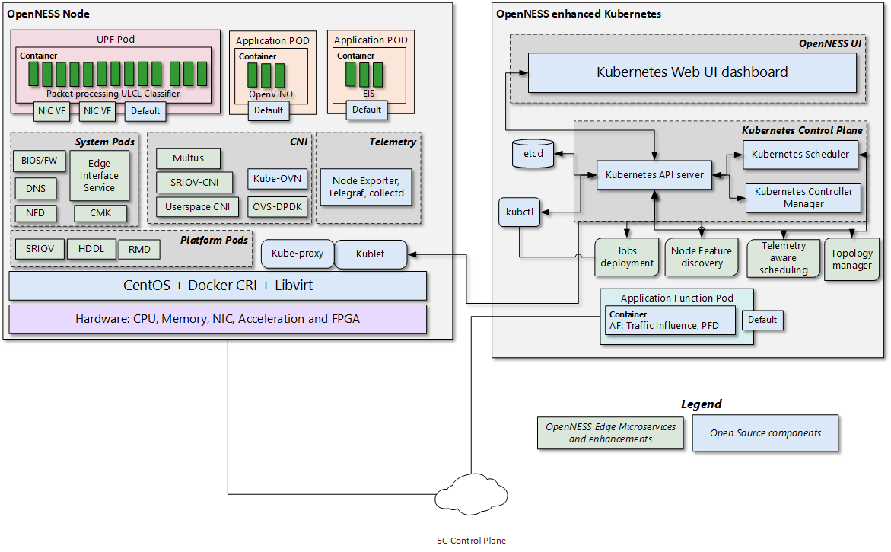
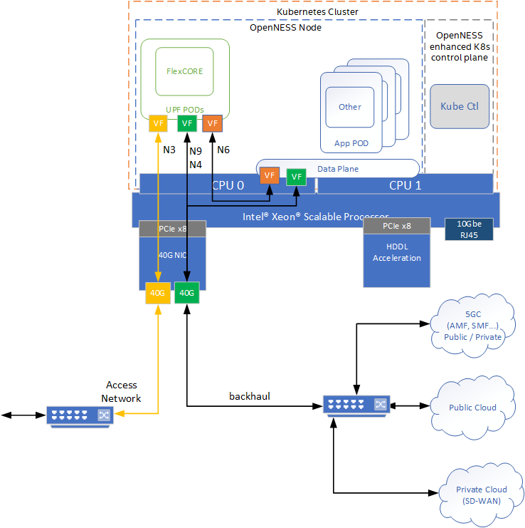
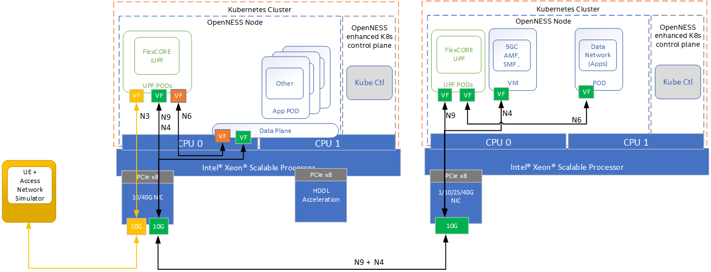

```text
SPDX-License-Identifier: Apache-2.0
Copyright (c) 2020 Intel Corporation
```
<!-- omit in toc -->
# Converged Edge Reference Architecture Near Edge
Reference architecture combines wireless and high performance compute for IoT, AI, video and other services.

- [CERA Near Edge Experience Kit](#cera-near-edge-experience-kit)
  - [CERA Near Edge OpenNESS Configuration](#cera-near-edge-openness-configuration)
  - [CERA Near Edge Deployment Architecture](#cera-near-edge-deployment-architecture)
  - [CERA Near Edge Experience Kit Deployments](#cera-near-edge-experience-kit-deployments)

## CERA Near Edge Experience Kit
In order to support the most flexibility the first CERA Near Edge implementation in OpenNESS supports a single Orchestration domain, optimizing the edge node to support Network Functions (UPF) and Applications at the same time. This is also useful for demonstration purposes as the Near Edge deployment can be scaled down to a single server reducing HW and cost associated with setup. 

### CERA Near Edge OpenNESS Configuration 
CERA Near edge is a combination of the existing OpenNESS Reference Architecture [CERA NGC](../flavors.md#core-control-plane-flavor), [CERA UPF](../flavors.md#core-user-plane-flavor), [CERA Apps](../flavors.md#minimal-flavor). CERA Near edge takes the NGC Reference Architecture as a base and adds the additional service required to run applications and their associated HW Acceleration for AI workloads. CERA Near edge also adds CMK and RMD to better support workload isolation and mitigate any interference from applications affecting the performance of the network functions. The below diagram shows the logical deployment with the OpenNESS micro services. 



> Figure 1 - CERA Near Edge Architecture

### CERA Near Edge Deployment Architecture



> Figure 2 - CERA Near Edge Deployment

The CERA Near Edge architecture consists of a multi node (Xeon(R) SP based servers) cluster which can also be modified to support a single platform that hosts both the Edge Node and the Kubernetes Control Plane. The UPF is deployed using SRIOV-Device plugin and SRIOV-CNI allowing direct access to the network interfaces used for connection to the gNB and back haul. For high throughput workloads like UPF network function, it is recommended to use single root input/output (SR-IOV) pass through of the physical function (PF) or the virtual function (VF) as required. Also, in some cases, the simple switching capability in the NIC can be used to send traffic from one application to another as there is a direct path of communication required between the UPF and the Data plane this becomes an option. It should be noted the VF-to-VF option is only suitable when there is a direct connection between PODs on the same PF with no support for advanced switching. In this scenario it is advantageous to configure the UPF with three separate interfaces for the different types of traffic flowing in the system. This eliminates the need for additional traffic switching at the host. In this case there is a separate interface for N3 traffic to the Access Network, N9 and N4 traffic can share an interface to the backhaul network. While local data network traffic on the N6 can be switched directly to the local applications. Depending on performance requirements, a mix of data planes can be used on the platform to meet the varying requirements of the workloads. 

The applications are deployed on the same edge node as the UPF. Using CMK the applications can be deployed on the same CPU Socket or on separate CPU socket depending on the requirements. CPU pinning provides resource partitioning by pinning the workloads to specific CPU cores to ensure the low priority workloads don't interfere with the high priority NF workloads.

The use of Intel® Resource Director Technology (Intel® RDT) ensures the cache allocation and memory bandwidth are optimized for the workloads on running on the platform.

Intel® Speed Select Technology (Intel® SST) can be used to further enhance the performance of the platform.

The following EPA features are supported in OpenNESS

- <b>High-Density Deep Learning (HDDL)</b>: Software that enables OpenVINOâ„¢-based AI apps to run on Intel® Movidius Vision Processing Units (VPUs). It consists of the following components:
  - HDDL device plugin for K8s
  - HDDL service for scheduling jobs on VPUs
- <b>Visual Compute Acceleration - Analytics (VCAC-A)</b>: Software that enables OpenVINO-based AI apps and media apps to run on Intel® Visual Compute Accelerator Cards (Intel® VCA Cards). It is composed of the following components: 
  - VPU device plugin for K8s
  - HDDL service for scheduling jobs on VPU
  - GPU device plugin for K8s
- <b>FPGA/eASIC/NIC</b>: Software that enables AI inferencing for applications, high-performance and low-latency packet pre-processing on network cards, and offloading for network functions such as eNB/gNB offloading Forward Error Correction (FEC). It consists of: 
  - FPGA device plugin for inferencing
  - SR-IOV device plugin for FPGA/eASIC
  - Dynamic Device Profile for Network Interface Cards (NIC)
- <b>Resource Management Daemon (RMD)</b>: RMD uses Intel® Resource Director Technology (Intel® RDT) to implement cache allocation and memory bandwidth allocation to the application pods. This is a key technology for achieving resource isolation and determinism on a cloud-native platform. 
- <b>Node Feature Discovery (NFD)</b>: Software that enables node feature discovery for Kubernetes. It detects hardware features available on each node in a Kubernetes cluster and advertises those features using node labels. 
- <b>Topology Manager</b>: This component allows users to align their CPU and peripheral device allocations by NUMA node.
- <b>Kubevirt</b>: Provides support for running legacy applications in VM mode and the allocation of SR-IOV ethernet interfaces to VMs. 

### CERA Near Edge Experience Kit Deployments
The CERA Near edge experience kits deploys both the near edge cluster and also a second cluster to host the 5GC control plane functions and provide an additional Data Network POD to act as public network for testing purposed. Note the Access network and UE simulators are not configured as part of the CERA Near Edge Experience Kit. Also required but not provided is a binary iUPF, UPF and 5GC components. Please contact local Intel® rep for more information. 



> Figure 3 - CERA Experience Kit

**More details on the Converged Edge Reference Architecture for Near Edge deployments is available under [Intel® Distribution of OpenNESS](https://www.openness.org/products/intel-distribution).**
