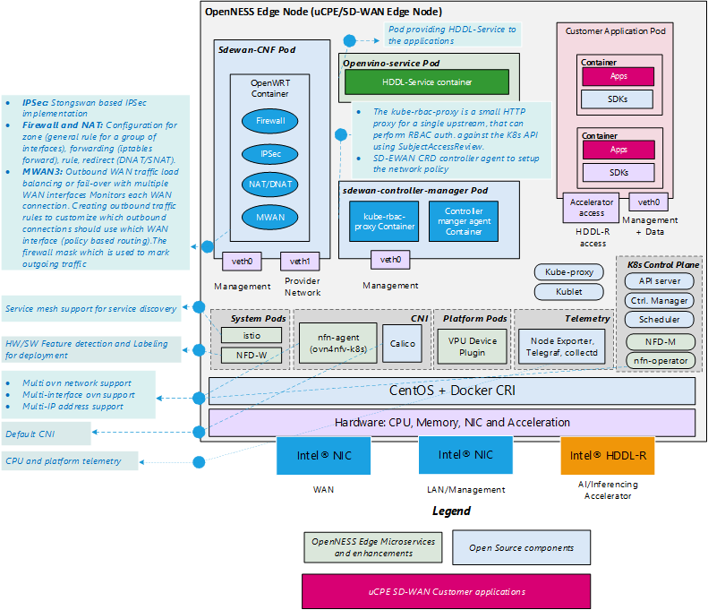
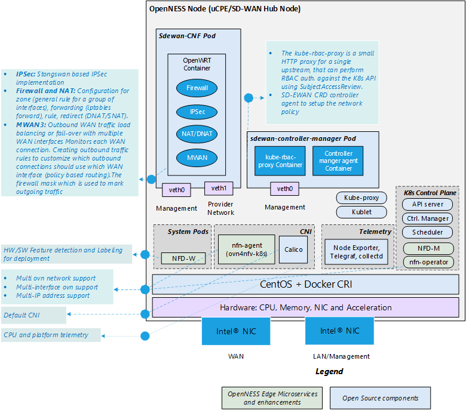

```text
SPDX-License-Identifier: Apache-2.0     
Copyright (c) 2020 Intel Corporation  
```
<!-- omit in toc -->
# Converged Edge Reference Architecture for SD-WAN

- [Converged Edge Reference Architectures (CERA)](#converged-edge-reference-architectures-cera)
  - [SD-WAN Edge Reference Architecture](#sd-wan-edge-reference-architecture)
  - [SD-WAN Hub Reference Architecture](#sd-wan-hub-reference-architecture)

## Converged Edge Reference Architectures (CERA)
CERA is a business program that creates and maintains validated reference architectures of edge networks, including both hardware and software elements. The reference architectures are used by ISVs, system integrators, and others to accelerate the development of production edge computing systems.

The OpenNESS project has created a CERA reference architecture for SD-WAN edge and SD-WAN hub. They are used, with OpenNESS, to create a uCPE platform for an SD-WAN CNF on edge and hub accordingly. Even though there is only one implementation of CNF, it can be used for two different purposes, as described below.

### SD-WAN Edge Reference Architecture
The SD-WAN Edge CERA reference implementation is used to deploy SD-WAN CNF on a single-node edge cluster that will also accomodate enterprize edge applications. The major goal of SD-WAN Edge is to support the creation of a Kubernetes-based platform that boosts the performance of deployed edge applications and reduces resource usage by the Kubernetes system. To accomplish this, the underlying platform must be optimized and made ready to use IA accelerators. OpenNESS provides support for the deployment of OpenVINO™ applications and workloads acceleration with the Intel® Movidius™ VPU HDDL-R add-in card.  SD-WAN Edge also enables the Node Feature Discovery (NFD) building block on the cluster to provide awareness of the nodes’ features to  edge applications. Finally, SD-WAN Edge implements Istio Service Mesh (SM) in the default namespace to connect the edge applications. SM acts as a middleware between  edge applications/services and the OpenNESS platform, and provides abstractions for traffic management, observability, and security of the building blocks in the platform. Istio is a cloud-native service mesh that provides capabilities such as Traffic Management, Security, and Observability uniformly across a network of services. OpenNESS integrates with Istio to reduce the complexity of large scale edge applications, services, and network functions. More information on SM in OpenNESS can be found on the OpenNESS [website](https://openness.org/developers/).


To minimalize resource consumption by the cluster, SD-WAN Edge disables services such as EAA, Edge DNS, and Kafka. Telemetry service stays active for all the Kubernetes deployments.

The following figure shows the system architecture of the SD-WAN Edge Reference Architecture.




### SD-WAN Hub Reference Architecture
The SD-WAN Hub reference architecture prepares an OpenNESS platform for a single-node cluster that functions primarily as an SD-WAN hub. That cluster will also deploy a SD-WAN CRD Controller and a CNF, but no other corporate applications are expected to run on it. That is why the node does not enable support for an HDDL card or for Network Feature Discovery and Service Mesh.

The Hub is another OpenNESS single-node cluster that acts as a proxy between different edge clusters. The Hub is essential to connect  edges through a WAN when applications within the edge clusters have no public IP addresses, which requires additional routing rules to provide access. These rules can be configured globally on a device acting as a hub for the edge locations. 

The Hub node has two expected use-cases:

- If the edge application wants to access the internet, or an external application wants to access service running in the edge node, the Hub node can act as a gateway with a security policy in force.

- For communication between a pair of edge nodes located at different locations (and in different clusters), if both edge nodes have public IP addresses, then an IP Tunnel can be configured directly between the edge clusters, otherwise the Hub node is required to act as a proxy to enable the communication.

The following figure shows the system architecture of the SD-WAN Hub Reference Architecture.



**More details on the Converged Edge Reference Architecture for SD-WAN Edge deployments is available under [Intel® Distribution of OpenNESS](https://www.openness.org/products/intel-distribution).**
