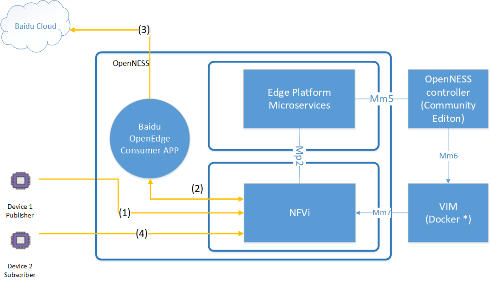

SPDX-License-Identifier: Apache-2.0-Clause.
Copyright 2019 Intel Corporation and Smart-Edge.com, Inc. All rights reserved.

# Running Baidu OpenEdge IOT gateway as Edge Application on OpenNESS 
- Application Note

Contents

[1.0 Overview 4](#overview)

[2.0 Integration Architecture 5](#integration-architecture)

[3.0 Run OpenEdge on OpenNESS 6](#run-openedge-on-openness)

[3.1 OpenNESS Setup 6](#openness-setup)

[3.2 OpenEdge Setup 6](#openedge-setup)

[3.2.1 Scripts overview 6](#scripts-overview)

[3.2.2 Prepare openEdge certs and configuration files
7](#prepare-openedge-certs-and-configuration-files)

[3.2.3 Running scripts -- build and run openEdge
11](#running-scripts-build-and-run-openedge)

[4.0 End to End Example Demo 13](#end-to-end-example-demo)

[4.1 Overview 13](#overview-1)

[4.2 Run MQTT simulator 14](#run-mqtt-simulator)

[4.2.1 Test OpenEdge Sub and Pub: 14](#test-openedge-sub-and-pub)

[4.2.2 Test OpenEdge Route to IotHub:
15](#test-openedge-route-to-iothub)

[4.2.3 RTT Test with OpenEdge: 15](#rtt-test-with-openedge)

[4.2.4 RTT Test with IoTHub: 16](#rtt-test-with-iothub)

Revision History

  Revision   Description                                  Date

---

  1.0        Initial release for application note v 1.0   June 2019

Overview
========

The Intel® OpenNESS is an Edge Computing Platform dev kit for enabling
Enterprise and CoSP developers to build network edge software for media,
industrial, smart city etc. With its OpenAPI, it can integrate with
Baidu® Cloud Connector --OpenEdge which is Edge Gateway. (The whole
solution together with Baidu® edge management dashboard is called as
Baidu® IntelliEdge. More details refer to Baidu's website:
www.baidu.com)

This application note will provide guidelines and examples on:

- Integration Architecture Description

- Run Baidu® OpenEdge on Intel® OpenNESS platform.

- End to End Example

Integration Architecture
========================

Figure 1. Integration Architecture for openEdge on openNESS.


- OpenNESS Edge Platform support Cloud Native Infrastructure. Baidu OpenEdge and other edge apps can run as separated container.
  
  OpenNESS NTS will send/receive data traffic to/from the apps according to traffic routing configuration.

- OpenEdge can play as two types of Apps
  
  - Producer: provides a service to other apps on the Edge Platform
    
    (need control path between openEdge and openNESS for Mp1 interaction).
  
  - Consumer: consumes end user traffic and optionally can get services from producer apps on the same edge platform 
    
    (If need to get services from other edge apps, it need to use control path to authenticate and register with OpenNESS).
  
  - NOTE: in the application note, OpenEdge is treated as pure consumer application and need not get service from other edge
    
    apps. So in the integration architecture diagram, there is not control path.

Run OpenEdge on OpenNESS 
=========================

This section describe how to setup and run openEdge as a consumer
application on openNESS based on cloud native infrastructure.

OpenNESS Setup
--------------

Follow \<\< OpenNESS user guide\>\> to prepare setup envionment, deploy
OpenNESS and configure traffic routing rules.

OpenEdge Setup
--------------

### Scripts overview

In the openNESS release package, it provides example scripts to help
user for the setup. The scripts are located in the following repository
subfolder: ./scripts/ansible/example/setup\_baidu\_openedge as below:

```docker
setup_baidu_openedge
├── 01_setup.sh

├── 02_build.sh

├── 03_deploy.sh

├── composefile

│   ├── democfg

│   ├── docker-compose.yml

│   ├── Dockerfile

│   └── entrypoint.sh

├── docker

│   ├── cleanup.yml

│   ├── compose_build.yml

│   └── compose_up.yml

├── mqtt

│   ├── devices

│   │   ├── openedge_pub.py

│   │   └── openedge_sub.py

│   └── rtt

│   ├── measure_rtt_iothub.py

│   └── measure_rtt_openedge.py

├── tasks

│   ├── build_main.yml

│   ├── deploy_main.yml

│   ├── script_success.yml

│   └── setup_main.yml

└── vars

└── defaults.yml
```

There are three main scripts: 01\_setup.sh, 02\_build.sh and
03\_deploy.sh. The scrips need to be executed as root user in the order
from local console on the openNESS server or remotely via SSH. The other
scripts will be called by the three main scripts for the setup.

The folder -- mqtt which contains MQTT IOT device simulators for end to
end testing, so they should be executed from device machines.

The folder -- democfg where should put files downloaded from baidu cloud
to bringup openedge.

### Prepare openEdge certs and configuration files

Before build and run openEdge, need to register Baidu account to get
certification and configuration files which nesseceray for openEdge
gateway to register with Baidu ® IntelliEdge management suite (It
provides management dashboard for managing openEdge gateway.) More
details about how to get those Baidu's files, please goto
<https://cloud.baidu.com/> and serch key word: Baidu IntelliEdge.

In the subfolder:
./scripts/ansible/example/setup\_baidu\_openedge/composefile/democfg,
need to get files from Baidu® IntelliEdge to the folder: democfg. Thus,
when building container image for openEdge, those files will be copied
into the image. And the subdirectory structure in the democfg should
look like as below:

```docker
├── democfg

│ ├── agent-cert

│ │ ├── client.key

│ │ ├── client.pem

│ │ ├── openapi.pem

│ │ └── root.pem

│ ├── agent-conf

│ │ └── service.yml

│ ├── application.yml

│ └── remote-iothub-conf

│ └── service.yml
```

Below will describe example configuration for your reference, and the
example configurations can be used for the end to end example demo in
chapter 4.0 End to End Example Demo.

**Democfg/application.yml example:**

```docker
> version: v0
> 
> services:
> 
> - name: localhub
> 
> image: openedge-hub
> 
> replica: 1
> 
> mounts:
> 
> - name: localhub-conf
> 
> path: etc/openedge
> 
> readonly: true
> 
> - name: localhub-cert
> 
> path: var/db/openedge/cert
> 
> readonly: true
> 
> - name: localhub-data
> 
> path: var/db/openedge/data
> 
> - name: localhub-log
> 
> path: var/log/openedge
> 
> # native process mode only
> 
> - name: openedge-hub-bin
> 
> path: lib/openedge/openedge-hub
> 
> readonly: true
> 
> - name: agent
> 
> image: openedge-agent
> 
> replica: 1
> 
> mounts:
> 
> - name: agent-conf
> 
> path: etc/openedge
> 
> readonly: true
> 
> - name: agent-cert
> 
> path: var/db/openedge/cert
> 
> readonly: true
> 
> - name: agent-volumes
> 
> path: var/db/openedge/volumes
> 
> - name: agent-log
> 
> path: var/log/openedge
> 
> # native process mode only
> 
> - name: openedge-agent-bin
> 
> path: lib/openedge/openedge-agent
> 
> readonly: true
> 
> - name: remote-iothub
> 
> image: openedge-remote-mqtt
> 
> replica: 1
> 
> mounts:
> 
> - name: remote-iothub-conf
> 
> path: etc/openedge
> 
> readonly: true
> 
> - name: remote-iothub-cert
> 
> path: var/db/openedge/cert
> 
> readonly: true
> 
> - name: remote-iothub-log
> 
> path: var/log/openedge
> 
> # native process mode only
> 
> - name: openedge-remote-mqtt-bin
> 
> path: lib/openedge/openedge-remote-mqtt
> 
> readonly: true
> 
> volumes:
> 
> # hub
> 
> - name: localhub-conf
> 
> path: var/db/openedge/localhub-conf
> 
> - name: localhub-data
> 
> path: var/db/openedge/localhub-data
> 
> - name: localhub-cert
> 
> path: var/db/openedge/localhub-cert-only-for-test
> 
> - name: localhub-log
> 
> path: var/db/openedge/localhub-log
> 
> # agent
> 
> - name: agent-conf
> 
> path: var/db/openedge/agent-conf
> 
> - name: agent-cert
> 
> path: var/db/openedge/agent-cert
> 
> - name: agent-volumes
> 
> path: var/db/openedge
> 
> - name: agent-log
> 
> path: var/db/openedge/agent-log
> 
> # remote mqtt
> 
> - name: remote-iothub-conf
> 
> path: var/db/openedge/remote-iothub-conf
> 
> - name: remote-iothub-cert
> 
> path: var/db/openedge/remote-iothub-cert
> 
> - name: remote-iothub-log
> 
> path: var/db/openedge/remote-iothub-log
> 
> # bin, native process mode only
> 
> - name: openedge-hub-bin
> 
> path: var/db/openedge/openedge-hub
> 
> - name: openedge-agent-bin
> 
> path: var/db/openedge/openedge-agent
> 
> - name: openedge-remote-mqtt-bin
> 
> path: var/db/openedge/openedge-remote-mqtt
```

**Democfg/** **agent-cert/ example:**
The cert files should be downloaded from Baidu IntelliEdge management
dashboard for the openEdge gateway and put into the subfolder:
/democfg/agent-cert/.

**Democfg/** **agent-conf/service.yml example:**
The service.yml file should be downloaded from Baidu IntelliEdge
management dashboard for the openEdge gateway and put into the
subfolder: /democfg/agent-conf/

**Democfg/remote-iothub-conf/service.yml example:**

```docker
> hub:
> 
> address: tcp://0.0.0.0:1883
> 
> username: test
> 
> password: hahaha
> 
> remotes:
> 
> - name: remotemec
> 
> address: 'tcp://xxxx.mqtt.iot.gz.baidubce.com:1883\'
> 
> clientid: xxxxxx
> 
> username: xxxx/xxxx
> 
> password: xxxxxxxxxxxx
> 
> rules:
> 
> - hub:
> 
> subscriptions:
> 
> - topic: t/topic
> 
> remote:
> 
> name: remotemec
> 
> subscriptions:
> 
> - topic: rtt
> 
> qos: 1
> 
> logger:
> 
> path: var/log/openedge/service.log
> 
> level: "debug"
```

The configuration file is used for testing the data path: MQTT device
-\> Baidu® openEdge -\> Baidu® IoT Cloud (also named as IoTHub). To get
information, goto website: cloud.baidu.com, and search keyword: iothub.

### Running scripts -- build and run openEdge

On the server that is running openNESS, executed the scripts as blew:

```docker
01_setup.sh

02_build.sh

03_deploy.sh
```

After competition for each script, expected successful print should be
as:

```docker
"msg": "Script completed successfully"
```

Check docker information to make sure that the container STATUS is Up.

```docker
#docker ps

CONTAINER ID IMAGE COMMAND CREATED STATUS PORTS NAMES

f83a63f3f11e composefile_baidu_edge "entrypoint.sh" 4 seconds ago
Up 3 seconds 0.0.0.0:443->443/tcp, 0.0.0.0:1883-1884->1883-1884/tcp
composefile_baidu_edge_1
```

End to End Example Demo
=======================

Overview
--------

Figure 2. End to End Example Diagram.



This is an end to end example demo for MQTT traffic. This could be an
IOT industrial application. It consists of the following elements and
related IOT data processing:

- Two MQTT devices as publisher and subscriber. Can use MQTT client
  
  software to simulate two MQTT IOT devices.

- Intel OpenNESS + Controller: OpenNESS controller performs management
  
  and policy configuration. For this example, controller will
  
  configure traffic rule for routing MQTT IOT traffic to Baidu
  
  OpenEdge via Intel OpenNESS.

- Baidu OpenEdge: It plays a pure consumer app without invoking
  
  services from other producer application, so need not Mp1 interface
  
  interaction with OpenNESS platform. It will handle data traffic
  
  from/to MQTT devices via OpenNESS Platform.

- IOT MQTT Data plane processing:

  (1) Device #1 publisher publishes its status data by using MQTT protocol.

  (2) OpenNESS Platform forwards the traffic to Baidu OpenEdge according
    to traffic rule. Then Baidu OpenEdge will perform local computing
    and data filter.

  (3) According to topic configuration, Baidu OpenEdge sends data to Baidu Cloud.

  (4) Also Baidu OpenEdge forwards the message to device #2 sbuscriber.

Run MQTT simulator
------------------

In the openNESS release package, it provides example scripts to help
user for MQTT simulator and RTT testing. The scripts are located in the
following repository subfolder:
./scripts/ansible/example/setup_baidu_openedge/mqtt as below:

```docker
├── devices

│   ├── openedge_pub.py

│   └── openedge_sub.py

└── rtt

├── measure_rtt_iothub.py

└── measure_rtt_openedge.py
```

Before running the scripts, need install python3.6 and paho mqtt on
CentOS Linux Machine (suggested version is: CentOS Linux release
7.6.1810 (Core)). Suggested install commands as below:

```docker
sudo yum -y install epel-release

sudo yum update

sudo yum install python36

sudo yum install python36-pip

sudo pip3 install paho-mqtt
```

### Test OpenEdge Sub and Pub:

Data path is:

```docker
Device1 publisher -> OpenNESS -> OpenEdge -> OpenNESS -> Deivce 2
Subscriber.
```

Run commands separately on the two devices's machines:

```docker
python3.6 openedge_pub.py -e [openness_address] -c clientA -u test
-s hahaha -t t

python3.6 openedge_sub.py -e [openness_address] -c clientB -u test
-s hahaha -t t/topic
```

*NOTE: [openness_address] is ip address of openNESS server IP.*

Expected result on the subscriber:

```docker
Received Message of Topic t/topic

Message Content: b\'{\"wmId\": 0,\"aa\": b,\"cc\": {\"p\": 99,\"kk\":
x}}\'
```

### Test OpenEdge Route to IotHub:

Data path is:

```docker
Device1 publisher -> OpenNESS -> OpenEdge -> IoTHub -> Deivce 2
Subscriber.
```

Run commands separately on the two devices's machines:

```docker
python3.6 openedge_sub.py -e [iothub_address] -c clientA -u
[iothub_username] -s [iothub_password] -t t/topic

python3.6 openedge_pub.py -e [openness_address] -c clientB -u test
-s hahaha -t t
```

*NOTE: iothub_address, iothub_username and iothub_password are
configuration information that can be got when registering user for
Baidu IoTHub.*

Expected result on the subscriber:

```docker
Received Message of Topic t/topic

Message Content: b\'{\"wmId\": 0,\"aa\": b,\"cc\": {\"p\": 99,\"kk\":
x}}\'
```

### RTT Test with OpenEdge:

Data path is:

```docker
Device1 publisher -> OpenNESS -> OpenEdge -> OpenNESS -> Deivce 1
Subscriber.
```

Run command on the one machine (for example: only device \#1 machine):

```docker
python3.6 measure_rtt_openedge.py -e [openness_address] -c
clientRTT -u test -s hahaha -t t -b t/topic
```

*NOTE: \[openness\_address\] is ip address of openNESS server IP.*

Expected result on the subscriber:

```docker
===receve message from topic: t/topic

avg delay (ms) = 1.7480066461309578
```

And the output statistics file is: rtt\_openedge.csv

### RTT Test with IoTHub:

Data path is:

```docker
Device1 publisher -> OpenNESS -> OpenEdge -> IoTHub -> Deivce 1
Subscriber.
```

Run command on the one machine (for example: only device \#1 machine):

```docker
python3.6 measure_rtt_iothub.py -e [iothub_address] -c clientA -u
[iothub_username] -s [iothub_password] -t rtt -b rtt
```

*NOTE: \[openness\_address\] is ip address of openNESS server IP. rtt is
topic that is configured on iotHub.*

Expected result on the subscriber:

```docker
===receve message from topic: t/topic

avg delay (ms) = 1.7480066461309578
```

And the output statistics file is: rtt\_openedge.csv
