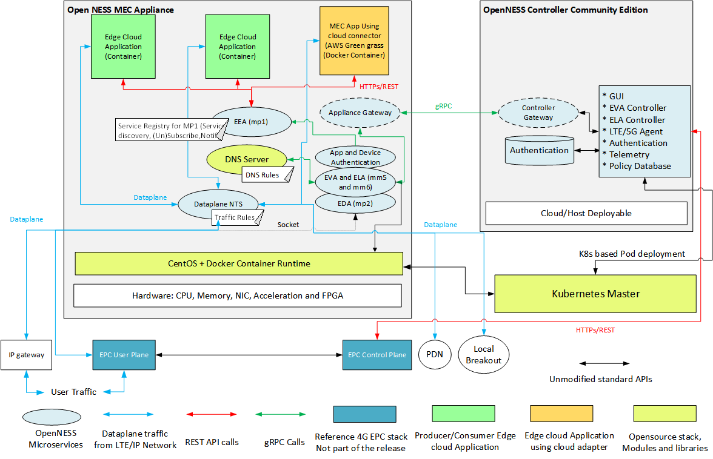
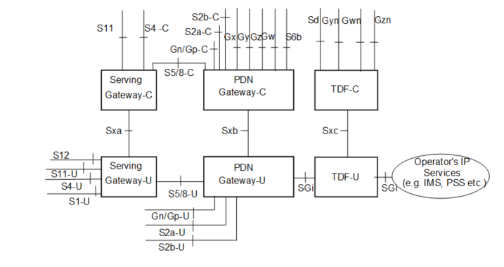
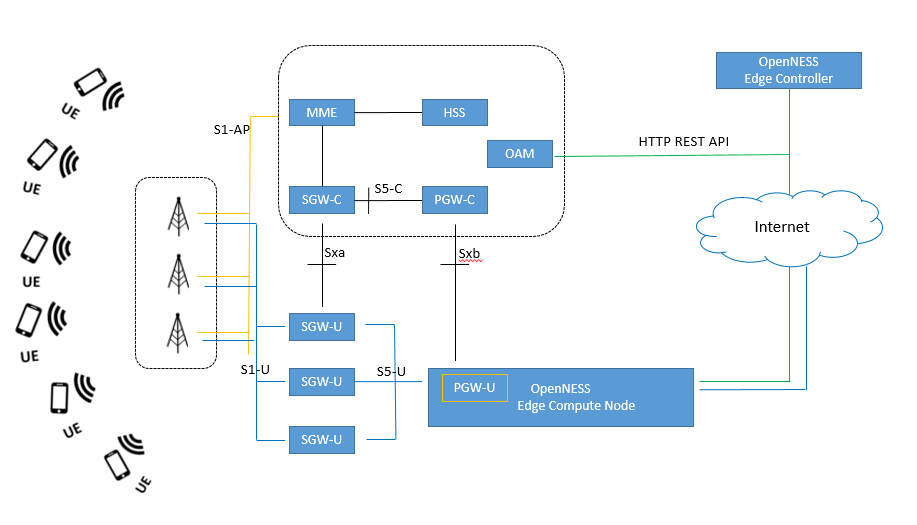
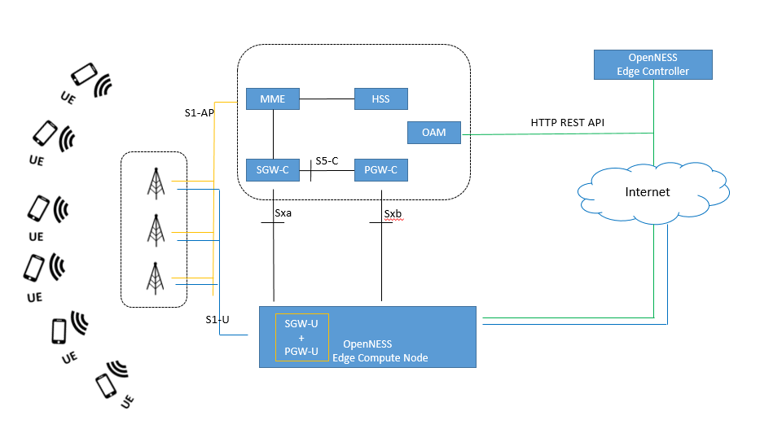
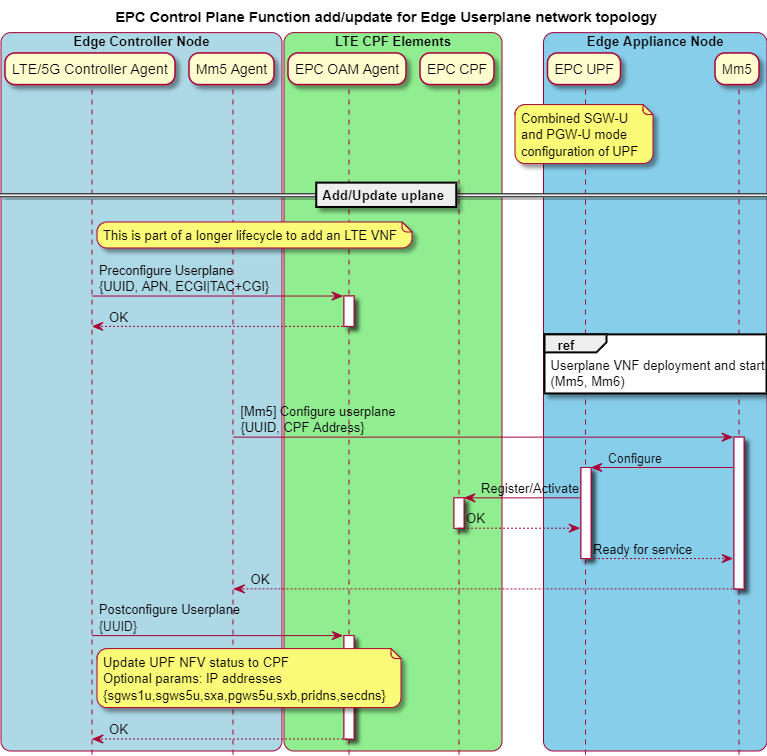
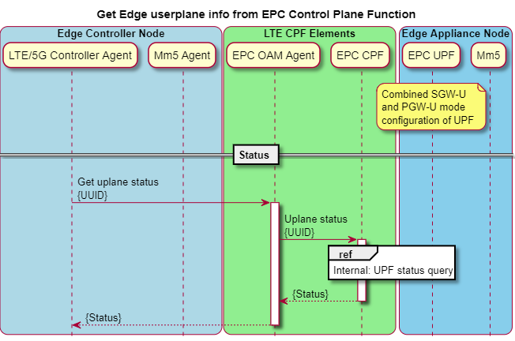
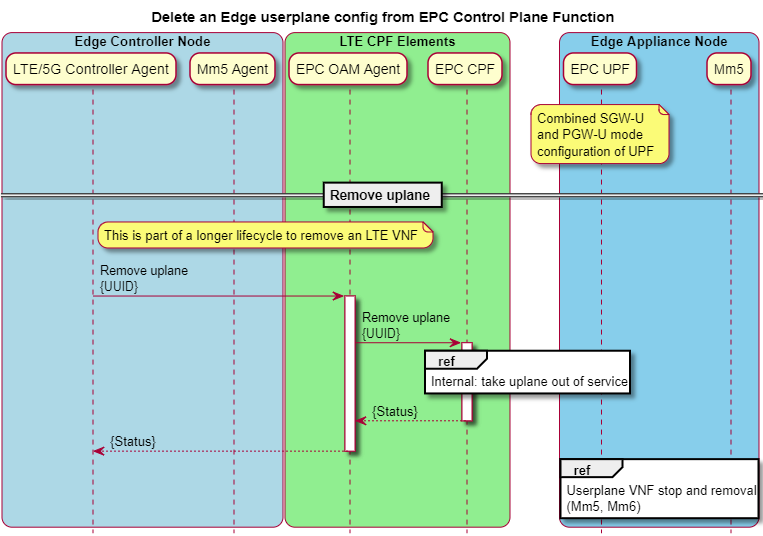
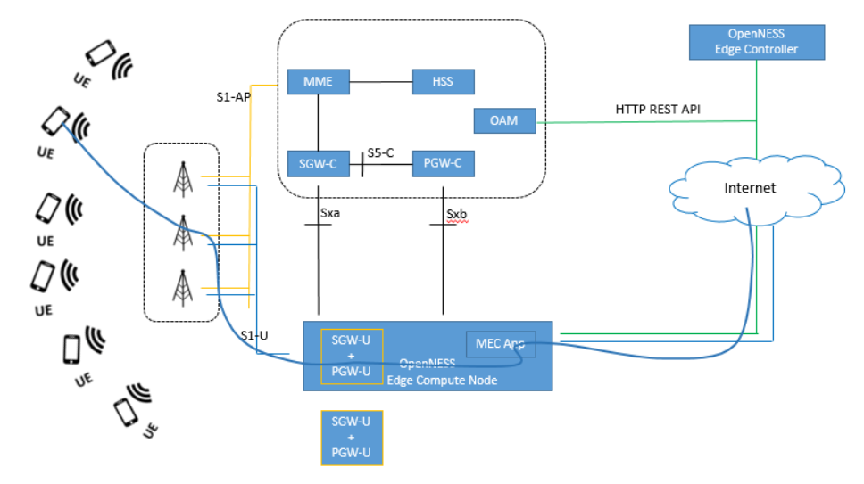
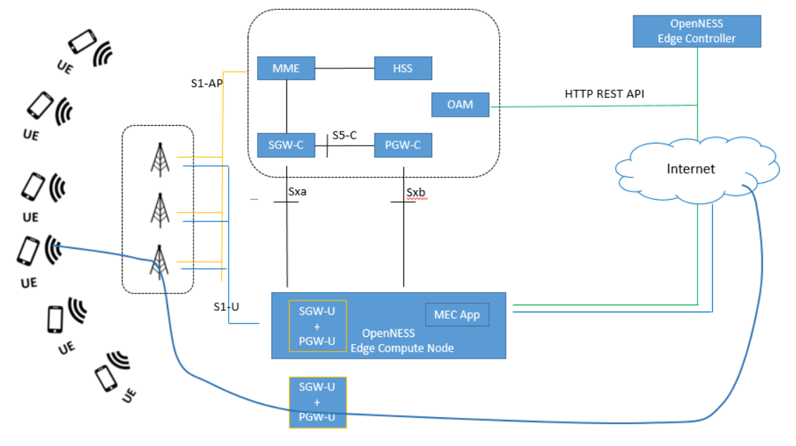

SPDX-License-Identifier: Apache-2.0
Copyright © 2019 Intel Corporation and Smart-Edge.com, Inc.

# Edge Cloud Deployment with 3GPP 4G LTE CUPS of EPC
  - A white paper for reference architecture suggested using OpenNESS solution  

* [Abstract](#abstract)
* [Introduction](#introduction)
* [4G LTE CUPS architectural aspects](#4g-lte-cups-architectural-aspects)
* [Implementation guidelines for Edge solutions](#implementation-guidelines-for-edge-solutions)
* [OpenNESS solution space](#Openness-solution-space)
  * [OpenNESS suggested API flows for CUPS integration](#openness-suggested-api-flows-for-cups-integration)
  * [JSON schema for userplane API endpoint](#json-schema-for-userplane-api-endpoint)
  * [Further recommendations for more controlled subscriber data steering](#further-recommendations-for-more-controlled-subscriber-data-steering)
  * [Validation-and-Data-path-models](#validation-and-data-path-models)
* [Summary](#summary)
 * [References](#references)
 * [List of Abbreviations](#list-of-abbreviations)

## Abstract
This white paper suggests multiple deployment models for Edge cloud when co-located with LTE userplane, also suggest HTTP REST based APIs for Edge Software Solution developers for configuring the EPC userplane when co-located with Edge compute platform. This white paper also discuss how these APIs are implemented in OpenNESS reference solution and tested with EPC solution with one of Intel partnered EPC vendor. Further technical directions are discussed for developers in userplane selection and application data traffic identification and steering methods.

## Introduction
Edge cloud deployment in 4G was not directly addressed by 3GPP. For 4G ETSI MEC (Multi-Access Edge Cloud) was the reference architecture. ETSI MEC proposed support for deployment of Edge Cloud both on S1-U, SGi and EPC CUPS deployment. With 5G 3GPP is looking at supporting edge computing in a more direct way. Technical Specification (TS) 23.501 (Clause 5.13) on the architecture for 5G Systems, where a set of new functional enablers are given for the integration of MEC in 5G networks.  Release 15 OpenNESS is an opensource edge cloud reference stack which in this current release supports 4G and in future intends to support 5G Edge cloud deployment. A high-level overview of the OpenNESS edge stack is provided in the diagram below. 

As part of the OpenNESS reference edge stack the OpenNESS controller community edition is used for configuring the traffic policy for CUPS EPC to steer traffic towards the edge cloud, This API is based on HTTP REST. This paper provides the context of APIs and how they were used to enable the deployment of Edge cloud in 4G CUPS EPC deployment. Since 3GPP or ETSI MEC does not provide reference for these APIs various implementation of this Edge Controller to CUPS EPC might exist. OpenNESS has tried to take the approach of minimal changes to 3GPP CUPS EPC to achieve the edge cloud deployment. OpenNESS and HTTP REST APIs to the EPC CUPS is a reference implementation so customers using OpenNESS can integrate their own HTTP REST APIs to the EPC CUPS into the OpenNESS Controller. Special care has been taken to make these components Modular microservices. 

## 4G LTE CUPS architectural aspects
One of the important items studied starting in 3GPP Release-14 is Control and User Plane Separation of EPC nodes, where the Control plane is responsible for signaling and User plane responsible for user data.   By now most of the Telecom operators has realized the advantage of CUPS implementation models by centralizing the signaling processing for millions of subscribers with a distributed user plane processing node located adjacent to radio access network locations.    

Architectural enhancement for Control plane and User plane separation suggested in 3GPP Rel-14 TS 23.214. 

Exponential growth in mobile subscribers use of wireless network for various use cases raised the demand for the requirements likes reduced latency in application data service, location-based content serving and many more.   Not to discuss further details of requirements and advantages of CUPS in LTE network to keep the focus of this writing around topic, selection of proper user plane function for processing a given subscriber(s) data is one of the key aspects to achieve the CUPS advantages. 

As the selection of Serving Gateway (SGW-U) and PDN Gateway (PGW-U) happens at UE initial attach process or PDN connection establishment phase, 3GPP standard suggests multiple ways to select SGW and PGWs.  Though implementation has flexibility to choose any method that best servers the Edge requirements, this technical writing would like to suggest one of those procedures for selection of user plane and steering subscriber’s data to closest userplane nodes, where the application data processing can be co-located with gateway. APN (or APN FQDN per 3GPP TS 23.003) can be used in selection process of PGW-U, following the selection of SGW-U can be based on TAC which is based on location of Network topology and UE current location. 

## Implementation guidelines for Edge solutions
Taking the advantage of 3GPP CUPS architecture into consideration, the OpenNESS reference solution would like to suggest co-located LTE Userplane along with the Edge compute nodes where subscribes application data can be processed is one of best implementation strategy for Edge solutions.     The term “Co-Located” can be taken loosely in implementation as any single solution model may not best fit in all types of deployment requirements.  Below three deployment models are further studied with respect to Edge deployment solutions. 

Deployment model – I:   S-GW, P-GW User planes and Edge compute node components are deployed as different nodes.   An Edge controller can centrally control and manage the Edge compute nodes which are co-located but physically deployed on different hardware platforms. 

Deployment model – II:  PDN GW Userplane is co-located along with Edge compute node on the same hardware platform and can be managed through VIM infrastructure of OpenNESS solution.  PDN GW userplane function can run on a bare-metal or Virtual machine or Containerized on OpenNESS Edge compute node platform. 

Deployment model – III:  Combined userplane with SGW and PGW functionality running on Edge compute node platform is one of the most preferred Edge solutions when possible.   Having a single gateway (sgw+pgw) reduces the hop count in dataplane path before processing subscriber’s data by applications launched at edge nodes.  Userplane functionality can be bare-metal or VM or containerized solution on edge compute node platform. 

## OpenNESS solution space
OpenNESS Reference solution provides the complete frame work for managing multiple Edge nodes through a centralized edge controller.   In case of co-located userplane and edge node deployment models, LTE user plane elements can be controlled through VIM infrastructure provided by OpenNESS reference solution.   OpenNESS suggests HTTP based REST APIs to configure and manage the LTE userplane components through the centralized Edge controller.  LTE network Operator’s Operation and Maintenance (OAM) elements can consume these APIs to open an interface for the Edge controllers to communicate for the management of userplane nodes launched at the Edge nodes.   It is being implicitly understood that OAM agent communication with EPC core components is always an implementation dependent from vendor to vendor in different operator’s environments. 
In order to keep the API interface simple and to the purpose, single HTTP API endpoint “/userplane” is being suggested with JSON formatted REST body with multiple optional fields to configure userplane instances launched through Edge controller.  Typical HTTP commands POST, PATCH, GET, and DELETE operations can be performed on this API for add, update, get and remove userplane configuration operations respectively.  

The parameters of this API endpoint can logically form into three groups 
- Userplane connectivity configuration 
- Userplane selection criteria 
- UE entitlement for further controlling traffic routed towards userplane. 

###	OpenNESS suggested API flows for CUPS integration
A high-level CUPS EPC configuration flow from OpenNESS controller community edition is shown in the diagram below. The HTTP REST API interface is only between OpenNESS controller community edition and Reference EPC control plane. The same API endpoint can be implimented at LTE Userplane to configure from Edge controller.  During the validation phase in the course of this writting, there are some predefined configuration for the CUPS EPC userplane that is used by the userplane at the startup . 

Below is the detailed sequence diagrams showing the API communication between Edge Controller and OAM Agent of EPC Control plane, Edge Controller and EPC User plane. These flows shown for configuration of combined userplane mode (ie., SGW-U + PGW-U) functionality. However similar flows can be visualized for other possible configuration of co-located userplane and Edge compute node deployment models. 

OpenNESS suggested API end point has be integrated and verified in an end-to-end lab conditions with one of the Intel partnered EPC vendor solution for completeness of this study.   

### JSON schema for userplane API endpoint

More details about the APIs can be found here [TBD EPC APIs - json](https://www.openness.org/resources). 

Parameter “Function” represents function of userplane.
default: NONE
- NONE: No function
-	SGWU: 4G serving gateway userplane (SGW-U)
-	PGWU: 4G packet data network (PDN) gateway userplane (PGW-U)
-	SAEGWU: 4G combination SGW-U and PGW-U
Except id, UUID and function parameters, rest of all the parameters are optional and can used based on operational requirements and capabilities of EPC solution.  
The above JSON parameters are grouped into three categories 
1. Config:  through which Sxx related IP address of userplane can be configured.  The requirement of this parameter(s) is implementation dependent, as EPC control plane can also learn Sxx interface configuration of userplane through other design logic. 
2. Selectors: allows userplane to bind to APN, TAC, etc.. in the control plane, so that UEs can be assigned to a particular userplane (PGW-U and/or SGW-U) at the time of initial attach or PDN selection. 
3. Entitlements: will allow further level of controlling in gateway selection for UEs at EPC Control plane through IMSIs.  It is recommended to use some level of indirect reference of IMSIs (proprietary to operators network) to identify UEs rather than IMSI itself. 

### Further recommendations for more controlled subscriber data steering
In addition to the APN (for PDN GW selection) and TAC (for S-GW selection),  specific UE level configuration in entitling the subscribers to use the Edge resources can be made for controlled subscriber data steering and processing.   This can be achieved by Edge controller configuring which UEs allowed to use Edge compute node resources.   Though the OpenNESS referenced API shows the IMSI to identify UE uniquely during entitlement configuration, UE tagging is left out as implementation decision as it is not suggested to exposed IMSI information outside the operator’s environment scope for multiple reasons. 

Application data filtering functionality for processing at the edge can be further implemented in the PDN Gateway data pipeline itself to reduce overhead of data processing in Edge compute node data plane. Indeed, many of EPC solutions already supports application level packet filtering based on 5-tuples through proprietary implementation, which can be leveraged and extended for Edge solutions. 

###	Validation and Data path models 

Below listed various data paths has been exercised using the OpenNESS reference solution by configuring the userplane through the suggested APIs in lab environment. 

#### UE selects a particular PGW-U (based on APN) and SGW-U based on TAC.  Subscriber’s application data is processed at the MEC application launched at the OpenNESS Edge compute node. 

#### UE selects a particular PGW-U (based on APN) and SGW-U based on TAC. Subscriber’s application data is processed at MEC application launched at OpenNESS Edge compute node and has been sent back to PDN for further processing. 

#### UE selects a particular PGW-U (based on APN) and SGW-U based on TAC.  Subscriber’s application data is not configured for Edge location processing. 

#### UE connects to a different Userplane function, as its location and APN configurations are different and are not in Edge service location. Hence, subscriber’s application data uses a different UPF to reach PDN. 

## Summary
As mentioned above, any single solution may not be a best fit for all deployment models considering operators requirements and challenges.  In case of Edge deployments, Edge controllers plays a major role in managing and controlling multiples of Edge compute nodes which may have a co-located UPF. Through this technical writing OpenNESS reference solution would like to publish a suggested API interface for configuring 3GPP 4G/LTE CUPS based userplane from Edge controller when co-located with Edge compute nodes. Network operator’s OAM agents may consume this APIs into their operations infrastructure interface to adapt to the Edge solutions evolved over period of time based on OpenNESS reference architecture.  3GPP 5G standards has been taken care some of these configuration aspects through well-defined service-based architecture by defined AF and NEF components, in particularly Northbound APIs of NEF (in 5G TS 29522V150000p) more refer to traffic routing policy with few parameters exposed to third party. But from a deployment perspective may not be able to directly influence UPF, thus we still see the need for this kind of APIs in case of Edge deployments. 

## References
-	ETSI GS MEC 003 V1.1.1, “Mobile Edge Computing (MEC); Framework and Reference Architecture” (2016-03)
-	TS 23.214 Architecture enhancements for control and user plane separation of EPC nodes.
-	TS 29.244 Interface between the Control Plane and the User Plane of EPC Nodes.
-	TS 29.303 DNS procedures for UP function selection  
-	Control and User Plane Separation of EPC nodes (CUPS) (https://www.3gpp.org/cups)
-	3GPP TS 23.501 V15.1.0, “3rd Generation Partnership Project; Technical Specification Group Services and System Aspects; System Architecture for the 5G System; Stage 2 (Release 15)” (2018-03)

## List of Abbreviations
- OpenNESS: Open Network Edge Services Software
- MEC: Multi-Access Edge Computing
- ETSI: European Telecommunications Standards Institute
- LTE: Long-Term Evolution
- EPC: Evolved Packet Core
- MME: Mobility Management Entity
- SGW: Serving Gateway
- PGW: PDN Gateway
- PDN: Packet Data Network
- CUPS: Control and User Plane Separation
- UE: User Equipment in the context of LTE
- APN: Access Point Name
- TAC: Tracking Area Code
- MNC: Mobile Network Code
- MCC: Mobile Country Code
- NEF: Network Exposure Function
- AF: Application Function
- FQDN: Fully Qualified Domain Name
- OAM: Operations, Administration and Maintenance
- HTTP: Hyper Text Transfer Protocol
- REST: REpresentational State Transfer
- JSON:	JavaScript Object Notation
- API: Application Programming Interface
- VIM: Virtualized Infrastructure Manager 
- UUID: Universally Unique IDentifier 
